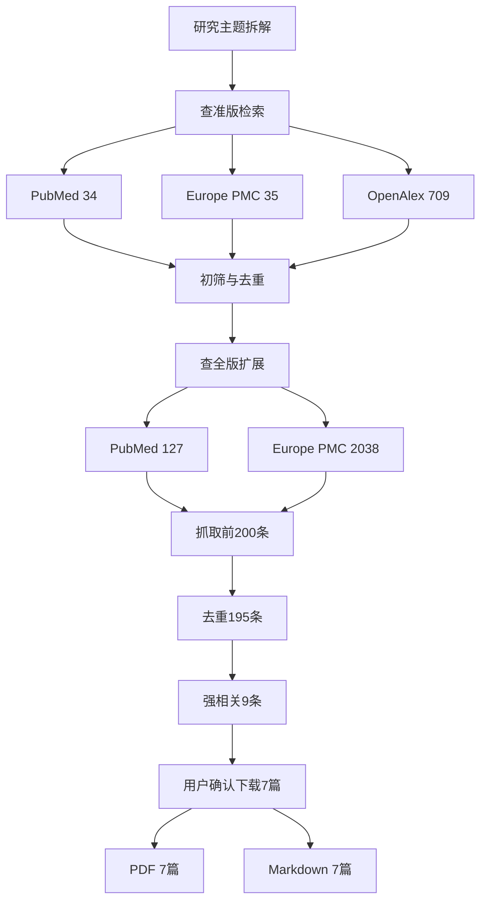

# 方法
围绕“呼吸道上皮细胞受体条形码突变库在 SARS-CoV-2 感染易感性中的作用研究”，本次先后执行查准版与查全版检索。数据库包括 PubMed、Europe PMC/PMC、OpenAlex，并尝试 Semantic Scholar；PubMed 用于医学核心题录，Europe PMC/PMC 用于开放全文和预印本线索，OpenAlex 用于补充跨库题录与 OA 链接。检索时间范围为 2020-2026 年，语言以英文为主，类型优先纳入机制性原始研究，综述仅作背景。
MeSH/主题概念包括 SARS-CoV-2、COVID-19、respiratory tract、epithelial cells、ACE2、TMPRSS2、viral entry。自由词包括 airway epithelial cells、bronchial epithelial cells、nasal epithelial cells、primary human airway、Calu-3、airway organoid、host factor、dependency factor、restriction factor、CRISPR screen、Perturb-seq、barcoded library、mutant library、deep mutational scanning、susceptibility、permissiveness、infectivity。
# 完整检索式
PubMed：
```text
(SARS-CoV-2 OR COVID-19 OR coronavirus) AND (airway epithelial OR respiratory epithelial OR bronchial epithelial OR nasal epithelial OR primary human airway OR Calu-3 OR airway organoid OR lung organoid) AND (ACE2 OR TMPRSS2 OR NRP1 OR AXL OR TIM-1 OR TIM-4 OR CD147 OR BSG OR receptor OR coreceptor OR host factor OR dependency factor OR restriction factor OR viral entry) AND (CRISPR OR genome-wide screen OR pooled screen OR Perturb-seq OR barcoded OR barcode OR mutant library OR deep mutational scanning OR saturation mutagenesis OR receptor engineering) AND (susceptibility OR permissiveness OR infection OR infectivity OR tropism OR replication) AND (2020:2026[pdat])
```
Europe PMC：
```text
(SARS-CoV-2 OR COVID-19) AND ("airway epithelial" OR "respiratory epithelial" OR "bronchial epithelial" OR "nasal epithelial" OR "Calu-3" OR "primary human airway" OR "airway organoid" OR "lung organoid") AND (ACE2 OR TMPRSS2 OR NRP1 OR AXL OR "TIM-1" OR "TIM-4" OR CD147 OR BSG OR receptor OR "host factor" OR "dependency factor" OR "restriction factor" OR "viral entry") AND (CRISPR OR "genome-wide screen" OR "pooled screen" OR Perturb-seq OR barcoded OR barcode OR "mutant library" OR "deep mutational scanning" OR "saturation mutagenesis" OR "receptor engineering")
```
OpenAlex：
```text
SARS-CoV-2 airway epithelial organoid ACE2 TMPRSS2 host factor CRISPR screen barcoded mutant library deep mutational scanning susceptibility
```
# 结果
查准版命中 PubMed 34 条、Europe PMC 35 条、OpenAlex 709 条；Semantic Scholar 因限流未计入。查全版命中 PubMed 127 条、Europe PMC 2038 条，抓取前 200 条后去重 195 条，标题/摘要筛选得到强相关 9 条、中等相关 60 条。最终按用户确认纳入并下载 7 篇全文，PDF 7 篇，Markdown 7 篇。

| 序号 | 核心文献 | 研究设计与证据等级 | 关键发现 |
|---|---|---|---|
| 1 | Perturb-seq host factors, Nat Commun 2023 | 人肺上皮细胞遗传扰动+单细胞读出，机制实验，证据等级：细胞机制 | 将宿主因子扰动与感染阶段、干扰素反应关联，支持条形码/单细胞扰动库路线 |
| 2 | DAZAP2 restriction factor, mBio 2025 | 全基因组 CRISPR KO、动物和人原代气道上皮验证，证据等级：机制+体内前临床 | DAZAP2 抑制病毒进入和基因组复制，敲除增强感染 |
| 3 | Mucins modulate infection, Nat Genet 2022 | 双向全基因组 CRISPR 筛选，证据等级：高质量细胞机制 | 黏蛋白作为宿主因子调节 SARS-CoV-2 感染 |
| 4 | ACE2 KO iPS airway/alveolar cells, Front Cell Dev Biol 2023 | iPS 来源气道/肺泡上皮 ACE2 敲除，证据等级：细胞模型验证 | ACE2 缺失显著阻碍 SARS-CoV-2 传播 |
| 5 | CRISPR/Cas9 organoid biobank, Nat Commun 2021 | 基因工程类器官库，证据等级：类器官机制 | 识别冠状病毒感染所需宿主因子 |
| 6 | TMEM106B host factor, Nat Genet 2021 | 全基因组 CRISPR 筛选，证据等级：细胞机制 | TMEM106B 被识别为 SARS-CoV-2 促病毒宿主因子 |
| 7 | CRISPR screen host factors regulating entry, Nat Commun 2021 | 全基因组 CRISPR 筛选，证据等级：细胞机制 | 识别调控 SARS-CoV-2 进入的宿主因子，并提示 ACE2 表面表达相关调控 |
# 检索流程图

# 讨论
现有文献尚未形成“呼吸道上皮细胞受体条形码突变库直接解释 SARS-CoV-2 易感性”的完全同题研究，但证据链充分：CRISPR/Perturb-seq 可提供扰动库框架，ACE2/TMPRSS2/TMEM106B/DAZAP2/黏蛋白等提示受体和宿主因子调控感染，类器官和 iPS 气道上皮模型可支撑生理相关性。后续若做课题设计，建议以“膜蛋白/受体候选库 + 条形码扰动 + 人气道上皮或类器官感染读出”为核心路线。

