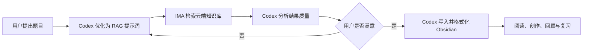

# 核心构想
利用 IMA 的云端知识库资源生态，把 IMA 作为一个超大型外部知识库。通过加入不同知识库并获得访问权限，可以按需接入大量由他人整理的资料，不必预先下载和长期保存在本地硬盘。
这些资料可能包括大部头教材、专题资料、共享资料，以及部分内部流通、版权获取困难或不易直接下载的内容。其价值不只是云端存储，而是资料数量多、内容相对完整，并且能借助 IMA 的 RAG 能力直接检索和生成答案。
> [!important] 基本原则
> IMA 保存和检索外部资料，Codex 负责统筹、判断与加工，Obsidian 负责个人沉淀、人工创作和复习阅读。
# 三个平台的定位
## IMA：云端资料层
- 通过加入知识库获得相应资料的访问权限。
- 按需扩充知识库，不必提前准备所有领域的资料。
- 保存大体量原始资料，减少本地硬盘占用。
- 使用 IMA 内置模型和 RAG 系统完成知识库检索与初步回答。
- 当前检索环节可以利用 IMA 提供的智谱、DeepSeek 等模型，降低额外模型调用成本。
## Codex：统一工作台
- 接收用户题目并识别真正目标。
- 把普通问题优化成适合 IMA RAG 检索的提示词。
- 通过 `ima-skill` 连接 IMA、提交检索请求并接收结果。
- 分析返回结果的完整性、可靠性、相关性和结构质量。
- 根据用户反馈调整检索范围、问题拆分、证据要求和输出结构。
- 将最终答案加工成适合长期保存与复习的内容。
- 直接操作 Obsidian，完成写入、链接和格式化。
## Obsidian：个人知识层
- 作为 Codex 的长期项目空间。
- 作为个人知识沉淀容器，而不是大体量原始资料仓库。
- 作为人工创作助手的工作界面，方便继续修改、补充和建立链接。
- 作为复习资料阅读器，承载讲义、总结、对照表、自测题和复习索引。
# 标准工作流
1. 用户提出题目并交给 Codex。
2. Codex 分析目标，把题目改写成适合 IMA RAG 检索的提示词；必要时拆成多个子问题。
3. Codex 通过 `ima-skill` 连接 IMA，在用户已加入且有权访问的知识库中搜索相关内容并取得回答或原文信息。
4. Codex 分析 IMA 返回结果的质量，包括覆盖范围、证据充分性、内部矛盾、遗漏内容和是否真正回答题目。
5. 用户判断结果是否满足需要，并决定调整方向，例如扩大范围、限定教材、补充细节、改变结构或要求比较不同来源。
6. 重复“优化提示词—检索—质量分析—用户调整”，直到得到高质量答案。
7. Codex 将最终内容写入 Obsidian，按个人格式完成标题、层级、链接、重点、来源和复习结构整理。
8. 用户在 Obsidian 中阅读、修改、回顾和复习，形成长期可积累的个人知识。

# 运行原则
- **按需加入知识库**：没有现成资源时，再到 IMA 中加入新的相关知识库，不追求提前囤积全部资料。
- **迭代优于一次生成**：把第一次回答当作检索样稿，通过多轮调整逐步提高质量。
- **原始资料与个人知识分离**：大体量资料留在 IMA，Obsidian 只保存经过加工、值得长期保留的内容。
- **Codex 统一调度**：用户不需要分别管理检索、分析、写作和格式化，全部从 Codex 发起。
- **保留来源线索**：最终笔记尽量记录知识库名称、资料标题、原文定位和检索日期，避免日后无法核验。
- **访问不等于所有权**：内部资料、版权受限资料或难下载资料只能在授权范围内使用；获得访问权限不等于获得复制、传播或再发布权。
- **重要结论需要核验**：IMA 返回的生成答案不是原文证据本身。涉及医学、科研或关键决策时，应要求读取原文、比较来源并标出不确定性。
# 推荐指令模板
> [!example] 通用指令
> 围绕“〔题目〕”分析我的真实目标，把问题改写成适合 IMA RAG 的检索提示词。通过 IMA 搜索我有权访问的相关知识库，评估返回结果的覆盖度、证据质量和遗漏。先把结果与调整建议交给我确认；未达到要求时继续迭代。确认后整理成适合复习的 Obsidian 笔记，保留来源线索并按个人格式写入指定文件夹。
# 当前决定
- 暂时把它作为人工协作工作流使用。
- 暂不封装成 skill、插件或自动化流程。
- 先在真实任务中反复使用，观察稳定步骤、常见失败点和必要输入。
- 只有当流程足够稳定、重复次数足够多时，再考虑封装。
