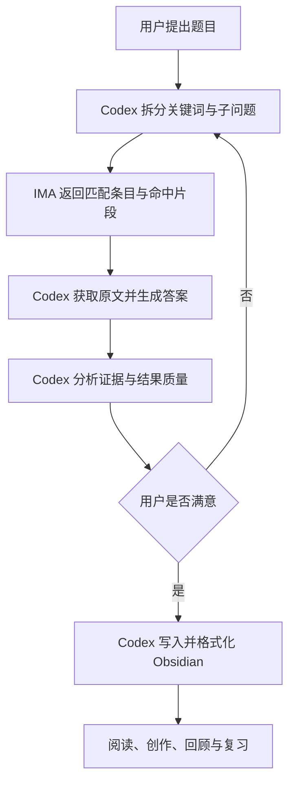

# 核心构想
利用 IMA 的云端知识库资源生态，把 IMA 作为一个超大型外部知识库。通过加入不同知识库并获得访问权限，可以按需接入大量由他人整理的资料，不必预先下载和长期保存在本地硬盘。
这些资料可能包括大部头教材、专题资料、共享资料，以及部分内部流通、版权获取困难或不易直接下载的内容。其价值不只是云端存储，而是资料数量多、内容相对完整，并且可以通过 IMA OpenAPI 按知识库搜索条目、取得命中片段，并在权限允许时获取原文访问入口。
> [!note] 使用者观察与官方能力的区别
> “知识库数量很多、内容较完整，可能含内部流通或难以取得的资料”来自实际使用观察，不是 IMA 官网或 OpenAPI 对资源规模、质量、版权状态和持续可用性的保证。已确证的是：加入并获得访问权限后，`ima-skill` 可以搜索该知识库，并按条目尝试取得原文入口。

> [!important] 基本原则
> IMA 保存和检索外部资料，Codex 负责统筹、判断与加工，Obsidian 负责个人沉淀、人工创作和复习阅读。
# 三个平台的定位
## IMA：云端资料层
- 通过加入知识库获得相应资料的访问权限。
- 按需扩充知识库，不必提前准备所有领域的资料。
- 保存大体量原始资料，减少本地硬盘占用。
- 通过 OpenAPI 查询知识库、浏览目录、搜索条目并取得命中片段。
- 对可访问条目返回文件或网页的访问地址；对 IMA 笔记可进一步读取正文。
- 当前 `ima-skill 1.1.7` 没有暴露 IMA 内置模型的对话或 RAG 问答接口，不能把 IMA 产品端的智谱、DeepSeek 等模型能力计入这条 Codex 工作流。
## Codex：统一工作台
- 接收用户题目并识别真正目标。
- 把普通问题拆成适合知识库搜索的关键词、同义词和子问题。
- 通过 `ima-skill` 连接 IMA，指定知识库并取得匹配条目与高亮片段。
- 对候选条目逐项获取可访问原文，由 Codex 阅读、比较和生成答案。
- 分析检索结果与原文的完整性、可靠性、相关性和结构质量。
- 根据用户反馈调整检索范围、问题拆分、证据要求和输出结构。
- 将最终答案加工成适合长期保存与复习的内容。
- 直接操作 Obsidian，完成写入、链接和格式化。
## Obsidian：个人知识层
- 作为 Codex 的长期项目空间。
- 作为个人知识沉淀容器，而不是大体量原始资料仓库。
- 作为人工创作助手的工作界面，方便继续修改、补充和建立链接。
- 作为复习资料阅读器，承载讲义、总结、对照表、自测题和复习索引。
# 标准工作流
1. 用户提出题目并交给 Codex。
2. Codex 分析目标，把题目拆成适合知识库搜索的关键词、同义词和子问题。
3. Codex 通过 `ima-skill` 连接 IMA，在用户已加入且有权访问的指定知识库中搜索，取得匹配条目、标题和高亮命中片段。
4. Codex 从候选条目中获取可访问的文件、网页或笔记原文；无法通过接口取得原文的条目需要在 IMA 客户端查看，不能假装已经读取。
5. Codex 依据检索结果和实际取得的原文生成答案，并分析覆盖范围、证据充分性、内部矛盾和遗漏内容。
6. 用户判断结果是否满足需要，并决定调整方向，例如扩大范围、更换知识库、补充同义词、限定教材或比较不同来源。
7. 重复“调整检索策略—搜索条目—读取原文—Codex 生成—质量分析”，直到得到高质量答案。
8. Codex 将最终内容写入 Obsidian，按个人格式完成标题、层级、链接、重点、来源和复习结构整理。
9. 用户在 Obsidian 中阅读、修改、回顾和复习，形成长期可积累的个人知识。

# 运行原则
- **按需加入知识库**：没有现成资源时，再到 IMA 中加入新的相关知识库，不追求提前囤积全部资料。
- **迭代优于一次生成**：把第一次搜索结果和 Codex 答案当作样稿，通过多轮调整逐步提高质量。
- **原始资料与个人知识分离**：大体量资料留在 IMA，Obsidian 只保存经过加工、值得长期保留的内容。
- **Codex 统一调度**：用户不需要分别管理检索、分析、写作和格式化，全部从 Codex 发起。
- **保留来源线索**：最终笔记尽量记录知识库名称、资料标题、原文定位和检索日期，避免日后无法核验。
- **访问不等于所有权**：内部资料、版权受限资料或难下载资料只能在授权范围内使用；获得访问权限不等于获得复制、传播或再发布权。
- **重要结论需要核验**：IMA 搜索返回的高亮片段不是完整原文，Codex 生成的答案也不是原文证据。涉及医学、科研或关键决策时，应读取原文、比较来源并标出不确定性。
# 接口事实与能力边界
> [!important] 已确证的数据链路
> Codex → IMA OpenAPI → 搜索指定知识库 → 返回匹配条目与高亮片段 → 获取条目访问入口 → Codex 读取原文并生成答案。
- `search_knowledge` 每次必须指定一个知识库，接收关键词和游标，返回条目标题、媒体类型、父文件夹、媒体标识及 `highlight_content`。
- 2026-07-13 线上只读实测中，搜索响应包含 `highlight_content`，不包含 `answer`。
- `get_media_info` 可以为可访问文件或网页返回 `url` 与 `headers`；IMA笔记可转到笔记正文接口；某些条目可能不给原文入口。
- 2026-07-13 线上只读实测中，一个PDF条目成功返回 `url_info`，其中只有 `url` 与 `headers`，不包含模型答案。
- 当前完整接口清单没有 `chat`、`ask`、`completion`、模型选择或 RAG 答案接口。
- IMA产品本身可以具有AI问答和多模型能力，但不能由此推断 `ima-skill 1.1.7` 已向Codex开放这些能力。
- 因此，这不是“把IMA对话结果复制给Codex”，也不是“把所有知识库挂载成本地只读文件系统”，而是把有权访问的知识库变成Codex可以远程搜索、浏览并按条目尝试读取原文的云端资料源。
- Skill当前没有跨全部知识库的一次性统一搜索接口。需要先确定知识库，再逐库搜索；原文也需要按条目获取。
# 推荐指令模板
> [!example] 通用指令
> 围绕“〔题目〕”分析我的真实目标，把问题拆成适合知识库搜索的关键词、同义词和子问题。通过 IMA 逐个搜索我有权访问的相关知识库，取得匹配条目和高亮片段，再读取能够通过接口访问的原文。由Codex根据原文生成答案，评估覆盖度、证据质量和遗漏；无法取得原文的内容必须明确标注。先把结果与调整建议交给我确认，未达到要求时继续迭代。确认后整理成适合复习的 Obsidian 笔记，保留来源线索并按个人格式写入指定文件夹。
# 证据与验证记录
- **IMA Agent Interface官网**：[安装与核心功能页面](https://ima.qq.com/agent-interface)。页面将技能能力表述为“查询知识库与内容列表”和“获取文件与网页链接”，没有宣称开放模型问答接口。
- **腾讯认证SkillHub全文**：[ima-skills v1.1.7](https://skillhub.tencent.com/skills/ima-skills)。发布者为已认证的 `tencent-ima`，页面全文与已安装官方ZIP的主 `SKILL.md` 一致，列出笔记和知识库的读、写、搜索及原文获取能力。
- **官方技能包**：[ima-skills-1.1.7.zip](https://app-dl.ima.qq.com/skills/ima-skills-1.1.7.zip)。核对了主技能文档、`knowledge-base/SKILL.md`、完整API参考和执行脚本。
- **接口结构核对**：完整API参考将 `search_knowledge` 定义为条目搜索，将 `get_media_info` 定义为媒体访问入口；未定义RAG回答接口。
- **线上只读实测**：2026-07-13 使用已配置凭证调用知识库列表、目录、搜索和媒体信息接口，只检查字段结构，不记录知识库名称、文件名、命中内容、内部ID或原文URL。
- **验证结论** ✅：`ima-skill 1.1.7` 让Codex接触知识库条目、高亮片段和部分原文入口，由Codex完成最终分析与写作。
- **未获支持的原说法** ❌⚠️：当前没有证据证明 Codex 可通过该 skill 调用 IMA 内置的智谱、DeepSeek 等模型完成 RAG 问答，也没有证据证明该环节因而免费。
- **使用者观察** ⚠️：IMA 中可按需加入大量知识库，但具体资源规模、内容完整性、版权状态、访问期限和能否通过 OpenAPI 取得原文，需要逐库、逐条验证。
- **验证日期**：2026-07-13。
- **验证方式**：官方动态页面全文、腾讯认证SkillHub、官方ZIP全文、接口字段检索、线上只读结构实测。
# 当前决定
- 暂时把它作为人工协作工作流使用。
- 暂不封装成 skill、插件或自动化流程。
- 先在真实任务中反复使用，观察稳定步骤、常见失败点和必要输入。
- 只有当流程足够稳定、重复次数足够多时，再考虑封装。
