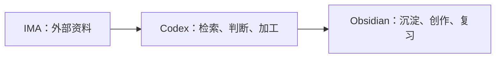

# 当前策略
我的 AI 使用以“轻任务用轻工具、重科研用 Codex、知识成果沉淀到 Obsidian”为原则。
- 日常办公与常规 Agent 任务：优先使用 Workbuddy，其办公软件适配更好。
- 备选工具：TRAE，用于 Workbuddy 不适合或不能完成的任务。
- 重大科研、复杂分析和需要可靠工具链的重任务：使用翻墙后的官方 Codex。
- Claude Code：回国后不再作为常用方案，原因是账号风险和成本较高。
- Codex：不作为日常轻任务工具；闲置时可考虑出租。
# 知识工作流
遵循 [[IMA—Codex—Obsidian工作流]]：IMA 是按需接入的云端资料层，Codex 负责检索调度、分析和写作，Obsidian 保存经过加工、值得长期复习和创作的个人知识。

# 远程工作方式
目前已配置三种远程工作路径：UU 远程、Tailscale 和 WiFi 网关。

|方式|当前定位|网络与成本判断|使用限制|
|---|---|---|---|
|UU 远程|短时远程连接|流量消耗较大；仅在所经网络为不限量 WiFi 时适合较长使用|若消耗宿舍流量，只能短时连接|
|Tailscale|通过爱马仕远程控制的组网路径|使用体验预期接近 WiFi 直连|国内网络可用性、延迟和稳定性尚未实际验证|
|WiFi 网关|已配置的第三种远程工作路径|具体网络行为与流量成本尚未记录|需补充实际连通性、适用网络和安全边界|
# 选择规则
- 在宿舍流量受限时，避免用 UU 远程进行长时间工作。
- 所经网络为不限量 WiFi 时，UU 远程可用于需要短期快速接入的任务。
- 需要像同网环境一样操作爱马仕时，优先测试 Tailscale；实际可用后再作为常用外网方案。
- WiFi 网关在补齐实际测试前，不预设其适用网络、流量表现或安全性。
- 任何远程方案先满足“能稳定连上”，再处理 AI 任务；不要把网络故障误判为 Codex、爱马仕或工作流本身故障。
# 待验证项
- Tailscale 在中国大陆不同网络环境下的连接成功率、延迟和稳定性。
- WiFi 网关可访问的实际网络范围与安全边界。
- UU 远程的实际流量消耗，以及宿舍流量额度下可接受的单次连接时长。
# 信息来源与状态
- AI 工具分工与 IMA—Codex—Obsidian 链路：依据 [[IMA—Codex—Obsidian工作流]]。
- 三种远程方式及流量判断：使用者当前说明，尚未在本笔记中进行连通性和流量实测。
