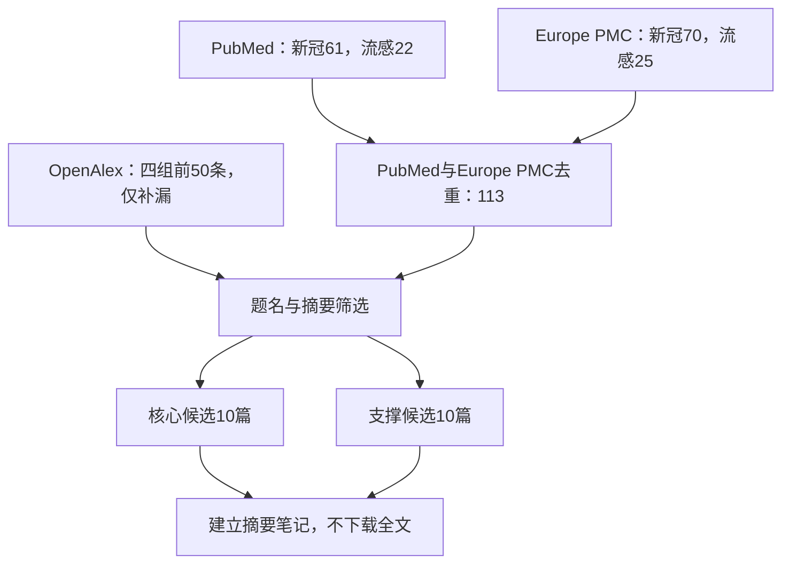

# 检索边界与当前结论
本轮只检索气道类器官在SARS-CoV-2和流感病毒研究中的贡献。纳入鼻、气管、支气管和气道上皮类器官；气道类器官衍生培养仅在其类器官来源和贡献可追溯时纳入。排除肺、肺泡、肠道及其他非气道类器官，排除综述、评论、无感染结果的方法论文及预印本与正式论文的重复版本。
当前已完成查准版题录与摘要筛选，并为10篇核心候选和10篇支撑候选建立摘要笔记；未下载全文。“不可替代”均为待全文核验的候选判断，不能直接写入正文。
# 检索方法
检索日期：2026-08-13。时间范围：数据库建库至检索日。语言不限。文献类型以原始研究为主，综述只用于补充引文链，不进入核心证据。
PubMed负责规范题录和MeSH/题名摘要检索；Europe PMC负责开放全文状态、预印本和PMC补漏；OpenAlex负责题名补漏和前向引文线索。
SARS-CoV-2代表检索式：`("airway organoid*"[Title/Abstract] OR "airway epithelial organoid*"[Title/Abstract] OR "nasal organoid*"[Title/Abstract] OR "bronchial organoid*"[Title/Abstract] OR "tracheal organoid*"[Title/Abstract]) AND ("SARS-CoV-2"[Title/Abstract] OR "COVID-19"[Title/Abstract])`
流感代表检索式：`("airway organoid*"[Title/Abstract] OR "airway epithelial organoid*"[Title/Abstract] OR "nasal organoid*"[Title/Abstract] OR "bronchial organoid*"[Title/Abstract] OR "tracheal organoid*"[Title/Abstract]) AND (influenza[Title/Abstract] OR "influenza A virus"[Title/Abstract] OR "influenza B virus"[Title/Abstract] OR IAV[Title/Abstract] OR IBV[Title/Abstract])`
Europe PMC使用同一概念组并限制`TITLE_ABS`；OpenAlex分别运行`SARS-CoV-2 airway organoid`、`COVID-19 nasal organoid`、`influenza airway organoid`和`influenza nasal organoid`。
# 检索结果

| 病毒 | PubMed原始命中 | Europe PMC原始命中 | 两库去重 | 题名/摘要筛选 | 核心候选 | 支撑候选 |
| --- | ---: | ---: | ---: | ---: | ---: | ---: |
| SARS-CoV-2 | 61 | 70 | 85 | 85 | 5 | 5 |
| 流感 | 22 | 25 | 28 | 28 | 5 | 5 |
| 合计 | 83 | 95 | 113 | 113 | 10 | 10 |
OpenAlex四次检索各返回前50条排序结果，但其MCP结果与公开API总量接口不一致，且噪声显著，因此只用于题名补漏，不纳入命中数和去重数统计。
# 核心候选文献

| 病毒 | 原始研究 | 可能形成的论证单元 | 当前判断 |
| --- | --- | --- | --- |
| SARS-CoV-2 | Mykytyn等，2021，eLife，DOI: 10.7554/eLife.64508 | 细胞系中的蛋白酶使用不能代表气道；气道类器官显示多碱性切割位点促进丝氨酸蛋白酶介导的进入 | 强“纠正模型假象”候选 |
| SARS-CoV-2 | Chiu等，2022，mBio，DOI: 10.1128/mbio.01944-22 | 鼻类器官重现Delta/Omicron感染力差异、纤毛损伤和紧密连接破坏 | 强“组织特异传播机制”候选 |
| SARS-CoV-2 | Chan等，2022，Nature Communications，DOI: 10.1038/s41467-022-35253-x | COPD供体支气管类器官保留杯状细胞增生和低纤毛频率，并显示增强的病毒复制及炎症 | 强“患者特异易感性”候选 |
| SARS-CoV-2 | Mykytyn等，2023，Journal of Virology，DOI: 10.1128/jvi.00851-23 | 细胞系提示Omicron依赖组织蛋白酶，气道类器官却显示其仍依赖TTSP | 直接“纠正细胞系结论”候选 |
| SARS-CoV-2 | Wan等，2025，PNAS，DOI: 10.1073/pnas.2509616122 | 传统细胞系中和实验低估部分临床有效抗体；鼻类器官重现真实世界疗效 | 强“传统检测漏判”候选 |
| 流感 | Zhou等，2018，PNAS，DOI: 10.1073/pnas.1806308115 | 分化气道类器官区分高人感染力与低人感染力毒株，并保留纤毛细胞、杯状细胞、Club细胞、基底细胞及气道蛋白酶 | 强“人感染力预测”候选 |
| 流感 | Hui等，2018，Lancet Respiratory Medicine，DOI: 10.1016/S2213-2600(18)30236-4 | 类器官中的复制、细胞嗜性和宿主反应与人支气管外植体相符 | 强“替代稀缺人组织”候选，未必是唯一发现 |
| 流感 | Bui等，2019，European Respiratory Journal，DOI: 10.1183/13993003.00008-2019 | 气道类器官系统显示IBV可感染纤毛、Club、杯状和基底细胞，并揭示毒株特异而非谱系特异的致病差异 | 强“多细胞嗜性”候选 |
| 流感 | Wang等，2022，EMBO Molecular Medicine，DOI: 10.15252/emmm.202114485 | 类器官内源表达SPINK6；阻断SPINK6增强HA切割和病毒生长，连接分子机制、动物结果与人遗传保护 | 强“内源气道机制”候选 |
| 流感 | Li等，2026，Nature Communications，DOI: 10.1038/s41467-026-74345-w | N1抗体对H5N1的交叉中和只在类器官中和实验中显现，并受季节性流感疫苗增强 | 当前最强“传统实验漏判”候选 |
# 支撑候选文献

| 病毒 | DOI | 用途 |
| --- | --- | --- |
| SARS-CoV-2 | 10.1016/j.celrep.2021.109920 | HIF1α—糖酵解轴及类器官药物筛选 |
| SARS-CoV-2 | 10.1016/j.stemcr.2023.01.011 | TSPAN8促进不同变异株感染及细胞嗜性 |
| SARS-CoV-2 | 10.1073/pnas.2300376120 | BA.5在鼻和气道类器官中的复制适应性与合胞体形成 |
| SARS-CoV-2 | 10.1039/d3lc00768e | 感染支气管类器官经I型干扰素旁分泌造成血管床损伤 |
| SARS-CoV-2 | 10.1101/2024.01.02.573939 | 顶端向外气道类器官提高抗病毒筛选通量；正式发表状态待核对 |
| 流感 | 10.3201/eid2710.210297 | H5N6/H5N8在人气道类器官中的细胞嗜性和人畜共患风险 |
| 流感 | 10.3389/fimmu.2025.1532144 | ALI与气道类器官直接比较，提供“不应夸大不可替代性”的反证 |
| 流感 | 10.1080/22221751.2025.2532684 | H5N1诱导纤维化重塑及ROCK干预机制 |
| 流感 | 10.1093/infdis/jiaf598 | 6名供体来源鼻和气道类器官显示H5N1 D1.1较B3.13复制滴度更高 |
| 流感 | 10.1080/22221751.2026.2654273 | 多物种气道类器官比较流感A病毒宿主嗜性和早期适应 |
# 初步讨论
最可靠的“不可替代贡献”不是“类器官更接近人体”这一泛化表述，而是传统模型得出错误或遗漏结论、气道类器官能够直接纠正的场景。当前最强证据包括：细胞系错误指向SARS-CoV-2的入侵蛋白酶；传统中和实验低估真实有效的新冠抗体；传统实验未显示H5N1 N1抗体的交叉中和；保留多类气道细胞及其蛋白酶环境后，才能同时判断毒株复制能力、细胞嗜性和组织损伤。
不能把所有应用写成不可替代。2025年ALI与气道类器官直接比较显示，各模型均出现超过4-log的流感病毒滴度增长，抗体处理均降低3–6-log，复制动力学和细胞因子反应总体一致。这类结果支持类器官的可扩增性和标准化价值，但不支持“只有类器官能得到该结论”。
# 下一步
本轮按用户要求停止在摘要级笔记，不下载全文。后续如进入正式论证，应再逐篇核验实验模型、比较对象、定量结果、图表位置和作者论断，建立“传统模型局限—气道类器官特性—定量证据—不可替代性等级”矩阵。正式正文只采用全文核验通过的论证单元。
# 摘要笔记清单
SARS-CoV-2：[[01-Mykytyn-2021-Serine-protease-entry]]、[[02-Chiu-2022-Human-nasal-organoids]]、[[03-Chan-2022-COPD-organoids]]、[[04-Mykytyn-2023-Omicron-entry-proteases]]、[[05-Wan-2025-Organoid-neutralization]]、[[06-Duan-2021-HIF1a-glycolysis-screen]]、[[07-Hysenaj-2023-Tetraspanin-8]]、[[08-Li-2023-Replicative-fitness]]、[[09-Fujimoto-2024-Vascular-bed-disruption]]、[[10-Lee-2024-Apical-out-airway-organoids]]。
流感病毒：[[11-Zhou-2018-Emerging-Influenza-Infectivity]]、[[12-Hui-2018-Influenza-in-Airway-Organoids-and-Bronchus]]、[[13-Bui-2019-Influenza-B-Tropism]]、[[14-Wang-2022-SPINK6-Restricts-Influenza-Activation]]、[[15-Li-2026-H5N1-Cross-Species-Transmission-and-N1-Antibodies]]、[[16-Bui-2021-HPAI-Risk-Assessment]]、[[17-Ekanger-2025-ALI-versus-Airway-Organoids]]、[[18-Rothan-2025-H5N1-Fibrotic-Remodeling]]、[[19-Zhang-2026-H5N1-Genotype-Adaptation]]、[[20-Tarres-Freixas-2026-Influenza-Tropism-Wildlife]]。
# 检索流程
