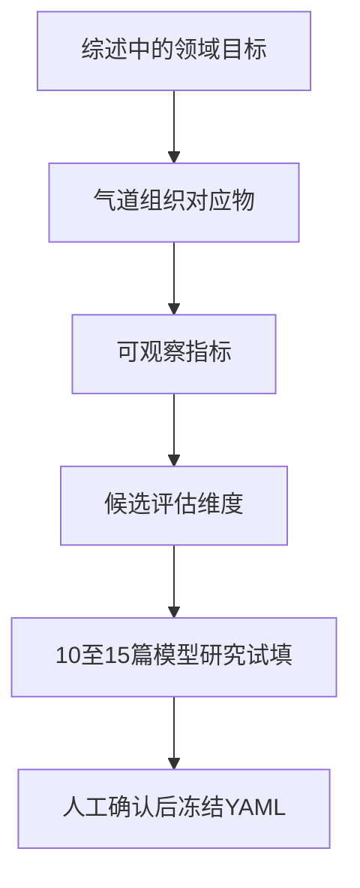

# 从领域技术目标推导气道类器官评价框架
> [!SUMMARY] 本轮结论
> 五篇综述共同支持以“细胞组成、空间结构、生理功能”作为气道类器官评价的核心；“细胞来源”应作为模型分层信息，而不是质量高低的直接评分。成熟度与体内一致性、可重复性与标准化、样本代表性、微环境完整性、扩增与规模化可作为候选辅助维度，但需经 10–15 篇模型研究试填后决定是否独立成列。
---
> [!WARNING] 使用边界
> 本笔记提炼的是领域共识和评价框架，不以综述替代原始研究来证明某个具体模型“已经做到”某项性能。表中的具体模型例子用于生成候选指标；进入正文中的实质性性能结论仍须回溯原始论文。
# 本轮五篇综述精读的任务边界与证据判定规则
本轮不是为五篇文章各写一段摘要，而是回答同一个问题：领域希望类器官解决什么旧瓶颈，这些目标怎样转成气道模型中可以实际观察、比较和记录的指标。
证据转换链如下：

执行时遵守四条规则：
1. 综述原意与本项目转译分栏记录，不把解释写成作者原话。
2. “存在某标志物”只证明身份线索，不自动证明成熟度或功能。
3. “三维”“ALI”“顶端向外”“iPSC 来源”等是培养或来源属性，不自动代表模型质量。
4. 不能从现有材料判定的内容标为“待验证”，不以“未报告”代替“尚未检查补充材料”。
# 五篇综述的角色分工

| 文献 | 本轮角色 | 最适合支撑的内容 | 不承担的任务 |
|---|---|---|---|
| [[AB试跑材料全文/01-Wang-2026-Human-organoids-3D-drug-discovery.pdf\|Wang 2026]] | 通用概念锚点 | 类器官定义、PSC/TSC 两条来源路线、结构与功能目标、药物研发中的标准化问题 | 不单独证明某个气道模型的具体性能 |
| [[AB试跑材料全文/02-Kim-2020-Human-organoids-model-systems.pdf\|Kim 2020]] | 独立概念交叉核对 | 自组织、三维、干细胞来源、人源模型的必要性、标准化与适度复杂性 | 不提供最新气道模型全景 |
| [[AB试跑材料全文/05-Barkauskas-2017-Lung-organoids-review.pdf\|Barkauskas 2017]] | 早期气道特异转译 | 气道细胞谱系、球体结构、培养与功能指标、供体和取样部位变异 | 不代表 2017 年后的技术上限 |
| [[AB试跑材料全文/06-Vazquez-Armendariz-2023-Lung-organoid-advances.pdf\|Vazquez-Armendariz 2023]] | 更新后的气道模型地图 | 不同来源、细胞组成、成熟度、复杂系统、疾病应用和未来缺口 | 不直接给出跨研究统一评分法 |
| [[AB试跑材料全文/10-Hughes-2022-Open-questions-lung-organoids.pdf\|Hughes 2023]] | 质量判据与外推边界 | 组织一致性、成熟度判据、队列代表性、个体内异质性、标准化 | 不负责完整技术史 |
# Wang 2026：通用技术目标与应用门槛
## 阅读任务
用这篇综述确定类器官的通用定义、两条来源路线、功能验证为何不能停留在形态层面，以及从研究模型走向可重复应用时还需要哪些质量属性。
## 目的—瓶颈—关键动作
旧模型的核心瓶颈是：二维细胞系缺乏组织结构和完整功能细胞组成，动物模型又存在物种差异。类器官的关键动作不是单纯“把细胞放进三维胶”，而是利用干细胞及其后代的自组织能力，在可操作的体外系统中重建与目标组织相关的结构和功能；PSC 路线模拟发育，TSC 路线从组织活检直接扩增。
## 可定位证据块

| ID  | 综述支持的陈述（释义）                                                 | 定位           | 本项目的气道转译                        | 候选维度         | 边界                 |
| --- | ----------------------------------------------------------- | ------------ | ------------------------------- | ------------ | ------------------ |
| W1  | 类器官是由干细胞产生的三维结构，应重现相应组织的关键结构与功能                             | PDF p.1      | 评价不能只看成球率，还要看组织身份、空间组织和功能       | 细胞组成、结构、功能   | “关键方面”不等于完整复制器官    |
| W2  | PSC 与 TSC 是两条不同路线：前者按发育信号逐步定向，常停留在较晚胎儿阶段；后者由目标组织活检直接建立，通常更快 | PDF pp.2–3   | 必须记录来源、发育阶段、取样组织和建模时长           | 来源与发育身份、成熟度  | 来源是分层变量，不是优劣排序     |
| W3  | 气道或肠道类器官的 CFTR 依赖性膨胀可关联患者反应；PCD 鼻源气道类器官可直接观察纤毛运动与超微结构       | PDF p.3      | 功能维度应包含疾病或任务相关的动态读出，而非只记录标志物    | 功能完整性、任务适配性  | 不同疾病需要不同功能读出       |
| W4  | 综述将复杂组织结构、区域身份、正确极性和成熟谱系列为类器官区别于二维细胞系的重要特征                  | PDF p.5      | 气道模型应检查腔面方向、顶端—基底极性、区域身份和成熟细胞谱系 | 结构与极性、成熟度    | 这是框架性归纳，具体达成度需原始研究 |
| W5  | 当前类器官通常缺少血管、免疫、基质细胞、神经、机械力和多器官互作，仍是还原性模型                    | PDF pp.14–15 | 微环境组成应按研究问题记录，不能把上皮模型外推为完整肺组织   | 微环境完整性、外推边界  | 并非每项研究都需要最大复杂度     |
| W6  | 细胞来源、培养基、培养条件、分化与功能一致性会带来批内、批间和实验室间变异，并限制标准化和规模化            | PDF p.15     | 后续矩阵至少要记录培养条件、供体或细胞系、批次与重复信息    | 可重复性、标准化、规模化 | “可扩增”不等于“已标准化”     |
## 对 Part 1 A/B 的贡献
这篇综述给出了最简通用框架：类器官的价值在于比二维模型更接近人体组织，同时保持比动物模型更强的可操作性。评价逻辑因此必须同时覆盖“像不像目标组织”和“能不能稳定回答研究问题”，前者对应细胞、结构和功能，后者对应来源、成熟度、标准化和规模化。
# Kim 2020：自组织定义、模型互补与适度复杂性
## 阅读任务
用独立权威来源交叉核对定义，并判断“复杂度越高越好”是否属于领域共识。
## 目的—瓶颈—关键动作
该综述把人类特异性生物过程难以由动物完全模拟视为旧瓶颈。类器官的价值不是替代所有动物实验，而是以人源、可遗传操作的三维模型补齐二维培养与动物模型之间的空白。
## 可定位证据块

| ID | 综述支持的陈述（释义） | 定位 | 本项目的气道转译 | 候选维度 | 边界 |
|---|---|---|---|---|---|
| K1 | 类器官的共同特征包括干细胞来源、自组织和三维培养，并通过模拟发育或组织再生形成组织样结构 | PDF p.1 | “三维细胞团”不足以自动归入类器官，需同时核对来源、自组织和组织样分化 | 概念纳入边界 | 不能仅凭作者命名判定 |
| K2 | 人类特异性发育、代谢和药物反应限制了动物模型的外推，人源类器官用于补充而非简单取代既有模型 | PDF pp.1–3 | 气道类器官的价值要相对于具体旧模型和研究问题表述 | 任务适配性、外部有效性 | “更接近人体”不是所有终点都更优 |
| K3 | PSC 类器官可形成多谱系复杂结构；AdSC 类器官通常以组织上皮为主，建立更直接但受取材和培养条件限制 | PDF p.3 | 来源决定可建模的发育阶段、细胞范围、个体化程度和取样限制 | 来源与发育身份 | 两条路线解决的问题不同 |
| K4 | PSC 类器官形成包含区域身份建立、终末分化和三维扩增三个关键步骤 | PDF p.4 | “区域身份—成熟谱系—三维组织”可作为结构化核验顺序 | 组织身份、成熟度、结构 | 过程完成不等于功能已经验证 |
| K5 | 缺少统一协议是系统变异的重要来源；作者建议以单细胞转录组和表观组逐细胞比较体内对应物 | PDF p.10 | 细胞类型存在性应与体内基准比较，并记录协议与实验室差异 | 体内一致性、标准化 | 组学相似也不能替代所有功能实验 |
| K6 | 简单和复杂类器官各有用途，应根据问题选择必要复杂度；免疫治疗等问题才需要加入相应非上皮成分 | PDF p.10 | 微环境维度应记录“是否满足问题所需成分”，而非按细胞越多得分越高 | 微环境适配性 | 否定“复杂度越高越好” |
| K7 | CF 类器官的 forskolin 膨胀试验能够预测部分患者的个体化药物反应 | PDF p.8 | 功能指标的高等级证据是模型读出与临床或独立体系结果相符 | 功能完整性、外部验证 | 个别成功范式不能自动推广到所有疾病 |
## 对 Part 1 A/B 的贡献
Kim 2020 与 Wang 2026 对“干细胞来源、三维、自组织、组织结构与生理功能”形成独立交叉支持，同时增加一条重要判定原则：评价的目标不是追求最大复杂度，而是判断模型复杂度是否足以支撑其研究问题。
# Barkauskas 2017：把通用目标落到气道可观察指标
## 阅读任务
识别早期气道类器官实际使用过哪些结构、细胞和功能读出，并找出仅凭标志物或球体形态无法回答的问题。
## 目的—瓶颈—关键动作
气道和肺泡沿近端—远端轴具有不同细胞组成与功能；损伤修复还受到基质、免疫和局部生态位影响。该综述用基底细胞、分泌细胞和 AEC2 来源的三维培养，说明如何将再生潜能和分化结局转成可量化体外读出。
## 可定位证据块

| ID | 综述支持的陈述（释义） | 定位 | 本项目的气道转译 | 候选维度 | 边界 |
|---|---|---|---|---|---|
| B1 | 肺类器官被界定为肺上皮祖细胞在三维中形成的自组装结构，可有或没有间充质支持，但尚不能重建肺的全部复杂结构与互作 | PDF pp.1–2 | 气道类器官的最小身份是上皮祖细胞的自组织分化，不是“微型完整肺” | 概念边界、微环境 | “有无间充质”需按模型目的记录 |
| B2 | 人气道主要相关谱系包括基底、纤毛、Club 和杯状细胞；这些细胞共同承担屏障、分泌和黏液纤毛防御 | PDF pp.1–2 | 细胞完整性要按气道区域和任务定义核心谱系，不能只列一个泛上皮标志物 | 细胞组成、区域身份 | 近端与远端所需谱系不同 |
| B3 | 小鼠 tracheosphere 可形成基底层和腔面纤毛、分泌细胞；纤毛虽能运动，但细胞间协调和气道平面极性尚未得到证明 | PDF p.3 | “有纤毛”“纤毛能动”“协调运输”应分成不同证据等级 | 结构与极性、功能完整性 | 标志物或局部运动不等于黏液纤毛清除 |
| B4 | 人基底细胞类器官含 KRT5/TP63 基底细胞、功能性多纤毛细胞及 MUC5AC/MUC5B 分泌细胞；CFE 会受 ROCK 抑制剂和成纤维细胞影响 | PDF p.4 | 同时记录谱系组成和建模效率，但不得用 CFE 代替分化质量 | 细胞组成、培养性能 | 生长指标与生理功能是两类终点 |
| B5 | 不同供体的增殖和分化动力学差异明显；样本位置、疾病阶段和处理流程也会影响结局 | PDF pp.5–6 | 供体数、年龄、疾病、吸烟史、取样区域、处理时间和传代需作为可解释变异来源 | 样本代表性、来源信息、可重复性 | 单一供体结果不能代表人群 |
| B6 | 筛选前需建立可重复读出；孔位、温度和 pH 等实验因素会影响分化 | PDF p.5 | 记录重复、板位控制、批次和读出稳定性，而不只记录化合物效应 | 可重复性、标准化 | 高通量格式本身不保证可靠 |
| B7 | 早期培养基成分未完全定义，葡萄糖、氧张力、ECM 和物理力等因素缺乏系统检验 | PDF p.10 | 培养基、基质和物理环境是模型表型的因果条件，应纳入方法学记录 | 标准化、微环境 | 无法据作者使用的商品名推断全部成分 |
| B8 | ALI 可形成成熟、极化的假复层近端气道上皮，是有价值的气道微环境模型 | PDF p.10 | ALI 可作为分化或正交功能验证平台，但不能与三维类器官概念互换 | 结构验证、培养方式 | 否定“ALI 就是类器官” |
## 对 Part 1 A/B 的贡献
这篇综述把通用三要素具体化：细胞组成至少要区分基底、纤毛和分泌谱系；结构要看腔面排列、极性和区域身份；功能要从标志物上升到纤毛运动、协调运输、屏障、流体转运或疾病相关读出。它同时提示，CFE、直径和细胞数是培养性能，不是组织功能。
# Vazquez-Armendariz 2023：来源权衡、成熟度与复杂系统
## 阅读任务
更新 2017 年后的模型版图，判断不同来源和复杂系统分别增加了什么能力，又留下了哪些稳定缺口。
## 目的—瓶颈—关键动作
近年的改进来自优化干细胞分离、培养基、共培养和基因编辑，使模型获得更多细胞、结构和功能复杂性；但终末成熟、渐进分支、可重复性和规模化仍未普遍解决。
## 可定位证据块

| ID | 综述支持的陈述（释义） | 定位 | 本项目的气道转译 | 候选维度 | 边界 |
|---|---|---|---|---|---|
| V1 | 肺类器官是由干细胞建立的三维培养系统，可增殖并分化为重现来源器官部分结构、生物学和功能特征的结构 | PDF p.2 | 定义强调“部分重现”，评价应明确每个模型实际覆盖的组织范围 | 概念边界、组织一致性 | 不要求复刻完整肺 |
| V2 | 成人、胎儿和 iPSC 是三类主要来源，培养补充物和相关细胞共培养决定可获得的细胞类型和长期维持 | PDF p.2 | 来源、培养基与共培养应共同记录，不能只按来源预测终态 | 来源、细胞组成、长期维持 | 相同来源可因培养条件产生不同模型 |
| V3 | 当前挑战集中在终末成熟、结构复杂性、标准化、规模化和可重复性 | PDF p.3 | 除核心三维外，需要试填成熟度和可重复性字段 | 成熟度、结构、标准化、规模化 | 仍需检验原始研究是否普遍报告 |
| V4 | 不同气道模型的细胞组成与培养条件差异明显；长时扩增的人气道类器官可含基底、纤毛和分泌谱系并维持一年以上 | PDF pp.5–6 | 长期扩增需与谱系保持共同评价，不能只记录最长培养时间 | 扩增能力、细胞组成稳定性 | “维持”需区分细胞存活、表型保持和功能保持 |
| V5 | iPSC 来源 AEC2 具有通量与规模化优势，AdSC 则保留供体年龄相关成熟性及遗传、表观遗传特征 | PDF p.8 | 来源决定模型优势类型，应形成分层比较而非单一排名 | 来源与发育身份、个体化、规模化 | 不能把 iPSC 或 AdSC 直接设为高分项 |
| V6 | 某些 iPSC 肺模型有约 20% 胃细胞污染，部分模型缺成熟气道细胞或 AEC1，且近端—远端结构仍不完整 | PDF p.8 | 需要记录脱靶细胞、谱系纯度、区域模式和成熟细胞证据 | 细胞身份纯度、结构、成熟度 | 只报告阳性目标标志物会漏掉脱靶谱系 |
| V7 | 人肺模型仍普遍缺终末成熟、渐进分支、免疫和内皮成分；加入非上皮组织还要求兼容培养条件和区域匹配 | PDF p.9 | 微环境不仅是“有没有”，还包括细胞来源、区域和年龄是否匹配 | 微环境适配性、结构复杂性 | 不匹配共培养可能制造新偏差 |
| V8 | CFTR 活性仍以 ALI 为重要基准，气道类器官也可采用 forskolin 膨胀；感染模型则可检查病毒进入、增殖、释放和宿主反应 | PDF p.10 | 功能指标要与应用场景绑定，并尽量用独立平台或人体样本验证 | 功能完整性、任务适配性、外部验证 | 单一通用“功能：是/否”字段信息不足 |
| V9 | 未来仍需改善体内成熟度、细胞互作和多细胞复杂性，尤其是长期维持分化 AEC1 | PDF p.11 | 成熟度与长期稳定性是跨越来源和培养形式的独立问题 | 成熟度、长期稳定性 | 不应由培养天数替代成熟度判定 |
## 对 Part 1 A/B 的贡献
这篇综述显示，来源路线不能被压缩成简单优劣：iPSC 更利于规模化和发育操控，成人来源更可能保留供体年龄与疾病背景。评价时应把来源用于分层，并另行检查终末成熟、脱靶谱系、长期表型稳定和任务相关功能。
# Hughes 2023：组织一致性、代表性与过度外推
## 阅读任务
从领域公开提出的“未解决问题”中提取质量控制维度，特别是成熟度判据、供体代表性和跨实验室可比性。
## 目的—瓶颈—关键动作
该综述不再问“能不能培养”，而是追问培养物多大程度上代表来源组织、患者群体和同一患者内部的空间异质性。其关键动作是把质量评价从标志物和单一供体，推进到多模态体内对照、足量供体、精确取样信息和标准化协议。
## 可定位证据块

| ID | 综述支持的陈述（释义） | 定位 | 本项目的气道转译 | 候选维度 | 边界 |
|---|---|---|---|---|---|
| H1 | 肺类器官是干/祖细胞来源的三维异质细胞结构，外观和组成应与来源组织相似 | PDF p.1 | 定义同时要求细胞异质性和组织对应关系 | 细胞组成、组织一致性 | “异质”不是细胞种类越多越好 |
| H2 | 人气道类器官通常含基底、黏液分泌和纤毛细胞，但神经内分泌、离子细胞和 tuft 细胞等稀有群体是否稳定出现并不清楚 | PDF p.2 | 细胞完整性需区分主要谱系与稀有谱系，并记录“未检验”而非默认缺失 | 细胞组成、稀有谱系 | 主要谱系齐全不等于完整复制气道 |
| H3 | 去除 ECM 可形成纤毛朝外的模型；培养基组成会选择气道或肺泡身份 | PDF p.2 | 顶端向内或向外是实验可及性和极性配置，培养基是谱系选择条件 | 结构与极性、培养条件 | apical-out 不是自动更成熟 |
| H4 | 单靠标志蛋白不足以证明成熟或功能，应联合空间信息、转录组和细胞器表征 | PDF p.2 | 建立身份与成熟度的证据等级，功能仍需动态或任务相关实验 | 体内一致性、成熟度 | 多模态身份也不能完全替代功能 |
| H5 | 许多研究缺少与体内组织的直接比较，领域尚无统一成熟度和身份评价协议，iPSC 系间差异明显 | PDF p.2 | 记录比较基准、细胞系、批次和成熟度判据 | 体内一致性、标准化 | “与文献标志物相似”弱于同源组织对照 |
| H6 | 类器官始终是还原性模型，无法重建完整上皮—基质、上皮—免疫和系统变量；外推应由正交模型或数据集验证 | PDF p.3 | 为每项结论记录模型覆盖边界和外部验证 | 微环境、外部有效性 | 不能从上皮结果直接推断完整器官反应 |
| H7 | 人源培养存在显著供体差异，研究需纳入足够供体；现实研究常只使用少量且实验室间不共享的样本 | PDF p.3 | 供体数、人口学与疾病特征决定人群外推能力 | 队列代表性 | 技术重复不能替代生物学重复 |
| H8 | 肺癌类器官建立率因队列、消化方法、培养基和成功标准不同而跨研究变化，作者主张系统比较协议 | PDF p.4 | 成功率只有在成功定义和流程可比时才可横向比较 | 可重复性、标准化 | 不应直接拼接不同研究的成功率 |
| H9 | 近端—远端位置会影响转录、免疫防御和感染易感性，活检精确位置关系到可重复性；个体内空间异质性常被忽略 | PDF pp.4–5 | 取样区域和同一供体多区域信息是气道模型的重要来源变量 | 空间代表性、来源信息 | “同一患者”不等于样本同质 |
## 对 Part 1 A/B 的贡献
Hughes 2023 将评价框架从模型内部扩展到模型与人体之间：除了细胞、结构和功能，还必须问与哪一段气道、哪一类供体、哪种疾病阶段相对应，以及结论是否经过同源组织或正交系统验证。这些内容最适合作为跨列质量控制和外推边界。
# 跨文献合流：候选维度及当前状态

| 编号 | 候选维度 | 操作性定义 | 首轮可观察指标 | 综述支持 | 当前状态 |
|---|---|---|---|---|---|
| C1 | 细胞组成与谱系完整性 | 是否重建与目标气道区域和任务相关的主要、稀有细胞谱系 | 基底、纤毛、Club、杯状细胞；稀有谱系是否检验；细胞比例；脱靶细胞 | 五篇共同支持 | 已支持，建议核心列 |
| C2 | 空间结构、区域身份与极性 | 是否形成符合目标气道的空间排列和界面方向 | 腔体、假复层、顶端—基底极性、纤毛朝向、平面极性、近端—远端身份 | 五篇共同支持 | 已支持，建议核心列 |
| C3 | 生理功能完整性 | 是否以动态或任务相关实验验证组织功能 | 纤毛运动与协调运输、黏液、屏障与通透性、CFTR、病原体进入—增殖—释放 | 五篇共同支持 | 已支持，建议核心列 |
| C4 | 细胞来源与发育身份 | 模型来自何种细胞、组织区域、供体与发育阶段 | AdSC/FSC/iPSC、物种、取样区域、年龄、疾病、采样方式、传代 | 五篇共同支持 | 已支持，建议分层列，不评分 |
| C5 | 成熟度与体内一致性 | 模型身份和功能与同源体内组织相符到什么程度 | 标志物、空间、组学、细胞器、功能、同源组织直接对照 | Wang、Kim、Barkauskas、Vazquez、Hughes | 待验证是否独立成列 |
| C6 | 可重复性与标准化 | 结局是否跨孔、批次、供体、细胞系和实验室稳定 | 培养基与基质、成功定义、重复数、供体数、批次、变异度、质控 | 五篇共同支持 | 待 10–15 篇试填 |
| C7 | 样本代表性与空间异质性 | 所用样本能否支持对患者群体或个体的外推 | 供体数量与构成、疾病阶段、活检位置、同一患者多区域 | Barkauskas、Vazquez、Hughes 强支持 | 待验证，可能作为来源子字段 |
| C8 | 微环境与问题适配性 | 是否包含回答研究问题所必需的非上皮成分和物理环境 | 间充质、免疫、内皮、神经、ECM、机械力；来源与区域匹配 | 五篇共同支持 | 待验证，不宜简单计数评分 |
| C9 | 扩增、稳定性与规模化 | 模型能否在保持身份和功能的前提下长期扩增和用于批量实验 | 培养时长、传代、冻存、谱系保持、功能保持、通量 | Wang、Kim、Barkauskas、Vazquez | 待 10–15 篇试填 |
# 技术目标到评估维度的推导段初稿
类器官技术的共同目标并非在体外复制一个完整器官，而是在可操作的人源三维系统中，重建与研究问题相关的组织身份和生理行为。对气道类器官而言，这一目标首先可落实为三个核心评价方面：其一，模型是否包含目标气道区域所需的基底、纤毛和分泌等细胞谱系，并说明稀有谱系和脱靶细胞的检查情况，即细胞组成与谱系完整性；其二，模型是否形成符合气道组织的腔面排列、顶端—基底极性及必要的区域身份，即空间结构与极性；其三，模型是否通过纤毛运动与协调运输、黏液分泌、屏障、离子转运或感染过程等任务相关读出证明生理功能，而非只报告标志物，即功能完整性。细胞来源则决定模型能够代表的发育阶段、气道区域、供体背景和个体化范围，应作为分层信息而不是性能分数。在此基础上，成熟度与体内一致性、跨供体和跨批次可重复性、样本代表性、微环境适配性及长期扩增能力构成候选质量控制维度；这些辅助维度是否独立进入矩阵，仍需由 10–15 篇现有气道类器官模型研究的试填结果决定。
# 证据等级与后续提取口径
## 身份与成熟度证据等级
1. L0：仅有作者命名或球体形态。
2. L1：报告一个或少数标志物。
3. L2：多谱系标志物并具有空间定位。
4. L3：在 L2 基础上增加转录组、单细胞、表观组或细胞器证据。
5. L4：在 L3 基础上具有动态生理功能。
6. L5：与同源体内组织、临床结局或正交模型直接比较。
该等级用于描述证据强弱，不应机械相加为总分；不同研究问题允许不同最低充分等级。
## 缺失信息状态
- `reported_main`：主文已报告。
- `reported_si`：补充材料已报告。
- `not_reported_after_full_check`：主文与可得补充材料均已检查后仍未报告。
- `indeterminate_si_missing`：主文未见，但补充材料缺失，不能判定为未报告。
- `not_applicable`：该字段不适用于研究问题或模型。
# 当前被证据否定的简化做法
- 不成立：只要是三维培养就称为类器官。五篇综述均把干/祖细胞来源、自组织或组织样分化纳入概念。
- 不成立：检测到细胞标志物就证明成熟和功能。Hughes 明确要求空间、组学、细胞器及功能等更强证据。
- 不成立：模型越复杂越好。Kim 指出复杂度应匹配研究问题；不必要的共培养也可能增加不可控变异。
- 不成立：ALI 与类器官是同义词。ALI 是重要的二维分化或正交验证体系，可与类器官互补。
- 不成立：iPSC 或成人来源本身代表更高质量。两者在规模化、成熟度、供体表征和发育建模上具有不同优势。
- 不成立：CFE、直径、细胞数或培养时长可代替组织功能。它们反映培养性能，功能需要独立读出。
- 不成立：主要细胞类型存在即可宣称完整重建气道。稀有谱系、区域身份、空间组织和任务相关功能仍需分别检查。
# 下一步试填入口
下一阶段不是立即冻结 YAML，而是用 C1–C9 对 10–15 篇气道模型研究做小样本试填，并记录每个字段的可获得率、定义冲突和补充材料依赖。优先检验三个问题：
1. C1–C4 是否能在大多数模型研究中稳定填写，并能区分模型。
2. C5–C9 中哪些适合独立成列，哪些更适合作为来源、方法或局限的子字段。
3. 功能字段是否需要按“黏液纤毛、屏障、离子转运、感染、疾病特异功能”拆分，而不是保留单一的是/否字段。