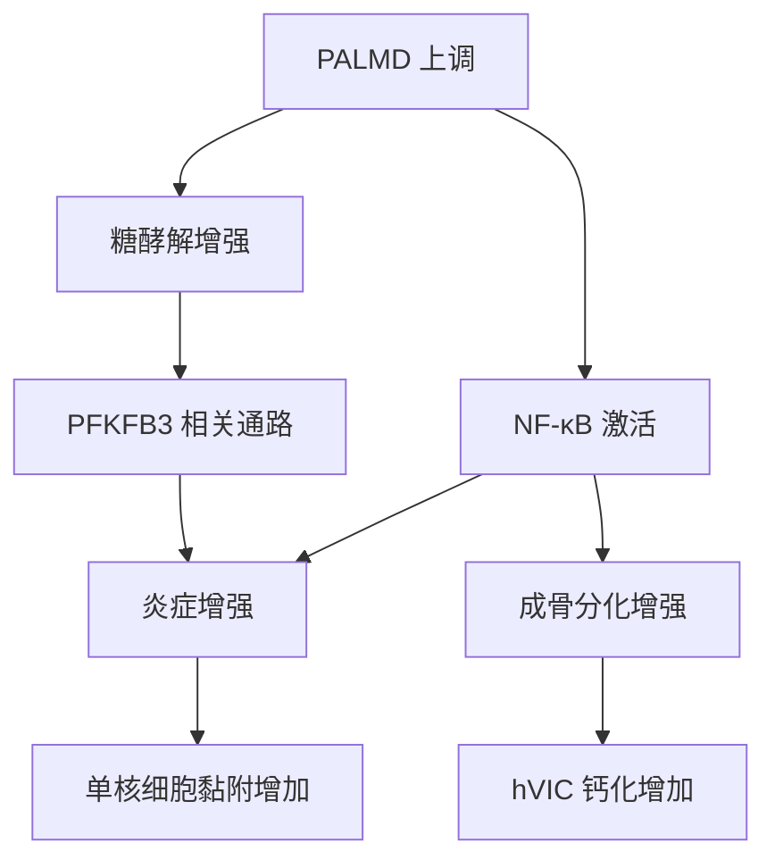

# PALMD 如何推动主动脉瓣钙化
文献：Siying Wang et al., 2022, Journal of Biological Chemistry, DOI: 10.1016/j.jbc.2022.101887
本解读基于已保存的 JBC 官方全文 Markdown：[[Wang 2022 PALMD JBC]]
***
# 研究目的
这篇文章要解决的核心问题是：GWAS/TWAS 已经把 PALMD 位点和钙化性主动脉瓣病（CAVD）风险联系起来，但这种遗传关联到底是不是有功能后果、通过什么细胞机制推动瓣膜钙化，此前并不清楚。
作者真正研究的对象不是“PALMD 是否相关”，而是 PALMD 在人瓣膜间质细胞（hVIC）中是否能驱动三个病理过程：成骨分化、钙化、炎症。
***
# 核心结论
PALMD 在钙化主动脉瓣区域和体外钙化的 hVIC 中上调。
敲低 PALMD 会降低 hVIC 钙化、成骨分化和凋亡；过表达 PALMD 则相反。
PALMD 的下游机制主要落在两条轴上：一是改变糖酵解，尤其涉及 PFKFB3；二是激活 NF-κB 介导的炎症。
PFKFB3 介导的糖酵解抑制可以减轻 hVIC 的炎症和成骨分化，但 PFKFB3 敲低只能抑制 PALMD 诱导的炎症，不能完全抑制 PALMD 诱导的成骨分化。
因此，PALMD 不是单纯通过“糖酵解增加”解释全部表型；NF-κB 更像是连接 PALMD 与成骨分化/炎症的关键节点。
***
# 机制总览

这张图的读法：PALMD 上调后，细胞代谢和炎症信号同时被推高；PFKFB3 更能解释炎症部分，NF-κB 同时解释炎症和成骨分化，因此 NF-κB 在机制链里更靠近最终病理表型。
***
# 证据链
第一层证据来自人组织：钙化主动脉瓣区域 PALMD 表达高于邻近非钙化区域，并且 PALMD 与 VIC 标志物 Vimentin 共定位，说明 PALMD 的变化发生在与瓣膜间质细胞相关的区域。
第二层证据来自体外 hVIC 模型：钙化诱导条件下 PALMD 上调；敲低 PALMD 后钙化染色、成骨分化指标和凋亡下降；过表达 PALMD 后这些表型增强。
第三层证据来自 RNA-seq：敲低 PALMD 后，糖酵解和 NF-κB 介导炎症相关转录程序下降，同时 TNFα 诱导的单核细胞黏附被削弱。
第四层证据来自代谢干预：抑制 PFKFB3 介导的糖酵解可以降低成骨分化和炎症，说明糖酵解本身不是旁观者，而是参与 hVIC 病理激活。
第五层证据来自通路拆分：PFKFB3 敲低能抑制 PALMD 诱导的炎症，但不能抑制 PALMD 诱导的成骨分化；NF-κB 抑制则更能解释 PALMD 对成骨分化和炎症的共同推动作用。
***
# 关键概念
PALMD：palmdelphin，既往主要与细胞形态、膜动态、肌母细胞分化、DNA 损伤相关细胞死亡等过程有关；本文把它放入 CAVD 的功能机制链中。
hVIC：human valve interstitial cell，人瓣膜间质细胞，是主动脉瓣钙化研究中的核心效应细胞；它可以从稳态纤维样状态转向肌成纤维样或成骨样状态。
PFKFB3：糖酵解调节因子，能提高果糖-2,6-二磷酸水平，从而推动糖酵解通量；本文中它更偏向连接 PALMD 与炎症反应。
NF-κB：经典炎症转录因子；本文中它不仅解释炎症，也解释 PALMD 诱导成骨分化的关键部分。
***
# 这篇文章的贡献
它把一个遗传关联位点 PALMD 从“风险基因候选”推进到“有功能后果的病理调控因子”。
它把 CAVD 中常见的三类病理现象串起来：代谢重编程、炎症、成骨样钙化。
它提出一个治疗方向：直接靶向 PALMD 或下游 PFKFB3/糖酵解轴，可能有助于抑制 CAVD 进展。
但作者自己的数据也提示，单纯压低 PFKFB3 未必能覆盖 PALMD 的全部促钙化效应，因为 PALMD 还通过 NF-κB 影响成骨分化。
***
# 边界与局限
研究主要依赖人组织样本和体外 hVIC 钙化模型，缺少能证明体内因果关系的动物模型或长期干预数据。
人组织样本来自已发生 CAVD 的患者，能说明 PALMD 与钙化区域相关，但不能单独证明 PALMD 是疾病启动事件。
PFKFB3/糖酵解与 NF-κB 的上下游关系没有被完全拆清：PFKFB3 可以解释炎症的一部分，但不能解释全部成骨分化。
治疗外推还早：靶向糖酵解可能影响多种细胞类型和全身代谢，不能从这篇体外机制研究直接推出临床用药方案。
***
# 如果我是负责人会怎样看
我会把这篇文章定位为“机制候选验证”而不是“治疗靶点已成熟”。
下一步最有价值的实验不是重复更多体外染色，而是做细胞类型特异性的 PALMD 操作，最好在主动脉瓣钙化相关动物模型中验证是否真的改变瓣膜钙化进程。
同时需要拆分 PALMD、PFKFB3、NF-κB 的顺序关系：PALMD 是否先改变糖酵解再激活 NF-κB，还是两者平行发生；这个问题决定后续靶点应该选 PALMD、PFKFB3 还是 NF-κB 下游炎症模块。
***
# 一句话记忆
PALMD 是 CAVD 遗传风险信号背后的功能性促钙化因子，它通过糖酵解重编程和 NF-κB 炎症信号把 hVIC 推向炎症、成骨分化和钙化状态。
