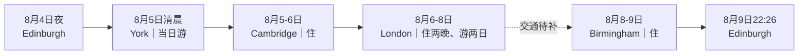

> [!summary] 结论先看
> - 已按用户确认的Google／Gemini London路线重排：**8月7日、8月8日两个白天均在London**；Bath整段游览、London→Bath和Bath→Birmingham不再纳入本版。
> - 城市顺序改为：**Edinburgh → York → Cambridge → London（8/6–8住宿；两日游）→ Birmingham（8/8住宿）→ Edinburgh**。
> - 已有附件证据的铁路小计为 **£154.70／2人**：Edinburgh→York £42.70、York→Cambridge £39.10、Cambridge→London £21.70、Birmingham→Edinburgh £51.20；**London→Birmingham的班次、价格和始发站未提供，不能假定。**
> - 住宿已由用户确认订好：YHA Cambridge、ibis London Sutton Point、Britannia Hotel Birmingham New Street Station；不再提供订房候选或搜索价。
> - 8月8日Google路线的晚段结束于Tower Bridge附近，而Birmingham酒店当晚需入住；必须补齐London→Birmingham交通后，才能确认最后一段晚餐时间和到店时间。
# 路线总览

| 日期 | 当前路线铁路 | 时间 | 换乘／票种 | 已知价（2人） | 证据与风险 |
| --- | --- | --- | --- | ---: | --- |
| 8月4–5日 | Edinburgh Waverley → York | 23:24–05:37 | 6小时13分；1次换乘；Split Tickets | £42.70 | 付款前截图；清晨抵达且无York住宿 |
| 8月5日 | York → Cambridge | 19:31–22:05 | 2小时34分；1次换乘，经Peterborough；Advance Single | £39.10 | 付款前截图；到站后入住YHA |
| 8月6日 | Cambridge → London | 晚间时刻未附 | 文字备注称“太多车了，一个价” | £21.70 | **仅文字记录**；付款前补具体班次、终到站与票种 |
| 8月8日 | London → Birmingham New Street | **未提供** | **未提供** | **待补** | Bath已取消；原Bath→Birmingham车次不适用于此段 |
| 8月9日 | Birmingham New Street → Edinburgh Waverley | 18:07–22:26 | 4小时19分；直达；Split Tickets | £51.20 | 付款前截图；Avanti West Coast |
|  | **已知铁路小计** |  |  | **£154.70＋London→Birmingham待补** | 不是全程铁路总价 |
> [!warning] 8月8日晚的交通尚未落地
> Google Day 2路线能排到Tower Bridge／More London晚间，但不能替代London→Birmingham的真实车票。请以实际车票的出发站、出发时间、到达时间和行李规则反推该日最后的晚餐与离开Tower Bridge时间；本文不保留已取消的Bath两段票价。
# 已订住宿与路线嵌入
用户已确认住宿订好；本节只记录入住点和路线衔接，不再提供订房候选、链接或重新询价计划。图片里的展示价和房型筛选不作为订单金额或入住人数证明，实际以已订订单为准。

| 入住 | 已订住宿 | 融入行程的关键位置 | 路线动作 |
| --- | --- | --- | --- |
| 8月5日 | **YHA Cambridge** | 97 Tenison Rd；截图显示距Cambridge站步行约490米 | 8月5日22:05到Cambridge后入住；8月6日白天把大箱留店，晚间取箱转London |
| 8月6–7日 | **ibis London Sutton Point** | 8 Sutton Court Road, Sutton；位于Sutton而非King’s Cross | 8月6日晚由Cambridge到London后直接入住；8月7日进出市中心须把Sutton往返时间纳入首末段 |
| 8月8日 | **Britannia Hotel Birmingham New Street Station** | 截图显示距Birmingham New Street约380米 | London→Birmingham实际到New Street后步行入住；8月9日游览结束回店取箱，18:07上车回Edinburgh |
> [!important] 已订房与两日London路线
> ibis London Sutton Point覆盖8月6、7两晚；8月7日、8月8日白天均按Google／Gemini London路线执行。酒店在Sutton而非King’s Cross，故两日都须预留外圈往返时间；8月8日退房后大箱与London→Birmingham交通的衔接仍待实际车票确认。
# 大箱完整交接链

| 时间 | 大箱位置 | 操作与缓冲 |
| --- | --- | --- |
| 8月4日23:24–5日05:37 | 随身 | 夜车及换乘全程携带；不把大箱留在无人值守区域 |
| 8月5日05:37–19:00左右 | **待落实的York合规寄存** | 新路线没有York住宿。先向York站／商业寄存确认清晨可存、最晚取件、尺寸与费用；未落实不得购买首段夜车 |
| 8月5日19:00–22:20 | 随身 | 19:31 York→Cambridge；22:05到站后步行入住YHA |
| 8月6日退房–晚间列车 | YHA Cambridge | 前台／行李房寄存；取箱后按待补充的Cambridge→London具体班次上车 |
| 8月6日晚–8月8日退房 | ibis London Sutton Point | 两晚连续入住；8月8日退房后的寄存规则、最晚取件时间须以订单确认 |
| 8月8日退房后–London→Birmingham上车前 | **待确认：ibis寄存或合规商业寄存** | Day 2全日游览不携带大箱；先锁定London→Birmingham始发站、时间及酒店／寄存取箱截止时间 |
| 8月8日晚 | 随身 | 由实际London→Birmingham车票决定到Britannia的时间；原经Bath的转移安排已整体取消 |
| 8月8日到Birmingham后–9日退房 | Britannia Hotel Birmingham New Street Station | 到New Street后步行入住；以已订订单的晚到规则为准 |
| 8月9日退房–17:20 | Britannia Hotel Birmingham New Street Station | 以已订订单的退房后寄存规则为准；无酒店寄存则改New Street周边商业寄存 |
| 8月9日17:20–22:26 | 随身 | 17:30前到New Street，18:07直达Edinburgh |
> [!danger] 两个必须先落地的后勤点
> York清晨05:37寄存仍是首个硬阻断。第二个是8月8日London→Birmingham：未知道始发站和时间，就无法决定大箱寄存位置、Tower Bridge最晚离开时间或Britannia晚到是否可行。

# 每日游览时间线
## 8月5日周三｜York｜清晨夜车到站，当晚去Cambridge
预计有效游览：08:45–17:15；约 **1.5万–1.8万步**。保留原York景点顺序；05:37到站后先解决大箱与休整，不能默认酒店会接收。

| 时间 | 安排 | 费用／备注 |
| --- | --- | --- |
| 05:37–08:45 | York到站、确认合规寄存、早餐与恢复体力 | 寄存未确认即为硬阻断；不在车站外带箱闲逛 |
| 08:45–09:50 | Micklegate Bar、市墙晨走 | 免费；雨天改河岸短线 |
| 10:00–11:30 | National Railway Museum | 每日10:00–17:00，免费；建议预订免费时段 |
| 11:30–12:30 | Museum Gardens、St Mary’s Abbey遗址 | 免费 |
| 12:45–14:15 | York Minster | 周三开放与当日礼拜安排需复核；成人£18.20为旧参考 |
| 14:15–15:30 | Shambles、Shambles Market、Stonegate | 午餐＋老城 |
| 15:30–16:25 | Clifford’s Tower外观、River Ouse | 不进塔也可完成历史线 |
| 16:25–17:15 | 回寄存点取箱并向车站移动 | 不再新增远点 |
| 18:45 | 到York站 | 46分钟上车缓冲 |
| 19:31–22:05 | York → Cambridge | 1次换乘，经Peterborough；附件价£39.10／2人 |
| 22:15左右 | YHA Cambridge入住 | 提前书面确认晚到 |
**代表性付费开关**：York Minster £18.20／人；票在9月1日前有效期政策以官网为准。
**免费替代**：National Railway Museum＋市墙＋Museum Gardens＋Shambles＋河岸。
[Google Maps步行骨架](https://www.google.com/maps/dir/York+Railway+Station/National+Railway+Museum/York+Museum+Gardens/York+Minster/The+Shambles/Clifford%27s+Tower/York+Railway+Station/)
## 8月6日周四｜Cambridge｜晚间去London
预计有效游览：08:45–17:20；约 **1.5万–1.8万步**。景点计划保持不变；附件只记有晚间Cambridge→London和£21.70，故不填造车次。

| 时间 | 安排 | 费用／备注 |
| --- | --- | --- |
| 08:15–08:30 | 退房、YHA寄存大箱 | 与前台确认晚间取箱时间 |
| 08:45–09:45 | Botanic Garden外围／Station Road慢走 | 若入园则另付费并压缩后段 |
| 10:00–11:30 | Fitzwilliam Museum | 周四开放以官网为准，免费 |
| 11:45–13:00 | King’s College Chapel与庭院 | 成人£18为旧参考；必须按8月6日票务日历预约 |
| 13:00–14:00 | Market Square午餐 | 市集简餐 |
| 14:00–15:30 | Trinity、St John’s外观、Round Church | 免费外观线 |
| 15:30–16:45 | The Backs、Queens’ College周边、数学桥外观 | 河边慢走 |
| 16:45–17:20 | Parker’s Piece方向返回 | 不安排撑船，避免失控 |
| 晚间 | YHA取箱 → Cambridge → London | **附件未给到发时间**；付款前补图后，再锁定取箱与到店时间 |
| 到London后 | ibis London Sutton Point入住 | 由Cambridge到达London后继续前往Sutton；以已订订单的晚到规则为准 |
**代表性付费开关**：King’s College Chapel £18／人。
**免费替代**：Fitzwilliam Museum＋Market Square＋学院外观＋The Backs。
[Google Maps步行骨架](https://www.google.com/maps/dir/Cambridge+Railway+Station/Fitzwilliam+Museum/King%27s+College+Chapel/Cambridge+Market+Square/Trinity+College/The+Round+Church/Queens%27+College/Cambridge+Railway+Station/)
## 8月7日周五｜London DAY 1｜皇室地标晨游 → 午后博物馆 → 西区艺术之夜
按《伦敦Gemini.pdf》修订版执行；Google原路线假设酒店在大英博物馆附近，现已按Sutton住宿把出发和回程加长。

| 时间 | 安排 | 费用／备注 |
| --- | --- | --- |
| 07:15–09:00 | ibis London Sutton Point → Green Park／West End | 至少预留75分钟外圈通勤与等车缓冲；不带大箱 |
| 09:00–10:30 | 白金汉宫外观、维多利亚女王纪念碑、St James’s Park | 晨间人少；卫兵交接只作偶遇，不为此排队 |
| 10:30–11:30 | 国会大厦、大本钟、Westminster Abbey外观、Westminster Bridge、London Eye外观 | 全程步行；付费教堂与London Eye不纳入本版 |
| 11:30–12:00 | 转车回大英博物馆附近、买Meal Deal | Tesco／Sainsbury’s £3.50–£5为PDF旧参考；以12:00预约入场为锚 |
| 12:00–15:30 | British Museum深度游览 | 免费、需预约；罗塞塔石碑、帕特农神庙雕塑、埃及木乃伊、中国馆 |
| 15:30–17:30 | Covent Garden、Apple Market、街头表演 | 从博物馆步行约15分钟 |
| 17:30–19:30 | National Gallery、Trafalgar Square | 周五夜场；重点《向日葵》《岩间圣母》及莫奈，需预约 |
| 19:30–21:00 | Soho／唐人街平价晚餐 | Flat Iron、越南粉或唐人街快餐为PDF建议；不把搜索价当当前价格 |
| 21:00后 | 返回ibis London Sutton Point | 不向King’s Cross返店；按Sutton路线回酒店 |
**付费开关**：无。此日为免费馆藏／外观路线；如临时进Westminster Abbey或Tower of London，必须删减至少一处免费馆。
[Google Maps路线骨架](https://www.google.com/maps/dir/ibis+London+Sutton+Point/Green+Park/Buckingham+Palace/Westminster+Bridge/British+Museum/Covent+Garden/National+Gallery/Leicester+Square+Station/ibis+London+Sutton+Point/)
## 8月8日周六｜London DAY 2｜千年历史古迹与泰晤士河两岸
Bath已取消；按《伦敦Gemini.pdf》Google Day 2路线执行。原PDF的“21:00 King’s Cross顺畅离港”不适用于本版，因当晚目标是Birmingham酒店且London→Birmingham车次未提供。

| 时间 | 安排 | 费用／备注 |
| --- | --- | --- |
| 08:15–09:30 | ibis London Sutton Point退房、寄存大箱、前往Borough Market | 先确认酒店寄存最晚取件；Sutton→市中心通勤预留不少于75分钟 |
| 09:30–11:30 | Borough Market美食体验 | Northern Line等实际线路以当天导航为准；海鲜、西班牙小食、手工甜点 |
| 11:30–13:00 | London Bridge、泰晤士河沿岸、Millennium Bridge、Tate Modern外观 | 沿南岸步行，远眺Tower Bridge |
| 13:00–15:00 | St Paul’s Cathedral外观、One New Change免费顶楼露台 | 不进教堂；顶楼视野与大圆顶合影 |
| 15:00–17:30 | Tower of London外围护城河、Tower Bridge | 不进塔；亲自登上／穿过Tower Bridge |
| 17:30–19:30 | More London塔桥南岸早晚餐与亮灯初景 | **上限取决于London→Birmingham实际车票**；车早则提前离开 |
| 19:30后 | 取箱 → London→Birmingham → Britannia Hotel | **始发站、车次、票价与到店时间待补**；不再前往King’s Cross作为默认终点 |
**付费开关**：无。此日为市集、河岸、外观和One New Change免费顶层路线；如要进Tower of London，必须放弃至少一个河岸／古迹段并重做晚间交通。
[Google Maps路线骨架](https://www.google.com/maps/dir/ibis+London+Sutton+Point/Borough+Market/London+Bridge/Millennium+Bridge/Tate+Modern/St+Paul%27s+Cathedral/One+New+Change/Tower+of+London/Tower+Bridge/More+London/ibis+London+Sutton+Point/)
## 8月9日周日｜Birmingham｜18:07回Edinburgh
预计有效游览：09:00–17:20；核心景点顺序不变，但原“晚餐＋19:30入住”与18:07列车冲突，改为取箱上车。

| 时间 | 安排 | 费用／备注 |
| --- | --- | --- |
| 09:00–09:15 | 退房、把大箱留Britannia Hotel | 以已订订单的退房后寄存规则为准 |
| 09:15–10:00 | 早餐＋Bullring、St Martin’s Church外观 | 免费 |
| 10:15–11:45 | Birmingham Museum & Art Gallery | 免费；官网开放时间与临时展区须复核 |
| 12:00–13:00 | Victoria Square、Council House、午餐 | 市中心步行 |
| 13:15–14:30 | Library of Birmingham观景层与Centenary Square | 免费 |
| 14:30–15:45 | Gas Street Basin、Brindleyplace、运河工业遗产 | 免费 |
| 16:00–16:40 | Jewellery Quarter短线 | 原城市计划保留，但缩短；与Chinese Quarter晚餐二选一 |
| 16:40–17:10 | 回Britannia Hotel取箱 | 不再安排坐下晚餐；可买外带上车 |
| 17:30 | 到Birmingham New Street | 37分钟上车缓冲 |
| 18:07–22:26 | Birmingham New Street → Edinburgh Waverley | 直达；附件价£51.20／2人 |
**代表性付费开关**：Birmingham Back to Backs成人£13／人，必须预约导览；如购票，替换BMAG前半段。
**免费替代**：BMAG＋Library＋运河工业遗产。
[Google Maps步行骨架](https://www.google.com/maps/dir/Birmingham+New+Street/St+Martin+in+the+Bull+Ring/Birmingham+Museum+and+Art+Gallery/Library+of+Birmingham/Gas+Street+Basin/Jewellery+Quarter/Birmingham+New+Street/)
# 预算

| 类别 | 2人预算 | 口径 |
| --- | ---: | --- |
| 已知铁路小计 | **£154.70** | Edinburgh→York £42.70＋York→Cambridge £39.10＋Cambridge→London £21.70＋Birmingham→Edinburgh £51.20 |
| London → Birmingham | **待补** | Bath已取消，不能用原London→Bath £42.30或Bath→Birmingham £48.10代替 |
| 四晚住宿 | **已订，订单金额未提供** | YHA Cambridge 8/5、ibis London Sutton Point 8/6–7、Britannia Birmingham 8/8；不把搜索截图价当订单价 |
| 行李寄存 | **待确认** | York清晨寄存及8月8日ibis退房后大箱寄存；酒店规则与车次未落地 |
| 市内交通 | **待重算** | 两日均从Sutton往返市中心；PDF中Zone 1–2封顶不涵盖全部外圈通勤 |
| 饮食 | £180–£240为旧参考 | 2人5天；Day 2已从Bath改为London |
| 代表性付费景点 | **£98.40为旧参考** | Back to Backs、King’s College Chapel、York Minster各1项；Bath Roman Baths已移除 |
| **全程总计** | **待重算** | 缺London→Birmingham票价、住宿订单金额及两处寄存费用 |
> [!info] 预算口径已重置
> 原£245.10铁路总额包含London→Bath与Bath→Birmingham，Bath取消后该总额无效。现只保留有来源的£154.70已知小计，并把London→Birmingham单列为待补。

# 风险与最小调整
> [!danger] London→Birmingham交通缺失
> 8月8日白天现在完整留给London Day 2，夜间仍须到Birmingham入住。没有该段真实车票，不能确认最晚离开More London时间、从Sutton取箱的截止时间或Britannia晚到可行性。拿到车票后优先以**始发站和出发时间**倒推，必要时缩短Tower Bridge后的晚餐。

> [!danger] York清晨无住宿且行李未落地
> 夜车05:37到York、19:31离开。当日游览可保留，但大箱必须有已确认的清晨寄存。若无法得到可执行寄存，最小调整是补York私人房，或把首段改为白天到York；不要带大箱从05:37硬撑到晚间。

> [!warning] Sutton外圈住宿改变两日London的交通
> ibis London Sutton Point并非Google原稿假设的大英博物馆／King’s Cross附近酒店。Day 1和Day 2均应预留至少75分钟到市中心，使用同一张contactless卡／同一设备刷进出站；实际封顶取决于跨越的分区，不能套用旧的Zone 1–2金额。

> [!warning] Cambridge→London仍缺车次截图
> £21.70仅见附件文字，不含到发时间、运营商、换乘或限制代码。付款前补齐Ticket details或View stops，再锁定YHA取箱与ibis晚到时间。

> [!warning] 免费馆预约与周五夜场
> British Museum的12:00入场和National Gallery的周五夜场均应以当前官网预约页为准。Day 2不进Tower of London；若临时购票，必须重排河岸路线及夜间去Birmingham交通。

# 订票与执行清单
## 先解决硬阻断
- [ ] 确认York在8月5日05:37后能接收1个大箱：地址、开门时间、尺寸、单价、最晚取件
- [ ] 补齐Cambridge→London具体班次截图及London→Birmingham真实车票／行程单
- [ ] 从London→Birmingham的始发站和时间倒推：ibis寄存取箱、More London最晚离开、Britannia晚到
## 铁路
- [ ] 核对现有Edinburgh→York、York→Cambridge、Cambridge→London、Birmingham→Edinburgh四段的2名成人＋Railcard条件
- [ ] 确认London→Birmingham的车站、换乘、行李规则、总价及到达时间；原Bath两段已不适用
- [ ] 保存全部票券、限制代码、座位和订单号
- [ ] 出发前24小时检查工程、罢工、取消及站台变化
## 已订住宿与行李
- [x] 用户确认已订：YHA Cambridge（8/5）、ibis London Sutton Point（8/6–7）、Britannia Hotel Birmingham New Street Station（8/8）
- [ ] 从各已订订单记录晚到、退房后寄存与前台联系方式；不再做订房候选比较
- [ ] 8月8日确认ibis的寄存截止时间，避免Day 2结束后无法取大箱
## London预约与路线
- [ ] British Museum预约8月7日12:00入场
- [ ] National Gallery预约8月7日周五晚间入场；按当天开放时间复核
- [ ] Day 2按Borough Market → Thames → St Paul’s → One New Change → Tower Bridge执行；不订Roman Baths、不去Bath
- [ ] 若London→Birmingham车早，优先删减More London晚餐而不是压缩取箱／上车缓冲
# 核验来源
- 用户于2026-08-04提供的住宿截图：YHA Cambridge、ibis London Sutton Point、Britannia Hotel Birmingham New Street Station（已确认订好；不转载截图搜索价）
- [附件后半部分首段National Rail时间页](https://www.nationalrail.co.uk/journey-planner/?type=single&origin=EDB&destination=YRK&leavingType=departing&leavingDate=040826&leavingHour=23&leavingMin=24&adults=2&railcards=2TR%7C1&extraTime=0)
- [Birmingham Back to Backs](https://www.nationaltrust.org.uk/visit/birmingham-west-midlands/birmingham-back-to-backs)
- [Birmingham Museum & Art Gallery](https://www.birminghammuseums.org.uk/birmingham-museum-and-art-gallery)
- [Tower of London开放时间](https://www.hrp.org.uk/tower-of-london/visit/opening-and-closing-times/)
- [Tower of London票价](https://www.hrp.org.uk/tower-of-london/visit/tickets-and-prices/)
- [British Museum开放时间与入场](https://www.britishmuseum.org/visit)
- [National Gallery开放时间](https://www.nationalgallery.org.uk/)
- [TfL contactless日封顶](https://tfl.gov.uk/fares/find-fares/capping)
- [Fitzwilliam Museum](https://fitzmuseum.cam.ac.uk/plan-your-visit)
- [King’s College Cambridge](https://www.kings.cam.ac.uk/opening-times-and-tickets)
- [York Minster](https://yorkminster.org/visit/plan-your-visit/)
- [National Railway Museum](https://www.railwaymuseum.org.uk/visit)
> [!note] 数据时效
> London两日路线于2026-08-04按用户指定的《伦敦Gemini.pdf》Google／Gemini版本写入；用户明确取消Bath。铁路以《南下路线(2).docx》后半部分为来源：Edinburgh→York、York→Cambridge、Birmingham→Edinburgh有付款前截图，Cambridge→London仅有文字金额，London→Birmingham尚未提供。用户已确认三处住宿订好；York寄存、Cambridge→London具体车次及London→Birmingham交通仍待确认，所有实际支付以订单／结算页为准。