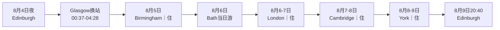

> [!summary] 结论先看
> - 按附件固定铁路顺序执行：**Edinburgh → Birmingham → Bath → London → Cambridge → York → Edinburgh**。
> - 附件铁路为 **£270.10／2人**，比上一版铁路 £291.10 便宜 **£21.00**；截图均显示2名成人及1张 Two Together Railcard。
> - 但反向日期的四晚私人房暂计约 **£395.19／2人**，铁路＋住宿＋寄存约 **£673.79–£691.79**，反而比上一版同口径高约 **£4.57–£5.57**。
> - 最大问题不是价格，而是首段：00:52抵达 Glasgow Central 后，车站官方开放时间为04:00–00:30，04:28列车前约有 **3小时08分无法在站内候车**。未解决安全候车前，不建议购买第一张拆票。
> - 行程从 **8月4日周二23:45** 开始；5个完整游览日为8月5日至9日，四晚依次住 Birmingham、London、Cambridge、York。

> [!danger] 订票硬阻断：Glasgow深夜换站
> 附件显示：23:45 Edinburgh Waverley → 00:37 Glasgow Queen Street；00:47步行出发，约00:52到 Glasgow Central；04:28再乘 Avanti。Network Rail列明 Glasgow Central 周一至周六开放 **04:00–00:30**，因此00:52到04:00不能默认留在站内。不要在街头带大箱硬等。必须先落实以下任一方案：
> 1. 为8月4日晚另订Glasgow Central附近、明确接受00:50后入住的24小时前台私人房；
> 2. 向 Network Rail／运营商确认当晚有正式、有人值守的候车安排；
> 3. 放弃附件首段，改用可安全执行的早班车。
> Glasgow房费或夜间接驳费**未计入本文预算**，一旦增加，附件路线的价格优势会消失。

# 路线总览

| 日期 | 附件固定铁路 | 时间 | 换乘／票种 | 附件价（2人） | 证据与风险 |
| --- | --- | --- | --- | ---: | --- |
| 8月4–5日 | Edinburgh Waverley → Birmingham New Street | 23:45–09:06 | 9小时21分；3次换乘；Split Tickets | £41.60 | 零售商付款前截图；中间拆票券未全部展开；National Rail同班联程公开价为£322.20 |
| 8月6日 | Birmingham New Street → Bath Spa | 08:42–11:01 | 2次换乘；Smart Change；CrossCountry＋GWR | £41.70 | Advance／拆票组合；不可退款，改签可能收费 |
| 8月6日 | Bath Spa → London Waterloo | 19:38–22:12 | 1次换乘；经Warminster／Salisbury；Super Off-Peak Single | £44.60 | GWR＋SWR；路线限制必须保持 |
| 8月7日 | London King’s Cross → Cambridge | 21:18–22:13 | 直达；Great Northern；Advance Single | £21.50 | 仅限指定班次；不可退款 |
| 8月8日 | Cambridge → York | 19:00–22:03 | 3小时03分；1次换乘；Split Tickets | £55.20 | CrossCountry＋LNER；付款前确认拆票点与误车保障 |
| 8月9日 | York → Edinburgh Waverley | 18:20–20:40 | 直达；LNER；Advance Single | £65.50 | 仅限指定班次；周日工程须出发前复核 |
|  | **铁路合计** |  |  | **£270.10** | 比上一版£291.10低£21.00 |
> [!warning] 票价证据等级
> 附件是2026-08-03约21:22的零售商“Go to payment”页面，不是已出票订单。第一段的£41.60尤其依赖拆票，而截图没有显示04:28之后的全部券段和换乘站。付款前必须展开 Ticket details，逐项截图：每张券的起终点、适用班次、Railcard、席别、限制代码及全程总价。不要只看路线卡片的合计数字。

- [National Rail：8月4日23:45 Edinburgh→Birmingham同班时间核验](https://www.nationalrail.co.uk/journey-planner/?type=single&origin=EDB&destination=BHM&leavingType=departing&leavingDate=040826&leavingHour=23&leavingMin=45&adults=2&railcards=2TR%7C1&extraTime=0)
- [Network Rail：Glasgow Central开放与设施](https://www.networkrail.co.uk/rail-travel/our-stations/glasgow-central/)
- [Two Together Railcard使用条款](https://www.twotogether-railcard.co.uk/using-your-railcard/travel-times-tickets/)
# 四晚住宿
查询口径：2026-08-03；2名成人、1间私人双人／双床房；Booking页面以美元显示且另加20% VAT。下表按 **£1≈US$1.33** 折算，仅作同口径预算，最终以英镑付款页为准。

| 入住 | 睡眠城市与推荐 | 私密房型 | 查询价与折算 | 晚到／寄存 | 为什么这样选 |
| --- | --- | --- | ---: | --- | --- |
| 8月5日 | [easyHotel Birmingham](https://www.booking.com/hotel/gb/easyhotel-birmingham.en-gb.html?checkin=2026-08-05&checkout=2026-08-06&group_adults=2&group_children=0&no_rooms=1) | 无窗私人双人房、独立卫浴 | US$63＋VAT≈**£56.84** | 24小时前台；提前寄存另收费 | New Street南口步行约3分钟；首日09:06到站即可放箱 |
| 8月6日 | [Clink261 London](https://www.booking.com/hotel/gb/clink261.en-gb.html?checkin=2026-08-06&checkout=2026-08-07&group_adults=2&group_children=0&no_rooms=1) | 私人双床房 | US$100＋VAT≈**£90.23** | 24小时前台；退房日寄存须在结算页确认费用 | King’s Cross步行约8分钟，便于次日晚21:18上车 |
| 8月7日 | [YHA Cambridge](https://www.booking.com/hotel/gb/yha-cambridge-cambridge.en-gb.html?checkin=2026-08-07&checkout=2026-08-08&group_adults=2&group_children=0&no_rooms=1) | 私人双床房 | US$135＋VAT≈**£121.80** | 24小时前台；到店前通知22:13后抵达；有行李房 | Cambridge站步行约5分钟，第二天取箱后直达车站 |
| 8月8日 | [Safestay York Micklegate](https://www.booking.com/hotel/gb/ace-hostel-york.en-gb.html?checkin=2026-08-08&checkout=2026-08-09&group_adults=2&group_children=0&no_rooms=1) | 私人双床房 | US$140＋VAT≈**£126.32** | 24小时前台；退房后寄存约£3／件 | York站步行约7分钟；22:03晚到仍可入住 |
|  | **四晚合计** |  | **约£395.19** |  | 房量与汇率会变动 |
> [!important] 房型不能选错
> Clink、YHA、Safestay页面同时销售宿舍床位。预订时必须看到“Private Twin／Private Double”“Sleeps 2 adults”，不能只按最低价点击。四个推荐价均可能是不可退款或低库存房型，应先解决Glasgow硬阻断，再集中下单。

# 大箱完整交接链

| 时间 | 大箱位置 | 操作与缓冲 |
| --- | --- | --- |
| 8月4日23:45–5日09:06 | 随身 | Glasgow换站和夜间候车全程携带；不要把箱留在无人值守区域 |
| 8月5日09:15–晚间 | easyHotel Birmingham | 到站后直接寄存；约19:30回酒店正式入住 |
| 8月6日07:55–11:05 | 随身上车 | 08:15前到New Street站，给两次换乘留足移动时间 |
| 8月6日11:10–18:40 | [Bath Luggage Storage Centre](https://www.bathluggagestorage.com/) | 13 Manvers Street，Bath Spa约2分钟；大箱£5.50；英文页08:00–19:00，务必18:40取箱 |
| 8月6日18:40–22:55 | 随身 | 19:10前进站；22:12到Waterloo后转往King’s Cross酒店 |
| 8月7日退房–20:15 | Clink261 | 前台或收费寄存；若酒店不接受退房日存放，改用King’s Cross商业寄存并预留£15 |
| 8月7日20:15–22:20 | 随身 | 20:35前到King’s Cross，21:18上车；22:13到Cambridge后步行至YHA |
| 8月8日退房–17:40 | YHA Cambridge | 行李房；17:40取箱，18:15前到站候车 |
| 8月8日19:00–22:15 | 随身 | 22:03到York，步行到Safestay；提前通知晚到 |
| 8月9日退房–17:20 | Safestay York | 前台寄存约£3；17:20取箱，17:40前到York站 |
| 8月9日18:20–20:40 | 随身 | LNER直达Edinburgh |
> [!warning] Bath寄存关门不可错过
> Radical Storage车站低价点18:00关门，不适合19:38列车。本文改用Bath Luggage Storage Centre；其英文页写19:00关门，中文页写20:00，按更早的19:00执行。18:40后不要再加景点或晚餐。

# 每日游览时间线
## 8月5日周三｜Birmingham｜恢复体力优先
预计有效游览：09:30–19:15；建议 **1.2万–1.5万步**。由于前一夜无法正常睡眠，不强行追求2万步。

| 时间 | 安排 | 费用／备注 |
| --- | --- | --- |
| 09:06–09:30 | New Street到站，去easyHotel寄存大箱 | 南口步行约3分钟 |
| 09:30–10:15 | 早餐＋Bullring、St Martin’s Church外观 | 免费 |
| 10:30–12:00 | Birmingham Museum & Art Gallery | 免费；官网常规10:00–17:00，临时展区可能调整 |
| 12:00–13:00 | Victoria Square、Council House、午餐 | 市中心步行 |
| 13:15–14:30 | Library of Birmingham观景层与Centenary Square | 免费 |
| 14:30–16:00 | Gas Street Basin、Brindleyplace、运河工业遗产 | 免费 |
| 16:15–17:30 | Jewellery Quarter短线 | 可按体力删减 |
| 17:45–19:15 | Chinese Quarter晚餐、Southside | 靠近酒店 |
| 19:30 | 入住、洗澡、尽早睡眠 | 次日07:45退房 |
**代表性付费开关**：Birmingham Back to Backs成人£13／人，必须预约导览；8月5日若票务日历有11:00左右空位，可替换BMAG前半段。若无票，不要打乱行程。
**免费替代**：BMAG＋Library＋运河工业遗产。
[Google Maps步行骨架](https://www.google.com/maps/dir/Birmingham+New+Street/St+Martin+in+the+Bull+Ring/Birmingham+Museum+and+Art+Gallery/Library+of+Birmingham/Gas+Street+Basin/Jewellery+Quarter/Birmingham+New+Street/)
## 8月6日周四｜Bath当日游｜晚车去London
预计有效游览：11:15–18:35；约 **1.5万–1.8万步**。

| 时间 | 安排 | 费用／备注 |
| --- | --- | --- |
| 07:45–08:15 | Birmingham退房、带箱进New Street | 08:42列车，不能踩点 |
| 08:42–11:01 | Birmingham → Bath Spa | 2次换乘 |
| 11:05–11:15 | Bath Luggage Storage Centre存大箱 | 大箱£5.50 |
| 11:25–13:10 | Roman Baths | 建议订11:30；8月Summer Lates开放至22:00，但本行程须赶车 |
| 13:10–13:40 | Bath Abbey | 周四常规10:00–17:30；可只看免费外观 |
| 13:40–14:30 | 午餐、Sally Lunn周边 | 避免长队餐厅 |
| 14:30–15:30 | Pulteney Bridge、Weir、Great Pulteney Street | 免费 |
| 15:30–17:00 | The Circus、Royal Crescent、Royal Victoria Park | 上坡段，雨天删减公园 |
| 17:00–18:20 | 老城回程、提前晚餐 | 18:20开始向寄存点返回 |
| 18:40 | 取箱 | 以19:00关门为硬截止 |
| 19:10 | 到Bath Spa候车 | 28分钟缓冲 |
| 19:38–22:12 | Bath Spa → London Waterloo | 经Warminster／Salisbury |
| 22:12–23:10 | Waterloo转Clink261 | 地铁约35–45分钟；疲劳时打车，提前通知酒店晚到 |
**代表性付费开关**：Roman Baths预算£29–33／人，提前票通常比现场便宜£2。
**免费替代**：Bath Abbey外观＋Pulteney Bridge＋Circus＋Royal Crescent＋Victoria Park。
[Google Maps步行骨架](https://www.google.com/maps/dir/Bath+Spa+Railway+Station/The+Roman+Baths/Bath+Abbey/Pulteney+Bridge/The+Circus/Royal+Crescent/Royal+Victoria+Park/Bath+Spa+Railway+Station/)
[小红书Bath路线地图原帖](https://www.xiaohongshu.com/explore/661e5aca000000000100758c)
## 8月7日周五｜London｜20:15回King’s Cross取箱
预计有效游览：08:45–20:00；约 **1.7万–2万步**。

| 时间 | 安排 | 费用／备注 |
| --- | --- | --- |
| 08:00–08:30 | 退房，把大箱留Clink261 | 先确认最晚20:15可取 |
| 08:30–09:00 | King’s Cross → Tower Hill | 使用contactless／Oyster |
| 09:00–12:00 | Tower of London | 09:00–17:30；最后入场16:30；成人£37 |
| 12:00–13:15 | Tower Bridge外观、St Dunstan in the East、Leadenhall Market | 免费 |
| 13:15–14:00 | 午餐 | City一带 |
| 14:00–15:00 | St Paul’s外观、Millennium Bridge | 免费 |
| 15:00–17:00 | British Museum | 免费；重点馆藏而非全馆扫完 |
| 17:00–19:15 | Covent Garden、Seven Dials、简餐 | 保持向King’s Cross回收 |
| 19:15–20:15 | 返回Clink取箱 | 若走累，直接坐地铁 |
| 20:35 | 到King’s Cross | 43分钟上车缓冲 |
| 21:18–22:13 | King’s Cross → Cambridge | Great Northern直达 |
| 22:20左右 | YHA Cambridge入住 | 预先备注晚到 |
**代表性付费开关**：Tower of London £37／人。
**免费替代**：Tower Bridge外观＋City教堂遗址＋British Museum＋Covent Garden。
[Google Maps步行骨架](https://www.google.com/maps/dir/Tower+of+London/St+Dunstan+in+the+East+Church+Garden/Leadenhall+Market/St+Paul%27s+Cathedral/British+Museum/Covent+Garden/King%27s+Cross+Station/)
## 8月8日周六｜Cambridge｜19:00去York
预计有效游览：08:45–17:40；约 **1.5万–1.8万步**。

| 时间 | 安排 | 费用／备注 |
| --- | --- | --- |
| 08:15–08:30 | 退房、YHA寄存大箱 | 确认17:40取箱 |
| 08:45–09:45 | Botanic Garden外围／Station Road慢走 | 若入园则另付费并压缩后段 |
| 10:00–11:30 | Fitzwilliam Museum | 周六10:00–17:00，免费 |
| 11:45–13:00 | King’s College Chapel与庭院 | 通常09:30–16:15，成人£18；必须按8月8日票务日历预约 |
| 13:00–14:00 | Market Square午餐 | 市集简餐 |
| 14:00–15:30 | Trinity、St John’s外观、Round Church | 免费外观线 |
| 15:30–16:45 | The Backs、Queens’ College周边、数学桥外观 | 河边慢走 |
| 16:45–17:20 | Parker’s Piece方向返回 | 不安排撑船，避免失控 |
| 17:40 | YHA取箱 | 约5分钟到站 |
| 18:15 | 到Cambridge站 | 45分钟缓冲 |
| 19:00–22:03 | Cambridge → York | 1次换乘；拆票组合 |
| 22:15左右 | Safestay York入住 | 已选24小时前台 |
**代表性付费开关**：King’s College Chapel £18／人。
**免费替代**：Fitzwilliam Museum＋Market Square＋学院外观＋The Backs。
[Google Maps步行骨架](https://www.google.com/maps/dir/Cambridge+Railway+Station/Fitzwilliam+Museum/King%27s+College+Chapel/Cambridge+Market+Square/Trinity+College/The+Round+Church/Queens%27+College/Cambridge+Railway+Station/)
## 8月9日周日｜York｜18:20回Edinburgh
预计有效游览：08:45–17:20；约 **1.5万–1.8万步**。

| 时间 | 安排 | 费用／备注 |
| --- | --- | --- |
| 08:15–08:30 | 退房、Safestay寄存大箱 | 约£3／件 |
| 08:45–09:50 | Micklegate Bar、市墙晨走 | 免费；雨天改河岸短线 |
| 10:00–11:30 | National Railway Museum | 每日10:00–17:00，免费；建议预订免费时段 |
| 11:30–12:30 | Museum Gardens、St Mary’s Abbey遗址 | 免费 |
| 12:45–14:15 | York Minster | 周日常规观光12:45–14:30；成人£18.20；8月9日需再次核对日历 |
| 14:15–15:30 | Shambles、Shambles Market、Stonegate | 午餐＋老城 |
| 15:30–16:25 | Clifford’s Tower外观、River Ouse | 不进塔也可完成历史线 |
| 16:25–17:15 | Micklegate方向回酒店 | 不再新增远点 |
| 17:20 | 取箱 | 约7分钟步行到站 |
| 17:40 | 到York站 | 40分钟缓冲 |
| 18:20–20:40 | York → Edinburgh Waverley | LNER直达 |
**代表性付费开关**：York Minster £18.20／人；票在9月1日前有效期政策以官网为准。
**免费替代**：National Railway Museum＋市墙＋Museum Gardens＋Shambles＋河岸。
[Google Maps步行骨架](https://www.google.com/maps/dir/Safestay+York/National+Railway+Museum/York+Museum+Gardens/York+Minster/The+Shambles/Clifford%27s+Tower/Safestay+York/York+Railway+Station/)
# 预算

| 类别 | 2人预算 | 口径 |
| --- | ---: | --- |
| 附件铁路 | £270.10 | 6个零售商付款前报价；Railcard已显示应用 |
| 四晚私人房 | 约£395.19 | 美元价＋20% VAT，按£1≈US$1.33折算 |
| 行李寄存 | £8.50–£26.50 | Bath大箱£5.50；York约£3；Birmingham／London／Cambridge按酒店实际收费浮动 |
| **铁路＋住宿＋寄存** | **£673.79–£691.79** | 不含Glasgow安全候车房费 |
| 市内交通 | £20–£35 | 主要为London深夜换站与市内地铁；打车则更高 |
| 饮食 | £180–£240 | 2人5天，早餐简化、每日一顿正餐 |
| 代表性付费景点 | £230.40–£238.40 | Back to Backs、Roman Baths、Tower、King’s、York Minster各1项 |
| **免费替代版总计** | **£873.79–£966.79** | 核心费用＋市内交通＋饮食 |
| **完整付费版总计** | **£1,104.19–£1,205.19** | 约£552.10–£602.60／人 |
> [!info] 与上一版的公平比较
> - 铁路：£270.10 vs £291.10，附件便宜£21.00。
> - 住宿：约£395.19 vs 约£368.12，附件顺序贵约£27.07，主要因为Cambridge周五和York周六私人房。
> - 铁路＋住宿＋寄存：本版£673.79–£691.79；上一版£669.22–£686.22。本版反而高约£4.57–£5.57。
> - 若为Glasgow凌晨候车另订房，本版会进一步变贵。因此附件证明的是“**车票更便宜**”，不是“**整趟旅行更便宜**”。

# 风险与最小调整
> [!danger] 第一段不能只凭低价购买
> £41.60相较National Rail同班公开联程价£322.20差距极大。拆票本身可以合法使用，但必须确认：全部券段覆盖全程、所有指定列车一致、Two Together Railcard应用正确、Glasgow步行换站满足最低换乘时间、延误后可按National Rail Conditions of Travel继续乘车。

> [!warning] Advance与拆票
> Advance票通常不可退款，只能改签并补差价／手续费；Split Tickets可能要求列车在拆票站停靠，即使不换座。付款后把每一张券分别保存到两人手机，并离线保存PDF或截图。

> [!warning] 晚到入住
> Clink261、YHA Cambridge、Safestay York均应在预订备注中写明预计到店时间。若列车延误超过30分钟，主动致电前台，不能只依赖“24小时前台”字样。

> [!warning] 动态开放与周日礼拜
> York Minster周日观光窗口短；King’s College也会因礼拜、学院活动临时变化。出发前24小时再次核验官方日历。若关闭，直接启用免费替代，不要为追景点压缩上车缓冲。

> [!tip] 最简单的替代路径
> 如果不接受Glasgow闭站候车，只替换 **Edinburgh→Birmingham首段**，其余5张附件车票和四晚住宿仍可保持不动；这是比推翻整条路线更小的修改。

# 订票与执行清单
## 先解决硬阻断
- [ ] 向Glasgow Central／运营商确认00:52–04:00正式候车安排
- [ ] 若无站内安排，取得8月4日晚Glasgow附近24小时前台私人房的可接受价格
- [ ] 若两项均失败，仅更换Edinburgh→Birmingham首段
## 铁路
- [ ] 在附件零售商付款页重新搜索6段，确认总价仍为£270.10
- [ ] 展开第一段04:28之后的全部换乘站和拆票券
- [ ] 核对每张券均为2名成人＋1张Two Together Railcard
- [ ] 核对拆票站停车条件、最低换乘时间和误车保障
- [ ] 保存全部票券、限制代码、座位和订单号
- [ ] 出发前24小时检查工程、罢工、取消及站台变化
## 住宿与行李
- [ ] 先订库存少且可接受退款条件的私人房；不要误选宿舍床位
- [ ] easyHotel备注09:06到达后提前寄存
- [ ] Clink261备注23:00左右入住，并确认退房日寄存至20:15
- [ ] YHA Cambridge备注22:20左右入住，并确认8月8日行李房
- [ ] Safestay York备注22:15左右入住，并确认£3寄存
- [ ] 预订Bath Luggage Storage Centre，按19:00关门执行
## 景点开关
- [ ] Birmingham Back to Backs仅在有合适导览时购买
- [ ] Roman Baths预订8月6日11:30左右
- [ ] Tower of London预订8月7日09:00
- [ ] King’s College按8月8日官方时段预约
- [ ] York Minster按8月9日周日开放窗口预约
- [ ] National Railway Museum预订免费入场时段
# 核验来源
- [附件同班National Rail时间页](https://www.nationalrail.co.uk/journey-planner/?type=single&origin=EDB&destination=BHM&leavingType=departing&leavingDate=040826&leavingHour=23&leavingMin=45&adults=2&railcards=2TR%7C1&extraTime=0)
- [Glasgow Central官方页面](https://www.networkrail.co.uk/rail-travel/our-stations/glasgow-central/)
- [easyHotel Birmingham房型与规则](https://www.booking.com/hotel/gb/easyhotel-birmingham.en-gb.html?checkin=2026-08-05&checkout=2026-08-06&group_adults=2&group_children=0&no_rooms=1)
- [Clink261房型与规则](https://www.booking.com/hotel/gb/clink261.en-gb.html?checkin=2026-08-06&checkout=2026-08-07&group_adults=2&group_children=0&no_rooms=1)
- [YHA Cambridge房型与规则](https://www.booking.com/hotel/gb/yha-cambridge-cambridge.en-gb.html?checkin=2026-08-07&checkout=2026-08-08&group_adults=2&group_children=0&no_rooms=1)
- [Safestay York房型与规则](https://www.booking.com/hotel/gb/ace-hostel-york.en-gb.html?checkin=2026-08-08&checkout=2026-08-09&group_adults=2&group_children=0&no_rooms=1)
- [Bath Luggage Storage Centre](https://www.bathluggagestorage.com/)
- [Birmingham Back to Backs](https://www.nationaltrust.org.uk/visit/birmingham-west-midlands/birmingham-back-to-backs)
- [Birmingham Museum & Art Gallery](https://www.birminghammuseums.org.uk/birmingham-museum-and-art-gallery)
- [Roman Baths开放与购票](https://www.romanbaths.co.uk/visit)
- [Tower of London开放时间](https://www.hrp.org.uk/tower-of-london/visit/opening-and-closing-times/)
- [Tower of London票价](https://www.hrp.org.uk/tower-of-london/visit/tickets-and-prices/)
- [Fitzwilliam Museum](https://fitzmuseum.cam.ac.uk/plan-your-visit)
- [King’s College Cambridge](https://www.kings.cam.ac.uk/opening-times-and-tickets)
- [York Minster](https://yorkminster.org/visit/plan-your-visit/)
- [National Railway Museum](https://www.railwaymuseum.org.uk/visit)
> [!note] 数据时效
> 铁路、房价、库存和开放时间均核验于2026-08-03。附件铁路价格是付款前截图；住宿价格为动态库存；景点可能因礼拜、活动或工程调整。所有实际付款都应以结算页为准。