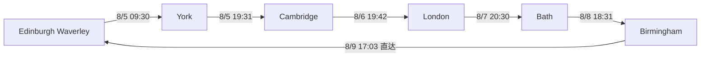

> [!summary] 推荐结论
> **日期：**2026-08-05（周三）—08-09（周日），2人，Edinburgh Waverley 往返。  
> **推荐顺序：**Edinburgh → **York → Cambridge → London → Bath → Birmingham** → Edinburgh。  
> **铁路：**最新复核约 **£291.10／2人**；最后一程为 Birmingham—Edinburgh 直达，无需拆票。  
> **四晚私人房：**查询时折算约 **£368.12／2人**。  
> **铁路＋住宿＋行李核心费用：约 £669.22–£686.22／2人**。  
> **含5项代表性付费景点、节制饮食和市内交通：约 £1,105.62–£1,197.62／2人**，即 **£552.81–£598.81／人**。  
> 选择免费景点替代后，预计可降至 **£869.22–£961.22／2人**。
> [!important] 为什么不是按城市清单原顺序
> Bath 位于西南，Cambridge 位于伦敦东北，York 位于东海岸主线。推荐顺序由北向南再向西，减少折返。  
> 最新复核找到 **17:03 Birmingham New Street → 22:10 Edinburgh Waverley** 的CrossCountry直达Advance票，两人约 **£71.70**。它比经Manchester拆票约£86.20更便宜、少一次换乘，也保留了约8小时Birmingham游览时间。
> [!warning] 查价口径
> 铁路最新复核时间：**2026-08-03 14:01 UTC**；住宿查询时间：**2026-08-03 15:02 GMT**。铁路均按 **2名成人＋1张 Two Together Railcard** 查询；酒店页面以美元显示，本文按约 **£1≈US$1.33**、再计页面标明的20% VAT折算。  
> 这些是“查询时可见价”，不是锁价。Advance／不可退款房价可能随时售罄；付款前必须再次核对总价、换乘站、床型、入住截止时间及工程施工。

# 🧭 路线总览

## 正向与反向比较

| 方向 | 铁路查询价／2人 | 实际影响 | 结论 |
|---|---:|---|---|
| **正向：York→Cambridge→London→Bath→Birmingham** | **£291.10** | York首日约7小时；Birmingham末日约8小时；睡 Cambridge、London、Bath、Birmingham | **推荐；完整住宿链已找到** |
| 反向：Birmingham→Bath→London→Cambridge→York | £343.10 | 首日15:06才到 Birmingham；周六需住 York | 铁路贵£52，且周六York私人房未取得稳定低价完整报价 |
| 正向、末段经Manchester拆票 | £305.60 | 多一次换乘，23:44才到Edinburgh | 仅作为17:03直达售罄后的备用 |
> [!tip] 不采用“假夜车省住宿”
> 五城之间没有适合本行程的国内卧铺。London Paddington 19:39—Bath 23:13虽只约£42.70，但需2次换乘、耗时3小时34分；20:30直达只多约£7.90，却晚出发51分钟、早到1小时23分钟，因此选择直达更合理。

# 🎟️ 铁路订票表

| 日期     | 区段                                            | 推荐班次            |  换乘 |      查询价／2人 | 复核                                                                                                                                                                                                                   |
| ------ | --------------------------------------------- | --------------- | --: | ----------: | -------------------------------------------------------------------------------------------------------------------------------------------------------------------------------------------------------------------- |
| 8/5 周三 | Edinburgh Waverley → York                     | **09:30–11:52** |  直达 |  **£65.50** | [National Rail](https://www.nationalrail.co.uk/journey-planner/?type=single&origin=EDB&destination=YRK&leavingType=departing&leavingDate=050826&leavingHour=09&leavingMin=30&adults=2&railcards=2TR%7C1&extraTime=0) |
| 8/5 周三 | York → Cambridge                              | **19:31–22:05** |  1次 |  **£39.10** | [National Rail](https://www.nationalrail.co.uk/journey-planner/?type=single&origin=YRK&destination=CBG&leavingType=departing&leavingDate=050826&leavingHour=19&leavingMin=30&adults=2&railcards=2TR%7C1&extraTime=0) |
| 8/6 周四 | Cambridge → London Kings Cross                | **19:42–20:32** |  直达 |  **£21.50** | [National Rail](https://www.nationalrail.co.uk/journey-planner/?type=single&origin=CBG&destination=KGX&leavingType=departing&leavingDate=060826&leavingHour=19&leavingMin=30&adults=2&railcards=2TR%7C1&extraTime=0) |
| 8/7 周五 | London Paddington → Bath Spa                  | **20:30–21:50** |  直达 |  **£50.60** | [National Rail](https://www.nationalrail.co.uk/journey-planner/?type=single&origin=PAD&destination=BTH&leavingType=departing&leavingDate=070826&leavingHour=20&leavingMin=20&adults=2&railcards=2TR%7C1&extraTime=0) |
| 8/8 周六 | Bath Spa → Birmingham New Street              | **18:31–20:51** |  1次 |  **£42.70** | [National Rail](https://www.nationalrail.co.uk/journey-planner/?type=single&origin=BTH&destination=BHM&leavingType=departing&leavingDate=080826&leavingHour=18&leavingMin=30&adults=2&railcards=2TR%7C1&extraTime=0) |
| 8/9 周日 | Birmingham New Street → Edinburgh Waverley | **17:03–22:10** |  直达 |  **£71.70** | [National Rail](https://www.nationalrail.co.uk/journey-planner/?type=single&origin=BHM&destination=EDB&leavingType=departing&leavingDate=090826&leavingHour=17&leavingMin=03&adults=2&railcards=2TR%7C1&extraTime=0) |
|        | **合计**                                        |                 |     | **£291.10** |                                                                                                                                                                                                                      |
> [!warning] 长途直达规则
> 17:03直达全程约5小时07分，Advance票绑定指定班次。建议订座并提前备好晚餐；两人必须全程同行并携带同一张有效Railcard。

## Two Together Railcard
- 工作日04:30–09:29不可使用折扣；首班安排在周三09:30，正好满足限制。
- 周六、周日通常全天可用。
- Railcard年费现为 **£35**；预算默认已经持有，若尚未购买需另加£35。
- 官方：[时段规则](https://www.twotogether-railcard.co.uk/using-your-railcard/travel-times-tickets/)｜[购买Railcard](https://www.twotogether-railcard.co.uk/)
# 🛏️ 四晚住宿与大箱交接

| 夜晚             | 私人房基准                                                                                              | 到站／步行                     |      查询时折算价 | 晚到与行李                           |
| -------------- | -------------------------------------------------------------------------------------------------- | ------------------------- | ----------: | ------------------------------- |
| 8/5 Cambridge  | [YHA Cambridge](https://www.yha.org.uk/hostel/yha-cambridge) 私人4床房、独立卫浴，仅2人使用                      | Cambridge 22:05；约5分钟      |  **£76.69** | 24小时前台；次日退房后寄存需再次确认是否免费         |
| 8/6 London     | [Clink261](https://www.clinkhostels.com/clink261/) 私人双床房                                           | Kings Cross 20:32；约8分钟    |  **£83.01** | 24小时前台；官网称有行李寄存，费用／最晚取件需入住时确认   |
| 8/7 Bath       | [The Z Hotel Bath](https://www.thezhotels.com/hotels/bath/) 无窗Queen房                               | Bath Spa 21:50；约10分钟      | **£121.80** | 24小时前台、允许晚到；退房后行李寄存通常免费         |
| 8/8 Birmingham | [ibis budget Birmingham Centre](https://all.accor.com/hotel/5678/index.en.shtml) 私人Superior Double | New Street 20:51；约12–15分钟 |  **£86.62** | 24小时前台；有行李寄存；另有约£50可退押金，不计入旅行消耗 |
|                | **四晚合计**                                                                                           |                           | **£368.12** | 多为页面最低可见、不可退／预付档                |
> [!warning] 住宿价格的货币转换
> Booking页面本次以美元显示：Cambridge US$85、London US$92、Bath US$135、Birmingham US$96，均另示20% VAT。本文按£1≈US$1.33折算，仅用于方案比较；实际英镑扣款、银行卡汇率与税费以结账页为准。

## 🧳 一个大箱的完整交接链
1. **8/5 York：**到站后放入车站旁 [Left Luggage at York Station](http://www.leftluggageyork.co.uk/)；周三营业08:00–20:00。官网未公开当前价格，预算暂留£10；18:50前取回，避免误19:31列车。
2. **8/5晚—8/6 Cambridge：**随身带到YHA；退房时明确要求寄存至19:10左右。
3. **8/6晚—8/7 London：**带到Clink261；若退房后不能存到18:30，改用 [Excess Baggage Company Kings Cross](https://www.left-baggage.co.uk/en/locations/left-luggage-kings-cross) 兜底，按约£15／件预留。
4. **8/7晚—8/8 Bath：**Z Hotel办理晚到入住；退房后寄存，17:40左右取回。
5. **8/8晚—8/9 Birmingham：**ibis budget寄存至16:10；随后步行到New Street。
6. **8/9返程：**16:15左右从酒店取箱，直接带上17:03 Birmingham→Edinburgh直达列车。
# 📅 逐日行程
## Day 1｜8/5 周三：York——铁路史、哥特教堂与老城
**有效游览：约12:05–19:00｜步行约9–11 km／1.2–1.5万步**
- **09:30** Edinburgh Waverley出发。
- **11:52** York到站；寄存大箱。
- **12:10–13:35** [National Railway Museum](https://www.railwaymuseum.org.uk/visit)（免费，通常10:00–17:00）。
- **13:35–14:00** 步行至York Minster，途中简餐。
- **14:00–15:30** [York Minster](https://yorkminster.org/visit/plan-your-visit/)；成人约£18.20／人。
- **15:30–16:20** Treasurer's House外观、Goodramgate、Monk Bar。
- **16:20–17:20** Shambles、Shambles Market、Whip-Ma-Whop-Ma-Gate。
- **17:20–18:25** 城墙可开放路段／Museum Gardens二选一。
- **18:25–18:50** 回车站取箱并买晚餐。
- **19:31–22:05** 前往Cambridge，1次换乘。
- **22:10后** YHA Cambridge入住。
> [!choice] York门票开关
> - [x] York Minster：£36.40／2人。
> - [ ] 免费替代：National Railway Museum＋城墙＋Shambles＋Museum Gardens，取消Minster内部参观。

[Google Maps步行骨架](https://www.google.com/maps/dir/?api=1&origin=York+Railway+Station&destination=York+Railway+Station&waypoints=National+Railway+Museum%7CYork+Minster%7CShambles+Market%7CYork+City+Walls%7CMuseum+Gardens&travelmode=walking)
**攻略地图参考（只放来源链接）：**[东行西晃｜2026英国约克不走回头路一日游旅游攻略地图](https://www.xiaohongshu.com/explore/67892eb5000000001602268c)
## Day 2｜8/6 周四：Cambridge——学院、教堂与博物馆
**有效游览：约09:00–19:10｜步行约11–13 km／1.5–1.8万步**
- **08:30–09:00** 退房寄存大箱。
- **09:00–09:45** Cambridge University Botanic Garden外缘／Station Road城市观察；若想省步数可直接去Fitzwilliam。
- **10:00–11:30** [Fitzwilliam Museum](https://www.fitzmuseum.cam.ac.uk/visit-us)（免费；周四通常开放）。
- **11:45–13:00** [King's College Chapel](https://www.kings.cam.ac.uk/opening-times-and-tickets)；8月日历显示09:30起开放，成人标准票£17／人，具体末次入场按当天日历。
- **13:00–14:00** Market Square午餐、Great St Mary's Church外观。
- **14:00–15:30** Senate House、Trinity Street、St John's College与Bridge of Sighs外观。
- **15:30–17:00** The Backs、Mathematical Bridge外观、Queens' College周边。
- **17:00–18:15** Round Church、老城咖啡／书店。
- **18:15–19:10** 回YHA取箱并步行至车站。
- **19:42–20:32** 直达London Kings Cross；随后入住Clink261。
> [!choice] Cambridge门票开关
> - [x] King's College Chapel：£34／2人。
> - [ ] 免费替代：Fitzwilliam Museum＋The Backs＋学院外观。
> - [ ] Punting：非核心，现场价波动大；若加入，应删除一个学院步行段并增加至少£25–£50／2人。

[Google Maps步行骨架](https://www.google.com/maps/dir/?api=1&origin=YHA+Cambridge&destination=YHA+Cambridge&waypoints=Fitzwilliam+Museum%7CKing%27s+College+Chapel%7CCambridge+Market+Square%7CSt+John%27s+College%7CThe+Backs%7CThe+Round+Church&travelmode=walking)
**攻略地图参考（只放来源链接，不复制平台图片）：**
- [沈周_Lin｜伦敦往返剑桥一日游攻略（含地图）](https://www.xiaohongshu.com/explore/6999f1c200000000280233f2)
- [Doris刀姐｜剑桥一日游不迷路：官方旅游地图](https://www.xiaohongshu.com/explore/68ab78d8000000001d00c390)
## Day 3｜8/7 周五：London——伦敦塔、金融城与大英博物馆
**有效游览：约08:45–18:20｜步行约12–15 km／1.7–2万步；另乘地铁**
- **08:15–08:35** 退房，把大箱留在Clink261。
- **08:35–09:00** Kings Cross→Tower Hill地铁，避免首段无意义步行。
- **09:00–11:45** [Tower of London](https://www.hrp.org.uk/tower-of-london/visit/tickets-and-prices/)；成人£37／人。
- **11:45–12:30** Tower Bridge外观、St Dunstan in the East。
- **12:30–13:20** Leadenhall Market／金融城简餐。
- **13:20–14:00** St Paul's Cathedral外观、Millennium Bridge视角。
- **14:00–15:00** 步行或公交到Bloomsbury。
- **15:00–17:00** [British Museum](https://www.britishmuseum.org/visit)（免费；建议预约免费时段）。
- **17:00–17:35** Covent Garden快速停留或直接返回Clink。
- **17:35–18:20** 取箱；Kings Cross→Paddington地铁。
- **19:45前** Paddington候车、补给晚餐。
- **20:30–21:50** 直达Bath Spa；步行到Z Hotel入住。
> [!choice] London门票开关
> - [x] Tower of London：£74／2人。
> - [ ] 免费替代：British Museum＋金融城教堂外观＋Leadenhall Market＋South Bank。
> [!warning] London行李
> 不要默认Clink可以免费寄存到18:20。入住当晚先问清最晚取件和费用；若不行，立即在线预订Kings Cross商业寄存，不要当天临时拖箱穿城。

[Google Maps核心步行段](https://www.google.com/maps/dir/?api=1&origin=Tower+Hill+Underground+Station&destination=The+British+Museum&waypoints=Tower+of+London%7CSt+Dunstan+in+the+East%7CLeadenhall+Market%7CSt+Paul%27s+Cathedral&travelmode=walking)
**攻略地图参考（只放来源链接）：**[行走的鹿皮皮｜伦敦旅行地图＋路线攻略](https://www.xiaohongshu.com/explore/6a36251a000000000803cab1)
## Day 4｜8/8 周六：Bath——罗马遗迹与乔治时代城市
**有效游览：约09:00–17:40｜步行约10–12 km／1.4–1.7万步**
- **08:30–09:00** 退房，行李留在Z Hotel。
- **09:00–11:00** [Roman Baths](https://www.romanbaths.co.uk/tickets)；8月成人网上票约£33／人，必须按具体时段购票。
- **11:00–11:35** Bath Abbey内部／广场；是否购塔楼票现场决定。
- **11:35–12:20** Pulteney Bridge、堰坝、Grand Parade。
- **12:20–13:15** Great Pulteney Street午餐。
- **13:15–14:00** Holburne Museum外观与Sydney Gardens。
- **14:00–15:20** The Circus、Royal Crescent。
- **15:20–16:10** Royal Victoria Park／No.1 Royal Crescent外观。
- **16:10–17:00** [Bath World Heritage Centre](https://www.bathworldheritage.org.uk/visit)（免费）或老城购物。
- **17:00–17:40** 返回Z Hotel取箱，步行至Bath Spa。
- **18:31–20:51** 前往Birmingham，1次换乘。
- **21:05左右** ibis budget入住。
> [!choice] Bath门票开关
> - [x] Roman Baths：预算£66／2人。
> - [ ] 免费替代：Bath World Heritage Centre＋Abbey外观＋Pulteney Bridge＋Circus＋Royal Crescent。

[Google Maps步行骨架](https://www.google.com/maps/dir/?api=1&origin=The+Z+Hotel+Bath&destination=The+Z+Hotel+Bath&waypoints=Roman+Baths%7CBath+Abbey%7CPulteney+Bridge%7CHolburne+Museum%7CThe+Circus%7CRoyal+Crescent%7CBath+World+Heritage+Centre&travelmode=walking)
**攻略地图参考（只放来源链接）：**
- [小狗的留学干饭日记｜巴斯一日游省钱版＋景点地图定位](https://www.xiaohongshu.com/explore/661e5aca000000000100758c)
- [米米雪在英国｜巴斯小镇一日游路线](https://www.xiaohongshu.com/explore/6a5b4900000000001002b404)
## Day 5｜8/9 周日：Birmingham——工人住宅、城市博物馆与运河
**有效游览：约08:45–16:20｜步行约10–12 km／1.4–1.7万步**
- **08:30–08:45** 退房，把大箱留在ibis budget。
- **09:00–09:45** St Martin in the Bull Ring、Bullring外观与老市场区域。
- **10:00–11:30** [Birmingham Back to Backs](https://www.nationaltrust.org.uk/visit/birmingham-west-midlands/birmingham-back-to-backs)完整导览；成人无Gift Aid约£13／人，仅限预订导览。
- **11:45–13:15** [Birmingham Museum and Art Gallery](https://www.birminghammuseums.org.uk/birmingham-museum-and-art-gallery)；开放馆区通常免费，特展另计。
- **13:15–14:00** Victoria Square／Colmore Row午餐。
- **14:00–14:45** [Library of Birmingham](https://www.birmingham.gov.uk/libraryofbirmingham)与Centenary Square。
- **14:45–15:40** Gas Street Basin、Brindleyplace运河区。
- **15:40–16:15** 回酒店取箱。
- **16:15–16:45** 步行到New Street并进站。
- **17:03–22:10** Birmingham New Street→Edinburgh Waverley，CrossCountry直达；上车前备好晚餐。
> [!warning] Back to Backs是本计划最需要先锁定的景点
> 仅按定时导览开放。官方票务页已显示“25 June onwards”场次，但网页未稳定暴露8月9日具体余票。若无法订到10:00–11:30附近时段，立即改为免费路线，不要为了候补影响17:03列车。
> [!choice] Birmingham门票开关
> - [x] Back to Backs完整导览：£26／2人。
> - [ ] 免费替代：BMAG＋Library of Birmingham＋Gas Street Basin＋Jewellery Quarter。

[Google Maps步行骨架](https://www.google.com/maps/dir/?api=1&origin=ibis+budget+Birmingham+Centre&destination=ibis+budget+Birmingham+Centre&waypoints=St+Martin+in+the+Bull+Ring%7CBirmingham+Back+to+Backs%7CBirmingham+Museum+and+Art+Gallery%7CLibrary+of+Birmingham%7CGas+Street+Basin&travelmode=walking)
**攻略地图参考（只放来源链接）：**[getupearly:P｜Birmingham vibe：伯明翰一日游（含地图）](https://www.xiaohongshu.com/explore/63f92c6e0000000014025364)
# 💷 两人预算

| 类别 | 低值 | 高值 | 说明 |
|---|---:|---:|---|
| 6张铁路票 | £291.10 | £291.10 | 已含Railcard折扣，不含Railcard购买费 |
| 4晚私人房 | £368.12 | £368.12 | 按美元展示价＋20% VAT折算 |
| 大箱寄存 | £10 | £27 | York约£10预算；London最坏增加约£15；Birmingham留£2余量 |
| **核心：铁路＋住宿＋寄存** | **£669.22** | **£686.22** | 先锁定这一部分 |
| York Minster | £36.40 | £36.40 | 2人 |
| King's College Chapel | £34 | £34 | 2人 |
| Tower of London | £74 | £74 | 2人 |
| Roman Baths | £66 | £66 | 2人，按约£33／人 |
| Birmingham Back to Backs | £26 | £26 | 2人完整导览 |
| **5项付费景点** | **£236.40** | **£236.40** | 全部可切换为免费方案 |
| 五天饮食 | £180 | £240 | 2人；早餐简化、午餐便捷、晚餐普通餐馆 |
| 市内交通 | £20 | £35 | 主要用于London地铁及必要公交 |
| **完整总计** | **£1,105.62** | **£1,197.62** | **£552.81–£598.81／人** |
| 免费景点版总计 | £869.22 | £961.22 | 取消5项付费景点 |
> [!info] 未计入
> 若尚未拥有Railcard，另加£35；ibis budget约£50可退押金不计作消费，但需预留银行卡额度。纪念品、酒吧、Punting、Bath Abbey塔楼和付费特展均未计入。

# 🔧 最值得调整的开关
- [x] 采用正向路线：York→Cambridge→London→Bath→Birmingham。
- [x] 最后一日乘17:03 Birmingham→Edinburgh直达，避免拆票和换乘。
- [x] London→Bath选20:30直达£50.60。
- [ ] 极限省£7.90：改19:39、2次换乘、23:13到Bath；**不推荐**。
- [x] 保留所有5项代表性付费景点。
- [ ] 取消Tower of London，节省£74。
- [ ] 取消Roman Baths，节省£66。
- [ ] 取消York Minster，节省£36.40。
- [ ] 取消King's College Chapel，节省£34。
- [ ] 取消Back to Backs，节省£26。
- [ ] 加入Cambridge Punting；需要删减The Backs步行段并另加预算。
- [ ] 若London行李不能存到18:20，立即预订Kings Cross商业寄存。
# ✅ 下单顺序
1. [ ] 在National Rail逐段重新打开6个查询链接，确认班次仍有同价票。
2. [ ] 先买 **Birmingham→Edinburgh 17:03直达**，因为它决定末日游览与返程可执行性。
3. [ ] 买Edinburgh→York及York→Cambridge。
4. [ ] 买Cambridge→London、London→Bath、Bath→Birmingham。
5. [ ] 预订YHA Cambridge、Clink261、Z Hotel Bath、ibis budget Birmingham；截图保留床型、税费和晚到规则。
6. [ ] 给YHA、Clink、Z Hotel、ibis发消息确认“1个大箱可寄存至计划取件时间”。
7. [ ] 预约Back to Backs；若没有合适时段，切换免费方案。
8. [ ] 预约Roman Baths、King's College Chapel、Tower of London、York Minster。
9. [ ] 出发前48小时复查铁路工程、站台变化和酒店消息。
10. [ ] 准备Two Together Railcard、两人证件、充电宝、雨具及£1／£2硬币。
# 🔗 核心来源
- [National Rail Journey Planner](https://www.nationalrail.co.uk/)
- [Two Together Railcard时间限制](https://www.twotogether-railcard.co.uk/using-your-railcard/travel-times-tickets/)
- [York Station行李寄存](http://www.leftluggageyork.co.uk/)
- [National Railway Museum](https://www.railwaymuseum.org.uk/visit)
- [York Minster](https://yorkminster.org/visit/plan-your-visit/)
- [King's College Cambridge开放与票价](https://www.kings.cam.ac.uk/opening-times-and-tickets)
- [Fitzwilliam Museum](https://www.fitzmuseum.cam.ac.uk/visit-us)
- [Tower of London](https://www.hrp.org.uk/tower-of-london/visit/tickets-and-prices/)
- [British Museum](https://www.britishmuseum.org/visit)
- [Roman Baths](https://www.romanbaths.co.uk/tickets)
- [Birmingham Back to Backs](https://www.nationaltrust.org.uk/visit/birmingham-west-midlands/birmingham-back-to-backs)
- [Birmingham Museum and Art Gallery](https://www.birminghammuseums.org.uk/birmingham-museum-and-art-gallery)
> [!note] 图片策略
> 按本次要求，本文**未放纯建筑装饰图**。小红书攻略图只保留原作者帖子链接，避免不稳定CDN、过期防盗链及来源混淆；真正执行路线以本文时间线、Google Maps步行链接和Mermaid总图为准。