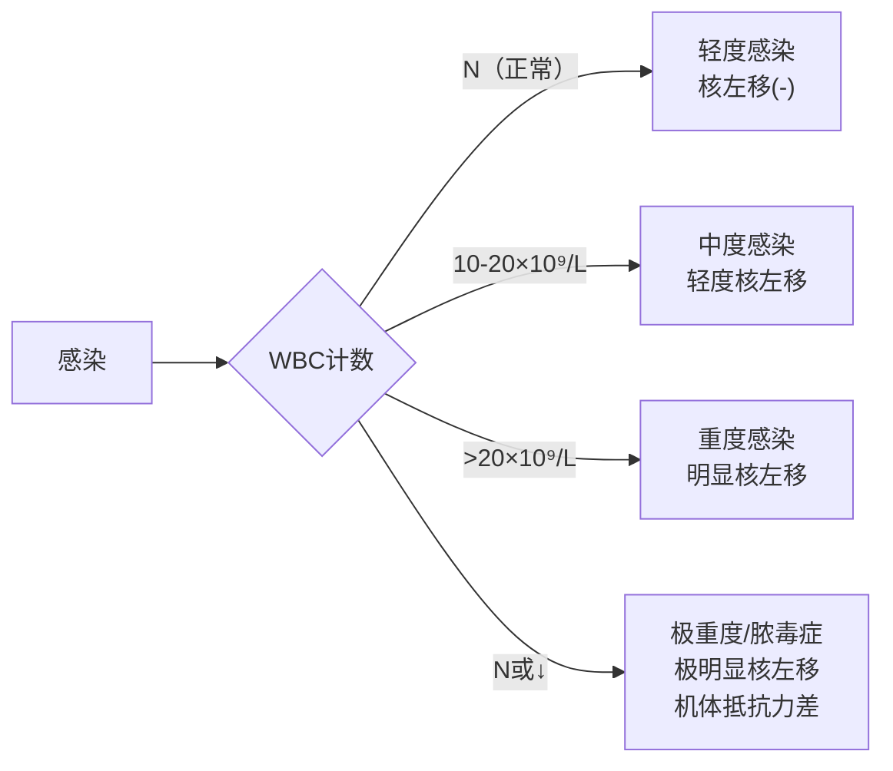
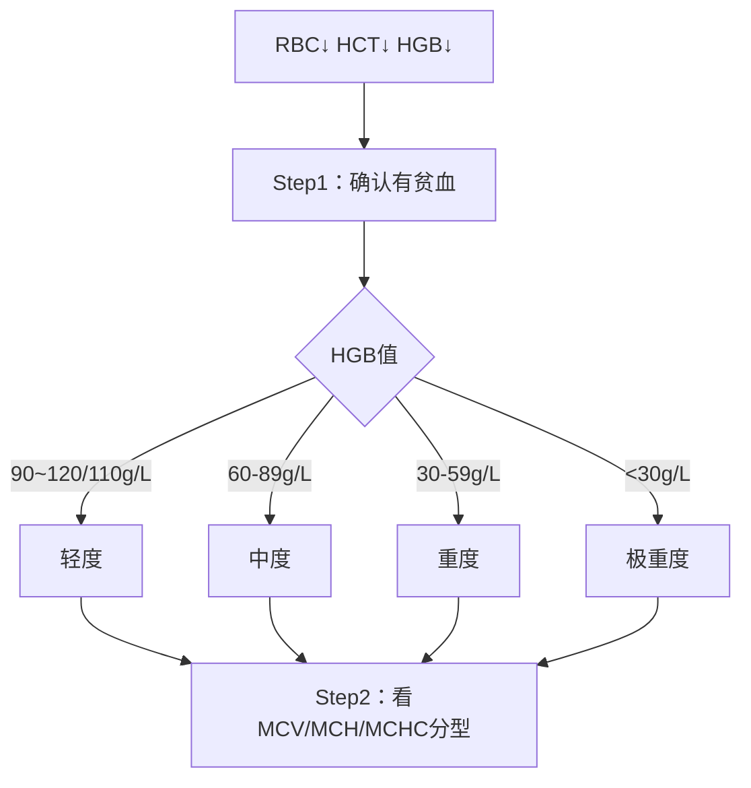
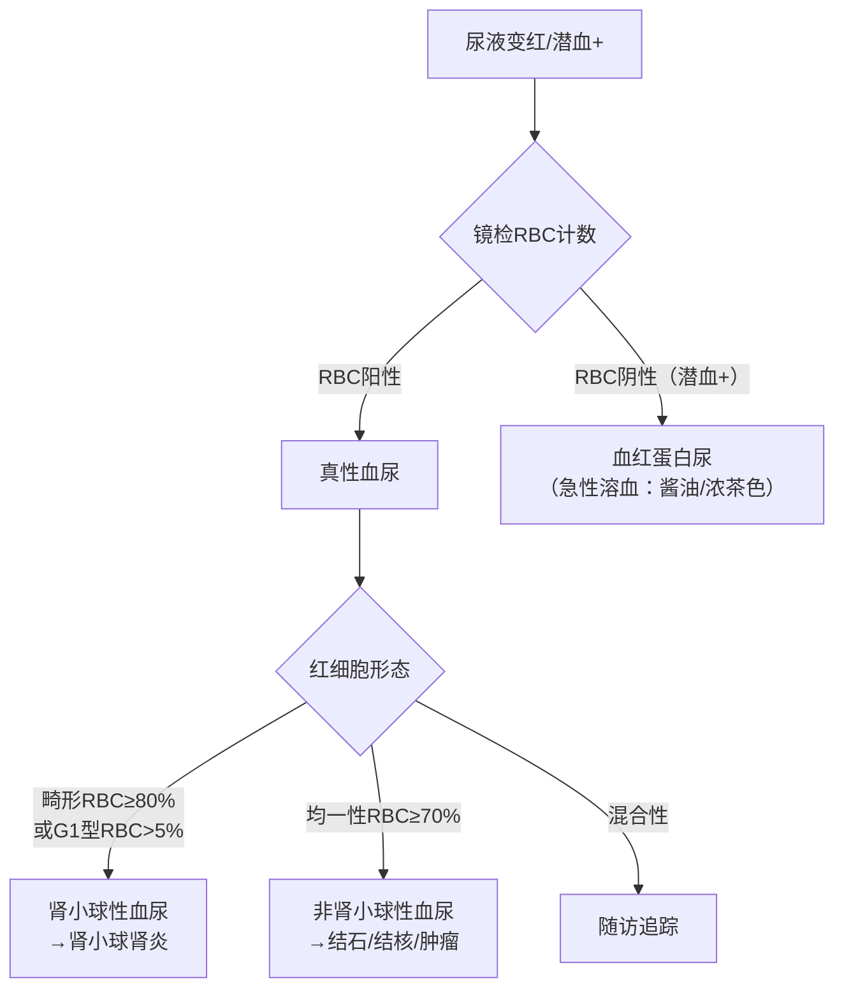
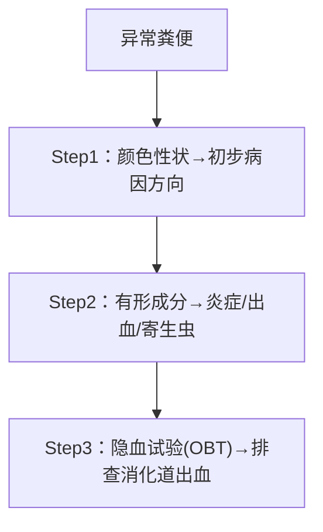
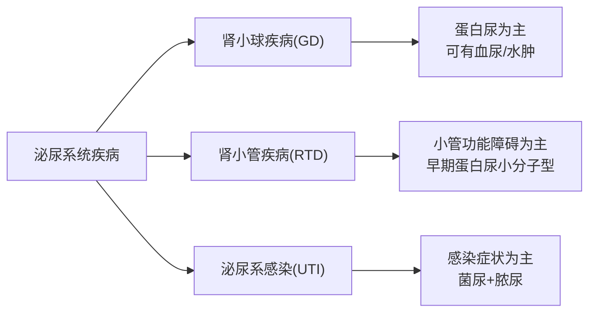
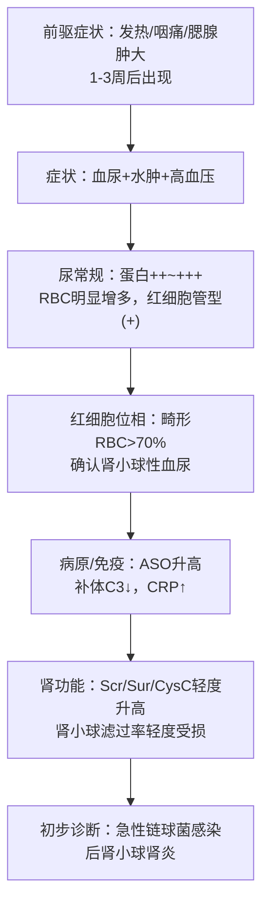
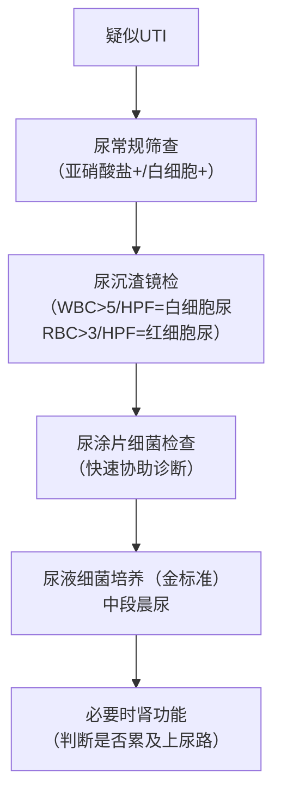
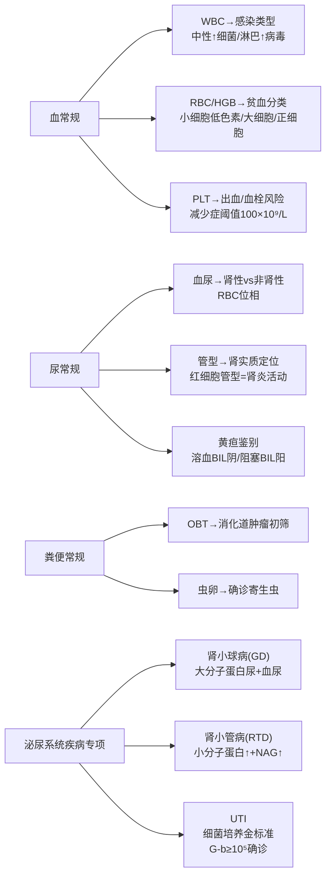

| 项目        | 内容                                                                              |
| --------- | ------------------------------------------------------------------------------- |
| 课件来源      | PPT1（78页）：三大常规；PPT2（76页）：泌尿系统疾病实验诊断                                             |
| 逻辑模板      | 模板2（鉴别诊断重点单元）为主轴——两套课件均以"从症状/指标异常→鉴别病因→确诊路径"为核心逻辑，兼用模板1（完整疾病单元）处理肾病综合征、ATN等专病单元 |
| 核心重点（⭐⭐⭐） | 血常规三大参数分析链、贫血形态分类、尿常规血尿/蛋白尿/管型诊断、粪便隐血+黄疸鉴别、急性肾小球肾炎诊断路径、肾病综合征"三高一低"、泌尿系感染细菌培养判读  |
| 口诀数量      | 3个                                                                              |
| 预估总阅读时间   | 约 60 min                                                                        |
***
# 第一部分：血常规（三大常规之一）
⏱ 阅读约 20 min
📎 PPT1 第 4-32 页
血常规速览：通过检测白细胞、红细胞、血小板三大系统参数，对感染类型、贫血性质和出血风险进行**初筛**，是各系统疾病实验诊断的基础入口。重点等级：⭐⭐⭐
***
## 1. 白细胞（WBC）：区分感染类型
📎 PPT1 第 7-12 页
**参考区间**：成人 (4～10)×10⁹/L；新生儿 (15～20)×10⁹/L；6月～2岁 (11～12)×10⁹/L；儿童 (5～12)×10⁹/L
### 1.1 白细胞分类计数 — 感染初筛

| 分类 | 缩写 | 主要功能 | 升高意义 |
|------|------|---------|---------|
| 中性粒细胞 | NEUT | 防御细菌 | ↑→细菌感染（WBC↑ NEUT↑）|
| 淋巴细胞 | LYMPH | 细胞/体液免疫 | ↑→病毒感染（WBC↓ LYMPH↑）|
| 嗜酸性粒细胞 | EO | 消除过敏原 | ↑→过敏、寄生虫感染 |
| 嗜碱性粒细胞 | BASO | 细胞致敏 | ↑→过敏、自身免疫 |
| 单核细胞 | MONO | 吞噬清除 | ↑→感染或感染恢复期 |
> [!NOTE] 📌 请注意
> 记住"细菌升中性、病毒升淋巴"——这是血常规最高频考点，反复出现在练习题中。
### 1.2 核左移——判断感染严重程度
📎 PPT1 第 10-12 页
**核左移**：中性杆状核粒细胞 >总数5%（尚未完全成熟就被"提前上岗"，提示***骨髓造血应激旺盛***）。**核右移**：核分叶≥5叶的中性粒细胞 >3%（提示*DNA合成障碍*）。

> [!NOTE] 📌 请注意
> 核左移分两类：**再生性核左移**（WBC↑，机体反应好）vs **退行性核左移**（WBC↓或N，预后差）。极重度感染时WBC反而下降，是骨髓储备耗竭的危险信号，别和病毒感染混淆。
***
## 2. 红细胞（RBC）：贫血初筛与分类
📎 PPT1 第 14-22 页
**参考区间**：男 4.3-5.8×10¹²/L；女 3.8-5.1×10¹²/L；血红蛋白（HGB）男 130-175 g/L，女 115-150 g/L
### 2.1 贫血诊断三步走

### 2.2 贫血形态分类（⭐⭐⭐ 必须记住）
📎 PPT1 第 17 页

| 类型       | MCV | MCH | MCHC | 常见病因               | 确诊路径           |
| -------- | --- | --- | ---- | ------------------ | -------------- |
| 正细胞性贫血   | N   | N   | N    | 再障、溶血、急性失血         | RET计数、骨髓检查     |
| 大细胞性贫血   | ↑   | ↑   | N    | **巨幼细胞性贫血**        | 叶酸/VitB12、骨髓涂片 |
| 小细胞低色素贫血 | ↓   | ↓   | ↓    | **缺铁性贫血**、地贫、铁粒幼贫血 | 血清铁蛋白、铁染色、Hb电泳 |
| 单纯小细胞性贫血 | ↓   | ↓   | N    | 慢性感染、慢性肾炎          | 病史+其他诊断        |
> [!TIP] 💡 记忆辅助
> **口诀："大叶小缺慢单正再溶"**
> 解释：大细胞→巨幼（叶酸/B12缺乏）；小细胞低色素→缺铁；单纯小细胞→慢性病；正细胞→再障/溶血/急失血。
### 2.3 特殊红细胞形态的提示方向
📎 PPT1 第 21-22 页

| 形态 | 提示疾病 |
|------|---------|
| 球形红细胞 | 遗传性球形红细胞增多症、自身免疫溶血性贫血 |
| 靶形细胞 | 珠蛋白生成障碍性贫血（地中海贫血）、异常Hb病 |
| 镰刀状细胞 | 镰形细胞性贫血（基因突变，Hb异常） |
| 泪滴形细胞 | 骨髓纤维化 |
| 有核红细胞 | 骨髓增生异常 |
> [!NOTE] 📌 请注意
> 网织红细胞（RET，尚未完全成熟的红细胞，含残余RNA）反映骨髓红系造血能力：治疗有效时RET升高是好的反应指标。
***
## 3. 血小板（PLT）：出血风险初筛
📎 PPT1 第 24-26 页
**参考区间**：成人 125-350×10⁹/L；PLT >1000×10⁹/L时血栓风险显著升高；PLT <100×10⁹/L为血小板减少症阈值。

| 变化   | 常见原因                                                                                   |
| ---- | -------------------------------------------------------------------------------------- |
| 原发增多 | 原发性血小板增多症                                                                              |
| 继发增多 | 急慢性**炎症**、**缺铁性贫血**、溶血性贫血（本章案例正是此情况）。 原理：血小板生成素升高。炎症因子刺激下增加（炎症），缺铁（缺铁贫），骨髓代偿性增生（溶血） |
| 生成减少 | 再生障碍性贫血、白血病                                                                            |
| 破坏过多 | 血小板自身抗体、肝硬化                                                                            |
| 消耗过多 | DIC（弥散性血管内凝血，凝血系统广泛激活导致血小板大量消耗）                                                        |
> [!WARNING] ⚠️ 常见疑问
> **Q：血小板计数偏低时，一定是真的减少吗？**
> A：不一定！EDTA依赖性假性血小板减少症（EDTA是常用抗凝剂，部分患者产生依赖EDTA的血小板聚集抗体导致假减少）和大血小板（仪器误判为红细胞碎片）都会造成假性低值。遇到PLT低时，先重复计数+血涂片镜检，排除假性降低再诊断。
***
## 4. 血常规干扰因素
📎 PPT1 第 28 页
采血部位/体位、生理性波动（清晨偏低）、运动、温度、用药，以及标本须在4小时内完成检测，均会影响结果。报告"怪怪"时，先问"这血是怎么抽的？"
***
## 5. 本章（血常规）核心要点
> [!SUMMARY] 📝 核心要点
> 1. 细菌感染：WBC↑ NEUT↑；病毒感染：WBC↓ 淋巴细胞↑；过敏/寄生虫：EO↑
> 2. 核左移（杆状核>5%）提示骨髓应激旺盛，程度越重感染越重
> 3. 贫血分型靠MCV/MCH/MCHC：小细胞低色素→首先想缺铁；大细胞→想叶酸/B12
> 4. PLT假性降低：先镜检，排除EDTA聚集或大血小板
> 5. 缺铁性贫血时PLT可反应性升高（继发增多，别误判为原发增多）
***
> [!QUESTION] 🧠 检验你的理解
> Q1：一患者WBC 3.2×10⁹/L、LYMPH 65%，最可能的感染类型是？此时贫血分型最需要看哪三个参数？
> Q2：某患者MCV 70fL↓、MCH 22pg↓、MCHC 298g/L↓，请推导贫血类型并列出两项首选的下一步检查。
> Q3：患者PLT 48×10⁹/L，应如何鉴别是真性减少还是假性减少？
***
# 第二部分：尿常规（三大常规之二）
⏱ 阅读约 15 min
📎 PPT1 第 33-52 页
尿常规速览：泌尿系统疾病诊断与疗效监测的**首选初筛工具**，同时可辅助代谢性（糖尿病）与消化性（黄疸）疾病诊断。重点等级：⭐⭐⭐
***
## 1. 尿常规项目三大板块
📎 PPT1 第 35、38 页

| 板块         | 主要项目                                                                  |
| ---------- | --------------------------------------------------------------------- |
| **理学检验**   | 颜色、透明度、酸碱度（pH）、比重（SG）                                                 |
| **干化学试验**  | PRO（蛋白）、BLD（潜血）、LEU（白细胞）、GLU（葡萄糖）、KET（酮体）、NIT（亚硝酸盐）、URO（尿胆原）、BIL（胆红素） |
| **有形成分检验** | 红细胞、白细胞、上皮细胞、管型、结晶、细菌、类酵母菌                                            |
> [!NOTE] 📌 请注意
> 干化学结果和有形成分结果需**交叉比对**。例如尿潜血(+)但镜检红细胞(-/少)→提示血红蛋白尿（红细胞已被破坏）；亚硝酸盐(-)但细菌计数高→方法学局限（肠球菌等不产亚硝酸还原酶）。此时**镜检是金标准**。
***
## 2. 血尿的鉴别诊断（⭐⭐⭐）
📎 PPT1 第 39-40 页

| 类型    | 颜色    | 潜血  | 镜检RBC | 常见病因        | 鉴别工具      |
| ----- | ----- | --- | ----- | ----------- | --------- |
| 肉眼血尿  | 鲜红    | (+) | (+)   | 肾炎、结石、结核、肿瘤 | RBC位相+肾功能 |
| 血红蛋白尿 | 酱油/浓茶 | (+) | (-)   | 急性溶血性贫血     | 血常规+溶血试验  |
> [!NOTE] 📌 请注意
> **尿三杯试验**可初步定位血尿来源：第一杯(+)→尿道来源；第三杯(+)→膀胱来源；三杯均有(+)→肾或输尿管来源。
***
## 3. 蛋白尿分类（⭐⭐）
📎 PPT1 第 44-45 页

| 类型 | 机制 | 代表疾病 |
|------|------|---------|
| 肾小球性蛋白尿 | 滤过膜受损，大分子蛋白漏出 | 肾小球肾炎、糖尿病肾病 |
| 肾小管性蛋白尿 | 小管重吸收障碍，小分子蛋白（β₂-MG等）漏出 | 肾盂肾炎、间质性肾炎 |
| 溢出性蛋白尿 | 血浆小分子蛋白异常增多，超过肾小管重吸收限 | 多发性骨髓瘤（本-周蛋白）、溶血 |
| 生理性蛋白尿 | 功能性/体位性，一过性 | 发热、剧烈运动 |
尿蛋白定性程度参考：±~+ 轻度（间质性肾炎）；++~+++ 中度（肾小球肾炎）；++++ 肾病综合征范围。
***
## 4. 尿管型（⭐⭐⭐，肾实质病变定位）
📎 PPT1 第 46 页 / PPT2 第 17-21 页
管型由T-H蛋白（Tamm-Horsfall蛋白，肾小管分泌的黏蛋白，在远曲小管和集合管凝固形成圆柱状结构）为基质形成。**出现管型=病变在肾实质，不是单纯下尿路感染。**

| 管型类型 | 临床意义 |
|---------|---------|
| 透明管型 | 正常人偶见；增多→慢性肾炎、高血压肾病等 |
| **红细胞管型** | 肾小球出血的特异性标志→**急性肾小球肾炎活动期** |
| **白细胞管型** | 肾间质炎症→**急性肾盂肾炎、间质性肾炎** |
| 上皮细胞管型 | 急性肾小管坏死、移植排斥 |
| 颗粒管型 | 细颗粒→慢性肾炎；粗颗粒→重症进展 |
| 脂肪管型 | **肾病综合征** |
| 宽大管型（肾衰竭管型） | **慢性肾功能不全晚期，预后不良** |
| 蜡样管型 | **终末期肾病，病情极重** |
> [!WARNING] ⚠️ 常见疑问
> **Q：管型越多，病情一定越重吗？**
> A：不完全是。肾病末期肾单位完全丧失后**管型反而消失**（无功能的肾小管无法形成管型），所以管型消失需结合临床综合判断，不能单独认为是好转。
***
## 5. 尿常规辅助糖尿病诊断
📎 PPT1 第 50 页

| 指标 | 意义 |
|------|------|
| 葡萄糖(+) | 血糖超过肾糖阈（约10mmol/L），需检血糖确诊 |
| 酮体(+) | 糖尿病酮症酸中毒（DKA）——无法利用葡萄糖供能，脂肪分解产酮体 |
| 蛋白(+) | 早期发现**糖尿病肾病** |
***
## 6. 尿常规辅助黄疸鉴别诊断（⭐⭐）
📎 PPT1 第 51 页

| 黄疸类型 | 尿胆红素(BIL) | 尿胆原(URO) | 粪便颜色 | 记忆钩 |
|---------|-------------|------------|---------|-------|
| 溶血性黄疸（"出口↑"） | 阴性 | 明显↑ | 深黄 | 胆红素还没进血，BIL阴 |
| 阻塞性黄疸（"内销"） | **阳性** | ↓ | 灰白/变浅 | 胆汁排不出，大量入血，BIL阳 |
| 肝细胞性黄疸（"周转不灵"） | **阳性** | 待定（可↑可↓） | 变浅 | 混合表现 |
> [!TIP] 💡 记忆辅助
> **口诀："溶阴阻阳肝两可"**
> 解释：溶血性黄疸→尿BIL阴性（结合胆红素少）；阻塞性黄疸→尿BIL阳性（结合胆红素大量积聚入血后从尿排出）；肝细胞性→两者均可出现，取决于肝细胞受损程度。
***
## 7. 尿标本收集要点
📎 PPT1 第 52 页
晨尿（蛋白/细胞/管型检查首选）；随机尿（门诊急诊常规）；24h尿（蛋白/糖定量）；餐后2h尿（病理性糖尿敏感）。女性避开月经期；半小时内送检（影响有形成分）。
***
## 8. 本章（尿常规）核心要点
> [!SUMMARY] 📝 核心要点
> 1. 三大板块：理学+干化学+有形成分，三者需交叉比对
> 2. 血尿鉴别：镜检RBC形态——畸形≥80%→肾小球性；均一≥70%→非肾小球性
> 3. 血红蛋白尿：潜血(+)但镜检RBC(-)→急性溶血
> 4. 管型出现=肾实质病变定位。红细胞管型→肾炎活动；白细胞管型→肾盂肾炎
> 5. 黄疸鉴别：溶血→BIL阴；阻塞→BIL阳；肝细胞→BIL可阳
***
> [!QUESTION] 🧠 检验你的理解
> Q1：患者尿潜血(+++)，镜检RBC 0-2/HPF，颜色酱油色，最可能的诊断方向是什么？下一步最优先的检查是什么？
> A1：血红蛋白尿，优先尿含铁血黄素实验，区分是血红蛋白还是肌红蛋白
***
> [!QUESTION] Q2：尿中发现白细胞管型，说明病变定位在哪里？对诊断什么疾病有特异性价值？
> A2：肾实质病变。急性肾盂肾炎、间质性肾炎
***
# 第三部分：粪便常规（三大常规之三）
⏱ 阅读约 8 min
📎 PPT1 第 53-66 页
粪便常规速览：肠道感染/寄生虫确诊、消化道出血筛查（OBT）、黄疸辅助鉴别。重点等级：⭐⭐
***
## 1. 粪便常规诊断策略

***
## 2. 粪便外观与病因对照
📎 PPT1 第 59-60 页

| 粪便性状 | 有形成分变化 | 病因初筛 |
|---------|------------|---------|
| 水样便 | WBC/RBC增多 | 感染性/非感染性腹泻 |
| 米泔样便 | — | 霍乱（弧菌外毒素刺激分泌性腹泻） |
| 黏液脓血便 | WBC+RBC | 细菌性痢疾、阿米巴痢疾、溃疡性结肠炎、结肠癌 |
| **鲜血便** | RBC↑，OBT(+) | **下消化道出血**（痔疮、直肠癌） |
| **黑色柏油样便** | OBT(+)，镜检RBC(-)* | **上消化道出血**（消化性溃疡）|
*上消化道出血时红细胞被消化液破坏，镜检常阴性，需靠OBT（消化道出血筛查）证实。*
***
## 3. 粪便隐血试验（OBT）
📎 PPT1 第 61-62 页
**临床意义**：消化道恶性肿瘤（胃癌、结肠癌）**首选初筛工具**，还用于消化性溃疡、急性胃黏膜病变、克罗恩病、溃疡性结肠炎、钩虫病的筛查。
***
## 4. 寄生虫检查
📎 PPT1 第 64 页
粪便镜检发现虫卵（蛔虫、钩虫、血吸虫、绦虫等）为**确诊实验**。注意：蛲虫成虫在肛周产卵，需肛拭取材。
***
## 5. 粪便标本采集要点
📎 PPT1 第 65 页
常规检查：新鲜标本，多点取样，有脓血黏液处取材。寄生虫检查：三送三检（周期性排虫）；阿米巴滋养体30分钟内送检（保温）。隐血试验：素食3天、停铁剂及VitC（防假阳性）。
***
## 6. 黄疸鉴别（粪便角度，与尿常规对应）

| 黄疸类型 | 粪便颜色 | 粪胆原 |
|---------|---------|-------|
| 阻塞性黄疸 | 灰白/陶土色 | (-) |
| 溶血性黄疸 | 深黄色 | (+) |
> [!SUMMARY] 📝 核心要点
> 1. OBT是消化道恶性肿瘤首选初筛，阳性需肠镜确诊
> 2. 上消化道出血→柏油便+OBT(+)，镜检RBC常(-）
> 3. 下消化道出血→鲜血便+OBT(+)，镜检RBC(+)
> 4. 镜检找到虫卵=确诊寄生虫感染
***
> [!QUESTION] 🧠 检验你的理解
> Q1：患者粪便黑色柏油样，OBT阳性，镜检RBC阴性，最可能病变部位在哪里？为什么镜检阴性但OBT阳性？
***
# 第四部分：泌尿系统疾病的实验诊断
⏱ 阅读约 17 min
📎 PPT2 第 1-76 页
泌尿系统疾病实验诊断速览：围绕肾小球疾病、肾小管疾病、泌尿系感染三大类，掌握检验项目选择策略与诊断路径。重点等级：⭐⭐⭐
***
## 1. 总体框架

> [!NOTE] 📌 请注意
> 区分GD（肾小球病变）与RTD（肾小管病变）的核心在于**蛋白尿的分子量**：大分子蛋白（白蛋白、IgG）→肾小球来源；小分子蛋白（β₂-MG、α₁-MG）→肾小管来源。
***
## 2. 肾小球疾病（GD）的检验项目
📎 PPT2 第 9-26 页
### 2.1 尿常规与尿红细胞形态
原发性肾小球疾病（尤其肾小球肾炎）常见**血尿+蛋白尿+管型尿**（特别是红细胞管型）。
**肾小球性血尿判断标准**：尿红细胞位相中，非均一性红细胞（畸形红细胞）>50%，或>70%，倾向肾性；>80%可确认肾小球性；G1型（芽孢形）>5%可确认肾小球来源。
### 2.2 蛋白尿分析
📎 PPT2 第 25-26 页
**尿蛋白电泳**：可区分蛋白来源—肾小球来源（白蛋白、转铁蛋白、IgG、IgA）；肾小管来源（β₂-MG、α₁-MG、溶菌酶、视黄醇结合蛋白）；混合性。
### 2.3 肾功能试验
📎 PPT2 第 23-24 页

| 检验项目 | 缩写 | 临床意义 | 注意事项 |
|---------|------|---------|---------|
| 血清肌酐 | Scr | 升高提示GFR下降，但**早期不敏感** | 肌肉量影响结果 |
| 内生肌酐清除率 | Ccr | 判断GFR的**敏感指标** | 需24h尿+血肌酐 |
| 血清尿素 | Sur | 反映GFR，早期也不敏感 | 蛋白摄入影响结果 |
| 胱抑素C | Cys C | 敏感性和特异性好，**推荐首选GFR指标** | 不受肌肉量影响 |
> [!NOTE] 📌 请注意
> **Cys C（血清半胱氨酸蛋白酶抑制剂C）**，由有核细胞持续产生并经肾小球自由滤过，不受肌肉量/饮食影响，是目前推荐判断肾小球滤过功能的**首选指标**，敏感性优于Scr和Sur。
### 2.4 病原学与免疫学试验
📎 PPT2 第 22 页
诊断金标准为**细菌分离培养与鉴定**。急性链球菌感染后肾小球肾炎还需查：血清ASO（A组溶血性链球菌感染标志）、血清补体C3（急性肾炎时C3下降）、CRP、ESR。
***
## 3. 常见肾小球疾病的实验诊断路径
📎 PPT2 第 27-33 页
### 3.1 急性肾小球肾炎（⭐⭐⭐）

### 3.2 肾病综合征（NS）（⭐⭐⭐）
📎 PPT2 第 33 页
> [!NOTE] 📌 请注意
> **记住"三高一低"！考试必考！**
**诊断标准（全部必须满足前两条）**：
>- ①24h尿蛋白 >3.5g（肾小球滤过屏障的电荷/分子屏障严重破坏）
>- ②血浆白蛋白 <30g/L
>- ③水肿
>- ④血脂升高（高脂蛋白血症）
实验表现"三高一低"：大量蛋白尿（↑）+ 高脂蛋白血症（↑）+ 血液高凝状态（↑）+ 血浆白蛋白（↓）。尿中可见**脂肪管型**。
### 3.3 慢性肾小球肾炎（CGN）
📎 PPT2 第 30 页
以持续性蛋白尿、血尿为主，肾功能进行性减退，晚期出现宽大管型/蜡样管型（预后不良标志）。
***
## 4. 肾小管疾病（RTD）的实验诊断
📎 PPT2 第 41-52 页
核心思路：肾小管损伤→**小分子蛋白漏出（β₂-MG、α₁-MG增高）**+尿液浓缩稀释功能下降+NAG升高。

| 检验项目 | 意义 |
|---------|------|
| β₂-MG（β₂微球蛋白，由有核细胞产生，正常由肾小管重吸收，升高→肾小管受损）| 反映近端肾小管受损的较灵敏指标；但酸性尿中不稳定 |
| α₁-MG（α₁微球蛋白）| 肾小管功能损伤的特异指标，在酸性尿中稳定，优于β₂-MG |
| NAG（N-乙酰-β氨基葡萄糖苷酶，存在于肾小管上皮细胞溶酶体中，受损即释放）| 肾小管早期损伤的**敏感指标**；但肾小球病变时也可升高，需排除 |
| 尿浓缩稀释试验 | 评价肾小管浓缩/稀释功能 |
| 尿渗量（Uosm）| 反映肾小管浓缩稀释能力 |
### 4.1 急性肾小管坏死（ATN）（⭐⭐）
📎 PPT2 第 48-49 页
各种因素（缺血性/中毒性）→肾小管上皮细胞坏死→GFR急剧降低→水电解质/酸碱失衡+氮质血症。常见诱因：抗生素（如庆大霉素）、重金属、造影剂。
**实验诊断要点**：尿比重低且固定（1.010左右）、蛋白(+)、血肌酐/尿素升高、血钾升高（高钾血症）。
> [!NOTE] 📌 请注意
> ATN时尿比重固定在1.010附近（正常晨尿应>1.020），是肾小管浓缩功能丧失的标志。
### 4.2 其他肾小管疾病
- **肾小管性酸中毒**：肾小管产生/排泄H⁺障碍→代谢性酸中毒，但无氮质血症（详见原课件PPT2 P50-51）
- **Fanconi综合征**：近端肾小管功能广泛障碍→氨基酸+葡萄糖+磷酸离子重吸收障碍，可导致佝偻病。
***
## 5. 泌尿系感染（UTI）的实验诊断
📎 PPT2 第 54-67 页
泌尿系感染速览：各种病原微生物在尿路中生长繁殖引起，多见于育龄期女性。最常见病原体为**大肠埃希菌（G-b）**（占70%以上）。
### 5.1 检验项目概览

### 5.2 尿液细菌培养结果判读（⭐⭐⭐）
📎 PPT2 第 61 页

| 细菌种类 | 菌落计数 | 判断 |
|---------|---------|------|
| G⁻杆菌（如大肠埃希菌） | ≥10⁵ CFU/ml | **病原菌**（确诊） |
| G⁻杆菌 | 10⁴~10⁵ CFU/ml | 可疑，需重复检查 |
| G⁻杆菌 | <10⁴ CFU/ml | 污染菌 |
| G⁺球菌（如肠球菌、葡萄球菌） | ≥10⁴ CFU/ml | **病原菌** |
> [!WARNING] ⚠️ 常见疑问
> **Q：G⁺球菌的判断阈值为何低于G⁻杆菌（10⁴ vs 10⁵）？**
> A：G⁺球菌在尿液中繁殖较慢，达不到10⁵仍可能是真正病原体，因此阈值低一个数量级。
>
> **Q：上述标准什么情况下不可靠？**
> A：慢性病例和已使用抗菌药物者，培养结果难以判断，必须结合临床症状综合分析。
### 5.3 上尿路感染 vs 下尿路感染鉴别
📎 PPT2 第 63-65、67 页

| 特征 | 膀胱炎（下尿路） | 肾盂肾炎（上尿路） |
|------|-------------|---------------|
| 主要症状 | 尿频、尿急、尿痛、下腹痛 | 发热寒战+腰痛+肾区叩痛+膀胱刺激征 |
| 管型 | 无 | 可见**白细胞管型**（定位肾小管） |
| 肾功能 | 不受影响 | 可有轻度下降 |
| NAG | 不增加 | **NAG升高**（肾小管受累） |
| 血常规 | 通常正常 | WBC↑，N↑，可有核左移 |
急性肾盂肾炎：WBC↑（以中性粒细胞为主，可有核左移）。慢性肾盂肾炎：可有轻中度贫血（RBC↓、HGB↓）、PLT↓。
### 5.4 尿亚硝酸盐（NIT）的诊断价值
📎 PPT2 第 56 页
**原理**：多数G⁻杆菌可将尿中亚硝酸盐还原为亚硝酸盐。诊断UTI敏感性>70%，特异性>90%，**可作为尿路感染的初筛试验**。但肠球菌、金黄色葡萄球菌等不产此酶，结果阴性不能排除这些菌种感染。
### 5.5 1h尿液有形成分排泄率
📎 PPT2 第 62 页
定量计数3h内尿液细胞换算为1h排出量，更准确反映UTI状况。急慢性肾炎→1h红细胞/管型排泄率↑；UTI→1h白细胞排泄率↑。动态观察更有价值。
***
## 6. 泌尿系统疾病检验项目总结
📎 PPT2 第 69-70 页

| 序号 | 项目 | 核心临床价值 |
|------|------|------------|
| 1 | 尿常规 | 所有泌尿系疾病首选初筛 |
| 2 | 尿红细胞形态 | 肾性 vs 非肾性血尿 |
| 3 | ASO | 近期A组链球菌感染证据 |
| 4 | 补体C3 | 急性肾炎免疫损伤机制，C3↓ |
| 5 | 细菌培养（金标准） | UTI诊断与治疗的决定性依据 |
| 6 | Scr | 早期不敏感，升高提示GFR已明显下降 |
| 7 | Ccr | GFR敏感指标之一 |
| 8 | Sur | 早期不敏感，受饮食影响 |
| 9 | **Cys C** | GFR**首选推荐指标**，敏感且特异 |
| 10 | 24h尿蛋白定量 | 肾损害严重程度和预后判断 |
| 11 | 尿微量白蛋白 | 早期肾损伤的敏感标志 |
| 12 | 尿蛋白电泳 | 鉴别蛋白来源（肾小球/小管/混合） |
| 13 | α₁-MG | 肾小管功能特异性指标 |
| 14 | β₂-MG | 近端肾小管损伤指标（酸性尿不稳定） |
| 15 | NAG | 肾小管早期损伤敏感指标 |
***
## 7. 如何初步区分GD与RTD
📎 PPT2 第 71 页

| 特征 | 肾小球疾病(GD) | 肾小管疾病(RTD) |
|------|-------------|--------------|
| 蛋白尿类型 | 大分子（白蛋白、IgG） | 小分子（β₂-MG、α₁-MG） |
| 血尿 | 常见，多为畸形RBC | 少见或轻微 |
| 管型 | 红细胞管型（活动期）、颗粒管型 | 上皮细胞管型 |
| 肾功能损伤指标 | Scr、Ccr、Cys C | NAG、β₂-MG、α₁-MG、尿渗量↓ |
***
## 8. 本章（泌尿系统疾病）核心要点
> [!SUMMARY] 📝 核心要点
> 1. 急性肾炎诊断链：前驱链球菌感染→血尿+水肿+高血压→红细胞管型→ASO↑+C3↓
> 2. 肾病综合征"三高一低"：大量蛋白尿+高血脂+高凝+低白蛋白；诊断标准：24h蛋白>3.5g +白蛋白<30g/L
> 3. 细菌培养金标准：G⁻杆菌≥10⁵为病原菌；G⁺球菌≥10⁴为病原菌
> 4. 白细胞管型=肾盂肾炎定位标志；NAG升高+正常亚硝酸盐=排除G⁺球菌感染
> 5. Cys C是检验GFR的首选推荐指标
> 6. ATN特征：尿比重固定在1.010，血钾↑，Scr急剧升高，有肾毒性药物暴露史

> [!QUESTION] 🧠 检验你的理解
> Q1：急性肾小球肾炎与急性肾盂肾炎在尿常规上最关键的鉴别点是什么？（提示：想管型类型）
> Q2：肾病综合征患者尿液中最特征性的管型类型是什么？诊断需要满足哪两条必备标准？
> Q3：某患者使用庆大霉素后出现少尿、血肌酐升高、血钾升高，尿比重1.010，最可能的诊断是什么？哪些检查项目能进一步证实？
***
# 附：全课程知识导图

***
> 📖 **教材补充**：胱抑素C（Cys C）正常参考区间约为0.6-1.0 mg/L（不同实验室方法略有差异）；作为GFR评估的新型生物标志物，其优势在于不受性别、年龄、肌肉量和食物的影响，且在GFR轻度下降时即可检出，优于传统Scr和Sur。