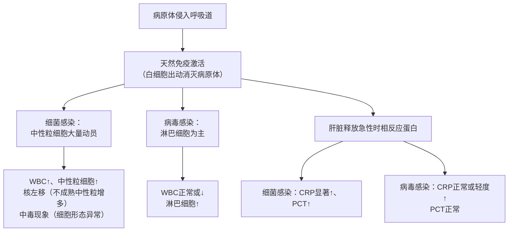
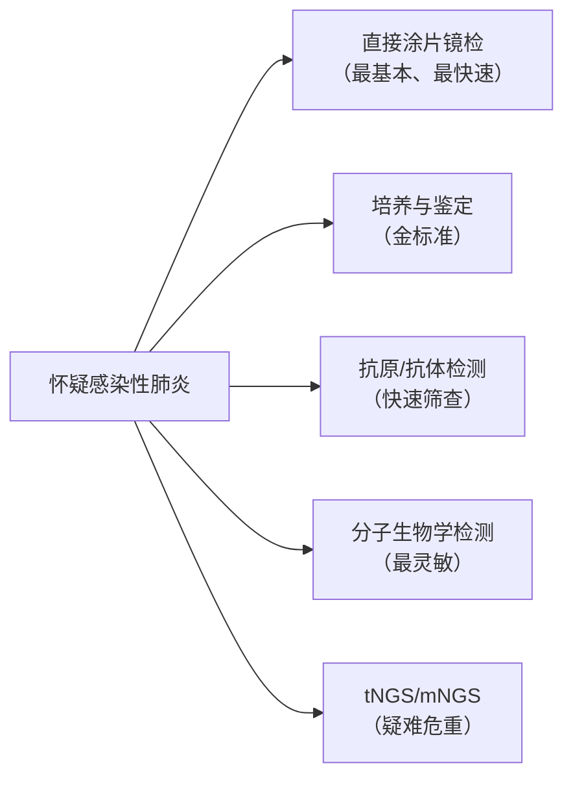
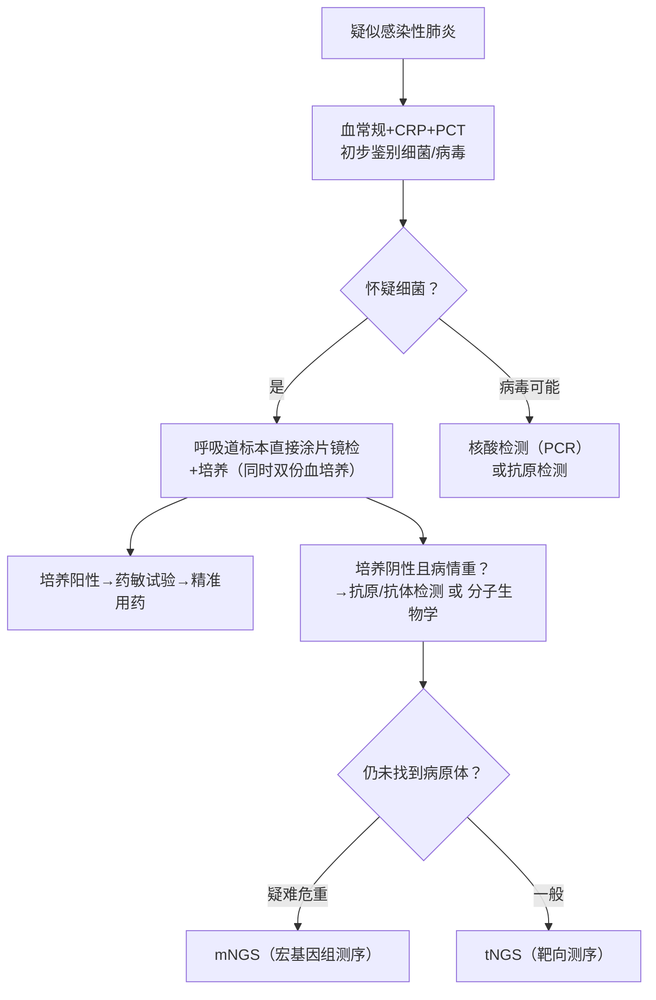
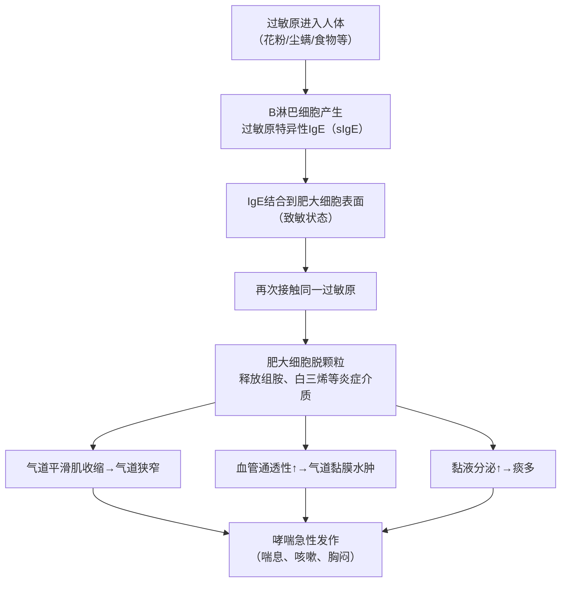
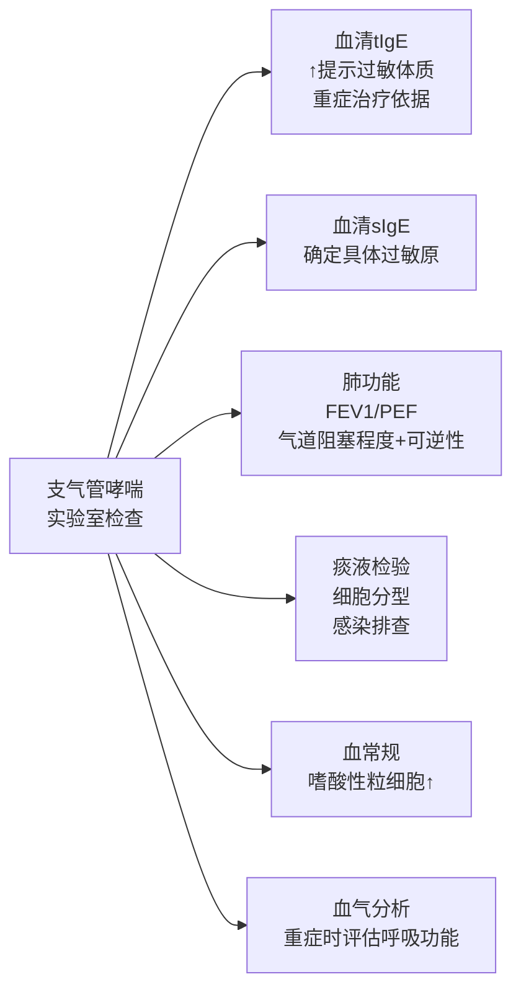
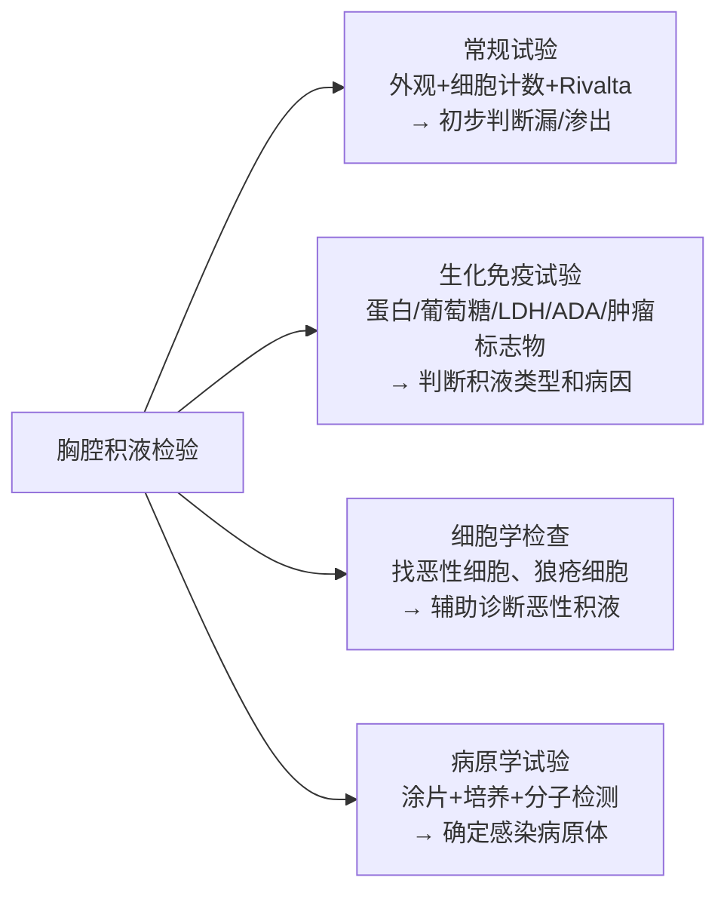
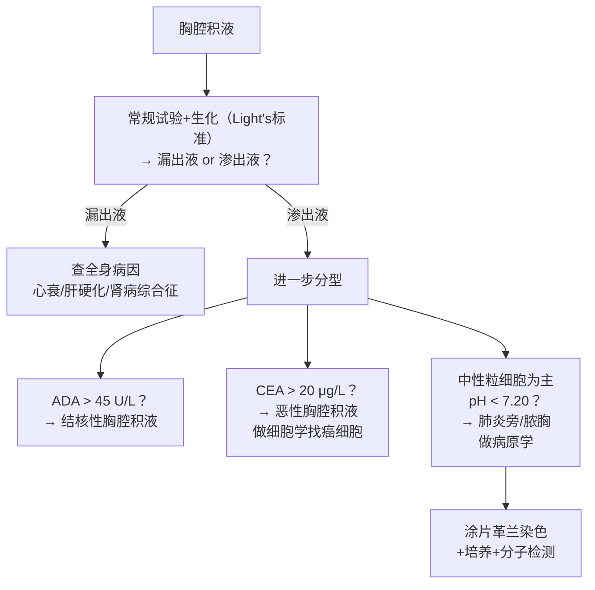
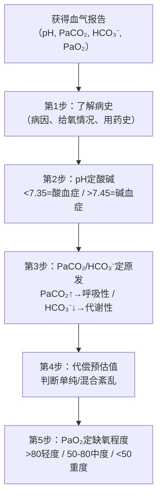
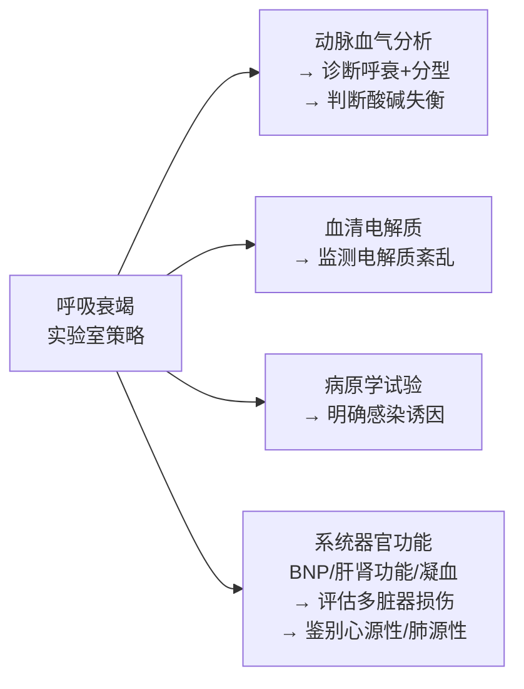

# 呼吸系统疾病的实验诊断 · 期末冲刺讲义
> 广州医科大学附属第一医院 · 邱志辉主讲课件 | 实验诊断学版本
***
## 📊 解析摘要（内部分级说明）

| 项目          | 内容                                                             |
| ----------- | -------------------------------------------------------------- |
| **课件范围**    | PPT 共65页，4大疾病模块 + 1条贯穿性临床案例线                                   |
| **选用逻辑模板**  | 模板1（完整疾病单元）为主导；胸腔积液鉴别部分局部套用模板2                                 |
| **核心掌握⭐⭐⭐** | 感染性肺炎实验诊断策略、支气管哮喘IgE与痰检、胸腔积液漏/渗出液鉴别（Light's标准）、呼吸衰竭血气分析判读（5步法） |
| **熟悉理解⭐⭐**  | 各类分子生物学方法（PCR/tNGS/mNGS）特点比较、哮喘表型与痰细胞分类、胸腔积液结核vs肿瘤鉴别           |
| **了解即可⭐**   | 流行病学数据、病原谱排名、课件图示（详见原PPT）                                      |
| **口诀数量**    | 3个（血气5步判读口诀、漏/渗出液鉴别口诀、呼衰分型口诀）                                  |
| **预估总阅读时间** | 约 75 min（4个疾病单元，每单元15-20 min）                                  |
> ⚠️ **特别说明（针对本课程）**：实验诊断学的核心逻辑是：**疾病发生了什么生理变化** → **这些变化在血液/体液中留下了什么痕迹** → **我们用什么检测手段去发现这些痕迹**。本讲义对每个指标的"为什么升高/降低"都会用 ▶ 符号额外解释机制，这是本科目的得分关键，请重点理解，而非死记硬背。
***
## 第一部分：急性上呼吸道感染及感染性肺炎
📎 PPT 第 2-24 页（整体对应）
> **逻辑**：感染病原体 → 机体炎症反应 → 检验指标变化 → 用检验指标逆推是哪种病原体 | **重点等级**：⭐⭐⭐ | **⏱ 阅读约 20 min**
***
### 1. 概述与定义
📎 PPT 第 6-8 页
**急性呼吸道感染（ARI）**：各种病原体引起呼吸道症状急性发作，主要症状包括咳嗽、咳痰、呼吸急促、咽喉痛、流涕。
📖 教材补充：按解剖位置分为"上呼吸道感染"（鼻、咽、喉）和"下呼吸道感染"（气管、支气管、肺）。感染性肺炎属于下呼吸道感染，累及终末气道、肺泡和肺间质。
**感染性肺炎分类**（考试常考分类依据）：

| 分类维度 | 类型 |
|---------|------|
| 解剖 | 大叶性肺炎、小叶性肺炎、间质性肺炎 |
| 病因 | 细菌性、病毒性、真菌性、非典型病原体（支原体、衣原体等） |
| 来源 | 社区获得性（CAP）、医院获得性（HAP）、呼吸机相关性（VAP） |
**CAP vs HAP 的区别**（重要！）：
- **CAP（Community-Acquired Pneumonia，社区获得性肺炎）**：院外感染，儿童以病毒为主，成人以细菌为主
- **HAP（Hospital-Acquired Pneumonia，医院获得性肺炎）**：入院 ≥ 48h 后发生，多为铜绿假单胞菌等革兰阴性菌，耐药率高、死亡率高（28-72%）
***
### 2. 病因与病理机制 → 检验指标的逻辑链
📎 PPT 第 7、10-12 页
#### 2.1 病原谱（了解）
📎 PPT 第 10-11 页
**病毒性肺炎最常见病原体**：流感病毒（IFV）、呼吸道合胞病毒（RSV）、人鼻病毒（HRV）等
**细菌性肺炎最常见病原体**：肺炎链球菌、肺炎支原体、流感嗜血杆菌、肺炎克雷伯菌等
> [!NOTE]
> 📌 **考点：病原谱的临床意义**
> 儿童 < 5岁细菌性肺炎首位是肺炎支原体；成人CAP首位是肺炎链球菌。这决定了经验性用药的选择，但本课程重点在检验，不考治疗方案。
#### 2.2 ▶ 机制 → 检验指标的推导链（核心！）
这是实验诊断学的核心思路，请反复理解：

▶ **为什么细菌感染让WBC升高？**
人体骨髓里储备着大量中性粒细胞（白细胞的一种），细菌入侵后，机体释放大量炎症因子（IL-6等）刺激骨髓"紧急调兵"，同时把还没成熟的中性粒细胞也提前释放出来，这就叫**核左移**（因为不成熟细胞的细胞核是分叶少/杆状的，"左移"表示往不成熟方向偏移）。
▶ **为什么病毒感染WBC不升高？**
病毒感染激活的主要是**T淋巴细胞和NK细胞**（特异性免疫），中性粒细胞不是对抗病毒的主力军，所以WBC总数不升甚至略降，但淋巴细胞比例升高。
▶ **CRP（C反应蛋白）是什么，为什么细菌感染升得更高？**
CRP是肝脏在炎症刺激下合成的蛋白，作用是与细菌细胞壁的磷脂结合，帮助免疫系统识别和消灭细菌。因为细菌有细胞壁、病毒没有，所以**细菌感染时CRP的刺激信号更强，升高更显著**。
▶ **PCT（降钙素原）是什么？**
PCT是甲状腺C细胞合成的多肽，正常情况下血中浓度极低。细菌感染时，细菌内毒素（尤其是革兰阴性菌）和炎症因子会刺激全身多个器官大量产生PCT，导致血PCT显著升高。病毒感染时PCT几乎不升高，这是**鉴别细菌vs病毒感染的最特异指标**之一。
***
### 3. 一般实验检测（炎症标志物）
📎 PPT 第 12 页

| 检测项目 | 细菌感染结果 | 病毒感染结果 | ▶ 机制一句话 |
|---------|------------|------------|------------|
| WBC计数 | ↑（常 > 10×10⁹/L） | 正常或↓ | 骨髓"调兵"中性粒细胞 |
| 中性粒细胞% | ↑，伴核左移、中毒现象 | 正常或↓ | 同上 |
| 淋巴细胞% | ↓ | ↑ | 病毒激活T淋巴细胞 |
| CRP | 显著↑ | 正常或轻度↑ | 识别细菌细胞壁的蛋白 |
| PCT | 显著↑ | 正常 | 细菌内毒素刺激全身产生 |
> [!WARNING] ⚠️ **常见疑问**
> Q：CRP升高就一定是细菌感染吗？
> A：不是。重度病毒感染（如流感）、自身免疫性疾病、组织坏死也可使CRP升高。但PCT对细菌感染更特异，PCT > 0.5 ng/mL 强烈提示细菌感染，是目前最好的单项鉴别指标。
***
### 4. 病原学检测（核心！）
📎 PPT 第 14-24 页
#### 4.1 ▶ 为什么要做病原学检测？
初步炎症指标只能回答"是细菌还是病毒"，但不能回答"是哪种细菌"。而**不同细菌对抗生素的敏感性完全不同**，找到具体病原体才能"精准打击"，避免耐药。
#### 4.2 各检测方法汇总（重点！）

| 方法 | 优点 | 缺点 | 临床角色 |
|------|------|------|---------|
| **直接涂片镜检**（革兰染色、抗酸染色） | 快速（几小时）、便宜 | 敏感性低，只能看形态 | 初筛，指导经验用药方向 |
| **培养与鉴定** | **金标准**；可做药敏试验 | 耗时长（2-14天）；痰培养敏感性/特异性 < 50% | 确诊病原体，指导精准用药 |
| **抗原/抗体检测**（ELISA、免疫荧光等） | 比培养快 | 敏感性低易漏检；**抗体有窗口期**，仅用于**回顾性诊断** | 快速筛查，辅助诊断 |
| **荧光定量PCR** | 灵敏、特异 | 不能区分活菌/死菌；可能假阳性 | 早期病原检测，尤其病毒 |
| **tNGS**（靶向二代测序） | 性价比高、快 | 只检测已知目标病原体 | 常见病原体快速筛查 |
| **mNGS**（宏基因组二代测序） | 覆盖2万多种病原，无偏性 | 贵、不能取代传统方法 | 疑难、罕见、危重症首选 |
> [!NOTE]
> 📌 **记住 mNGS 和 tNGS 的区别**
> - **tNGS（Targeted，靶向）**：事先知道"可能是哪些病原"，只检测那几种，速度快、价格低
> - **mNGS（Metagenomics，宏基因组）**：把样本里所有DNA/RNA都测序，不预设目标，覆盖面极广，适合"常规方法全都没查出来"的疑难危重病例
📖 教材补充：mNGS的原理是将样本中所有微生物（包括细菌、病毒、真菌、寄生虫）的遗传物质一并检测，再与数据库比对，识别出病原体种类。它不需要培养，直接检测样本，不受培养条件限制。
#### 4.3 血培养的重要性（高频考点）
📎 PPT 第 16 页
- 痰培养敏感性/特异性 **< 50%**，原因是痰液经过口腔时会被正常口腔菌群污染
- **推荐凡怀疑肺部感染均应做双份血培养**，血培养污染少，阳性结果可帮助确认肺炎病原体并重新评估疾病严重程度
***
### 5. 实验诊断策略（总图）
📎 PPT 第 24 页

***
### 6. 本章小结
> [!SUMMARY]
> 📝 **核心要点**
> 1. 细菌感染 → WBC↑+中性粒细胞↑（核左移）+CRP↑+PCT↑；病毒感染 → WBC正常或↓+淋巴细胞↑+CRP轻度升/正常+PCT正常
> 2. 培养与鉴定是病原学诊断金标准，但耗时长（2-14天），痰培养假阴性多，必须同时做血培养
> 3. 抗体检测有"窗口期"，急性期可能阴性，只用于**回顾性诊断**，阴性不能排除感染
> 4. mNGS：覆盖广（2万+种病原），适合疑难危重；tNGS：靶向快速，适合常见病原筛查
> 5. 分子生物学阳性代表有该病原体核酸，**不能确定是否是活菌**
***
> [!QUESTION] 🧠 **检验你的理解**
> Q1：一位患者血常规显示WBC 12×10⁹/L，中性粒细胞 85%，PCT 3.2 ng/mL，CRP 96 mg/L。最可能是细菌感染还是病毒感染？理由是什么？
> Q2：痰培养结果回来要等3天，临床医生急需用药，你作为检验科医生，应建议先做哪些检查来帮助决策？
> Q3：为什么推荐"双份血培养"而不是"单份"？
***
## 第二部分：支气管哮喘
📎 PPT 第 26-35 页（整体对应）
> **逻辑**：过敏原进入→IgE介导过敏反应→气道慢性炎症→气流受限→各检验指标反映不同环节 | **重点等级**：⭐⭐⭐ | **⏱ 阅读约 15 min**
***
### 1. 概述与定义
📎 PPT 第 26 页
**支气管哮喘**：多种细胞（嗜酸性粒细胞、肥大细胞、T淋巴细胞、中性粒细胞等）和细胞组分参与的气道**慢性炎症性疾病**，与**气道高反应性**相关。
▶ **"慢性炎症 + 气道高反应"是什么意思？**
正常人遇到冷空气、刺激性气味不会喘，但哮喘患者的气道长期处于"发炎状态"，气道壁水肿增厚、分泌物增多，同时气道平滑肌（围绕气道的环形肌肉）对各种刺激**过度收缩**，导致气道变窄，空气进出不畅，引起喘息、胸闷、呼吸困难。
***
### 2. ▶ 核心机制：IgE的故事
📎 PPT 第 28 页
这是哮喘实验诊断的核心，必须理解！

▶ **IgE（免疫球蛋白E）是什么？**
IgE是人体免疫系统产生的一种蛋白质抗体，正常情况下含量极少（μg级别），其进化目的可能是抵抗寄生虫。过敏体质的人会对无害的物质（花粉、尘螨）也产生IgE，导致不必要的过敏反应。
***
### 3. 实验室辅助检查（核心！）
📎 PPT 第 27-35 页
#### 3.1 血清IgE检测
📎 PPT 第 28 页

| 指标 | 全称 | 临床意义 | 检测时机 |
|------|------|---------|---------|
| **tIgE（血清总IgE）** | Total IgE，血清中所有IgE的总和 | ↑提示过敏体质；可作为**重症哮喘使用抗IgE抗体治疗及调整剂量的依据** | 首选，先查这个 |
| **sIgE（变应原特异性IgE）** | Specific IgE，针对特定过敏原的IgE | 确定是哪种过敏原引发哮喘 | tIgE**显著升高后**再查，寻找具体过敏原 |
> [!NOTE] 📌 **检测顺序记住**：先查tIgE（总量），**显著升高**再检sIgE（找具体过敏原），不是所有人都要查sIgE
▶ **为什么tIgE升高提示过敏？**
正常人产生IgE极少（< 100 IU/mL），过敏性哮喘患者由于免疫系统对过敏原过度应答，会持续产生大量IgE，所以tIgE显著升高。

#### 3.2 肺功能评估
📎 PPT 第 29 页
> [!NOTE]
> 📌 **这是确诊哮喘的客观依据，必须掌握！**
>▶ **FEV₁和PEF是什么？**
>- **FEV₁（Forced Expiratory Volume in 1 second，第1秒用力呼气量）**：深吸气后用力呼出，第1秒内呼出的气量。气道越窄，FEV₁越低。
>- **PEF（Peak Expiratory Flow，呼气峰流速）**：用力呼气时能达到的最大流速。气道狭窄时PEF降低。
两者都是**反映气道阻塞程度**的指标。
***
**三个可变气流受限客观指标（考试重点！）**：

| 试验 | 方法 | 阳性标准 | ▶ 原理解释 |
|------|------|---------|----------|
| **支气管舒张试验** | 吸入支气管扩张剂（沙丁胺醇），15-30min后复查FEV₁ | FEV₁增加 **> 12%** 且绝对值 **> 200 ml** | 如果FEV₁可逆性改善，说明气道狭窄是**可逆的**（不是永久性纤维化），哮喘的气道狭窄是可逆的 |
| **支气管激发试验** | 吸入组胺/乙酰甲胆碱，观察FEV₁变化 | FEV₁下降 **≥ 20%** | 诱发气道收缩，证明气道存在**高反应性** |
| **PEF昼夜变异率** | 连续7天测量早/晚PEF | **> 10%** | 哮喘气道阻塞具有**时间波动性**，夜间/清晨最重 |
#### 3.3 痰液检验
📎 PPT 第 31 页
▶ **为什么查痰里的细胞？**
不同类型的哮喘，气道里浸润的炎症细胞不同，这决定了用不同的治疗药物。
**哮喘表型分类（根据痰细胞分类）**：

| 表型 | 痰嗜酸性粒细胞 | 痰中性粒细胞 | 特点 |
|------|--------------|------------|------|
| 过敏性**嗜酸性粒细胞**型 | ↑（> 3%） | 正常 | 最经典，对激素治疗敏感 |
| **中性粒细胞**型 | 正常 | ↑ | 常见于感染诱发或职业性哮喘 |
| **混合细胞**型 | ↑ | ↑ | 两者均升高 |
| **寡细胞**型 | 正常 | 正常 | 细胞数少，机制不明 |
> 正常人诱导痰嗜酸性粒细胞 **< 3%**，超过即提示嗜酸性粒细胞性气道炎症
▶ **痰涂片还能做什么？** 细菌培养+药敏，用于判断是否有感染诱因
#### 3.4 血常规
📎 PPT 第 32-33 页
- 外周血**嗜酸性粒细胞百分比和总数**升高 → 提示过敏性（嗜酸性粒细胞型）哮喘
- ▶ 嗜酸性粒细胞是过敏反应的重要效应细胞，IgE介导的过敏反应会驱动嗜酸性粒细胞大量增殖
#### 3.5 动脉血气分析
📎 PPT 第 32 页
- 用于**评估严重哮喘患者呼吸功能和酸碱平衡状态**
- 重症哮喘时，严重气流受限 → CO₂排出受阻 → PaCO₂升高 → 呼吸性酸中毒
***
### 4. 各检验项目汇总
📎 PPT 第 35 页

***
### 5. 本章小结
> [!SUMMARY] 📝 **核心要点**
> 1. 哮喘的核心机制：IgE介导的肥大细胞脱颗粒 → 气道慢性炎症 + 气道高反应性 → 可逆性气流受限
> 2. IgE检测顺序：先tIgE（判断过敏体质）→ 显著升高后查sIgE（找具体过敏原）
> 3. 支气管舒张试验阳性标准：FEV₁↑ > 12% 且绝对值 > 200 ml（可逆性气流受限的证据）
> 4. 支气管激发试验阳性：FEV₁↓ ≥ 20%（气道高反应性证据）
> 5. PEF昼夜变异率 > 10%（7天）= 阳性（气流受限有时间波动性）
> 6. 痰液嗜酸性粒细胞 > 3% = 过敏性嗜酸型哮喘（对激素敏感）
***
> [!TIP]
> 💡 **记忆辅助：哮喘肺功能阳性标准口诀**
> 口诀："**舒张加十二，激发降二十，变率超一成**"
> 解释：
> - 舒张试验：FEV₁增加 > 12%（且 > 200 ml）
> - 激发试验：FEV₁下降 ≥ 20%
> - PEF变异率：> 10%（1成 = 10%）

> [!QUESTION]
> 🧠 **检验你的理解**
> Q1：患者血清tIgE = 450 IU/mL（正常 < 100），你下一步建议做什么检查？为什么？
> Q2：痰液嗜酸性粒细胞 8%，中性粒细胞 5%，属于哪种哮喘表型？这对治疗有何提示？
> Q3：重症哮喘急性发作时，血气分析PaCO₂升高（正常35-45 mmHg），说明发生了什么？
***
## 第三部分：胸腔积液
📎 PPT 第 38-45 页（整体对应）
> **逻辑**：识别积液性质（漏出vs渗出）→ 判断积液来源（结核/肿瘤/感染）→ 病原学确认 | **重点等级**：⭐⭐⭐ | **⏱ 阅读约 20 min**
***
### 1. 概述与定义
📎 PPT 第 38 页
**胸腔积液（Pleural Effusion，PE）**：胸膜腔内液体积聚超过正常量（正常5-15 ml，每日生成500-1000 ml并等量重吸收）。
▶ **液体为什么会积聚在胸膜腔？**
正常胸膜腔的液体进出靠两个力量平衡：毛细血管静水压（把液体推出去）和胶体渗透压（把液体吸回来）。当这个平衡被打破，就会积液：
- **漏出液**：液体因"力学失衡"渗漏（心衰→静水压升高；肝硬化/肾病综合征→蛋白减少→渗透压降低）
- **渗出液**：炎症/肿瘤破坏毛细血管通透性，使蛋白和细胞漏出
***
### 2. 检验项目分类
📎 PPT 第 40 页

***
### 3. 漏出液与渗出液鉴别（核心重点！）
📎 PPT 第 41 页
#### 3.1 ▶ 为什么漏出液和渗出液指标不同？

| 机制 | 漏出液 | 渗出液 |
|------|--------|--------|
| 产生原因 | 非炎症性，毛细血管通透性正常 | 炎症/肿瘤，毛细血管通透性↑ |
| 蛋白质 | 大蛋白分子出不去，积液蛋白少 | 通透性高，大蛋白也能漏出 |
| 细胞 | 细胞出不去，细胞数少 | 炎症细胞大量浸润，细胞数多 |
| LDH | 低（无组织破坏） | 高（组织破坏、细胞溶解释放LDH） |
| 葡萄糖 | 正常（无大量消耗） | 低（细菌/癌细胞大量消耗葡萄糖） |
#### 3.2 鉴别指标对比表

| 指标 | 漏出液 | 渗出液 | ▶ 为什么 |
|------|--------|--------|---------|
| 外观颜色 | 淡黄色、透明 | 不定（浑浊/血色/脓液） | 炎症细胞和蛋白使液体变浑浊 |
| 比重 | **< 1.018** | **> 1.018** | 蛋白多→比重高 |
| 凝固性 | 不自凝 | 能自凝 | 渗出液含纤维蛋白原 |
| **Rivalta试验** | **阴性** | **阳性** | 渗出液中酸性蛋白遇醋酸沉淀 |
| 细胞计数 | **< 0.1×10⁹/L** | **> 0.5×10⁹/L** | 炎症驱使细胞浸润 |
| 蛋白定量 | **< 30 g/L** | **> 30 g/L** | 通透性高→蛋白漏出多 |
| 葡萄糖 | 与血糖相近 | 常低于血糖 | 细菌/癌细胞消耗葡萄糖 |
| pH | > 7.4 | < 7.4 | 感染代谢产酸 |
| LDH | **< 200 IU** | **> 200 IU** | 组织破坏释放LDH |
#### 3.3 Light's标准（⭐⭐⭐ 必背！）
📎 PPT 第 41 页
满足以下**任意一条**即为渗出液：
> 1. 胸水蛋白 / 血清蛋白 **> 0.5**
> 2. 胸水LDH / 血清LDH **> 0.6**
> 3. 胸水LDH **> 200 IU**（部分标准用血清LDH正常值上限的2/3）
▶ **为什么要用"比值"而不只看绝对值？**
不同人血清蛋白和LDH的基础水平不同，用胸水/血清的**比值**排除了个体差异，判断更准确。比值 > 0.5 说明胸水中蛋白浓度已经相当于血清浓度的一半以上，这种程度的蛋白渗出只有炎症/肿瘤时才会出现。
### 4. 渗出液的进一步分类（鉴别诊断）
📎 PPT 第 39、41-42 页
确定是渗出液后，还需鉴别是**结核性、肿瘤性还是感染性**：
#### 4.1 结核性 vs 恶性胸腔积液鉴别（⭐⭐⭐）
📎 PPT 第 42 页

| 指标 | 结核性 | 恶性（肿瘤性） | ▶ 机制 |
|------|--------|--------------|--------|
| 发病年龄 | 青少年多 | 中老年多 | 流行病学特点 |
| 积液量 | 中小量 | **大量、产生快** | 肿瘤持续渗出 |
| 细胞类型 | **淋巴细胞为主** | 大量间皮细胞 | 结核→T淋巴细胞浸润 |
| pH | **< 7.30** | > 7.40 | 结核菌代谢产酸 |
| LDH同工酶 | **LDH₄、LDH₅升高** | **LDH₂升高** | 不同细胞来源的LDH同工酶不同 |
| **ADA（腺苷脱氨酶）** | **> 45 U/L**（胸水/血液 > 1） | **< 45 U/L** | 结核→T淋巴细胞激活释放ADA |
| **CEA（癌胚抗原）** | **< 20 μg/L**（胸水/血 < 1） | **> 20 μg/L**（胸水/血 > 1） | 肿瘤细胞分泌CEA |
| 溶菌酶 | 胸水 > 65 μg/ml（胸水/血 > 1）| < 65 μg/ml | 结核→单核/巨噬细胞释放溶菌酶 |
> [!NOTE] 📌 **ADA是鉴别结核性胸腔积液的最重要单项指标！**
> ADA（Adenosine Deaminase，腺苷脱氨酶）：结核感染时，大量T淋巴细胞在胸膜腔积聚并激活，T细胞代谢活跃会释放大量ADA。结核性胸腔积液ADA > 45 U/L，特异性很高。
#### 4.2 肺炎旁胸腔积液（化脓性）特征
📎 PPT 第 41-42 页
▶ 肺炎旁胸腔积液是细菌性肺炎蔓延至胸膜引起的感染性渗出液：

| 指标 | 单纯肺炎旁积液 | 脓胸（重症） |
|------|--------------|------------|
| WBC | 升高，中性粒细胞为主 | **> 10×10⁹/L** |
| pH | > 7.0 | **< 7.20** |
| GLU | > 3.3 mmol/L | **< 2.2 mmol/L** |
| LDH | < 500 U/L | **> 1000 U/L** |
| 涂片/培养 | 可能阴性 | **革兰染色找到细菌 或 培养阳性** |
***
### 5. 胸腔积液实验诊断策略
📎 PPT 第 45 页

***
### 6. 本章小结
> [!SUMMARY]
> 📝 **核心要点**
> 1. 胸腔积液 = 漏出液（非炎症，力学失衡）或 渗出液（炎症/肿瘤，通透性↑）
> 2. **Light's标准**：满足"蛋白比 > 0.5 / LDH比 > 0.6 / LDH绝对值 > 200 IU"之一 = 渗出液
> 3. **ADA > 45 U/L** → 强烈提示结核性胸腔积液（T淋巴细胞来源）
> 4. **CEA > 20 μg/L** → 强烈提示恶性胸腔积液（肿瘤细胞来源）
> 5. 脓胸特征：pH < 7.20 + GLU < 2.2 mmol/L + LDH > 1000 U/L + 细菌培养阳性
> 6. 淋巴细胞为主 + ADA高 = 结核；间皮细胞为主 + CEA高 = 肿瘤

> [!QUESTION]
> 🧠 **检验你的理解**
> Q1：胸水蛋白 35 g/L，血清蛋白 60 g/L，胸水LDH 180 IU，血清LDH 250 IU。按Light's标准，这是漏出液还是渗出液？
> Q2：一名18岁患者，胸水淋巴细胞 85%，pH 7.25，ADA 68 U/L，CEA 3 μg/L。最可能的诊断是什么？
> Q3：为什么结核性胸腔积液的ADA会升高？（从机制解释）
***
## 第四部分：呼吸衰竭
📎 PPT 第 47-61 页（整体对应）
> **逻辑**：通气/换气功能障碍 → PaO₂↓ 伴/不伴 PaCO₂↑ → 血气分析判断呼衰分型+酸碱失衡 | **重点等级**：⭐⭐⭐ | **⏱ 阅读约 20 min**
***
### 1. 概述与定义（必背！）
📎 PPT 第 48 页
**呼吸衰竭（Respiratory Failure，RF）**：各种原因引起肺通气和（或）换气功能严重障碍，在静息状态下不能维持足够气体交换，导致：
> **诊断标准**：**PaO₂ < 60 mmHg**，伴或不伴 **PaCO₂ > 50 mmHg**
▶ **通气和换气有什么区别？**
- **通气**：空气进出肺（像风箱）。气道阻塞（哮喘、COPD）、呼吸肌无力 → 通气障碍 → CO₂排不出去 → PaCO₂升高
- **换气**：肺泡里的O₂扩散进血液、CO₂扩散出来（像薄膜）。肺泡破坏（肺气肿）、肺水肿（液体阻隔） → 换气障碍 → O₂进不来，但CO₂还能出去（CO₂弥散能力强20倍）→ 只有低氧血症
***
### 2. 呼衰分型
📎 PPT 第 50-51 页

| 类型 | PaO₂ | PaCO₂ | 主要机制 | 常见病因 |
|------|------|--------|---------|---------|
| **Ⅰ型（低氧血症型）** | **< 60 mmHg** | 正常或↓ | 换气障碍（弥散↓/V/Q失调） | 肺炎、肺水肿、肺栓塞 |
| **Ⅱ型（高碳酸血症型）** | **< 60 mmHg** | **> 50 mmHg** | 通气障碍（CO₂排不出） | COPD、重症哮喘、呼吸肌无力 |
> [!TIP]
> 💡 **呼衰分型口诀（课件原版）**
> 口诀：**"Ⅰ换"（I=1，Ⅰ型=换气障碍）**
> 解释：
> - Ⅰ型 = 换气（弥散）障碍，CO₂还能出去，只缺O₂
> - Ⅱ型 = 通气障碍，O₂进不来 + CO₂出不去，两者都异常
***
### 3. 动脉血气分析（核心！⭐⭐⭐）
📎 PPT 第 52-57 页
#### 3.1 基本指标解读

| 指标 | 全称 | 参考区间 | ▶ 代表什么 |
|------|------|---------|-----------|
| **PaO₂** | 动脉血氧分压 | 100-0.33×年龄 ±5 mmHg | 动脉血中物理溶解的O₂产生的压力；< 60 mmHg = 呼衰诊断线 |
| **PaCO₂** | 动脉血二氧化碳分压 | **35-45 mmHg**（平均40） | 动脉血中CO₂产生的压力；> 50 mmHg = Ⅱ型呼衰 |
| **pH** | 酸碱度 | **7.35-7.45** | < 7.35 = 酸血症；> 7.45 = 碱血症 |
| **HCO₃⁻** | 碳酸氢根 | **22-27 mmol/L**（平均24） | 代谢性酸碱变化的指标 |
#### 3.2 AB vs SB（重要！）
📎 PPT 第 54 页

| 指标 | 定义 | ▶ 意义 |
|------|------|--------|
| **AB（实际HCO₃⁻）** | 实际测得的血浆HCO₃⁻含量 | 同时受代谢和呼吸影响 |
| **SB（标准HCO₃⁻）** | 标准条件下（37℃，PaCO₂=40，SaO₂=100%）测的HCO₃⁻ | 排除呼吸影响，纯反映代谢状态 |
**AB与SB的比较规律**：

| 情况 | AB与SB关系 | ▶ 原理 |
|------|-----------|--------|
| 代谢性酸中毒 | AB = SB，均↓ | HCO₃⁻从代谢端丢失，两者都低 |
| 代谢性碱中毒 | AB = SB，均↑ | HCO₃⁻从代谢端积累，两者都高 |
| **呼吸性酸中毒** | **AB > SB** | CO₂积聚→溶解→产生更多HCO₃⁻，但SB是标准CO₂下测的，不反映这个增加 |
| **呼吸性碱中毒** | **AB < SB** | CO₂被过度呼出→HCO₃⁻减少，SB不反映这个变化 |
▶ **记忆技巧**：AB受呼吸影响变化，SB不受。呼吸性酸中毒 → CO₂高 → 产生更多CO₂衍生的HCO₃⁻ → AB实测值更高 → AB > SB
***
### 4. 酸碱失衡判断步骤（5步法）⭐⭐⭐
📎 PPT 第 55-57 页
这是血气分析读图的核心流程，必须掌握！

**第4步代偿公式（必背！）**：

| 原发紊乱 | 代偿公式 |
|---------|---------|
| 呼吸性酸中毒（急性） | 预计HCO₃⁻ = 24 + (PaCO₂-40) × **0.07** ± 1.5 |
| 呼吸性酸中毒（慢性） | 预计HCO₃⁻ = 24 + (PaCO₂-40) × **0.4** ± 3 |
| 代谢性酸中毒 | 预计PaCO₂ = 40 - (24-HCO₃⁻) × 1.2 ± 2 |
| 代谢性碱中毒 | 预计PaCO₂ = 40 + (HCO₃⁻-24) × 0.9 ± 5 |
> 若实测值在预估范围内 → **单纯性**；不在范围内 → **混合性**
#### 4.2 pH快速判断技巧
📎 PPT 第 55 页
**当pH < 7.40时**：
- PaCO₂ × HCO₃⁻ > 1000 → **呼吸性酸中毒**（CO₂高导致酸中毒，乘积大）
- PaCO₂ × HCO₃⁻ < 1000 → **代谢性酸中毒**（HCO₃⁻低，乘积小）
**当pH > 7.40时**：
- PaCO₂ × HCO₃⁻ < 1000 → **呼吸性碱中毒**
- PaCO₂ × HCO₃⁻ > 1000 → **代谢性碱中毒**
#### 4.3 典型案例解析（课件案例）
📎 PPT 第 57 页
案例：患儿有感染+哮喘，血气结果：pH = 7.371，PaO₂ = 39.4 mmHg，PaCO₂ = 72.9 mmHg，HCO₃⁻（AB） = 41.3 mmol/L，SB值低于AB。

| 步骤 | 结论 |
|------|------|
| 1. 病史 | 感染+气道高反应+吸氧，提示呼衰 |
| 2. pH = 7.371 < 7.40 | 可能存在酸中毒，或相抵型双重紊乱 |
| 3. PaO₂ = 39.4 < 60 + PaCO₂ = 72.9 > 50 | **Ⅱ型呼吸衰竭** |
| 4. pH < 7.40，PaCO₂ × HCO₃⁻ = 72.9 × 41.3 = 3011 **> 1000** | **呼吸性酸中毒** |
| 5. PaCO₂升高，HCO₃⁻也升高，可能单纯or混合？用代偿公式 | 急性：预计HCO₃⁻ = 24+(72.9-40)×0.07±1.5 = **24.8-27.8** |
| 6. 实测HCO₃⁻ = 41.3，**超出预估范围** | 合并代谢性碱中毒（AB、SB均↑ + AB > SB确认呼酸） |
| 最终结论 | **Ⅱ型呼衰 + 呼吸性酸中毒 + 代谢性碱中毒（混合型）** |
***
### 5. 其他检测项目
📎 PPT 第 58-60 页

| 检测项目 | 临床意义 |
|---------|---------|
| **血清电解质**（K⁺、Na⁺、Ca²⁺等） | 呼衰时酸碱紊乱常伴电解质异常（如呼吸性酸中毒→细胞内K⁺外移→高钾血症） |
| **病原学检测** | 明确感染诱因，涂片+培养+分子检测（同第一部分） |
| **BNP（脑钠肽）** | 心室肌分泌，心衰时显著升高。用于**鉴别心源性呼衰（BNP↑↑）vs 肺源性呼衰（BNP正常/轻度升高）** |
| **肝、肾功能** | 监测是否存在多脏器功能损伤 |
| **凝血功能** （PT、APTT、D-二聚体） | 重症呼衰可继发DIC（弥散性血管内凝血）→ PT延长、APTT延长、D-二聚体升高 |
▶ **BNP（B-type Natriuretic Peptide，脑钠肽/B型钠尿肽）**：心室肌细胞在心室容量/压力负荷增加时分泌。心源性呼衰（心衰导致肺淤血、气体交换障碍）时BNP显著升高，而肺部自身病变导致的呼衰BNP正常，是重要的鉴别依据。
***
### 6. 呼吸衰竭实验诊断策略
📎 PPT 第 61 页

***
### 7. 本章小结
> [!SUMMARY]
> 📝 **核心要点**
> 1. 呼衰诊断标准：**PaO₂ < 60 mmHg**（± PaCO₂ > 50 mmHg）
> 2. Ⅰ型 = 换气障碍（只缺O₂）；Ⅱ型 = 通气障碍（O₂↓ + CO₂↑）
> 3. pH < 7.35 = 酸中毒；pH > 7.45 = 碱中毒；PaCO₂↑↓ = 呼吸因素；HCO₃⁻↑↓ = 代谢因素
> 4. AB > SB = 呼吸性酸中毒；AB < SB = 呼吸性碱中毒；AB = SB = 代谢性紊乱
> 5. 代偿公式判断单纯/混合：实测值在预估范围内 = 单纯；超出范围 = 混合
> 6. BNP显著升高 → 鉴别心源性呼衰（vs 肺源性）
> 7. **血气分析5步法**：病史→pH→PaCO₂/HCO₃⁻→代偿公式→PaO₂
***
> [!TIP]
> 💡 **血气5步法口诀**
> 口诀：**"史、酸碱、定代呼、算代偿、查缺氧"**
> 解释：
> - **史**：了解病史（原发病因）
> - **酸碱**：pH定方向（< 7.35酸/> 7.45碱）
> - **定代呼**：PaCO₂升降定呼吸，HCO₃⁻升降定代谢
> - **算代偿**：代偿公式判单纯or混合
> - **查缺氧**：PaO₂分三档（> 80轻 / 50-80中 / < 50重）
***
> [!QUESTION]
> 🧠 **检验你的理解**
> Q1：血气报告：pH 7.30，PaCO₂ 55 mmHg，HCO₃⁻ 26 mmol/L。判断酸碱类型（急性还是慢性？单纯还是混合？）
> Q2：Ⅰ型和Ⅱ型呼衰，哪种PaCO₂升高？为什么Ⅰ型不升高CO₂？
> Q3：BNP检测对呼衰有什么价值？心源性和肺源性呼衰的BNP有什么区别？
***
## 总附录：四大疾病实验诊断一览表
📎 PPT 第 63 页（课堂小结）

| 疾病        | 核心检测项目         | 关键指标/阳性标准             | 主要目的      |
| --------- | -------------- | --------------------- | --------- |
| **感染性肺炎** | 血常规+CRP+PCT    | PCT↑↑=细菌；WBC/PCT正常=病毒 | 鉴别细菌/病毒   |
|           | 培养（金标准）        | 阳性率<50%，需同时血培养        | 确定病原体     |
|           | PCR/tNGS/mNGS  | mNGS覆盖最广              | 快速/疑难病原检测 |
| **支气管哮喘** | 血清tIgE/sIgE    | tIgE↑→过敏体质；sIgE→找变应原  | 确认过敏机制    |
|           | 肺功能（FEV₁/PEF）  | 舒张试验>12%+200ml        | 确诊气流可逆性   |
|           | 痰液细胞分类         | 嗜酸>3%=嗜酸型             | 表型分类指导治疗  |
| **胸腔积液**  | 常规+生化（Light's） | 蛋白比>0.5/LDH比>0.6      | 漏/渗出液鉴别   |
|           | ADA            | >45 U/L=结核            | 结核vs肿瘤    |
|           | CEA            | >20 μg/L=恶性           | 恶性积液      |
| **呼吸衰竭**  | 血气分析           | PaO₂<60+PaCO₂>50=Ⅱ型   | 诊断分型      |
|           | pH+AB/SB       | AB>SB=呼酸；均↑↑=代碱       | 酸碱失衡判断    |
|           | BNP            | 心源性呼衰↑↑               | 鉴别心源性/肺源性 |
***
> 📎 本讲义严格锚定PPT第1-63页内容。图表（病原谱分布图、血气分析判断树图等复杂图表）详见原课件。
> 整体阅读建议：第一遍通读理解机制推导链（▶标注处）；第二遍重点记忆带⭐⭐⭐的数值指标；第三遍完成自检题，验证是否能从机制推到指标变化方向。