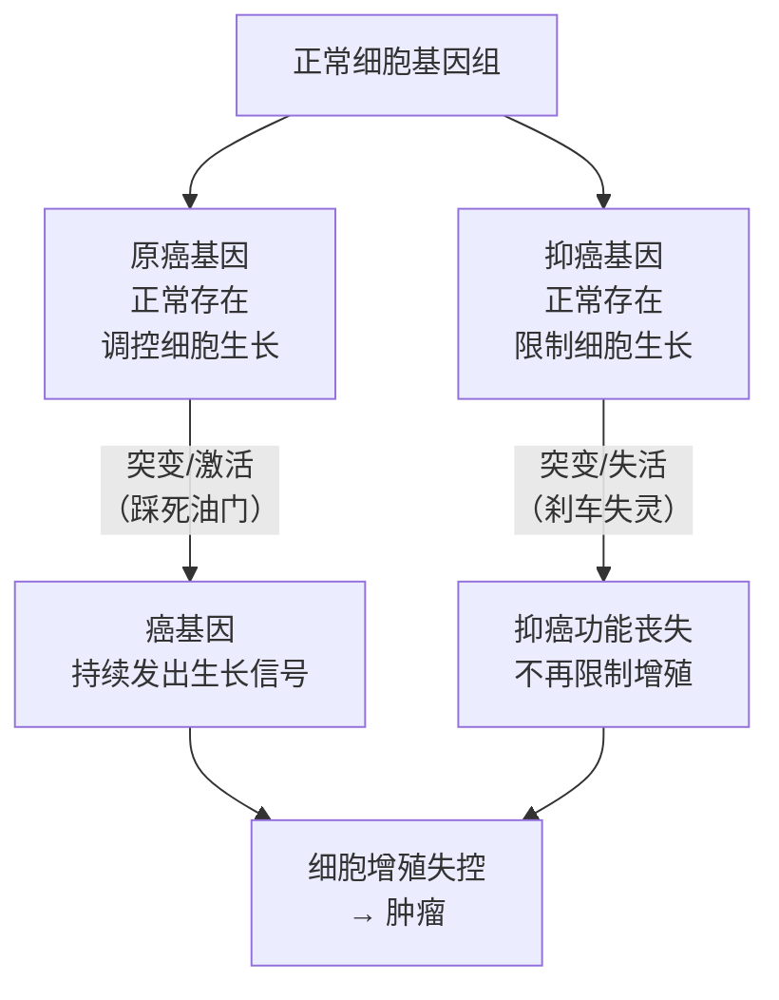
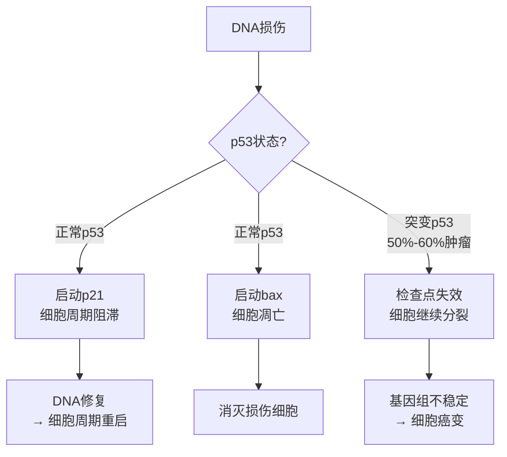
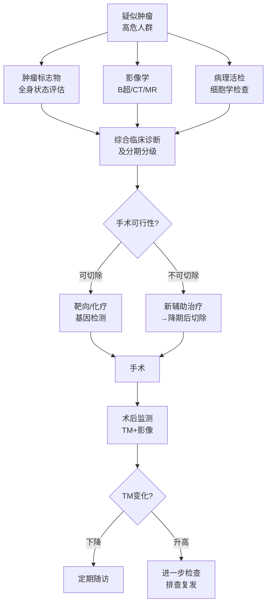

> **解析摘要**（内部判断，供读者参考）
> - **章节主题**：肿瘤实验诊断，涵盖肿瘤标志物概念/分类/应用原则、恶性肿瘤分子诊断（原癌基因/抑癌基因/个体化诊断）、实验室诊断策略、8种常见肿瘤的实验诊断
> - **选定逻辑模板**：混合模板——前两节（检验项目与诊断策略）采用模板1知识单元框架；第三节（常见肿瘤）按癌种逐一展开，以"筛查→标志物→基因→治疗预后"四段式呈现；理由：本章无单一主病，而是多癌种并列，不适合纯模板1或2
> - **重点数量**：⭐⭐⭐核心掌握约12处，⭐⭐熟悉理解约8处，⭐了解约4处
> - **口诀数量**：3个
> - **预估总阅读时间**：约32分钟
***
# 第一节 恶性肿瘤的检验项目与应用
📎 PDF 第6页
肿瘤的实验诊断，通过采集组织、细胞、血液、体液、分泌物等标本，进行检测，目的是**早期发现、早期诊断、治疗方案选择、疗效观察、预后判断及复发监测**。三大支柱：**常规实验室检查、肿瘤标志物、恶性肿瘤的分子诊断**。
***
## 一、肿瘤标志物 ⭐⭐⭐
📎 PDF 第7-11页
### 1. 概念
**肿瘤标志物（Tumor Marker，TM）**：在恶性肿瘤发生和增殖过程中，由肿瘤细胞合成、分泌，**或机体对肿瘤细胞反应异常产生和/或升高**的一大类物质。涉及胚胎抗原及蛋白类、酶及同工酶、激素类、糖类抗原、癌基因产物及特殊蛋白类。
> [!NOTE] 📌 请注意
> 核心区分：**肿瘤抗原可以是肿瘤标志物，但肿瘤标志物不一定是肿瘤抗原**——因为标志物还包括酶、激素等非抗原性物质。
***
**为什么肿瘤会产生这些物质？** 正常细胞在发育过程中，胚胎期表达的某些蛋白（如AFP、CEA）在出生后受基因程序调控而被"关闭"。当细胞恶变时，这些基因可能被重新激活（称为"去分化"）；或原本少量存在的物质因肿瘤细胞大量增殖而在血液中堆积，从而在血清中被检测到。这就是"疾病机制→检验指标"的核心逻辑。
### 2. 分类
📎 PDF 第8页

| 类别 | 代表标志物 | 机制/记忆锚点 |
|------|-----------|-------------|
| **胚胎抗原及蛋白类** | AFP（甲胎蛋白）、CEA（癌胚抗原）、HE4（人类附睾蛋白4） | 胎儿期正常表达，成人恶变后重新出现 |
| **酶及同工酶类** | PSA（前列腺特异抗原）、NSE（神经元特异性烯醇化酶）、AFU（α-L-岩藻苷酶）、LDH（乳酸脱氢酶） | 肿瘤细胞大量产酶并漏出入血 |
| **激素类** | 睾酮、雌二醇（E2）、孕酮、hCG（人绒毛膜促性腺激素） | 内分泌/生殖系统肿瘤异常分泌 |
| **糖类抗原** | CA72-4、CA19-9、CA242、CA15-3、CA125 | 细胞膜糖蛋白，肿瘤细胞过度表达后入血 |
| **癌基因及蛋白类** | RB抑癌基因、APC基因、ras癌基因 | 基因突变产物可被检测 |
| **特殊蛋白类** | CYFRA21-1（细胞角蛋白19片段）、SCC（鳞状上皮癌抗原） | 上皮细胞骨架蛋白降解后入血 |
### 3. 理想 vs 现实
📎 PDF 第9页

| | 理想特性 | 现实局限 |
|--|---------|---------|
| 敏感性 | 肿瘤患者血液含量明显升高 | **灵敏度有限**（早期肿瘤可能不升高） |
| 特异性 | 与肿瘤组织定位相关 | **特异性有限**（良性病变也可升高） |
| 相关性 | 含量与肿瘤大小、分期、转移、复发相关 | 正常与异常存在交错（"灰区"） |
| 稳定性 | 动态反映肿瘤变化 | 不稳定，与临床表现可有差异 |
### 4. 应用原则（5条）
📎 PDF 第11页
1. **正确定位诊断价值及应用范围**：辅助工具，不能单独确诊
2. **掌握检查时机**：按疾病进程选择时间点
3. **结合患者疾病进程选择适合的标志物**：不同阶段选不同指标
4. **不同测定方法的参考区间可能不同**：跨机构比较需注意方法差异
5. **考虑其他可能影响结果的因素**：妊娠、炎症、良性病变、药物均可干扰
> [!WARNING] ⚠️ 常见疑问
> **Q：肿瘤标志物升高就意味着得癌了吗？**
> A：绝对不是。良性肝病（肝炎、肝硬化）可致AFP轻度升高；前列腺炎/增生可致PSA升高。单次升高不能确诊，须动态监测+影像学+病理综合判断。同理，标志物正常也不能排除癌症（约30%肝癌AFP不升高）。
***
## 二、恶性肿瘤的分子诊断 ⭐⭐⭐
📎 PDF 第12-20页
### 1. 肿瘤是一种分子疾病
正常细胞变为肿瘤细胞，根本原因是**基因出现了问题**。两类基因与肿瘤直接相关：

**原癌基因（proto-oncogene）**：正常细胞中本就存在，其产物负责精确调控细胞正常生长、增殖和分化——相当于"油门"。在放射线、有害化学物质等因素作用下，可突变转变为**癌基因**，让细胞持续加速增殖。
**抑癌基因（tumor-suppressor gene）**：可抑制细胞生长、防止恶变的基因群——相当于"刹车"。失活后，细胞失去增殖约束。
> [!NOTE] 📌 请注意
> **核心公式**：**油门踩死（原癌基因激活）+ 刹车失灵（抑癌基因失活）= 肿瘤**。两者都能导致细胞增殖失控，往往在肿瘤发展过程中先后出现。
***
### 2. 原癌基因
📎 PDF 第13-14页
**特点**：①进化上高度保守（人和酵母的RAS基因结构类似）；②表达产物精确调控细胞正常生长；③受致癌因素作用后可发生结构异常或表达失控，转变为癌基因。
**分类**：肿瘤特异性癌基因（如c-sis、c-abl）；肿瘤非特异性癌基因（如**c-myc、k-ras**）。
**重点——RAS基因** ⭐⭐⭐
📎 PDF 第14页
- RAS是**人类首个被发现的原癌基因**
- 哺乳动物RAS家族三成员：**H-ras、K-ras、N-ras**（三个都可成为癌基因）
- RAS蛋白是细胞增殖信号通路上的"中继开关"：正常时信号来了就开、完了就关；**点突变（如GGC→GTC）后锁定在"开"状态**，细胞持续接受增殖信号
H-ras点突变本质：**第12位密码子GGC→GTC**，对应蛋白质第12位氨基酸由**甘氨酸（Gly）变为缬氨酸（Val）**，一个碱基之差，空间结构改变，RAS蛋白无法自行关闭 → 持续激活下游增殖信号。
### 3. 抑癌基因
📎 PDF 第15-16页
**特点**：①正常组织中基因表达正常；②癌组织中点突变或表达缺失；③导入该基因可部分或全部抑制肿瘤细胞的恶性表型。
常见抑癌基因：

| 基因 | 染色体定位 | 相关肿瘤 | 作用 |
|------|-----------|---------|------|
| **TP53** | 17P | **多种肿瘤（最广泛）** | 编码p53蛋白（转录因子，守护基因组稳定） |
| Rb | 13q14 | 视网膜母细胞瘤、骨肉瘤、肺癌、乳腺癌 | 编码P105Rb1蛋白 |
| APC | 5q21 | 结肠癌 | 可能编码G蛋白 |
| BRCA1/2 | — | **乳腺癌、卵巢癌** | DNA双链断裂修复 |
**重点——TP53基因** ⭐⭐⭐
📎 PDF 第16页
- **50%～60%的人类肿瘤存在TP53突变**——研究最多的抑癌基因
- 正常p53的功能：感受DNA损伤信号后，激活p21（让细胞周期停止等待修复）和bax（让严重损伤细胞凋亡）
- p53突变后：这两个保护程序都失效，损伤的细胞继续分裂 → 积累更多突变 → 癌变

### 4. 恶性肿瘤的个体化诊断
📎 PDF 第17-20页
核心理念：通过基因检测，为每位患者"量身定制"最合适的治疗方案。
**(1) 分子靶向用药的个体化诊断** ⭐⭐
📎 PDF 第19页
**靶向治疗**：以肿瘤生长通路中的关键分子为靶点，特异性阻断肿瘤生长——好比找到肿瘤细胞的"命门"精准打击，而非化疗的"地毯式轰炸"。

| 常用靶向药物 | 检测靶点 | 通俗机制 |
|------------|---------|---------|
| 易瑞沙/吉非替尼、特罗凯/厄洛替尼 | EGFR、KRAS | EGFR-TKI（酪氨酸激酶抑制剂），关闭EGFR激酶活性 |
| 西妥昔单抗/爱必妥、帕尼单抗/维克替比 | KRAS、BRAF | 抗EGFR单克隆抗体，阻断配体结合 |
| 伊马替尼/格列卫 | PDGFRA | 阻断PDGF受体（血小板衍生生长因子受体）信号 |
| 威罗菲尼/Zelboraf | BRAF | 阻断BRAF V600E突变激酶活性 |
> [!NOTE] 📌 请注意
> **EGFR**（表皮生长因子受体）突变后持续激活，癌细胞持续生长。EGFR-TKIs能特异性关闭这一信号。**关键禁忌**：若下游的KRAS或NRAS已经突变（持续"自嗨"激活），即使封锁了上游EGFR，信号仍源源不断 → 靶向药无效，不应使用抗EGFR单克隆抗体。
***
**(2) 化疗药物的个体化诊断** ⭐⭐
📎 PDF 第20页
基因表达/多态性检测可预测患者对化疗药物的**敏感性及毒副作用强弱**：

| 化疗药物 | 检测基因位点 | 意义 |
|---------|------------|-----|
| 铂类（顺铂、卡铂） | ERCC1 mRNA、BRCA1 mRNA、XRCC1 | ERCC1高表达→DNA修复强→铂类疗效差 |
| 抗微管类（紫杉醇等） | TUBB3 mRNA、STMN1 mRNA | — |
| 氟尿嘧啶类（培美曲塞） | TYMS mRNA、MTHFR | — |
| 吉西他滨 | RRM1 mRNA | — |
| 伊立替康 | UGT1A1（*6/*28） | 突变者代谢慢，毒副作用增强 |
> [!NOTE] 📌 请注意
> **ERCC1**（核苷酸切除修复蛋白1）：铂类药物的作用原理是损伤癌细胞DNA，让癌细胞死亡。如果患者的ERCC1表达水平很高，说明其细胞修复DNA损伤的能力很强 → 铂类造成的损伤很快被修复 → 疗效差。因此检测ERCC1有助于判断铂类方案是否合适。
***
# 第二节 恶性肿瘤的实验室诊断策略 ⭐⭐⭐
📎 PDF 第22-23页
实验诊断贯穿肿瘤诊治的**全程**，不同阶段有不同侧重：

| 应用场景 | 主要实验手段 |
|---------|------------|
| 高危人群早期诊断 | 肿瘤标志物定期检测 |
| 初步诊断 | TM辅助 + 影像学 + 病理活检 |
| 预后判断 | TM水平与肿瘤分期、浸润深度相关 |
| 疗效监测 | 动态监测TM变化（下降=有效） |
| 复发早期发现 | TM升高早于影像学发现 |
> [!WARNING] ⚠️ 常见疑问
> **Q：肿瘤标志物能用来筛查无症状普通人群吗？**
> A：**不适合**（PPT原文强调）。原因：①特异性太低（大量假阳性，造成不必要恐慌和过度检查）；②在低患病率人群中，阳性预测值极低（大多数阳性结果其实是假阳性）。肿瘤标志物主要用于高危人群监测、已确诊患者的疗效观察和复发监测。
***

***
# 第三节 常见肿瘤的实验诊断
## 一、肺癌 ⭐⭐⭐
📎 PDF 第30-33页
**肺癌病死率居各肿瘤首位**，分为**小细胞肺癌（SCLC）** 和**非小细胞肺癌（NSCLC，含腺癌/鳞癌/大细胞癌）**。这一病理分型**决定选哪个标志物、用哪种靶向药**。
### 肺癌的肿瘤标志物检查
📎 PDF 第31页

| 标志物 | 全称 | 适用类型 | 临床意义 |
|-------|------|---------|---------|
| **NSE** ⭐⭐⭐ | 神经元特异性烯醇化酶 | **小细胞肺癌首选** | SCLC起源于神经内分泌细胞，天然表达NSE（一种糖酵解酶）；血NSE升高 = SCLC信号；可监测放化疗效果 |
| **ProGRP** ⭐⭐⭐ | 胃泌素释放肽前体 | **小细胞肺癌理想指标** | 敏感性和特异性均高于NSE，是诊断SCLC的理想指标 |
| **CYFRA21-1** ⭐⭐⭐ | 细胞角蛋白19片段 | **非小细胞肺癌首选** | NSCLC细胞来源于上皮，角蛋白是上皮细胞骨架蛋白；肿瘤坏死时片段入血；敏感且特异，可监测病程和疗效 |
| **SCC/SCCA** ⭐⭐ | 鳞状细胞癌抗原 | 肺**鳞**癌 | 鳞状细胞癌的诊断标志物 |
| CEA | 癌胚抗原 | 肺癌辅助 | 非特异性，多种肿瘤均可升高，辅助参考 |
> [!TIP] 💡 记忆辅助
> **口诀①：肺癌标志物"小神大角"**
> **小**细胞肺癌 → **NSE**（"神"经内分泌的"神"）+ **ProGRP**
> **非小**细胞肺癌（"大"范围） → **CYFRA21-1**（"角"蛋白）
> 肺鳞癌专属 → **SCC**（"鳞"状细胞的"鳞"）
> 解释：小细胞肺癌的肿瘤细胞具有神经内分泌特征，所以选神经相关的NSE；非小细胞肺癌细胞来源于上皮，角蛋白CYFRA21-1是上皮细胞骨架成分，破坏后释放入血。
***
### 肺癌的癌基因突变监测
📎 PDF 第32页 ⭐⭐⭐
非小细胞肺癌（尤其**腺癌**）治疗前必须检测：
- **EGFR突变** → 阳性：使用EGFR-TKIs（吉非替尼/易瑞沙、厄洛替尼/特罗凯）
- **ALK融合基因** → 阳性：使用**克唑替尼**
**机制联系**：EGFR（表皮生长因子受体）是细胞表面接受生长信号的受体，突变后无需配体即可持续激活下游生长信号。EGFR-TKIs竞争性结合EGFR的ATP结合位点，关闭这个"永远开着的开关"。ALK融合基因（间变淋巴瘤激酶融合）同样产生持续激活的异常蛋白，克唑替尼靶向阻断它。
### 肺癌的治疗预后相关检查
📎 PDF 第33页
药物代谢基因检测（铂类、紫杉醇、吉西他滨、氟尿嘧啶类）：ERCC1/XRCC1/MTHFR/TYMS/BRCA1/BRCA2等，评估药物疗效和副作用。
***
## 二、胃癌 ⭐⭐⭐
📎 PDF 第34-38页
我国每年胃癌新发约40万，死亡约35万，居我国恶性肿瘤死亡第3位。早期胃癌术后5年生存率可达**90%**，晚期仅**14%**，终末期不足**5%**——早发现是提高生存率的关键。**确诊依据：病理检查（内镜活检）**。
### 胃癌实验室筛查
📎 PDF 第36页
- **粪便隐血试验（FOBT）**：胃癌肿块表面血管破裂→粪便中微量血液，这是最简单的筛查手段
- 血常规、生化全套、CRP（C反应蛋白，炎症指标）、维生素B12（胃癌影响内因子分泌→B12吸收障碍）、铁代谢（出血导致铁缺乏）
- **血清肿瘤标志物**：**CA72-4（首选）**，CEA和CA19-9辅助
### 胃癌的基因诊断
ras基因激活、p53基因丢失或突变均可能存在。
### 胃癌的治疗预后检查
📎 PDF 第37-38页 ⭐⭐⭐
**重点——HER2基因**
**HER2**（Human Epidermal Growth Factor Receptor 2，人表皮生长因子受体2）是一种酪氨酸激酶受体。正常时少量表达，与生长因子结合后才传递生长信号；**HER2过表达/基因扩增时**，细胞表面HER2数目剧增 → 无需生长因子也能持续发送"增殖"命令。
- 中国胃癌患者HER2阳性率约**12%～13%**
- **用药决策**：HER2阳性晚期胃癌患者可从**曲妥珠单抗（赫赛汀）**治疗中获益，PI3KCA基因突变和PTEN功能缺失者除外
- **预后评估**：HER2与早期胃癌的不良预后有关
化疗药物个体化基因（紫杉醇、铂类、氟尿嘧啶类）：ERCC1、XRCC1、MTHFR、TYMS、BRCA1/BRCA2，评估疗效和副作用。
***
## 三、肝癌 ⭐⭐⭐
📎 PDF 第39-43页
肝癌死亡人数居我国**第2位**（仅次于肺癌）。**高危人群**：乙/丙型肝炎病毒感染、长期酗酒、非酒精脂肪性肝炎、黄曲霉毒素食物暴露、各种原因肝硬化、有肝癌家族史（尤其40岁以上男性）。诊断强调**影像学+实验室共同进行**。
### 肝癌实验室筛查
📎 PDF 第41页
- **肝功能实验**：ALT（丙氨酸氨基转移酶，肝细胞损伤最敏感指标）、γ-GT、胆红素、ALP（碱性磷酸酶）——评估肝脏受侵犯程度
- **肝炎病毒标志物**：HBsAg（乙肝表面抗原）、抗HCV抗体（丙肝抗体）——大多数肝癌由病毒性肝炎发展而来，这是病因追溯
- **凝血功能试验**：肝癌时大量肝细胞死亡→凝血因子合成减少；门静脉高压→血小板破坏增加 → 出血倾向；同时门静脉癌栓形成风险高
### 肝癌的血清肿瘤标志物
📎 PDF 第42页 ⭐⭐⭐

| 标志物 | 全称 | 临床意义 |
|-------|------|---------|
| **AFP** ⭐⭐⭐ | 甲胎蛋白（α-fetoprotein） | 核心指标；AFP≥400 μg/L阳性率70%；可治疗监测和预后评估 |
| **AFP-L3** | 甲胎蛋白异质体 | 特异性高于总AFP，AFP假阳性时可辅助鉴别 |
| **AFU** | α-L-岩藻苷酶 | 诊断敏感度75%，AFP阴性肝癌的重要补充 |
| **APT** ⭐⭐ | 异常凝血酶原 | 肝细胞癌蛋白标志物，阳性率**>90%**；AFP+APT联合更优 |
**AFP的详细解读**（⭐⭐⭐ 高频考点）：
AFP是正常胎儿肝脏大量合成的蛋白质，出生后逐渐降至极低水平（成人<25 μg/L）。当肝细胞发生癌变时，肿瘤细胞"去分化"（退回胚胎状态）重新大量合成AFP → 血清AFP升高。
- AFP **≥ 400 μg/L**：高度提示肝癌（但阳性率仅70%，意味着有30%肝癌AFP < 400）
- AFP **低度升高**：需排除活动性肝炎/肝硬化（肝细胞再生也可引起AFP轻度升高，此时是假阳性）
- AFP**持续升高**，影像学阴性：仍需高度警惕，定期复查，不可放松
- AFP**阴性**：也不能排除肝癌，需结合AFU、APT等其他指标
> [!TIP] 💡 记忆辅助
> **口诀②：AFP口诀**
> "四百以上肝癌查，持续升高别放假；
> 阴性不代表没癌，APT阳率九成加。"
> 解释：AFP≥400 μg/L是核心截断值；AFP持续升高即使影像阴性也须复查；约30%肝癌AFP阴性，此时APT阳性率>90%可补充。
***
### 肝癌治疗与预后相关检查
📎 PDF 第43页
1. **术前实验评估**：血清胆红素和白蛋白（评估肝脏储备功能）、凝血功能（手术出血风险）
2. **索拉菲尼**（晚期肝癌首选分子靶向药）相关基因检测：PDGFRα（血小板衍生生长因子受体α）、VEGFR（血管内皮生长因子受体）、VEGF
3. 药物代谢基因：ERCC1、XRCC1、MTHFR、TYMS等
***
## 四、结直肠癌 ⭐⭐⭐
📎 PDF 第44-48页
2020年我国结直肠癌新发居**第2位**（仅次于肺癌），死亡居**第5位**。早期筛查：肛门指诊、影像学、结肠镜，结合实验室检查。确诊依据：**肠镜病理活检**。
### 结直肠癌实验室筛查
📎 PDF 第45页
- **粪便检查**：粪便隐血试验（FOBT，首选筛查手段）；粪便常规（可见红细胞、脓细胞、肿瘤细胞）
- **贫血相关**：结直肠癌长期慢性出血→失血性贫血 → 血常规（Hb↓）、铁蛋白↓、血清铁浓度↓
- **转移指征**：ALP↑、LDH↑提示肝转移或骨转移；尿常规镜下血尿提示泌尿系转移
### 结直肠癌的血清肿瘤标志物
📎 PDF 第46页 ⭐⭐⭐
- **CEA（癌胚抗原）**：升高见于结肠癌**中晚期**；**连续动态监测CEA是大肠癌术后监测复发/转移最敏感的非创伤性方法**（比影像学更早发现复发信号）
- **CA19-9**：单独敏感性低，常与CEA、CA242**联合**检测复发
- **CA242**：同CA19-9，联合CEA应用
### 结直肠癌的基因诊断
📎 PDF 第47页
- **P53突变**：了解腺瘤的癌变倾向，有助于早期发现大肠癌
- **癌基因激活**：K-ras、c-myc、EGFR
- **抑癌基因失活**：**APC**（adenomatous polyposis coli，腺瘤样息肉病基因）、**DCC**（结肠癌缺失基因）
- **遗传性诊断**：推荐常规检测**MMR（错配修复蛋白）**和**MSI（微卫星不稳定性）**，用于遗传性非息肉性结直肠癌（林奇综合征）的筛查
### 结直肠癌的治疗预后检查
📎 PDF 第48页
- **靶向药物应用**：针对EGFR和VEGF的单克隆抗体
- **关键禁忌**：检测到**KRAS突变或NRAS突变 → 不应接受抗EGFR单克隆抗体治疗**
- **BRAF V600E突变**：指导单克隆抗体和化疗用药选择
- 化疗代谢基因（铂类、氟尿嘧啶类、伊立替康）：ERCC1/XRCC1/MTHFR/TYMS，以及伊立替康的UGT1A1
***
## 五、乳腺癌 ⭐⭐⭐
📎 PDF 第49-53页
**发病率居女性恶性肿瘤首位**，与雌激素水平关系密切。确诊金标准：**组织病理学检查**。
### 乳腺癌的常规实验室筛查
📎 PDF 第50页
- 血常规及凝血功能：贫血、白细胞/血小板异常、凝血功能异常
- **ALP测定**：升高提示**骨转移**或**肝转移**（两者均可导致ALP升高）
- 铁蛋白：不同程度升高
### 乳腺癌的肿瘤标志物
📎 PDF 第51页 ⭐⭐⭐

| 标志物 | 临床意义 |
|-------|---------|
| **CA15-3** | **乳腺癌首选血清蛋白标志物**；观察治疗后有无复发及转移，评估治疗效果 |
| TPA（组织多肽抗原） | 乳腺癌时可升高 |
| CEA | 非特异性，辅助 |
| CA125 | 主要是卵巢癌标志物，乳腺癌时也可增高（注意CA125不是乳腺癌特异标志物） |
### 乳腺癌的癌基因
📎 PDF 第52页 ⭐⭐⭐
**易感基因：BRCA1和BRCA2**（Breast Cancer susceptibility gene，乳腺癌易感基因）
BRCA1/2是DNA**双链断裂修复**的关键基因（正常情况下负责修复断裂的DNA）。突变后DNA修复能力下降 → 基因组不稳定 → **乳腺癌和卵巢癌风险显著升高**。检测意义：预测患病风险（如安吉丽娜·朱莉的预防性手术决策即基于BRCA1突变检测）。
### 乳腺癌的治疗预后检查
📎 PDF 第53页 ⭐⭐⭐
1. **雌激素受体（ER）和孕激素受体（PR）**：ER/PR阳性 → 可进行内分泌治疗（如他莫昔芬阻断雌激素信号）；阳性者预后较好
2. **HER-2**（人表皮生长因子受体2）：阳性患者对化疗和内分泌治疗反应差，肿瘤浸润性强，预后差 → 靶向治疗：**曲妥珠单抗（赫赛汀）**对HER-2阳性有效
3. 药物代谢基因（铂类、氟尿嘧啶类）：ERCC1/XRCC1/MTHFR等
> [!NOTE] 📌 请注意
> 乳腺癌"三个受体"状态决定治疗方案：ER、PR、HER2。三者均阴性（"三阴性乳腺癌"）则治疗选择最少，预后最差。HER-2阳性者虽然预后差，但有靶向药可用。
***
## 六、前列腺癌 ⭐⭐⭐
📎 PDF 第54-57页
常见男性恶性肿瘤。早期发现靠**直肠指诊+血清PSA**联合检查。
### 前列腺癌的常规实验室筛查
📎 PDF 第55页
- 血常规及尿常规：贫血；尿常规镜检见红细胞增多、脱落细胞（甚至癌细胞）
- 前列腺液检查：红细胞和癌细胞
- **血清睾酮**：前列腺癌的生长依赖雄激素（睾酮），去势治疗时监测睾酮水平评估疗效
### 前列腺癌的肿瘤标志物
📎 PDF 第56页 ⭐⭐⭐

| 标志物 | 全称 | 临床意义 |
|-------|------|---------|
| **PSA** ⭐⭐⭐ | 前列腺特异抗原（Prostate Specific Antigen） | **主要诊断指标**；诊断、分期、疗效判断、复发监测；fPSA/tPSA比值可提高检出率和特异性 |
| PAP | 前列腺酸性磷酸酶 | 非特异性指标；**骨转移时显著升高** |
| **PSA密度** | PSA/前列腺体积 | 鉴别良性前列腺增生与前列腺癌 |
| **PCA3** | 前列腺癌抗原基因3 | 前列腺癌的**特异性基因**，表达增高且局限于前列腺组织 |
**PSA的机制**：PSA是前列腺上皮细胞分泌的丝氨酸蛋白酶，正常时主要存在于精液（前列腺腺管内），极少渗漏入血。前列腺癌破坏正常腺体结构（基底膜被侵犯）→ PSA大量渗漏入血循环 → 血PSA升高。
**fPSA/tPSA比值的意义**：
- 前列腺癌时：游离PSA（fPSA）比例**低**（大量与蛋白结合成结合型），fPSA/tPSA比值低
- 良性前列腺增生时：游离PSA比例**高**，fPSA/tPSA比值高
- 因此**fPSA/tPSA比值低**提示前列腺癌可能性更大，可提高特异性
### 前列腺癌的治疗预后检查
📎 PDF 第57页
- PSA mRNA检测：用于前列腺癌早期转移诊断
- 药物代谢基因（多烯紫杉醇、米托蒽醌类）：CYP1B1/MDR1/TOP2A等
***
## 七、宫颈癌 ⭐⭐⭐
📎 PDF 第58-61页
**最常见的妇科恶性肿瘤**，与**高危型HPV（人乳头瘤病毒，Human Papillomavirus）持续感染**高度相关。
### 宫颈癌的常规实验室筛查
📎 PDF 第59页 ⭐⭐⭐
1. **宫颈脱落细胞学检查（TCT/巴氏涂片）**：**早期发现和诊断宫颈癌最常用的方法**，无创、简便
2. **HPV核酸分型检验**：30多型HPV与宫颈感染和病变相关；高危型**HPV16、HPV18**与宫颈癌发生**高度相关**（约70%宫颈癌由这两型引起）
**HPV致癌机制**：HPV病毒将癌蛋白E6和E7整合入宿主细胞。E6蛋白降解p53 → 抑癌基因失活；E7蛋白使Rb抑癌蛋白失活 → 细胞周期失控。双重打击导致宫颈上皮恶变。这就是为什么HPV检测是宫颈癌筛查的核心。
### 宫颈癌的肿瘤标志物
📎 PDF 第60页 ⭐⭐
- **SCC（鳞状细胞相关抗原，Squamous Cell Carcinoma Antigen）** ⭐⭐⭐：特异性较好，较早用于诊断鳞状细胞癌。血清SCC浓度与肿瘤**分期、病程及临床症状、淋巴结转移和治疗效果相关**
- 联合检测：CEA、CA125、CA19-9、CYFRA21-1，在宫颈癌的诊断、疗效观察、预后判断中有辅助价值
### 宫颈癌的治疗预后
📎 PDF 第61页
药物代谢基因（顺铂、卡铂、紫杉醇、异环磷酰胺、氟尿嘧啶类）：ERCC1/XRCC1/MTHFR/TYMS等，评估疗效和副作用。
***
## 八、卵巢癌 ⭐⭐
📎 PDF 第62-65页
组织学来源复杂多样，标志物需根据肿瘤类型选择。
### 卵巢癌的常规筛查
📎 PDF 第63页
- 乳酸脱氢酶（LDH）：衡量疗效
- 性激素（睾酮、雌二醇、孕酮）：辅助鉴别卵巢癌的组织类型；也可监测疗效
### 卵巢癌的肿瘤标志物
📎 PDF 第64页 ⭐⭐⭐

| 标志物 | 临床意义 |
|-------|---------|
| **CA125** ⭐⭐⭐ | **卵巢癌最重要的肿瘤标志物，特异性高**；诊断、监测、随访 |
| CA72-4 | 诊断灵敏度与肿瘤分期相关 |
| CEA | 对上皮性肿瘤较敏感 |
| **AFP** | 对**内胚窦瘤**（卵黄囊瘤）的诊断有特异性 |
| **HE4（人类附睾蛋白4）** | 敏感的**早期**卵巢癌标志物，可与CA125联合 |
| 雌、孕激素受体 | 辅助分型和监测 |
### 卵巢癌的基因诊断
📎 PDF 第65页
- **易感基因：BRCA1和BRCA2**（同乳腺癌！BRCA1/2同时是乳腺癌和卵巢癌的易感基因，记住）
- 药物代谢基因（顺铂、卡铂、紫杉醇类）：ERCC1/XRCC1/MTHFR/TYMS等
***
# 核心汇总：各癌种首选标志物 ⭐⭐⭐
📎 综合 PDF 第31-65页

| 肿瘤 | 首选/最重要标志物 | 辅助标志物 | 关键基因 |
|------|----------------|----------|---------|
| 小细胞肺癌 | **NSE、ProGRP** | CEA | — |
| 非小细胞肺癌 | **CYFRA21-1** | CEA、SCC（鳞癌）| EGFR、ALK |
| 胃癌 | **CA72-4** | CEA、CA19-9 | HER2、ras、p53 |
| 肝癌 | **AFP（≥400）、APT** | AFU、AFP-L3 | — |
| 结直肠癌 | **CEA（监测复发最敏感）** | CA19-9、CA242 | KRAS、MMR/MSI |
| 乳腺癌 | **CA15-3** | CEA、CA125 | HER2、BRCA1/2 |
| 前列腺癌 | **PSA（fPSA/tPSA比值）** | PAP（骨转移）、PCA3 | — |
| 宫颈癌 | **SCC（鳞癌）+ HPV分型** | CEA、CA125 | HPV16/18 |
| 卵巢癌 | **CA125** | HE4、AFP（内胚窦瘤） | BRCA1/2 |
> [!TIP] 💡 记忆辅助
> **口诀③：各癌首选标志物汇总**
> 小肺选NSE，非小CYFRA二一一；
> 肝癌AFP四百关，卵巢CA一二五；
> 乳腺首选一五三，前列腺PSA；
> 宫颈SCC加HPV，胃癌七二四加CEA。
> 解释：数字即标志物编号：NSE（小细胞肺癌）；CYFRA21-1（非小细胞）；AFP≥400 μg/L（肝癌）；CA125（卵巢）；CA15-3（乳腺）；PSA（前列腺）；SCC+HPV16/18（宫颈）；CA72-4+CEA（胃癌）。
***
# 本章小结
> [!SUMMARY] 📝 核心要点（Take-Home Messages）
***
1. **肿瘤标志物**是肿瘤细胞分泌或机体对肿瘤反应产生的物质，灵敏度和特异性均有限，**不能单独确诊，须综合判断**；也**不适合无症状人群大规模筛查**
2. **肿瘤的分子基础**：原癌基因激活（油门踩死）+ 抑癌基因失活（刹车失灵）→ 细胞增殖失控，TP53突变见于50%～60%的人类肿瘤，RAS点突变锁定生长信号"常开"
3. **肺癌标志物**：小细胞→NSE/ProGRP；非小细胞→CYFRA21-1；鳞癌→SCC
4. **肝癌AFP**：≥400 μg/L高度提示，但约30%可阴性，联合APT（阳性率>90%）可提高诊断率
5. **个体化治疗的前提是基因检测**：KRAS/NRAS突变→禁用抗EGFR单克隆抗体；HER2阳性→曲妥珠单抗（乳腺癌/胃癌）；EGFR/ALK→靶向TKIs（非小细胞肺癌）
6. **BRCA1/2**同时是乳腺癌和卵巢癌的易感基因；CEA是结直肠癌术后监测复发**最敏感**的非创伤性指标；PSA是前列腺癌的主要诊断指标，fPSA/tPSA比值可提高特异性
***
# 理解自检
> [!QUESTION] 🧠 检验你的理解
***
**Q1**：一位48岁男性，长期乙肝病史，体检发现AFP持续升高至520 μg/L，但腹部B超未见明显占位。请从"疾病机制→指标变化"的角度解释AFP为何升高，并说明下一步应选择哪些实验诊断项目来进一步评估？
**Q2**：某非小细胞肺腺癌患者，医生决定使用吉非替尼（EGFR-TKI）靶向治疗。治疗前必须先做哪些基因检测？如果检测发现KRAS突变，对此治疗方案有何影响，原因是什么？
**Q3**：结直肠癌患者术后肿瘤标志物复查：CA125正常，CA19-9轻度升高，CEA持续缓慢上升。请问应重点关注哪个指标？连续动态监测CEA的意义是什么？CEA升高提示什么临床情况？
***
*📎 本讲义内容全部锚定课件PDF各页，教材补充内容均已在正文标注解释来源。*