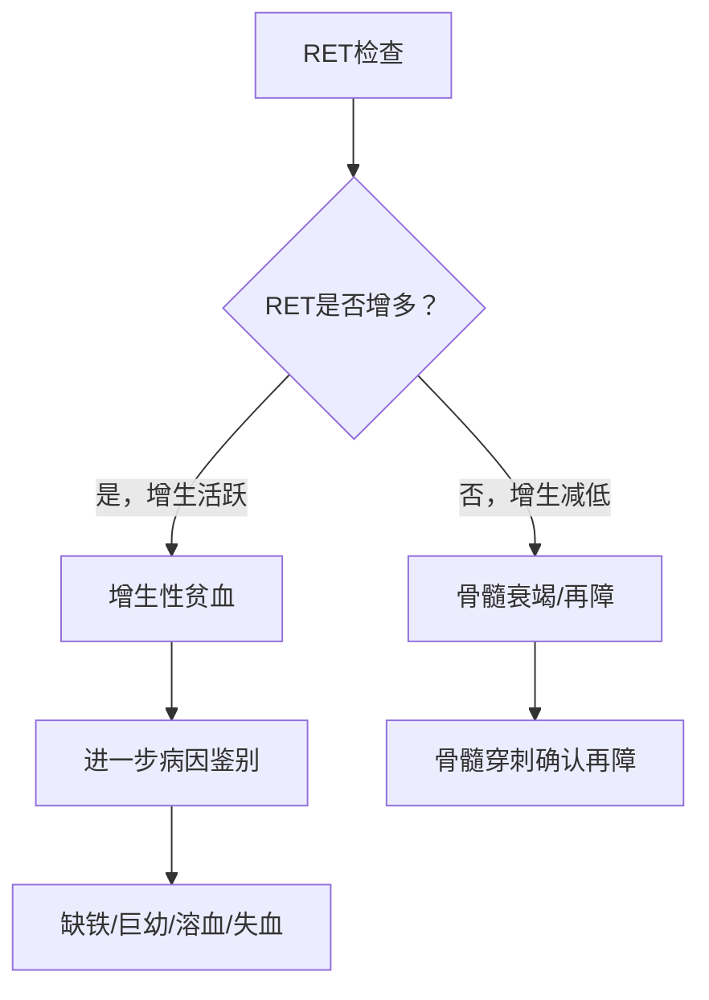
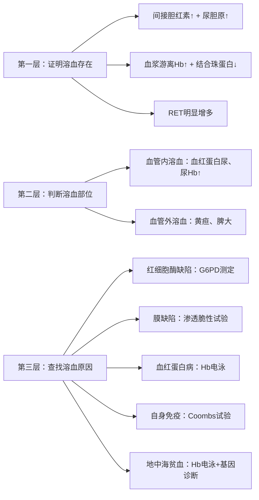
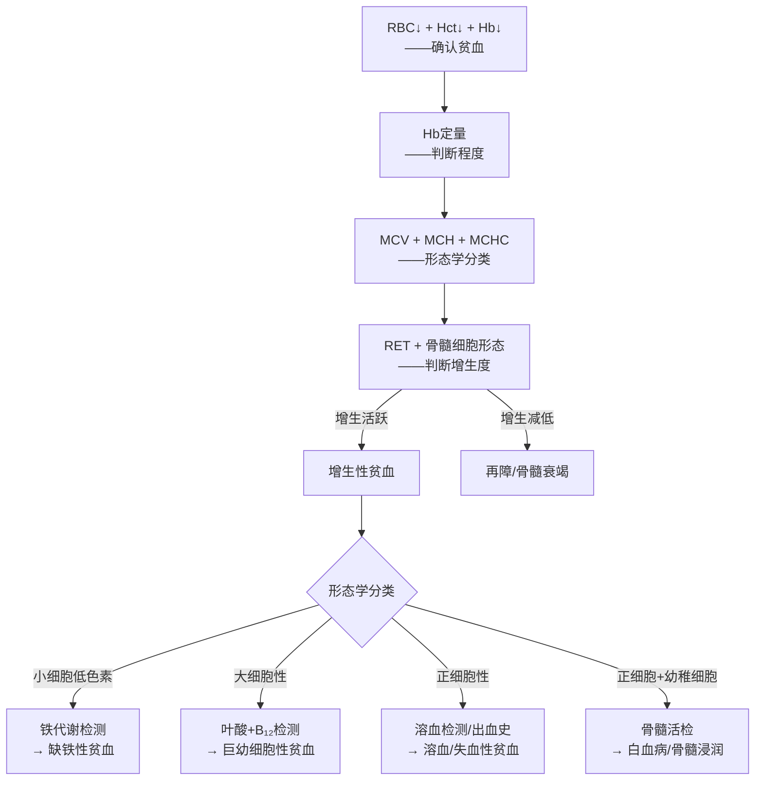
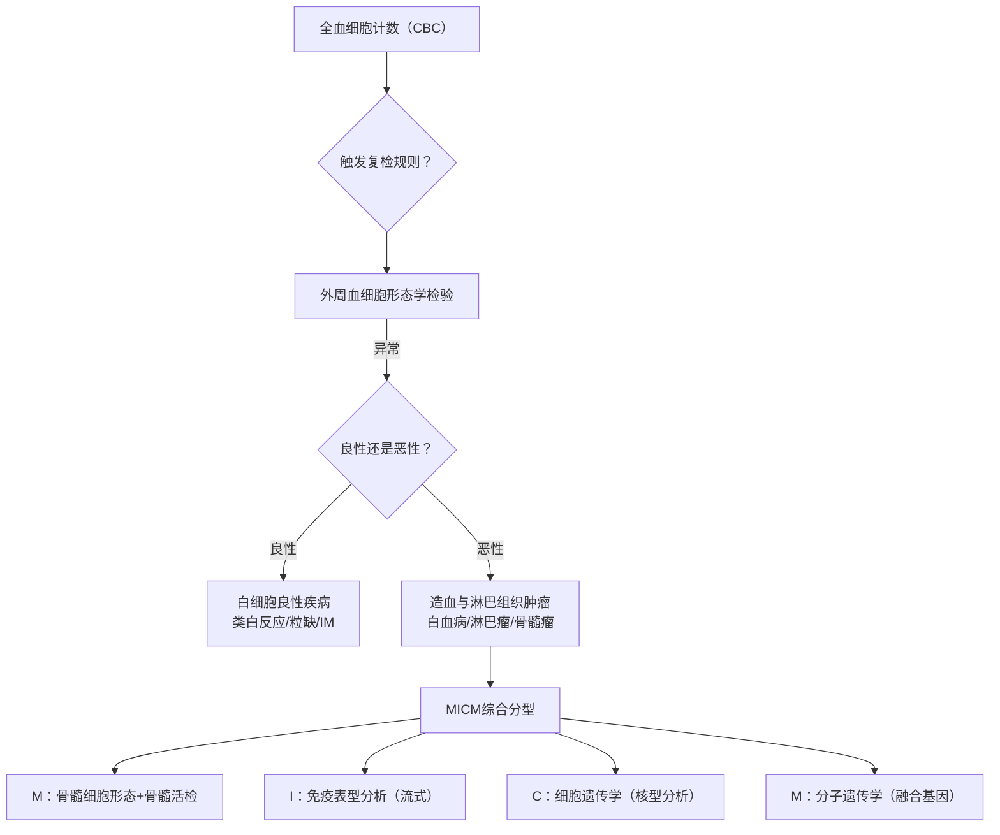
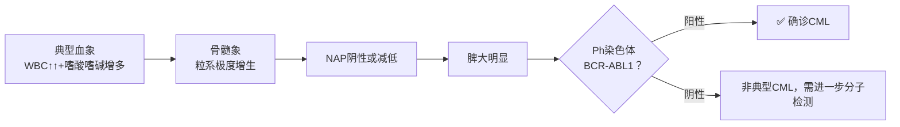
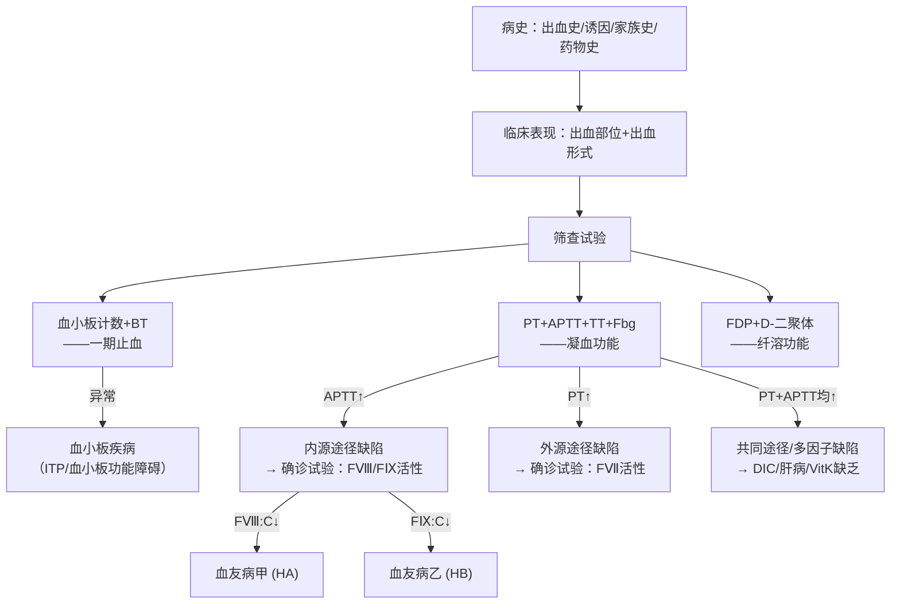
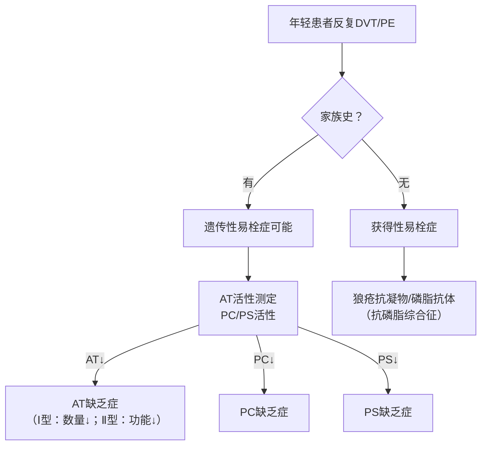
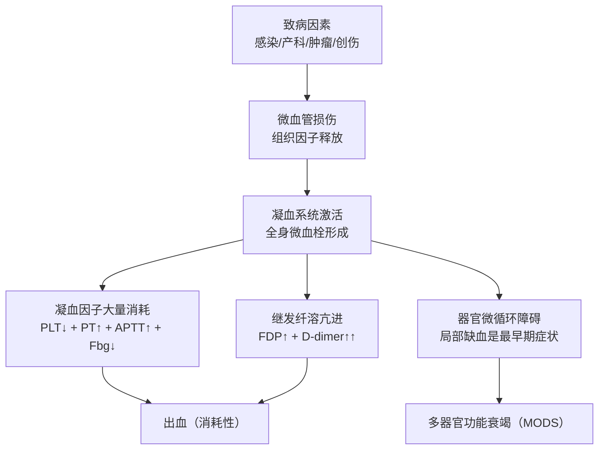
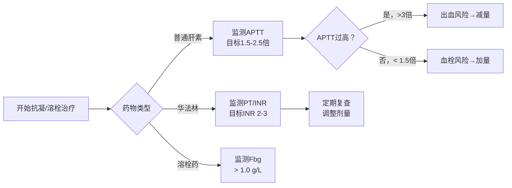
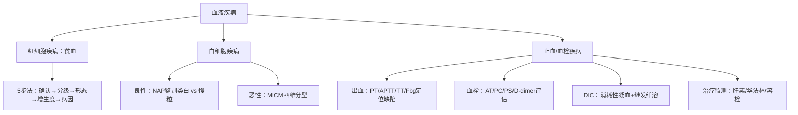

**解析摘要**
 - **课件来源**：PPT1《血液系统疾病实验诊断》（43页）+ PPT2《止血与血栓性疾病实验诊断》（47页）
 - **逻辑模板**：两章均以"诊断策略流程"为核心——PPT1主用**模板 2（鉴别诊断重点单元）**，PPT2混用**模板1（完整疾病单元）+ 模板3（急症处理 for DIC）**。原因：本课程核心是"如何用实验室手段鉴别疾病"，而非治疗方案。
 - **核心章节数**：6章（贫血诊断 / 白细胞疾病诊断 / 出血性疾病诊断 / 血栓性疾病诊断 / DIC / 抗栓监测）
 - **⭐⭐⭐ 核心掌握**：4个知识模块（贫血诊断策略、CML vs 类白、出血性疾病分类诊断、DIC指标）
 - **口诀数量**：4个
 - **预估总阅读时间**：约 70 分钟
***
# 第一章 贫血的实验诊断
> **逻辑**：五步走 → 确认 → 分级 → 形态分类 → 骨髓增生度 → 病因 | **重点等级**：⭐⭐⭐ | ⏱ 阅读约 20 min
## 1. 贫血的临床表现
📎 PPT1 第 7 页

| 系统 | 主要表现 |
|------|----------|
| 一般 | 疲乏无力、皮肤黏膜和甲床苍白 |
| 心血管/呼吸 | 心悸、心率↑、呼吸加深，严重时心脏扩大、心力衰竭 |
| 神经 | 头晕、目眩、耳鸣、头痛、畏寒、精神萎靡 |
| 消化 | 食欲减退、恶心、腹胀腹泻 |
| 泌尿生殖 | 多尿、蛋白尿，轻微肾功能异常 |
| 特殊（溶血） | **黄疸、脾大**、皮肤干燥（溶血性贫血特有） |
## 2. 第一步：确认贫血
📎 PPT1 第 9 页
成人贫血诊断标准（三选一，满足即诊断）：

| 指标 | 成年男性 | 成年女性 |
|------|----------|----------|
| **Hb（血红蛋白，g/L）** | < 120 | < 110 |
| **Hct（红细胞比积）** | < 0.40 | < 0.35 |
| **RBC（×10¹²/L）** | < 4.0 | < 3.5 |
> [!NOTE] 📌 请注意
> 临床最常用 Hb 判断贫血，Hct 和 RBC 作为辅助参考。三者同步下降才可靠，单项异常需排除血液稀释或浓缩。
## 3. 第二步：判断贫血程度
📎 PPT1 第 10 页
以 Hb（g/L）表示：

| 程度 | Hb 范围 |
|------|---------|
| 轻度 | 90 ～ 正常下限 |
| 中度 | 61 ～ 90 |
| 重度 | 31 ～ 60 |
| **极重度** | **< 30**（需紧急处理）|
> [!TIP] 💡 记忆辅助
> **口诀："三六九记心间"**
> 解释：以 30、60、90 为分界线，从低到高依次是极重度 / 重度 / 中度 / 轻度。记住三个数字就能分四级。
## 4. 第三步：形态学分类（推断病因）
📎 PPT1 第 11 页
根据**红细胞三个平均指数**分类：
- **MCV**（Mean Corpuscular Volume，平均红细胞体积，fl）
- **MCH**（Mean Corpuscular Hemoglobin，平均红细胞血红蛋白含量，pg）
- **MCHC**（Mean Corpuscular Hemoglobin Concentration，平均红细胞血红蛋白浓度，g/L）

| 类型            | MCV (fl)  | MCH (pg) | MCHC (g/L) | 常见病因                       |
| ------------- | --------- | -------- | ---------- | -------------------------- |
| **正细胞性**      | 80～100    | 27～34    | 320～360    | 失血、急性溶血、再障、白血病             |
| **小细胞低色素性** ⭐ | < 80      | < 26     | **< 320**  | **缺铁性贫血**（最常见）、铁粒幼贫血、血红蛋白病 |
| **单纯小细胞性**    | < 80      | < 26     | 320～360    | 感染、中毒、尿毒症                  |
| **大细胞性** ⭐    | **> 100** | > 34     | 320～360    | **B₁₂/叶酸缺乏**（巨幼细胞性贫血）      |
> [!NOTE] 📌 请注意
> 小细胞低色素 vs 单纯小细胞：关键区别在 **MCHC**。MCHC < 320 = 低色素（缺铁）；MCHC 正常 = 单纯小细胞（感染/中毒）。这是考试陷阱！

> [!TIP] 💡 记忆辅助
> **口诀："正血正色急失血，小低色素缺铁先，单纯小细胞感毒，大细胞来叶酸缺"**
> - "正血正色"= 正细胞正色素，见于急性失血/再障/白血病
> - "小低色素"= 小细胞低色素，首先排查缺铁
> - "单纯小细胞"= MCV↓但MCHC正常，考虑感染/中毒/尿毒症
> - "大细胞"= MCV↑，叶酸/B₁₂缺乏导致巨幼贫
## 5. 第四步：评估骨髓增生度（RBC代偿能力）
📎 PPT1 第 12-13 页
**网织红细胞（RET）**：反映骨髓红系造血活跃程度。
📖 教材补充：RET 是尚未完全成熟的红细胞，含有核糖体 RNA，煌焦油蓝染色呈蓝色网状，正常值约 0.5%～1.5%。RET↑ 提示骨髓红系代偿增生（增生性贫血）；RET↓ 提示骨髓抑制（再障等）。
**骨髓细胞形态学**：进一步判断病因，可出具以下诊断意见：
1. 增生性贫血（含溶血可能、缺铁可能）
2. 巨幼细胞性贫血
3. **再生障碍性贫血**（骨髓增生减低）
4. 纯红再障

## 6. 第五步：确定贫血病因
📎 PPT1 第 14-16 页
### 6.1 缺铁性贫血（IDA）
**铁代谢相关检测**：

| 项目 | 缺铁时变化 | 临床角色 |
|------|------------|----------|
| 血清铁（SI） | ↓ | 反映运转铁 |
| 血清铁蛋白（SF） | **↓↓（最早、最灵敏）** | 反映储存铁 |
| 总铁结合力（TIBC） | ↑ | 间接反映转铁蛋白增多 |
| 转铁蛋白饱和度 | ↓ | = SI / TIBC |
| 骨髓铁染色（内/外铁） | 细胞内外铁均减少 | 金标准 |
📖 教材补充：缺铁分三期——储存铁减少（SF↓）→ 缺铁性红细胞生成（SF↓+SI↓+TIBC↑）→ 缺铁性贫血（三期+Hb↓+小细胞低色素）。
### 6.2 巨幼细胞性贫血
**检测**：
- 血清**叶酸**水平（正常 6～20 ng/mL）
- 血清**维生素 B₁₂** 水平
📖 教材补充：叶酸和 B₁₂ 是 DNA 合成的辅酶，缺乏导致核分裂受阻，细胞体积增大但数量减少，形成大细胞性贫血。血涂片可见"过分叶核"中性粒细胞（≥5叶）。
### 6.3 溶血性贫血（HA）
📎 PPT1 第 17、24-25 页
溶血的实验室证据（三层逻辑）：

> [!NOTE] 📌 请注意
> **地中海贫血（Thalassemia）** 是血红蛋白病的代表，中国南方高发。形态上表现为小细胞低色素，但铁代谢正常（与缺铁性贫血鉴别关键！）。Hb电泳可见HbA₂或HbF增高。详见原课件 PPT1 第24-25页图。
## 7. 贫血实验诊断综合策略（总流程）
📎 PPT1 第 15、23 页

***
> [!SUMMARY] 📝 核心要点
> - **确认贫血**：男 Hb < 120，女 Hb < 110（g/L）
> - **程度分级**：极重 < 30，重 31-60，中 61-90，轻 90-正常下限
> - **形态分类**：小低色素→缺铁；大细胞→叶酸/B₁₂缺；正细胞→急性溶血/再障
> - **增生度**：RET + 骨髓穿刺
> - **病因**：铁四项（缺铁）/ 叶酸B₁₂（巨幼）/ 溶血三层 / Hb电泳（地贫）

> [!QUESTION] 🧠 检验你的理解
> Q1：一名20岁女性，面色苍白3年，长期口服铁剂无效，现面色蜡黄、脾大、肝大，Hb 55 g/L，MCV 72 fl，MCHC 305 g/L，请判断最可能的诊断，并列出下一步关键检验。
A1: 铁剂无效→非缺铁贫
脾大肝大→溶血代偿
血常规→小细胞低色素贫血
→地中海贫血。关键检验：基因、血红蛋白电泳、问询家族史、外周血涂片（靶形红细胞、点彩细胞、RET）、红细胞渗透脆性试验、
> Q2：如何区分"缺铁性贫血"和"地中海贫血"？（提示：两者形态学相似，需要哪些额外检测？）
1. 血清铁蛋白（↓、不变）
2. 总铁结合力（↑、不变）
3. Hb电泳
4. RBC
5. 红细胞分布宽度
6. 基因诊断
***
# 第二章 白细胞疾病的实验诊断
> **逻辑**：良性先排查→恶性用MICM精准分型 | **重点等级**：⭐⭐⭐ | ⏱ 阅读约 18 min
## 1. 白细胞疾病诊断总策略
📎 PPT1 第 30、38 页
所有白细胞疾病的诊断路径遵循以下顺序：

📖 教材补充：**MICM** 是造血与淋巴组织肿瘤的标准诊断框架，代表 Morphology（形态）+ Immunology（免疫）+ Cytogenetics（细胞遗传）+ Molecular biology（分子生物），缺一不可。
## 2. 白细胞良性疾病
📎 PPT1 第 30、37-38 页
常见良性白细胞疾病：

| 疾病 | 关键诊断要点 |
|------|-------------|
| 类白血病反应 | 有明确原发病；NAP **显著增高** |
| 中性粒细胞减少症 | 中性粒细胞绝对值 < 2.0×10⁹/L |
| 中性粒细胞缺乏症 | 中性粒细胞绝对值 < 0.5×10⁹/L（危急值！） |
| 传染性单核细胞增多症（IM） | EBV感染；异型淋巴细胞 > 10%；**嗜异性凝集试验** |
### 2.1 类白血病反应 vs 慢性粒细胞白血病（CML）——重点鉴别！
📎 PPT1 第 35-40 页
> [!NOTE] 📌 请注意
> **NAP（中性粒细胞碱性磷酸酶/Neutrophil Alkaline Phosphatase）积分**是鉴别类白和慢粒最简单、最重要的筛查指标：类白↑↑，慢粒↓↓（甚至为0）。记死这一点！

| 鉴别要点          | 类白血病反应（良性）       | 慢性粒细胞白血病（CML）        |
| ------------- | ---------------- | -------------------- |
| 明确病因          | **有**（感染、中毒等）    | 无                    |
| 临床表现          | 原发病症状            | 脾大、白血病症状             |
| 白细胞计数         | 中度增高，< 100×10⁹/L | 常达 **100-200×10⁹/L** |
| 幼稚细胞比例        | 原始细胞 < 5%        | 原始细胞常 > 5%，早幼粒以下均见   |
| 嗜酸/嗜碱粒细胞      | 不增多              | **常增多**              |
| **NAP**       | **显著增加**         | **显著减少（几乎阴性）**       |
| Ph染色体/BCR-ABL | **阴性**           | **阳性**               |
| 疗效            | 去除病因后好转          | 需靶向治疗（伊马替尼）          |
### 2.2 CML 的确诊标准
📎 PPT1 第 39-40 页
CML 的分子机制：9号和22号染色体部分片段易位，形成 **t(9;22)(q34.1;q11.2)**，即 **Ph染色体**（Philadelphia chromosome），产生 **BCR-ABL** 融合基因。
📖 教材补充：BCR-ABL 编码一种持续活化的酪氨酸激酶（正常蛋白是开关，BCR-ABL 相当于"死机的 ON 键"），持续传递增殖信号，导致粒细胞无限增生。靶向药伊马替尼（格列卫）正是针对此激酶。

| 检查项目                 | 阳性结果（CML）                                           | 机制解释                                                              |
| -------------------- | --------------------------------------------------- | ----------------------------------------------------------------- |
| **‌‌骨髓形态学‌‌**        | **‌‌粒系极度增生‌‌**，各阶段细胞均可见（从原始到成熟），嗜酸/嗜碱粒细胞比例增高。       | BCR-ABL融合基因驱动粒系细胞**‌‌增殖失控‌‌**，但细胞分化能力尚存，导致骨髓被大量“全阶段”粒细胞占据。        |
| **‌‌染色体核型分析‌‌**      | 发现 **‌‌Ph染色体‌‌**（费城染色体），即 **‌‌t(9;22)(q34;q11)‌‌**。 | 9号染色体上的ABL基因与22号染色体上的BCR基因发生易位，形成**‌‌BCR-ABL融合基因‌‌**，这是CML的遗传学基础。 |
| **‌‌FISH（荧光原位杂交）‌‌** | **‌‌BCR-ABL融合信号‌‌**（如红绿信号重叠/紧邻）。                    | 使用荧光标记的探针直接检测BCR和ABL基因是否融合，比染色体分析更敏感，可在**‌‌间期细胞‌‌**中检出。           |
| **‌‌定量PCR（qPCR）‌‌**  | 检测到 **‌‌BCR-ABL融合转录本‌‌**（如p210），且拷贝数显著升高。           | 融合基因转录产生异常的mRNA，PCR可特异性扩增并定量，用于确诊及后续**‌‌治疗监测‌‌**                  |
**CML 确诊路径**：

### 2.3 传染性单核细胞增多症（IM）
📎 PPT1 第 41 页
IM = EB病毒（Epstein-Barr virus）原发感染。
**实验室诊断关键**：
- 外周血**异型淋巴细胞** > 10%（形态特殊，需镜检）
- **EBV 相关检验**：VCA-IgM（急性期升高）、嗜异性凝集试验
- 骨髓细胞形态学（排除恶性淋巴瘤）
## 3. 造血与淋巴组织肿瘤
📎 PPT1 第 30、38、41 页
包括髓系肿瘤（急慢性白血病、骨髓增生异常综合征 MDS）和成熟淋巴系肿瘤（淋巴瘤、多发性骨髓瘤）。
**金标准诊断流程（MICM）**：

| 层次 | 方法 | 临床价值 |
|------|------|----------|
| M（形态） | 骨髓穿刺涂片 + 骨髓活检 + 细胞化学染色 | 初步分类（粒/淋/单核系） |
| I（免疫） | 流式细胞术（免疫表型）+ 免疫组化 | 确定细胞系别和分化阶段 |
| C（细胞遗传） | G显带核型分析 | 染色体异常（如Ph染色体） |
| M（分子） | PCR / FISH / 测序 | 融合基因、突变（如 BCR-ABL、FLT3-ITD） |
***
> [!SUMMARY] 📝 核心要点
> - **MICM** 是白血病确诊四大支柱，缺一不可
> - **NAP** 是类白 vs 慢粒的首选筛查：类白↑↑，慢粒↓↓
> - **CML 确诊**：Ph染色体 t(9;22) + BCR-ABL1 融合基因双阳性
> - **IM**：异型淋巴细胞 > 10% + EBV 相关抗体 + 嗜异性凝集试验

> [!QUESTION] 🧠Q1：51岁男性，WBC 120×10⁹/L，脾大7 cm，外周血嗜酸/嗜碱粒细胞增多，NAP积分为5（参考值40-130）。请分析最可能的诊断，需要哪些检验确诊？
A1：CML，骨髓形态学（粒系细胞增生）
FISH（BCR-ABL融合信号）
qPCR（BCR-ABL融合转录本）
G显带核型分析（Ph染色体）

> [!question] Q2：CML 的分子靶点是什么？这对哪类靶向药物具有指导意义？
A2：BCR-ABL融合基因产生的酪氨酸激酶
酪氨酸激酶抑制剂（格列卫）

# 第三章 出血性疾病的实验诊断
> **逻辑**：先理解止血生理→按出血部位初步分类→筛查试验缩小范围→确诊试验 | **重点等级**：⭐⭐⭐ | ⏱ 阅读约 20 min
## 1. 生理性止血三阶段
📎 PPT2 第 4-6 页
止血系统由五大部分组成，缺任何一环均可导致出血或血栓：

## 2. 凝血系统的实验室检测
📎 PPT2 第 9 页
**三条凝血途径与对应检测项目**（必须背熟！）：

| 途径          | 激活方式             | **筛查项目**                  | 临床意义                     |
| ----------- | ---------------- | ------------------------- | ------------------------ |
| **外源性凝血途径** | 组织因子（TF）+ F VII  | **PT（凝血酶原时间）**            | 监测外源途径（F VII、X、V、II）     |
| **内源性凝血途径** | 接触激活（F XII）      | **APTT（活化部分凝血活酶时间）**      | 监测内源途径（F VIII、IX、XI、XII） |
| **共同凝血途径**  | F X → F II → Fbg | **TT（凝血酶时间）+ Fbg（纤维蛋白原）** | 监测最终凝血步骤                 |
📖 教材补充：**PT**（正常 11-13s）——外源+共同；**APTT**（正常 26-36s）——内源+共同；**TT**（正常 16-18s）——反映纤维蛋白形成；**Fbg**（正常 2-4 g/L）——纤维蛋白原水平。四个组合是出凝血筛查的标配。
## 3. 出血性疾病的分类与临床鉴别
📎 PPT2 第 14-16 页
### 3.1 按出血部位初步判断缺陷环节

| 出血表现     | 血管壁异常  | 血小板异常  | 凝血因子异常 | 纤溶亢进   | 循环抗凝物 |
| -------- | ------ | ------ | ------ | ------ | ----- |
| **出血点**  | 多见     | **常见** | 罕见     | 罕见     | 罕见    |
| **紫癜**   | **常见** | **多见** | 少见     | 少见     | 少见    |
| **大片瘀斑** | 罕见     | 少见     | 少见     | **常见** | 少见    |
| **血肿**   | 罕见     | 少见     | **多见** | 多见     | 常见    |
| **关节出血** | 罕见     | 罕见     | **常见** | 罕见     | 少见    |
| **月经过多** | 少见     | **常见** | 少见     | 多见     | 多见    |
> [!NOTE] 📌 请注意
> **黄金规律：**
> - **皮肤黏膜出血（出血点、紫癜）** = 一期止血缺陷（血管/血小板）
> - **深部血肿 + 关节出血** = 二期止血缺陷（凝血因子）
> 记住"皮肤看一期，深部看二期"这个铁律！
### 3.2 出血性疾病诊断流程
📎 PPT2 第 17-18 页

## 4. 典型案例：血友病甲的诊断流程
📎 PPT2 第 19-26 页
**病例要点**：2岁男童，反复关节淤血（膝/肘/腋窝），舅舅有类似病史（X连锁隐性遗传）。
**诊断逻辑**：

| 步骤 | 检验结果 | 解读 |
|------|----------|------|
| 1. 初步筛查 | 血小板正常，BT正常 | 排除一期止血（血管/血小板）缺陷 |
| 2. 凝血筛查 | PT正常，TT正常，Fbg正常 | 排除外源途径和共同途径 |
| 3. 关键发现 | **APTT 102s↑↑**（正常 < 36s）| 内源途径异常！ |
| 4. 鉴别 vWD | vWF：Ag 100%（正常） | 排除血管性血友病（vWF正常）|
| 5. 确诊 | **FⅧ:C（促凝活性）↓↓** | 确诊血友病甲（HA） |
| 6. 排除 HB | FⅨ:C 正常 | 排除血友病乙 |
**诊断：血友病甲（Hemophilia A）**
📖 教材补充：血友病甲 = FⅧ缺乏（X连锁隐性遗传，男患女携）；血友病乙 = FⅨ缺乏。两者都表现为APTT延长、关节/肌肉出血，区别靠因子活性测定。
> [!WARNING] ⚠️ 常见疑问
> **Q：血管性血友病（vWD）和血友病甲都有APTT延长，如何区分？**
> A：vWD 的 FⅧ:C 可以降低，但关键区别是 **vWF:Ag（vWF抗原）** 降低，同时出血时间（BT）延长（因为vWF介导血小板黏附）。血友病甲的 vWF 完全正常。
### 4.1 一期止血缺陷筛查试验解读
📎 PPT2 第 28 页（详见原课件图表）
一期止血（血管+血小板）主要检测：
- **血小板计数（PLT）**：正常 100-300×10⁹/L；< 100 为减少，< 20 有自发出血风险
- **出血时间（BT）**：反映血管和血小板的共同功能，正常 1-7 min
- **血小板聚集功能测定**：诊断血小板功能障碍（如血小板无力症）
> [!SUMMARY] 📝 核心要点
> - **凝血筛查四件套**：PT（外源）、APTT（内源）、TT（共同）、Fbg（共同）
> - **皮肤出血→一期，深部血肿/关节出血→二期**（凝血因子缺陷）
> - **血友病甲**：APTT↑ + FⅧ:C↓ + vWF正常 + X连锁隐性遗传
> - **血友病甲 vs 乙**：唯一区别是 FⅧ vs FⅨ 活性

> [!QUESTION] 🧠 Q1：一个患者 PT 延长，APTT 正常，应首先考虑哪条凝血途径异常？需要做什么确诊试验？
A1：外源途径异常，需要测定F III、F VII活性，PT纠正试验，排除华法林（维K拮抗剂）影响。

> [!QUESTION] 🧠 Q2：ITP（免疫性血小板减少症）患者的凝血功能如何？（PT、APTT、TT、Fbg 是否正常？）
A2：正常。初期止血功能受损，表现为皮肤黏膜出血、出血点、紫癜
# 第四章 血栓性疾病的实验诊断
> **逻辑**：抗凝缺陷 + 纤溶异常 → 易栓症 → 靶向诊断 | **重点等级**：⭐⭐ | ⏱ 阅读约 10 min
## 1. 血栓形成的实验诊断框架
📎 PPT2 第 31-36 页
血栓形成 = 促凝 > 抗凝 + 纤溶不足。主要查三大抗凝系统缺陷：

| 缺陷类型                | 检测项目          | 临床意义                     |
| ------------------- | ------------- | ------------------------ |
| **抗凝血酶（AT）缺乏**      | AT 活性 + AT 抗原 | 最常见遗传性血栓原因之一             |
| **蛋白 C（PC）缺乏**      | PC 活性         | PC 灭活 FVa/FVIIIa，缺乏时凝血失控 |
| **蛋白 S（PS）缺乏**      | PS 游离型抗原      | PS 是 PC 的辅因子，缺乏同 PC      |
| vWF 裂解酶（ADAMTS13）缺乏 | ADAMTS13 活性   | TTP 诊断                   |
| 肝素诱导血小板减少症          | HIT 抗体        | 使用肝素后血小板减少+血栓            |
📖 教材补充：**抗凝血酶（AT/Antithrombin）** 是血浆中最重要的抗凝因子，能灭活凝血酶（FIIa）和 FXa，肝素可以放大其抗凝活性 1000 倍。AT 缺乏时，凝血酶无法有效被清除，导致反复血栓。
**纤溶系统异常标志物**：
- **FDP（纤维蛋白/纤维蛋白原降解产物）**：纤溶亢进时升高（但特异性低）
- **D-二聚体（D-dimer）**：交联纤维蛋白降解后产生，**特异性高于FDP**，阴性排除 DVT/PE 价值高
- PLG（纤溶酶原）、t-PA（组织纤溶酶原激活物）、PAI（纤溶酶原激活物抑制剂）
## 2. 易栓症诊断思路
📎 PPT2 第 34-35 页（详见原课件图）
**易栓症（Thrombophilia）**：指遗传性或获得性血栓高风险状态，以反复静脉血栓（DVT）为特征。

## 3. 典型案例：AT缺乏症
📎 PPT2 第 37-39 页
**病例**：18岁男性，突发大咯血→肺梗死，两周后右下肢 DVT（深静脉血栓）。家系调查：三代10人中9人 AT 水平低于正常。基因分析：外显子6区 13389G 缺失，移码突变。
**诊断**：**Ⅰ型 AT 缺陷症（杂合子型）**（Ⅰ型 = AT 数量和活性平行下降）
> [!NOTE] 📌 请注意
> AT 缺乏分型：Ⅰ型 = AT 蛋白数量和功能均减少；Ⅱ型 = 数量正常但功能异常。临床上 Ⅰ 型更常见，可通过 AT 活性 + AT 抗原检测区分。
***
> [!SUMMARY] 📝 核心要点
> - 血栓性疾病主要查**抗凝蛋白缺陷**：AT、PC、PS
> - D-二聚体阴性可用于**排除** DVT/PE
> - 年轻多发 DVT + 家族史 → 首先考虑遗传性易栓症
***
# 第五章 DIC 的实验诊断
> **主线**：识别 → 评估 → 指标组合 | **重点等级**：⭐⭐⭐ | ⏱ 阅读约 10 min
## 1. DIC 的定义与发病机制
📎 PPT2 第 42-44 页
**DIC（Disseminated Intravascular Coagulation，弥散性血管内凝血）**：在许多疾病基础上，致病因素损伤微血管体系，导致**凝血活化**，全身微血管血栓形成、凝血因子大量消耗并**继发纤溶亢进**，引起以**出血及微循环衰竭**为特征的临床综合征。

## 2. DIC 的临床特征
📎 PPT2 第 44 页
两大核心临床表现：

| 表现 | 特点 |
|------|------|
| **局部缺血** | 最早期症状（微血栓导致器官供血不足） |
| **出血** | 最常见临床表现（消耗性凝血 + 继发纤溶） |
## 3. DIC 的实验室指标组合
📎 PPT2 第 45 页
> [!NOTE] 📌 请注意
> DIC 的实验室特征是"消耗性凝血 + 纤溶亢进"的叠加，因此体现为：**血小板↓ + 凝血时间延长 + 纤维蛋白原↓ + 纤溶标志物↑**。

| 检测项目 | DIC时变化 | 机制 |
|---------|-----------|------|
| PLT（血小板计数） | ↓↓ | 消耗于微血栓中 |
| PT | ↑（延长） | 凝血因子消耗 |
| APTT | ↑（延长） | 凝血因子消耗 |
| **Fbg（纤维蛋白原）** | **↓↓** | 大量转化为纤维蛋白被消耗 |
| **FDP** | **↑↑** | 继发纤溶亢进 |
| **D-二聚体** | **↑↑（最特异）** | 交联纤维蛋白降解标志 |
| AT | ↓ | 抗凝储备耗竭 |
> [!TIP] 💡 记忆辅助
> **DIC 实验室口诀："血板减，凝时延，纤维降，D簇升"**
> - "血板减" = PLT↓（血小板减少）
> - "凝时延" = PT+APTT 延长
> - "纤维降" = Fbg↓（纤维蛋白原降低）
> - "D簇升" = D-二聚体↑↑（最特异，与FDP同向）
***
> [!SUMMARY] 📝 核心要点
> - DIC = 消耗性凝血 + 继发纤溶亢进
> - 指标：PLT↓、PT↑、APTT↑、Fbg↓、D-dimer↑↑、FDP↑
> - 局部缺血（微血栓）是最早期症状；出血是最常见表现
> - 治疗需针对原发病，同时补充凝血因子
***
> [!QUESTION] 🧠 检验你的理解
> Q1：DIC 患者为何既有微血栓（缺血）又有出血？（请从机制角度解释这一"矛盾"现象）
> Q2：D-二聚体↑↑但 FDP 轻度升高，这种情况提示什么？（提示：D-二聚体特异性高于FDP）
***
# 第六章 抗栓与溶栓治疗的实验监测
> **主线**：为什么要监测 → 监测什么 → 目标值 | **重点等级**：⭐⭐ | ⏱ 阅读约 8 min
## 1. 为什么需要实验室监测
📎 PPT2 第 40、46 页
需要监测的原因：
1. 不同个体间差异大，需个体化给药
2. 药物作用体内不稳定，受食物/药物相互作用影响
3. 药物浓度/效应与不良事件直接相关（过量→出血；不足→血栓）
4. 监测可为剂量调整提供客观依据
## 2. 主要抗栓药物的监测策略
📎 PPT2 第 40-46 页

| 药物类型 | 代表药物 | 监测指标 | 目标值（一般）|
|---------|---------|---------|-------------|
| **普通肝素（UFH）** | 肝素 | **APTT** | 正常值的 1.5-2.5 倍 |
| **华法林（口服抗凝）** | 华法林 | **PT / INR** | INR 2.0-3.0（多数适应症）|
| **溶栓药物** | 链激酶/尿激酶/rt-PA | **Fbg（纤维蛋白原）** | > 1.0 g/L（防出血）|
| 低分子量肝素（LMWH） | 依诺肝素 | 抗 Xa 活性（特殊情况） | — |
📖 教材补充：**华法林（维生素K拮抗剂，VKA）** 通过抑制维生素K依赖的凝血因子（II、VII、IX、X）合成发挥抗凝效果，PT/INR 反映这些因子的综合活性。INR（International Normalized Ratio，国际标准化比值）是PT的标化形式，减少不同实验室间误差。

***
> [!SUMMARY] 📝 核心要点
> - **肝素 → APTT**（1.5-2.5倍为治疗目标）
> - **华法林 → PT/INR**（INR 2.0-3.0 为多数适应症目标）
> - **溶栓药 → Fbg**（防止纤维蛋白原降至危险水平导致出血）
> - 监测的根本目的：在"有效抗栓"和"不引起出血"之间找到平衡
***
> [!QUESTION] 🧠 检验你的理解
> Q1：一名使用普通肝素的患者，APTT 结果为 90s（正常 26-36s），应如何处理？请说明判断依据。
>1. 肝素抗凝过度，检查活动性出血，警惕颅内出血，评估出血高危因素
>2. 处理：暂停肝素，1-2h后复查APTT，减少肝素
>3. 若有出血风险，压迫止血、输血、血小板，根据凝血功能补充凝血因子
# 全书综合小结
> [!SUMMARY] 📝 整体框架回顾
**血液系统实验诊断核心逻辑**

| 记忆锚点     | 关键值/关键项                       |
| -------- | ----------------------------- |
| 男性贫血标准   | Hb < 120 g/L                  |
| 女性贫血标准   | Hb < 110 g/L                  |
| 极重度贫血    | Hb < 30 g/L                   |
| 缺铁贫特征    | MCV < 80 + MCHC < 320 + SF↓   |
| 巨幼贫特征    | MCV > 100 + 叶酸/B₁₂↓           |
| 慢粒 vs 类白 | Ph/BCR-ABL 阳性+NAP↓ vs 阴性+NAP↑ |
| 血友病甲     | APTT↑ + FⅧ:C↓ + vWF正常         |
| DIC      | PLT↓+PT↑+APTT↑+Fbg↓+D-dimer↑  |
| 肝素监测     | APTT 1.5-2.5倍正常               |
| 华法林监测    | INR 2.0-3.0                   |
