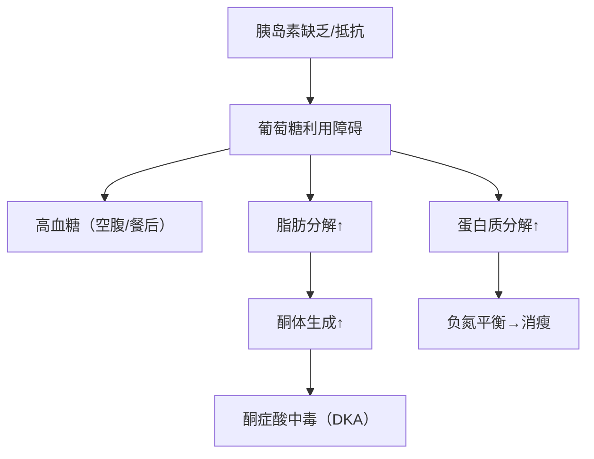
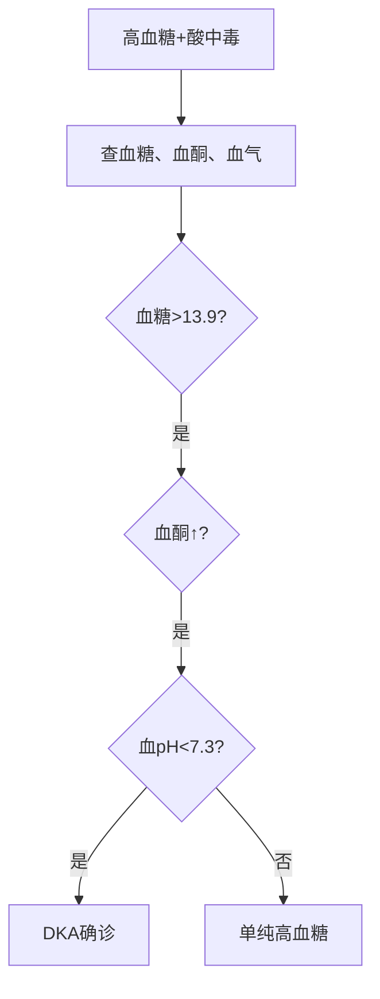
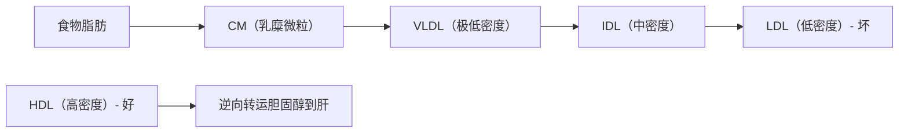
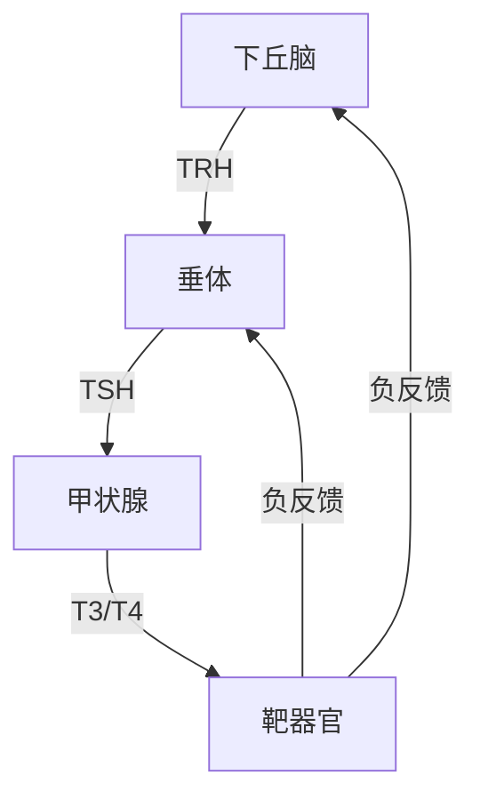
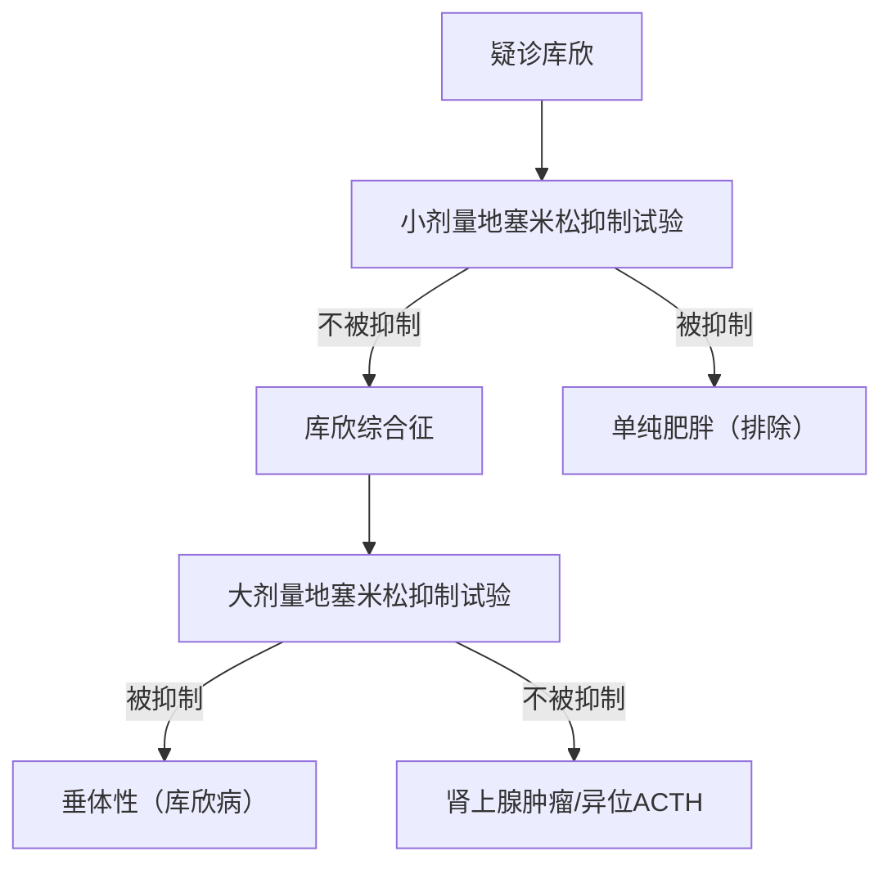

 **解析摘要**
- **章节主题**：代谢与内分泌疾病的实验诊断（糖代谢、脂代谢、甲状腺、水电解质、骨代谢、肾上腺）
- **主导逻辑模板**：模板1（完整疾病单元）+ 模板2（鉴别诊断重点单元，用于高脂血症表型分类）
- **重点分级**：⭐⭐⭐（糖尿病、高脂血症、甲亢/甲减、水电解质紊乱）；⭐⭐（低血糖症、甲状腺炎、库欣综合征）；⭐（骨代谢详细分型、肾上腺罕见病）
- **口诀数量**：6个（糖尿病诊断、DKA、高脂血症分类、甲状腺功能、高钾心电图、酸碱代偿）
- **总阅读时间**：约 110 min（分6大块）
***
# 第一部分：糖代谢疾病（⭐⭐⭐ 核心章节）
## 1. 糖代谢概述（📎 PPT 第6-8页）
### 1.1 血糖的来源与去路
- **血糖**：血液中的葡萄糖。
- **正常空腹**：3.9~6.1 mmol/L。
- **动态平衡**：来源与去路在激素调节下保持稳定。
### 1.2 调节激素（必考对应关系）
| 激素 | 作用 | 机制钩子 |
|------|------|----------|
| 胰岛素（唯一降糖） | 促葡萄糖摄取、糖原合成、抑制糖异生 | 缺它 → 血糖↑ |
| 胰高血糖素 | 促糖原分解、糖异生 | 升糖 |
| 肾上腺素、皮质醇、生长激素 | 拮抗胰岛素 | 应激时升糖 |
> [!NOTE] 📌 请注意
> 皮质醇是“允许作用”（本身升糖不强，但允许胰高血糖素充分发挥）。考试常考“下列哪种激素不升高血糖？”——答案：胰岛素。
***
## 2. 糖尿病（DM）（📎 PPT 第9-29页）
### 疾病速览
📎 PPT 第11页 | 重点等级：⭐⭐⭐ | 阅读时间：约 18 min
**定义**：胰岛素分泌不足或（和）作用缺陷引起的慢性高血糖代谢病。
**典型表现**：“三多一少”——多饮、多尿、多食、体重减轻。
### 2.1 病因与病理机制（从生化→临床）
📎 PPT 第11、18页

**机制推导链**：胰岛素不足 → 葡萄糖无法进入细胞 → 血糖升高（细胞“饥饿”）→ 脂肪分解供能 → 酮体堆积 → 酸中毒。
> [!NOTE] 📌 请注意
> 1型糖尿病是**胰岛素绝对缺乏**（自身免疫破坏β细胞）；2型是**胰岛素抵抗+相对不足**。两者机制不同，治疗原则也不同——1型依赖胰岛素，2型可口服药。
### 2.2 临床表现（三多一少的机制钩子）
📎 PPT 第11页

| 症状 | 机制 |
|------|------|
| 多尿 | 血糖超过肾糖阈 → 渗透性利尿 |
| 多饮 | 失水 → 口渴中枢兴奋 |
| 多食 | 细胞无法利用葡萄糖 → 饥饿感 |
| 体重减轻 | 脂肪、蛋白质分解 |
### 2.3 辅助检查（实验诊断核心）
📎 PPT 第13-17页
#### 2.3.1 早期筛查三项

| 检查项目 | 正常值 | 临床角色 | 注意 |
|----------|--------|----------|------|
| 空腹血糖（FPG） | 3.9~6.1 mmol/L | 基础筛查 | 至少禁食8h |
| OGTT 2h血糖 | <7.8 mmol/L | 更敏感，用于可疑糖尿病 | 服75g葡萄糖 |
| HbA1c（糖化血红蛋白） | <6.5% | 评估近6~8周血糖；诊断≥6.5% | 不受单次饮食影响 |
#### 2.3.2 OGTT曲线解读（📎 PPT 第13页）
- **正常**：0.5~1h达峰值 7.8~9.0（<11.1），2h <7.8，3h恢复空腹。
- **糖耐量受损（IGT）**：空腹 <7.0，2h 7.8~11.1。
- **空腹血糖受损（IFG）**：空腹 6.1~7.0，2h <7.8。
- **糖尿病**：空腹≥7.0，或随机≥11.1，或2h≥11.1。
#### 2.3.3 糖化血红蛋白（HbA1c）深度讲解
📎 PPT 第14页
> 血红蛋白的氨基酸残基与葡萄糖**不可逆**结合 → 血糖越高、时间越长 → HbA1c越高。
**为什么能反映长期血糖？**  
红细胞寿命120天 → HbA1c反映过去6~8周平均血糖，不受单次饮食/活动影响。
**诊断标准**：HbA1c ≥6.5%（需标准化方法）。
**影响因素（干扰诊断）**：镰状细胞病、妊娠中晚期、G6PD缺乏症、艾滋病、血液透析、近期失血/输血、EPO治疗——这些情况不能单用HbA1c诊断。
### 2.4 诊断标准（必须记住）
📎 PPT 第15页
**有典型症状 + 下列任意1项**：
- FPG ≥7.0
- 随机血糖 ≥11.1
- OGTT 2h ≥11.1
**无症状 + 下列任意1项**（需复查确认）：
- 2次 FPG ≥7.0
- 2次 OGTT 2h ≥11.1
- 1次 FPG ≥7.0 + 1次 OGTT 2h ≥11.1
> 💡 记忆口诀
> **“有症状一锤定音，无症状两次确认”**
> 解释：有典型“三多一少”时，一次血糖超标即可诊断；无症状者需要两次异常或一项异常加另一项异常。
### 2.5 病例实战：梁女士（📎 PPT 第9、17、22页）

| 指标 | 结果 | 正常参考 | 结论 |
|------|------|----------|------|
| FPG | 9.67 ↑ | 3.9~6.1 | 高 |
| OGTT 2h | 21.46 ↑ | <7.8 | 极高 |
| HbA1c | 10.0% ↑ | <6.5% | 长期控制差 |
| 空腹胰岛素 | 3.5 ↓ | 3.7~12.8 | 低 |
| 空腹C肽 | 182 ↓ | 390~1729 | 低 |
| GAD抗体 | **强阳性** | 阴性 | 自身免疫证据 |
**诊断**：**1型糖尿病**（自身免疫性）。
**推导**：空腹C肽显著降低 + GAD抗体阳性 → 胰岛β细胞被自身免疫破坏 → 胰岛素绝对缺乏。
### 2.6 糖尿病分型（📎 PPT 第18-24页）

| 分型 | 核心机制 | 占比 | 关键实验诊断指标 |
|------|----------|------|------------------|
| 1型（T1DM） | 自身免疫破坏β细胞 → 胰岛素绝对缺乏 | 5-10% | C肽↓、自身抗体阳性（GAD最敏感） |
| 2型（T2DM） | 胰岛素抵抗 + 相对不足 | 90-95% | C肽正常/↑，自身抗体阴性 |
| 妊娠糖尿病（GDM） | 妊娠期首次发现糖耐量异常 | - | 妊娠期筛查 |
| 其他特殊类型 | 单基因突变、药物等 | 罕见 | 基因检测 |
> [!NOTE] 📌 鉴别核心
> **C肽**：与胰岛素等分子分泌，但**不受外源胰岛素干扰**，是反映自身胰岛功能的金标准。  
> **胰岛素相关自身抗体**：GAD抗体出现最早、阳性率最高，是T1DM的关键诊断指标。
### 2.7 急性并发症——糖尿病酮症酸中毒（DKA）（⭐⭐⭐ 高频）
📎 PPT 第28-29页
#### 发病机制链
胰岛素缺乏 → 脂肪分解↑ → 脂肪酸→酮体（乙酰乙酸、β-羟丁酸、丙酮）→ 酮体堆积 → 代谢性酸中毒 → 高阴离子间隙。
#### 诱因
- 1型糖尿病最常见
- 2型在感染、应激下也可发生
#### 实验诊断路径（必考）

**关键指标**：
- 血糖 >13.9 mmol/L
- 血酮体 ↑（或尿酮强阳性）
- 动脉血pH <7.3
- 阴离子间隙 >12（正常8-12）
> 💡 记忆口诀
> **“高糖高酮低pH，DKA三件套”**
> 解释：DKA诊断需要同时具备——高血糖（>13.9）、高酮体、低pH（<7.3）。
#### 治疗监测（实验室视角）
- 每1-2h测血糖（目标下降速度 2.8-4.2 mmol/L/h）
- 每2-4h测电解质（K+尤为重要——补液+胰岛素→K+向细胞内转移→可致低钾）
- 血酮、血气、肾功能监测
### 2.8 其他并发症速览
📎 PPT 第27页

| 并发症类型 | 机制 | 实验室指标 |
|------------|------|------------|
| 糖尿病肾病 | 肾小球基底膜增厚 | 尿微量白蛋白（早期）、血肌酐↑ |
| 糖尿病视网膜病变 | 毛细血管渗漏、新生血管 | 眼底检查（实验室不直接测） |
| 糖尿病神经病变 | 髓鞘蛋白糖基化 | 神经传导速度（电生理） |
***
## 3. 低血糖症（⭐⭐ 熟悉）
📎 PPT 第30-32页
### 定义
血糖 <2.8 mmol/L + 交感神经兴奋症状（出汗、颤抖、心悸、饥饿）+ 供糖后迅速缓解。
### 临床表现
- **交感兴奋**：出汗、颤抖、心悸、焦虑、饥饿、面色苍白
- **脑功能不足**：精神不集中、头晕、嗜睡、视物模糊、严重时昏迷
### 实验诊断路径
Whipple三联征（经典）：
1. 低血糖症状
2. 发作时血糖 <2.8 mmol/L
3. 供糖后症状迅速缓解
> 📌 请注意
> 低血糖症≠低血糖反应（后者血糖正常但出现症状，见于血糖快速下降者）。
### 本章小结
📝 **Take-Home Messages**
1. **空腹血糖、OGTT、HbA1c** 是糖尿病诊断三大核心。
2. **HbA1c ≥6.5%** 可直接诊断糖尿病（需排除干扰因素）。
3. **C肽 + 自身抗体** 是1型与2型鉴别关键——C肽低+GAD阳性=1型。
4. **DKA诊断**：高血糖+高酮体+低pH。
5. **低血糖诊断**：Whipple三联征。
***
# 第二部分：脂代谢疾病（⭐⭐⭐ 核心章节）
## 1. 血脂概述（📎 PPT 第33-39页）
### 1.1 血脂组成
| 成分 | 全称 | 临床意义 |
|------|------|----------|
| TC | 总胆固醇 | 动脉粥样硬化原料 |
| TG | 甘油三酯 | 能量储存，高值与胰腺炎相关 |
| LDL-C | 低密度脂蛋白胆固醇 | **“坏胆固醇”**，ASCVD首要靶点 |
| HDL-C | 高密度脂蛋白胆固醇 | **“好胆固醇”**，逆转运胆固醇 |
| Lp(a) | 脂蛋白(a) | 独立危险因素 |
### 1.2 脂蛋白代谢核心（机制→指标）
📎 PPT 第36-39页

**机制钩子**：LDL将胆固醇运到外周血管壁 → 沉积 → 动脉粥样硬化；HDL将外周胆固醇运回肝代谢 → 保护血管。
***
## 2. 高脂血症（⭐⭐⭐ 核心）
📎 PPT 第40-51页
### 2.1 定义与临床特征
**定义**：血浆TC和/或TG升高。
**临床特征**：
- 黄色瘤（眼睑周围脂质沉积）
- 早发性角膜环
- 动脉粥样硬化（心脑血管事件）
### 2.2 早期发现（实验室筛查策略）
📎 PPT 第43页
- **20岁以上**：至少每5年检测1次空腹血脂
- **缺血性心血管病及高危人群**：每3-6个月测1次
### 2.3 表型分类——WHO分型（重点理解）
📎 PPT 第46页

| 类型 | 脂蛋白变化 | 血脂特征 | 冠心病风险 |
|------|-----------|----------|-----------|
| I | CM↑ | TG↑↑↑ | 低 |
| IIa | LDL↑ | TC↑↑ | 高 |
| IIb | LDL↑+VLDL↑ | TC↑+TG↑ | 高 |
| III | IDL↑ | TC↑+TG↑ | 较高 |
| IV | VLDL↑ | TG↑ | 中等 |
| V | CM+VLDL↑ | TG↑↑ | 低 |
> [!NOTE] 📌 临床实用
> 临床上不强制分型，因为繁杂。但理解**II型（高胆固醇）与IV型（高甘油三酯）** 对治疗选择有意义——前者用他汀，后者用贝特类。
### 2.4 病因分类
- **原发性**：遗传因素（家族性高胆固醇血症等）
- **继发性**：糖尿病、肾病综合征、甲状腺功能减退、药物等
### 2.5 治疗目标（实验室监测核心）
📎 PPT 第49页

| 危险分层 | LDL-C目标 | 非HDL-C目标 |
|----------|-----------|-------------|
| 低/中危 | <3.4 mmol/L | <4.1 mmol/L |
| 高危 | <2.6 mmol/L | <3.4 mmol/L |
| 极高危 | <1.8 mmol/L | <2.6 mmol/L |
**TG合适水平**：<1.7 mmol/L
### 2.6 孙先生案例（📎 PPT 第40-43页）
- 身高1.75m，体重85kg → BMI=27.7（超重，正常18.5-23.9）
- 腰围92cm（男性≥90cm提示中心性肥胖）
- 吸烟史、父亲脂肪肝
- **需进一步检查**：TC、TG、LDL-C、HDL-C、空腹血糖、肝肾功能
> ⚠️ 常见疑问
> Q：孙先生的高脂血症是原发性还是继发性？  
> A：需排除糖尿病、肾病、甲减等继发原因。若排除后血脂仍高，则考虑原发性（可能家族性）。
***
## 3. 其他脂代谢疾病（⭐ 了解）
📎 PPT 第52-54页
### 3.1 低脂血症
- **低胆固醇血症**：TC <3.367 mmol/L
- **低LDL血症**：LDL-C <0.78 mmol/L（罕见遗传病）
- **低HDL血症**：肥胖、吸烟、糖尿病、肾病综合征时出现 → 冠心病风险↑
### 3.2 代谢综合征（诊断标准，具备3项及以上）
| 指标 | 切点 |
|------|------|
| BMI | ≥25 kg/m² |
| FPG | ≥6.1 mmol/L 或确诊糖尿病 |
| 血压 | ≥140/90 mmHg 或确诊高血压 |
| TG | ≥1.7 mmol/L |
| HDL-C | 男<0.9，女<1.0 mmol/L |
***
> [!summary] 📝 **Take-Home Messages**
>1. **LDL-C是首要干预靶点**——降LDL=降ASCVD风险。
>2. **WHO分型**：II型（高TC，他汀） vs IV型（高TG，贝特）最常用。
>4. **代谢综合征**诊断需满足3/5项——核心是肥胖+高血糖+高血压+血脂异常。
***
# 第三部分：甲状腺疾病（⭐⭐⭐ 核心章节）
## 1. 甲状腺激素生理（📎 PPT 第55-61页）
### 1.1 合成与调节轴（下丘脑-垂体-甲状腺轴）

### 1.2 关键概念（必考）
- **T4（甲状腺素）**：主要分泌形式，活性较弱
- **T3（三碘甲腺原氨酸）**：活性强，主要来自T4外周脱碘（80%）
- **结合型 vs 游离型**：>99%结合（TBG为载体），**只有游离型（fT3/fT4）进入靶细胞发挥作用**
- **rT3（反T3）**：T4脱碘的另一产物，无活性，反映T4代谢
> 💡 记忆口诀
> **“T3强，T4多，游离才是真干活；结合多，不干活，测游离更准确”**
***
## 2. 甲状腺功能亢进症（甲亢）（⭐⭐⭐）
📎 PPT 第64-66页
### 2.1 概述
**定义**：甲状腺激素分泌过多引起的临床综合征。
**最常见类型**：Graves病（弥漫性毒性甲状腺肿）。
**特征**：女性高发（4-6:1），20-50岁。
### 2.2 临床表现（机制钩子）
| 表现 | 机制 |
|------|------|
| 高代谢综合征 | 基础代谢率↑ → 多食、消瘦、怕热多汗 |
| 神经兴奋 | T3/T4↑ → 交感兴奋 → 烦躁、易激动、肌颤 |
| 心血管 | 心率↑、收缩压↑、心律失常（房颤常见） |
| 突眼 | 自身免疫攻击眼眶组织 |
| 甲状腺肿大 | 弥漫性、对称性、质软 |
### 2.3 实验诊断特点（顺序有讲究）
📎 PPT 第65-66页

| 指标 | 变化 | 临床意义 |
|------|------|----------|
| **TSH** | ↓ | 最敏感、最早变化；亚临床甲亢仅TSH↓，T3/T4正常 |
| **fT3/fT4** | ↑ | 比总T3/T4更灵敏特异 |
| tT3 | ↑ | 比tT4升高更快更敏感 |
| rT3 | ↑ | 反映T4代谢 |
| TRAb（TSH受体抗体） | 80%阳性 | Graves病诊断标志 |
| TPOAb/TgAb | 50%阳性 | 提示自身免疫背景 |
> [!NOTE] 📌 诊断路径
> **疑诊甲亢 → 首选查TSH**（最敏感）→ TSH↓ → 查fT4/fT3 → 升高则确诊 → 查TRAb确认Graves病。
### 2.4 亚临床甲亢
仅TSH降低，T3/T4正常。需随访或根据病因治疗。
***
## 3. 甲状腺功能减退症（甲减）（⭐⭐⭐）
📎 PPT 第67-69页
### 3.1 概述
**定义**：甲状腺激素合成、分泌或生物效应不足引起的低代谢综合征。
**分型**：
- **原发性甲减**（最常见）：甲状腺本身病变（桥本甲状腺炎、手术、放疗等）
- **继发性甲减**：垂体或下丘脑病变（TSH或TRH缺乏）
**临床表现**（代谢率减低）：
- 畏寒、乏力、嗜睡
- 记忆力减退、反应迟钝
- 体重增加、便秘
- **黏液性水肿**（黏多糖堆积，非凹陷性水肿）
- 女性月经紊乱
### 3.2 实验诊断特点
📎 PPT 第69页

| 指标 | 原发性甲减 | 继发性甲减（垂体性） | 继发性甲减（下丘脑性） |
|------|-----------|---------------------|----------------------|
| **TSH** | ↑↑ | 正常/↓ | 正常/↓ |
| **fT4** | ↓ | ↓ | ↓ |
| **TRH刺激试验** | TSH进一步↑ | 无反应 | 延迟升高 |
> [!WARNING] ⚠️ 常见疑问
> Q：亚临床甲减怎么诊断？  
> A：TSH升高（通常4-10 mIU/L）+ fT4正常。需随访或根据TSH水平决定是否治疗（TSH>10建议治疗，伴怀孕或高脂血症时也建议治疗）。
***
## 4. 甲状腺炎与甲状腺结节（⭐⭐ 熟悉）
📎 PPT 第70-73页
### 4.1 桥本甲状腺炎
- 自身免疫性疾病，女性多见
- 实验诊断：**TPOAb/TgAb阳性 + 甲状腺超声弥漫性回声不均**
- 病程：早期甲功正常，后期可发展为甲减
### 4.2 甲状腺结节
- **流行病学**：触诊3-7%，超声20-70%，尸检50%
- **恶性比例**：5-10%（甲状腺癌）
- **评估流程**：超声（TI-RADS分级）→ 必要时细针穿刺活检
**实验诊断特点**：
- 绝大多数恶性结节甲功正常
- TSH降低+高功能结节 → 多为良性
- **降钙素** ↑ → 提示髓样癌
- Tg升高：不特异，不用于诊断恶性
***
### 本章小结
📝 **Take-Home Messages**
1. **甲功诊断“三步走”**：TSH（最敏感）→ fT4/fT3（确诊）→ 自身抗体（分型）。
2. **甲亢**：TSH↓，T3/T4↑；**甲减**：TSH↑，T4↓。
3. **亚临床状态**：仅TSH异常，T3/T4正常。
4. **桥本甲状腺炎**：TPOAb/TgAb阳性是标志。
5. **降钙素↑** → 警惕甲状腺髓样癌。
***
# 第四部分：水、电解质与酸碱平衡紊乱（⭐⭐⭐ 核心章节）
## 1. 水平衡紊乱（📎 PPT 第74-79页）
### 1.1 正常出入量
| 入量 | ml/24h | 出量 | ml/24h |
|------|--------|------|--------|
| 食物 | 1000 | 呼吸蒸发 | 350 |
| 饮料 | 1200 | 皮肤蒸发 | 500 |
| 代谢水 | 300 | 肠道 | 150 |
| **合计** | **2500** | **肾排尿** | **1500** |
### 1.2 三种缺水（重点鉴别）
📎 PPT 第78页

| 类型 | 血钠 | 血浆渗透压 | 常见病因 |
|------|------|-----------|----------|
| 高渗性缺水 | ↑ | ↑ | 水摄入不足、大量出汗、尿崩症 |
| 等渗性缺水 | 正常 | 正常 | 呕吐、腹泻、肠瘘、烧伤渗液 |
| 低渗性缺水 | ↓ | ↓ | 丢失含钠液体后只补水（如大量出汗后只喝白水） |
***
## 2. 电解质平衡紊乱（⭐⭐⭐ 危急值）
### 2.1 高钾血症（危急值，血钾 >5.5 mmol/L）
📎 PPT 第81页
**病因**（必须记住）：
- 肾排泄障碍：急性/慢性肾衰竭、醛固酮减少症
- 钾摄入过多：输液、库存血
- 细胞内钾外移：溶血、组织创伤、酸中毒
- 保钾利尿剂（安体舒通、氨苯喋啶）
**临床表现**：
- 无特异性：神志模糊、感觉异常、肢体软弱
- **最危险**：心脏骤停（心电图：T波高尖、QRS增宽、P波消失）
**处理**（实验室监测视角）：
- 血钾 >6.5 mmol/L → **血液透析指征**
- 临时降钾：葡萄糖+胰岛素（促K+入细胞）、碳酸氢钠（纠酸）、钙剂（拮抗心脏毒性）
> 💡 记忆口诀
> **“高钾T波高又尖，QRS宽如起波澜，P波消失心难安，血透指征六点五”**
### 2.2 低钾血症（危急值，血钾 <3.5 mmol/L）
📎 PPT 第82页
**病因**：
- 丢失过多：呕吐、腹泻、胃肠减压、利尿剂（呋塞米）
- 分布异常：碱中毒、胰岛素过量
- 摄入减少：禁食、厌食
**临床表现**：
- 肌无力、肠麻痹（恶心、呕吐、肠蠕动减弱）
- 心律失常、传导阻滞
> [!NOTE] 📌 pH与血钾的关系（必考）
> **酸中毒 → 高钾血症**（H+入胞，K+出胞）  
> **碱中毒 → 低钾血症**（H+出胞，K+入胞）  
> pH每降低0.1，血钾升高0.6-0.8 mmol/L。
***
## 3. 酸碱平衡紊乱（📎 PPT 第84-87页）
### 3.1 正常值
- pH: 7.35~7.45
- PaCO₂: 35~45 mmHg（呼吸因素）
- HCO₃⁻: 22~27 mmol/L（代谢因素）
### 3.2 四种单纯性紊乱

| 类型 | pH | PaCO₂ | HCO₃⁻ | 代偿方向 |
|------|-----|-------|--------|----------|
| 代谢性酸中毒 | ↓ | ↓（代偿性） | ↓ | 肺呼出CO₂ |
| 代谢性碱中毒 | ↑ | ↑（代偿性） | ↑ | 肺潴留CO₂ |
| 呼吸性酸中毒 | ↓ | ↑ | ↑（代偿性） | 肾排酸保碱 |
| 呼吸性碱中毒 | ↑ | ↓ | ↓（代偿性） | 肾排碱保酸 |
### 3.3 阴离子间隙（AG = Na⁺ - [Cl⁻ + HCO₃⁻]）
- 正常值：8~12 mmol/L
- AG↑代酸：糖尿病酮症酸中毒、乳酸酸中毒、尿毒症、甲醇中毒（**口诀：MUDPILES**）
- AG正常代酸：腹泻、肾小管酸中毒（丢失HCO₃⁻）
***
### 本章小结
📝 **Take-Home Messages**
1. **高钾最危险**（心脏骤停），血钾>6.5需血透。
2. **pH与血钾反向关系**：酸中毒→高钾，碱中毒→低钾。
3. **代谢性酸中毒**分AG升高型和正常型，鉴别病因。
4. **血气分析三步走**：看pH（酸/碱）→看PaCO₂（呼吸）→看HCO₃⁻（代谢）。
***
# 第五部分：骨代谢疾病（⭐⭐ 熟悉）
📎 PPT 第88-92页
## 核心调节激素（机制→指标）

| 激素 | 对血钙 | 对血磷 | 机制钩子 |
|------|--------|--------|----------|
| 甲状旁腺激素（PTH） | ↑（升钙） | ↓（降磷） | 破骨↑+肾排磷↑+重吸收钙↑ |
| 降钙素 | ↓（降钙） | ↓（降磷） | 破骨↓+成骨↑ |
| 1,25-(OH)₂D₃ | ↑（升钙） | ↑（升磷） | 肠道吸收↑+破骨↑ |
## 骨质疏松症
- **诊断金标准**：骨密度测量（DXA）
- **实验室检查**：辅助诊断+治疗监测（血钙、血磷、PTH、25-OH-D）
## 骨软化症/佝偻病
**机制**：维生素D缺乏 → 钙磷吸收↓ → 骨矿化障碍  
**实验室**：血钙↓、血磷↓、ALP↑、PTH↑、25-OH-D₃↓
## 原发性甲旁亢
**机制**：PTH↑ → 破骨↑+肾排磷↑ → 高钙低磷  
**实验室**：血钙↑、血磷↓、尿钙↑、尿磷↑、PTH↑（>10 pmol/L有诊断意义）
***
# 第六部分：肾上腺疾病（⭐⭐ 熟悉）
📎 PPT 第93-102页
## 1. 肾上腺激素功能速览
| 部位 | 激素 | 作用 |
|------|------|------|
| 球状带 | 醛固酮（盐皮质激素） | 保Na⁺排K⁺→血压↑ |
| 束状带 | 皮质醇（糖皮质激素） | 升血糖、抗炎、应激 |
| 网状带 | 性激素 | 第二性征 |
| 髓质 | 儿茶酚胺（肾上腺素、去甲肾上腺素） | 升压、升糖、心率↑ |
## 2. 三种肾上腺疾病鉴别（表格重点）

| 疾病 | 激素变化 | 临床表现 | 关键实验室指标 |
|------|----------|----------|----------------|
| **库欣综合征** | 皮质醇↑ | 向心性肥胖、满月脸、水牛背、紫纹、高血压 | 皮质醇节律消失、小剂量地塞米松抑制试验不被抑制 |
| **原发性醛固酮增多症（PHA）** | 醛固酮↑、肾素↓ | 高血压+低血钾（仅9-37%低钾） | ARR（醛固酮/肾素活性）≥30 |
| **嗜铬细胞瘤** | 儿茶酚胺↑ | 阵发性高血压+头痛、心悸、出汗三联征 | 肾上腺素↑、去甲肾上腺素↑、VMA↑ |
## 3. 库欣综合征诊断路径
📎 PPT 第101页

***
# 终章：科研课题方向（📎 PPT 第106页）
> 以下为课件提示方向，非考试内容，仅作参考：
1. **早期筛查类**：新型生物标志物（如miRNA、代谢组学）在糖尿病前期识别中的应用。
2. **监测技术类**：连续血糖监测（CGM）与AI算法结合的血糖预测模型。
3. **治疗优化类**：人工胰腺闭环系统的算法改进与临床验证。
4. **并发症机制类**：糖基化终产物（AGEs）与糖尿病肾病进展的分子机制。
5. **分型精准化**：基于自身抗体谱+基因型的1型糖尿病早期分型模型。
***
# 附录：核心记忆口诀汇总

| 序号 | 口诀 | 对应内容 |
|------|------|----------|
| 1 | “有症状一锤定音，无症状两次确认” | 糖尿病诊断标准 |
| 2 | “高糖高酮低pH，DKA三件套” | DKA诊断 |
| 3 | “LDL坏小子送上门，HDL好警察带回家” | LDL/HDL功能 |
| 4 | “T3强，T4多，游离才是真干活” | 甲状腺激素活性 |
| 5 | “高钾T波高又尖，QRS宽如起波澜” | 高钾血症心电图 |
| 6 | “代酸看AG，升高是酮酸乳” | 代谢性酸中毒鉴别 |
***
**🎯 冲刺建议**
1. **优先掌握**：糖尿病（诊断标准+C肽+自身抗体）+ 高脂血症（LDL目标值）+ 甲亢/甲减（TSH、fT4/fT3）+ 高钾血症处理。
2. **强化记忆**：每个口诀背3遍，对应到具体疾病环节。
3. **案例演练**：梁女士和孙先生的案例推导过程多看两遍，考试会出类似病例分析。
4. **血气分析**：pH、PaCO₂、HCO₃⁻三者关系的代偿方向必考。
祝复习顺利，考试必过！🚀