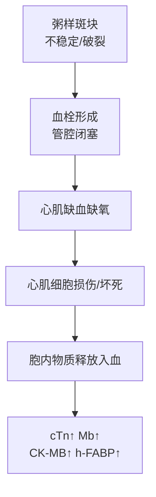
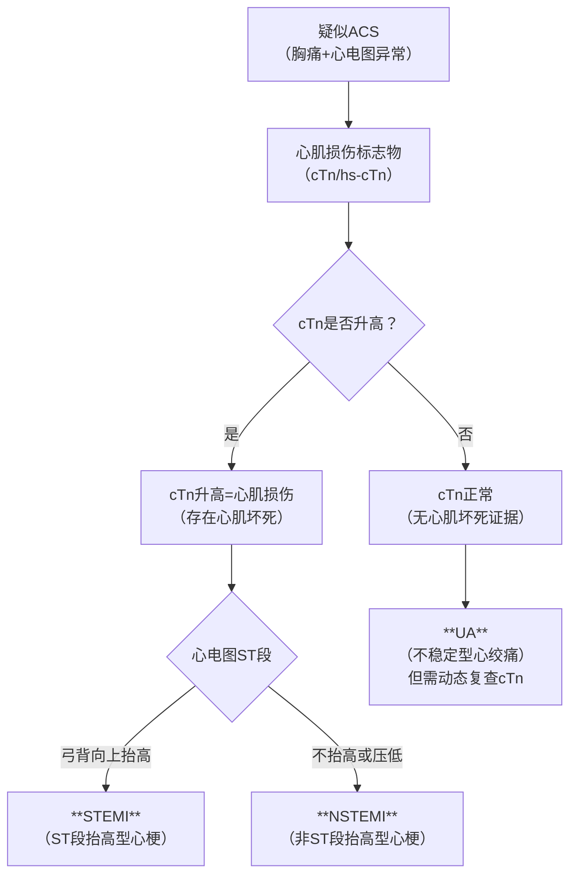
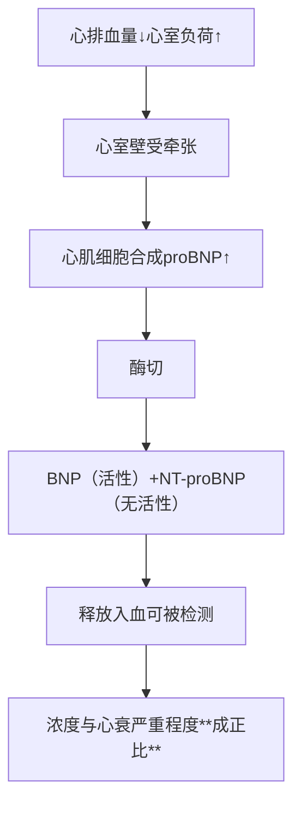
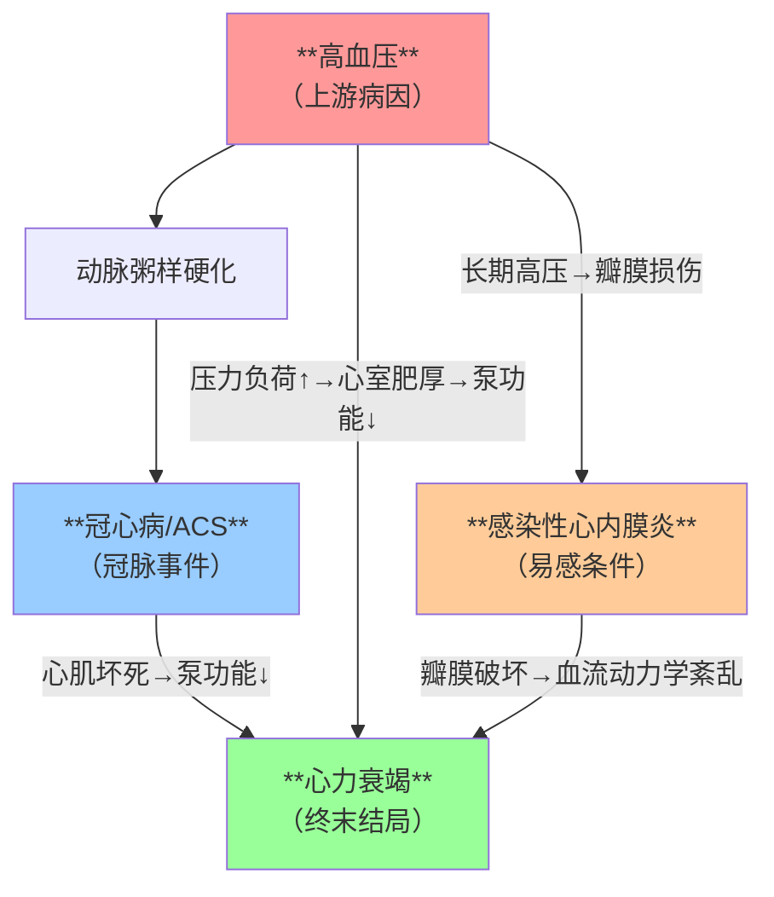

> **解析摘要**
> - **章节主题**：心血管疾病（冠心病/ACS、高血压、心力衰竭、感染性心内膜炎）的实验室诊断
> - **主导模板**：模板1（完整疾病单元）× 4个疾病 + 模板3（急症处理）融入ACS部分
> - **⭐重点数量**：冠心病/ACS ⭐⭐⭐｜心力衰竭 ⭐⭐⭐｜高血压 ⭐⭐｜感染性心内膜炎 ⭐⭐
> - **口诀数量**：3个
> - **预估总阅读时间**：约 25-30 分钟
***
# 第一章 冠状动脉粥样硬化性心脏病（CHD）与急性冠脉综合征（ACS）
> **重点等级**：⭐⭐⭐ | **阅读时间**：约 10 min
## 1. 概述与定义
📎 PPT 第1-3页（疾病现状背景）
**定义**：冠状动脉发生粥样硬化引起管腔狭窄或闭塞，导致心肌缺血、缺氧或坏死而引起的心脏病。
> 📌 **人话解读**：心脏自己的供血血管（冠脉）堵了→心肌吃不饱饭→干活没力气→严重时心肌饿死（梗死）。
**WHO分型**（5型记牢，考名解/多选题）：

| 分型 | 特点 |
|------|------|
| 无症状心肌缺血（隐匿性） | 有缺血证据但无胸痛 |
| 心绞痛 | 发作性胸痛，无心肌坏死 |
| **心肌梗死** | **心肌坏死，cTn升高** |
| 缺血性心力衰竭 | 长期缺血→心功能下降 |
| 猝死 | 最严重结局 |
## 2. 病因与发病机制
📎 PPT 第4-5页
### 2.1 危险因素

| 不可改变 | 可改变（考试重点） |
|----------|-------------------|
| 性别（男＞女） | **三高**：高血压、高血糖、高血脂 |
| 年龄 | 吸烟、饮酒 |
| 家族史 | 肥胖、代谢综合征 |
### 2.2 病理生理——机制→指标的推导（必考！）
**核心链条**：
冠脉粥样斑块破裂→血小板聚集+血栓形成→血管闭塞→心肌缺血→**心肌细胞损伤/坏死**→细胞内的标志物释放入血

> 📌 **请特别注意**：为什么心肌损伤标志物会升高？→ **心肌细胞膜完整性被破坏**，原本在细胞内的蛋白质（cTn、CK-MB等）"漏"到血液中。**漏得越多→血中浓度越高→损伤越严重**。这就是实验室诊断的底层逻辑。
## 3. 临床表现
📎 PPT 第6页

| 方面 | 特征 | 机制钩子 |
|------|------|----------|
| **症状** | **胸骨后压榨性疼痛**，可放射至左肩/左臂 | 心肌缺血→酸性代谢产物刺激神经末梢 |
| 伴随 | 大汗淋漓、恶心、呼吸困难 | 交感神经兴奋+心输出量下降→肺淤血 |
| **体征** | 心率增快、第一心音减弱、血压下降 | 心肌收缩力减弱→泵血减少 |
> [!WARNING] ⚠️ **注意**：老年人和糖尿病患者心梗时可能**无典型胸痛**（"无痛性心梗"），仅表现为气促、乏力——容易被漏诊！此时**检验指标尤其重要**。
## 4. 辅助检查——【实验诊断学核心，必考】
📎 PPT 第7-12页
### 4.1 四大心肌损伤标志物横向对比

| 标志物 | 分子特点 | 心肌特异性 | 升高时间 | 峰值时间 | 恢复时间 | 临床角色 |
|--------|----------|-----------|---------|---------|---------|----------|
| **cTn（I/T）** | 心肌收缩调节蛋白 | **极高** | 3-6h | 10-24h | 7-14天 | **首选+金标准** |
| **hs-cTn** | 高敏方法检测cTn | 极高 | 1-3h（更早） | — | — | **早期诊断** |
| **Mb（肌红蛋白）** | 携氧蛋白，分子量小 | **低**（骨骼肌也有） | 1-2h | 6-9h | 24h | **早期排除**（阴性预测值高） |
| **CK-MB** | 肌酸激酶同工酶 | 较高（15-25%在心肌） | 4-6h | 12-24h | 48-72h | cTn不可用时的**替代** |
| **h-FABP** | 心型脂肪酸结合蛋白 | **高**（心脏浓度是骨骼肌2-10倍） | 1-3h | 6-8h | 24h | **早期排除+再梗死监测** |
> 💡 **记住几个关键结论**：
> 1. **最特异** → cTn（考试最爱问）
> 2. **最早升高** → Mb 和 h-FABP（胸痛1-3h就升高）
> 3. **早期排除价值最大** → Mb（阴性预测值高，正常基本可排除心梗）
> 4. **监测再梗死** → Mb 和 h-FABP（恢复快，再次升高提示二次梗死；cTn恢复慢，再梗死时还在高位，看不出二次升高）
**cTn为什么会恢复那么慢？**
> 📌 cTn是心肌肌原纤维的结构蛋白，心肌细胞坏死后，这些蛋白从崩解的肌原纤维中持续缓慢释放，加上肾脏清除慢，所以血中能维持高值7-14天。
### 4.2 其他辅助检查
📎 PPT 第13-15页
- **BNP/NT-proBNP**：→ 详见心衰章节，ACS中用于**预测死亡/再发风险**
- **hs-CRP**：炎症指标，**预测ACS风险**（越高→斑块越不稳定）
- **心电图**：ST段抬高（弓背向上型）→ STEMI；不抬高→ NSTEMI/UA
- **冠脉造影**：**金标准**（直接看狭窄部位和程度）
## 5. 诊断与鉴别诊断
📎 PPT 第13页+病例页
### 5.1 ACS三大类型的诊断树

> 📌 **请特别注意**：cTn**不升高**是UA和心梗最关键的鉴别点。但UA患者症状发作时cTn可正常，需**动态监测**（3-6h复查），如果后期升高→说明进展为NSTEMI。
### 5.2 本课件病例的逆向推导演示（必读）
📎 PPT 第4页病例 + 第14页结果
> **病例**：男，65岁，胸痛2周（间歇），5小时前加重呈压榨样+大汗+气促。既往高血压10年，吸烟20年。查体：BP 160/110，HR 113，R 30，双肺湿啰音。
> **心电图**：V1-V4 ST段抬高 → 提示**前壁**心肌梗死（左前降支供血区）
> **冠脉CTA**：左前降支近段狭窄＞95%
> **最终诊断**：急性ST段抬高型心肌梗死（STEMI）
**推导逻辑拆解**：
1. 症状（压榨性胸痛+大汗）+ 危险因素（高龄+高血压+吸烟）→ **高度怀疑ACS**
2. 心电图V1-V4 ST段抬高 → **定位到前壁**，高度提示STEMI
3. 心肌标志物（课件未给具体数值，但按照诊断流程应检测cTn）→ 确诊心肌坏死
4. 冠脉CTA直接看到了**＞95%狭窄** → 确认病因
## 6. 治疗
📎 PPT 第13页（风险评估后干预）

| 治疗方向 | 具体措施 | 关键注意事项 |
|----------|----------|-------------|
| 再灌注治疗（STEMI） | PCI（冠脉介入）或溶栓 | **时间就是心肌**，争分夺秒 |
| 抗血小板 | 阿司匹林+氯吡格雷/替格瑞洛 | 双抗是基石 |
| 抗凝 | 肝素 | 防止血栓进展 |
| 调脂稳定斑块 | 他汀类 | 无论血脂水平如何，均应使用 |
| 风险评估 | Framingham评分/ASCVD评分 | **早评估、早干预** |
## 7. 本章小结
📝 核心要点（Take-Home Messages）
- **胸痛+危险因素→首先想到ACS**。
- **cTn是目前最特异敏感的心肌损伤标志物，是ACS诊断首选**。
- Mb/h-FABP升高早（1-3h），**早期排除价值大**，但特异性差。
- STEMI vs NSTEMI vs UA：**看心电图ST段 + cTn是否升高**（见上面的诊断树，这是核心逻辑！）。
- **早评估、早干预**是降低死亡率的关键。
***
# 第二章 高血压（Hypertension）
> **重点等级**：⭐⭐ | **阅读时间**：约 5 min
## 1. 概述与定义
📎 PPT 第15页
**定义**：以体循环动脉压升高为主要特征，可伴有心、脑、肾等功能或器质性损伤的临床综合征。
**诊断标准**：收缩压 ≥ 140 mmHg **和/或** 舒张压 ≥ 90 mmHg。
> 📌 **人话解读**：血压是血液对血管壁的侧压力。压力太高→血管内皮受损→加速动脉粥样硬化→心梗/脑卒中的"上游推手"。所以控制血压就是保护全身血管。
## 2. 分类
📎 PPT 第15-16页

| 类型 | 占比 | 病因 |
|------|------|------|
| **原发性高血压** | 绝大多数（＞95%） | 遗传+环境（高钠、低钾、肥胖、饮酒、吸烟） |
| **继发性高血压** | 约2.1%（住院患者） | 有明确病因：肾实质疾病、肾动脉狭窄、**原发性醛固酮增多症**、**皮质醇增多症**、嗜铬细胞瘤 |
> [!NOTE] 📌 **请注意**：继发性高血压虽然占比小，但**可以治愈**（手术切除肾上腺腺瘤等）。所以对**年轻、难治性、突发性高血压**要想到筛查继发性病因。
## 3. 为什么高血压要分级/分层？——认识实验室检查的意义
📎 PPT 第17页
**分级**（按血压数值）：1级（140-159/90-99）、2级（160-179/100-109）、3级（≥180/≥110）
**分层**（按危险因素+靶器官损害）：低危、中危、高危、极高危
> **分层决定治疗强度**。不是所有高血压一上来就用药，低危可以先生活方式干预；极高危需要**立即启动药物治疗+强化降压**。
**需要关注的实验室检查项目**：

| 检查方向 | 具体项目 | 目的 |
|----------|----------|------|
| 常规靶器官评估 | 尿常规、肾功能（肌酐、eGFR） | 看肾脏是否受损 |
| 代谢筛查 | 血糖、血脂 | 合并代谢异常→风险叠加 |
| 继发性筛查 | 血醛固酮/肾素比值（ARR）、皮质醇节律、儿茶酚胺 | 排除继发性病因 |
| 心血管风险 | hs-CRP、BNP | 预测心血管事件 |
> 📌 **关键考点**：课件中"强化降压可使心脑血管事件下降33%，卒中下降34%”——**记住这个数据**，证明降压治疗的获益。
## 4. 本章小结
📝 核心要点
- 高血压诊断标准：**SBP≥140 或 DBP≥90**。
- **原发性占绝大多数，但继发性可治愈**，对特定人群（年轻、难治性、突发）要筛查。
- 分级的目的是**决定用药强度**；分层的目的是**评估整体风险**。
- 实验室检查的意义：**筛查病因（继发性）+ 评估靶器官损害（心、脑、肾）+ 风险分层**。
***
# 第三章 心力衰竭（Heart Failure，HF）
> **重点等级**：⭐⭐⭐ | **阅读时间**：约 8 min
## 1. 概述与定义
📎 PPT 第20页
**定义**：心脏结构或功能异常导致泵血能力下降，无法满足身体代谢需求的一种临床综合征。
**核心病理环节**：心室充盈和/或射血功能受损→心排血量不足→**肺/体循环淤血**+**组织灌注不足**。
> 📌 **人话解读**：心脏是水泵。水泵坏了→要么打出去的血不够（前向衰竭），要么血淤在泵前面回不去（后向衰竭）→肺里淤血（左心衰→呼吸困难）或身体水肿（右心衰→下肢水肿、颈静脉怒张）。
**常见诱因**（考多选题）：缺血（心梗）、感染、心律失常、输液过快过量、情绪激动。
## 2. 病理生理→BNP的推导（实验诊断学核心考点！）
📎 PPT 第21-22页
**机制链条**：
心排血量下降→心脏壁（心室肌）受到过度牵张→心肌细胞被"拉伸"→心肌细胞合成并释放**proBNP**→proBNP被剪切为有活性的**BNP**和无活性的**NT-proBNP**→释放入血→**血中浓度反映心室壁张力大小→反映心衰严重程度**

> 📌 **核心考点解读**：BNP/NT-proBNP之所以是心衰的"里程碑"标志物，是因为它不是心肌坏死的标志，而是**心室壁应力的标志**——只要是心室被"撑"了（容量负荷过重、压力负荷过重），就会升高。因此**诊断心衰的特异性很高**。
## 3. BNP vs NT-proBNP 对比
📎 PPT 第23页

| 对比项  | BNP              | NT-proBNP        |
| ---- | ---------------- | ---------------- |
| 来源   | 同                | 同（均来自proBNP酶切）   |
| 生物活性 | **有**（扩血管、利尿、降压） | **无**            |
| 半衰期  | 短（约20min）        | 长（约60-120min）    |
| 影响因素 | 受肾功能影响较小         | **受肾功能影响大**（肾清除） |
| 临床应用 | 急性心衰诊断           | 同样可用，尤其在肾衰患者需校正  |
> 💡 **记忆辅助**：BNP活性强但"命短"，NT-proBNP"命长"但没活性——两者**临床应用价值相当**，但解读时NT-proBNP要更注意肾功能。
## 4. BNP/NT-proBNP的四大临床应用（考试必考！）
📎 PPT 第24页

| 应用场景 | 具体意义 |
|----------|----------|
| **① 心衰诊断** | 水平升高与心衰严重程度**成正比**（越高→越重） |
| **② 呼吸困难鉴别** | 心源性 vs 肺源性——**BNP升高→心源性**（关键鉴别点！） |
| **③ 预后评估** | 治疗后**下降≥50%** → 预后好；持续高值→预后差 |
| **④ ACS风险分层** | BNP是心衰死亡率**独立预测因子** |
> 📌 **肺源性呼吸困难 vs 心源性呼吸困难**：两者都表现为气促，但前者BNP正常（或轻度升高，因为缺氧也可刺激少量释放），后者**显著升高**——这是实验室诊断帮助临床鉴别的最佳范例。
## 5. 心衰的治疗监测（课件隐含内容，补充说明）
📖 教材补充：治疗后BNP下降提示治疗有效（利尿减轻容量负荷→心室壁牵张减轻→分泌减少）。**治疗后BNP不降或反升→提示预后差**。
## 6. 本章小结
📝 核心要点
- 心衰的本质：**泵功能下降→淤血+灌注不足**。
- BNP/NT-proBNP是心衰**首选+指南推荐级别最高**的标志物。
- 升高的原因：**心室壁受牵张**（不是心肌坏死！和cTn机制完全不同）。
- 临床应用四件套：**诊断+鉴别（心源vs肺源）+预后+风险分层**。
- 记住"**治疗后下降50%**"这条线——预后好的标志。
***
# 第四章 感染性心内膜炎（Infective Endocarditis，IE）
> **重点等级**：⭐⭐ | **阅读时间**：约 5 min
## 1. 概述与定义
📎 PPT 第26页
**定义**：心脏内膜表面的微生物感染，伴**赘生物形成**。瓣膜最常受累。
> 📌 **人话解读**：细菌跑到血液里→"定居"在心脏瓣膜上→形成一团细菌+血小板的"疙瘩"（赘生物）→瓣膜被破坏（关闭不全/狭窄）+赘生物脱落（栓塞）。
## 2. 分型
📎 PPT 第27页

| 分型 | 临床特点 | 常见病原菌 |
|------|----------|----------|
| **急性IE** | 起病急、进展快、毒血症状重 | **金黄色葡萄球菌** |
| **亚急性IE** | 起病隐匿、病程长（数周-数月） | **草绿色链球菌**（最常见） |
> 💡 **记忆辅助**："**金急绿亚**"——金葡菌→急性，草绿链→亚急性。这是微生物学+临床的黄金配对。
## 3. 实验室检测——【实验诊断学核心】
📎 PPT 第28-30页
### 3.1 血培养——确诊IE的最重要依据

| 类型 | 采血方案 | 关键要点 |
|------|----------|----------|
| 亚急性 | 第一日间隔1h采1次，共3次；次日若阴性，重复3次 | 因为菌量少，需多次送检 |
| 急性 | 入院后3h内，每隔1h采1次，共3次 | 进展快，需尽快确诊 |
| **通用原则** | 每次采集**双瓶双套**（需氧+厌氧） | 提高阳性率，区分污染菌 |
> 📌 **请特别注意**：血培养是**确诊IE的金标准**，但**阴性不能完全排除IE**（已用抗生素、特殊病原体等）。需要结合临床+超声心动图综合判断。
### 3.2 其他实验室检查

| 检查 | 意义 |
|------|------|
| **血常规** | 白细胞↑、中性粒细胞↑（感染征象） |
| **尿常规** | 可出现血尿、蛋白尿（免疫复合物沉积→肾小球肾炎） |
| **尿培养** | 排除泌尿系统感染作为菌血症来源 |
### 3.3 诊断标准（Duke标准，略）
📎 PPT 第31页
> 详见原课件P31（Duke诊断标准主要依据：**血培养阳性+超声心动图发现赘生物**为核心，加临床次要标准）。
## 4. 本章小结
📝 核心要点
- IE = **心脏瓣膜赘生物+菌血症**。
- **血培养是确诊IE最重要的实验室依据**。
- 病原菌口诀：**金急绿亚**（金葡→急性，草绿链→亚急性）。
- 采血核心原则：**多部位、多次、双瓶双套**，急性快速采，亚急性间隔采。
***
# 全章终极大串联——四个疾病的关系网（必看！）

> **逻辑总结**：高血压是"上游推手"→促成动脉粥样硬化→冠脉堵了=冠心病/ACS→心肌缺血坏死=泵功能下降→心衰。同时高血压损伤瓣膜→细菌更容易"扎根"→IE。**四个疾病环环相扣，实验诊断标志物（cTn、BNP、血培养、血压数值）各司其职。**
***
# 全章记忆口诀汇总
💡 **口诀1：心肌标志物时间轴**
> "**肌红蛋白跑得快，1到2小时就出来；肌钙蛋白最特异，3到6小时慢慢起；CK-MB在中间，4到6小时才露脸。**"
> 解释：Mb/h-FABP（1-3h）→ cTn（3-6h）→ CK-MB（4-6h）。最早的是Mb，最特异的是cTn。
💡 **口诀2：心衰BNP临床四用**
> "**诊断心衰靠它高，喘憋病因把它找，治疗好坏看降多少，ACS风险它来报。**"
> 解释：分别对应①心衰诊断 ②呼吸困难鉴别（心源性vs肺源性）③预后评估（下降≥50%）④ACS风险分层。
💡 **口诀3：IE病原菌配对**
> "**金急绿亚，血培养是老大。**"
> 解释：金黄色葡萄球菌→急性IE；草绿色链球菌→亚急性IE。血培养是确诊金标准。
***
# 理解自检（全章）
> [!question] 🧠 **检验你的理解**
**Q1**：一个胸痛患者，cTn正常但Mb升高，你怎么考虑？
> 提示：Mb敏感性高但特异性低→考虑骨骼肌损伤可能，或者心梗超早期（＜3h），需动态复查cTn。
**Q2**：一个呼吸困难患者，BNP显著升高，而cTn正常，最可能是什么原因？
> 提示：肺源性呼吸困难BNP一般不高→心源性呼吸困难（心衰）可能性大。
**Q3**：疑似感染性心内膜炎患者，一次血培养阴性，是否可以完全排除IE？
> 提示：不能。需多次采血（亚急性3次×2天），且已用抗生素的患者可能假阴性。
***
📌 **最后叮嘱**：实验诊断学的核心不是死记硬背数值，而是理解"**疾病机制→标志物释放/变化→临床解读**"的逻辑链。考场上遇到病例分析，先想清楚"这个病导致了什么病理变化→这个变化会让什么物质入血→我该选什么指标来证明"，90%的题都能迎刃而解。
**祝考试顺利！** 🎯