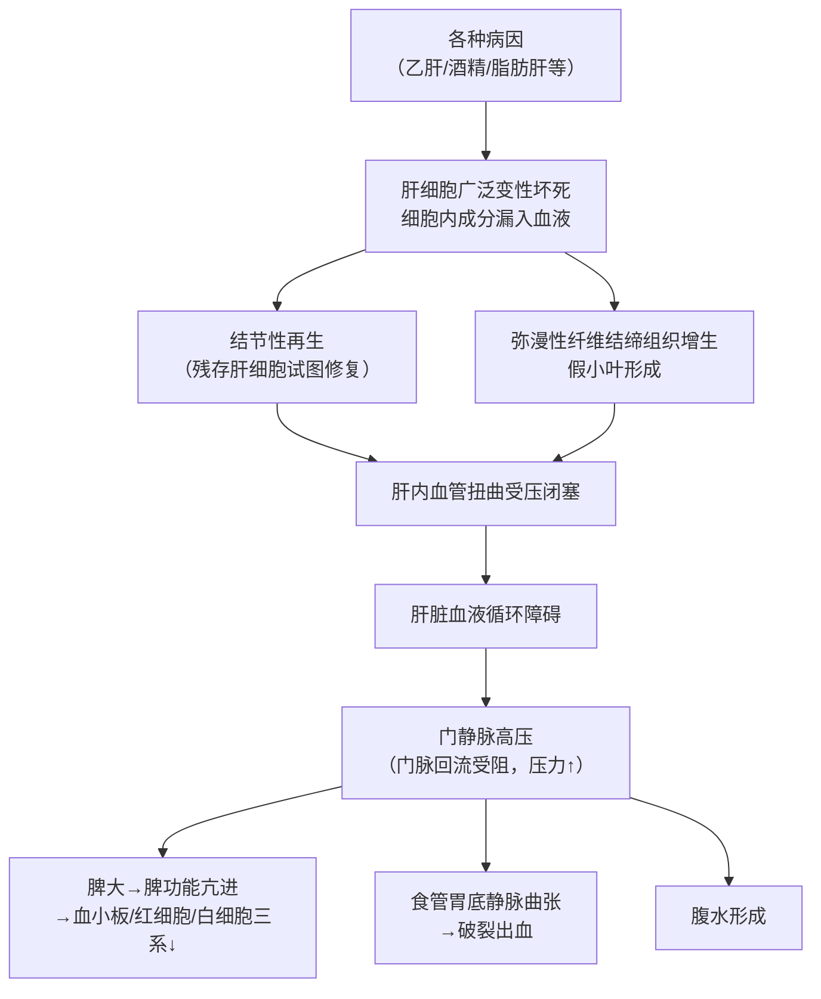
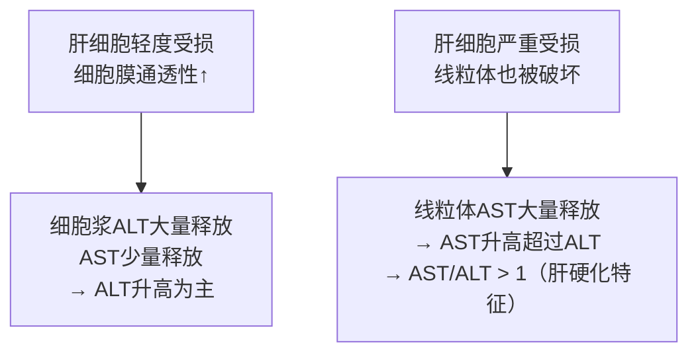
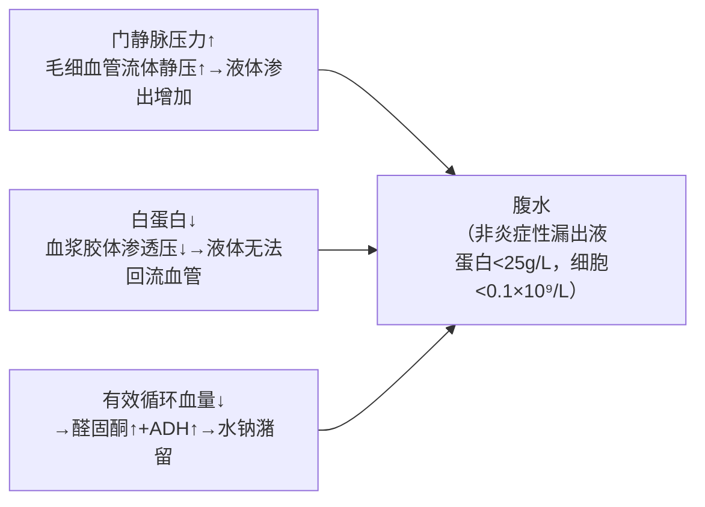
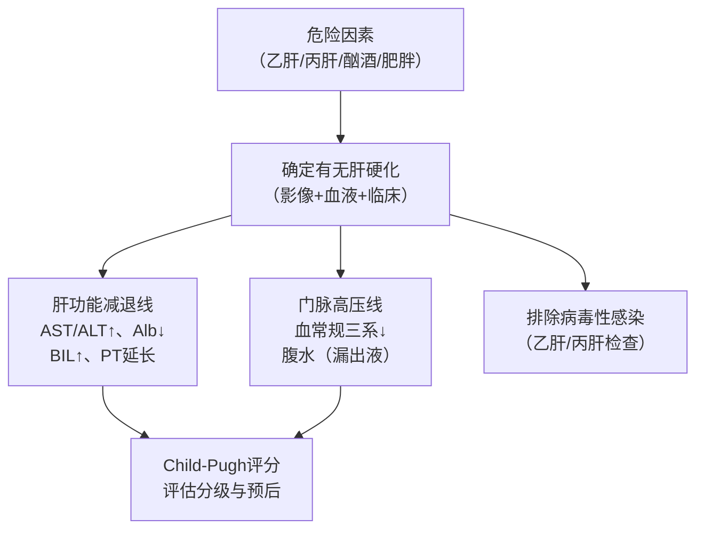
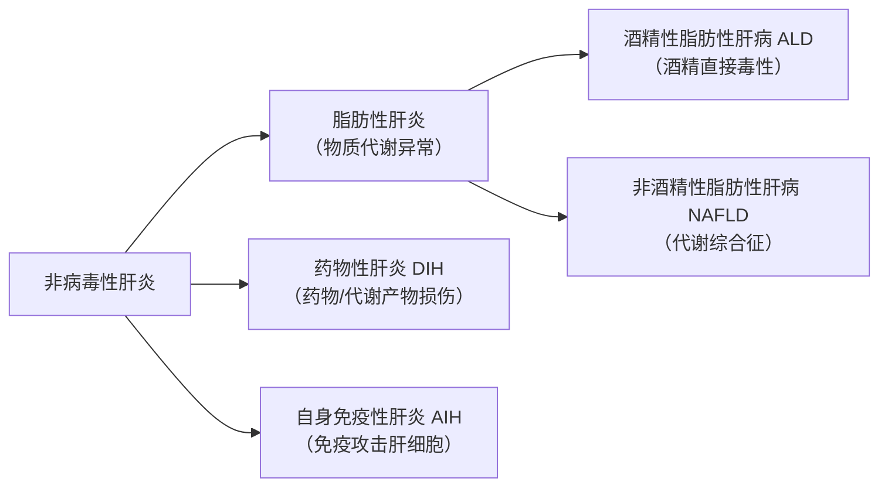
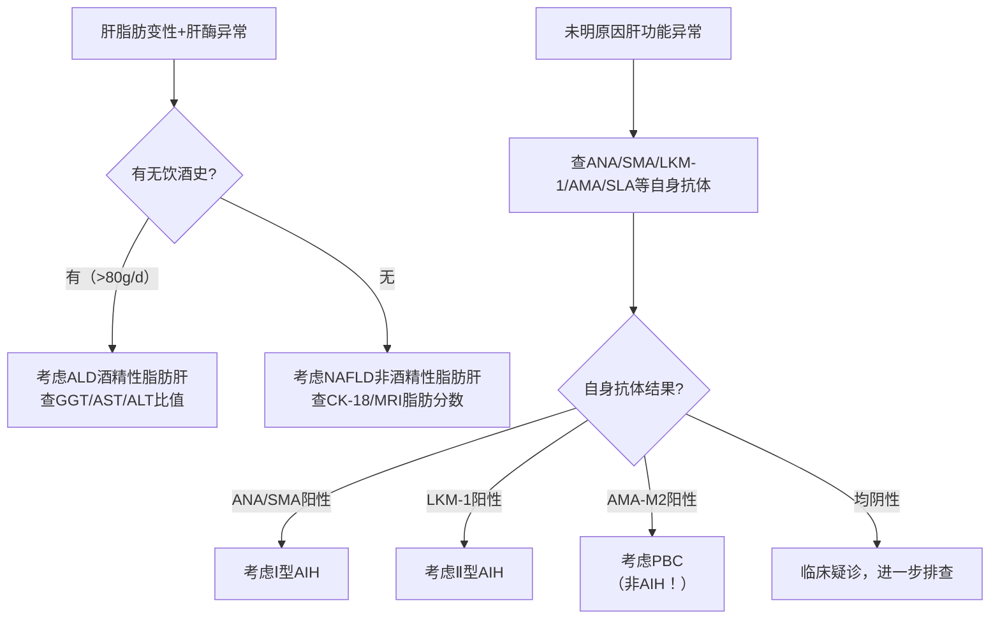
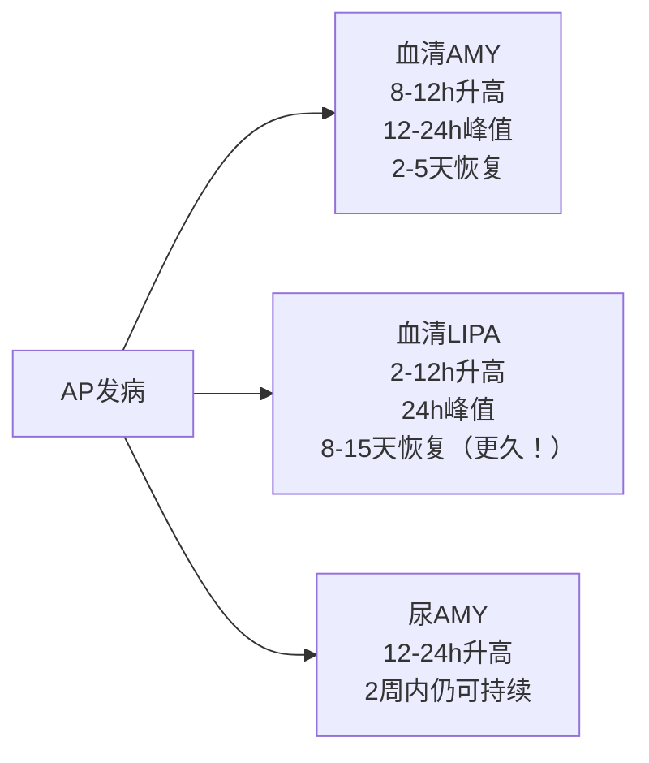
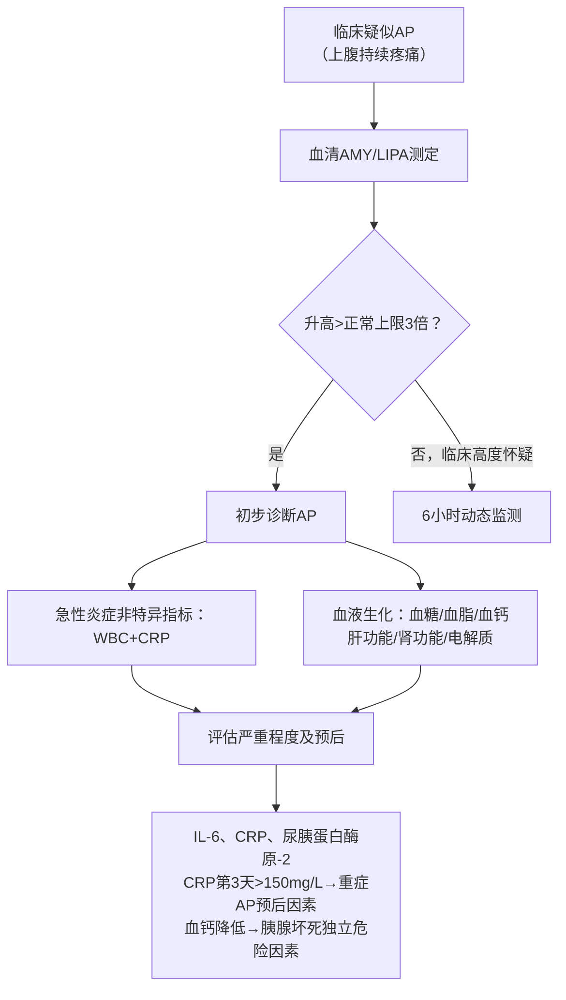
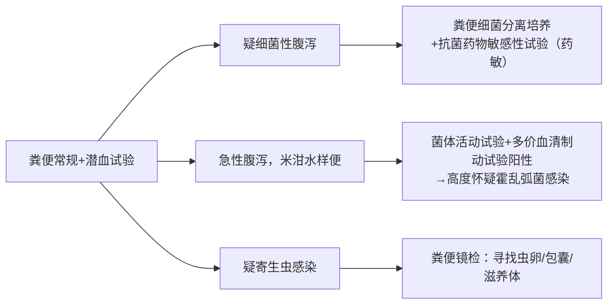

# 解析摘要
**章节主题**：消化系统疾病的实验室诊断（肝硬化 / 非病毒性肝炎 / 急性胰腺炎 / 慢性胰腺炎 / 消化道出血 / 腹泻）
**选定逻辑模板**：主体采用**模板1**（完整疾病单元）；消化道出血含**模板2**元素（上/下消化道鉴别）
**重点数量**：⭐⭐⭐ 核心掌握3章（肝硬化、急性胰腺炎、消化道出血）；⭐⭐ 熟悉3章（非病毒性肝炎、慢性胰腺炎、腹泻）
**口诀数量**：3条
**预估总阅读时间**：约 95 min
***
# 第一章 消化系统疾病概述 ⭐
📎 PDF 第5-8页
消化道负责摄取、转运、消化食物，吸收营养，排泄废物。大消化腺（唾液腺+肝+胰）和小消化腺（胃腺、肠腺）分泌消化液。消化系统疾病极为常见，主要病变在胃、肠、肝、胆、胰；胃肠道癌占中国癌症相关死亡45%。
📖 **教材补充——肝脏六大功能（读懂肝硬化化验指标的基础）**：

| 肝脏功能 | 具体内容 | 损伤后后果 |
|---------|---------|----------|
| 代谢功能 | 合成血浆蛋白、产生尿素、调节血糖血脂 | 白蛋白↓、凝血因子↓ |
| 胆汁生成排泄 | 分泌胆汁→乳化脂肪→促脂溶性维生素吸收 | 黄疸、脂肪吸收障碍 |
| 解毒功能 | 转化药物、酒精、毒素→无毒形式排出 | 毒素蓄积（如肝性脑病的氨中毒）|
| 凝血与免疫 | 合成凝血因子；库普弗细胞（肝脏的"巨噬细胞"）吞噬防御 | 出血倾向、免疫下降 |
| 储存功能 | 糖原、维生素、铁、铜储存 | 营养缺乏 |
| 血液调节 | 储血、调节血容量、应急供血 | 循环调节异常 |
***
# 第二章 肝硬化（Liver Cirrhosis） ⭐⭐⭐
📎 PDF 第9-30页（整体对应）
**疾病速览**：肝细胞弥漫坏死→纤维化+假小叶→门静脉高压+肝功能衰竭的终末病理阶段 | 重点等级：⭐⭐⭐ | 阅读时间：约 30 min
## 1. 概述与定义
📎 PDF 第11页
**定义**：以肝脏弥漫性**纤维化**（瘢痕组织取代正常肝细胞）、**假小叶形成**（正常肝小叶结构被破坏重排）、肝内外血管增殖为特征的病理阶段。失代偿期以**门静脉高压**和**肝功能严重损伤**为核心特征。
**常见病因**：慢性乙型肝炎（中国最多见）、慢性酒精中毒、非酒精性脂肪性肝病（三大主因）。
## 2. 病因与病理机制
📎 PDF 第12-13页
**2.1 病因**
病毒性肝炎、慢性酒精中毒、胆汁淤积（免疫性）、循环障碍、药物/化学毒物、营养障碍、遗传代谢障碍、免疫紊乱、血吸虫病及病因不明等。
**2.2 病理生理机制链**（理解这条链，所有化验指标就都说得通了）

📖 **教材补充**：**门静脉高压**是指收集胃肠道血液的门静脉因回流受阻而压力升高（正常<12mmHg）。门脉高压→血液积聚在脾脏→脾功能亢进（脾脏过度破坏血细胞）→血常规三系减少。这就是为什么失代偿期肝硬化患者WBC/RBC/PLT都低。
## 3. 临床表现与分期
📎 PDF 第13页

| 分期 | 特征 | 实验室表现 |
|-----|-----|---------|
| 代偿期 | 症状较轻，缺乏特异性 | 肝功能正常或**轻度**异常 |
| 失代偿期 | 症状明显，多系统受损 | 肝功能减退+门脉高压症显著 |
**失代偿期主要并发症**（考试高频考点）：上消化道出血、肝性脑病、感染（脓毒症）、肝肾综合征、肝癌。
## 4. 辅助检查（实验室）
📎 PDF 第14-21页
### 4.1 肝功能试验 ⭐⭐⭐
**【核心理解】为什么肝细胞损伤后血液里酶会升高？**
正常情况下，ALT（谷丙转氨酶）主要存在于**肝细胞的细胞浆**（细胞质）中；AST（谷草转氨酶）则同时存在于细胞浆（少量）和**线粒体**（大量）中。肝细胞膜完整时，酶几乎不会漏入血液。一旦肝细胞受损破膜→酶释放入血→血清酶活性升高。

**肝功能试验全面解析**：

| 检验项目 | 正常作用（通俗说）| 受损时为什么异常 | 肝硬化典型变化 | 临床角色 |
|---------|--------------|----------------|-------------|---------|
| **ALT**（谷丙转氨酶）| 肝细胞质内的转氨基酶，参与氨基酸代谢 | 肝细胞破膜→ALT漏入血 | 升高（肝硬化时不一定极高，因肝细胞已大量死亡）| 肝细胞受损标志 |
| **AST**（谷草转氨酶）| 线粒体+细胞质内的转氨基酶 | 线粒体破坏→AST大量释放 | **AST升高程度超过ALT，AST/ALT > 1.44**（硬化特征）| 肝细胞严重受损标志 |
| **TP/Alb**（总蛋白/白蛋白）| 白蛋白由肝细胞合成，维持血液胶体渗透压（把水留在血管里）| 肝细胞↓→合成白蛋白能力↓；肝病→免疫激活→球蛋白（抗体）↑ | **白蛋白↓、球蛋白↑、A/G比值倒置**（正常1.5-2.5）；蛋白电泳见β-γ桥 | 评估肝合成功能 |
| **BIL**（胆红素）| 肝细胞负责"摄取→结合→排泄"胆红素（红细胞分解的产物）| 三个环节任一受损→胆红素在血中堆积 | 总胆红素↑（直接+间接均可升高）| 判断黄疸类型和程度 |
| **ChE**（胆碱酯酶）| 肝细胞合成的酶，反映肝脏的"储备能力" | 肝细胞↓→合成ChE↓ | **活性降低**（比白蛋白更灵敏地反映肝储备）| 评估肝储备功能 |
| **GGT**（γ-谷氨酰转肽酶）| 肝细胞和胆道上皮合成，参与氨基酸转运 | 胆道梗阻→GGT诱导合成↑；酒精→诱导肝细胞合成GGT↑ | 胆道梗阻或酒精时显著升高 | 胆道梗阻+酒精性肝病指标 |
| **TBA**（总胆汁酸）| 肝细胞合成→排入胆汁→肠道→门脉重吸收（肠肝循环）| 肝细胞损伤+胆道梗阻+门脉系统分流（血液绕过肝脏）→TBA蓄积 | **肝硬化时TBA升高**（三重原因）| 反映肝-肠-胆综合代谢 |
| **ALP**（碱性磷酸酶）| 胆道上皮产生最多 | 胆道梗阻→ALP被反流诱导合成↑ | 胆道梗阻时升高 | 胆道梗阻指标 |
> [!NOTE] 📌 请注意
> **ALT和AST哪个更特异？** ALT对肝细胞损伤更特异（骨骼肌/心肌也含AST但几乎不含ALT）。肝硬化时ALT不一定极高（因为大量肝细胞已经死完了，没剩多少细胞可以释放ALT）；反而AST因线粒体持续受损而更高。记住：**硬化时看AST超过ALT，急性肝炎时看ALT极度升高（可达数千U/L）**。
### 4.2 肝纤维化试验
📎 PDF 第18页
**【核心理解】为什么要检测胶原相关指标？** 肝纤维化的本质是大量**胶原纤维**（瘢痕组织主要成分）在肝脏沉积。检测胶原代谢产物和相关酶，可以判断纤维化的程度。

| 检验项目 | 通俗解释 | 临床应用 |
|---------|---------|---------|
| **P-Ⅲ-P**（Ⅲ型前胶原N端肽）| 胶原合成时被切除的"边角料"→代表当前胶原合成速率 | **肝纤维化和早期肝硬化的早期诊断**（最早升高）|
| **C-Ⅳ**（Ⅳ型胶原）| 基底膜成分，肝纤维化早期沉积在肝血窦壁 | 肝纤维化早期诊断 |
| **HA**（透明质酸）| 星状细胞（激活的肝纤维母细胞）合成增加；同时肝血窦内皮受损→降解HA减少→HA积聚 | **反映活动性肝纤维化**，是肝纤维化四项中**最灵敏**的指标 |
| **LN**（层黏连蛋白）| 内皮细胞合成，与胶原共同构成基底膜 | 对肝纤维化、**门脉高压**诊断敏感 |
| **MAO**（单胺氧化酶）| 肝线粒体合成，参与胶原形成 | 肝硬化及伴肝癌时升高，但**早期肝硬化不敏感** |
| **PH**（脯氨酰羟化酶）| 胶原纤维合成必需的酶 | 肝硬化、原发性肝癌、慢性中重度肝炎时升高 |
### 4.3 免疫功能检查
📎 PDF 第14页
- 细胞免疫：T细胞数低于正常
- 体液免疫：**IgG增高最为显著**（肝脏清除免疫球蛋白减少）
### 4.4 血常规
📎 PDF 第14页
失代偿期**三系减少**（原因：门静脉高压→脾功能亢进→脾脏大量破坏血细胞）：RBC/Hb↓（贫血）、WBC↓、PLT↓（出血倾向）。
### 4.5 尿常规
📎 PDF 第14页
失代偿期：**胆红素尿**（尿变深黄色）、尿胆原增加。
### 4.6 腹腔积液检查
📎 PDF 第19-21页
**腹水形成机制（理解=记忆为什么是漏出液）**：

**漏出液 vs 渗出液鉴别（高频考点！）**：

| 鉴别要点      | 漏出液（肝硬化腹水）         | 渗出液（炎症/肿瘤/感染）    |
| --------- | ------------------ | ---------------- |
| 原因        | **非炎症**所致          | 炎症、肿瘤、化学/物理刺激    |
| 常见疾病（全身）  | 肝硬化、心衰、肾病综合征、低蛋白血症 | （所有炎症）细菌感染、结核、癌症 |
| 外观        | 淡黄，浆液性             | 血性、脓性、乳糜性等       |
| 透明度       | 透明或微混              | 多混浊              |
| 比重        | **< 1.015**        | **> 1.018**      |
| 凝固        | 不自凝                | 能自凝              |
| Rivalta试验 | **阴性**             | **阳性**           |
| **蛋白定量**  | **< 25 g/L**       | **> 30 g/L**高蛋白  |
| 葡萄糖       | 与血糖相近              | 常低于血糖水平          |
| **细胞计数**  | **< 0.1×10⁹/L**    | **> 0.5×10⁹/L**  |
| 细胞分类      | **淋巴细胞**/间皮细胞为主    | **中性粒细胞**或淋巴细胞为主 |
| 病原学       | 阴性                 | 可找到病原体           |
> [!attention] 📌 请注意
> 肝硬化腹水本质是**漏出液**。但若并发**自发性细菌性腹膜炎（SBP，肠道细菌移位感染腹水）**，腹水变成渗出液——白细胞>0.5×10⁹/L，中性粒细胞比例>25%即可诊断SBP。这是失代偿期最危险的并发症之一。
## 5. 诊断与鉴别诊断
📎 PDF 第26-27页
### 5.1 代偿期肝硬化诊断标准
无组织学/内镜/影像学时，满足以下4条中**2条**即可：
① PLT < 100×10⁹/L（无其他原因解释）
② ALB < 35 g/L（排除营养不良或肾脏疾病等）
③ **INR（国际标准化比值，反映凝血功能）> 1.3**，或PT延长（停用溶栓或抗凝药7天以上）
④ **APRI（AST/PLT比率指数）> 2**
📖 **教材补充**：**APRI = (AST实测值/AST正常上限) ÷ (PLT×10⁹/L ÷ 100)**。该指数同时反映肝细胞损伤（AST↑）和脾功能亢进（PLT↓），两者均指向肝硬化。数值越高，纤维化越严重。
### 5.2 失代偿期肝硬化诊断
具备肝硬化诊断依据，且出现门静脉高压相关并发症：腹水、食管胃静脉曲张破裂出血、脓毒症、肝性脑病、肝肾综合征等。
### 5.3 Child-Pugh肝功能分级（评估预后）
📎 PDF 第28页

| 观察指标        | 1分     | 2分               | 3分   |
| ----------- | ------ | ---------------- | ---- |
| 肝性脑病（期）     | 无      | Ⅰ-Ⅱ期             | Ⅲ-Ⅳ期 |
| 腹腔积液        | 无      | 少量               | 大量   |
| 胆红素（μmol/L） | < 34   | 34-51            | > 51 |
| 白蛋白（g/L）    | > 35   | 28-35            | < 28 |
| PT（较对照延长秒）  | < 4    | 4-6              | > 6  |
| 分级          | 评分     | 1-2年存活率          |      |
| A级          | 5-6分   | 100-85%          |      |
| B级          | 7-9分   | 80-60%           |      |
| C级          | 10-15分 | **45-35%**（预后最差） |      |
> [!WARNING] ⚠️ 常见疑问
> Q：Child-Pugh评分为什么要把腹水、肝性脑病这些临床表现加进去？
> A：单纯看化验数字不够全面。腹水和肝性脑病是门脉高压+肝功能双重衰竭的综合体现，加入临床指标使预后评估更精准。A级代偿尚可，C级代表肝脏已严重失代偿。
## 6. 实验诊断策略
📎 PDF 第28页

## 7. 新型血清标志物 ⭐
📎 PDF 第29-30页
- **GP73（高尔基体糖蛋白73）**：主要由胆管上皮细胞表达（肝细胞内几乎不表达）。血清GP73水平与肝纤维化严重程度相关，随纤维化分期递进而升高。
- **CHI3L1（壳多糖酶3样蛋白1）**：在肝脏高度特异性表达。在显著纤维化和肝硬化中诊断性能优于HA、LN等现有标志物。
## 8. 本章小结
> [!SUMMARY] 📝 核心要点（Take-Home Messages）
> 1. 肝硬化本质：肝细胞坏死→弥漫纤维化+假小叶→门静脉高压+肝功能衰竭，**两条线并行**
> 2. **AST/ALT > 1.44**（肝硬化特征，线粒体受损）；失代偿期**A/G比值倒置**（Alb合成↓，球蛋白清除↓）
> 3. 肝功能七项：ALT/AST→细胞受损；Alb/ChE→合成/储备功能；BIL→排泄功能；GGT/ALP→胆道梗阻；TBA→综合代谢
> 4. 肝纤维化：HA最灵敏，P-Ⅲ-P最早升高，四项联合用于早期诊断
> 5. 腹水为**漏出液**（蛋白<25g/L，细胞<0.1×10⁹/L，Rivalta阴性），并发SBP时变为渗出液
> 6. Child-Pugh A级预后好，C级差；APRI>2提示代偿期肝硬化

> [!QUESTION] 🧠 检验你的理解
> Q1：一个酒精性肝硬化失代偿期患者，你预计ALT、AST、白蛋白、球蛋白、PT、血小板会怎么变化？每个变化的机制是什么？
> Q2：从实验室指标区分"肝硬化腹水（漏出液）"和"结核性腹膜炎腹水（渗出液）"，关键指标有哪些？
> Q3：APRI是什么？为什么这个指标升高提示肝硬化？

> [!TIP] 💡 记忆口诀
> **"硬化三看：AST超ALT、白低球高AG倒、腹水漏出三少征"**
> 解释：① AST/ALT > 1.44（线粒体重度受损）；② 白蛋白低、球蛋白高、A/G比值倒置；③ 腹水漏出液三少=蛋白少(<25g/L)、细胞少(<0.1×10⁹/L)、比重低(<1.015)
***
# 第三章 非病毒性肝炎 ⭐⭐⭐
📎 PDF 第31-44页（整体对应）
**疾病速览**：多种非病毒性因素（脂肪/酒精/药物/免疫）损伤肝细胞，引起肝功能受损 | 重点等级：⭐⭐⭐ | 阅读时间：约 25 min
## 1. 分类概述
📎 PDF 第32-37页

## 2. 各病实验诊断要点
### 2.1 脂肪性肝炎（Fatty Hepatitis）
📎 PDF 第33页
**定义**：肝细胞内脂肪堆积的病理状态，肝内脂肪含量高达肝重40-50%（正常<5%）。分为**酒精性**和**非酒精性**两类。
### 2.2 酒精性肝炎（AH，Alcoholic Hepatitis）
📎 PDF 第34-35页
**进展**：脂肪肝 → 肝炎 → 肝纤维化 → 肝硬化（酒精造成持续进行性损害）
**【机制】为什么GGT是酒精性肝损伤的最佳指标？**
酒精→诱导CYP2E1（细胞色素P450酶，肝微粒体中的代谢酶）表达增加→CYP2E1代谢酒精时产生大量**ROS（活性氧，自由基）** →**氧化应激**（细胞被氧化损伤）→激活信号通路→**GGT基因表达增加**→肝细胞合成更多GGT分子→血清GGT显著升高。
**实验诊断特点**（记死这三条！）：
- ALT、AST均轻度升高，**很少 > 500 U/L**（区别于急性病毒性肝炎，后者可达数千）
- **AST/ALT > 2**（核心特征！酒精损伤线粒体更重，且酒精影响维生素B6代谢→ALT合成减少）
- **GGT常显著升高（可达数十倍）**，是反映酒精性肝损伤和监测戒酒的最佳指标（戒酒后GGT下降）
**诊断思路三步走**：①判断是否存在肝病；②肝病是否与饮酒有关；③是否并发其他肝病。
### 2.3 药物性肝炎（DIH，Drug-Induced Hepatitis）
📎 PDF 第36、43页
**定义**：药物或其代谢产物引起的肝脏损害，使用某种药物后发生程度不同的肝损伤，无肝病史或有严重疾病的患者均可发生。
**R值分型（考试重点）**：R值 = (ALT实测值/ALT正常上限) ÷ (ALP实测值/ALP正常上限)

| R值 | 损伤类型 | 病理本质 |
|----|---------|---------|
| **R ≥ 5** | 肝细胞损伤型 | 以肝细胞坏死为主，ALT显著升高 |
| **2 < R < 5** | 混合型 | 肝细胞+胆道均受损 |
| **R ≤ 2** | 胆汁淤积型 | 以胆道损害为主，ALP显著升高 |
**诊断策略**：RUCAM评分+排除法（依次排除病毒性、酒精性、NAFLD、AIH、胆汁淤积性、遗传代谢性肝病后，结合用药史确诊），详见原课件流程图。
### 2.4 自身免疫性肝炎（AIH，Autoimmune Hepatitis）
📎 PDF 第37-40页
**本质**：免疫系统"认错人"，把自身肝细胞当成外来敌人攻击→肝细胞损伤+**免疫球蛋白（IgG）** 升高。
**分型**：

| 分型 | 多见人群 | 核心特征性自身抗体 |
|-----|---------|---------------|
| **Ⅰ型** | **女性**多见 | **ANA**（抗核抗体）+ **SMA**（抗平滑肌抗体）或 **SLA/LP** |
| **Ⅱ型** | **儿童**多见 | **LKM-1**（抗肝肾微粒体1型抗体）|
**自身抗体及免疫球蛋白详解**（这是AIH诊断的核心）：

| 指标 | 中文全称 | 临床意义 |
|-----|---------|---------|
| **SMA** | 抗平滑肌抗体 | Ⅰ型AIH血清学标志物；>80%患者阳性，**滴度>1:80** |
| **ANA** | 抗核抗体（针对细胞核内成分的抗体）| 70-80%AIH患者阳性；**滴度>1:40**对Ⅰ型AIH有诊断意义 |
| **LKM-1** | 抗肝肾微粒体1型抗体 | Ⅱ型AIH特异性抗体，敏感度约90% |
| **SLA/LP** | 抗可溶性肝抗原/肝胰抗原抗体 | Ⅰ型AIH**高特异性（>99%）**，敏感性低（阳性→高度提示Ⅰ型AIH）|
| **LC-1** | 抗肝细胞胞浆抗原Ⅰ型抗体 | Ⅱ型AIH特异性抗体；可作为疾病活动度和预后指标 |
| **AMA-M2** | 抗线粒体抗体M2亚型 | 原发性胆汁性**胆管炎（PBC）**的特征性抗体；胆管阻塞/肝外胆道阻塞时**阴性** |
| **IgG** | 免疫球蛋白G | AIH时**IgG升高最显著**，反映肝内炎症活动程度，治疗后可恢复正常 |
| **IgG4** | 免疫球蛋白G亚类4 | IgG4相关硬化性胆管炎的血清学诊断标准 |
> [!NOTE] 📌 请注意
> **AMA阳性≠AIH！** AMA-M2是PBC（原发性胆汁性胆管炎，自身免疫性胆道疾病）的标志，不是AIH的标志。两者都属于自身免疫性肝病，但病变部位不同（PBC主要在胆管，AIH主要在肝细胞），千万别混淆。
## 3. 非病毒性肝炎肝功能试验对比
📎 PDF 第38页

| 指标      | 酒精性（ALD）                   | 非酒精性脂肪肝（NAFLD）               | 药物性（DIH）  | 自身免疫性（AIH）                        |
| ------- | -------------------------- | ---------------------------- | --------- | --------------------------------- |
| ALT/AST | **AST/ALT > 2**，轻度升高（<500） | **ALT升高为主**；AST/ALT≥1→进展期纤维化 | 与肝损伤程度正相关 | 升高，但不精确反映炎症程度                     |
| GGT     | **显著升高（数十倍）**，戒酒监测         | 可升高                          | 可升高       | 可升高                               |
| ALP     | 可升高                        | 可升高                          | R≤2时ALP主升 | **AST/ALP>3提示AIH**；ALP急剧升高→PBC或肝癌 |
## 4. 实验诊断策略
📎 PDF 第42-44页

**脂肪肝实验诊断策略**：危险因素（饮酒史/代谢综合征）→检测脂肪变性标志物（CK-18、MRI质子密度脂肪分数）+ 肝酶学标志物→根据有无肝酶异常分层管理（异常者需排除其他肝病，评估疾病严重程度，决定是否肝活检）。
## 5. 本章小结
> [!SUMMARY] 📝 核心要点
> 1. 酒精性肝炎：**AST/ALT > 2 + GGT显著升高**，ALT/AST < 500 U/L（区别于急性病毒性肝炎）
> 2. 药物性肝炎：排除法+RUCAM评分+**R值分型**（R≥5肝细胞型，2<R<5混合型，R≤2胆汁淤积型）
> 3. AIH Ⅰ型：女性，ANA + SMA（或SLA/LP）阳性；Ⅱ型：儿童，LKM-1阳性
> 4. **AMA-M2阳性→PBC，不是AIH**；IgG升高最显著是AIH的免疫球蛋白特征
> 5. 诊断AIH：AST/ALP > 3有提示意义

> [!QUESTION] 🧠 检验你的理解
> Q1：GGT升高20倍，但AST仅升高3倍，最可能的诊断是什么？最关键的问诊内容是什么？
> Q2：AIH Ⅰ型和Ⅱ型最主要的区别（从患者特征和特异性抗体两方面回答）？
> Q3：R值=1.5提示哪种类型的药物性肝损伤？其病理本质是什么？

> [!TIP] 💡 记忆口诀
> **"酒肝AST双升高，GGT最高；自免肝看ANA-SMA，Ⅰ型女Ⅱ型小"**
> 解释：酒精性肝炎AST/ALT>2 + GGT显著升高（数十倍）；AIH Ⅰ型多见女性（ANA/SMA阳性），Ⅱ型多见儿童（LKM-1阳性）。
***
# 第四章 胰腺炎 ⭐⭐⭐（急性）/ ⭐⭐（慢性）
📎 PDF 第45-54页（整体对应）
**疾病速览**：胰酶异常激活→自身消化→局部炎症→可进展为全身多器官功能障碍 | 阅读时间：约 20 min
***
## 第一节 急性胰腺炎（AP，Acute Pancreatitis）⭐⭐⭐
### 1. 概述与定义
📎 PDF 第46页
**定义**：因胰酶（淀粉酶、脂肪酶、蛋白酶等）**异常激活**，对胰腺自身及周围器官产生消化作用，引起以**胰腺局部炎症**反应为主要特征，甚至可导致器官功能障碍的**急腹症**。
📖 **教材补充**：正常情况下，胰酶在胰腺内以无活性的"**酶原**"形式储存（例如胰蛋白酶→胰蛋白酶原），到达十二指肠后才被激活开始消化食物。急性胰腺炎时，由于胆道阻塞、酒精等各种原因导致酶原在胰腺内就被提前激活，胰腺开始"消化自己"，引发剧烈的炎症反应。
### 2. 病因
📎 PDF 第47页
**胆道疾病（中国第一位）、酒精（欧美第一位）**、过度进食、胰管阻塞、代谢障碍（高三酰甘油血症）、感染及全身炎症、十二指肠降段疾病、其他。
### 3. 实验室检查
📎 PDF 第48页
**【核心理解】酶学升高的机制**：胰腺炎→胰腺腺泡细胞被激活的胰酶破坏→细胞内大量淀粉酶（AMY）和脂肪酶（LIPA）释放→进入血液和尿液→血清/尿液酶活性升高。
**酶学时间规律（考试常考！）**：

| 检查项目 | 典型发现 | 临床角色 |
|---------|---------|---------|
| **血清AMY**（淀粉酶）| > 正常上限3倍，8-12h升高，峰值12-24h | 早期诊断，特异性较低（唾液腺炎/消化道穿孔也可升高）|
| **血清LIPA**（脂肪酶）| > 正常上限3倍，持续8-15天 | **首选标志物**，特异性高，持续时间长（就诊延迟时优先查）|
| 尿液胰蛋白酶原Ⅱ | 升高 | 辅助诊断 |
| 血常规（WBC+CRP）| WBC↑，CRP↑（C反应蛋白，急性期炎症非特异标志）| 反映炎症严重程度 |
| 血糖 | 升高（胰岛素分泌受损）| 反映胰腺功能 |
| **血钙** | **降低**（脂肪坏死→皂化反应消耗钙，即脂肪酸与钙结合形成钙皂沉积）| 反映严重程度（血钙越低越重）|
| 转氨酶/胆红素 | 可升高（胆道梗阻或肝受累）| 反映肝胆受累 |
| 肌酐/尿素 | 可升高（急性肾损伤）| 反映肾脏受累 |
> [!NOTE] 📌 请注意
> **LIPA > AMY** 的优越性：① 特异性更高（AMY在腮腺炎/消化道穿孔也可升高，LIPA几乎只来自胰腺）；② 持续时间更长（8-15天 vs 2-5天），就诊延迟时AMY已恢复但LIPA仍高。目前各指南优先推荐血清LIPA作为AP的诊断标志物。
### 4. 诊断标准
📎 PDF 第49页
满足以下**3项中2项**即可诊断AP：
① 上腹部**持续性疼痛**（常向背部放射）
② 血清淀粉酶和/或脂肪酶浓度**高于正常上限值3倍**
③ 腹部影像学检查结果符合**急性胰腺炎影像学改变**
### 5. 实验诊断策略
📎 PDF 第50页

### 6. 本章小结（急性胰腺炎）
> [!SUMMARY] 📝 核心要点
> 1. 急性胰腺炎=胰酶在胰腺内异常激活→自身消化
> 2. 诊断靠"三选二"：**腹痛 + 酶学(AMY/LIPA>3倍正常) + 影像学改变**
> 3. **LIPA比AMY更特异、持续更久**（8-15天 vs 2-5天），就诊延迟时首查LIPA
> 4. **血钙降低**是重症AP特征（皂化反应消耗钙）；血钙越低，胰腺坏死越严重
> 5. 评估严重程度：WBC、CRP（第3天>150mg/L=重症）、IL-6、尿Try-2

> [!TIP] 💡 记忆口诀
> **"胰腺炎酶学双雄：淀粉酶快（12小时峰值），脂肪酶久（15天不走）"**
> 解释：AMY升高快（12-24h峰值，2-5天恢复）；LIPA升高稍慢但持续更久（24h峰值，8-15天恢复）。诊断门槛：两者均要>正常上限3倍。
***
## 第二节 慢性胰腺炎（CP，Chronic Pancreatitis）⭐⭐
📎 PDF 第51-53页
**定义**：多种病因引起的胰腺实质和导管的**慢性进行性炎症**，伴腺泡和胰岛萎缩、纤维化、钙化与假性囊肿。
**慢性胰腺炎五联征**（典型病征，记住即可）：**上腹痛、脂肪泻、糖尿病、胰腺钙化、胰腺囊肿**。
📖 **教材补充**：脂肪泻（大便中含有大量未消化的脂肪，外观油腻）是因为慢性胰腺炎导致脂肪酶分泌不足，脂肪无法被消化吸收；糖尿病是因为胰岛（分泌胰岛素的细胞群）被纤维组织破坏，胰岛素分泌不足。
**实验室特征**：

| 指标 | 慢性胰腺炎特征 | 与急性胰腺炎区别 |
|-----|--------------|---------------|
| 血清AMY | 轻中度升高，**尿AMY变化不显著** | 急性时AMY显著升高 |
| 血清LIPA | 轻度升高；急性发作显著升高；**后期因胰腺实质萎缩而下降** | 急性时持续高8-15天 |
| 大便 | **脂肪含量增高（脂肪泻）** | 急性无此特征 |
| 血糖/胰岛素 | 血糖升高/糖耐量异常/胰岛素水平↓ | — |
| CA19-9 | 少数患者轻度升高 | — |
> [!NOTE] 📌 请注意
> 慢性胰腺炎**晚期**，胰腺实质大量被纤维替代，残余腺泡细胞减少，AMY和LIPA的产生也减少，酶学指标**反而可能正常或降低**，此时不要误判为"好转"。
***
# 第五章 消化道出血 ⭐⭐⭐
📎 PDF 第55-65页（整体对应）
**疾病速览**：消化道病变引起出血，主要表现为呕血和/或便血，伴贫血 | 重点等级：⭐⭐⭐ | 阅读时间：约 15 min
## 1. 分类
📎 PDF 第56页
以**Treitz韧带**（屈氏韧带，十二指肠-空肠交界处标志）为界：
- **上消化道出血**：食管、胃、十二指肠、胰胆管（Treitz韧带以上）
- **下消化道出血**：空肠、回肠、大肠、直肠（Treitz韧带以下）
## 2. 诊断四步法
📎 PDF 第57页

## 3. 上消化道 vs 下消化道出血鉴别
📎 PDF 第58页

| 鉴别要点 | 上消化道出血 | 下消化道出血 |
|---------|------------|-----------|
| 出血方式 | **呕血 + 柏油样黑便** | **便血，无呕血** |
| 便血特点 | 柏油样（黑色）、稠或成形、无血块 | 暗红或鲜红、稀多不成形，大量出血时可有血块 |
| 粪便隐血 | **阳性**（转铁蛋白/血红蛋白均阳性）| 阳性 |
| **血清尿素/肌酐比值** | **> 30**（核心鉴别点！）| **≤ 30** |
| RBC/Hb | 下降 | 下降 |
| Ret（网织红细胞）| 升高（骨髓代偿增生）| 升高 |
📖 **教材补充**：**为什么尿素/肌酐比值>30提示上消化道出血？** 上消化道出血→大量血液进入胃肠道→被消化液分解→蛋白质（血红蛋白等）在肠道被吸收→氨基酸经肝脏代谢→**尿素**大量产生→血清尿素氮（BUN）显著升高→BUN/Cr比值增大（正常约10-20）。下消化道出血时，血液不经胃肠充分消化，尿素升高不明显。
## 4. 出血量估计
📎 PDF 第59页

| 临床表现 | 每日出血量（ml）|
|---------|--------------|
| 粪便隐血试验阳性（大便外观正常）| 5-10 |
| 黑粪（柏油样大便）| 50-100 |
| 呕血 | 250-500 |
| 出现全身症状（心悸/头晕）| 400-500 |
| **周围循环衰竭（休克）** | **> 1000** |
## 5. 判断出血是否停止
📎 PDF 第60页
以下为**继续出血或再出血**的实验室依据（记这5条）：
① 反复呕血或黑粪
② 周围循环衰竭经治疗后无改善或波动
③ 肠鸣音亢进
④ **Hb、RBC继续下降，Ret持续升高**
⑤ **补液和尿量足够时，血清尿素持续升高或再次升高**（说明继续有血液被消化→尿素持续产生）
## 6. 寻找出血原因的检查
📎 PDF 第61-63页

| 检查方法 | 临床角色 |
|---------|---------|
| 粪便常规+隐血 | 筛查/确认出血 |
| 血常规+Ret | 评估出血量和出血持续状态 |
| 凝血功能（PT/APTT/FIB/INR）| 判断有无凝血障碍（如肝硬化→凝血因子合成减少）|
| 肝肾功能 | 鉴别病因（如肝硬化食管静脉曲张破裂）|
| **内镜（胃镜/肠镜）** | **首选检查！** 可直接观察出血部位、活检、并止血 |
| X线钡餐 | 辅助定位 |
| 选择性动脉造影 | 出血速度>0.5ml/min时可定位 |
| 手术探查 | 最后手段 |
## 7. 本章小结
> [!SUMMARY] 📝 核心要点
> 1. 上消化道出血特征：**呕血 + 柏油样黑便 + 血清尿素/肌酐比值 > 30**
> 2. 下消化道出血：便血（暗红/鲜红），无呕血，尿素/肌酐比值 ≤ 30
> 3. 粪便隐血检测**转铁蛋白（Tf）或血红蛋白（Hb）**——两者阳性均有意义
> 4. 出血量：隐血5-10ml→黑粪50-100ml→呕血250-500ml→**休克>1000ml**
> 5. 继续出血实验室依据：**Hb/RBC持续↓ + Ret持续↑ + 补液充分后尿素仍↑**
> 6. **内镜是查明出血原因的首选检查**

> [!QUESTION] 🧠 检验你的理解
> Q1：上消化道出血为什么会导致血清尿素氮升高？请用机制解释。
> Q2：一个患者接受充分补液（血压稳定、尿量正常）后，血清尿素仍在升高，这提示什么？
> Q3：粪便隐血试验检测哪两个指标？两者有何区别？

> [!TIP] 💡 记忆口诀
> **"上消化道出血三特征：黑便呕血尿素升（>30）"**
> 解释：上消化道出血→呕血（咖啡色/鲜红）+ 柏油样黑便（血液经胃酸氧化变黑）+ 血清尿素/肌酐比值>30（蛋白被肠道消化→尿素产生增多）。
***
# 第六章 腹泻 ⭐⭐
📎 PDF 第66-72页（整体对应）
**疾病速览**：24小时内≥3次大便性状改变，分感染性和非感染性两大类 | 重点等级：⭐⭐ | 阅读时间：约 10 min
## 1. 定义与分类
📎 PDF 第67页
**定义**：24小时内3次或3次以上的大便性状改变（排便次数↑ + 粪便量/水量↑ + 粪便稀薄/含有异常成分）。
- **感染性腹泻**：各种生物性致病因子（细菌、病毒、寄生虫、真菌）引起
- **非感染性腹泻**：各种非生物性因素（饮食不当、药物、炎症性肠病等）
## 2. 实验室检查
📎 PDF 第68-69页
**常规检查**
粪便常规是最基础的首选检查：
- 外观：稀便、水样便、粘液便、血便或脓血便
- 镜检：大量红白细胞（细菌感染特征）；少量或无细胞（病毒性腹泻特征）；虫卵/包囊/滋养体（寄生虫）
- 病原学：分离培养鉴定+特异性抗原/核酸/抗体检测
血液检查——**血常规 + CRP**：鉴别感染性 vs 非感染性腹泻（细菌感染→WBC↑+CRP显著↑；病毒感染→WBC可正常或轻度↑；非感染性→WBC和CRP通常正常）。
**特殊检查**

| 检查类型 | 内容 | 适用场景 |
|---------|-----|---------|
| 免疫学检查 | 特异性抗体检测（如**肥达氏试验**检测伤寒沙门菌抗体）| 细菌感染的血清学确诊 |
| 分子诊断 | 检测病原体核酸（PCR/mNGS）| **早期快速诊断**，可同时检测多种病原体 |
📖 **教材补充**：**mNGS（宏基因组下一代测序）** 是新兴技术，可从样本中获取所有微生物DNA，同时检测已知和未知的多种病原体，精确到种水平。在疑难感染和儿童感染性腹泻中凸显优势，代表着临床病原体检测迈向"宏"时代。
## 3. 诊断策略
📎 PDF 第71页

## 4. 本章小结
> [!SUMMARY] 📝 核心要点
> 1. 腹泻定义：24h内≥3次大便性状改变（次数+性质双标准）
> 2. 最基础首选检查：**粪便常规+隐血**
> 3. 区分感染/非感染：血常规+CRP（细菌感染→WBC↑+CRP↑）
> 4. 霍乱特征：**米泔水样便**→菌体活动试验+多价血清制动试验阳性
> 5. 新型诊断：mNGS早期快速同时检测多种病原体

> [!QUESTION] 🧠 检验你的理解
> Q1：粪便常规中，哪些表现提示细菌感染性腹泻？哪些提示病毒性腹泻？
> Q2：一个患者腹泻，粪便呈米泔水样（白色稀水），应重点怀疑什么病原体？应做什么检查？
> Q3：血常规+CRP如何帮助区分感染性和非感染性腹泻？
***
# 全章总复习速查表
## 关键酶/蛋白指标汇总

| 指标 | 正常来源/位置 | 升高提示 | 关键应用场景 |
|-----|------------|---------|-----------|
| ALT（谷丙转氨酶）| 肝细胞胞浆 | 肝细胞受损（膜破裂）| 肝炎首选；NAFLD以ALT升高为主 |
| AST（谷草转氨酶）| 肝细胞线粒体+胞浆 | 肝细胞严重受损（线粒体破坏）| 肝硬化/ALD时AST/ALT>1.44（或>2）|
| GGT（γ-谷氨酰转肽酶）| 肝细胞/胆道 | 胆道梗阻/酒精诱导合成 | 酒精性肝病最灵敏；戒酒监测 |
| ALP（碱性磷酸酶）| 胆道上皮 | 胆道梗阻 | 与GGT联合→判断胆道疾病；PBC/肝癌 |
| Alb（白蛋白）| 肝细胞合成分泌 | 降低=肝合成功能下降 | 肝硬化失代偿期A/G倒置；Child-Pugh |
| ChE（胆碱酯酶）| 肝细胞合成 | 降低=肝储备功能下降 | 比Alb更灵敏的肝储备指标 |
| TBA（总胆汁酸）| 肝细胞合成→肠肝循环 | 肝细胞损伤+胆道梗阻+门脉分流 | 肝硬化综合代谢评估 |
| AMY（淀粉酶）| 胰腺腺泡细胞+唾液腺 | 急性胰腺炎（早期）；唾液腺炎 | 8-12h升高，2-5天恢复 |
| LIPA（脂肪酶）| 胰腺腺泡细胞（高度特异）| 急性胰腺炎 | 2-12h升高，**8-15天恢复（首选指标）** |
| BUN（血尿素氮）| 肝脏代谢氨基酸产生 | 上消化道出血（肠道蛋白吸收增加）/肾衰 | **BUN/Cr > 30**→上消化道出血 |
## 重要比值/临界值速记

| 诊断指标 | 关键数值 | 临床意义 |
|---------|---------|---------|
| AST/ALT | **> 1.44** | 提示肝硬化（线粒体破坏→AST大量释放）|
| AST/ALT | **> 2** | 提示酒精性肝病（ALD）|
| AST/ALP | **> 3** | 提示自身免疫性肝炎（AIH）|
| A/G比值 | 正常1.5-2.5；**倒置** | 失代偿期肝硬化（Alb↓，球蛋白↑）|
| APRI | **> 2** | 代偿期肝硬化诊断依据之一 |
| INR | **> 1.3** | 肝合成凝血因子减少；肝硬化诊断依据 |
| PLT | **< 100×10⁹/L** | 脾功能亢进/骨髓抑制 |
| 血清AMY/LIPA | **> 正常上限3倍** | 急性胰腺炎诊断标准之一 |
| 腹水蛋白 | **< 25g/L**（漏出）/ **> 30g/L**（渗出）| 腹水性质鉴别 |
| 腹水细胞数 | **< 0.1×10⁹/L**（漏出）/ **> 0.5×10⁹/L**（渗出）| 腹水性质鉴别 |
| Rivalta试验 | 漏出阴性/渗出阳性 | 腹水性质鉴别 |
| BUN/Cr | **> 30** | 上消化道出血；**≤ 30**→下消化道出血 |
| ANA滴度 | **> 1:40** | Ⅰ型AIH诊断意义 |
| SMA滴度 | **> 1:80** | Ⅰ型AIH诊断意义 |
| GGT（酒精性肝炎）| 可升高**数十倍** | 酒精性肝损伤的最灵敏指标 |
| ALT/AST（酒精性）| 很少**> 500 U/L** | 区别于急性病毒性肝炎（可高达数千）|
## Child-Pugh评分简表

| 指标 | 1分 | 2分 | 3分 |
|-----|-----|-----|-----|
| 肝性脑病期 | 无 | Ⅰ-Ⅱ期 | Ⅲ-Ⅳ期 |
| 腹腔积液 | 无 | 少量 | 大量 |
| 总胆红素（μmol/L）| < 34 | 34-51 | > 51 |
| 白蛋白（g/L）| > 35 | 28-35 | < 28 |
| PT延长（秒）| < 4 | 4-6 | > 6 |
**A级5-6分（预后好）→ B级7-9分 → C级10-15分（1-2年存活率45-35%，预后差）**
## 各病实验诊断策略一览

| 疾病 | 核心首选检查 | 关键确诊指标 |
|-----|-----------|-----------|
| 肝硬化 | ALT/AST/Alb/BIL/PT+肝纤维化四项 | APRI>2；Child-Pugh评分 |
| 酒精性肝炎 | ALT/AST/GGT | AST/ALT>2；GGT显著↑ |
| 药物性肝炎 | 排除法+ALT/ALP | R值分型（≥5肝细胞型，≤2胆汁淤积型）|
| 自身免疫性肝炎 | 自身抗体全套+IgG | ANA/SMA（Ⅰ型）；LKM-1（Ⅱ型）|
| 急性胰腺炎 | 血清LIPA（首选）/AMY | >正常上限3倍，满足三选二诊断标准 |
| 慢性胰腺炎 | AMY/LIPA+血糖+粪便脂肪 | 酶学轻度升高或晚期下降；大便脂肪含量↑ |
| 上消化道出血 | 粪便隐血+血常规+BUN/Cr | BUN/Cr>30；黑便+呕血 |
| 下消化道出血 | 粪便隐血+内镜 | BUN/Cr≤30；鲜红或暗红便血 |
| 感染性腹泻 | 粪便常规+病原学培养 | 病原体阳性；WBC+CRP↑ |