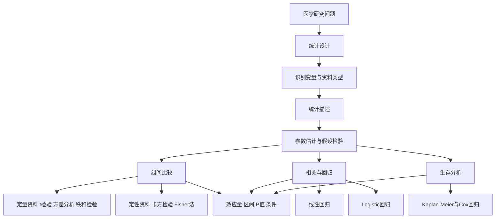

# 从研究问题走到统计结论
> **一句话总览：** 医学统计学不是“见到数据就套公式”，而是先识别研究设计和变量类型，再选择描述与推断方法，最后把效应大小、不确定性和适用边界一起解释。
**主要来源：**[[41.第8版《医学统计学》.pdf]]，正文第1-176页（PDF第22-197页）；目录位于PDF第16-20页。
**使用方法：** 初学按01→13顺读；做题先进入[[14-统计方法选择与公式速查]]；复习某种分析时从下方“研究问题入口”反向定位。
## 知识地图

## 模块导航与教材双锚点

| 顺序  | 笔记                      | 教材范围           | PDF范围     | 核心任务                   |
| --- | ----------------------- | -------------- | --------- | ---------------------- |
| 01  | [[01-统计思维与数据类型]]        | 第1章，第1-8页      | 第22-29页   | 总体、样本、变量、误差与概率         |
| 02  | [[02-定量数据的统计描述]]        | 第2章，第9-21页     | 第30-42页   | 按分布选择集中趋势和变异指标         |
| 03  | [[03-正态分布与医学参考值范围]]     | 第3章，第22-32页    | 第43-53页   | 正态分布、标准化与参考值范围         |
| 04  | [[04-定性数据、统计表与统计图]]     | 第4-5章，第33-55页  | 第54-76页   | 率、构成比、标准化及图表表达         |
| 05  | [[05-参数估计与假设检验]]        | 第6章，第56-68页    | 第77-89页   | 置信区间、P值、两类错误与效能        |
| 06  | [[06-t检验与方差分析]]         | 第7-8章，第69-88页  | 第90-109页  | 一个、两个或多个均数的比较          |
| 07  | [[07-卡方检验与Fisher确切概率法]] | 第9章，第89-100页   | 第110-121页 | 率、构成比与列联表分析            |
| 08  | [[08-非参数秩和检验]]          | 第10章，第101-109页 | 第122-130页 | 等级、偏态或不满足参数条件的比较       |
| 09  | [[09-线性相关与一元线性回归]]      | 第11章，第110-120页 | 第131-141页 | 两个定量变量的关系与预测           |
| 10  | [[10-多元线性回归]]           | 第12章，第121-131页 | 第142-152页 | 连续结局的多因素模型             |
| 11  | [[11-Logistic回归]]       | 第13章，第132-144页 | 第153-165页 | 二分类结局与优势比解释            |
| 12  | [[12-生存分析]]             | 第14章，第145-157页 | 第166-178页 | 删失、生存曲线、Log-rank与Cox模型 |
| 13  | [[13-研究设计、抽样与样本量]]      | 第15章，第158-176页 | 第179-197页 | 观察性研究、实验设计、样本量与诊断试验    |
| 14  | [[14-统计方法选择与公式速查]]      | 第1-15章综合       | 第22-197页  | 从问题结构选择方法并规范报告         |
## 研究问题入口

|研究问题|先判断什么|优先入口|
|---|---|---|
|一组数据如何概括|定量/定性、分布形态|[[02-定量数据的统计描述]]、[[04-定性数据、统计表与统计图]]|
|某指标是否处于正常范围|单双侧界值、分布类型|[[03-正态分布与医学参考值范围]]|
|两个均数是否不同|独立/配对、正态性、方差齐性|[[06-t检验与方差分析]]|
|三个及以上均数是否不同|设计类型、方差齐性、事后比较|[[06-t检验与方差分析]]|
|率或构成比是否不同|独立/配对、理论频数、表的维数|[[07-卡方检验与Fisher确切概率法]]|
|等级资料或偏态资料比较|设计和组数|[[08-非参数秩和检验]]|
|两个定量变量是否相关|线性趋势、异常值、因果边界|[[09-线性相关与一元线性回归]]|
|连续结局的多因素分析|线性、独立、正态、等方差|[[10-多元线性回归]]|
|二分类结局的多因素分析|事件定义、变量编码、OR|[[11-Logistic回归]]|
|结局包含随访时间和删失|时间起点、终点事件、删失|[[12-生存分析]]|
|研究尚未开始|研究类型、三要素、三原则|[[13-研究设计、抽样与样本量]]|

## 一条完整的统计推理链
> [!example] 把统计分析想成临床诊疗
> 研究设计像采集病史，变量类型像判断症状性质，描述统计像体格检查，统计检验像辅助检查。不能因为“会开某项检查”就跳过前面的判断；同样，不能因为会算t值或卡方值就忽略资料类型、设计和前提条件。
1. 把研究目的写成可检验的问题，明确结局、比较或关联目标。
2. 识别观察单位、研究设计、变量类型、组数以及独立或配对关系。
3. 检查数据质量、缺失、异常值和分布，先做恰当的统计描述与图形展示。
4. 报告效应大小及其置信区间，再结合前提条件选择检验或模型。
5. 解释P值时同时讨论临床意义、偏倚、混杂、精度和外推范围。
## 方法选择的总原则

|决策层|关键问题|错误选择的后果|
|---|---|---|
|研究设计|观察性还是实验性；独立还是配对|标准误和检验统计量失真|
|结局变量|定量、二分类、多分类、等级还是生存时间|方法家族选错|
|组数|一组、两组还是多组|重复两两检验增加Ⅰ类错误|
|分布与方差|近似正态、方差齐、是否有异常值|参数法结论不稳健|
|样本与频数|样本量、理论频数、删失情况|近似条件不成立|
|报告目标|描述、比较、预测还是因果解释|结果被过度解读|
> [!warning] P<0.05不是研究质量合格证
> P值不能说明效应有多大，也不能证明无偏、无混杂或具有临床价值。应同时报告效应量、置信区间、研究设计及方法前提。
## 自测
> [!question]- 一项研究比较同一批高血压患者用药前后的收缩压，第一步为什么不是直接选择t检验？
> 应先识别这是配对设计、结局为定量变量，再检查差值分布是否满足配对t检验条件；若条件不满足，应考虑配对设计的符号秩和检验。

> [!question]- “两组P>0.05”可以直接解释为两种治疗完全等效吗？
> 不可以。未拒绝无效假设不等于证明相同，还需结合效应估计、置信区间、检验效能以及是否采用预先设计的等效性或非劣效性框架。
## 相关
- [[01-统计思维与数据类型]]——建立总体、样本、误差与概率的共同语言。
- [[05-参数估计与假设检验]]——理解置信区间、P值和两类错误。
- [[13-研究设计、抽样与样本量]]——在收集数据前控制偏倚并保证可回答性。
- [[14-统计方法选择与公式速查]]——做题和分析时的快速入口。
*最后更新：2026-07-16*
