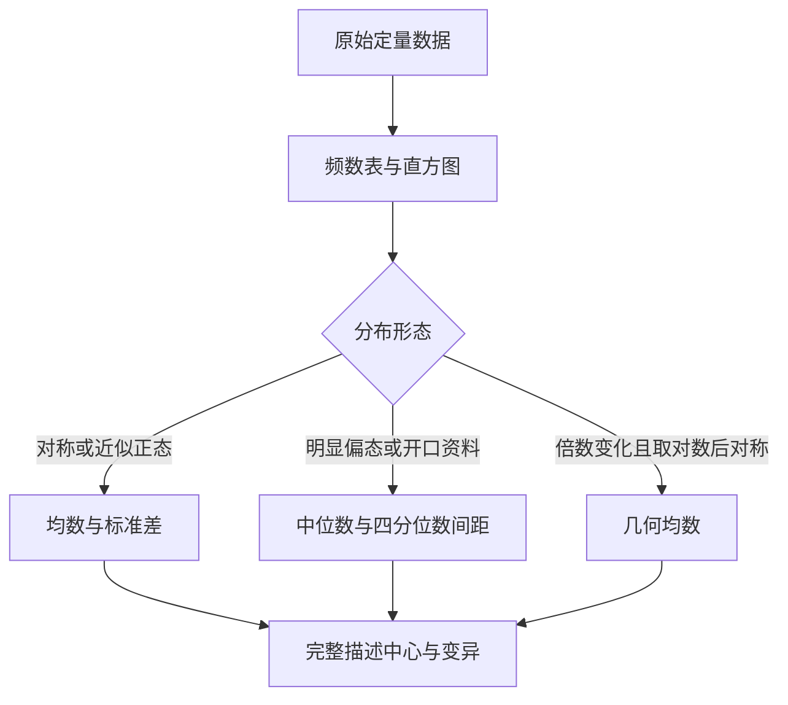

# 定量数据的统计描述
> [!abstract] 一句话总览
> 描述一组定量数据要同时回答“分布是什么形状”“中心在哪里”“个体有多分散”，并按分布类型选择匹配的指标。
**教材锚点：**第2章，教材第9-21页；PDF第30-42页。
**前置知识：**[[01-统计思维与数据类型|变量与定量数据]]。

## 为什么不能只报一个均数
两名患者连续5天收缩压均数几乎相同，甲为162.6mmHg，乙为162.4mmHg；但甲的数值从142到186，乙仅从159到166。只报均数会掩盖完全不同的波动程度。
> [!example] 描述一座山不能只报“平均海拔”
> 均数或中位数告诉你山地的中心高度；标准差、四分位数间距告诉你地形有多起伏；直方图则让你看见是单峰、偏斜还是有离群峰。
## 频数表与直方图
频数表列出观察值区间及各区间的频数；直方图用相连矩形表示连续变量的频数分布。它们用于压缩大量原始数据、判断分布、发现可疑离群值，并可用大样本组段频率近似相应概率。
### 编制频数表的步骤
1. **定组数：**通常8-15组，以清楚显示规律为准。
2. **定组距：**先以全距除以组数作为参考，$i\approx R/k$，再结合专业习惯调整。
3. **定组限：**覆盖全部数据且每个值只能归入一组，常采用“下限包含、上限不包含”。
4. **计频数：**统计各组数据个数，可继续计算累积频数和累积频率。

| 符号                    | 含义   |
| --------------------- | ---- |
| $R=X_{\max}-X_{\min}$ | 全距   |
| $k$                   | 组数   |
| $i$                   | 组距   |
| $f$                   | 组段频数 |
### 代表教材例题：140名成年男性红细胞计数
教材例2-1（第9-11页，PDF第30-32页）：最大值5.95、最小值3.82，$R=2.13$；拟分10组，参考组距约0.21，结合习惯选0.20，得到11个组段。分布集中在$4.80\times10^{12}/L$附近并向两侧对称下降，近似正态分布。
> [!warning] 不等组距直方图不能直接用频数作高度
> 教材要求先折算为等距频数；等价地说，矩形面积应反映频数，组距越宽，高度需相应调整。
## 集中趋势：中心在哪里
### 算术均数
**动机：** 希望让所有观测值共同决定一个平衡中心。
**直觉：** 把所有数值“平均分配”，每个对象得到的数就是均数。
$$
\bar X=\frac{\sum_{i=1}^{n}X_i}{n}
$$
频数资料只能近似用组中值代表该组：
$$
\bar X=\frac{\sum_{i=1}^{k}f_ix_i}{n}
$$

| 符号 | 含义 |
|---|---|
| $X_i$ | 第$i$个原始观测值 |
| $x_i$ | 第$i$组组中值 |
| $f_i$ | 第$i$组频数 |
| $n$ | 总例数，$n=\sum f_i$ |

**条件与解释：** 均数主要用于对称分布或偏度不大的资料，尤其适合正态分布；它利用全部观测值，因此也容易受极端值影响。原始数据可得时优先直接法，加权法因组中值替代而是近似计算。
### 几何均数
**动机：** 抗体滴度、细菌计数等按倍数而非加法变化，算术均数不符合其变化尺度。
> [!example] 倍增像连续调节放大倍数
> 64到128与128到256都是“翻倍”，先在对数尺度上求平均，再取反对数，才能保留这种倍数关系。

$$
G=\sqrt[n]{X_1X_2\cdots X_n}=\operatorname{antilog}\left(\frac{\sum\log X_i}{n}\right)
$$
频数资料为：
$$
G=\operatorname{antilog}\left(\frac{\sum f_i\log X_i}{n}\right)
$$
**条件：** 观测值不能为0或负数；适用于倍数关系变化，或原始值呈正偏态而取对数后近似对称的资料。
**教材例2-2：** 24名志愿者中和抗体滴度倒数按64、128、256、512等倍数变化，几何平均滴度约为$1:209$。
### 中位数与百分位数
**直觉：** 中位数不看每个值离中心多远，只寻找排序后把人数“一分为二”的位置，因此对极端值稳健。
原始数据排序为$X_{(1)}\le\cdots\le X_{(n)}$；奇数例取第$(n+1)/2$项，偶数例取中间两项均值。
频数表中位数近似公式：
$$
M=L+\frac{i_M}{f_M}(n\times50\%-f_L)
$$
一般百分位数近似公式：
$$
P_x=L+\frac{i_x}{f_x}(n\times x\%-f_L)
$$

| 符号 | 含义 |
|---|---|
| $L$ | 所在组段下限 |
| $i_M,i_x$ | 所在组段组距 |
| $f_M,f_x$ | 所在组段频数 |
| $f_L$ | 该组段之前的累积频数 |
**教材例2-4：** 630名女性甘油三酯中，第315个观测值落在$[0.70,1.00)$组，组前累积196例、组频数167：
$$
M=0.70+\frac{0.30}{167}(315-196)=0.914\text{ mmol/L}
$$
频数表计算是假定组内均匀分布的近似；有原始数据时软件可直接给出准确次序统计量。
**应用：** 明显偏态、分布两端无确定值时用中位数；百分位数可用于任何分布，靠近两端的百分位数需较大样本才稳定，教材提示如$n>100$。
### 众数
众数是出现次数最多的原始数值；可有一个、多个或没有唯一众数。连续变量频数分布图的高峰位置对应众数。
## 变异程度：个体有多分散
### 极差与四分位数间距
$$
R=X_{\max}-X_{\min},\qquad IQR=P_{75}-P_{25}
$$
极差只用两端值，简单但受极端值和样本量影响；IQR描述中间50%数据的跨度，不易受极端值影响，适合明显偏态资料。
### 方差与标准差
**动机：** 希望利用每个观测值到均数的距离；直接相加会正负抵消，于是先平方再求平均。
> [!example] 每个人离队伍中心多远
> 方差像把每个人到队伍中心的距离平方后平均；标准差再“开方”，把单位还原成原测量单位，便于医学解释。

样本方差与标准差：
$$
S^2=\frac{\sum(X_i-\bar X)^2}{n-1},\qquad
S=\sqrt{\frac{\sum(X_i-\bar X)^2}{n-1}}
$$
计算式：
$$
S=\sqrt{\frac{\sum X_i^2-(\sum X_i)^2/n}{n-1}}
$$
分母$n-1$是自由度：均数确定后，$n$个离均差中只有$n-1$个可独立变化。标准差越大，个体观测值越分散；其单位与原变量相同。
**教材例2-6：** 甲患者5天收缩压的$S=19.49$mmHg，乙患者$S=2.88$mmHg；尽管均数相近，甲的血压波动明显更大。
### 变异系数
当均数相差较大或单位不同，标准差不能直接比较相对变异：
$$
CV=\frac{S}{\bar X}\times100\%
$$
**教材例2-8：** 舒张压$\bar X=77.5$、$S=10.7$，$CV=13.81\%$；收缩压$\bar X=122.9$、$S=17.1$，$CV=13.91\%$，两者相对变异几乎相同。
**条件与限制：** 均数接近0时，微小变化会使$CV$剧烈波动；教材提示$CV\ge0.20$时应查找变异原因。
## 指标选择与结果报告
1. 绘制直方图或查看分布，核查极端值和开口组段。
2. 对称或近似正态：报告$\bar X\pm S$。
3. 明显偏态或两端开口：报告$M(P_{25},P_{75})$或$M(IQR)$。
4. 倍数变化且对数后对称：报告几何均数，并说明对数底或滴度表达。
5. 比较不同单位或均数差异大的变量相对变异时，使用$CV$。
6. 所有指标附单位、样本量和必要的数据范围。
## 方法比较

| 指标 | 利用的数据 | 适用分布 | 对极端值敏感性 |
|---|---|---|---|
| 均数 | 全部数值 | 对称、近似正态 | 高 |
| 几何均数 | 全部正值的对数 | 倍数变化、对数后对称 | 原尺度较稳健 |
| 中位数 | 排序位置 | 偏态、开口资料 | 低 |
| 标准差 | 全部离均差 | 对称、近似正态 | 高 |
| 四分位数间距 | 中间50%位置 | 偏态 | 低 |
| 变异系数 | 标准差/均数 | 跨单位或均数比较 | 均数近0时不稳定 |

## 常见误区

| 误区 | 正确认识 |
|---|---|
| 任何资料都用$\bar X\pm S$ | 先判断分布；偏态资料常用$M$和$IQR$ |
| 频数表加权均数与原始均数完全相同 | 组中值替代原值，通常只是近似 |
| 几何均数可处理0或负数 | 对数无定义，不能直接使用 |
| 标准差描述均数估计精度 | 标准差描述个体变异；均数精度见标准误 |
| 两组标准差大就一定更不稳定 | 均数或单位差异大时需比较$CV$ |
| 正偏态表示数据“偏向大值” | 正偏态是高峰偏左、长尾向右，通常均数大于中位数 |

## 折叠自测
> [!question]- 1. 抗体滴度为1:20、1:40、1:80等，中心趋势选什么？
> 选几何均数，因为观测值按倍数关系变化且均为正值。

> [!question]- 2. 血清甘油三酯明显正偏态，应如何描述？
> 用中位数描述中心，用四分位数间距描述变异，并可配箱式图或直方图。

> [!question]- 3. 为什么样本方差分母是$n-1$？
> 离均差受“总和为0”的约束，均数确定后只有$n-1$个离均差可独立变化，自由度为$n-1$。
## 相关链接
- [[01-统计思维与数据类型]]：判断变量类型并理解样本与总体。
- [[03-正态分布与医学参考值范围]]：理解均数、标准差与正态曲线的关系。
- [[04-定性数据、统计表与统计图]]：学习表格规范和不同资料的图形选择。
- [[14-统计方法选择与公式速查]]：按资料类型快速选择描述指标。
