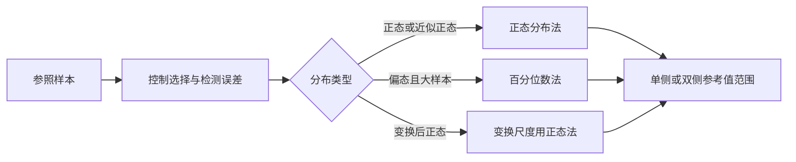

# 正态分布与医学参考值范围
> [!abstract] 一句话总览
> 正态分布用均数定位、用标准差定形，并把个体测量值转成标准化位置；医学参考值范围则在合适的参照总体和分布方法下界定“大多数个体值”的波动区间。
**教材锚点：**第3章，教材第22-32页；PDF第43-53页。
**前置知识：**[[02-定量数据的统计描述|均数、标准差与百分位数]]。

## 从频数直方图到正态曲线
样本量增加、组段不断细分时，近似对称钟形的频率直方图顶端可趋近一条光滑概率密度曲线。曲线下面积表示概率，总面积为1。
> [!example] 正态曲线像“人群拥挤地图”
> 均数附近人最多，越远离中心人越少；曲线高度表示局部拥挤程度，某一区间下的面积才表示落入该区间的人群比例。
## 正态分布的定义与特征
若连续随机变量$X$的概率密度为
$$
f(X)=\frac{1}{\sigma\sqrt{2\pi}}\exp\left[-\frac12\left(\frac{X-\mu}{\sigma}\right)^2\right],\quad -\infty<X<+\infty
$$
则记为$X\sim N(\mu,\sigma^2)$。

| 符号 | 含义 | 对曲线的作用 |
|---|---|---|
| $\mu$ | 总体均数 | 位置参数，决定中心 |
| $\sigma$ | 总体标准差 | 形状参数，越大越矮胖 |
| $\sigma^2$ | 总体方差 | 变异程度的平方尺度 |
| $f(X)$ | 概率密度 | 区间下面积才是概率 |

**主要特征：**
1. 单峰，以$X=\mu$为中心左右完全对称，曲线两端以横轴为渐近线。
2. $X=\mu$处密度最大，在$\mu\pm\sigma$处有拐点。
3. $\mu$改变使曲线平移；$\sigma$改变形状但总面积仍为1。
4. 均数、中位数和众数在理论正态分布中重合。
5. 中心区间概率固定：$\mu\pm\sigma$约68.27%，$\mu\pm1.96\sigma$约95.00%，$\mu\pm2.58\sigma$约99.00%。
> [!warning] 曲线高度不是概率
> 单点在连续分布中的概率为0；必须用区间曲线下面积解释概率。
## 标准正态分布与标准化
不同单位、不同均数和标准差的正态变量，可用$z$变换到同一把“标准尺”：
$$
z=\frac{X-\mu}{\sigma}
$$
转换后$z\sim N(0,1)$。当总体参数未知、仅做样本中个体位置的近似标准化时，教材给出：
$$
z=\frac{X-\bar X}{S}
$$
> [!example] 把不同科目的成绩换成“离均数几个标准差”
> 80分在不同考试中的含义不同；$z=2$始终表示高于均数2个标准差，因此能在统一尺度上查概率。
标准正态分布的对称关系与区间概率：
> $$
> \Phi(z)=1-\Phi(-z),\qquad P(z_1<Z<z_2)=\Phi(z_2)-\Phi(z_1)
> $$
### 代表教材例题：红细胞计数的区间概率
教材例3-2（第25页，PDF第46页）：$\bar X=4.78\times10^{12}/L$，$S=0.38\times10^{12}/L$。
对$X=4.0$：
$$
z=\frac{4.0-4.78}{0.38}=-2.05
$$
查表得$\Phi(-2.05)=0.0202$，估计低于$4.0\times10^{12}/L$者约占2.02%。若上界为5.5，则对应$z\approx1.89$；区间$(4.0,5.5)$的概率约为95.04%。
**解释步骤：** 原值标准化→查累计概率→按区间作差→回到原单位解释人群比例。
## 对数正态分布
若原始变量$X$通常呈正偏态，而$\log X$服从正态分布，则称$X$服从对数正态分布。常见于有害物浓度、农药残留、潜伏期、住院天数、抗体滴度等。
**处理步骤：**
1. 对正值资料取对数（底可为$e$、10或2）。
2. 在对数尺度检查正态性并进行统计处理。
3. 将界值取反对数，回到原始单位报告。
> [!warning] “原始值正态”与“对数值正态”不可混写
> 在哪个尺度计算均数、标准差和界值，就必须在该尺度满足相应分布条件；最终结果需反变换。
## 正态分布在质量控制中的应用
质量控制图以$\mu$为中心线，并画出$\mu\pm\sigma$、$\mu\pm2\sigma$警戒相关线和$\mu\pm3\sigma$控制限；总体参数未知时可用$\bar X$与$S$代替。教材列出的可能存在系统误差的情形包括：
- 1点超出$3\sigma$控制限；
- 连续3点中2点超出$2\sigma$；
- 连续5点中4点距中心超过$1\sigma$；
- 连续6点稳定上升或下降；
- 连续14点上下交替；
- 连续9点位于中心线同侧；
- 连续15点均在中心线$1\sigma$以内；
- 连续8点均在中心线$1\sigma$以外。
这些规则寻找的不是单纯“远”，也包括连续出现的非随机模式。
## 医学参考值范围的含义
医学参考值范围是从明确的参照总体中获得个体观察值，用统计方法建立百分位数界限，表示该总体大多数个体值的波动区间；通常使用95%范围。
> [!example] 参考值范围像同质人群的“常见活动区”
> 它描述多数参照个体落在哪里，不是诊断的绝对围墙。超界不必然患病，界内也不保证健康，仍需结合临床和诊断效能。
### 制订前必须确定的事项
1. **同质参照总体：** 排除影响研究指标的疾病或因素，必要时按地区、民族、性别、年龄、妊娠等分层。
2. **足够样本量：** 偏态或分散资料通常需要更大样本。
3. **检测误差控制：** 标准化人员、仪器、试剂、采样、转运、储存和环境条件。
4. **单侧或双侧：** 白细胞过高过低都异常→双侧；血铅只过高异常→单侧上限；肺活量只过低异常→单侧下限。
5. **百分数范围：** 常用95%，但应按研究目的权衡假阳性与假阴性。
6. **计算方法：** 由分布类型、样本量和目的决定。
## 两种基本计算方法

| 范围 | 正态分布法 | 百分位数法 |
|---|---|---|
| 双侧95% | $\bar X\pm1.96S$ | $P_{2.5}\sim P_{97.5}$ |
| 单侧95%下限 | $\bar X-1.64S$ | $P_5$ |
| 单侧95%上限 | $\bar X+1.64S$ | $P_{95}$ |
| 双侧99% | $\bar X\pm2.58S$ | $P_{0.5}\sim P_{99.5}$ |

一般形式：
$$
\bar X\pm z_{\alpha/2}S\quad(\text{双侧}),\qquad
\bar X\pm z_\alpha S\quad(\text{单侧})
$$
**正态分布法条件：** 资料正态或近似正态；或经变换后在变换尺度近似正态。优点是样本量不很大时相对稳定，缺点是适用范围窄。
**百分位数法条件：** 可用于任何分布，尤其偏态资料，但界限依赖两端次序统计量，需要大样本才稳定。
### 代表教材例题：红细胞计数95%参考值范围
教材例3-3（第28页，PDF第49页）：140名正常成年男性红细胞计数近似正态，$\bar X=4.78\times10^{12}/L$，$S=0.38\times10^{12}/L$。过高或过低均异常，故求双侧范围：
$$
4.78\pm1.96\times0.38=(4.04,5.52)\times10^{12}/L
$$
**结果报告：** 该参照总体正常成年男性红细胞计数的95%参考值范围估计为$(4.04\sim5.52)\times10^{12}/L$。
### 偏态资料示例
教材例3-6：630名女性甘油三酯呈正偏态，为高血脂诊疗提供参考时只需上限，采用百分位数法求$P_{95}$，得到单侧95%参考值范围为小于2.10mmol/L。
## 正态性判断
- **图示法：** 频数表、直方图、P-P图、Q-Q图，直观但较粗略。
- **计算法：** 矩法、W检验、D检验等，由统计软件完成。
正态性判断应结合图形、样本量和专业知识；小样本时尤其要逐组检查。
## 方法比较

| 概念 | 对象 | 主要用途 |
|---|---|---|
| 正态分布区间概率 | 随机变量在总体中的概率 | 计算某范围内人群比例 |
| 医学参考值范围 | 参照总体的个体观察值 | 判断个体值是否处于常见波动范围 |
| 均数置信区间 | 总体均数参数 | 估计总体平均水平，不是个体范围 |
| 正态分布法 | 正态/近似正态数据 | 由$\bar X,S$计算界值 |
| 百分位数法 | 任意分布的大样本数据 | 直接由排序位置定界 |
## 常见误区

| 误区 | 正确认识 |
|---|---|
| 95%参考值范围包含95%的所有人 | 它针对明确参照总体，而非所有人 |
| 参考值范围外就一定患病 | 它是参考分类界限，不等于诊断金标准 |
| $\bar X\pm1.96S$是总体均数95%置信区间 | 它描述个体值范围；均数置信区间使用标准误 |
| 任何资料都可用正态分布法 | 必须先满足正态或变换后正态 |
| 单侧/双侧由统计软件自动决定 | 必须依据专业上哪一侧异常来决定 |
| 用百分位数法就不需要大样本 | 尾部百分位数在小样本中很不稳定 |
## 折叠自测
> [!question]- 1. $z=-2$表示什么？
> 该观测值低于总体均数2个总体标准差；若用样本量替代，则是相对于样本均数和标准差的近似位置。

> [!question]- 2. 血铅仅过高异常，95%参考值范围如何选？
> 选单侧上限；正态资料用$\bar X+1.64S$，偏态大样本可用$P_{95}$。

> [!question]- 3. 为什么95%参考值范围不是95%置信区间？
> 前者描述参照个体值的波动范围，后者描述总体参数估计的不确定性，两者对象和公式不同。
## 相关链接
- [[02-定量数据的统计描述]]：复习均数、标准差和百分位数。
- [[05-参数估计与假设检验]]：区分个体参考范围与参数置信区间。
- [[13-研究设计、抽样与样本量]]：保证参照样本同质、有代表性且例数充足。
- [[14-统计方法选择与公式速查]]：快速选择单侧/双侧与正态法/百分位数法。
