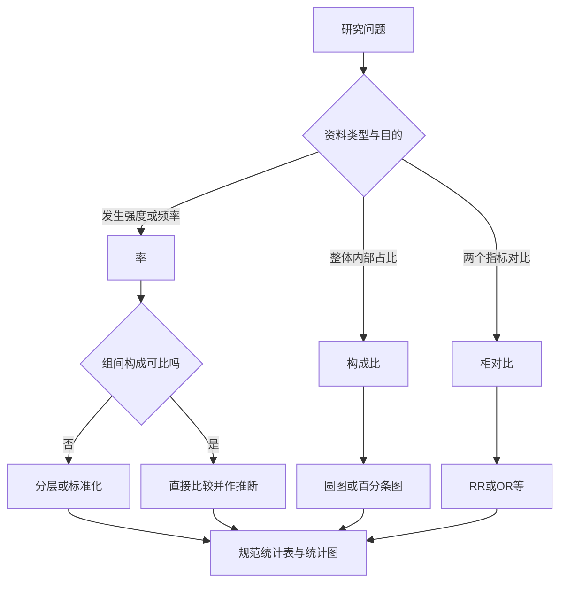

# 定性数据、统计表与统计图
> [!abstract] 一句话总览
> 定性数据先按类别计数，再用率、构成比或相对比回答不同问题；统计表和统计图必须依据资料性质与表达目的选择，不能用漂亮形式掩盖错误分母。
**教材锚点：**第4章教材第33-41页/PDF第54-62页；第5章教材第42-55页/PDF第63-76页。
**前置知识：**[[01-统计思维与数据类型|定性数据与有序数据]]、[[02-定量数据的统计描述|分布与描述指标]]。

## 相对数为什么必要
治疗A法100人中75人有效，B法150人中100人有效。绝对有效人数是75对100，不能直接说明B更好；有效率是75%对66.7%，把分母化到同一基数后才可比较。
> [!example] 率像“每100次机会成功几次”
> 只数成功人数像比较两家医院收治了多少人，却不看各自总接诊量；相对数把机会数放回分母，问题才完整。
## 率、构成比与相对比
### 率
率表示一定空间或时间范围内某现象发生的强度或频率：
$$
\text{率}=\frac{\text{某现象实际发生数}}{\text{可能发生该现象的总例数}}\times\text{比例基数}
$$
比例基数按专业习惯选百分率、千分率、万分率或十万分率。总体率用$\pi$，样本率用$p$。
**教材例4-1：**某单位2022年3 128名职工中，新发现高血压12例，发病率为$12/3128\times1000‰=3.84‰$。
### 构成比
构成比表示事物内部某组成部分占整体的比重：
$$
\text{构成比}=\frac{\text{某组成部分例数}}{\text{全部组成部分例数之和}}\times100\%
$$
各部分构成比之和为100%；一部分变化会牵动其他部分的占比。
> [!warning] 死因构成比不是病死率
> 死因构成比只说明某死因在全部死亡中的相对重要性；病死率才表示该病患者因该病死亡的频率和严重程度。
### 相对比、RR与OR
一般相对比为$A/B$，表示$A$是$B$的多少倍。
前瞻性研究常用相对危险度：
$$
RR=\frac{P_1}{P_0}
$$
$P_1$为暴露组发病率或患病率，$P_0$为非暴露组相应率。教材例4-3中试验组有效率77.5%、对照组55.0%，$RR=1.41$，表示试验组有效率是对照组1.41倍。
病例-对照研究常用比数比：
$$
OR=\frac{P_1/(1-P_1)}{P_0/(1-P_0)}=\frac{ad}{bc}
$$

| 二分类表 | 病例 | 对照 |
|---|---:|---:|
| 有暴露 | $a$ | $b$ |
| 无暴露 | $c$ | $d$ |

教材例4-4：$a=40,b=20,c=112,d=203$，
$$
OR=\frac{40\times203}{20\times112}=3.63
$$
表示病例组与对照组的暴露优势之比为3.63；不能直接表述为风险增加3.63倍。
## 标准化率：消除内部构成影响
当比较人群的年龄、性别、工龄、病程或病情构成不同时，粗率可能出现方向相反的结果。直接标准化法把各组的分层率应用于同一标准构成：
$$
P'=\frac{\sum_{i=1}^{k}N_iP_i}{N}=\sum_{i=1}^{k}C_iP_i
$$

| 符号 | 含义 |
|---|---|
| $P'$ | 标准化率 |
| $N_i$ | 标准构成第$i$层人数 |
| $P_i$ | 待标准化人群第$i$层原始率 |
| $N=\sum N_i$ | 标准构成总人数 |
| $C_i=N_i/N$ | 第$i$层标准构成比 |

> [!example] 让两家医院“接诊同一批结构的患者”
> 各科治愈率像各科考试成绩，医院患者构成像各科权重。统一权重后再汇总，才能比较医院自身的分层表现。
### 代表教材例题：甲乙医院治愈率
教材例4-5至4-6（第35-36页，PDF第56-57页）：甲医院各科治愈率均高于乙医院，但粗总治愈率为76.8%，反低于乙的85.6%，原因是甲医院低治愈率的内科患者占比更大。以两院各科人数合计作标准构成，计算得甲医院标化率82.6%，乙医院80.0%。
**计算步骤：**
1. 识别影响比较的分层因素，如科室或年龄。
2. 选择统一标准构成：代表性大人群、各比较组合计或任选一组。
3. 各层标准人数乘各组该层率，求预期事件数。
4. 各层预期事件数求和后除以标准总人数。
5. 只比较标化率的相对水平。
> [!warning] 标准化率不是实际发生率
> 它依赖所选标准，主要用于组间相对比较；标准不同，数值可能不同。
## 医学中常用率

| 指标 | 分子 | 分母 | 回答的问题 |
|---|---|---|---|
| 死亡率 | 某年某地死亡总数 | 同年平均人口数 | 居民总体死亡水平 |
| 年龄别死亡率 | 某年龄组死亡数 | 同年龄组平均人口数 | 排除年龄构成后的死亡水平 |
| 死因别死亡率 | 某死因死亡数 | 同期平均人口数 | 该死因对人群生命的危害 |
| 死因构成 | 某死因死亡数 | 全部死亡数 | 各死因相对重要性 |
| 发病率 | 一定期间新病例数 | 同期可能发病人群 | 新发生疾病的频率 |
| 患病率 | 某时点/期间现患病例数 | 同期调查或平均人口 | 人群疾病负担，受病程影响 |
| 病死率 | 因某病死亡数 | 同期该病患者数 | 疾病严重程度和医疗水平 |
| 治愈率 | 治愈人数 | 接受治疗人数 | 治疗后治愈的频率 |

## 相对数的使用条件与步骤
1. 明确分子事件、分母机会人群、时间和空间范围。
2. 判断问题要的是发生强度、内部占比还是倍数关系。
3. 分母小时优先报告绝对数，避免不稳定百分比误导。
4. 合计率用各分子之和除以各分母之和，不能简单平均各率。
5. 检查比较组的对象、方法、时间和内部构成是否可比。
6. 若构成不同，分层比较或标准化。
7. 样本率仍有抽样误差，组间差异需进一步假设检验。
## 统计表：让比较关系一眼可读
统计表的目的，是简洁、清晰、直观地表达重点数据，代替冗长文字并方便比较。
> [!example] 统计表像一句完整的话
> 标题是定语，左侧横标目是主语，右侧纵标目是谓语，交叉格中的数字补全句子；从左向右读一行，应能说清“谁、有什么结果”。
### 编制原则与结构
- 一张表一般只表达一个中心内容，重点突出、简单明了。
- 主谓分明、层次清楚；标目分组符合逻辑。
- 论文表格通常用三线表：顶线、表头下横线、底线，不用竖线和斜线。
- 结构包括标题、标目、线条、数字、备注。
- 标题写明时间、地点、研究内容并置于表上方；单位和统计符号规范。
- 数字位数对齐、小数位一致；无数字用“—”，缺失用“…”并备注，真实零填写“0”。
### 简单表与复合表

| 类型 | 标目层次 | 适用情况 |
|---|---|---|
| 简单表 | 一个层次 | 一个分组标志对应若干指标 |
| 复合表 | 两个或三个层次 | 同时按多个标志比较 |

标目超过三个层次往往冗繁，应拆表。教材例5-1把季节、年龄、职业三种无可比性的内容从一张混乱表拆为三张单主题表。
### 教材表5-1的规范表达

| 组别 | 例数 | 有效例数 | 无效例数 | 有效率/% |
|---|---:|---:|---:|---:|
| 对照组 | 103 | 17 | 86 | 16.50 |
| 试验组 | 105 | 74 | 31 | 70.48 |
| 合计 | 208 | 91 | 117 | 43.75 |

该表横标目是组别，纵标目是相应指标，标题应包含治疗对象和比较内容。
## 统计图：按资料性质选择视觉语言
统计图通常由标题、图域、横纵标目、图例和刻度组成；一图只表达一个中心主题，并准确标注单位。

| 图形 | 适用资料与目的 | 关键规范 |
|---|---|---|
| 直方图 | 连续变量频数分布 | 矩形相连；纵轴从0开始；不等组距用频数/组距作高度 |
| 普通线图 | 指标随时间/连续变量的趋势与绝对改变量 | 横纵轴可不从0开始；相邻点用折线连接 |
| 半对数线图 | 比较相对改变量或变化速度 | 横轴算术尺度、纵轴对数尺度 |
| 箱式图 | 偏态资料的中位数、IQR、极值/离群值与组间比较 | 箱体为$P_{25}$到$P_{75}$，中线为中位数 |
| 误差条图 | 多组均值及标准差、标准误或置信区间 | 必须说明误差条代表什么 |
| 散点图 | 两个定量指标的关系 | 横轴通常自变量，纵轴因变量，可不从0开始 |
| 热图 | 数值大小、相关或聚类结构 | 颜色深浅含义必须给图例 |
| 森林图 | 多研究/多中心效应量与置信区间 | 垂直参考线、单项区间和合并效应 |
| 直条图 | 相互独立类别的绝对数或相对数比较 | 条宽相等且有间隔；纵轴从0开始 |
| 圆图 | 一个整体内部构成 | 扇形面积合计100% |
| 百分条图 | 一个或多个整体的构成比较 | 每条总长100%，分段表示构成 |

> [!warning] 直方图与直条图不能混用
> 直方图横轴是连续组段，矩形相连且面积代表频数；直条图横轴是相互独立的类别，条间必须留空。
### 图形选择步骤
1. 先写清要展示分布、趋势、速度、构成、组间中心与变异，还是变量关系。
2. 判断横轴是连续变量、时间还是独立类别。
3. 选图后检查坐标起点：直条图、直方图和教材所示均值误差条图纵轴从0开始；线图、箱式图、散点图可按实际范围。
4. 核对图题、坐标单位、图例、刻度和线型。
5. 不用平滑曲线替代实际观测点间折线，不通过截断坐标夸大差异。
## 方法比较

| 容易混淆 | 共同点 | 关键区别 |
|---|---|---|
| 率 vs 构成比 | 都是相对数 | 率看发生机会，构成比看整体内部占比 |
| RR vs OR | 都描述关联强度 | RR比较风险；OR比较优势，病例-对照研究常用OR |
| 粗率 vs 标化率 | 都可用于组间比较 | 粗率是实际值；标化率消除构成影响、只表相对水平 |
| 线图 vs 半对数线图 | 都展示随时间变化 | 前者突出绝对变化，后者突出相对变化速度 |
| 圆图 vs 百分条图 | 都展示构成 | 百分条图更便于多个整体并列比较 |

## 常见误区

| 误区 | 正确认识 |
|---|---|
| 住院死亡者中农村人占比高，所以农村患病率高 | 缺少农村和城镇各自可能患病的分母，只能得构成比 |
| 两个率直接相加后除以2就是合计率 | 应用分子总和除以分母总和 |
| 分母仅5人也报告“有效率80%” | 相对数极不稳定，宜同时或优先报告4/5 |
| 标化率82.6%就是医院真实治愈率 | 标化率依赖人为统一的标准构成 |
| 构成比变化说明发病率变化 | 还需同期人群分母才能计算发病率 |
| 条图纵轴截断可让小差异更清楚 | 会夸大视觉差异；条图纵轴必须从0开始 |
| 误差条不说明是SD、SE还是CI | 三者含义不同，必须明确标注 |

## 折叠自测
> [!question]- 1. 全部死亡者中肺癌死亡占20%，这是什么指标？
> 是死因构成比，说明肺癌在全部死因中的相对重要性，不能说明肺癌死亡风险。

> [!question]- 2. 两地年龄构成不同，如何比较死亡率？
> 先比较年龄别死亡率，或采用统一年龄标准构成计算标化死亡率。

> [!question]- 3. 比较两种癌症死亡率随时间上升的速度，应选什么图？
> 半对数线图，因为相同相对改变量在对数纵轴上表现为相同幅度。

> [!question]- 4. 描述偏态评分在三组中的中心和离散程度，应选什么图？
> 箱式图，可同时显示中位数、四分位数间距和异常值。
## 相关链接
- [[01-统计思维与数据类型]]：确认类别变量、样本与总体。
- [[02-定量数据的统计描述]]：理解直方图、箱式图和误差指标。
- [[07-卡方检验与Fisher确切概率法]]：比较样本率或构成比时处理抽样误差。
- [[09-线性相关与一元线性回归]]：进一步分析散点图中的定量关系。
- [[14-统计方法选择与公式速查]]：快速匹配相对数、图表和后续检验。
