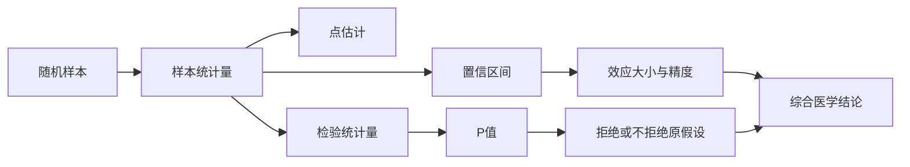

# 参数估计与假设检验
> [!abstract] 一句话总览
> 参数估计回答“总体参数大约是多少”，假设检验回答“现有差别能否仅用抽样误差解释”；完整推断应同时报告效应估计、置信区间和P值。
**教材锚点：** 第6章，教材56-68页；PDF 77-89页。重点：标准误56-57/77-78，均数CI 58-60/79-81，率CI 61-62/82-83，检验原理62-65/83-86，两类错误65/86。
**前置：** [[03-正态分布与医学参考值范围]]　**后续：** [[06-t检验与方差分析]]
## 知识图

## 为什么不能只看样本数字
同一总体反复抽样会得到不同的均数或率；这种由随机抽样造成的样本统计量与总体参数之差叫**抽样误差**。样本均数4.77并不等于总体均数4.75，不代表测量出了错。
> [!example] 飞镖靶类比
> 点估计像一支飞镖落点；标准误描述反复投掷落点的分散，置信区间给出一条“可能覆盖靶心”的范围，假设检验则问观察到的落点离某个靶心假设是否远到难以用随机波动解释。
### 标准误
均数抽样分布的标准差称均数标准误：
$$\sigma_{\bar X}=\frac{\sigma}{\sqrt n},\qquad S_{\bar X}=\frac{S}{\sqrt n}$$
率的标准误（总体率未知时用样本率估计）：
$$S_p=\sqrt{\frac{p(1-p)}{n}}$$

| 符号 | 含义 |
|---|---|
| $\bar X,p$ | 样本均数、样本率 |
| $\mu,\pi$ | 总体均数、总体率 |
| $S,\sigma$ | 样本标准差、总体标准差 |
| $S_{\bar X},S_p$ | 均数、率的标准误 |
| $n$ | 样本含量 |

标准差描述**个体间变异**，标准误描述**统计量的抽样变异**。同一总体中，$n$增大使标准误按$1/\sqrt n$下降。
## 参数估计：从一个点到一个区间
### 动机、直觉与定义
点估计简单，却不交代不确定性。区间估计按预定置信度$1-\alpha$构造上下限，同时表达估计值和精度。
> [!warning] 置信区间的正确解释
> 参数$\mu$是固定值，不是“有95%概率在这一次已经算出的区间里”。频率学解释是：按同一方法反复抽样构造区间，长期约95%的区间覆盖$\mu$。
### 总体均数的置信区间
已知$\sigma$：
$$\bar X\pm z_{\alpha/2}\frac{\sigma}{\sqrt n}$$
未知$\sigma$且小样本来自正态总体：
$$\bar X\pm t_{\alpha/2,\nu}\frac{S}{\sqrt n},\qquad \nu=n-1$$
大样本（教材示例$n>50$）可用正态近似：
$$\bar X\pm z_{\alpha/2}\frac{S}{\sqrt n}$$
两独立总体均数差在方差齐时：
$$ (\bar X_1-\bar X_2)\pm t_{\alpha/2,n_1+n_2-2}S_{\bar X_1-\bar X_2}$$
$$S_{\bar X_1-\bar X_2}=S_c\sqrt{\frac1{n_1}+\frac1{n_2}},\quad S_c^2=\frac{(n_1-1)S_1^2+(n_2-1)S_2^2}{n_1+n_2-2}$$
### 总体率及率差的置信区间
- 小样本率：教材规定$n\le50$时查二项分布置信区间表。
- 大样本率：当$np>5$且$n(1-p)>5$时，$p\pm z_{\alpha/2}S_p$。
- 两率差：四个数$n_1p_1,n_1(1-p_1),n_2p_2,n_2(1-p_2)$均大于5时，用正态近似：
$$ (p_1-p_2)\pm z_{\alpha/2}\sqrt{p_c(1-p_c)\left(\frac1{n_1}+\frac1{n_2}\right)},\quad p_c=\frac{X_1+X_2}{n_1+n_2}$$
### 代表教材例题：纤维蛋白原总体均数
教材例6-2：25名动脉粥样硬化患者，$\bar X=3.32$g/L，$S=0.57$g/L。总体标准差未知且为小样本，取$t_{0.025,24}=2.064$：
$$3.32\pm2.064\times\frac{0.57}{\sqrt{25}}=(3.085,3.555)\text{ g/L}$$
**为什么选该法：** 估计的是总体均数，$\sigma$未知，$n=25$，自由度$25-1=24$，故用$t$区间而非$z$区间。
## 假设检验：把“差别”与抽样误差竞争
### 基本逻辑
先暂定$H_0$成立，再计算“当前样本及更极端结果”出现的概率$P$。若$P\le\alpha$，结果与$H_0$难以相容，拒绝$H_0$；若$P>\alpha$，只是不拒绝$H_0$。
> [!example] 烟雾报警器类比
> $H_0$是“没有火灾”。报警阈值$\alpha$越宽松越容易报警，也越容易误报（Ⅰ类错误）；阈值过严则可能漏报（Ⅱ类错误）。增加样本量像提升传感器质量，可同时改善两类风险。
### 标准步骤
1. 按研究目的写互斥完备的$H_0$、$H_1$，事先确定单双侧与$\alpha$。
2. 依据资料类型、设计和条件选择检验统计量，在$H_0$成立条件下计算。
3. 求精确$P$值，与$\alpha$比较，作统计结论，再结合效应量、CI和医学意义解释。
### P值、错误与效能

| 项目 | 定义 | 关键点 |
|---|---|---|
| P值 | $H_0$成立时，得到当前及更极端结果的概率 | 不是$H_0$成立的概率 |
| Ⅰ类错误$\alpha$ | $H_0$真却拒绝$H_0$ | 假阳性 |
| Ⅱ类错误$\beta$ | $H_1$真却不拒绝$H_0$ | 假阴性 |
| 检验效能$1-\beta$ | 总体确有差别时发现差别的概率 | 样本量增大通常提高效能 |

## 区间估计与检验的关系
双侧检验水准为$\alpha$时，若相应$100(1-\alpha)\%$差值CI不含0，则拒绝“差值为0”的$H_0$。检验给出证据强度，CI还给出效应方向、大小和精度；样本量很大时微小差异也可得到很小P值，因此不能只看“显著”。
## 方法比较

| 维度 | 点估计 | 置信区间 | 假设检验 |
|---|---|---|---|
| 回答 | 参数的单一估计 | 参数可能范围与精度 | 数据与$H_0$是否相容 |
| 输出 | 数值 | 下限、上限、置信度 | 统计量、自由度、P值 |
| 局限 | 不反映抽样误差 | 依赖模型与构造方法 | 不直接表示效应大小 |
| 最佳实践 | 与CI一起报告 | 与效应估计一起报告 | 与效应量和CI一起报告 |

## 常见误区

| 误区 | 正确认识 |
|---|---|
| $P>0.05$证明两总体相同 | 只能说证据不足以拒绝$H_0$ |
| P值越小，效应越大 | P值还受样本量和变异影响 |
| 95%CI包含95%的个体 | 均数CI估计总体均数，不是参考值范围 |
| 统计学意义就是临床意义 | 需结合效应大小、CI和专业阈值 |
| 软件显示0.000就报告$P=0$ | 应写$P<0.001$ |

## 折叠自测
> [!question]- 为什么把样本量扩大4倍，均数标准误约减半？
> 因为$S_{\bar X}=S/\sqrt n$；$n$变为$4n$后，分母变为$2\sqrt n$。

> [!question]- 95%均数差CI为$(-0.2,1.4)$，双侧$\alpha=0.05$检验结论是什么？
> 区间含0，因此不能拒绝“两总体均数差为0”的$H_0$；不能据此证明两总体相等。

> [!question]- 单侧检验可以看到数据后再改吗？
> 不可以。单双侧应由研究目的和专业知识在分析前确定，否则会人为增加Ⅰ类错误。
## 相关笔记
- [[03-正态分布与医学参考值范围]]：区分个体参考值范围与参数置信区间。
- [[06-t检验与方差分析]]：把本章推断原理用于均数比较。
- [[07-卡方检验与Fisher确切概率法]]：分类资料的假设检验。
- [[14-统计方法选择与公式速查]]：按资料类型和设计选方法。
