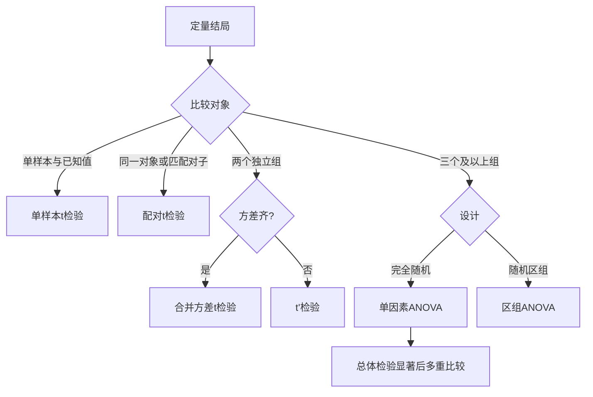

# t检验与方差分析
> [!abstract] 一句话总览
> t检验比较一个或两个总体均数，方差分析比较多个总体均数；两者都把“系统性差别”与“随机误差”进行标准化比较。
**教材锚点：** 第7-8章，教材69-88页；PDF 90-109页。t检验69-74/90-95，ANOVA思想78-80/99-101，随机区组81-83/102-104，多重比较83-85/104-106。
**前置：** [[05-参数估计与假设检验]]　**后续：** [[08-非参数秩和检验]]
## 知识图

## t检验：差值相对于标准误有多大
### 动机、直觉与公式
均数差不为0可能只是抽样波动。t统计量把观察差值除以差值的标准误：若差值相对噪声很大，$|t|$就大。
> [!example] 信号与噪声类比
> 两位患者体温相差1℃是否重要，要看体温计与个体波动有多大。t值就是“信号/噪声”：同样1℃差别，在噪声小时更醒目。
### 三类t检验

| 场景 | 统计量 | 自由度 | 关键条件 |
|---|---|---|---|
| 单样本 | $t=(\bar X-\mu_0)/(S/\sqrt n)$ | $n-1$ | 小样本来自正态总体 |
| 配对 | $t=\bar d/(S_d/\sqrt n)$ | 对子数$n-1$ | **差值$d$**近似正态 |
| 两独立样本、方差齐 | $t=(\bar X_1-\bar X_2)/[S_c\sqrt{1/n_1+1/n_2}]$ | $n_1+n_2-2$ | 独立、正态、总体方差齐 |

$$S_c^2=\frac{(n_1-1)S_1^2+(n_2-1)S_2^2}{n_1+n_2-2}$$
配对设计分析的是**对子内差值**，不是把两列数据当独立样本；配对t检验也不要求“两列原始值方差齐”。
### 方差不齐：$t'$检验
两独立样本方差不齐时，教材介绍Satterthwaite近似：
$$t'=\frac{\bar X_1-\bar X_2}{\sqrt{S_1^2/n_1+S_2^2/n_2}}$$
$$\nu'=\frac{(S_1^2/n_1+S_2^2/n_2)^2}{(S_1^2/n_1)^2/(n_1-1)+(S_2^2/n_2)^2/(n_2-1)}$$
两方差F检验（资料要求正态）取较大样本方差作分子：
$$F=\frac{S_1^2}{S_2^2},\quad \nu_1=n_1-1,\ \nu_2=n_2-1$$
教材示例常以$\alpha=0.10$判断方差齐性；实际分析不应把“方差检验不显著”误写成证明方差完全相同。
### 代表教材例题：配对咖啡实验
教材例7-2对12名男性饮咖啡前后心肌血流量作比较。差值定义为饮用前-饮用后，$\bar d=0.8$，$S_d=0.741$：
$$S_{\bar d}=0.741/\sqrt{12}=0.214,\qquad t=0.8/0.214=3.738$$
自由度$\nu=11$，$t_{0.025,11}=2.201$，故$P<0.05$，认为前后心肌血流量存在差异。
**为什么选该法：** 同一志愿者前后测量，数据一一对应；应分析差值，用配对t检验，而非独立样本t检验。
## 方差分析：把总变异拆开
### 动机与类比
三个及以上均数若反复两两t检验，会累积Ⅰ类错误。ANOVA一次检验“各总体均数是否不全相等”。
> [!example] 班级成绩类比
> 总成绩波动可拆成“班级均数之间的波动”和“同班学生之间的波动”。若班间均方远大于班内均方，分班处理可能确实造成影响。
### 完全随机设计单因素ANOVA
$$SS_{总}=SS_{组间}+SS_{组内}$$
$$\nu_{总}=n-1,\quad\nu_{组间}=k-1,\quad\nu_{组内}=n-k$$
$$MS=SS/\nu,\qquad F=\frac{MS_{组间}}{MS_{组内}}$$

| 变异来源 | 含义 | 自由度 |
|---|---|---|
| 组间 | 处理因素效应+随机误差 | $k-1$ |
| 组内 | 随机误差 | $n-k$ |
| 总变异 | 全部观察值的波动 | $n-1$ |

$H_0$成立时两均方都估计随机误差，$F$应接近1；$F$足够大才拒绝“各总体均数全相等”。
### 代表教材例题：三剂量凝血活酶时间
教材例8-1：三组各10人，$SS_{总}=279.9861$，$SS_{组间}=91.2247$，$SS_{组内}=188.7614$：
$$MS_{组间}=91.2247/2=45.6124$$
$$MS_{组内}=188.7614/27=6.9912,\qquad F=6.52$$
分子自由度2、分母自由度27，$F_{0.05(2,27)}=3.35$，故$P<0.05$；只能说三剂量组总体均数**不全相同**。
### 随机区组设计
先按重要特征组成$m$个区组，再在每区组内随机分配到$k$个处理；区组变异被单独剥离：
$$SS_{总}=SS_{处理}+SS_{区组}+SS_{误差}$$
$$\nu_{处理}=k-1,\quad\nu_{区组}=m-1,\quad\nu_{误差}=(k-1)(m-1)$$
它通过减少误差均方提高效率，但每个“区组×处理”格只有一个观测时，不能另行估计交互作用。
## 适用条件与分析步骤
### 条件
- 样本能代表总体，独立性来自正确的随机抽样/随机分组，而非事后检验。
- t检验与ANOVA理论上要求相应残差（或配对差值）近似正态。
- 两独立样本合并方差t检验及常规ANOVA要求总体方差齐。
- 不满足方差齐可用$t'$；严重偏态、有序资料可转向[[08-非参数秩和检验]]。
### 步骤
1. 先识别独立、配对、完全随机或随机区组设计。
2. 画图并检查异常值、分布与方差；确认变量与单位。
3. 写$H_0/H_1$和预先确定的$\alpha$，计算统计量与自由度。
4. 报告各组描述量、均数差或效应量、CI、统计量、自由度、精确P值。
5. ANOVA总体检验显著后，按预定比较目的选择多重比较。
## 多重比较

| 方法 | 教材给出的适用目的 |
|---|---|
| Dunnett-t | 多个试验组分别与一个对照组比较 |
| LSD-t | 少数有专业价值的预设比较，理论上只适合两组 |
| SNK-q | 事后任意两两比较，样本量可不等 |
| Tukey | 任意两两比较且各组样本量相同 |
| Bonferroni/Sidak | 调整单次检验水准，控制整体Ⅰ类错误 |

> [!warning] 总体检验显著不等于每两组都显著
> $H_0$被拒绝只说明至少两个总体均数不同；直接进行多次普通t检验会使整体Ⅰ类错误膨胀。
## t检验与ANOVA比较

| 维度 | t检验 | ANOVA |
|---|---|---|
| 主要对象 | 一个或两个均数 | 两个及以上均数 |
| 统计量 | 差值/标准误 | 组间均方/组内均方 |
| 两组时 | 与完全随机ANOVA等价 | $F=t^2$ |
| 显著后 | 直接解释预设对比 | 多组时需进一步多重比较 |

## 常见误区

| 误区 | 正确认识 |
|---|---|
| 前后两列用独立t检验 | 应分析对子差值 |
| ANOVA显著说明所有组都不同 | 只说明总体均数不全相同 |
| $P<0.05$说明差异很大 | P值不等于效应大小 |
| 数据不正态就机械换非参数 | 先考虑设计、残差、样本量和合理变换 |
| 看到样本方差不同就直接判方差不齐 | 样本方差本身有抽样误差 |

## 折叠自测
> [!question]- 两独立组$n_1=25,n_2=20$，合并方差t检验自由度是多少？
> $25+20-2=43$。

> [!question]- 三组ANOVA得到$P<0.05$，能否说A、B、C任意两组均不同？
> 不能；只能说至少两个总体均数不同，还需合适的多重比较定位差异。

> [!question]- 配对t检验真正要求正态的是哪一个变量？
> 每对观测的差值$d$，而不是两列原始数据分别正态或方差齐。
## 相关笔记
- [[05-参数估计与假设检验]]：t、F统计推断的共同原理。
- [[08-非参数秩和检验]]：参数检验条件不满足时的秩方法。
- [[13-研究设计、抽样与样本量]]：独立、配对与随机区组设计来源。
- [[14-统计方法选择与公式速查]]：按组数与设计快速选法。
