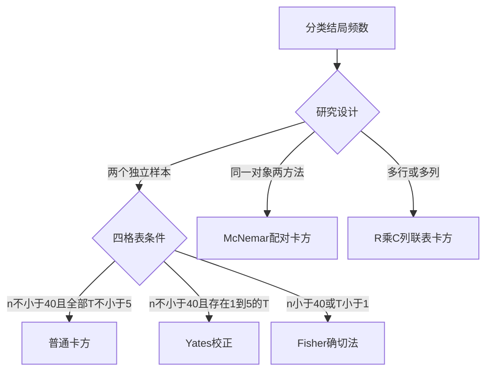

# 卡方检验与Fisher确切概率法
> [!abstract] 一句话总览
> $\chi^2$检验比较分类资料的实际频数与$H_0$下理论频数；四格表样本太小或理论频数过低时，改用Fisher确切概率法。
**教材锚点：** 第9章，教材89-100页；PDF 110-121页。四格表89-93/110-114，McNemar配对检验93-94/114-115，$R\times C$表94-97/115-118。
**前置：** [[04-定性数据、统计表与统计图]]　**后续：** [[08-非参数秩和检验]]
## 知识图

## 为什么要比较实际频数与理论频数
样本率不同不一定表示总体率不同。先假设各总体率相等，利用行、列合计算出每格“应有多少人”，再观察实际频数偏离理论频数的程度。
> [!example] 座位表类比
> 若男女与座位区无关，按总人数比例即可算出各区应有的男女数；实际座位表偏离得越大，“两变量独立”的假设越可疑。
## 基本定义与公式
理论频数：
$$T_{ij}=\frac{n_{i+}n_{+j}}n$$
Pearson统计量：
$$\chi^2=\sum\frac{(A-T)^2}{T}$$
$R\times C$表自由度：
$$\nu=(R-1)(C-1)$$

| 符号 | 含义 |
|---|---|
| $A_{ij}$ | 第$i$行第$j$列实际频数 |
| $T_{ij}$ | $H_0$下理论频数 |
| $n_{i+},n_{+j}$ | 行合计、列合计 |
| $n$ | 总例数 |

$\chi^2$越大，说明实际与理论越不吻合；给定自由度时，$\chi^2$越大，P值越小。
## 独立四格表：三条选择规则

| 条件 | 方法 |
|---|---|
| $n\ge40$且所有$T\ge5$ | Pearson普通$\chi^2$ |
| $n\ge40$且至少一格$1\le T<5$ | Yates连续性校正$\chi^2$ |
| $n<40$或任一$T<1$ | Fisher确切概率法 |

四格表专用公式：
$$\chi^2=\frac{n(ad-bc)^2}{(a+b)(c+d)(a+c)(b+d)}$$
Yates校正可写为：
$$\chi_c^2=\sum\frac{(|A-T|-0.5)^2}{T}$$
### 代表教材例题：吲达帕胺疗效
教材例9-1：对照组有效/无效为22/18，试验组31/9，$n=80$。在两总体有效率相等的$H_0$下，理论频数为26.5、13.5、26.5、13.5，均不小于5：
$$\chi^2=4.528,\qquad \nu=1,qquad P<0.05$$
认为两组总体有效率不同；结合样本率方向，试验组有效率较高。
**为什么选该法：** 两组患者独立随机分组，结局为有效/无效，且普通四格表$\chi^2$的理论频数条件满足。
## Fisher确切概率法
### 动机与直觉
连续$\chi^2$近似在小样本下可能不可靠。Fisher法固定四格表行、列合计，直接按超几何分布枚举所有可能表。
$$P_i=\frac{(a+b)!(c+d)!(a+c)!(b+d)!}{a!b!c!d!n!}$$
双侧P值累加至少与观察表同样“偏离$H_0$”的表概率；单双侧必须由研究目的预先确定。
> [!example] 教材例9-3
> 17只大鼠资料因$n<40$使用Fisher法。双侧$P=0.056684$，单侧$P=0.044467$，两者结论不同，说明不能看完数据后才改成单侧检验。
## 配对四格表：McNemar检验
同一标本接受A、B两种方法时，信息来自不一致对子$b,c$；一致格$a,d$不决定两方法阳性率之差。
$$\chi^2=\frac{(b-c)^2}{b+c}\quad(b+c\ge40)$$
$$\chi_c^2=\frac{(|b-c|-1)^2}{b+c}\quad(b+c<40),\qquad \nu=1$$
教材例9-4中$b=24,c=20$，$b+c=44$，故$\chi^2=0.364$，$P>0.05$，尚不能认为两培养基阳性培养率不同。
> [!warning] 设计不能丢
> 配对四格表不能拆成两个独立样本做普通$\chi^2$；那会忽略同一对象内的对应关系。
## $R\times C$列联表
适用于多个样本率或多个构成比。总体检验显著只说明至少两个总体率/构成比不同，不能定位所有差异；两两比较需用Bonferroni等方法调整$\alpha$。
- 任意$k$组两两比较：$m=k(k-1)/2$，教材用$\alpha'=\alpha/m$。
- $k-1$个试验组分别与同一对照组比较：$\alpha'=\alpha/(k-1)$。
### 适用条件
一般要求各格$T\ge1$，且$1\le T<5$的格子不超过总格数的$1/5$；否则考虑增加样本、按专业依据合并类别或使用$R\times C$表Fisher确切法。
有序结局若目标是比较等级高低，不宜用忽略顺序的普通$\chi^2$，应考虑[[08-非参数秩和检验]]。
## 标准分析步骤
1. 区分独立、配对及$R\times C$设计，确认使用的是频数而非百分比。
2. 写$H_0/H_1$和$\alpha$，计算每格理论频数。
3. 按$n$与$T$选择普通$\chi^2$、校正法或Fisher法。
4. 计算统计量、自由度和精确P值；报告每组分子/分母和率。
5. 总体检验显著后，只有研究问题需要时才作校正后的多重比较。
## 方法比较

| 方法 | 设计 | 信息来源 | 自由度/概率 |
|---|---|---|---|
| Pearson四格表 | 两独立组 | 四格$A-T$ | $\nu=1$ |
| Yates校正 | 两独立组、近似边界 | 连续性校正后偏离 | $\nu=1$ |
| Fisher | 小样本四格表 | 固定边际下各可能表 | 直接累计概率 |
| McNemar | 配对二分类 | 不一致对子$b,c$ | $\nu=1$ |
| $R\times C$ | 多率/多构成比 | 全部格$A-T$ | $(R-1)(C-1)$ |

## 常见误区

| 误区 | 正确认识 |
|---|---|
| 用百分比直接算$\chi^2$ | 必须使用实际频数 |
| $\chi^2$越大表示率差越大 | 统计量还受样本量和表结构影响 |
| 多组总体检验显著即任意两组不同 | 需校正多重比较 |
| 有序等级资料总用列联表$\chi^2$ | 若关心等级高低，应利用顺序信息 |
| Fisher只用于$T<5$ | 教材规则是$n<40$或$T<1$；$1\le T<5$且$n\ge40$用校正$\chi^2$ |

## 折叠自测
> [!question]- $n=58$且两格理论频数为4.34、4.66，应选什么？
> 选择Yates连续性校正四格表$\chi^2$，因为$n\ge40$且存在$1\le T<5$。

> [!question]- 同一批200人同时用两种试纸检测，应选普通四格表还是McNemar？
> McNemar配对$\chi^2$，因为两次检测来自同一对象，分析不一致对子。

> [!question]- 3×4表自由度是多少？
> $(3-1)(4-1)=6$。
## 相关笔记
- [[04-定性数据、统计表与统计图]]：率、构成比和列联表基础。
- [[08-非参数秩和检验]]：有序结局比较应利用秩次。
- [[13-研究设计、抽样与样本量]]：独立与配对设计决定检验方法。
- [[14-统计方法选择与公式速查]]：分类资料选择路径。
