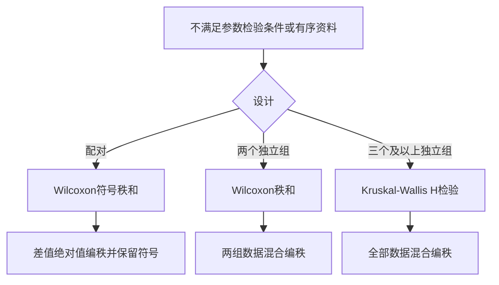

# 非参数秩和检验
> [!abstract] 一句话总览
> 秩和检验把原始值转换为大小次序，适合分布未知、明显非正态、有序或两端无确切数值的资料，但满足参数检验条件时通常不如参数法高效。
**教材锚点：** 第10章，教材101-109页；PDF 122-130页。配对符号秩和101-103/122-124，两独立样本103-105/124-126，多独立样本105-106/126-127。
**前置：** [[06-t检验与方差分析]]　**相关：** [[07-卡方检验与Fisher确切概率法]]
## 知识图

## 为什么把数值换成秩
当极端值、偏态或等级编码使均数和标准差不稳定时，保留“谁大谁小”比强行假设正态更稳健；代价是舍弃原始间距信息。
> [!example] 排名赛类比
> 100分与90分相差10分，60分与50分也相差10分；秩方法只记录名次，不假定这两个“10分”具有相同意义。它抗异常值，却也丢失了间距信息。
## 何时使用
- 总体分布未知或明显非正态，且合理变换仍不适合参数法。
- 有序或半定量资料，如疗效“痊愈/显效/有效/无效”。
- 数据两端无确切数值。
- 若正态、方差等参数条件满足，应首选t检验或ANOVA，以免检验效能降低。
## 编秩共同规则
1. 由小到大统一排序并赋秩1,2,…。
2. 相同值占据的秩次取平均秩（结）。
3. 配对符号秩和先删除差值为0的对子，$n$随之减少。
4. 结较多时使用教材给出的校正公式，避免标准误估计偏差。
## 配对：Wilcoxon符号秩和检验
### 动机、直觉与定义
$H_0:M_d=0$。若配对差值分布关于0对称，正秩和$T^+$与负秩和绝对值$T^-$应接近；偏离越大，处理差异证据越强。
步骤：算$d$→删$d=0$→按$|d|$编秩→加回正负号→求$T^+,T^-$→任选一个作为$T$并查表。
大样本近似（教材$n>50$）：
$$z=\frac{T-\frac{n(n+1)}4\pm0.5}{\sqrt{\frac{n(n+1)(2n+1)}{24}}}$$
$0.5$为连续性校正；相同秩较多时再按$\sum(t_j^3-t_j)$校正方差。
### 代表教材例题：睡眠剥夺
教材例10-1中8名志愿者正常睡眠与剥夺状态配对比较，差值秩和$T^+=35,T^-=1$，取$T=1$。查表$T_{0.05(8)}=3\sim33$，$T$在界值范围外，$P<0.05$，认为两睡眠状态注意力脱漏次数不同。
**为什么选该法：** 同一人两状态为配对设计，且例数小；检验目标是差值总体中位数是否为0。
## 两独立样本：Wilcoxon秩和检验
将两组全部$N=n_1+n_2$个观测统一编秩；样本量不等时，取较小样本对应秩和$T$。在$H_0$下其中心为$n_1(N+1)/2$。
正态近似：
$$z=\frac{T-\frac{n_1(N+1)}2\pm0.5}{\sqrt{\frac{n_1n_2(N+1)}{12}}}$$
相同秩较多时校正分母。判断哪组数值总体偏高，应比较**平均秩**，不能只比总秩和，因为秩和受组样本量影响。
> [!example] 教材例10-3
> 男性$n_1=10$、女性$n_2=13$，取男性秩和$T=87.5$；双侧界值为88-152，$T$超出范围，$P<0.05$，女性尿镉含量相对较高。
## 多个独立样本：Kruskal-Wallis H检验
$$H=\frac{12}{N(N+1)}\sum_{i=1}^k\frac{R_i^2}{n_i}-3(N+1)$$
其中$R_i$为第$i$组秩和。相同秩较多时：
$$H_c=\frac{H}{1-\frac{\sum(t_j^3-t_j)}{N^3-N}}$$
当$k>3$，或$k=3$且最小组$n_i>5$时，$H$近似服从自由度$k-1$的$\chi^2$分布。
教材例10-5：三种免疫途径$n_i=33,32,31$，校正后$H_c=12.27$，$\nu=2$，$P<0.01$；只能说总体分布位置不全相同，不能说明任意两组均不同。
## 假设、条件与解释

| 方法 | 原假设 | 主要前提/解释目标 |
|---|---|---|
| 配对符号秩和 | 差值总体中位数为0 | 差值分布对称 |
| 两独立样本秩和 | 两总体分布位置相同 | 独立；若解释位置差，通常要求分布形状相近 |
| Kruskal-Wallis | 多总体分布位置相同 | 独立；总体检验显著后需多重比较 |

教材特别指出：两样本秩和检验对分布形状差别不敏感，备择假设宜写“总体分布位置不同”，不能宣称检验了所有形状差别。
> [!warning] 非参数不等于“万能且更稳”
> 秩和检验舍弃了原始间距信息；当参数检验条件满足时改用秩方法，可能增加Ⅱ类错误、降低发现真实差异的能力。
## 标准分析步骤
1. 依据设计选配对、两个独立组或多个独立组方法。
2. 明确排序方向，处理0差值与并列秩。
3. 写$H_0/H_1$与$\alpha$，计算秩和及检验统计量。
4. 按样本量查表或用正态/$\chi^2$近似；结多时校正。
5. 报告各组中位数与四分位数、统计量、P值；显著时用平均秩说明方向。
## 与参数检验比较

| 设计 | 参数方法 | 非参数秩方法 |
|---|---|---|
| 配对两次测量 | 配对t检验 | Wilcoxon符号秩和 |
| 两独立组 | 独立样本t检验 | Wilcoxon秩和 |
| 多独立组 | 单因素ANOVA | Kruskal-Wallis |
| 主要信息 | 原始数值和间距 | 次序/秩次 |
| 优势 | 条件满足时效能较高 | 分布限制少、可处理等级资料 |

## 常见误区

| 误区 | 正确认识 |
|---|---|
| 非参数检验完全没有假设 | 仍要求正确设计、独立性，部分解释依赖分布形状 |
| 所有偏态数据都必须用秩和 | 还应考虑样本量、残差与合理变换 |
| 两独立组比较总秩和判断高低 | 应看平均秩，秩和受样本量影响 |
| K-W显著说明每两组都不同 | 只说明至少两个分布位置不同 |
| 疗效等级用普通$\chi^2$最佳 | 若研究等级高低，秩和检验利用了顺序信息 |

## 折叠自测
> [!question]- 配对差值中有3个0，原有20对，查表时$n$是多少？
> 删除0差值对子后$n=17$。

> [!question]- 两独立样本均为正态且方差齐，应优先t检验还是秩和检验？
> 优先t检验；此时秩方法只利用秩次，可能降低效能。

> [!question]- 三组K-W检验$P<0.05$能否直接指出A高于B？
> 不能；总体检验只说明分布位置不全相同，需合适的事后多重比较。
## 相关笔记
- [[06-t检验与方差分析]]：对应的参数检验及适用条件。
- [[07-卡方检验与Fisher确切概率法]]：无序分类与有序等级资料的分界。
- [[04-定性数据、统计表与统计图]]：中位数、四分位数及资料类型。
- [[14-统计方法选择与公式速查]]：参数/非参数方法选择。
