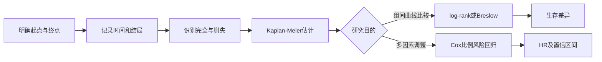

# 生存分析
> [!abstract] 一句话总览
> 生存分析把“终点是否发生”和“发生前经历多久”合并分析，并让尚未观察到终点的删失个体继续贡献有效随访信息。
**教材锚点：**第十四章，教材145-157页；PDF 166-178页。
**前置：**[[05-参数估计与假设检验]]；**方法入口：**[[14-统计方法选择与公式速查]]。
***
## 知识图

## 生存资料为什么特殊
只记录“死/活”会丢掉时间；只比较平均时间又不能正确处理随访结束、失访或其他原因退出。生存分析同时使用时间和状态，并保留右删失个体已经生存到删失时点的信息。
> [!example] 尚未读完的书
> 完全数据像已经读到结局的书，知道准确页数；右删失像借阅到期时还没读完，只知道全书至少长于已读页数。不能把它当作“已在此页结束”，也不能扔掉已读信息。
## 基本概念
**生存时间：**从预先规定的观察起点到终点事件出现的时间。起点、终点和时间单位必须明确且一致。
**完全数据：**准确观察到终点时间。**删失数据：**无法准确观察到生存时间。

|删失类型|知道什么|例子|
|---|---|---|
|左删失|事件在进入研究前已发生，确切时间未知|基线时报告既往脑卒中但不记得日期|
|右删失|起点已知，终点时间未知，只知真实时间更长|研究结束仍未复发、失访|
|区间删失|事件发生在两个检查时点之间|定期筛查间首次发现异常|

本章方法主要处理最常见的右删失。生存资料的三个特征是：时间与结局并存、可能含删失、生存时间通常不服从正态分布。
## 三个核心指标
### 生存函数
$$S(t)=P(T>t)$$
无删失时可用$t$时刻仍存活例数/观察总例数估计；含删失时用各时段条件生存概率连乘：
$$\hat S(t_k)=p_1p_2\cdots p_k=\hat S(t_{k-1})p_k$$
### 中位生存期
生存曲线上$S(t)=0.50$对应的时间，即50%个体尚未发生终点的时间。曲线未降至0.50时，中位生存期无法由当前随访估计。
### 风险函数
$$h(t)=\lim_{\Delta t\to0}\frac{P(t\le T<t+\Delta t\mid T\ge t)}{\Delta t}$$
它表示已经生存到$t$的个体在$t$时刻的瞬时事件速率，不是累计死亡概率。
## Kaplan-Meier法
K-M法是非参数法，适合小样本，或有精确生存时间的大样本。
在每个事件时点$t_i$，风险集人数$n_i$、事件数$d_i$：
$$q_i=\frac{d_i}{n_i},\qquad p_i=1-q_i$$
$$\hat S(t_i)=\prod_{j=1}^{i}p_j$$
删失时点$d_i=0$，该时点$p_i=1$，曲线不下降；但删失个体在后续风险集中被移除。K-M曲线因此呈阶梯形，只在终点事件发生时向下跳。
### 计算步骤
1. 生存时间由小到大排序；同一时点完全数据排在删失数据之前。
2. 列出每个时点的事件数$d_i$、删失数$c_i$与时点前风险人数$n_i$。
3. 计算$q_i=d_i/n_i$和$p_i=1-q_i$。
4. 连乘得到$\hat S(t_i)$，绘制阶梯曲线。
5. 需要时由曲线读取中位生存期，并报告置信区间。
## 生存曲线比较
### log-rank检验
在$H_0$“各组生存曲线相同”下，逐时点比较实际事件数与理论事件数，统计量近似服从自由度$g-1$的$\chi^2$分布：
$$\chi^2=\frac{(\sum d_{ki}-\sum T_{ki})^2}{\sum V_{ki}}$$
### Breslow检验
$$\chi^2=\frac{(\sum w_id_{ki}-\sum w_iT_{ki})^2}{\sum w_i^2V_{ki}}$$
Breslow取$w_i=n_i$，更重视近期差异；log-rank相当于$w_i=1$，相对更重视远期差异。

|比较|log-rank|Breslow|
|---|---|---|
|权重|各事件时点相同|风险集越大权重越大|
|敏感阶段|相对偏远期|偏近期|
|共同条件|比例风险关系，曲线不应明显交叉|比例风险关系，曲线不应明显交叉|

> [!warning] 曲线交叉
> 教材指出，当生存曲线交叉时，不适合用上述方法作整条生存曲线的整体比较；交叉也提示比例风险假定可能不成立。
## Cox比例风险回归
当需要同时调整多个因素时，线性回归不能处理非正态生存时间，Logistic回归又丢失时间与删失信息。Cox模型直接建模风险函数：
$$h(t,X)=h_0(t)\exp(\beta_1X_1+\cdots+\beta_mX_m)$$

|符号|含义|
|---|---|
|$h(t,X)$|给定协变量时$t$时刻风险函数|
|$h_0(t)$|所有协变量为0时的基础风险函数|
|$\beta_j$|$X_j$改变1单位时对数相对风险的改变量|
|HR|两组风险函数之比|

若$X_j$从$c_0$变到$c_1$：
$$HR_j=\exp[\beta_j(c_1-c_0)]$$
0/1暴露变量有$HR=e^{\beta_j}$。$\beta_j>0$对应$HR>1$，为危险因素；$\beta_j<0$对应$HR<1$，为保护因素。
> [!example] 同一时刻的速度比
> HR不是“最终死了多少”的比，而像两辆车在任何同一时刻的瞬时速度比。比例风险假定要求这个速度比随时间保持恒定，即使两辆车各自的速度会随时间变化。
## Cox模型条件与检验
1. 观察对象相互独立。
2. 满足比例风险（PH）假定：任意两人的HR不随时间$t$变化，协变量效应不随时间改变。
3. 起点、终点、时间单位和结局编码预先明确。
4. 尽量减少失访；删失过多可能造成偏倚。
5. 教材建议一般样本量40例以上，样本量为协变量数的5-20倍。
Cox模型不规定$h_0(t)$的具体形式，使用偏似然估计系数；系数可用似然比、Wald或Score检验，均为$\chi^2$检验。
## 教材代表例题一：K-M与log-rank
教材例14-2、14-3比较乳腺肿瘤直径$\le2$ cm组15例与$>5$ cm组21例术后复发时间（教材147-151页；PDF168-172页）。
小肿瘤组18个月时：
$$\hat S(18)=0.862\times0.917=0.790$$
两组log-rank检验：$\chi^2=6.304$，$P<0.05$，提示两条生存曲线不同，小肿瘤组生存率较高。
**为什么选此法：**比较两组含删失的精确复发时间，K-M描述曲线，log-rank检验整条曲线差异。
## 教材代表例题二：Cox回归
教材例14-4对68例肿瘤患者的年龄、病理分型、淋巴结转移、肿瘤大小、化疗和绝经作逐步Cox回归（教材152-154页；PDF173-175页）。

|因素|$\hat\beta$|HR（95%CI）|解释|
|---|---:|---|---|
|年龄|0.039|1.039（1.006-1.074）|每增加1岁，瞬时死亡风险乘1.039|
|淋巴结转移|1.768|5.860（1.878-18.290）|有转移者风险是无转移者的5.860倍|
|肿瘤大小|1.479|4.390（1.696-11.364）|编码每增加一级，风险乘4.390|
|化疗|1.064|2.897（1.151-7.295）|按本例编码解释风险差异|

**为什么选此法：**响应由生存时间和死亡/删失状态共同构成，并需同时调整多个预后因素。
## 结果报告模板
“采用Kaplan-Meier法估计生存曲线，中位生存期为$\cdots$月；两组曲线用log-rank检验比较，$\chi^2=\cdots$，$P=\cdots$。进一步建立Cox比例风险模型；控制其他协变量后，$X_j$的$HR=\cdots$（95%CI：$\cdots$-$\cdots$，$P=\cdots$）。”
## 方法比较

|方法|是否用时间|删失|多因素|主要输出|
|---|---|---|---|---|
|二分类Logistic|否|不能正确利用|可以|OR、概率|
|Kaplan-Meier|是|可以|不作多因素调整|生存曲线、中位生存期|
|log-rank/Breslow|是|可以|单因素分组比较|整条曲线差异|
|Cox回归|是|可以|可以|调整HR|

## 常见误区

|误区|正确理解|
|---|---|
|删失=终点在删失时发生|删失只说明真实生存时间超过已观察时间|
|删失病例应删除|它们在删失前仍贡献风险集信息|
|HR是累计死亡率之比|HR是瞬时风险函数之比|
|K-M曲线在删失处下降|只在事件时点下降，删失改变后续风险集|
|两条曲线明显交叉仍直接作log-rank|交叉提示整体比较和PH假定不合适|

## 自测
> [!question]- 为什么生存分析需要同时记录time和status？
> time给出随访长度，status区分终点发生与删失；缺少任何一个都不能正确利用生存信息。

> [!question]- 某因素$\beta=-0.380$，HR是多少？
> $HR=e^{-0.380}\approx0.68$，即其他条件相同时，该组瞬时事件风险为参照组的0.68倍。

> [!question]- K-M曲线何时下降？
> 仅在观察到终点事件的时点下降；纯删失时点生存概率为1，曲线不降。
## 相关笔记
- [[11-Logistic回归]]：只关心二分类结局、不使用事件时间时的模型。
- [[05-参数估计与假设检验]]：置信区间与检验的基础。
- [[13-研究设计、抽样与样本量]]：队列随访、失访控制与样本量规划。
- [[14-统计方法选择与公式速查]]：时间结局的选法入口。
