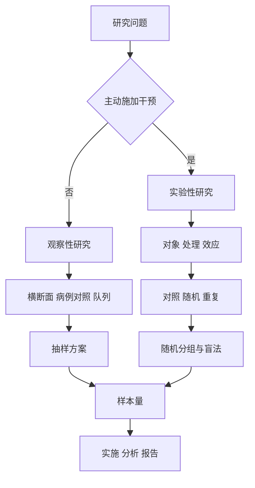

# 研究设计、抽样与样本量
> [!abstract] 一句话总览
> 统计设计先决定“怎样获得可回答问题的数据”，再决定抽样、随机、对照、样本量与分析；设计缺陷通常不能靠事后统计补救。
**教材锚点：**第十五章，教材158-176页；PDF 179-197页。
**方法入口：**[[14-统计方法选择与公式速查]]；**推断基础：**[[05-参数估计与假设检验]]。
***
## 知识图

## 先分清研究类型
观察性研究中研究者不主动施加干预，暴露在自然状态下存在；实验性研究由研究者主动施加干预，并控制非处理因素。
> [!example] 摄像机与导演
> 观察性研究像摄像机，记录现实中已经发生的暴露与结局；实验性研究像导演，按方案安排处理。前者更贴近现实但混杂更多，后者因随机、对照更利于因果解释。

|设计|时间方向|起点|主要用途|主要局限|
|---|---|---|---|---|
|横断面|一个特定时点|人群|描述现状、探索关联|暴露与结局时序不清|
|病例-对照|由果推因、回顾|病例与对照|探索罕见病危险因素|回忆偏倚、选择偏倚|
|队列|由因寻果、纵向|暴露与非暴露|发病率、病因、预后|样本大、随访长、失访|
|实验性研究|干预后观察|随机或规定处理|评价干预效应|伦理、成本与实施要求高|

## 抽样调查
抽样调查以部分样本推断总体，必须兼顾代表性与可实施性。概率抽样要求总体单位按已知概率入样；抽样框是全部抽样单位的清单。
### 四种概率抽样

|方法|怎么抽|优势|风险|
|---|---|---|---|
|单纯随机|总体编号后等概率抽$n$个|原理简单，是其他方法基础|总体大或分散时建框困难|
|系统抽样|随机起点后每隔$i=N/n$抽取|操作简便、分布均匀|总体顺序有周期或趋势时偏倚|
|整群抽样|随机抽若干群，调查群内全部个体|组织方便、省时省钱|群内相似导致误差较大|
|分层抽样|按重要特征分层，各层内再抽样|层内同质，提高精度，可层间比较|分层因素选错会失去优势|

**教材给出的一般抽样误差次序：**整群抽样 ≥ 单纯随机抽样 ≥ 系统抽样 ≥ 分层抽样。
分层追求层间差异大、层内差异小；整群则应尽量缩小群间差异、增加群数。
## 实验设计三要素
1. **研究对象：**明确纳入/排除标准，选择对处理敏感、依从性好的对象，并遵守伦理与知情同意。
2. **处理因素：**明确因素及水平，标准化剂量、次数、操作和时间；识别非处理/混杂因素。
3. **实验效应：**用观察指标表达处理结果，优先客观、灵敏、特异、准确且精密的指标。

|概念|含义|主要受什么误差影响|
|---|---|---|
|准确度|测量结果接近真实值的程度|系统误差|
|精密度|重复测量值彼此接近的程度|随机误差|

## 实验设计三原则
### 对照
对照把疾病自然变化、心理效应和操作影响从处理效应中分离出来。常见形式：空白、安慰剂、标准、实验、自身和相互对照。
### 随机化
每个受试对象有相同机会分到各组，以平衡非处理因素、避免人为分配偏倚，并为统计推断提供基础。

|随机化|特点|适用提醒|
|---|---|---|
|简单随机|不限制随机序列|小样本可能暂时组间不平衡|
|区组随机|区组内随机|保证入组过程中的人数平衡|
|分层随机|重要混杂因素分层后随机|分层因素不宜过多|
|动态随机|分配概率随现有平衡变化|控制人数及重要因素平衡|

### 重复
在相同条件下多次观察，体现为样本量和重复次数。样本过小效能不足；过大增加成本、实施困难并可能降低数据质量。
> [!warning] 随机抽样不等于随机分组
> 随机抽样解决样本对总体的代表性；随机分组解决实验组间非处理因素的均衡。两者目的和发生阶段不同。
## 临床试验关键设计
**盲法：**双盲时研究者、受试者及相关人员均不知道处理；单盲通常指受试者盲；开放试验不设盲，但仍应尽量用盲法操作减少偏倚。

|设计|结构|优势|限制|
|---|---|---|---|
|平行组|不同受试者同期接受不同处理|实施简单|通常需要更多受试者|
|交叉|同一受试者按随机顺序接受多处理|自身对照、效率高|需洗脱期，周期长，脱落影响大|
|析因|多个处理因素的组合|同时估计主效应和交互作用|组合可能带来毒副作用|
|适应性|按预设规则利用累积数据调整试验|可提高试验效率|须揭盲前预设并控制Ⅰ类错误|

### 优效、非劣效与等效

|目的|核心判断|
|---|---|
|优效|试验处理是否优于对照|
|非劣效|单侧置信区间下限$CL>-\Delta$|
|等效|双侧置信区间完全位于$(-\Delta,\Delta)$|

$\Delta$必须是预先规定、具有临床意义的界值，不能看结果后再选择。
## 样本量：先定四个要素
1. 检验水准$\alpha$越小，样本量越大。
2. 检验效能$1-\beta$越大，样本量越大；教材建议通常至少0.80。
3. 要检出的总体差值$\delta$越小，样本量越大。
4. 总体变异越大，样本量越大；标准差、发生率等由文献或预实验估计。
### 参数估计
总体均数的单纯随机样本量：
$$n=\left(\frac{z_{\alpha/2}\sigma}{\delta}\right)^2$$
总体率估计：
$$n=\frac{z_{\alpha/2}^2P(1-P)}{\delta^2}$$

|符号|含义|
|---|---|
|$\delta$|允许误差或希望检出的最小差值|
|$\sigma$|总体标准差估计|
|$P$|总体率估计|
|$z_{\alpha/2}$|双侧置信度对应的标准正态临界值|

教材还分别给出成组/配对病例-对照、队列、两均数和两率比较公式。实际选择必须与资料类型、设计类型和分配比例一致，不能只套一个通用公式。
## 教材代表例题：贫血患病率调查
教材例15-1（教材163页；PDF184页）：既往估计学龄儿童贫血患病率$P=0.15$，允许误差$\delta=0.03$，双侧$\alpha=0.05$：
$$n=\frac{1.96^2\times0.15\times(1-0.15)}{0.03^2}=545$$
因此按单纯随机抽样至少调查545名儿童。
**为什么用此公式：**目标是估计一个总体率，不是比较两个率；输入是预期患病率、允许误差和置信度。
## 诊断试验设计与指标
诊断研究必须预先确定金标准；患病组应涵盖典型与非典型病例，对照应具有临床鉴别价值；新方法与金标准对每名对象都实施，并相互盲法判读。
设真阳性$a$、假阴性$b$、假阳性$c$、真阴性$d$：
$$Se=\frac{a}{a+b},\qquad Sp=\frac{d}{c+d}$$
$$PV^+=\frac{\pi Se}{\pi Se+(1-\pi)(1-Sp)}$$
$$PV^-=\frac{(1-\pi)Sp}{(1-\pi)Sp+\pi(1-Se)}$$

|指标|条件式问题|是否受患病率影响|
|---|---|---|
|灵敏度|已患病者中，试验阳性的比例？|否|
|特异度|未患病者中，试验阴性的比例？|否|
|阳性预测值|试验阳性者中，真正患病的概率？|是|
|阴性预测值|试验阴性者中，真正未患病的概率？|是|

连续或等级诊断指标在不同阈值下产生多组$Se$和$Sp$。ROC曲线横轴为$1-Sp$，纵轴为$Se$；AUC综合评价准确性。教材例15-7用HbA1c数据说明，最佳阈值可取$Se+Sp$最大处。
## 研究设计步骤
1. 把临床问题写成对象、因素/干预、结局和时间框架。
2. 判断能否主动干预，据此选择观察性或实验性设计。
3. 明确目标总体、抽样框和抽样方案；实验研究再确定对照、随机和盲法。
4. 固定主要结局、测量方法、随访起终点和质量控制。
5. 按设计、资料类型、$\alpha$、效能、目标差异与变异估计样本量，并考虑失访/无效数据。
6. 在揭盲和分析前预先规定统计方法、比较类型、亚组与期中分析规则。
## 结果报告模板
“本研究采用$\cdots$设计，目标总体为$\cdots$，以$\cdots$方法抽样/随机分组，主要结局为$\cdots$。样本量按双侧$\alpha=\cdots$、效能$1-\beta=\cdots$、预期差值/率$\cdots$及变异$\cdots$估计，每组需$\cdots$例；考虑$\cdots\%$脱落后计划纳入$\cdots$例。”
## 常见误区

|误区|正确理解|
|---|---|
|观察到关联即可证明因果|观察性研究易受混杂和偏倚影响|
|按就诊顺序轮流分组就是随机|可预测的分配不是真正随机化|
|样本越大越好|过大会浪费资源并可能降低数据质量|
|先看结果再定主要结局或$\Delta$|会增加结果任意性和偏倚|
|阳性预测值是诊断方法固有属性|它还随受检人群患病率变化|
|设计缺陷可由多元模型完全修复|统计校正有限，严格设计优先|

## 自测
> [!question]- 病例-对照与队列研究最关键的方向差异是什么？
> 病例-对照从结局出发回顾暴露，是“由果推因”；队列从暴露出发随访结局，是“由因寻果”。

> [!question]- 为什么$\alpha$减小或效能提高会增加样本量？
> 两者都要求在更严格的错误控制下识别真实差异，需要更多信息来降低不确定性。

> [!question]- 同一诊断方法换到低患病率人群，阳性预测值通常如何变化？
> 通常下降，因为阳性者中的假阳性占比会增加；灵敏度和特异度本身不因此定义性改变。
## 相关笔记
- [[05-参数估计与假设检验]]：$\alpha$、$\beta$、效能和置信区间。
- [[07-卡方检验与Fisher确切概率法]]：率比较与诊断四格表。
- [[12-生存分析]]：队列随访、删失和时间结局。
- [[14-统计方法选择与公式速查]]：设计完成后的方法选择入口。
