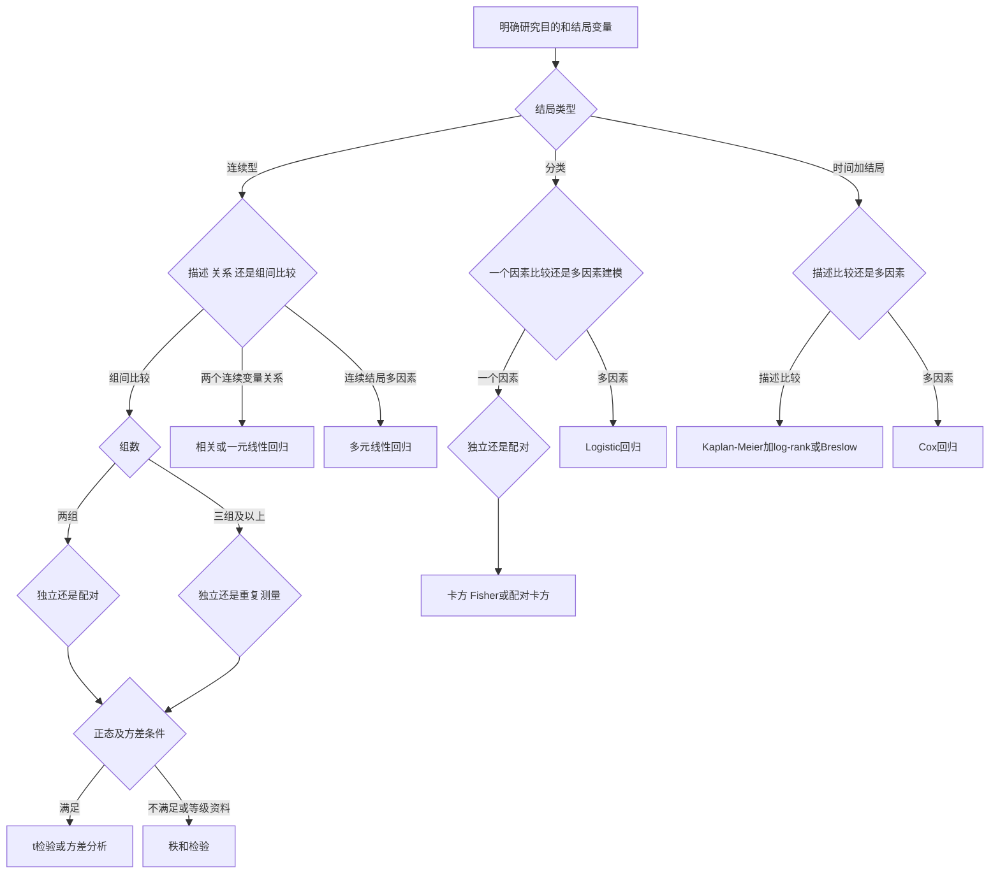
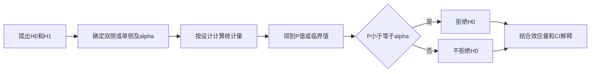

# 统计方法选择与公式速查
> [!abstract] 一句话总览
> 统计方法不是由“有几个数字”决定，而由研究目的、结局变量类型、设计关系、组数及分布/方差条件共同决定。
**教材锚点：**全书综合，教材1-176页；PDF 22-197页；重点串联第3-15章。
**索引：**[[00-医学统计学索引]]；**设计前置：**[[13-研究设计、抽样与样本量]]。
***
## 方法选择总决策树

## 第一步：锁定五个问题
1. **目的：** 描述、参数估计、组间比较、相关/回归，还是预测？
2. **结局类型：** 连续、分类，还是生存时间+结局？
3. **研究设计：** 独立组、配对/自身前后，还是重复测量？
4. **组数：** 单样本、两组、三组及以上？
5. **条件：** 正态、方差齐性、独立性、线性、比例风险等是否满足？
> [!warning] 先定结局，再看自变量
> “年龄是连续变量”不能决定方法；若结局是血压，可用线性模型，若结局是患病与否，用Logistic，若结局是发病时间，用Cox。
## 描述性统计速查

|资料|集中趋势|离散趋势|图形|
|---|---|---|---|
|近似对称连续资料|均数$\bar X$|标准差$S$|直方图、箱线图|
|明显偏态连续资料|中位数$M$|四分位数间距|箱线图|
|分类资料|频数、率、构成比|-|条图、圆图|
|时间结局|中位生存期、生存率|置信区间|K-M曲线|
$$\bar X=\frac{\sum X_i}{n},\qquad S=\sqrt{\frac{\sum(X_i-\bar X)^2}{n-1}}$$
## 组间比较速查

|结局|设计/组数|条件|方法|
|---|---|---|---|
|连续|单样本|正态|单样本$t$检验|
|连续|两独立组|正态、独立；按教材检查方差条件|两独立样本$t$检验|
|连续|配对/前后|差值近似正态|配对$t$检验|
|连续|多独立组|正态、独立、方差齐|单因素方差分析|
|连续|多组/等级且条件不满足|独立|秩和检验|
|分类|两组或多组|理论频数满足要求|$\chi^2$检验|
|分类|四格表小样本或理论频数不足|独立|Fisher确切概率法|
|分类|配对二分类|配对|配对四格表$\chi^2$检验|
|时间+结局|两组或多组|比例风险、曲线不交叉|log-rank或Breslow|
> [!example] 同一个“治疗前后”如何选法
> 血压前后差值近似正态：配对$t$检验；疗效有效/无效为配对二分类：配对$\chi^2$；复发时间且含删失：K-M加曲线比较。设计相同，结局类型不同，方法就不同。
## 关系与回归速查

|问题|结局|自变量|方法|核心量|
|---|---|---|---|---|
|两个连续变量线性相关程度|连续|一个连续|Pearson相关|$r$|
|由一个变量解释/预测另一个|连续|一个|一元线性回归|斜率$b$|
|调整多个因素后的连续结局|连续|多个|多元线性回归|偏回归系数$b_j$|
|调整多个因素后的分类结局|分类|多个|Logistic回归|OR=$e^{b_j}$|
|调整多个因素后的时间结局|时间+状态|多个|Cox回归|HR=$e^{b_j}$|

**相关不等于回归：** 相关对称地描述线性密切程度；回归区分因变量和自变量，用于解释或预测。相关也不自动证明因果。
## 参数检验骨架
多数检验都遵循同一逻辑：

“不拒绝$H_0$”不等于证明$H_0$正确；$P$值也不表示$H_0$为真的概率。
## 高频公式
### 均数与率的标准误
$$S_{\bar X}=\frac{S}{\sqrt n},\qquad S_p=\sqrt{\frac{p(1-p)}{n}}$$
### $t$统计量的通式
$$t=\frac{样本统计量-假设参数}{统计量的标准误}$$
配对$t$检验实质上对每对差值$d$做单样本$t$检验：
$$t=\frac{\bar d}{S_d/\sqrt n},\quad \nu=n-1$$
### 方差分析
$$SS_{总}=SS_{组间}+SS_{组内},\qquad F=\frac{MS_{组间}}{MS_{组内}}$$
整体$F$显著只说明至少两组总体均数不同，具体组别差异需采用合适的多重比较。
### 卡方检验
$$\chi^2=\sum\frac{(A-T)^2}{T}$$
$A$为实际频数，$T$为$H_0$下理论频数；理论频数不足时转向校正或Fisher法，不能机械套普通$\chi^2$。
### 线性回归
$$\hat Y=b_0+b_1X_1+\cdots+b_mX_m$$
$$F=\frac{SS_{回归}/m}{SS_{残差}/(n-m-1)},\qquad R^2=1-\frac{SS_{残差}}{SS_{总}}$$
### Logistic回归
$$\ln\frac{P}{1-P}=\beta_0+\sum_{j=1}^m\beta_jX_j$$
$$OR_j=\exp[\beta_j(c_1-c_0)]$$
### 生存分析与Cox
$$\hat S(t_i)=\prod_{j=1}^{i}\left(1-\frac{d_j}{n_j}\right)$$
$$h(t,X)=h_0(t)\exp\left(\sum_{j=1}^m\beta_jX_j\right),\qquad HR_j=e^{\beta_j}$$
### 参数估计样本量
$$n_{均数}=\left(\frac{z_{\alpha/2}\sigma}{\delta}\right)^2,qquad n_{率}=\frac{z_{\alpha/2}^2P(1-P)}{\delta^2}$$
## 模型条件速查

|方法|教材强调的主要条件/检查|
|---|---|
|$t$检验/方差分析|独立性、正态性及相应设计下的方差条件|
|多元线性回归|线性、独立、残差正态、等方差；警惕共线|
|Logistic回归|分类结局、独立或按匹配选择条件模型、足够样本量、正确编码|
|log-rank/Breslow|比例风险关系，生存曲线不交叉|
|Cox回归|独立、PH假定、协变量效应不随时间变|

## 报告速查
### 连续资料组间比较
“A组为$\bar X\pm S$，B组为$\bar X\pm S$；采用$\cdots$检验，统计量$=\cdots$，自由度$=\cdots$，$P=\cdots$。两组均数差为$\cdots$（95%CI：$\cdots$-$\cdots$）。”
### 分类资料
“A组事件率为$\cdots$，B组为$\cdots$；$\chi^2=\cdots$，$\nu=\cdots$，$P=\cdots$；效应量OR/RR为$\cdots$（95%CI：$\cdots$-$\cdots$）。”
### 多元线性回归
“模型整体$F(m,n-m-1)=\cdots$，$P=\cdots$，校正$R^2=\cdots$；控制其他变量后，$X_j$每增加1单位，$Y$平均改变$b_j$单位（$P=\cdots$）。”
### Logistic回归
“以阳性结局=1建立模型；控制其他变量后，$X_j$的OR=$\cdots$（95%CI：$\cdots$-$\cdots$，$P=\cdots$），参照组为$\cdots$。”
### 生存分析
“K-M中位生存期为$\cdots$；log-rank $\chi^2=\cdots$，$P=\cdots$。Cox模型中$X_j$的HR=$\cdots$（95%CI：$\cdots$-$\cdots$，$P=\cdots$）。”
## 易混方法立即比较

|易混点|方法A|方法B|关键分界|
|---|---|---|---|
|独立$t$ vs 配对$t$|两组不同对象|同一对象前后或匹配对|观测是否成对相关|
|$t$检验 vs 秩和|比较位置参数，条件较强|基于秩，适合偏态/等级|分布条件与资料尺度|
|$\chi^2$ vs Fisher|近似法，依赖理论频数|确切概率法|样本与理论频数|
|相关 vs 回归|对称关联|有方向的解释/预测|是否指定因变量|
|Logistic vs Cox|分类结局，不用时间|时间+结局，可含删失|是否保留事件时间|
|OR vs HR|发生比数之比|瞬时风险函数之比|模型与时间维度|

## 选法与分析步骤
1. 写清一个主要研究问题和一个主要结局。
2. 判断结局尺度，再标记独立/配对、组数和是否含随访时间。
3. 依据数据图形和设计检查方法条件；条件不满足时选择教材给出的非参数或确切方法。
4. 先描述数据，再做推断；模型分析先报告整体，再报告系数和效应量。
5. 同时报告效应量、置信区间和$P$值，结合临床意义解释。
6. 保留变量编码、参照组、单双侧、$\alpha$和分析集等可复核信息。
## 教材代表例题：结局类型决定方法
教材用三类实例展示同一个选法原则：
例12-2以糖化血红蛋白HbA1c这一连续结局建立多元线性回归（教材125-127页；PDF146-148页）；
例13-1以慢性心衰不良结局“发生/未发生”建立Logistic回归（教材132-137页；PDF153-158页）；
例14-2至14-4以乳腺癌复发时间或肿瘤患者死亡时间及删失状态作K-M、曲线比较与Cox回归（教材147-154页；PDF168-175页）。
**为什么分别选这些方法：** 连续结局关注条件均数及其变化，用线性模型；二分类结局关注发生比数，用Logistic；时间结局还包含删失信息，需用生存分析。方法首先由结局结构决定，再由单因素/多因素和研究设计细化。
## 常见误区

|误区|纠正|
|---|---|
|只看正态性，不看独立/配对设计|设计关系先于分布选择|
|三组分别做多次$t$检验|先做整体方差分析并控制多重比较|
|$P<0.05$就有临床意义|还需效应量、CI和专业阈值|
|非显著等于两组相同|只能说证据不足以拒绝$H_0$|
|模型系数不写单位和参照组|系数、OR、HR都依赖编码和单位|
|用Logistic处理含删失的随访时间|会丢失时间并错误处理删失，应考虑生存分析|

## 自测
> [!question]- 30名患者治疗前后收缩压比较，差值近似正态，选什么？
> 配对$t$检验，因为同一患者前后观测成对，分析对象是差值。

> [!question]- 三个独立治疗组疗效为有效/无效，选什么？
> 先用$R\times C$列联表$\chi^2$检验；若理论频数条件不足，考虑确切概率法。

> [!question]- 结局为复发时间，部分患者随访结束仍未复发，需调整多个因素，选什么？
> 用Cox比例风险回归，并检查PH假定；描述可先用K-M曲线。

> [!question]- 两个连续变量显著相关，能否证明一个导致另一个？
> 不能。相关只说明样本中的线性关联，因果解释仍依赖研究设计和对混杂的控制。
## 相关笔记
- [[05-参数估计与假设检验]]：所有推断的共同逻辑。
- [[06-t检验与方差分析]]：连续资料均数比较。
- [[07-卡方检验与Fisher确切概率法]]：分类资料比较。
- [[08-非参数秩和检验]]：条件不满足或等级资料。
- [[10-多元线性回归]]、[[11-Logistic回归]]、[[12-生存分析]]：三类多变量结局模型。
- [[13-研究设计、抽样与样本量]]：选法之前先保证数据来自合理设计。
