# Day 1｜贫血与红细胞逐页锚定冲刺讲义
## 解析摘要
- **模式**：经自动判定：临床分8 vs 基础分2，采用**临床主模板**；遗传学与机制内容作为子节嵌入。主线为“临床诊断树＋实验室横向鉴别＋必要机制推导”。
- **今日范围**：贫血总诊断、缺铁／巨幼、溶血、地贫／G6PD、血小板功能、血友病与血小板无力症。
- **逻辑模板**：贫血总论用鉴别诊断模板；地贫、G6PD与遗传性出血病用“机制→表现→检查”完整疾病单元；血小板部分用生理机制桥接功能检验。
- **重点分级**：⭐⭐⭐ 12组；⭐⭐ 7组；⭐ 3组。
- **视觉元素**：机制图6幅、诊断树4幅、横向鉴别表8张；少量折叠自检，不设独立题库。
- **预估精读**：约120分钟；主动回忆与病例训练按文末日程执行。
- **来源限制**：只写四份指定课件中可提取或可可靠辨认的内容；形态图无法仅凭文本判读处均提示回看原页。
## 1. 8小时使用法：先搭树，再回忆，再进病例
📎 课件原文：贫血总论P26-29；实验诊断2023版P15；04_红细胞疾病_贫血与血小板实验诊断.pptxP18-20、P42
### 1.1 精读2小时
1. **0-25 min**：贫血是否存在、严重度、MCV/MCH/MCHC、RET。
2. **25-50 min**：缺铁与巨幼性贫血；重点抓“造血原料不足”与检测项目。
3. **50-80 min**：溶血总论、膜／酶／血红蛋白／免疫四类检验。
4. **80-105 min**：地贫与G6PD，从遗传缺陷推到实验室表型。
5. **105-120 min**：血小板功能、血友病、血小板无力症。
### 1.2 主动回忆3小时
- **闭卷默画**：贫血五步诊断树、溶血四类病因检验树、地贫三级检测流程、血小板黏附—聚集—释放图。
- **闭卷口述**：每个⭐⭐⭐模块用“定义→机制→关键检查→最易混淆点”讲1遍。
- **折叠自检**：只做本文嵌入题；答错后回到对应页码锚点，不扩展课件外考点。
### 1.3 病例训练3小时
- **第1小时**：先判“是不是贫血、严重度、细胞大小、骨髓反应”。
- **第2小时**：对小细胞贫血走缺铁／地贫分流；对黄疸、脾大走溶血分流。
- **第3小时**：把出血病例先分“凝血因子问题”与“血小板功能问题”，再用课件检查收口。
## 2. 来源边界与锚点图例
- `📎 课件原文：`直接来自标题、正文、图注或可提取标签。
- `🖼 课件图像解读：`仅转写清晰图像中的客观标签、数值与箭头关系。
- `📖 教材解释：`本文尽量不用；如出现，只解释课件已经出现的术语，不新增疾病、阈值或治疗方案。
- `⚠️ 图像未可靠识别：`必须回看指定原页；本文不根据模糊形态猜诊断。
### 本文使用的权威来源名与简称
- **实验诊断总论**：`01_基础总论_血液系统疾病实验诊断.pptx`
- **贫血总论**：`03_红细胞疾病_贫血总论.pptx`
- **贫血与血小板实验诊断**：`04_红细胞疾病_贫血与血小板实验诊断.pptx`
- **遗传性贫血与出血病**：`05_红细胞疾病_遗传性贫血与出血病.pdf`
## 3. 贫血总诊断：五步树必须闭眼画出 ⭐⭐⭐
📎 课件原文：实验诊断2023版P7、P9-16、P23、P27；贫血总论P7-8、P10-15、P26-29、P41-43；04_红细胞疾病_贫血与血小板实验诊断.pptxP14、P16-22、P42
### 3.1 定义与“先确认”
- 贫血指单位容积循环血液中**Hb浓度、RBC数量及HCT低于本地区相同年龄、性别人群参考下限**；临床常以Hb代表。
- 我国海平面地区课件标准：成年男性Hb＜120 g/L；成年非妊娠女性Hb＜110 g/L；妊娠期女性Hb＜100 g/L。
- 实验诊断课件还列出成年男性／女性：Hct＜0.40／＜0.35；RBC＜4.0／＜3.5×10¹²/L。
- 贫血总论提醒：婴儿、儿童与妊娠期女性Hb较成人低；久居高原者Hb正常值较海平面居民高；血液稀释或浓缩会影响判断。
> [!NOTE] 📌 请注意
> “面色苍白”可提示贫血，但贫血总论P19明确说它主观、并非可靠排除依据。第一步应回到Hb、RBC、HCT，而不是只看脸色。

### 3.2 临床表现只用于建立怀疑，不代替化验
📎 课件原文：实验诊断2023版P7；贫血总论P16-25；04_红细胞疾病_贫血与血小板实验诊断.pptxP14
- 一般：乏力、无力、皮肤黏膜和甲床苍白。
- 神经：头晕、目眩、耳鸣、头痛；严重者可有意识障碍。
- 呼吸循环：心悸、心率增快、呼吸加深或气促；可见高流量杂音、洪脉、心脏扩大，重者心力衰竭。
- 消化：食欲减退、恶心、消化不良、腹胀、腹泻或便秘；课件还列异嗜症、镜面舌。
- 泌尿生殖：肾浓缩功能减退、多尿、蛋白尿及轻微肾功能异常。
- 特异线索：溶血性贫血可见黄疸、脾大；缺铁可见匙状甲、吞咽困难；B12或叶酸缺乏可见萎缩性舌炎、口角炎。
- 乏力程度受5个因素影响：贫血病因、携氧能力下降程度、血容量下降程度、发生速度、机体代偿与耐受能力。
### 3.3 五步诊断树
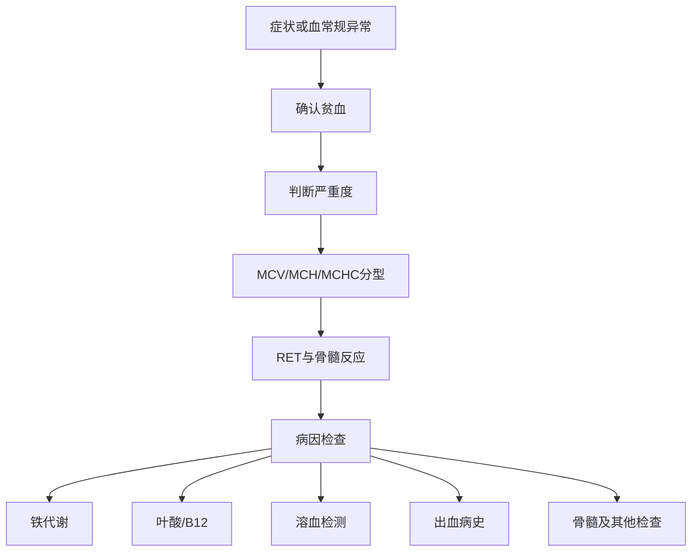
### 3.4 严重度：同一组课件存在边界写法差异
📎 课件原文：实验诊断2023版P10、P15、P19、P21、P23；04_红细胞疾病_贫血与血小板实验诊断.pptxP17；贫血总论P12

| 分度 | 独立分度页（2023 P10／2026 P17） | 综合策略页（2023 P15等） |
|---|---:|---:|
| 极重度 | Hb＜30 g/L | Hb＜30 g/L |
| 重度 | 31-60 g/L | 30-59 g/L |
| 中度 | 61-90 g/L | 60-89 g/L |
| 轻度 | ＞90 g/L | 90-120 g/L |
> [!WARNING] ⚠️ 常见疑问
> Q：边界到底按哪一版？
> A：课件内部写法不完全一致，本文不擅自统一。作答时应按授课教师最终口径；复习时记住共同核心：Hb越低，贫血越重，＜30 g/L均列为极重度。

### 3.5 形态学分型：用红细胞平均指数推病因方向
📎 课件原文：实验诊断2023版P11；04_红细胞疾病_贫血与血小板实验诊断.pptxP18；贫血总论P10-11、P28、P32-33

| 类型 | MCV (fL) | MCH (pg) | MCHC (g/L) | 课件列出的方向 |
|---|---:|---:|---:|---|
| 正细胞性 | 80-100 | 27-34 | 320-360 | 急性失血、溶血性贫血、再生障碍性贫血、白血病 |
| 小细胞低色素性 | ＜80 | ＜26 | ＜320 | 缺铁性贫血、铁粒幼细胞性贫血、血红蛋白病 |
| 单纯小细胞性 | ＜80 | ＜26 | 320-360 | 感染、中毒、尿毒症 |
| 大细胞性 | ＞100 | ＞34 | 320-360 | 维生素B12或叶酸缺乏 |
> [!NOTE] 📌 请注意
> MCV/MCH/MCHC是“分流器”，不是病因确诊。课件总策略仍要求继续看RET／骨髓反应，再做铁代谢、叶酸B12或溶血等病因检查。

### 3.6 RET与骨髓：判断红系代偿
📎 课件原文：04_红细胞疾病_贫血与血小板实验诊断.pptxP10、P19；实验诊断2023版P12-13；贫血总论P27、P29、P41-42
- RET（reticulocyte，网织红细胞）是晚幼红细胞脱核至成熟红细胞之间的过渡细胞；煌焦油蓝染色后，残存RNA呈蓝色颗粒与网状结构。
- RET计数间接反映骨髓红系增生／对贫血的代偿。
- 骨髓涂片看增生程度、细胞成分、比例与形态；活检看造血组织结构、增生程度与肿瘤性改变等。
- 课件诊断意见示例包括：增生性贫血、考虑溶血、考虑缺铁、巨幼细胞性贫血、再生障碍性贫血、纯红再障。
⚠️ 图像未可靠识别：贫血总论P30-40含多种红细胞形态照片；P42含再障／巨幼骨髓图；04_红细胞疾病_贫血与血小板实验诊断.pptxP24、P26为骨髓或铁染色图。本文不凭缩略图承担形态识别，训练时必须回看原页。
### 3.7 本模块小结与自检
> [!SUMMARY] 📝 核心要点
> - 先用Hb/RBC/HCT确认，再分严重度。
> - MCV/MCH/MCHC给病因方向；RET／骨髓告诉你“骨髓是否在回应”。
> - 最后才进入铁、叶酸/B12、溶血、出血史或骨髓病因检查。

不看上文，口述贫血五步诊断主线。
> [!QUESTION]- 参考思路
> 确认贫血→判断程度→按MCV/MCH/MCHC分型→用RET和骨髓判断增生／代偿→做针对性病因检查。

## 4. 缺铁性贫血：小细胞低色素＋铁储备耗尽 ⭐⭐⭐
📎 课件原文：04_红细胞疾病_贫血与血小板实验诊断.pptxP21-24；实验诊断2023版P16；贫血总论P20、P23、P32、P43、P46
### 4.1 定义与表现钩子
- 缺铁性贫血（IDA）指体内铁储备耗尽，导致Hb合成不足，引起小细胞低色素性贫血；课件称其为临床最常见贫血类型。
- 表现线索：匙状甲；吞咽困难（咽蹼，Paterson-Kelly综合征）；贫血总论还列异嗜症、镜面舌。
- 对因治疗原则：补铁并治疗导致缺铁的原发病。
### 4.2 检查项目
- 铁蛋白（SF）、血清铁（SI）、总铁结合力（TIBC）、转铁蛋白、可溶性转铁蛋白受体（sTfR）。
- 骨髓铁染色观察细胞内铁与细胞外铁。
🖼 课件图像解读：04_红细胞疾病_贫血与血小板实验诊断.pptxP23“铁相关指标在疾病中的应用”图可辨认如下：

| 指标 | 核心意义 | IDA | 慢性病贫血ACD | 铁过载／溶血 |
|---|---|---:|---:|---:|
| SI | 血液循环中游离铁 | ↓ | ↓ | ↑ |
| TIBC | 转铁蛋白结合铁的总能力 | ↑ | ↓ | ↓ |
| TS | 铁转运利用效率 | ↓↓ | ↓ | ↑ |
| SF | 储存铁金标准 | ↓ | 正常／↑ | ↑↑↑ |
| sTfR | 细胞缺铁敏感指标 | ↑ | 正常 | 正常／↓ |
| 细胞内铁 | 与铁利用相关 | ↓ | 正常／↓ | ↑ |
| 细胞外铁 | 储存铁 | ↓ | 正常／↑ | ↑↑↑ |
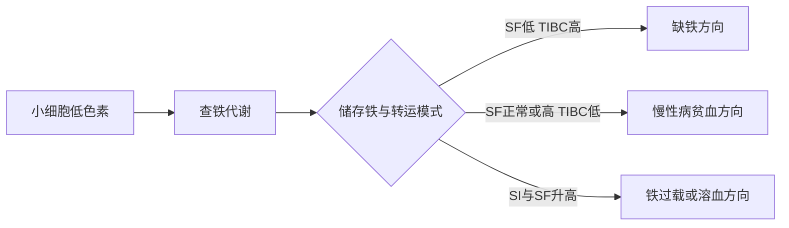
> [!WARNING] ⚠️ 常见疑问
> Q：小细胞低色素就等于缺铁吗？
> A：不等于。课件同时把地贫、铁粒幼细胞性贫血和血红蛋白病列入小细胞／低色素方向，必须用铁代谢及后续检查分流。

> [!SUMMARY] 📝 核心要点
> 缺铁的抓手不是单个“血清铁低”，而是课件P23给出的组合：SI↓、TIBC↑、TS↓↓、SF↓、sTfR↑，并可结合骨髓内外铁。

闭卷对比IDA与ACD的SI、TIBC、SF。
> [!QUESTION]- 参考思路
> 两者SI均可下降；IDA为TIBC升高、SF下降，ACD为TIBC下降、SF正常或升高。

## 5. 巨幼细胞性贫血：DNA合成障碍与大细胞方向 ⭐⭐⭐
📎 课件原文：04_红细胞疾病_贫血与血小板实验诊断.pptxP25-26；实验诊断2023版P16；贫血总论P11、P14、P21-22、P33、P42-43、P46
### 5.1 机制主线
- 叶酸或维生素B12缺乏→细胞DNA合成障碍→红细胞核发育滞后、体积增大→大细胞性贫血。
- 可伴粒细胞及巨核细胞巨幼样变。
- 形态分型页把MCV＞100 fL、MCH＞34 pg、MCHC 320-360 g/L列入大细胞性方向。
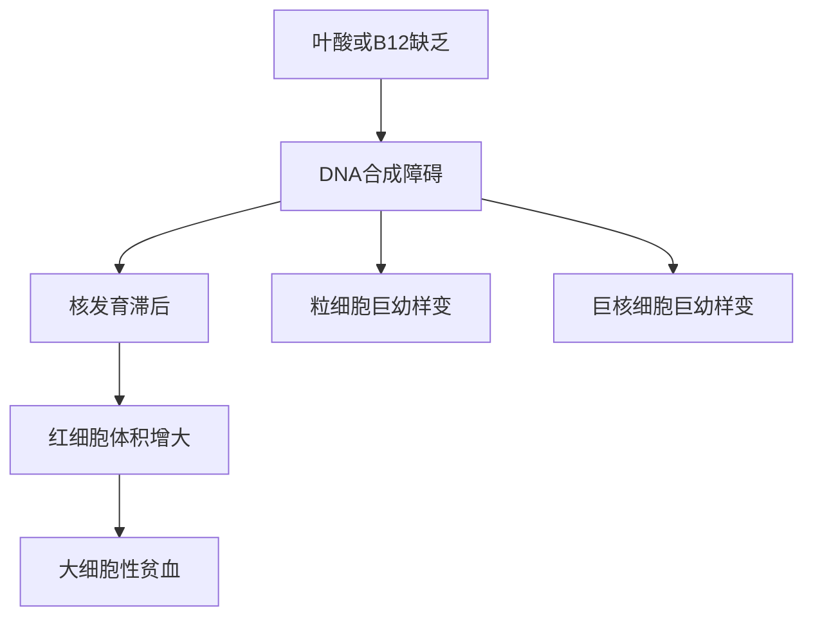
### 5.2 表现与检查
- 萎缩性舌炎、口角炎：贫血总论指出两者在维生素B12和叶酸缺乏时均可见。
- 叶酸检测：课件列化学发光法常规筛查。
- 维生素B12检测：课件列化学发光法。
- 对因治疗原则：补充叶酸或维生素B12。
⚠️ 图像未可靠识别：贫血总论P33的大红细胞图、P42巨幼骨髓图及04_红细胞疾病_贫血与血小板实验诊断.pptxP26骨髓图需回看原页；本文不根据单幅缩略图自行命名细胞阶段。
> [!NOTE] 📌 请注意
> 课件给出的核心是“DNA合成障碍→核发育滞后”，不要只背“大细胞”。这条链能同时解释红系以及粒细胞、巨核细胞的巨幼样改变。

> [!SUMMARY] 📝 核心要点
> 大细胞方向＋叶酸/B12检测；机制核心为DNA合成障碍，而不是Hb合成不足。

## 6. 溶血性贫血：先证明破坏，再按缺陷位置追因 ⭐⭐⭐
📎 课件原文：04_红细胞疾病_贫血与血小板实验诊断.pptxP27-40；实验诊断2023版P17-27；贫血总论P14-15、P43、P46
### 6.1 定义与部位
- 溶血是红细胞遭破坏、寿命缩短的过程。
- **血管内溶血**：红细胞在血管内受损、破裂，释放游离Hb。
- **血管外溶血**：单核巨噬细胞系统吞噬红细胞并分解Hb，形成珠蛋白与血红素（铁、卟啉）。
- 临床钩子：黄疸、脾大；实验诊断2023版病例还给出面色蜡黄、肝脾肿大、长期补铁无效。
### 6.2 病因检验四分法
📎 课件原文：04_红细胞疾病_贫血与血小板实验诊断.pptxP28-39；贫血总论P43
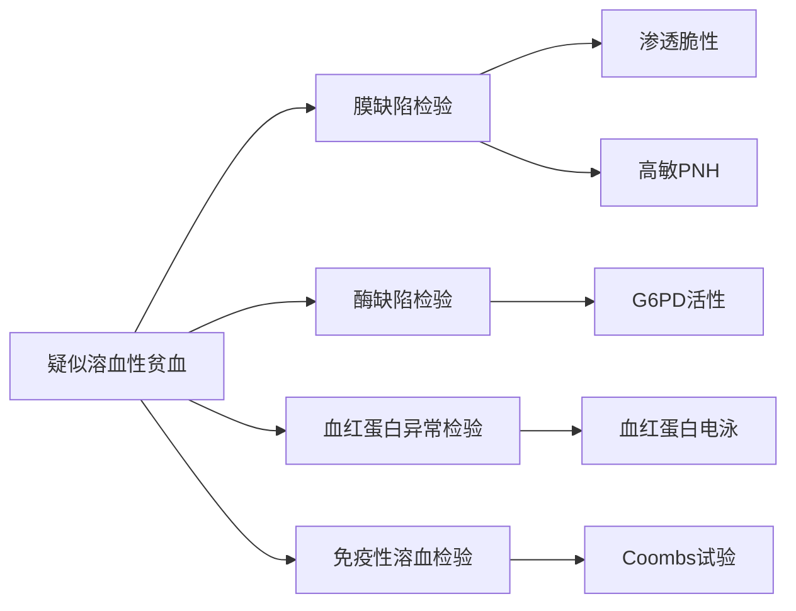
### 6.3 红细胞膜缺陷检验
**红细胞渗透脆性试验**（2026 P31-33）
- 原理：观察红细胞在不同浓度低渗NaCl溶液中的溶血，反映其对低渗环境的抵抗力。
- 课件原文写道：“开始溶血的NaCl浓度愈小，红细胞抵抗力愈小，渗透脆性增高；反之抵抗力增大、脆性减低。”该句的浓度—抵抗力表述可能引起理解冲突，本文不擅自改写，复习时以教师课堂解释为准。
- 参考范围：开始溶血3.8-4.6 g/L NaCl；完全溶血2.8-3.2 g/L NaCl。
- 脆性增高：遗传性球形红细胞增多症、遗传性椭圆形红细胞增多症、部分自身免疫性溶血性贫血、遗传性口形红细胞增多症等。
- 脆性减低：珠蛋白生成障碍性贫血、血红蛋白病、低色素性贫血、阻塞性黄疸、脾切除术后、肝炎、肝硬化、肝癌等。
**高敏PNH实验**（2026 P34）
- 流式细胞术检测细胞膜GPI-anchor连接蛋白是否减低／缺乏。
- CD55/CD59荧光抗体作探针；课件列其为PNH诊断金标准。
- 参考范围：CD55/CD59阴性红细胞＜5%，阴性粒细胞＜10%。
- 不明原因全血细胞减少、获得性骨髓衰竭性疾病、伴异常体征的血栓形成患者应筛查PNH克隆。
### 6.4 酶、血红蛋白与免疫检验
**G6PD活性**（2026 P36）
- G6PD催化体系生成NADPH；根据340 nm波长处吸光度变化计算单位时间NADPH生成量。
- 参考值：(12.1±2.09) U/gHb；意义：诊断蚕豆病。
**血红蛋白电泳**（2026 P37-38）
- 不同Hb因电荷／相对分子量不同，泳动方向和速度不同，形成不同区带并作半定量分析。
- 参考范围：HbA＞95%，HbA2 2.0%-3.5%，HbF＜2%。
- 作用：发现HbH、E、S、D等异常Hb；用于地贫筛查。
- ⚠️ 图像未可靠识别：P38为正常、β地贫、α地贫、HbS病电泳图，需回看原页练习区带识别。
**抗人球蛋白试验（Coombs）**（2026 P39）
- 自身免疫性溶血性贫血中的不完全抗体IgG可结合红细胞表面抗原；加入抗人球蛋白后发生凝集。
- 自身免疫性溶血性贫血、冷凝集素综合征、药物性溶血等可阳性；SLE、类风湿关节炎等有时直接试验可阳性。
- Coombs阴性不能排除自身免疫性溶血性贫血。
> [!SUMMARY] 📝 核心要点
> 溶血病因定位按“膜、酶、Hb、免疫”四路走；对应检查分别抓渗透脆性／高敏PNH、G6PD活性、Hb电泳、Coombs。

不看上文，说出溶血四类检验及各自代表检查。
> [!QUESTION]- 参考思路
> 膜缺陷：渗透脆性、高敏PNH；酶缺陷：G6PD活性；Hb异常：Hb电泳；免疫性：Coombs。

## 7. 地中海贫血：珠蛋白链失衡→低色素＋溶血 ⭐⭐⭐
📎 课件原文：实验诊断2023版P24-27；04_红细胞疾病_贫血与血小板实验诊断.pptxP33、P37-38；遗传病PDF P27-57
### 7.1 定义与机制
- 珠蛋白基因缺失／突变使某种珠蛋白链合成速率降低，造成α链与非α链合成不均衡，引起溶血性贫血。
- α地贫：α链合成不足或缺陷；β地贫：β链合成不足或缺陷。
- 共同特点：HbA下降、低色素性贫血。
🖼 课件图像解读：遗传病PDF P29可辨认的机制主线：珠蛋白链失衡→珠蛋白与Hb减少→MCH下降、MCV下降；未配对的链形成聚体并损伤红细胞膜→红细胞脆性下降；α链不足时成人可见HbA2下降／HbA下降／HbH升高，胎儿出现γ4 Hb Bart’s；β链不足时儿童相关图示列HbA2、HbF升高。
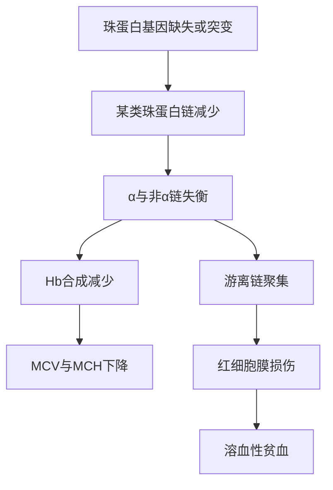
### 7.2 α地贫：按缺失／突变α基因数分级
📎 课件原文：遗传病PDF P30-38、P45

| 类型 | 缺失／异常α基因数 | 课件给出的核心表现／Hb |
|---|---:|---|
| 静止型携带者 | 1 | 无贫血，RBC正常；Hb Bart’s约1%-2%；确定诊断需基因分析 |
| 轻型／标准型 | 2 | 小细胞低色素性贫血；Hb Bart’s约5%-10%；可轻度贫血或不贫血 |
| HbH病（中间型） | 3 | 小细胞低色素中度溶血性贫血、包涵体；HbH／Hb Bart’s约5%-30%；婴儿期后渐见贫血、乏力、肝脾大、轻度黄疸 |
| Hb Bart’s胎儿水肿综合征（重型） | 4 | 致死性贫血；Bart’s为主，可有少量HbH与Hb Portland |
- 中国地区课件列常见α地贫缺失：--SEA、-α3.7、-α4.2。
- P33、P35、P37、P38均强调：进一步／确定诊断需基因分析。
⚠️ 图像未可靠识别：遗传病PDF P30-31为α基因缺失示意图，本文仅保留图中文字，不据图补画具体断点结构。
### 7.3 β地贫：按临床贫血程度分级
📎 课件原文：遗传病PDF P39-46
- 轻型、中间型、重型。
- β地贫主要由基因点突变引起，少数为基因缺失。
- 两个等位基因均突变多见重型或中间型；一个等位基因突变多见轻型或静止型。

| 类型 | 临床 | 实验室 | 遗传学 |
|---|---|---|---|
| 重型 | 出生后3-6个月起贫血、肝脾肿大、颧骨隆起、眼距增宽、鼻梁低平等“地贫面容” | Hb＜60 g/L；小细胞低色素；大小不均、靶形红细胞与碎片；RET增多；外周血较多有核红细胞；骨髓红系极度增生；首诊HbF 30%-90% | 父母均为β地贫患者或携带者；进一步需基因分析 |
| 中间型 | 多在2-5岁出现贫血，症状和体征较重型轻，可有“地贫面容” | Hb 60-100 g/L；成熟RBC形态与重型相似；RET增多；偶见有核RBC；HbF＞3.5% | 父母均为β地贫患者或携带者；进一步需基因分析 |
| 轻型 | 无症状或轻度贫血，偶见轻度脾大 | Hb稍低但＞100 g/L；少量靶形RBC；轻度大小不均；MCV＜79 fL、MCH＜27 pg；脆性试验阳性；HbA2＞3.5%或正常，HbF正常或轻增且不超过5% | 父母至少一方为患者或携带者；需排除其他地贫与缺铁性贫血，进一步需基因分析 |
⚠️ 图像未可靠识别：遗传病PDF P42为重型β地贫血液照片，形态训练请回看原页。
### 7.4 地贫三级检测流程
📎 课件原文：遗传病PDF P48-55；04_红细胞疾病_贫血与血小板实验诊断.pptxP37-38
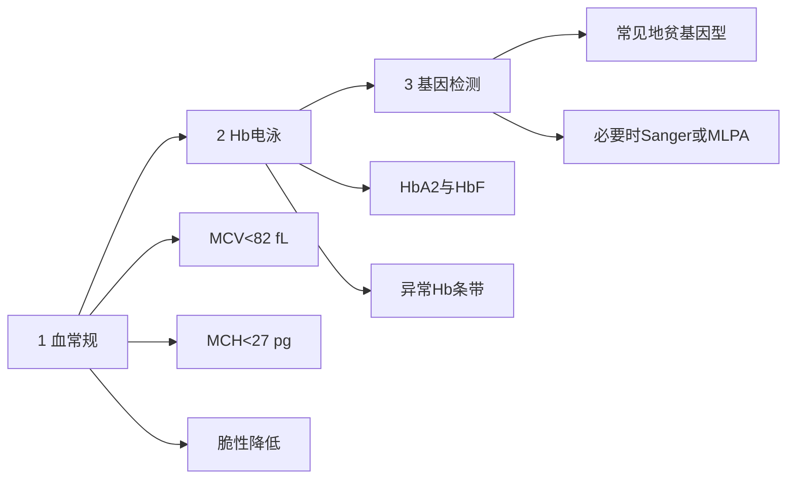
- 传统血常规、脆性与Hb电泳只能初筛，不能确诊基因型，轻型可漏诊。
- 基因诊断可直接针对致病基因，用于携带者筛查与产前诊断。
- PDF P49写明检测23-30种地贫基因型，部分加测Sanger测序或MLPA。
- 缺失型α地贫：跨越断裂点PCR（Gap-PCR）；非缺失型α地贫：反向点杂交（RDB）；β地贫RDB可同时检测17个常见点突变。
### 7.5 地贫治疗与预防边界
📎 课件原文：遗传病PDF P47、P56-57
- 轻型地贫无需特殊治疗。
- 课件列一般治疗、预防感染、输血与去铁、铁螯合剂、脾切除、造血干细胞移植、基因活化治疗。
- 预防强调高危人群筛查、遗传咨询与产前诊断。
> [!WARNING] ⚠️ 常见疑问
> Q：小细胞低色素且长期补铁无效，下一步只看铁代谢吗？
> A：仍应看铁代谢以排除缺铁，但课件地贫流程要求继续做Hb电泳；确诊基因型需基因检测。

> [!SUMMARY] 📝 核心要点
> 地贫是“链合成失衡”而非单纯缺铁；初筛靠血常规＋Hb电泳，基因型确诊靠基因检测。

## 8. G6PD缺乏症：抗氧化防线断裂后的发作性溶血 ⭐⭐⭐
📎 课件原文：04_红细胞疾病_贫血与血小板实验诊断.pptxP36；遗传病PDF P58-67
### 8.1 临床与遗传
- G6PD（glucose-6-phosphate dehydrogenase，葡萄糖-6-磷酸脱氢酶）缺乏是一种以溶血性贫血为表现的遗传病。
- 平时多无症状；进食蚕豆、服用伯氨喹啉类药物，或在感染、新生儿期等应激状态下可出现急性、发作性溶血。
- 突出表现：黄疸、酱油色尿、贫血。
- G6PD基因位于Xq28；课件写为X连锁不完全显性。女性杂合子因X染色体随机失活，酶活性与临床表现度可不同。
### 8.2 机制链
🖼 课件图像解读：遗传病PDF P60
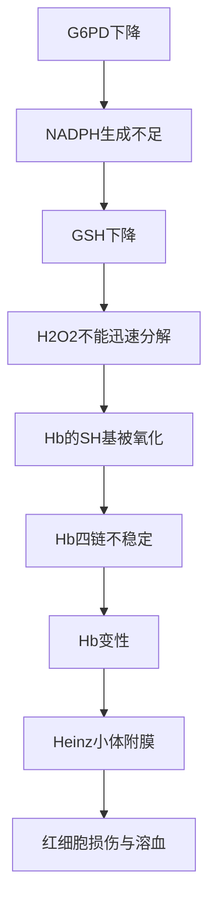
- 这条链的记忆起点是NADPH不足，终点是Hb变性与红细胞膜损伤。
- 🖼 课件图像解读：遗传病PDF P61图中可见红细胞内深染颗粒，图注明确标为Heinz小体。
### 8.3 检查、诱因回避与治疗
- G6PD活性检测原理与参考值见第6节；课件列其用于诊断蚕豆病。
- PDF P65列应避免的药物／物质类别：抗疟药、磺胺类、砜类、部分止痛药、杀虫药、部分抗菌药，以及蚕豆等；具体药名应回看原页逐项核对。
- 治疗：去除诱因，禁食蚕豆及其制品，停用氧化类药物；Hb＜60 g/L时课件写可适量输血；肾衰竭时行透析。糖皮质激素40-60 mg/d疗效不定。
- 预防：群体调查、携带保健卡、婚育指导、孕妇产前检查及预防用药、新生儿筛查。
> [!NOTE] 📌 请注意
> “大多平时无症状＋特定氧化应激后发作”是G6PD病例的时间线钩子；机制上必须能从G6PD↓推到Heinz小体与溶血。

闭卷推导G6PD缺乏为何形成Heinz小体。
> [!QUESTION]- 参考思路
> G6PD↓→NADPH不足→GSH↓→H2O2不能迅速清除→Hb巯基被氧化、Hb变性→形成Heinz小体并附着红细胞膜。

## 9. 贫血横向鉴别：一张表收口 ⭐⭐⭐
📎 课件原文：实验诊断2023版P11-16、P24-27；贫血总论P10-15、P27-43；04_红细胞疾病_贫血与血小板实验诊断.pptxP18-40；遗传病PDF P27-67

| 方向 | 首要形态／机制 | 关键分流检查 | 课件给出的典型钩子 |
|---|---|---|---|
| 缺铁性贫血 | 小细胞低色素；Hb合成不足 | SI、TIBC、TS、SF、sTfR、骨髓内外铁 | SF↓、TIBC↑；匙状甲、吞咽困难 |
| 巨幼细胞性贫血 | 大细胞；DNA合成障碍、核发育滞后 | 叶酸、维生素B12；骨髓形态 | 萎缩性舌炎、口角炎；粒／巨核亦可巨幼样变 |
| 溶血性贫血 | RBC寿命缩短；血管内或血管外破坏 | 膜、酶、Hb、免疫四路检查 | 黄疸、脾大；RET／骨髓可提示代偿 |
| 地中海贫血 | 小细胞低色素＋珠蛋白链失衡 | 血常规→Hb电泳→基因检测 | MCV/MCH低、脆性降低；HbA2/HbF或异常条带；补铁不能替代基因诊断 |
| G6PD缺乏 | 氧化应激下Hb变性、发作性溶血 | G6PD活性 | 蚕豆／药物／感染后黄疸、酱油色尿；Heinz小体 |
### 9.1 小细胞贫血快速分流
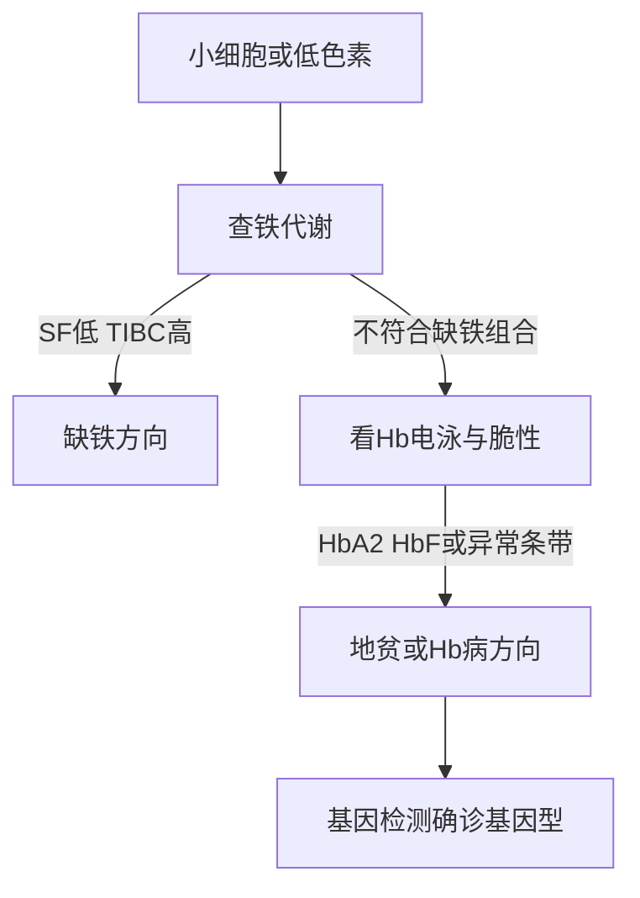
### 9.2 黄疸／脾大／疑似溶血快速分流
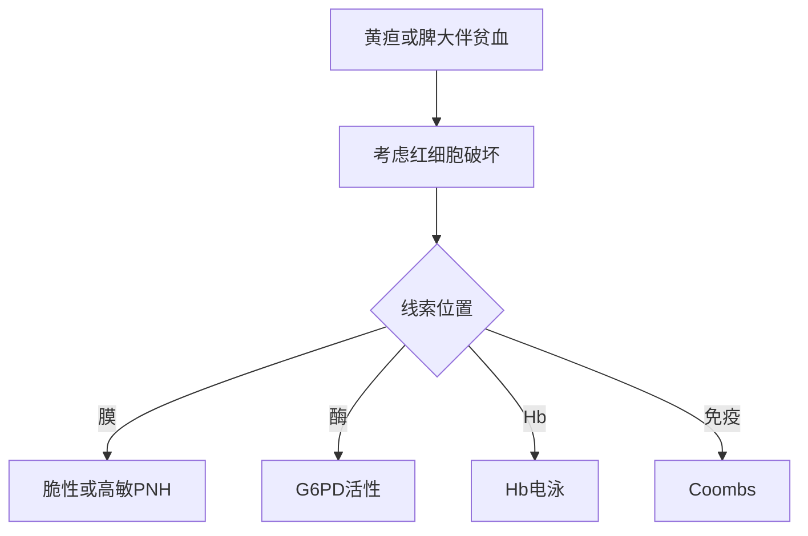
## 10. 血小板生理功能：把黏附、聚集、释放串起来 ⭐⭐⭐
📎 课件原文：04_红细胞疾病_贫血与血小板实验诊断.pptxP43-46
### 10.1 形成血小板血栓的课件主线
🖼 课件图像解读：04_红细胞疾病_贫血与血小板实验诊断.pptxP45
- 血小板与受损血管壁接触、滚动，在内皮下vWF与胶原相关区域发生初期黏附。
- 血小板激活、颗粒释放、扩展与继发黏附，随后聚集，形成增长中的血栓。

### 10.2 四项生理功能
1. **黏附与聚集**：课件强调纤维蛋白原与GPⅡb/Ⅲa复合物。
2. **参与凝血**：血小板因子3（PF3）参与凝血过程。
3. **释放活性物质**：致密颗粒与α颗粒可释放ADP、5-HT、Ca²⁺、纤维蛋白原、vWF、凝血因子等。
4. **血块回缩**：依赖血小板收缩蛋白。
> [!NOTE] 📌 请注意
> 后面的血小板无力症正是GPⅡb或GPⅢa基因缺陷，因此“受体缺陷→多种诱聚剂聚集差”能直接从本节机制推出。

## 11. 血小板功能检验：知道每项在问什么 ⭐⭐⭐
📎 课件原文：04_红细胞疾病_贫血与血小板实验诊断.pptxP47-55；遗传病PDF P75
### 11.1 检验总览
- 血小板数量：血常规。
- 功能检验：黏附试验、聚集试验、膜糖蛋白、活化分析、PF3有效性、血小板自身抗体、生存时间。
### 11.2 黏附、聚集与膜糖蛋白
**血小板黏附试验**（P49）
- 抗凝血与带负电荷玻璃表面接触一定时间，按接触前后血小板数量差计算黏附率。
- 方法：玻璃球瓶法、玻珠柱法、玻璃滤过器法等。
**聚集试验与LTA**（P50-52）
- 聚集核心：纤维蛋白原与血小板膜GPⅡb/Ⅲa结合。
- LTA（light transmission aggregometry，光学比浊法）被课件称为血小板聚集检测“金标准”、经典且使用最广泛的方法。
- 先用PPP（platelet poor plasma，乏血小板血浆）调零；向PRP（platelet rich plasma，富血小板血浆）加入诱聚剂后，聚集使浊度下降、透光度上升，连续记录透光度变化判断聚集能力。
**膜糖蛋白流式检测**（P53）
- 荧光标记抗血小板糖蛋白单抗作为探针，用流式细胞术测定质膜／颗粒膜GP阳性血小板比例。
- 项目：GPⅠb（CD42b）、GPⅡb（CD41）、GPⅢa（CD61）、GPⅣ（CD42a）、FIB-R等。
### 11.3 活化分析
📎 课件原文：04_红细胞疾病_贫血与血小板实验诊断.pptxP54
- 血小板膜磷脂酰丝氨酸（PS）。
- 活化血小板膜糖蛋白分子标志物。
- 血小板微粒。
- 颗粒释放：β-TG、PF4（ELISA/RIA）。
- 花生四烯酸产物。
⚠️ 图像未可靠识别：04_红细胞疾病_贫血与血小板实验诊断.pptxP51的仪器照片仅能确认显示聚集曲线与加样操作，不能仅凭照片判定具体患者结果。
> [!SUMMARY] 📝 核心要点
> LTA问“诱聚后透光度如何变化”；流式膜糖蛋白问“GP是否缺失／减少”；两者正好对应功能与结构两个层面。

## 12. 遗传性出血病：血友病与血小板无力症分开记 ⭐⭐⭐
📎 课件原文：遗传病PDF P68-77；04_红细胞疾病_贫血与血小板实验诊断.pptxP46、P48-53
### 12.1 血友病：凝血因子遗传性缺乏
📎 课件原文：遗传病PDF P68-72

| 类型 | 缺陷 | 遗传方式 |
|---|---|---|
| 甲型血友病 | 因子Ⅷ／抗血友病球蛋白（AHG）缺乏 | X连锁隐性（XR） |
| 乙型血友病 | 因子Ⅸ／血浆凝血活酶成分（PTC）缺乏 | X连锁隐性（XR） |
| 丙型血友病 | 因子Ⅺ缺乏 | 常染色体隐性（AR） |
| 血管性假血友病 | vWF缺乏 | 常染色体显性或隐性（AD或AR） |
- 多见男性；可＜2岁或童年后发病，越早发病症状越重；反复出血、终身不愈。
- 自发或轻微外伤后渗血不止，可持续数天；多见瘀斑、血肿，膝、踝、肘、腕等关节易出血，反复可致关节畸形。
- 口鼻黏膜可出血；课件指出脑出血是致死原因。
- 血象一般无贫血，白细胞、血小板计数正常；进一步做出凝血检查与凝血因子活性测定。
- 治疗：局部压迫、冰袋、局部血浆／止血材料；替代疗法输血浆；避免创伤、较重体力活动、注射与手术。
- A、B型遗传咨询：男性患者多，女性多为携带者；可用基因诊断进行携带者筛查与产前诊断。
### 12.2 血小板无力症：聚集受体缺陷
📎 课件原文：遗传病PDF P73-77；04_红细胞疾病_贫血与血小板实验诊断.pptxP50、P53
- 遗传性出血病，多为常染色体隐性，部分为显性。
- GPⅡb或GPⅢa基因缺陷→血小板对ADP、凝血酶、胶原等多种诱聚剂先天性无聚集或反应减低。
- 杂合子一般无出血；纯合子幼年即可有脐带出血、皮肤淤斑、鼻出血、牙龈出血。外伤、手术、分娩可致严重出血，但**无深部血肿**；女性可月经过多；颅内、内脏、关节出血少见。
**实验室诊断**
1. 血小板计数正常；血涂片上散在分布，不聚集成堆。
2. 出血时间延长。
3. 血块收缩不良或正常。
4. ADP、肾上腺素、胶原、凝血酶、花生四烯酸均不引起聚集，或对后3种聚集反应显著减低；瑞斯托霉素引起的聚集正常或减低。
5. 血小板膜GPⅡb/Ⅲa减少或存在质的异常。
**治疗与预后**
- 禁用抗血小板药物。
- 轻度出血通常局部压迫；严重出血时输注血小板可能最有效。
- 课件称尚无根治方法，主要对症治疗。
### 12.3 快速横向鉴别

| 维度 | 血友病 | 血小板无力症 |
|---|---|---|
| 缺陷核心 | 凝血因子Ⅷ／Ⅸ／Ⅺ或vWF | GPⅡb／GPⅢa |
| 典型出血 | 血肿、关节出血，可致畸形 | 皮肤黏膜出血；无深部血肿；关节出血少见 |
| 血小板计数 | 课件写正常 | 正常 |
| 收口检查 | 凝血检查、因子活性 | 聚集试验、膜GP检测 |
| 遗传 | A/B为XR；C为AR；vWF为AD或AR | 多为AR，部分AD |
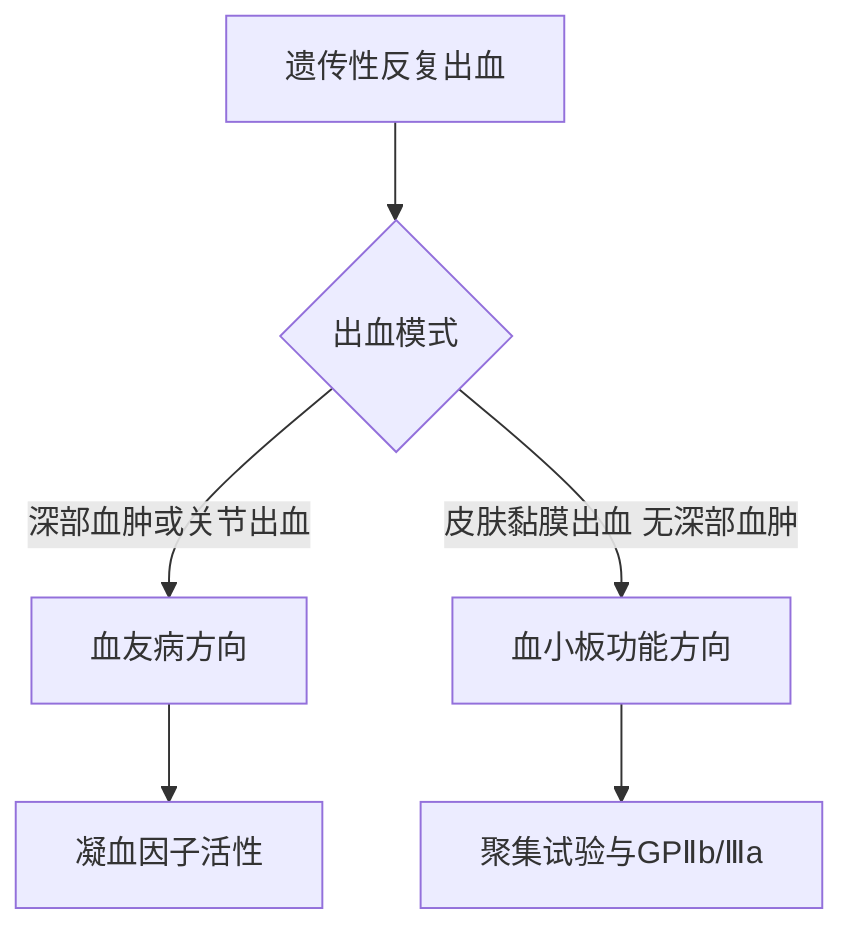
不看表格，说出为什么GPⅡb/Ⅲa缺陷会出现“多种诱聚剂均不聚集”。
> [!QUESTION]- 参考思路
> 课件把纤维蛋白原与GPⅡb/Ⅲa结合列为血小板聚集核心。受体缺陷使共同的聚集终末环节受阻，因此多种诱聚剂下都可无聚集或反应减低。

## 13. 课件原病例：补铁无效的20岁女性怎么走树 ⭐⭐⭐
📎 课件原文：实验诊断2023版P18-24
### 13.1 病例原文压缩
- 黄小姐，20岁，进行性面色苍白3年余，发热4日。
- 曾被诊断“缺铁性贫血”，长期口服铁剂无效。
- 本次体温达39℃；查体重度贫血貌、面色蜡黄、肝脾肿大。
- 后续课件将诊断思路引向溶血性贫血，并在P24出现“地中海贫血”。
### 13.2 只按课件信息推理
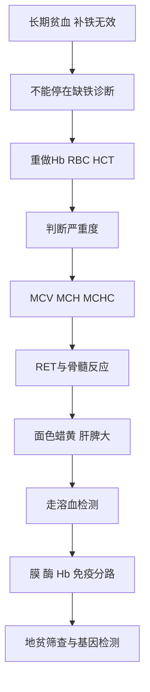
### 13.3 病例训练时必须说出的3句话
1. **“补铁无效不是继续加铁的理由，而是重新验证缺铁证据的理由。”** 课件要求回到铁代谢试验。
2. **“蜡黄＋肝脾大把方向推向溶血。”** 但仍要用实验室检查确认和分型。
3. **“若是小细胞低色素且缺铁组合不成立，应进入Hb电泳与地贫基因检测。”**
> [!WARNING] ⚠️ 来源边界
> 课件没有在可提取文本中给出该患者完整血常规、溶血指标、Hb电泳或基因结果，本文不能替她下最终诊断。

如果该患者MCV/MCH提示小细胞方向，你会如何避免再次误诊为缺铁？
> [!QUESTION]- 参考思路
> 先核对SI、TIBC、TS、SF、sTfR及骨髓铁；若不符合缺铁组合，按课件做Hb电泳并进入地贫基因检测，而不是仅凭细胞小继续补铁。

## 14. Day 1终局回忆页：30分钟闭卷检查
📎 课件原文：整合实验诊断2023版P7-27；贫血总论P7-46；04_红细胞疾病_贫血与血小板实验诊断.pptxP14-55；遗传病PDF P27-77
### 14.1 必须默画的4棵树
- 贫血五步诊断树。
- 小细胞贫血：铁代谢→Hb电泳→基因检测。
- 溶血四路：膜／酶／Hb／免疫。
- 遗传性出血：深部／关节出血→凝血因子；皮肤黏膜、无深部血肿→血小板功能。
### 14.2 必须口述的6条机制链
1. 缺铁→Hb合成不足→小细胞低色素。
2. 叶酸/B12缺乏→DNA合成障碍→核发育滞后→大细胞／巨幼样变。
3. 珠蛋白链合成失衡→Hb减少＋游离链聚集→小细胞低色素＋溶血。
4. G6PD↓→NADPH↓→GSH↓→氧化损伤→Heinz小体→溶血。
5. 纤维蛋白原＋GPⅡb/Ⅲa→血小板聚集。
6. GPⅡb/Ⅲa缺陷→多诱聚剂聚集低下／缺如→血小板无力症。
### 14.3 一页重点分级
**⭐⭐⭐ 核心掌握**
- 贫血五步诊断、Hb判定、严重度边界差异、形态分类、RET／骨髓角色。
- IDA铁代谢组合；巨幼性贫血DNA合成障碍链。
- 溶血定义与四类检验；地贫机制、α／β分型及三级检测；G6PD机制。
- 血小板聚集机制、LTA原理、血友病与血小板无力症鉴别。
**⭐⭐ 熟悉理解**
- 贫血系统表现及影响症状的5因素。
- 渗透脆性、高敏PNH、Hb电泳、Coombs的原理与意义。
- 地贫治疗／预防原则；G6PD诱因回避与筛查。
- 血小板黏附、膜GP与活化分析项目。
**⭐ 了解即可**
- 贫血总论中大量红细胞形态名称与背景图。
- 地贫具体分子检测技术名称的细节。
- 课件一带而过的少见Hb病与遗传性铁粒幼细胞性贫血；因非今日主线，不在本文扩写。
> [!TIP] 💡 最后记忆钩子
> **“先确认、再分型；看代偿、追病因。小细胞先查铁，黄脾大查溶血；地贫三步到基因，G6PD从抗氧化链推；深部关节找因子，黏膜聚集看血小板。”**
> 对应关系：前四句依次对应贫血五步树、小细胞分流、溶血线索、地贫／G6PD；最后一句对应血友病与血小板无力症鉴别。

## 15. 形态图回看清单
以下页面以形态照片／电泳图／骨髓图为主。文字讲义不能替代视觉辨认，病例训练第3小时至少回看一次：
- **贫血总论P30-40**：正常、小细胞低色素、大细胞、靶形、咬痕、椭圆、碎片、水滴、铅笔、口形、镰形、球形、棘形及疟原虫等。
- **贫血总论P42**：再生障碍性贫血与巨幼细胞性贫血骨髓图。
- **04_红细胞疾病_贫血与血小板实验诊断.pptxP24、P26**：骨髓铁染色／骨髓形态。
- **04_红细胞疾病_贫血与血小板实验诊断.pptxP32、P38**：渗透脆性示意与不同Hb电泳图。
- **遗传病PDF P22、P42、P61、P75**：镰状RBC、重型β地贫血液照片、Heinz小体、血小板无力症实验室图。
> [!SUMMARY] 📝 Day 1完成标准
> 能闭卷画出4棵树、口述6条机制链、解释课件原病例为何不能停在“缺铁”，并能用课件检查把地贫、G6PD、血友病与血小板无力症分别收口，即完成今天的8小时冲刺。

## 教材校订与机制补充（本节优先）
> [!SUMMARY] 校订重点
> 本节校订严重度/形态分型口径，并补足“生成减少—破坏过多—失血”的总机制、铁缺乏阶段、巨幼变、溶血三联证据、AIHA、PNH、α/β地贫及G6PD检测陷阱。原课件锚点保留；本节教材依据为 `《内科学》第10版_书签.pdf` PDF P575—600。

### 1. 贫血总诊断：先按机制分流
📖 教材校订：PDF P575—576
- 贫血的总机制先分为：**红细胞生成减少、红细胞破坏过多、失血**。
- 生成减少再问三层：造血细胞是否正常、造血调节是否足够、造血原料是否缺乏或利用障碍。
- MCV、RET、铁代谢、B12/叶酸、溶血及骨髓检查用于把上述机制具体化，不应替代总机制框架。
- 教材口径的 Hb 严重度：极重度 `<30 g/L`，重度 `30—59 g/L`，中度 `60—90 g/L`，轻度 `>90 g/L`。原课件如有不同边界，应单列为课堂口径，考试以授课教师最终要求为准。
- 教材按 MCV/MCHC 的形态分型：大细胞性 `MCV>100 fL、MCHC>360 g/L`；正常细胞性 `MCV 80—100 fL、MCHC 320—360 g/L`；小细胞低色素性 `MCV<80 fL、MCHC<320 g/L`。
### 2. 缺铁：ID→IDE→IDA，而不是一开始就“缺铁性贫血”
📖 教材校订：PDF P581—582

- 缺铁可依次经过 `ID→IDE→IDA`；红细胞内铁不足使血红素合成受阻，原卟啉以 FEP 或 ZPP 形式累积，Hb 生成减少，因此细胞体积小、胞质淡染。
- 缺铁时储存铁、血清铁和转铁蛋白饱和度降低，TIBC 升高；红系细胞缺铁时膜转铁蛋白受体脱落入血，故 sTfR 升高。
- 小细胞低色素并不自动等于缺铁。教材要求鉴别铁粒幼细胞贫血、慢性病贫血、珠蛋白生成障碍性贫血及转铁蛋白缺乏症；有珠蛋白链异常证据时再进入 Hb 电泳与基因检测。
### 3. 巨幼细胞贫血：核幼浆老与B12警示
📖 教材校订：PDF P583—585
- 巨幼细胞贫血本质是 DNA 合成障碍；叶酸和/或维生素 B12 缺乏最常见，遗传或药物因素也可导致。
- DNA 复制延迟而 RNA 相对保留，形成“胞体大、核发育滞后”的巨幼变；红、粒、巨核三系可在骨髓内过早死亡，重者可全血细胞减少。
- B12 缺乏还可影响髓鞘合成和神经细胞甲基化，不能只按“大细胞”理解。
> [!WARNING] 教材优先
> 不能排除 B12 缺乏时，不宜仅补叶酸；教材提示此举可能加重神经系统损伤，应同时补充维生素 B12。

### 4. 溶血：先证实三联证据，再追病因
📖 教材校订：PDF P590—599
- **溶血不等于溶血性贫血**：骨髓仍能代偿时可只有“溶血状态”；当破坏超过代偿并出现贫血，才称溶血性贫血。
- 诊断先抓三联证据：`贫血＋红细胞破坏增多＋骨髓红系代偿性增生`；证实后再按膜、酶、珠蛋白、免疫及 PNH 克隆追因。
- AIHA：自身抗体和/或补体结合红细胞膜后加速破坏；温抗体型多为 37℃ 活跃的 IgG，致敏红细胞主要在单核巨噬细胞系统内清除，属血管外溶血。
- Coombs：DAT 检测红细胞表面结合的抗体，IAT 检测血浆游离抗体；在溶血证据存在时，DAT 阳性支持 AIHA，但少数病例可 Coombs 阴性。
### 5. PNH：把“流式检测”接回补体溶血机制
📖 教材校订：PDF P598—599

- PIGA 突变使各系血细胞的 GPI 锚合成障碍；CD55 抑制 C3 转化酶形成、CD59 阻止 C9 形成膜攻击复合物，二者缺失是血管内溶血基础。
- 教材诊断口径：外周血 CD55 或 CD59 阴性粒细胞/红细胞 `>10%` 支持诊断，`5%—10%` 为可疑；FLAER 阴性细胞 `>1%` 亦具诊断意义。FLAER 对有核细胞更敏感且不受输血、溶血影响。
### 6. 地贫：α、β型不是同一条“链失衡”
📖 教材校订：PDF P594—595
- 共同核心是珠蛋白链合成失衡导致 Hb 合成不足和小细胞低色素改变；HbA、HbA2、HbF 的变化随 α/β 型和严重度不同，**α 地贫静止型及标准型电泳可无异常**，不应概括为“共同 HbA 下降”。
- α 地贫：α 链减少→成人 β 链过剩形成 HbH→老化时沉淀形成包涵体→红细胞僵硬、膜损伤→脾内清除和溶血；通常不造成严重无效造血。
- β 地贫：β 链减少→游离 α 链沉淀→骨髓红系前体破坏（无效造血）＋外周红细胞被脾/肝清除；严重贫血继发 EPO 升高、骨髓及髓外造血增生。
### 7. G6PD：检测阴性不必然排除
📖 教材校订：PDF P593—594
- 红细胞 NADPH 唯一来自磷酸戊糖旁路。Heinz 小体相关变形性下降偏向单核巨噬细胞清除；膜脂质过氧化是急性血管内溶血的重要机制。
- G6PD 酶活性定量有确诊价值，但急性溶血期及恢复期可能假正常；临床高度怀疑而检测正常时，教材建议急性溶血后 `2—3个月` 复查。