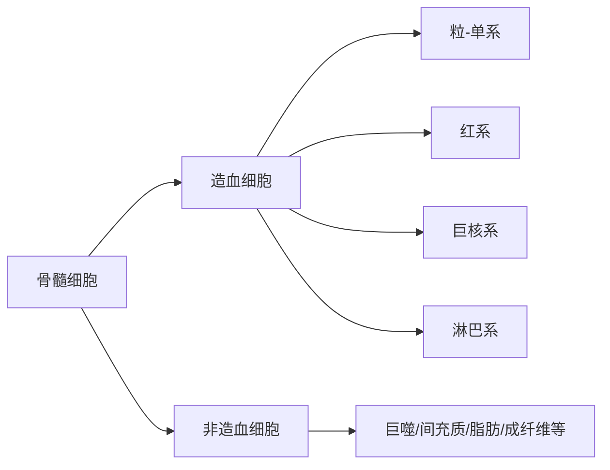
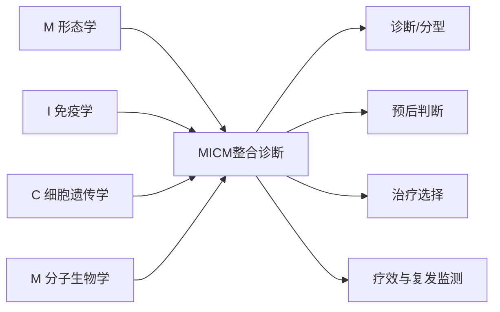
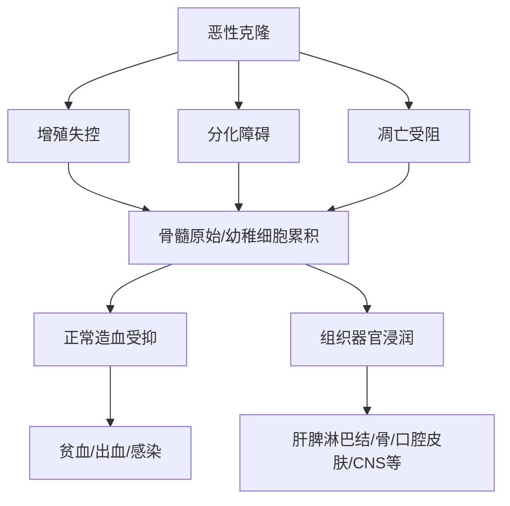
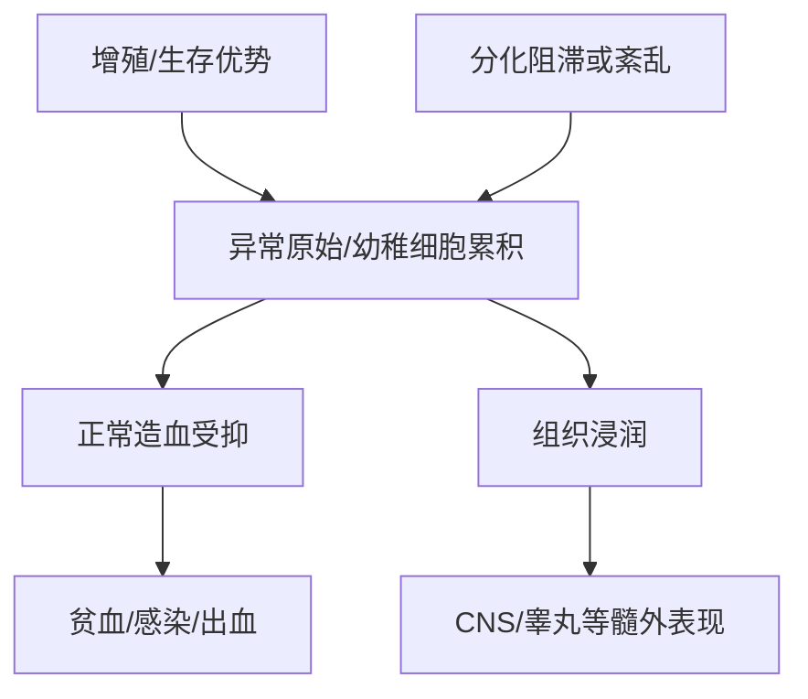
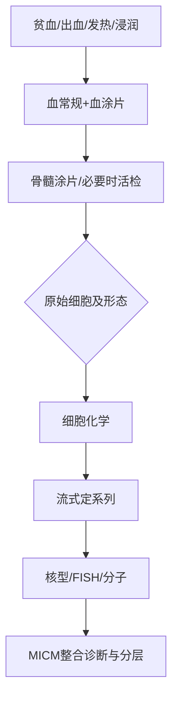
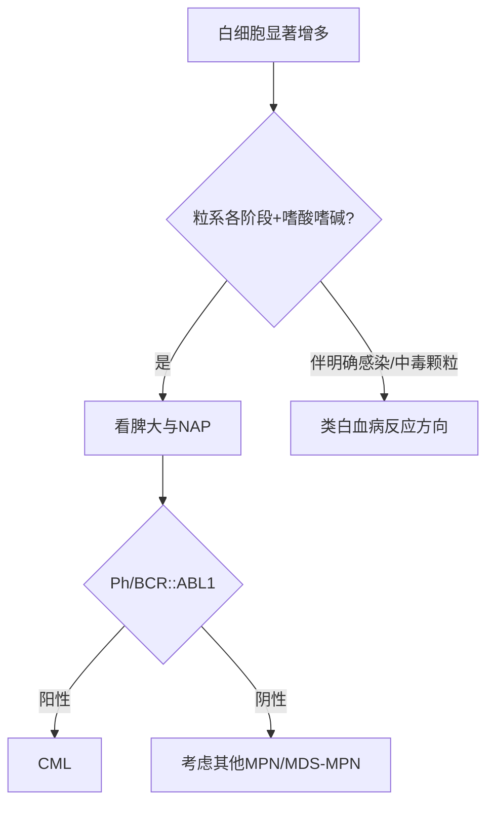
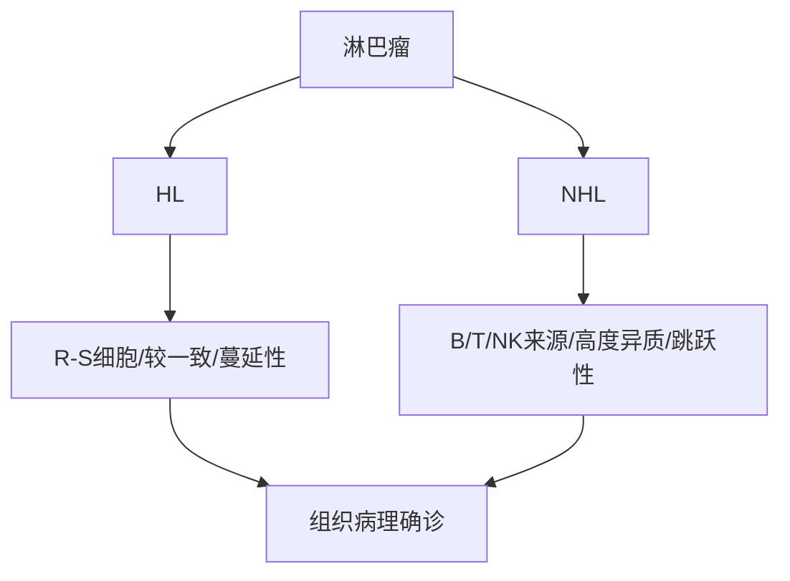
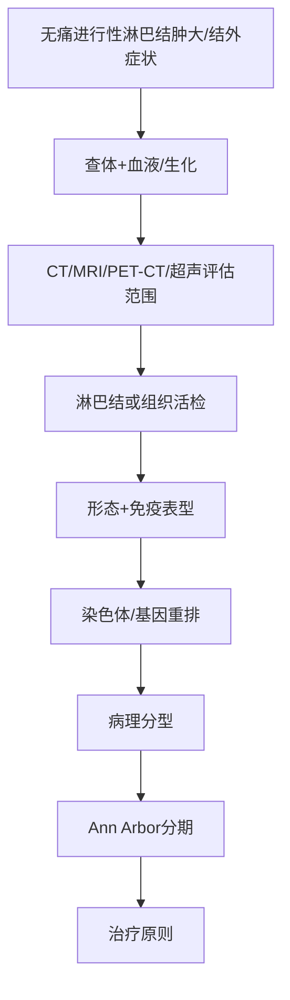

# Day 2 总览：白血病、淋巴瘤与 MICM
> [!SUMMARY] 📝 解析摘要
> - **模式**：用户指定临床模板；主题同时含形态学前置，但最终落点是诊断、鉴别与治疗原则。
> - **主线**：正常造血/形态前置 → MICM → 急性白血病 → APL → CML → 淋巴瘤。
> - **重点分级**：⭐⭐⭐ 6 个核心模块；⭐⭐ 2 个辅助模块；⭐ 仅保留必要背景。
> - **逻辑模板**：疾病单元采用“定义—表现—检查—诊断/鉴别—治疗”；MICM 与病例采用诊断流程模板。
> - **预计用时**：精读约 2 h；原课件图像回看+主动回忆 3 h；病例训练 3 h，共 8 h。
> - **来源边界**：只整合下列 5 份课件已出现内容；没有使用课件外指南、教材阈值或新增治疗方案。
> - **图像纪律**：本讲义依据文本提取生成；凡形态、病理、流式散点图、核型图、PET-CT 图，必须按 Slide 回看原课件，不凭文字猜图。
> - **自检**：仅设少量折叠式主动回忆，不构成独立题库。

### 课件简称与锚点规则
- **[实诊23]**《01_基础总论_血液系统疾病实验诊断.pptx》
- **[南山26]**《06_白细胞疾病_血液肿瘤MICM诊断.pptx》
- **[形态基础]**《07_白细胞疾病_白血病血象与骨髓形态.pptx》
- **[白血病26]**《08_白细胞疾病_白血病临床诊疗.pptx 20260510》
- **[淋巴瘤26]**《09_白细胞疾病_淋巴瘤临床诊疗.pptx 20260507》
- `Slide X-Y` 指对应课件的页码；连续页整合时仍保留范围。
## 今日 8 小时执行表
📎 课件原文：[白血病26] Slide 2；[淋巴瘤26] Slide 2（教学目标决定今日优先级）

| 时段 | 任务 | 交付物 |
|---|---|---|
| 0:00-0:30 | 正常造血与正常骨髓像 | 默画“四大家族”及成熟方向；写出正常骨髓核心范围 |
| 0:30-1:00 | MICM | 不看讲义默画 MICM 图，并为每个字母写“标本/技术/临床角色” |
| 1:00-1:35 | 急性白血病总论 | 完成“表现—血象—骨髓—MICM—鉴别—治疗”闭环 |
| 1:35-2:00 | APL、CML、淋巴瘤速读 | 各写一条确诊钩子、一条危险点、一条治疗原则 |
| 2:00-3:15 | 形态图回看 | 正常细胞发育、Auer 小体、M0-M7、APL、CML 血/髓象 |
| 3:15-4:00 | 病理与流式图回看 | 流式散点图、核型/FISH、R-S 细胞、淋巴瘤病理/PET-CT |
| 4:00-5:00 | 主动回忆 | 覆盖讲义，默画 4 张图：MICM、AL 诊断树、CML 鉴别树、Ann Arbor |
| 5:00-6:00 | 病例 A：APL | 完成证据链与下一步 MICM 检查 |
| 6:00-7:00 | 病例 B：CML | 与类白血病反应逐项鉴别 |
| 7:00-8:00 | 病例 C：淋巴瘤 + 综合口述 | 完成分期、确诊路径、治疗原则；最后 10 min 口述总串联 |
> [!NOTE] 📌 冲刺纪律
> 精读阶段只建立框架；形态学与病理学得分必须在原课件图上兑现。遇到“像什么细胞”的问题，先报 **Slide 锚点**，再回图确认，不允许仅凭本讲义的文字想象。

## 1. 正常造血与形态前置（⭐⭐⭐，⏱ 精读约 30 min）
### 1.1 骨髓里有什么：先建立四大家族
📎 课件原文：[南山26] Slide 16-19
- 骨髓造血细胞包括：**粒-单细胞系、红系、巨核系、淋巴细胞系**。
- 非造血细胞包括：巨噬细胞、间充质细胞、脂肪细胞、成纤维细胞等；另有血窦、血管、神经等。
- 形态辨认先问“属于哪一家族”，再问“处于哪一成熟阶段”。

👆 正常骨髓构成图
### 1.2 发育规律：阶段性、同时性、规律性
📎 课件原文：[南山26] Slide 20-25
- 血细胞发育三大特点：**阶段性、核浆发育同时性、发育演变规律性**。
- 粒系：原始粒 → 早幼粒 → 中幼粒 → 晚幼粒 → 杆状核 → 分叶核；成熟时胞核逐步凹陷变形，胞浆出现颗粒。
- 红系：原始红 → 早幼红 → 中幼红 → 晚幼红 → 成熟红细胞；课件强调各阶段细胞核均为圆形、胞浆无颗粒。
- 巨核系：原始巨核 → 幼稚巨核 → 颗粒巨核 → 产血小板巨核 → 裸核巨核。
- 单核系：原始单核 → 幼稚单核 → 成熟单核。
- 淋巴系：原始淋巴 → 幼稚淋巴 → 成熟淋巴；胞浆少，核形较规则。
> [!WARNING] ⚠️ 图像未可靠识别
> [南山26] Slide 17-35 以发育图、正常骨髓像及非造血细胞图为主。文本只能确认名称与顺序，**必须回原课件逐页指认**：粒系、红系、巨核系、单核系、淋巴系、浆细胞、内皮细胞、成骨/破骨细胞、脂肪细胞、组织嗜碱细胞及退化细胞。
### 1.3 正常骨髓像：必须记住的基线
📎 课件原文：[南山26] Slide 35-38
- 增生：正常成人为**增生活跃**；有核细胞/细胞总数约 **1:10**（课件写作“1-10”）；儿童可明显活跃。
- 粒红比 M/E（G/E）：成人 **2-4:1**。
- 粒系：占有核细胞约 **40%-60%**；原粒 <2%，早幼粒 <5%，中、晚幼粒逐次增多且各 <15%；杆状核多于分叶核；嗜酸粒 <5%，嗜碱粒 <1%。
- 红系：约 **20%**；原红 <1%，早幼红 <5%，中幼红约 10%，晚幼红约 10%。
- 巨核系：课件列 **7-35 个/1.5×3 cm**；血小板散在或成簇、无异常。
- 淋巴系：约 **20%**，儿童可约 40%；原始、幼稚淋巴细胞罕见。
- 单核细胞 <4%，浆细胞 <1%；极少量网状、内皮、组织嗜碱细胞，总和 <1%；无特殊细胞及血液寄生虫。
> [!NOTE] 📌 为什么先背基线
> 后面判断“原始细胞增多、粒红比例增高、正常红系/巨核系受抑、嗜酸/嗜碱增多”，都是拿这组正常骨髓像作参照。这里只建立课件基线，不凭文本替代镜下识别。
### 1.4 骨髓涂片与活检：看细胞，还是看结构
📎 课件原文：[南山26] Slide 39-48
- 骨髓细胞学适应证：外周血细胞成分改变或形态异常；不明原因发热、出血、骨痛、肝脾淋巴结肿大；血液病治疗后复查。
- 课件列禁忌：严重出血倾向（如血友病）及晚期妊娠。
- 涂片细胞学：骨髓液，瑞氏/特殊染色，油镜观察；优势是辨认细胞形态、阶段并量化；不足是无组织结构、易受稀释影响。
- 骨髓活检：完整骨髓组织，HE 染色，低倍/高倍观察；核心看“**结构+细胞分布+间质**”，有助于判断增生、纤维化、局灶性浸润；但不易细分异常细胞阶段并量化。

| 问题 | 优先证据 |
|---|---|
| 细胞是谁、成熟到哪一步、占多少 | 骨髓涂片细胞学 |
| 结构是否被破坏、是否纤维化、是否局灶浸润 | 骨髓活检 |
| 淋巴瘤骨髓浸润/转移瘤等局灶病变 | 活检检出价值更高 |
### 1.5 形态图像回看清单
📎 课件原文：[南山26] Slide 17-35；[形态基础] Slide 8-16、23-26、35-39
1. [南山26] Slide 21-25：五条成熟序列逐张指认。
2. [南山26] Slide 28-34：非造血细胞与退化细胞。
3. [形态基础] Slide 8：Auer 小体。
4. [形态基础] Slide 9-16：M0、M1、M2、M3、M4、M5、M7。
5. [形态基础] Slide 23-26：APL 病例的骨髓形态及 POX、AS-DCE、NAE/NaF 图。
6. [形态基础] Slide 35-39：CML 血/髓象与 NAP 图。
> [!QUESTION]- 参考思路
> 不看讲义，按“家族—成熟序列—正常比例—涂片/活检角色”口述正常骨髓。若卡在细胞长相，立即回看对应 Slide，不用文字猜图。

## 2. MICM：血液肿瘤诊断总框架（⭐⭐⭐，⏱ 精读约 30 min）
### 2.1 从 FAB 到 WHO/MICM
📎 课件原文：[南山26] Slide 2-6；[白血病26] Slide 13-16
- 血液肿瘤是造血与淋巴组织的恶性克隆性疾病，分为髓系、淋系及组织细胞/树突状肿瘤。
- FAB 主要建立在形态学基础上；WHO 将有诊断、预后及治疗指导意义的细胞或分子遗传学异常纳入诊断分型，并把诊断前疾病状态与治疗措施纳入考量。
- MICM 分别代表：**M 形态学、I 免疫学、C 细胞遗传学、M 分子生物学**。
- AML 的课件表述：FAB 原始细胞比例下限为 30%；WHO/MICM 通常为 20%；若原始细胞 <20% 但检出 t(15;17)、t(8;21) 或 inv(16)/t(16;16)，仍应诊断为 AML。

👆 MICM 总图
### 2.2 M：形态学先回答“像什么、占多少”
📎 课件原文：[南山26] Slide 7-12、39-48；[实诊23] Slide 30、41
- 标本/技术：外周血涂片、骨髓涂片细胞学、细胞化学染色、骨髓活检/印片。
- 外周血形态检测的临床意义：发现原始/幼稚细胞及异常白细胞、红细胞；补充验证血常规。
- 骨髓涂片负责形态、阶段和比例；活检负责结构、分布与间质。
- M 是入口，但形态相似并不等于同一系列，尤其 M0、双表型/混合性白血病要交给 I、C、分子 M 继续定性。
### 2.3 I：免疫学回答“哪一系、哪一阶段、是否残留”
📎 课件原文：[南山26] Slide 49-65；[白血病26] Slide 39-40
- 本质：检测细胞膜或细胞质特异性抗原；方法包括流式细胞术与病理免疫组化。
- 流式细胞术（FCM）：液流系统中对单个细胞/微小颗粒作高速、多参数定量分析与分选。
- 临床角色：判断恶性细胞系列来源、分化阶段；帮助诊断双表型/混合性/M0；与预后、治疗选择相关；用于微小残留病（MRD）监测、疗效与复发监测。
- 课件列出的系列标记：
  - 髓系：CD13、CD33、CD14、CD15 等。
  - 淋巴系：CD8、CD4、CD19、CD1、CD2 等。
  - 红系：血型糖蛋白 A、CD36。
  - 巨核系：CD41、CD42、CD61。
  - 分化阶段：CD34、CD38、TdT 等。
- 急性白血病积分示例：[白血病26] Slide 39-40 列出 B 系、T 系与髓系积分，并据此区分单表型、伴异系抗原表达、双克隆、双表型与急性未分化型。
> [!WARNING] ⚠️ 图像未可靠识别
> [南山26] Slide 54-58 为流式原理/散点图示例；本讲义不从提取文本推断门区、坐标轴或细胞簇。请回原课件练习“先看坐标轴—再看门区—最后读抗原组合”。

### 2.4 C：细胞遗传学回答“染色体层面有什么异常”
📎 课件原文：[南山26] Slide 66-73、78-80
- 核型分析以分裂中期染色体为对象，通过长度、着丝点、长短臂、随体及显带进行比较、排序与编号。
- 临床角色：诊断分型、预后分层、指导治疗；某些特征性遗传异常可成为 WHO 分型依据。
- 课件举例：APL 的 t(15;17)→PML-RARA；CML 的 Ph 染色体对应 BCR-ABL1，并与 TKI 治疗相关。
- 局限：分辨率低（课件写 >5-10 Mb 的较大片段较易检出）、培养耗时、依赖操作者、复杂异常定位困难、对亚显微结构变异/基因融合/点突变不敏感，样本活力或增殖差时可失败。
- FISH：荧光标记 DNA 探针与细胞核 DNA 靶序列杂交，获得染色体或基因状态信息。
### 2.5 分子 M：把融合基因和突变落到可检测靶点
📎 课件原文：[南山26] Slide 74-80；[白血病26] Slide 41-48
- 技术：分子杂交、PCR/RT-PCR/RQ-PCR、基因测序、基因芯片等。
- 课件列出的融合基因示例：
  - BCR/ABL ↔ t(9;22)
  - PML/RARα ↔ t(15;17)
  - AML1/ETO ↔ t(8;21)
  - TEL/AML1 ↔ t(12;21)
  - E2A/PBX1 ↔ t(1;19)
- 分子结果可与形态、免疫、核型互证；最终形成 **MICM 整合报告**，而不是四份互不相干的结果。
### 2.6 一张表把 MICM 用起来
📎 课件原文：[南山26] Slide 6、59、67-80；[实诊23] Slide 30、41

| 维度 | 主要材料/技术 | 先回答的问题 | 课件中的临床角色 |
|---|---|---|---|
| M 形态 | 血涂片、骨髓涂片、细化、活检 | 像谁？多少？结构怎样？ | 初筛、分类、评估增生与浸润 |
| I 免疫 | 流式、免疫组化 | 属哪一系？哪一阶段？ | 特殊分型、MRD、疗效/复发监测、靶向选择 |
| C 遗传 | 核型、FISH | 哪条染色体异常？ | 诊断分型、预后、治疗指导 |
| M 分子 | PCR、测序、芯片等 | 哪个融合基因/突变？ | 确证、分型、靶向与监测 |
> [!QUESTION]- 参考思路
> 给出“骨髓原始细胞增多”时，为什么不能只报 AML/ALL？先用 M 确认形态和比例，再用 I 定系列/阶段，用 C 与分子 M 寻找分型、预后及治疗相关异常，最后整合。

### 2.6 教材校订｜WHO/MICM中的阈值与正式命名
📖 教材校订：`《内科学》第10版_书签.pdf` PDF P609—611
- WHO 分型通常以原始细胞 `≥20%` 为急性白血病阈值；伴重现性遗传学异常的 AML 通常不受该阈值限制，**AML伴 BCR::ABL1 融合及 AML伴 CEBPA 突变除外**。
- 统一用教材融合基因命名：`PML::RARA`、`RUNX1::RUNX1T1`、`CBFB::MYH11`、`BCR::ABL1`。课件旧名可首次括号保留，但不应作为正式分型名。
## 3. 急性白血病（⭐⭐⭐，⏱ 精读约 35 min）
### 3.1 定义、分类与机制主线
📎 课件原文：[白血病26] Slide 5-15；[形态基础] Slide 2-7
- 白血病是源于造血干细胞的恶性克隆性疾病；白血病细胞自我更新增强、增殖失控、分化障碍、凋亡受阻，最终抑制正常造血并浸润其他组织。
- 急性白血病（AL）：骨髓异常原始/幼稚细胞大量增殖，抑制正常造血，并可浸润肝、脾、淋巴结等；包括 AML、ALL、MPAL。
- FAB 的 AML 形态分型：M0 微分化、M1 未分化、M2 部分分化、M3/APL、M4 粒-单、M5 单核、M6 红白血病、M7 巨核。
- WHO/MICM 强调形态、免疫、细胞遗传及分子生物学整合，且遗传学异常可改变单纯按原始细胞比例判断的路径。

👆 急性白血病机制—表现链
### 3.8 教材校订｜急性白血病为什么会造成贫血、感染、出血与髓外浸润
📖 教材校订：`《内科学》第10版_书签.pdf` PDF P608、P614

- 白血病发生可概括为两类事件：一类使异常克隆获得增殖/生存优势并多有凋亡受阻；另一类影响转录因子，造成分化阻滞或紊乱。
- CNS 和睾丸因血脑屏障、血睾屏障成为白血病细胞“庇护所”，部分化疗药物难以进入；因此 CNSL 防治须贯穿 ALL 整体治疗，而不是只在症状出现后处理。
### 3.2 临床表现：两条主线
📎 课件原文：[白血病26] Slide 20-26；[形态基础] Slide 2
#### A. 正常造血受抑
- 贫血。
- 发热：可由白血病本身或继发感染引起。
- 出血：课件列血小板减少、凝血异常、白血病细胞淤滞/浸润及感染等因素。
#### B. 白血病细胞浸润
- 肝、脾、淋巴结肿大，ALL 多见；T-ALL 常见纵隔淋巴结肿大。
- 胸骨下段压痛、骨/关节痛；骨髓坏死时可有骨骼剧痛。
- 粒细胞肉瘤/绿色瘤可累及眼眶，导致眼球突出、复视或失明。
- M4、M5 可见牙龈增生、肿胀及皮肤蓝灰色斑丘疹。
- CNSL 以 ALL 最常见，儿童尤甚，其次为 M4、M5、M2；睾丸无痛性肿大可见于 ALL 缓解后的幼儿和青年。
### 3.3 血象、骨髓象与细胞化学
📎 课件原文：[白血病26] Slide 27-38；[形态基础] Slide 7-16
- 血象：白细胞可高、正常或低；外周血可见原始/幼稚细胞；多为正细胞性贫血；血小板减少。
- [白血病26] 定义：WBC >10×10⁹/L 为白细胞增多性白血病，>100×10⁹/L 为高白细胞性白血病；少数 WBC <1.0×10⁹/L 为白细胞不增多性白血病。
- 骨髓象：诊断白血病的主要依据和必做检查；多明显/极度活跃，也可低增生；WHO 标准原始细胞通常 ≥20%。
- 白血病裂孔：[形态基础] Slide 7 描述为原始/早幼阶段停滞，较成熟中间型细胞缺如，并残留少量成熟细胞。
- Auer 小体：棒状、瑞氏染色紫红/红色，由嗜天青颗粒融合而成，POX 阳性；可见于 AML/急单/急粒单，不见于 ALL，支持急非淋鉴别。
- 细胞化学鉴别：[白血病26] Slide 34
  - ALL：MPO 阴性；PAS 可呈成块或粗颗粒状阳性；NSE 阴性。
  - AML：MPO 随分化由阴性/弱阳性至强阳性；PAS 多阴性或细颗粒；NSE 可阴性至阳性且 NaF 抑制 <50%。
  - 急性单核细胞白血病：MPO 阴性至阳性；NSE 阳性且 NaF 抑制 ≥50%。
> [!WARNING] ⚠️ 图像未可靠识别
> [白血病26] Slide 29、31-38 与 [形态基础] Slide 8-16 为血涂片、骨髓像及细胞化学图片。必须回原课件确认“均一原始细胞”“Auer 小体”“M3 粗颗粒/柴捆细胞”“NaF 抑制前后”等视觉特征。

### 3.4 FAB 形态速记：只记课件给出的辨认钩子
📎 课件原文：[形态基础] Slide 9-16；[白血病26] Slide 14、18

| 类型 | 课件形态钩子 |
|---|---|
| M0 | 原始细胞中等大、染色质细、1-2 核仁、胞质无颗粒；POX <3% |
| M1 | 原始细胞 >90%，无明显成熟分化；可有嗜天青颗粒/Auer；POX >3% |
| M2 | 原始细胞 20%-90%，存在向成熟阶段分化的粒细胞；POX >3% |
| M3/APL | 异常早幼粒；多颗粒型可见密集大颗粒、粉尘样小颗粒、束状 Auer（柴捆细胞）；少颗粒型颗粒少/不显，核多双叶 |
| M4 | 粒系与单核系前体均增殖；单核胞质丰富、嗜碱，可见嗜天青颗粒/空泡 |
| M5 | M5a 以原始单核为主；M5b 以幼稚单核为主 |
| M7 | 原始巨核细胞 >20%，胞浆可有突起呈云雾/刷状，胞体周围可见脱出血小板 |
| ALL L1/L2/L3 | L1 小原幼淋为主；L2 大原幼淋为主；L3 大原幼淋较一致、胞内空泡明显、胞浆深嗜碱 |
### 3.5 其他实验室检查与 MICM 定性
📎 课件原文：[白血病26] Slide 39-48
- 免疫表型按抗原组合确定系列来源，并帮助识别 AML、B-ALL、T-ALL、伴异系抗原表达、混合/双表型或未分化白血病。
- 特异性遗传异常示例：t(15;17)-PML/RARα-M3；t(8;21)-AML-ETO-M2；inv(16)-M4Eo；t(9;22)-BCR/ABL 可见于 CML/ALL；t(8;14) 与 B 细胞 ALL 相关。
- 生化：尿酸升高、电解质紊乱（高磷、低钙、高钾）、可有急性肾功能不全、LDH 升高。
- APL 凝血异常：可合并 DIC 或继发纤溶亢进，表现为 PT/APTT/TT 延长、纤维蛋白原下降、D-二聚体升高。
- CNSL：脑脊液压力、白细胞及蛋白可升高，涂片可见白血病细胞。
### 3.6 诊断与鉴别诊断
📎 课件原文：[白血病26] Slide 48-51

👆 急性白血病诊断树

| 鉴别对象 | 共同点 | 课件给出的关键区别 |
|---|---|---|
| 感染所致白细胞异常 | WBC 可增高或减低 | 骨髓原幼细胞不增多 |
| MDS | 可有贫血、出血、感染、三系异常及幼稚细胞 | 骨髓幼稚细胞 <20%，并有病态造血 |
| 巨幼细胞贫血 | 全血细胞减少，骨髓红系比例高、可见幼稚红细胞 | 原始细胞不增多，幼红 PAS 阴性 |
| 粒细胞缺乏恢复期 | 白细胞低，可见幼稚粒细胞 | 有明确基础病；无 Auer/染色体异常；短期内成熟粒细胞恢复 |
### 3.7 治疗原则：先支持，再按 MICM 分层实施抗白血病治疗
📎 课件原文：[白血病26] Slide 52-71、78-80
- 总原则：结合 MICM 与临床特点进行预后分层，同时考虑患者意愿、经济能力；适合 HSCT 者进行 HLA 配型。
- 一般治疗：处理高白细胞血症/白细胞淤滞；防治感染；成分输血；水化、碱化、降尿酸；纠正电解质失衡；维持营养。
- 高白细胞处理：课件列白细胞清除，但注明 **APL 不首选**；AML 可用羟基脲预处理，ALL 可用地塞米松/环磷酰胺预处理。
- ALL：以 VDP 为基本诱导方案，可加入门冬酰胺酶和/或环磷酰胺形成 VDLP、VDCP、VDCLP；同时做 CNSL 防治。Ph+ ALL 在 VDP/VP 基础上联合 TKI；缓解后按危险度/MRD 选择化疗、HSCT 等。
- AML（非 APL）：诱导以“3+7”即蒽环类+标准剂量阿糖胞苷为主，课件列 IA、DA 等；缓解后按危险度选择以大剂量 Ara-C 为基础的化疗或 allo-HSCT，老年患者强调个体化与减量。
- 疗效评估：[白血病26] Slide 78 将 CR 核心列为外周血无原始细胞、无髓外白血病、骨髓三系恢复且原始细胞 <5%，并结合 ANC、PLT；复发包括血/髓原始细胞再现或髓外病灶出现。
> [!SUMMARY] 📝 急性白血病 Take-Home
> - 先用“正常造血受抑 + 浸润”解释表现。
> - 血象可高可低；骨髓原始细胞与形态是入口，Auer 小体支持 AML 而非 ALL。
> - 不能停在形态：必须完成 MICM。
> - 鉴别抓“原始细胞是否增多、是否病态造血、是否有 Auer/遗传异常、能否短期恢复”。
> - 治疗由支持治疗、诱导缓解、缓解后治疗组成，具体路径受 MICM、危险度、MRD、年龄及合并症影响。

> [!QUESTION]- 参考思路
> 为什么急性白血病患者可同时出现贫血、感染和出血？白血病细胞在骨髓大量累积，抑制正常红系、粒系和巨核/血小板生成；课件同时列出凝血异常、感染及白细胞淤滞/浸润可加重出血。

## 4. APL：必须单独拎出的急诊型重点（⭐⭐⭐，⏱ 精读约 15 min）
### 4.1 识别链：形态 + 凝血 + PML-RARA
📎 课件原文：[形态基础] Slide 12-13、19-29；[白血病26] Slide 33、43、45、47、72-77；[南山26] Slide 72、75
- 形态：异常早幼粒细胞；多颗粒型可见粗大/密集颗粒与束状 Auer 小体（柴捆细胞）；微/少颗粒型颗粒少或不明显，核可双叶。
- 凝血：APL 常伴凝血异常，可合并 DIC 或继发纤溶亢进；PT/APTT/TT 延长、纤维蛋白原下降、D-二聚体升高。
- 遗传：t(15;17) 形成 PML-RARA，是确诊依据之一。
- [形态基础] 病例：44 岁女性，贫血、瘀斑；WBC 36.16×10⁹/L、Hb 52 g/L、PLT 82×10⁹/L；骨髓异常早幼粒细胞 73.5%，POX/AS-DCE 强阳性，NAE 强阳性且 NaF 不抑制；骨髓意见为符合 APL 骨髓象，需结合 MICM 综合确诊。
```mermaid
graph TD
    A[贫血/瘀斑或出血] --> B[血象+凝血]
    B --> C[骨髓异常早幼粒]
    C --> D[粗颗粒/柴捆Auer或微颗粒变异]
    D --> E[t(15;17)/PML-RARA]
    E --> F[APL整合确诊]
```
👆 APL 识别—确证链
> [!WARNING] ⚠️ 图像未可靠识别
> 必看 [形态基础] Slide 12-13、23-28 与 [白血病26] Slide 33、45。先在图上找异常早幼粒细胞、颗粒与 Auer 小体，再核对细胞化学；不要仅凭“颗粒多”三个字下结论。

### 4.3 教材校订｜APL把基因、分化治疗与分化综合征连成一条线
📖 教材校订：`《内科学》第10版_书签.pdf` PDF P611、P615
- 约99%的 APL 有 `t(15;17)` 并形成 `PML::RARA`；这既是发病的分子基础，也是 ATRA 与砷剂有效的靶点基础。
- 分化综合征应警惕发热、肌肉骨骼疼痛、呼吸窘迫、肺间质浸润、胸/心包积液、体重增加、低血压及急性肾衰竭。出现任一可疑表现即紧急评估并给予糖皮质激素等处理；是否暂停 ATRA 结合病情决定。
### 4.2 治疗原则与分化综合征
📎 课件原文：[白血病26] Slide 73-77
- 机制：PML-RARA 相关分化阻滞；课件列 ATRA（全反式维 A 酸）与三氧化二砷作用机制图。
- 风险分层：[白血病26] Slide 76 以 WBC **10×10⁹/L** 为界；低危 ≤10×10⁹/L，首选 ATRA+砷剂无化疗方案；高危 >10×10⁹/L，采用 ATRA+砷剂+化疗并进入巩固/维持路径。
- 分化综合征常见于初诊或复发、WBC >10×10⁹/L 且持续增长者；机制为细胞因子大量释放与黏附分子表达增加。
- 课件列 7 个表现：不明原因发热、呼吸困难、胸腔/心包积液、肺部浸润、肾衰竭、低血压、体重增加 5 kg；2-3 个为轻度，≥4 个为重度。
- 处理：考虑停用或减量 ATRA/亚砷酸，密切关注容量负荷与肺功能，尽早使用地塞米松 10 mg 静脉、每日 2 次，直至低氧血症解除。
> [!SUMMARY] 📝 APL Take-Home
> - 形态可提示，但最终由 MICM 整合，尤其 t(15;17)/PML-RARA。
> - 出血/凝血异常是危险主线，别把 APL 当成普通 AML 处理；高白细胞时课件注明白细胞清除不首选。
> - 治疗主轴是 ATRA+砷剂，是否加化疗按 WBC 10×10⁹/L 分层。
> - 治疗期间新发发热、呼吸困难、积液、肺浸润、肾衰、低血压或显著增重，要沿分化综合征判断。

> [!QUESTION]- 参考思路
> 一位瘀斑、血小板减少、凝血异常且骨髓见异常早幼粒细胞的患者，最短证据链是什么？先报 APL 形态/凝血高度提示，再以核型/FISH/分子证实 t(15;17)/PML-RARA，形成 MICM 确诊。

## 5. CML：从“全阶段粒细胞”走向 BCR::ABL1（⭐⭐⭐，⏱ 精读约 20 min）
### 5.1 定义、表现与三期
📎 课件原文：[白血病26] Slide 83-92；[形态基础] Slide 31-48
- CML 是发生于多功能造血干细胞的恶性骨髓增殖性肿瘤，主要累及髓系；外周血粒细胞显著增多，可见 Ph 染色体和/或 BCR::ABL1，病程缓慢，多数脾大。
- 起病可隐匿，主要体征为脾肿大；常见乏力、体重下降、贫血等。
- 慢性期（CP）：超过 85% 患者初诊处于此期；可有代谢亢进、脾大、发热、贫血、出血、骨痛。
- 加速期（AP）：原始细胞 ≥10%、外周血嗜碱粒 >20%、血小板无故进行性下降/上升，或 Ph 阳性克隆出现额外染色体异常。
- 急变期（BP）：外周血/骨髓原始细胞 >20% 或髓外原始细胞浸润，临床类似急性白血病。
### 5.5 教材校订｜CML为什么必须做BCR::ABL1，为什么TKI有效
📖 教材校订：`《内科学》第10版_书签.pdf` PDF P617、P619—620
- `t(9;22)` 形成 `BCR::ABL1`，主要编码具有酪氨酸激酶活性的 p210；TKI 阻断 ABL1 激酶的 ATP 结合/磷酸化过程，抑制 BCR::ABL1 阳性细胞增殖。
- CLL 是成熟 B 细胞的缓慢克隆性增殖肿瘤；形态可近成熟小淋巴细胞，但必须用单克隆性和免疫表型确认。免疫失调可并发 AIHA/ITP，并可发生 Richter 转化；BTK、PI3K、Syk等信号异常是靶向治疗理解点。
### 5.2 慢性期血象/骨髓象
📎 课件原文：[白血病26] Slide 89-90；[形态基础] Slide 40-47；[实诊23] Slide 31-40
- 血象：WBC 明显增高，可超过 100×10⁹/L；各阶段粒细胞均可见，以中幼、晚幼、杆状核为主；嗜酸/嗜碱粒增多；原始细胞低；血小板早期可正常或增多，晚期下降并出现贫血。
- 骨髓：明显至极度活跃，以粒系为主，粒红比升高；中幼、晚幼、杆状核增多；嗜酸/嗜碱粒增多；红系相对减少。
- [形态基础] 病例：28 岁女性体检 WBC 608.23×10⁹/L、Hb 65 g/L、脾达脐水平；骨髓粒系 85.5%、原始 0.5%，嗜酸/嗜碱多见；NAP 0；流式提示粒细胞显著增多；BCR/ABL1 p210 阳性，最终诊断 CML。
> [!WARNING] ⚠️ 图像未可靠识别
> 回看 [形态基础] Slide 35-39 与 [实诊23] Slide 32-36：在原图上确认“各阶段粒细胞齐全、以中晚幼/杆状为主、嗜酸嗜碱增多、NAP 低”。文本不能替代血涂片、骨髓像和 NAP 图判读。

### 5.3 确诊与类白血病反应鉴别
📎 课件原文：[白血病26] Slide 92-94；[实诊23] Slide 35-40；[形态基础] Slide 43、46-48
- 95% 以上 CML 细胞出现 Ph 染色体 t(9;22)(q34;q11)，形成 BCR::ABL1；主要编码 p210 酪氨酸激酶活性蛋白。
- 典型血象、骨髓象和脾大支持初步诊断；**Ph 和/或 BCR::ABL1 阳性是必要条件**。

👆 CML 诊断与鉴别树

| 鉴别点 | 类白血病反应 | CML |
|---|---|---|
| 病因 | 常有严重感染、恶性肿瘤等基础病 | 课件表述无明确良性病因 |
| 脾 | 不大或轻度大 | 常明显肿大 |
| 外周血形态 | 中毒颗粒、空泡较明显 | 各阶段粒细胞，嗜酸/嗜碱常增多 |
| NAP | 显著增加 | 阴性或积分显著降低 |
| Ph/BCR::ABL1 | 无 | 阳性，确诊关键 |
| 转归 | 原发病解除后改善 | 需按 CML 治疗 |
### 5.4 治疗原则
📎 课件原文：[白血病26] Slide 95-98；[南山26] Slide 72
- 治疗着重于慢性期早期，避免转入加速/急变期。
- BCR::ABL1 融合蛋白是关键靶分子，TKI 开启靶向治疗；课件列一代伊马替尼、二代尼洛替尼/达沙替尼/博舒替尼/拉多替尼及三代普纳替尼。
- 预后受初诊风险、对 TKI 的耐受、病情演变等影响；TKI 应用后生存显著延长。
> [!SUMMARY] 📝 CML Take-Home
> - 形态关键词不是“原始细胞爆发”，而是“粒系全阶段、以中晚幼/杆状为主、嗜酸嗜碱增多、脾大”。
> - NAP 低帮助与类白血病反应鉴别；确诊落在 Ph/BCR::ABL1。
> - 治疗抓住 BCR::ABL1-TKI 轴，越早在慢性期控制越好。

> [!QUESTION]- 参考思路
> WBC 100×10⁹/L 以上是否等于 CML？不能。先看粒系成熟谱、中毒改变、嗜酸嗜碱、脾大与 NAP，再用 Ph/BCR::ABL1 完成确证。

## 6. 淋巴瘤（⭐⭐⭐，⏱ 精读约 30 min）
### 6.1 概述：先分 HL 与 NHL
📎 课件原文：[淋巴瘤26] Slide 6-13
- 淋巴瘤起源于淋巴结和淋巴组织，与免疫应答过程中淋巴细胞增殖分化产生的某种免疫细胞恶变有关。
- 常见无痛性、进行性淋巴结肿大伴全身症状；晚期可侵犯全身多部位。
- 组织病理分为霍奇金淋巴瘤（HL）与非霍奇金淋巴瘤（NHL）；按来源可分 B 细胞性与 T/NK 细胞性。
- 共同点：正常淋巴结滤泡结构被大量异常淋巴细胞或组织细胞破坏。
- HL：较一致，来源于 B 细胞生发中心，可见“镜影”R-S 细胞，常按淋巴结区域蔓延性播散。
- NHL：高度异质，来源可为 T/B/NK，病理和生物学多样，可跨淋巴器官和实体器官跳跃性播散。

👆 HL 与 NHL 总分流
### 6.8 教材校订｜淋巴瘤：先完整病理分类，再谈分期和方案
📖 教材校订：`《内科学》第10版_书签.pdf` PDF P622—628
- HL 按教材第10版/2016 WHO分为 NLPHL 与经典HL（CHL）；CHL 再分结节硬化型、富于淋巴细胞型、混合细胞型、淋巴细胞消减型。CD30 阳性主要是 CHL 的重要免疫表型；NLPHL 的 L/H 型 R-S 细胞常表达 CD20 等 B 细胞标记，而不表达 CD15、CD30。
- 诊断顺序：`完整淋巴结/病灶组织→组织病理+免疫表型→必要时FISH/分子完成分类分型→影像评估范围并分期`。影像不能替代组织病理确诊。
- R-CHOP 是 CD20 阳性 DLBCL 的经典方案；侵袭性 NHL 并非单一疾病，套细胞、Burkitt、T细胞淋巴瘤等须按具体病理亚型决定方案。
- EBV、HTLV-Ⅰ、Hp及免疫功能低下与特定淋巴瘤相关；胃 MALT 与 Hp 的关系具有临床提示意义。
### 6.2 病理与常见亚型：图像必须回看
📎 课件原文：[淋巴瘤26] Slide 16-45
- HL：R-S 细胞为**巨大双核或多核细胞**，**核仁大而清晰**、**嗜酸性**，胞浆**嗜双色性**；**CD30 阳性。**
- Rye 分类按 R-S 细胞、淋巴细胞、纤维化比例分为：淋巴细胞为主型、结节硬化型、混合细胞型、淋巴细胞耗竭型；课件分别描述预后由好到差的趋势。
- 滤泡性淋巴瘤（FL）：生发中心 B 细胞来源；CD20+、BCL-2+ 常见；特征性 t(14;18)；课件称最常见惰性淋巴瘤。
- 边缘区淋巴瘤（MZL）：B 细胞来源、惰性；包括结内、脾及 MALT；胃 MALT 与 HP 相关。
- 套细胞淋巴瘤（MCL）：外套区 CD5+ B 细胞来源，侵袭性；Cyclin D1，t(11;14)；可广泛淋巴结、肝脾、外周血与骨髓受累。
- 弥漫大 B 细胞淋巴瘤（DLBCL）：成人/国内常见 NHL，典型 CD20+、CD45+、CD3-，侵袭性，部分可治愈。
- Burkitt 与淋巴母细胞淋巴瘤：高度侵袭、易播散；T-LBL 常见青年男性巨大纵隔肿块；Burkitt 可见 t(8;14)/t(8;22)/t(2;8)。
- 间变性大细胞淋巴瘤：T 细胞来源常见，CD30+，ALK 与预后相关。
> [!WARNING] ⚠️ 图像未可靠识别
> [淋巴瘤26] Slide 16-25、32、36、40、43-45 是 R-S 细胞、CD30/IHC 及各亚型病理图。必须回原课件：先看组织结构是否破坏，再看肿瘤细胞形态，最后核对免疫表型/遗传学；禁止仅凭文字“镜影细胞”想象图像。

### 6.3 临床表现：HL 与 NHL 的分布习惯
📎 课件原文：[淋巴瘤26] Slide 46-49
- HL：青年多见；颈部/锁骨上浅表淋巴结无痛、进行性肿大为常见首发，质中等硬，可活动或粘连；可有回归热/不规则热、消瘦、盗汗、皮肤瘙痒；深部结可引起压迫。
- NHL：男多于女；同样可有发热及非特异表现；结外浸润比 HL 多，发展较快、易广泛播散。
- NHL 结外表现：肺部咳嗽/胸闷/气促/上腔静脉压迫；肠道腹痛/腹泻/包块；中枢脊髓或神经压迫；亦可累及肝脾、肾、骨、皮肤。
### 6.4 检查与确诊路径
📎 课件原文：[淋巴瘤26] Slide 53-63
- 血/骨髓：可贫血；HL 涂片找到 R-S 细胞阳性率低（课件列 3%）；NHL 骨髓浸润较 HL 多，可类似白血病，需要与 ALL 鉴别；骨髓活检更有帮助。
- 生化：ESR、LDH（课件强调为预后重要指标）、ALP、Coombs、血/尿 β₂-MG、肝肾功能。
- 影像：CT、MRI、PET-CT、超声；PET-CT 同时提供代谢水平与立体定位。拟用蒽环类/博来霉素时，课件分别提示心脏超声/肺功能等基线评估。
- **确诊最重要手段：淋巴结或组织病理活检**。
- 特殊检查：免疫表型判 T/B；染色体示例 t(14;18)-滤泡、t(8;14)-Burkitt、t(11;14)-套细胞；可做 TCR 重排、bcl-2 基因检测。

👆 淋巴瘤确诊路径
### 6.5 鉴别诊断
📎 课件原文：[淋巴瘤26] Slide 61-63
- 淋巴结肿大：鉴别淋巴结结核、转移癌、慢性炎症。
- 发热：鉴别结核、感染、风湿、恶组、SBE。
- 浸润症状：鉴别其他肿瘤。
- 关键不是“淋巴结大就叫淋巴瘤”，而是以组织病理活检确诊并完成免疫/遗传分型。
### 6.6 Ann Arbor 分期：抓住横膈与结外
📎 课件原文：[淋巴瘤26] Slide 64-68

| 分期 | 课件定义 |
|---|---|
| I | 一个淋巴结区；或单个结外器官局部受累（IE） |
| II | 横膈同侧 ≥2 个淋巴结区；或局部结外器官+横膈同侧淋巴结区（IIE） |
| III | 横膈上下均有病变；可伴局部结外（IIIE）、脾（IIIS）或二者（IIIES） |
| IV | 一个或多个结外器官/部位弥漫广泛受侵，淋巴结可有可无；肝或骨髓受累属 IV 期 |
- A 组：无全身症状。
- B 组：发热、盗汗、6 个月内体重减轻 ≥10%。
- 课件附加符号：E 结外、X 巨块、M 骨髓、S 脾、H 肝、O 骨、D 皮肤、P 胸膜、L 肺。
> [!TIP] 💡 分期记忆辅助
> **一站、同侧、跨膈、广泛**：I 看一个区；II 看横膈同侧多区；III 看横膈上下；IV 看结外弥漫广泛。A/B 再单独看有无发热、盗汗与 6 个月体重下降 ≥10%。

### 6.7 治疗原则
📎 课件原文：[淋巴瘤26] Slide 69-78；Slide 2
- 总体手段：放疗、化疗、生物/免疫/靶向治疗、造血干细胞移植等；治疗需结合病理类型、分期、年龄、合并症与治疗目标。
- HL：I A、II A 课件列放疗；中晚期以化疗为主，主要 ABVD；CD30 高度一致性表达为 CD30 靶向治疗提供依据。
- NHL：惰性 I/II 期可放疗；侵袭性 NHL 以化疗为主，课件列首选 R-CHOP。Slide 73 列出环磷酰胺、阿霉素、长春新碱、泼尼松；Slide 75 补充 CD20 单抗美罗华用于多数 CD20+ B 细胞淋巴瘤联合化疗。
- 移植：[淋巴瘤26] Slide 77 列适应条件包括 55 岁以下、重要脏器功能正常、中高度恶性或难治复发，可用自体或异体移植。
- CAR-T 在课件中作为治疗进展列出。
> [!SUMMARY] 📝 淋巴瘤 Take-Home
> - 首发表现抓“无痛、进行性淋巴结肿大”，但确诊必须靠组织病理活检。
> - HL 看 R-S/CD30 与较一致的蔓延性；NHL 看 B/T/NK 来源与异质、结外/跳跃性播散。
> - 分期先看横膈，再看结外广泛受累，最后加 A/B。
> - 治疗由病理类型、分期与患者条件共同决定：HL 早期放疗/中晚期化疗；惰性 NHL 早期放疗；侵袭性 NHL 化疗，CD20+ B 细胞瘤可结合 CD20 靶向。

> [!QUESTION]- 参考思路
> 颈部无痛进行性淋巴结肿大伴盗汗、体重下降，下一步如何完成诊断？先做范围与基础评估，但确诊落在淋巴结/组织活检；再用形态、免疫表型和遗传学分型，最后按横膈与结外范围完成 Ann Arbor+A/B。

## 7. 三小时病例训练：只用课件证据闭环（⭐⭐，⏱ 180 min）
### 病例 A：出血倾向 + 异常早幼粒细胞（60 min）
📎 课件原文：[形态基础] Slide 19-29；[白血病26] Slide 47、72-77
#### 材料
44 岁女性，贫血貌、瘀斑；WBC 36.16×10⁹/L、Hb 52 g/L、PLT 82×10⁹/L。骨髓粒系 91.5%，异常早幼粒细胞 73.5%；POX 与 AS-DCE 强阳性，NAE 强阳性且 NaF 不抑制。
#### 任务
1. 用 5 句话写出：临床危险信号、血象、形态、细胞化学、待完成的 C/分子 M。
2. 回看 [形态基础] Slide 23-28，圈出异常早幼粒细胞与颗粒/Auer 特征。
3. 写出最终确证靶点：t(15;17)/PML-RARA。
4. 依据 WBC 36.16×10⁹/L 判课件风险组，并写治疗主轴与分化综合征监测点。
> [!QUESTION]- 参考思路
> 该病例高度提示 APL：异常早幼粒细胞占比高、细胞化学支持髓系、贫血与血小板减少且有瘀斑。仍需 C/分子 M 证实 t(15;17)/PML-RARA。WBC >10×10⁹/L 属课件高危组，治疗主轴为 ATRA+砷剂+化疗；监测分化综合征 7 项表现。

### 病例 B：极高白细胞 + 巨脾（60 min）
📎 课件原文：[形态基础] Slide 32-48；[实诊23] Slide 31-40；[白血病26] Slide 89-97
#### 材料
28 岁女性体检发现 WBC 608.23×10⁹/L、Hb 65 g/L、PLT 208×10⁹/L，脾达脐水平。骨髓极度活跃，粒系 85.5%，各阶段粒细胞增多，原始细胞 0.5%，嗜酸/嗜碱多见；NAP 0；BCR/ABL1 p210 阳性。
#### 任务
1. 从“慢性期 CML”与“急性白血病”中选择方向，并列 4 条依据。
2. 与类白血病反应比较：病因、脾、毒性改变、NAP、Ph/BCR::ABL1。
3. 回看血/髓象与 NAP 图，不看文字再复述。
4. 画出“形态初诊→分子确诊→TKI 治疗”的 3 步链。
> [!QUESTION]- 参考思路
> 各成熟阶段粒细胞齐全、原始细胞很低、嗜酸嗜碱增多、巨脾、NAP 0 指向慢性期 CML；BCR/ABL1 p210 阳性完成确证。类白血病反应多有明确基础病、中毒颗粒/空泡、NAP 高且无 Ph/BCR::ABL1。

### 病例 C：无痛进行性淋巴结肿大（60 min）
📎 课件原文：[淋巴瘤26] Slide 46-75
#### 材料
按课件典型线索设定：颈部/锁骨上无痛性、进行性淋巴结肿大，伴发热、盗汗与 6 个月内体重下降 ≥10%；影像用于评估累及范围。
#### 任务
1. 写出不能被血常规、PET-CT 取代的确诊步骤。
2. 病理后分别按 HL 与 NHL 写 3 个分流点。
3. 自拟 4 个仅改变分期范围的情境：单一区、横膈同侧多区、横膈上下、骨髓受累，分别判 I/II/III/IV。
4. 根据 A/B 定义补充分组，再写治疗原则，不写课件外方案。
> [!QUESTION]- 参考思路
> 确诊必须靠淋巴结/组织病理活检，并结合免疫与遗传分型。HL 关注 R-S/CD30、较一致及蔓延性；NHL 关注 B/T/NK 来源、异质与结外/跳跃性。四情境依次为 I、II、III、IV；发热/盗汗/体重下降符合 B 组。

## 8. 图像与主动回忆 3 小时执行单（⭐⭐）
📎 课件原文：[南山26] Slide 17-35、54-58、69、72、78-80；[形态基础] Slide 8-16、23-26、35-39；[白血病26] Slide 29、31-38、44-46、74-75；[淋巴瘤26] Slide 16-25、32-45、50-59、65-66
### 第一轮：只看图，不看讲义（75 min）
- 正常发育：按粒、红、巨核、单核、淋巴 5 条线各指认一遍。
- AL：Auer、M0-M7、APL 粗颗粒/微颗粒、POX/PAS/NSE/NaF。
- CML：外周血全阶段粒细胞、骨髓粒系增生、NAP。
### 第二轮：病理/流式/遗传/影像（45 min）
- 流式图：只说坐标轴、门区、抗原组合，不凭颜色猜细胞。
- 核型/FISH：在原课件确认 t(15;17)、t(9;22) 的图示与报告呈现。
- 淋巴瘤：R-S、CD30、常见 NHL 亚型病理；PET-CT 只辨“代谢+定位”的用途。
### 第三轮：闭眼默画与口述（60 min）
1. MICM 四分图。
2. AL 诊断树。
3. APL 识别/治疗风险链。
4. CML vs 类白血病反应。
5. Ann Arbor“一站—同侧—跨膈—广泛”。
> [!WARNING] ⚠️ 终止规则
> 任何一张图若不能在 20 秒内说出“这是什么检查、要看什么、它在诊断链里负责什么”，立即回到对应 Slide；不要靠重复读文字掩盖图像辨认不足。

## 9. 终局冲刺清单（⏱ 10 min）
- [ ] 能从正常骨髓像说出粒红比、粒/红/淋/单/浆主要比例与原始细胞基线。
- [ ] 能不看讲义画出 MICM，并分别说出 M/I/C/M 的临床角色。
- [ ] 能解释 AL 的贫血、感染、出血与浸润两条主线。
- [ ] 能用 Auer、MPO/PAS/NSE、流式、遗传学完成 AML/ALL/单核方向的分层判断。
- [ ] 能说出 APL 的形态、凝血危险、PML-RARA、WBC 风险界值、治疗主轴和分化综合征。
- [ ] 能说出 CML 慢性期血/髓象、NAP、Ph/BCR::ABL1 与类白血病反应鉴别。
- [ ] 能用“组织活检—免疫—遗传—分期”完成淋巴瘤诊断路径。
- [ ] 能独立判 Ann Arbor I-IV 与 A/B。
- [ ] 已实际回看所有形态/病理/流式/核型/PET-CT 图像，而不是只读了本讲义。
> [!SUMMARY] 📝 最后一遍口述
> **正常基线**告诉你什么叫异常；**M** 发现和量化异常，**I** 定系列与阶段，**C/分子 M** 负责确证、分型、预后与靶向。AL 抓“原始细胞+正常造血受抑”，APL 再抓“异常早幼粒+凝血+PML-RARA”，CML 抓“粒系全阶段+巨脾+NAP低+BCR::ABL1”，淋巴瘤抓“无痛进行性结大+组织活检+Ann Arbor”。