# Day 3｜止血、DIC、血栓、输血与血液药理逐页锚定冲刺讲义
## 解析摘要
> [!SUMMARY] 📝 扫描与模式判定
> 经自动判定：临床分 8 vs 基础分 4，采用临床主模板；生理止血、DIC 机制与药理机制作为治疗/诊断子节嵌入主线。
> 主线：生理止血机制 → 出血模式分流 → PT/APTT 等筛查试验 → DIC 病理生理与临床诊疗 → 血栓与抗栓 → 血型与交叉配血 → 成分输血与输血反应 → 血液药理（抗凝、抗血小板、促凝抗纤溶、抗贫血）。
> 重点分级：⭐⭐⭐ 12 个（止血机制、凝血通路、筛查诊断树、DIC 机制、DIC 临床、血栓三要素、ABO/Rh、成分输血、严重输血反应、肝素/华法林/NOAC、抗血小板、抗贫血药）；⭐⭐ 4 个；⭐ 内容仅作压缩索引。
> 来源文件：`02_基础生理_止血凝血与血型输血原则.pdf`、`10_出血凝血疾病_出血性疾病总论.pptx`、`11_出血凝血疾病_出血与血栓实验诊断.pptx`、`12_出血凝血疾病_DIC病理生理.pptx`、`13_出血凝血疾病_DIC临床诊疗.pptx`、`14_出血凝血疾病_血栓形成与抗栓治疗.pptx`、`15_输血医学_血型系统与临床输血.pptx`、`16_血液药理_血栓止血与造血药物.pptx`。
> 图像边界：PPT 中无法从文本可靠还原的图表均保留 Slide 页码，冲刺时回看原课件，不据此扩写。
> 预计总阅读约 120 min；配合 `00_三天冲刺总计划.md` 的 Block 分配使用。

***
***
## 1. 生理止血总图：止住伤口，但不堵住血管 ⭐⭐⭐
📎 课件原文：`02_基础生理_止血凝血与血型输血原则.pdf` Page 6–12；`10_出血凝血疾病_出血性疾病总论.pptx` Slide 3–11；`11_出血凝血疾病_出血与血栓实验诊断.pptx` Slide 4–6
- **生理性止血**：小血管损伤出血后，经数分钟自然停止；基础生理课件给出的时间为 ≤9 min。
- **出血性疾病**：先天/遗传或获得性因素使血管、血小板、凝血、抗凝或纤溶机制异常，表现为自发性或轻度损伤后过度出血。
- 正常止血不是“只凝血”，而是血管、血小板、凝血、抗凝与纤溶共同维持动态平衡：功能不足偏向出血，过度激活偏向血栓。
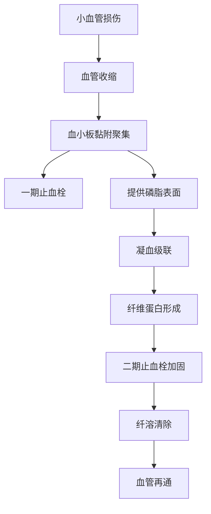
### 1.1 三个相互促进的基本过程
📎 课件原文：`02_基础生理_止血凝血与血型输血原则.pdf` Page 8–12；`10_出血凝血疾病_出血性疾病总论.pptx` Slide 11、16–18
1. **血管收缩**：损伤性反射、血管肌源性收缩及血小板释放 5-HT、TXA₂ 共同减少局部血流。它是最早反应，但持续较短。
2. **血小板止血栓形成（一期止血）**：血小板黏附于损伤处，ADP、TXA₂募集更多血小板，继而不可逆聚集，初步堵住伤口。
3. **血液凝固（二期止血）**：凝血系统使纤维蛋白原转为纤维蛋白，纤维蛋白网加固血小板栓。
- 血管收缩减慢血流，有利于血小板黏附；活化血小板提供带负电荷的磷脂表面；凝血酶又反过来增强血小板活化。课件结论：**血小板贯穿三个环节**。
### 1.2 血小板黏附—活化—聚集
📎 课件原文：`10_出血凝血疾病_出血性疾病总论.pptx` Slide 12–18；`14_出血凝血疾病_血栓形成与抗栓治疗.pptx` Slide 15–17
- **黏附**：GPIb-V-IX 复合物与固定在胶原上的 vWF 结合；GPIa/IIa、GPVI 与胶原结合。
- **vWF（von Willebrand factor）**：由血小板和内皮细胞产生，参与血小板黏附、聚集及凝血；其结合位点包括胶原、GPIb、GPIIb/IIIa、Ⅷ因子等。
- **活化触发物**：暴露的胶原、血小板释放的 ADP、TXA₂及凝血酶。
- **活化后变化**：细胞内 Ca²⁺增加，血小板由盘状变得不规则、伸出突起，表面积增大；膜外侧磷脂酰丝氨酸增加，支持凝血因子复合物组装。
- **聚集**：GPIIb/IIIa 与游离纤维蛋白原、vWF 结合，使血小板彼此连接。
> [!NOTE] 📌 请注意
> 一期止血缺陷更容易表现为皮肤、黏膜出血；二期止血缺陷更容易表现为深部血肿和关节出血。先看出血“长相”，再看化验。

### 1.3 教材校订｜vWF与vWD：一期止血和FⅧ稳定性为何同时受影响
📖 教材校订：`《内科学》第10版_书签.pdf` PDF P643、P659—660
- vWF 主要由血管内皮细胞和巨核细胞合成，存在于内皮细胞、巨核细胞及血小板；它介导血小板经 GPⅠb 黏附于受损血管壁，也与 FⅧ 形成复合物以稳定 FⅧ。
- vWD：vWF量或质异常同时损害血小板黏附/聚集和 FⅧ 稳定性；以鼻出血、牙龈出血、瘀斑、月经过多及小手术后出血为主，与血友病相比自发性关节/肌肉出血相对少见。筛查可正常或仅 APTT 延长，确诊看 vWF:Ag、vWF:RCo 及 FⅧ:C。
## 2. 凝血、抗凝与纤溶：同一平衡的三股力量 ⭐⭐⭐
### 2.1 凝血通路：外源启动、内源放大、共同通路成网
📎 课件原文：`02_基础生理_止血凝血与血型输血原则.pdf` Page 16–29；`10_出血凝血疾病_出血性疾病总论.pptx` Slide 19–33；`11_出血凝血疾病_出血与血栓实验诊断.pptx` Slide 7、9；`12_出血凝血疾病_DIC病理生理.pptx` Slide 13–14
- 凝血因子多以罗马数字表示，右下角“a”表示活化形式。
- 凝血三个基本步骤：**Ⅹ→Ⅹa（凝血酶原酶复合物形成）→Ⅱ→Ⅱa（凝血酶形成）→Ⅰ→纤维蛋白**，ⅩⅢa再交联并强化纤维蛋白。
- **外源性途径**：组织损伤使组织因子 TF（Ⅲ）暴露，TF-Ⅶa-Ca²⁺复合物激活Ⅹ；路径短、启动快。
- **内源性途径**：血液接触胶原等带负电荷表面后，由Ⅻ、Ⅺ、Ⅸ、Ⅷ等参与；Ⅸa-Ⅷa-Ca²⁺-磷脂复合物激活Ⅹ，起维持和巩固作用。
- **共同通路**：Ⅹa与Ⅴa、Ca²⁺、磷脂组成凝血酶原酶复合物，形成凝血酶；凝血酶将纤维蛋白原转为纤维蛋白。
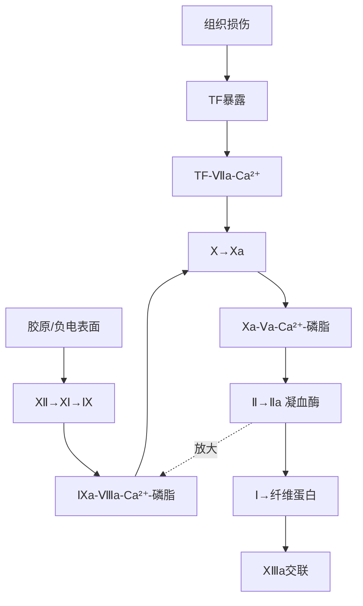
> [!WARNING] ⚠️ 常见疑问
> Q：为什么既讲“内源/外源并列”，又说传统模型不是体内最准确模型？
> A：课件把传统模型用于理解和实验筛查；现代模型强调 TF 启动后，少量凝血酶激活Ⅴ、Ⅷ、Ⅺ并放大反应。两者用途不同，不是互相否定。

### 2.2 抗凝系统：把凝块限制在损伤处
📎 课件原文：`02_基础生理_止血凝血与血型输血原则.pdf` Page 32–37；`10_出血凝血疾病_出血性疾病总论.pptx` Slide 10、34–36；`12_出血凝血疾病_DIC病理生理.pptx` Slide 15–17；`14_出血凝血疾病_血栓形成与抗栓治疗.pptx` Slide 12–13
- 正常内皮通过物理屏障及 PGI₂、NO 抑制血小板活化和聚集。
- **抗凝血酶（AT/AT-Ⅲ）**：灭活凝血酶及Ⅸa、Ⅹa、Ⅺa、Ⅻa等；与肝素结合后抗凝作用增强。
- **蛋白C系统**：凝血酶与血栓调节蛋白（TM）结合后激活蛋白C；活化蛋白C在蛋白S协助下灭活Ⅴa、Ⅷa，并促进纤溶。
- **TFPI（组织因子途径抑制物）**：抑制Ⅹa及Ⅶa-TF复合物，对外源启动形成负反馈限制。
### 2.3 纤溶系统：拆掉已经完成任务的纤维蛋白网
📎 课件原文：`02_基础生理_止血凝血与血型输血原则.pdf` Page 38–43；`10_出血凝血疾病_出血性疾病总论.pptx` Slide 38–39；`11_出血凝血疾病_出血与血栓实验诊断.pptx` Slide 11；`12_出血凝血疾病_DIC病理生理.pptx` Slide 18–19
- t-PA、u-PA使纤溶酶原转为纤溶酶；纤溶酶裂解纤维蛋白（原），产生 FDP（纤维蛋白/原降解产物）。
- **D-二聚体**来自交联纤维蛋白被降解，意味着此前发生过纤维蛋白形成与随后降解。
- 抑制物包括 PAI-1、α₂-抗纤溶酶及凝血酶激活的纤溶抑制物。
- 纤溶过强可再出血；纤溶过低可加重血栓栓塞。
> [!QUESTION]- 自检｜把“外源启动—内源放大—共同成网”推一遍
> 参考思路：TF暴露先形成TF-Ⅶa复合物并激活Ⅹ；凝血酶再激活Ⅴ、Ⅷ、Ⅺ放大反应；Ⅹa-Ⅴa复合物大量生成凝血酶，最终形成并交联纤维蛋白。

## 3. 从出血模式定位缺陷：先看部位，再看实验 ⭐⭐
📎 课件原文：`10_出血凝血疾病_出血性疾病总论.pptx` Slide 58–83；`11_出血凝血疾病_出血与血栓实验诊断.pptx` Slide 14–20
### 3.1 分类
- **血管因素**：血管壁结构或功能异常。
- **血小板异常**：数量减少/增多伴功能异常，或质量异常。
- **凝血异常**：先天/遗传性凝血因子缺陷，或肝病、维生素K缺乏等获得性异常。
- **抗凝及纤溶异常**：抗凝物增加或纤溶亢进。
- **复合性止血机制异常**：课件列出 vWD 与 DIC。
### 3.2 一期止血异常 vs 二期止血异常

| 线索 | 一期止血异常：血管/血小板 | 二期止血异常：凝血因子 |
|---|---|---|
| 常见部位 | 皮肤、黏膜 | 深部软组织、关节腔、内脏 |
| 常见形态 | 出血点、紫癜、瘀点/瘀斑 | 大片瘀斑、血肿、关节出血 |
| 诱因 | 自发出血较多 | 外伤、手术后出血较多 |
| 压迫效果 | 压迫止血常可见效 | 课件提示需新鲜血浆或成分输血方可见效 |
- 问诊抓手：既往出血、诱因、手术/流产史、药物及化学品接触、家族史、原发疾病。
- 体征抓手：出血部位、点/斑/肿的形态、是否伴休克、血栓栓塞或器官功能异常。
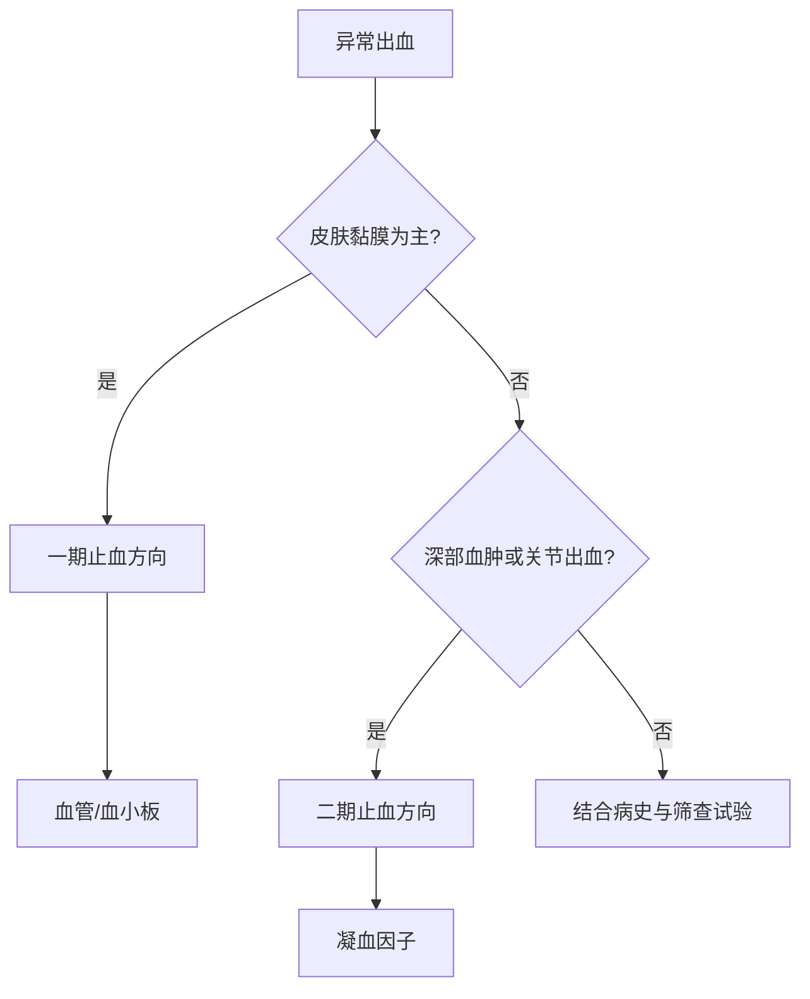
> [!QUESTION]- 自检｜病人反复关节出血，首先把病变定位到哪一层？
> 参考思路：关节出血在课件中更符合凝血因子异常，即二期止血缺陷；下一步重点看APTT、PT及相应凝血因子检测。

### 3.3 教材校订｜把“出血模式”接回血友病和纤溶异常
📖 教材校订：`《内科学》第10版_书签.pdf` PDF P647—648、P657—658
- 皮肤/黏膜出血点和紫癜多提示血管、血小板异常；深部血肿、关节出血提示凝血障碍；创伤或手术后**延迟性**出血还应考虑纤溶异常。
- 血友病 A 为 FⅧ 缺乏、B 为 FⅨ 缺乏；均属 X 连锁隐性，因内源性 FⅩ 激活受损形成二期止血缺陷。典型为男性、幼年起自发或轻伤后出血、深部肌肉血肿及反复关节出血。
- 压迫效果不是可靠的病因分流标准；出血模式只作相对提示，必须结合 PT、APTT、血小板、FIB及因子检测。
## 4. PT、APTT、TT、FIB：筛查试验诊断树 ⭐⭐⭐
### 4.1 各试验看哪一段
📎 课件原文：`11_出血凝血疾病_出血与血栓实验诊断.pptx` Slide 9、22–27；`10_出血凝血疾病_出血性疾病总论.pptx` Slide 42–56、79–83；`02_基础生理_止血凝血与血型输血原则.pdf` Page 28–30
- **PLT（血小板计数）**：先看数量；若结果与临床不符，课件提醒用外周血涂片识别假性血小板减少。
- **APTT（活化部分凝血活酶时间）**：筛查内源性凝血途径。
- **PT（凝血酶原时间）**：筛查外源性凝血途径。
- **TT（凝血酶时间）**：观察共同通路末端，即纤维蛋白原转为纤维蛋白的环节。
- **FIB/Fg（纤维蛋白原）**：既参与血小板聚集，又是纤维蛋白前体。
- **混合血浆纠正试验**：用于区分凝血因子缺乏与抑制物；课件指出，因子缺乏时补入正常血浆可纠正，抑制物存在时则不易纠正。
### 4.2 课件筛查组合的初步分类
📎 课件原文：`11_出血凝血疾病_出血与血栓实验诊断.pptx` Slide 27（图表经清晰页面转写）；`10_出血凝血疾病_出血性疾病总论.pptx` Slide 80–83
🖼 课件图像解读：以下分支按 Slide 27 的 PLT/APTT/PT/TT/FIB 组合客观转写。
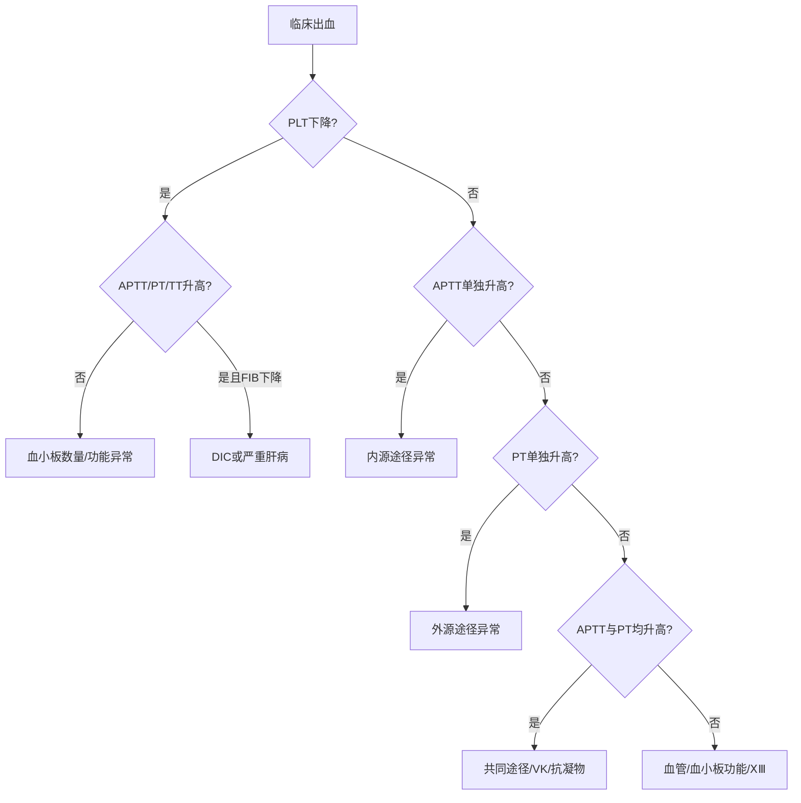

| 组合 | 课件给出的初步方向 |
|---|---|
| PLT、APTT、PT、TT、FIB均正常 | 血小板功能异常、血管异常、ⅩⅢ缺陷 |
| PLT下降或可正常，其余筛查正常 | 血小板数量异常或血小板功能异常 |
| APTT单独升高 | 内源凝血途径异常、血友病、Ⅺ缺乏、肝素治疗、因子抑制物增多 |
| PT单独升高 | 外源凝血途径异常、肝脏病、维生素K缺乏、口服抗凝药、Ⅶ缺陷 |
| APTT与PT均升高，PLT正常 | 维生素K因子缺乏、共同途径Ⅹ/Ⅴ/Ⅱ缺陷、Ⅴ+Ⅷ缺陷、抗凝物增多 |
| TT升高并伴FIB异常，PLT可正常 | 纤维蛋白原缺陷、原发性纤溶亢进、肝素治疗 |
| PLT下降，APTT/PT/TT升高，FIB下降 | DIC或严重肝病 |
> [!NOTE] 📌 请注意
> “筛查”只负责定位方向，不等于确诊。课件要求：异常后再做凝血因子测定、抑制物/抗凝物测定、DIC项目或肝功能等确诊试验。

> [!QUESTION]- 自检｜APTT延长、PT正常，应先想到哪条路径？如何继续？
> 参考思路：先定位内源性途径；再结合混合血浆纠正试验区分因子缺乏与抑制物，并按课件方向检测Ⅷ、Ⅸ、Ⅺ等因子。

### 4.4 教材校订｜APTT单独延长时，怎样把机制、筛查和确证接起来
📖 教材校订：`《内科学》第10版_书签.pdf` PDF P658
- 若 APTT 单独升高并伴深部血肿/关节出血，优先考虑血友病；PT、TT、FIB及血小板通常正常，但轻型患者 APTT 可近正常。
- 后续测 FⅧ/FⅨ 活性，并以 APTT 纠正试验、vWF及抑制物检测鉴别。
## 5. DIC：为什么同时有“血栓”和“出血” ⭐⭐⭐
### 5.1 定义与病因
📎 课件原文：`13_出血凝血疾病_DIC临床诊疗.pptx` Slide 4、6–14；`12_出血凝血疾病_DIC病理生理.pptx` Slide 6–9；`11_出血凝血疾病_出血与血栓实验诊断.pptx` Slide 42
- **DIC（disseminated intravascular coagulation，弥散性血管内凝血）**：在多种基础疾病上，微血管体系受损，凝血与纤溶系统被激活，形成全身微血栓；凝血因子和血小板大量消耗并继发纤溶亢进，导致全身出血与微循环衰竭。
- 课件列出的常见病因：严重感染、妊娠并发症、恶性肿瘤、广泛组织损伤/大手术；另有急性胰腺炎、异型输血、恶性疟疾、蛇毒/蜂毒等促凝物质入血情形。
- 促进因素：单核-巨噬细胞系统或肝功能受损、高凝状态（如妊娠）、缺氧、酸中毒、脱水、休克及微循环障碍。
### 5.2 机制级联：凝血先失控，随后“边栓边出血”
📎 课件原文：`13_出血凝血疾病_DIC临床诊疗.pptx` Slide 7、10–18；`12_出血凝血疾病_DIC病理生理.pptx` Slide 10–26
1. **组织损伤**：TF入血，激活外源性凝血。
2. **内皮损伤/激活**：胶原暴露激活内源性途径，TF释放激活外源性途径，同时促进血小板聚集；PGI₂、AT、TFPI、TM等抗凝力量下降，t-PA减少、PAI增多。
3. **血小板与血细胞参与**：血小板释放 ADP、TXA₂并提供磷脂表面；红细胞破坏释放ADP、暴露磷脂。
4. **凝血广泛激活**：微血管内形成血小板血栓和纤维蛋白血栓。
5. **消耗与纤溶**：血小板和凝血因子被消耗，继发性纤溶亢进，FDP增加；最终既有微血栓，也有广泛出血。
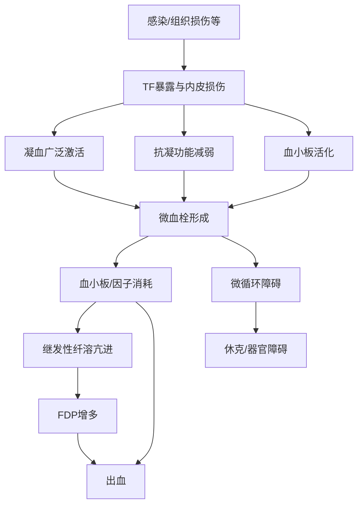
> [!WARNING] ⚠️ 常见疑问
> Q：DIC明明先凝血，为什么最后出血？
> A：因为凝血是“全身微血管内失控地发生”。大量微血栓消耗血小板和凝血因子，又激活继发性纤溶；止血原料被耗掉，纤维蛋白又被拆解，于是出现广泛出血。

### 5.3 分期与分型
📎 课件原文：`12_出血凝血疾病_DIC病理生理.pptx` Slide 34；`13_出血凝血疾病_DIC临床诊疗.pptx` Slide 17–18
- 发生发展可概括为：**高凝期 → 消耗性低凝期 → 继发性纤溶亢进期**，但课件提醒临床分界并不清楚。
- 按发展速度：急性、亚急性、慢性；按内稳态情况：显性、非显性。
### 5.4 教材校订｜DIC为什么同时出血、血栓和器官损害
📖 教材校订：`《内科学》第10版_书签.pdf` PDF P662—663
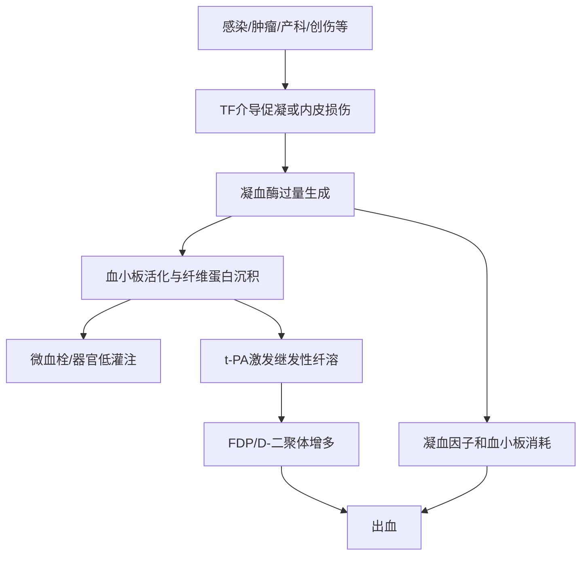
- 教材主线：凝血酶过量可诱导血小板活化，并促内皮释放 t-PA、激活纤溶酶；过量纤维蛋白驱动继发性纤溶亢进，FDP 增多并因抗凝作用加重出血。
- 因此不要把“t-PA减少、PAI增多”与以上教材主线并列为普遍机制。
## 6. DIC 的临床、实验诊断与鉴别 ⭐⭐⭐
### 6.1 四组临床后果
📎 课件原文：`13_出血凝血疾病_DIC临床诊疗.pptx` Slide 19–25；`12_出血凝血疾病_DIC病理生理.pptx` Slide 27–30；`11_出血凝血疾病_出血与血栓实验诊断.pptx` Slide 43–44
1. **出血**：广泛、多部位，不能由原发病解释，可伴休克，常规止血药效果差；课件称其为最常见表现。
2. **微循环衰竭/休克**：出血使有效循环血量下降；微血栓减少回心血量并损害心泵；激肽、补体、纤溶系统激活导致血管扩张、外周阻力下降和通透性增加。
3. **微血管栓塞与器官功能障碍**：肺、肾、心、脑等受累，可出现呼吸、肾、心泵及神经系统功能障碍。
4. **微血管病性溶血性贫血**：红细胞挂在纤维蛋白丝上并受血流冲击而破裂；外周血可见裂体细胞。
### 6.2 实验室检查与课件诊断框架
📎 课件原文：`13_出血凝血疾病_DIC临床诊疗.pptx` Slide 26–37；`12_出血凝血疾病_DIC病理生理.pptx` Slide 31–32
- **消耗性凝血障碍**：血小板计数下降；APTT、PT、TT异常；纤维蛋白原降低或动态变化。
- **纤溶亢进**：FDP、D-二聚体升高，3P试验可阳性；课件亦列出 t-PA、AT-Ⅲ检测。
- **微血管病性溶血**：血涂片异型/破碎红细胞增多。
- 课件诊断主线：先确认存在易引起DIC的基础疾病，再看临床表现与多项实验异常；强调**动态下降/动态变化**，不能只盯一次结果。
> [!NOTE] 📌 课件中的传统诊断条目
> `12_出血凝血疾病_DIC病理生理.pptx` Slide 31 与 `13_出血凝血疾病_DIC临床诊疗.pptx` Slide 34–35列出：有基础疾病；临床表现中符合多发性出血、不能解释的休克/微循环衰竭、多发性微血管栓塞等；实验上血小板＜100×10⁹/L或进行性下降、纤维蛋白原＜1.5 g/L或进行性下降、PT较正常缩短或延长3 s以上/动态变化、3P阳性或FDP升高、D-二聚体升高等。这里仅按课件保留，不外推为课件外最新版指南。

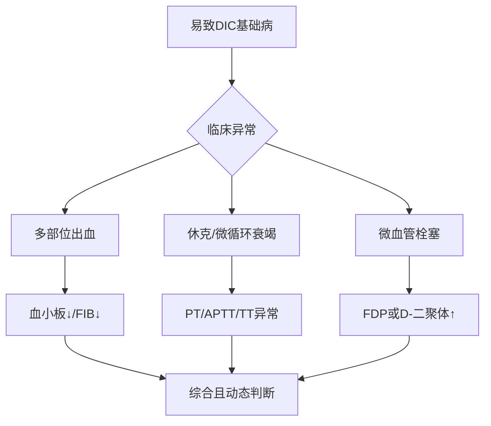
### 6.3 DIC 鉴别：只保留课件能可靠支持的区别
📎 课件原文：`13_出血凝血疾病_DIC临床诊疗.pptx` Slide 38–41；`12_出血凝血疾病_DIC病理生理.pptx` Slide 31–32；`10_出血凝血疾病_出血性疾病总论.pptx` Slide 81–83

| 鉴别方向 | 与DIC的重叠 | 课件给出的分流点 |
|---|---|---|
| 重症肝病/重症肝炎 | PLT、APTT、PT、TT、FIB可同时异常 | 全部筛查异常时二者都要怀疑；继续查DIC相关试验或肝功能，并结合基础病与动态变化 |
| 原发性纤溶亢进 | 可有FDP升高、出血 | 原发性纤溶直接降解纤维蛋白原，FDP↑而D-二聚体不升高；DIC继发性纤溶有交联纤维蛋白先形成，D-二聚体升高 |
| TTP | 课件将其列为鉴别诊断 | ⚠️ 图像未可靠识别：`13_出血凝血疾病_DIC临床诊疗.pptx` Slide 40正文未从文本中可靠提取，需结合原课件图像复习，讲义不猜测具体差异 |
> [!QUESTION]- 自检｜DIC中“血小板下降、D-二聚体升高、裂体细胞”分别从哪条机制来？
> 参考思路：微血栓形成消耗血小板；交联纤维蛋白被继发性纤溶降解产生D-二聚体；红细胞通过纤维蛋白网时受机械冲击破裂，形成裂体细胞。

### 6.4 教材校订｜DIC的FIB、评分、TTP鉴别与肝素边界
📖 教材校订：`《内科学》第10版_书签.pdf` PDF P663—665
- 感染相关 DIC 早期 FIB 可因急性时相反应正常或轻度升高；**正常 FIB 不能排除 DIC**，关键是持续下降趋势和其他消耗/纤溶指标。
- 教材 ISTH 显性 DIC 评分：PLT `≤100`/`≤50×10^9/L`、PT延长`3—6`/`>6秒`、FIB `≤1.0 g/L`及纤溶标志物共同计分，`≥5分`符合 DIC并建议每日重复。课件不同阈值应标为课堂口径，不能混用。
- TTP：ADAMTS13 缺乏或活性降低→超大分子 vWF 不能正常降解→血小板性微血栓。可有血小板减少、微血管病性溶血和器官损伤，但通常缺乏 DIC 的凝血因子消耗与继发纤溶依据，PT、APTT、FIB 多正常。
- DIC 治疗优先处理原发病。肝素用于抗凝防栓/治栓时应避免过量，且**出血型 DIC 禁用抗凝治疗**；不能把“DIC早期”简化为所有 DIC 的常规肝素适应证。
## 7. 血栓性疾病：Virchow 三要素把风险串起来 ⭐⭐⭐
### 7.1 定义与分类
📎 课件原文：`14_出血凝血疾病_血栓形成与抗栓治疗.pptx` Slide 3–9
- **血栓形成（thrombosis）**：血液有形成分在血管内形成栓子，导致血管部分或完全堵塞及相应血供/回流障碍。
- **血栓栓塞（thromboembolism）**：血栓脱落并随血流移动，堵塞其他血管；动脉栓塞可引起缺血、缺氧、坏死，静脉栓塞可引起淤血、水肿。
- 课件分类：静脉血栓栓塞症（含肺血栓栓塞症、深静脉血栓症）与动脉血栓性疾病（列举急性冠状动脉综合征、心房颤动、动脉缺血发作、脑卒中）。
### 7.2 发病机制：血管壁、血液成分、血流
📎 课件原文：`14_出血凝血疾病_血栓形成与抗栓治疗.pptx` Slide 9–26
- **血管壁异常**：正常内皮不表达TF，并通过PGI₂、NO、ADP酶、t-PA/u-PA、TFPI、TM及肝素样物质维持抗凝和纤溶；损伤后TF释放、抗凝/纤溶力量下降，转向促凝。
- **血液成分改变**：血小板数量增加或活性增强；凝血因子异常；抗凝系统减弱；纤溶活力降低。课件还列出白细胞、红细胞异常对微循环和凝血的促进作用。
- **血流异常**：课件沿用 Virchow 三要素中的血液流变学异常。
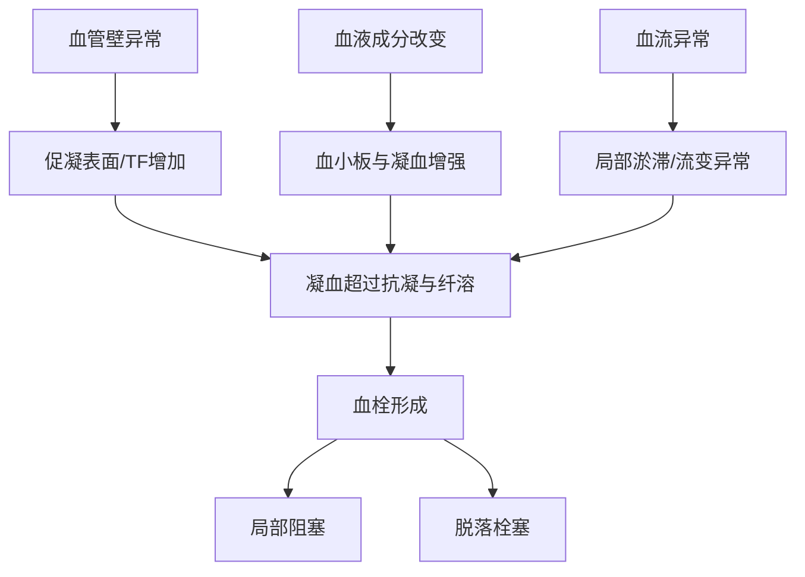
### 7.3 易栓症与临床表现
📎 课件原文：`14_出血凝血疾病_血栓形成与抗栓治疗.pptx` Slide 6–8、22–27；`11_出血凝血疾病_出血与血栓实验诊断.pptx` Slide 30–39
- **易栓症（thrombophilia）**：存在易发生血栓的遗传性或获得性缺陷。
- 遗传性方向包括AT、蛋白C、蛋白S缺陷/APC抵抗，凝血酶原变异，纤溶酶原或t-PA异常等；课件提示可用基因测序和/或蛋白活性测定确诊。
- **静脉血栓**：较多见，表现为局部肿胀、疼痛、远端回流障碍；脱落后可栓塞并造成器官功能障碍。
- **动脉血栓**：多起病突然，可有局部剧痛、供血区结构和功能异常、缺血性坏死表现。
- **微血管血栓**：缺乏特异性，主要见皮肤黏膜栓塞性坏死、微循环衰竭和器官功能障碍。
- 血栓实验室方向：AT、PC、PS等抗凝物检测；FDP、D-二聚体、纤溶酶原、t-PA、PAI、TAFI等纤溶标志物；结合家系与基因检测评估遗传性易栓症。
> [!QUESTION]- 自检｜为什么AT、PC或PS缺陷会偏向血栓？
> 参考思路：这些是课件列出的生理性抗凝力量；缺陷后活化凝血因子不能被充分限制，凝血相对占优势，因而出现反复静脉血栓倾向。

### 7.4 教材校订｜Virchow三要素如何变成真实促栓机制
📖 教材校订：`《内科学》第10版_书签.pdf` PDF P666—668
- 内皮损伤后 vWF/血小板活化因子增加、PGI2减少、TF表达增加、抗凝/纤溶失衡，形成促栓状态。
- 血流异常的机制是黏滞度增高或红细胞变形能力下降造成局部血流减慢、淤滞；高纤维蛋白原血症、高脂血症、脱水、红细胞增多可促成。
- 提示遗传性易栓症的模式：`<45岁、无明显诱因、多发/反复血栓或家族史`；获得性易栓症常联系恶性肿瘤、肾病综合征、抗磷脂综合征。普通肝素以 APTT 监测、华法林以 INR 监测。
## 8. 冲刺收束：一条线背完 ⭐⭐
📎 课件原文：`02_基础生理_止血凝血与血型输血原则.pdf` Page 6–43；`10_出血凝血疾病_出血性疾病总论.pptx` Slide 3–83；`11_出血凝血疾病_出血与血栓实验诊断.pptx` Slide 4–45；`12_出血凝血疾病_DIC病理生理.pptx`、`13_出血凝血疾病_DIC临床诊疗.pptx`与`14_出血凝血疾病_血栓形成与抗栓治疗.pptx`见上述模块锚点
> [!SUMMARY] 📝 Take-Home Messages
> - 正常止血是血管收缩、血小板一期止血、凝血二期止血，再由抗凝和纤溶限制与清除。
> - 外源性TF途径快速启动，内源性途径维持放大，共同通路以凝血酶和纤维蛋白收尾。
> - 皮肤黏膜点状出血偏一期止血缺陷；深部血肿和关节出血偏凝血因子缺陷。
> - APTT看内源，PT看外源，TT/FIB看共同通路末端；筛查异常后还要做因子、抑制物、DIC或肝功能等确诊试验。
> - DIC不是单纯“出血病”：它先广泛凝血形成微血栓，再因消耗凝血成分与继发纤溶出现出血。
> - DIC四组后果：出血、休克/微循环衰竭、微血管栓塞/器官障碍、微血管病性溶血。
> - 血栓用Virchow三要素串联：血管壁异常 + 血液成分改变 + 血流异常。

> [!QUESTION]- 终局自检｜看到“PLT↓、PT/APTT延长、FIB↓、D-二聚体↑、裂体细胞”时，如何从筛查树走到机制解释？
> 参考思路：组合提示DIC或严重肝病；若存在易致DIC基础病，并见微血栓/出血/休克等临床链，再结合D-二聚体升高和裂体细胞，支持“广泛凝血→消耗→继发性纤溶→机械性红细胞破碎”的DIC机制。仍须综合动态检查并与重症肝病等鉴别。

***
## 9. 输血与药理总图 ⭐⭐⭐
📎 课件原文：15_输血医学_血型系统与临床输血.pptx第 17-23、48-50 页；16_血液药理_血栓止血与造血药物.pptx第 2、29、44、48、58 页
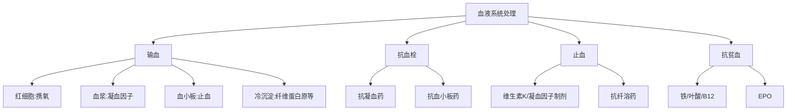
👆 分类图：先按临床目标分，再进入具体制品或药物。
- 输血的合理目的只有课件强调的两类：提高携氧能力、纠正止凝血异常；除此以外，课件判为不合理输血。
- 动脉血栓以血小板与凝血系统同时活化、白血栓为主，治疗以抗血小板为主；静脉血栓以凝血系统活化、红血栓为主，治疗以抗凝为主。
- 促凝与抗贫血药不是“反向抗凝”这么简单：前者补充/促进凝血环节，后者针对造血原料或生长信号。
> [!SUMMARY] 📝 核心要点
> - 看到“缺氧/贫血”先想到红细胞；看到“凝血因子不足”先想到血浆；看到“血小板减少”想到血小板；看到“纤维蛋白原缺乏”想到冷沉淀。
> - 看到动脉白血栓偏向抗血小板；看到静脉红血栓偏向抗凝。

全局图中，输血与药物两条线分别解决什么问题？
> [!QUESTION]- 参考思路
> 输血线直接补充携氧或止凝血所需成分；药物线则抑制血栓、促进凝血/抗纤溶，或补充造血原料与生长信号。

### 9.1 教材校订｜输血目的不能只写两类
📖 教材校订：`《内科学》第10版_书签.pdf` PDF P669—671
- 本讲义优先复习的常规目标是提高携氧能力和纠正止血/凝血成分缺乏；教材还将输血适应证分为替代、免疫、置换和移植治疗，不能表述为“合理目的只有两类”。
- 成分输血的核心仍是“缺什么补什么”，但具体用途要回到病人的病理环节。
## 10. ABO、Rh 与交叉配血 ⭐⭐⭐
📎 课件原文：15_输血医学_血型系统与临床输血.pptx第 2-11、39-40、47 页
### 2.1 红细胞血型系统与 ABO
- 红细胞血型系统有 40 多个，红细胞抗原约 300 多种；ABO 发现最早、应用最广，Rh 的重要性仅次于 ABO。
- ABO 基因型与表型：A 型＝AA 或 AO；B 型＝BB 或 BO；AB 型＝AB；O 型＝O。A、B 为显性基因，O 为隐性基因。
- 课件举例：A×A 的子代可能为 A、O，不可能为 B、AB；A×B 的子代可能为 A、B、AB、O。
⚠️ 图像未可靠识别：15_输血医学_血型系统与临床输血.pptx第 4 页题为“ABO 血型抗原和抗体特性”，但当前文本未提取出表格内容；不得据此补写各型抗原/抗体表，请回看原课件第 4 页。
### 2.2 Rh：核心是 D 抗原
- Rh 系统有 50 多个抗原，与临床密切的 5 种为 D、E、C、c、e；抗原性顺序：D＞E＞C＞c＞e。
- Rh 阳性：红细胞含 D 抗原；Rh 阴性：红细胞不含 D 抗原。
- 弱 D 属 Rh 阳性。课件对 Rh 亚型给出的输血原则：作为献血者，输给 Rh 阳性者；作为受血者，输入 Rh 阴性血。
- 部分 D：D 抗原检测阳性，但输入 D 阳性血后可产生抗-D 抗体。
⚠️ 图像未可靠识别：15_输血医学_血型系统与临床输血.pptx第 9 页仅提取出“RH 血型”标题，需结合原图复习。
### 2.3 交叉配血：课件只要求“必须相合”，未展开方法
- 常规输血：检查血型，选择血型相同供血者，并确认交叉配血相合。
- 急性溶血反应预防：重视血液标本、坚持正反定型、严格交叉配血。
- 迟发性溶血反应预防：询问输血史/妊娠史；不能只用盐水介质配血；短期多次输血者输血前做抗体筛选。
- 病情紧急时，课件允许只查 ABO 和 Rh、不做交叉配血，直接输同型血或风险最小的血；病情火急时可不查血型、不交叉配血而输 O 型红细胞。
> [!WARNING] ⚠️ 常见疑问
> Q：能否根据本课件写出主侧、次侧交叉配血的具体操作和判读？
> A：不能。当前课件文本只明确“交叉配血相合/严格交叉配血”，未给出具体操作与判读，冲刺时必须回看授课补充材料或原图。

### 2.4 紧急红细胞选择（按课件原表）
📎 课件原文：15_输血医学_血型系统与临床输血.pptx第 39-40 页

| 患者血型 | 首选 | 二选 | 三选 |
|---|---|---|---|
| A | A 型红细胞 | O 型红细胞 | 无 |
| B | B 型红细胞 | O 型红细胞 | 无 |
| AB | AB 型红细胞 | A 或 B 型红细胞 | O 型红细胞 |
| O | O 型红细胞 | 无 | 无 |
- Rh 阴性 O 型洗涤红细胞：课件称 ABO/Rh 不合溶血风险最小，但风险不为零，仍可能存在同种抗体或其他血型不合。
- Rh 阳性 O 型洗涤红细胞：可避免 ABO 不合溶血，但风险高于 Rh 阴性 O 型洗涤红细胞；课件特别提示女性，尤其育龄妇女，风险考虑高于男性。
> [!TIP] 💡 记忆辅助
> “先同型，再 O 型；AB 可退 A/B，火急仍有风险。”
> 对应关系：常规优先同型；A、B 可退至 O 红细胞；AB 可依次考虑 A/B、O；即使 O 型洗涤红细胞也不是零风险。
> [!SUMMARY] 📝 核心要点
> - ABO 看基因型/表型，Rh 临床核心看 D 抗原。
> - 常规输血必须血型检查且交叉配血相合；紧急例外不等于无风险。
> - 课件没有给出完整 ABO 抗原抗体表和交叉配血操作，不能靠常识补写。

为什么“紧急可省略交叉配血”不能被理解为“O 型血绝对安全”？
> [!QUESTION]- 参考思路
> 课件明确指出即使 Rh 阴性 O 型洗涤红细胞，仍可能因同种抗体或其他血型不合发生风险；紧急策略只是取风险较小的方案。

## 11. 成分输血：缺什么补什么 ⭐⭐⭐
📎 课件原文：15_输血医学_血型系统与临床输血.pptx第 17-21、29-38、42-47 页
### 3.1 为什么提倡成分输血
- 提高疗效、节约血液资源；减少病原传播风险和输血不良反应；疗效明确同时减轻体循环负担。
- “全血并不全”：血液离体后出现保存损害。课件指出血小板在 4℃保存后活性迅速下降，FV、FVIII 活性也会丧失。
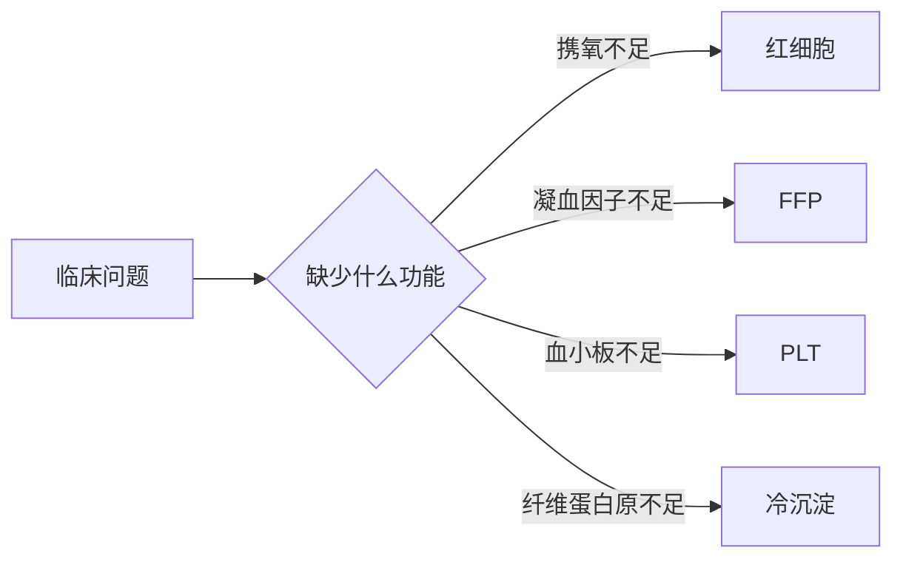
👆 课件的合理输血主线。
### 3.2 四类核心成分

| 成分 | 课件定位 | 主要课件内指征/要点 | 关键数值 |
|---|---|---|---|
| 红细胞（RBC） | 提高携氧能力 | 慢性贫血伴缺氧症状；红细胞破坏、丢失或生成障碍 | 外科 Hb＞100 g/L 不输，＜70 g/L 考虑；内科 Hb＜60 g/L 或 Hct＜0.2 可考虑 |
| 血小板（PLT） | 补充血小板、迅速止血 | 首选 ABO 同型，其次配合型；尽快输入 | 外科＞100×10^9/L 不输，＜50×10^9/L 考虑；内科＜5×10^9/L 紧急输注 |
| 血浆（FFP） | 补充凝血因子 | PT 或 APTT＞正常 1.5 倍且创面弥漫渗血；大量库存血；凝血因子缺乏；紧急对抗华法林 | 10–20 mL/kg；对抗华法林 5–8 mL/kg |
| 冷沉淀 | 补充纤维蛋白原及课件所列因子 | 轻型甲型血友病、vWD、纤维蛋白原缺乏、因子 VIII 缺乏 | 1–1.5 U/10 kg；vWD 可按 1 U/10 kg 粗估 |
- 红细胞制品包括红细胞悬液、浓缩红细胞、少白细胞红细胞、洗涤红细胞、冰冻红细胞、年轻红细胞、辐照红细胞。
- 洗涤红细胞用于避免输入血浆中补体、凝集素、蛋白质等；课件列举血浆蛋白过敏、自身免疫性溶血性贫血、高钾血症、肝肾功能障碍和阵发性睡眠性血红蛋白尿症。
- 血小板输注禁忌证：TTP、HIT、HUS。脾肿大、感染、DIC 等非免疫因素存在时，课件提示输注量适当加大。
- FFP 禁忌证：无输血浆适应证；既往输血发生严重血浆蛋白过敏。FFP 剂量不宜过大，以免循环超负荷。
### 3.3 大失血与特殊情境
📎 课件原文：15_输血医学_血型系统与临床输血.pptx第 37-47 页
- 大量输血定义：24 h 内输入血液＞全身血量，或 1–3 h 内输入＞1/2 全身血量。
- 大失血程序：维持循环血容量（扩容）→保持携氧能力（红细胞）→恢复凝血与内环境稳定（血小板、FFP、冷沉淀）。
- 慢性贫血：先查明原因；有其他有效替代手段则不输血，除非贫血危及生命。课件强调无贫血症状时，即使 Hb 40–50 g/L 也不输血。
- 围术期：治疗贫血、停用抗血小板药、采用自身输血；DDAVP 可增强血小板和凝血因子功能，课件称可减少 20% 输血。
- 自体输血分储存式、稀释式、回收式；可节约资源、避免传播疾病和同种免疫，并解决稀有血型或疑难交叉配血供血。
> [!NOTE] 📌 请注意
> 课件同时给出“数值阈值”和“个体化、最少剂量、不可替代性”原则。不要把单一 Hb/PLT 数值脱离症状、病情和临床场景机械套用。
> [!SUMMARY] 📝 核心要点
> - 成分输血就是缺功能补成分，而不是用全血“包打天下”。
> - RBC 管携氧，FFP 管凝血因子，PLT 管血小板，冷沉淀重点补纤维蛋白原及课件所列因子。
> - 慢性贫血优先查因与替代治疗；大量输血要同时兼顾容量、携氧、凝血和内环境。

患者 PT/APTT 延长并有创面弥漫性渗血时，课件倾向何种成分？为什么不能把它换成红细胞？
> [!QUESTION]- 参考思路
> 课件指向 FFP，因为问题是凝血因子不足；红细胞主要提高携氧能力，不能替代这一目标。

## 12. 输血前、中、后的安全抓手 ⭐⭐
📎 课件原文：15_输血医学_血型系统与临床输血.pptx第 19、22-24、39-40、45-47、63、68 页
- 合理输血原则：不可替代性、满足生理需求（最少剂量）、个体化、安全、合理、有效。
- 输血器：必须使用专用输血器，滤网孔径＜170 μm，用于去除库存血中的微聚物。
- 无菌与配伍：注意无菌，血中不加任何药物；严格核对血型。
- 观察：输血开始后 10–15 min 严密观察有无输血反应。
- 身份与标本：急性溶血反应的主要原因是人为差错，误认受血者身份最常见；因此标本、正反定型、交叉配血必须形成闭环。
- 特殊患者：骨髓移植首选辐照血制品；Rh 阴性患者输 ABO 同型 Rh 阴性红细胞；溶血性贫血患者输洗涤红细胞。
⚠️ 图像未可靠识别：15_输血医学_血型系统与临床输血.pptx第 24 页“输血流程图”和第 25-27 页“输血种类及适应证”未从文本提取出可还原内容，需结合原课件。
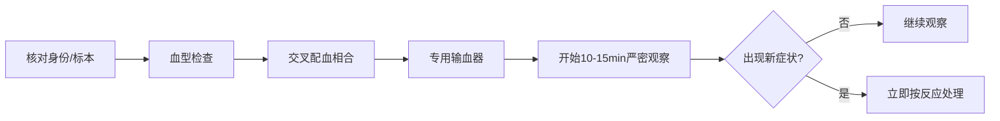
👆 仅整合课件明确出现的安全节点；未补写课件未提供的完整医院流程。
> [!SUMMARY] 📝 核心要点
> - 安全输血的第一道防线是“人—标本—血袋”核对，第二道才是检验与交叉配血。
> - 输血开始后的前 10–15 min 是课件明确要求的严密观察期。

为什么身份核对被放在安全链最前面？
> [!QUESTION]- 参考思路
> 课件指出急性溶血多由 ABO 不相容引起，而人为差错是主要原因，误认受血者身份最常见。

## 13. 常见与严重输血反应：先停血，再分型 ⭐⭐⭐
📎 课件原文：15_输血医学_血型系统与临床输血.pptx第 48-85 页
### 5.1 总分类与即时原则
- 输血反应：输血过程中或输血后出现原疾病不能解释的新症状、体征。
- 可按原因分免疫/非免疫；按时间分急性（输血期间或 24 h 内）与迟发（24 h 后）；也可按血液成分分类。
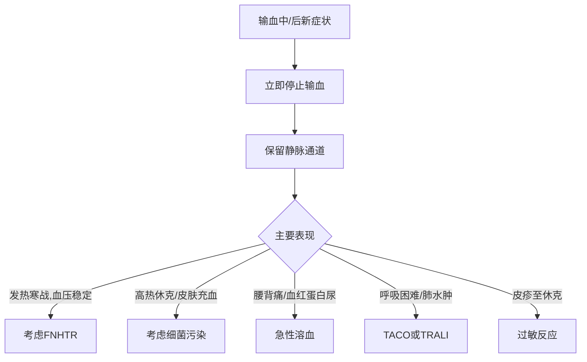
👆 分流只使用课件列出的表现；不是完整临床诊断算法。
### 5.2 关键反应对比

| 反应 | 时间/线索 | 典型表现 | 课件内处理 | 预防/鉴别抓手 |
|---|---|---|---|---|
| FNHTR | 开始后 15 min–2 h | 38–40℃、寒战；血压多无变化 | 停止输血，对症支持 | 去除致热原、去白细胞；与轻症溶血/细菌污染鉴别 |
| 严重过敏 | 输含血浆成分 | 支气管痉挛、喉头水肿、呼吸困难、过敏性休克 | 停止输血，对症支持 | 避免血浆；用洗涤红细胞或自体输血 |
| 急性溶血 | 多为 ABO 不合，常见人为差错 | 畏寒、发热、腰背/胸痛、呼吸困难、血红蛋白尿、黄疸；可休克、DIC、心肾衰 | 立即停血、保留通道；防治休克、DIC、急性肾衰 | 标本、正反定型、严格交叉配血 |
| 迟发性溶血 | 输后 3–7 d；多为 ABO 外血型不合 | 低热、柠檬黄黄疸、Hb 不升反降；多无血红蛋白尿 | 课件未给具体治疗 | 问输血/妊娠史；抗体筛查 |
| 细菌性反应 | 污染血液/成分 | 寒战、高热、皮肤充血、呼吸困难、休克、肾衰、DIC | 停血、保留通道；联合抗生素、抗休克 | 患者血与剩余血袋培养同一细菌 |
| TACO | 输血中或后 1 h 内；量大/速度快 | 端坐呼吸、频咳、泡沫痰、大汗、双肺湿啰音 | 停血保留通道；下肢下垂、吸氧、速效利尿剂等 | 本质是循环负荷超过心脏承受能力 |
| TRALI | 输后 1–6 h | 发热、寒战、咳嗽、气喘、紫绀、低血压、细湿啰音；无心衰表现 | 去因、充分给氧、肾上腺皮质激素、对症 | 与左心衰无关的急性肺水肿 |
| TA-GVHD | 输入免疫活性淋巴细胞；高危见免疫抑制/缺陷、亲属输血 | 发热及皮肤、肠道、肝、骨髓受损 | 无特效治疗 | 避免亲属输血；高危输辐照血、滤白 |
### 5.3 两组必须会的鉴别
📎 课件原文：15_输血医学_血型系统与临床输血.pptx第 69、71-77 页
**急性溶血 vs 迟发性溶血**

| 维度 | 急性 | 迟发性 |
|---|---|---|
| 原因 | ABO 不合 | ABO 以外血型不合 |
| 抗体 | IgM | IgG |
| 部位 | 血管内 | 血管外 |
| 时间 | 输血开始后约 30 min | 输血后数天 |
| 重点表现 | 寒战、腰痛、发热、血红蛋白尿 | 黄疸、贫血；一般无血红蛋白尿 |
**FNHTR vs 细菌性反应**

| 维度 | FNHTR | 细菌性反应 |
|---|---|---|
| 发热/寒战 | 有 | 有 |
| 血压 | 多无变化 | 低血压或休克 |
| 皮肤充血 | 无 | 有 |
| 程度/对症反应 | 较轻，对症后较快缓解 | 重，对症处理无效 |
> [!WARNING] ⚠️ 常见疑问
> Q：TACO 与 TRALI 都可呼吸困难，课件给的最直接区别是什么？
> A：TACO 来自容量/速度超过心脏负荷，表现为心衰或急性肺水肿；TRALI 定义上与左心衰无关，且常伴低血压、发热寒战。
> [!TIP] 💡 记忆辅助
> “热而压稳想发热，热休充血想细菌；腰痛血尿急溶血，肺水先分心负荷。”
> 对应关系：FNHTR 多血压稳定；细菌污染可休克并皮肤充血；急性溶血抓腰背痛和血红蛋白尿；肺水肿再按有无容量负荷/心衰表现区分 TACO 与 TRALI。
> [!SUMMARY] 📝 核心要点
> - 任何可疑严重反应，课件反复出现的第一步都是立即停止输血并保留静脉通道。
> - 发热寒战不是 FNHTR 的专属表现；低血压/休克、皮肤充血、对症无效更支持细菌污染。
> - 急性溶血抓 ABO 不合、血管内溶血和血红蛋白尿；迟发溶血抓既往免疫、3–7 d、Hb 不升、一般无血红蛋白尿。

面对输血后发热寒战，为什么不能直接按 FNHTR 处理后结束观察？
> [!QUESTION]- 参考思路
> 细菌污染和溶血也可发热寒战。应结合血压、皮肤充血、腰背痛、血红蛋白尿及严重程度继续分流；细菌性反应可进展至休克、肾衰和 DIC。

### 5.4 教材校订｜输血反应必须有机制，才能真正鉴别
📖 教材校订：`《内科学》第10版_书签.pdf` PDF P670—672
- 常规核血按教材需正定、反定，并做直接/间接交叉相容试验，核血记录完整无误后方可发血。原课件急诊策略是**课件急诊口径**，不能当作教材常规程序。
- 急性输血相关溶血除 ABO不合和人为核对差错外，还可见 Rh 不合、血液保存/运输/处理不当及受血者原有溶血性疾病。
- 迟发性溶血：既往输血致敏形成不规则同种抗体，后续再次暴露相应红细胞后发生免疫性溶血；课件“3—7天”保留为课件数值，教材概括为“输血数日后”。
- TRALI：供者血浆抗-HLA或抗中性粒细胞抗体使受者中性粒细胞在肺血管内聚集并激活补体，继而损伤肺毛细血管内皮，形成非心源性肺间质水肿。
- PTR：反复输血、妊娠或移植可诱导血小板抗体，导致血小板无效输注；对反复输血而疗效差者，血小板抗体检测有助于后续配型输注。
## 14. 抗凝血药总图与肝素类 ⭐⭐⭐
📎 课件原文：16_血液药理_血栓止血与造血药物.pptx第 2-10、18 页
### 6.1 分类
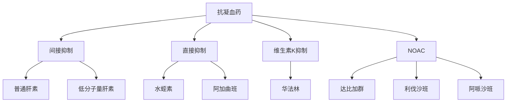
👆 分类名称按课件整理；华法林与 NOAC 的重点见下一模块。
### 6.2 普通肝素
- 体内过程：口服不吸收，常静脉滴注；体内、体外均有抗凝作用。
- 机制：加速抗凝血酶 III（ATIII）灭活 IIa、IXa、Xa、XIa、XIIa 等凝血因子。
- 应用：血栓栓塞性疾病；DIC 早期；心血管手术、心导管、血液透析、血液标本等抗凝。
- 不良反应：自发性出血、过敏；孕妇使用课件提示易致早产。
### 6.3 低分子量肝素（LMWH）
- 机制特点：选择性作用凝血因子 Xa，对凝血酶及其他凝血因子影响较小。
- 应用：预防深静脉血栓、肺栓塞；外科术后预防血栓；急性心梗；体外应用。
- 代表药课件列举较多，冲刺只保留依诺肝素；其余低频药名不展开。
### 6.4 直接凝血酶抑制药（历史/低频压缩）
- 水蛭素：凝血酶特异性抑制剂，与凝血酶 1:1 结合并灭活。
- 阿加曲班：与凝血酶催化部位高亲和结合；半衰期短、安全范围窄、无对抗剂。
### 6.5 监测与解救边界
- 16_血液药理_血栓止血与造血药物.pptx第 18 页定义：PT 反映外源性凝血；aPTT 是常用内源性凝血筛选试验；TT 反映纤维蛋白原转为纤维蛋白过程中是否存在异常抗凝现象。
- 但课件未明确给出普通肝素/LMWH 的具体监测目标，也未列出普通肝素解救剂；本讲义不补写。

| 药物 | 主要靶点/特点 | 给药/起效信息 | 应用 | 课件内主要风险/解救 |
|---|---|---|---|---|
| 普通肝素 | 借 ATIII 灭活 IIa、IXa、Xa、XIa、XIIa | 口服不吸收；常静滴；体内外有效 | 血栓、DIC 早期、体外抗凝 | 自发出血；未给解救剂 |
| LMWH | 更选择性抑制 Xa | 课件未给 | DVT/PE 预防、术后、急性心梗 | 课件未给监测/解救 |
| 水蛭素 | 1:1 直接灭活凝血酶 | 课件未给 | 课件未展开 | 课件未给 |
| 阿加曲班 | 直接结合凝血酶催化位点 | T1/2 短；安全范围窄 | 课件未展开 | 无对抗剂 |
> [!SUMMARY] 📝 核心要点
> - 普通肝素的关键词是“ATIII 加速器、多因子、体内外有效”；LMWH 更偏 Xa。
> - 不要凭课外记忆往课件空白处补监测目标和解救药。

普通肝素与 LMWH 的机制差别如何一句话说清？
> [!QUESTION]- 参考思路
> 普通肝素借 ATIII 加速灭活多种凝血因子；LMWH 更选择性作用 Xa，对凝血酶及其他凝血因子影响较小。

## 15. 华法林与 NOAC：靶点、监测、解救一表通 ⭐⭐⭐
📎 课件原文：16_血液药理_血栓止血与造血药物.pptx第 11-28 页；15_输血医学_血型系统与临床输血.pptx第 30 页
### 7.1 华法林
- 机制：对抗维生素 K，阻止因子 II、VII、IX、X 在肝内羧化，使其停留于无活性前体阶段；对已形成的上述因子无抑制作用。
- 特点：口服；体内抗凝；中效、起效慢、维持久；血浆蛋白结合率 90%–99%。
- 应用：防治血栓性疾病；防止静脉血栓，包括风湿心、髋关节固定术、人工心脏瓣膜置换术后等课件所列场景。
- 风险与相互作用：出血；维生素 K 缺乏增强作用；阿司匹林协同；部分高蛋白结合药可置换；肝药酶活性影响作用强度。
- 监测：治疗窗窄，需常规抗凝检测并调剂量；课件推荐 INR 2.0–3.0。
- 解救：维生素 K 对抗；15_输血医学_血型系统与临床输血.pptx另列紧急用 FFP 对抗华法林 5–8 mL/kg。
### 7.2 NOAC
- 达比加群酯：前体药，经非特异性酯酶转为达比加群；不经 CYP450，T1/2 12–14 h。直接、可逆抑制凝血酶 IIa，阻止纤维蛋白原裂解为纤维蛋白；用于非瓣膜性房颤患者中风及血栓预防。
- 利伐沙班：口服、直接、高选择性抑制 Xa，中断内外源凝血途径并减少凝血酶生成；用于择期髋/膝关节置换成年患者预防静脉血栓。
- 阿哌沙班：直接、可逆、高选择性 Xa 抑制剂，可抑制游离或细胞结合的 Xa；课件未继续展开适应证、监测或解救。
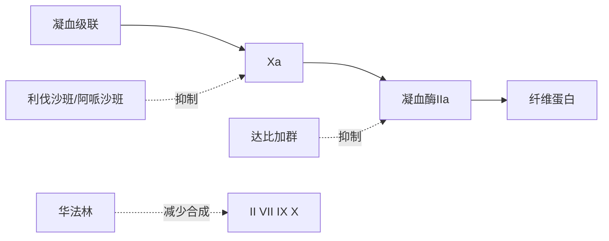
👆 靶点图仅重组课件明确关系。
### 7.3 监测—解救对比

| 药物 | 课件内监测 | 是否常规监测 | 课件内过量/出血处理 |
|---|---|---|---|
| 华法林 | PT/INR；推荐 INR 2.0–3.0 | 需要，按结果调剂量 | 维生素 K；紧急时 FFP 5–8 mL/kg |
| 达比加群 | dTT、ECT 较可靠；紧急时 aPTT 有帮助；INR 不适合 | 课件未写“常规”要求 | 轻度延迟/停药；利尿、透析、凝血酶原复合物；依达赛珠单抗 |
| 利伐沙班 | 抗 Xa 因子标准试剂盒可测水平 | 一般无需常规凝血监测 | 课件未给解救方案 |
| 阿哌沙班 | 课件未给 | 课件未给 | 课件未给 |
> [!WARNING] ⚠️ 常见疑问
> Q：INR 能否用来判断达比加群抗凝强度？
> A：不能。课件明确写出 INR 不适合；达比加群优先看校准稀释 TT（dTT）或 ECT，紧急情况下 aPTT 可辅助判断抗凝过度。
> [!TIP] 💡 记忆辅助
> “华法看 INR，达比看 dTT/ECT；利伐看抗 Xa，平时多不查。”
> 对应关系：华法林需常规监测并调剂量；达比加群不用 INR；利伐沙班可用抗 Xa 试剂测水平，但一般无需常规凝血监测。
> [!SUMMARY] 📝 核心要点
> - 华法林是维生素 K 通路、多因子、慢起效；NOAC 是单靶点直接抑制。
> - 达比加群打 IIa，利伐沙班/阿哌沙班打 Xa。
> - 解救只记课件明确给出的：华法林—维生素 K/紧急 FFP；达比加群—依达赛珠单抗等课件所列措施。

为什么华法林起效慢，而课件又说对已形成的凝血因子无抑制作用？
> [!QUESTION]- 参考思路
> 华法林阻止新生 II、VII、IX、X 的肝内羧化；已形成的活性因子仍存在，因此要等待其逐渐减少后抗凝效应才充分显现。

## 16. 抗血小板药：从通路到代表药 ⭐⭐⭐
📎 课件原文：16_血液药理_血栓止血与造血药物.pptx第 29-43 页
### 8.1 分类树
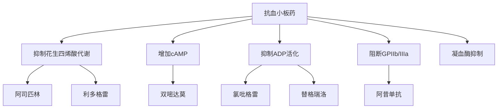
👆 低频药保留分类位置，不展开背诵负担。
### 8.2 高频代表药
**阿司匹林**
- 非选择性 COX 抑制剂；抑制血小板聚集，用于预防血栓栓塞性疾病。
- 不良反应：胃肠刺激/胃出血、凝血障碍、水杨酸反应、阿司匹林哮喘、Reye 综合征、肾脏影响。
**氯吡格雷与替格瑞洛**
- 氯吡格雷：P2Y12 受体阻断药，前体药，需 CYP2C19 代谢活化。
- 替格瑞洛：新型 P2Y12 阻断药，为活性药，起效快。
- 课件提到双联抗血小板治疗（DAPT），但未在本页给出具体组合、疗程或监测阈值，不扩写。
**GPIIb/IIIa 阻断药**
- GPIIb/IIIa 是 ADP、凝血酶、TXA2 等诱导血小板聚集的最终共同通路。
- 阿昔单抗等受体阻断药可妨碍血小板与纤维蛋白原、vWF 等配体结合。
### 8.3 低频压缩
- 利多格雷：强 TXA2 合酶抑制并中度阻断 TXA2 受体；课件列出降低再栓塞、反复心绞痛及缺血性卒中发生率。
- 双嘧达莫：抑制 PDE、增加 PGI2、抑制腺苷、轻度抑制 COX。

| 药物 | 靶点/机制关键词 | 前体/活性信息 | 课件内主要风险或特点 |
|---|---|---|---|
| 阿司匹林 | COX；抑制血小板聚集 | 课件未按前体分类 | 胃出血、凝血障碍、哮喘、Reye 等 |
| 氯吡格雷 | P2Y12 | 前体药，CYP2C19 活化 | 课件未列本页特异不良反应 |
| 替格瑞洛 | P2Y12 | 活性药，起效快 | 课件未列本页特异不良反应 |
| 阿昔单抗 | GPIIb/IIIa | 单克隆抗体 | 阻断聚集最终共同通路 |
### 8.4 监测与解救边界
- 本组课件未给出抗血小板药的实验室监测目标、停药阈值或特异解救方案；本讲义不补写。
> [!WARNING] ⚠️ 常见疑问
> Q：氯吡格雷与替格瑞洛最关键的课件内区别是什么？
> A：二者都阻断 P2Y12；氯吡格雷是前体药，需 CYP2C19 活化，替格瑞洛是活性药、起效快。
> [!SUMMARY] 📝 核心要点
> - 阿司匹林抓 COX；氯吡格雷/替格瑞洛抓 P2Y12；阿昔单抗抓 GPIIb/IIIa 最终共同通路。
> - 抗血小板更对应动脉白血栓；不要与静脉红血栓的抗凝主线混淆。

为什么阻断 GPIIb/IIIa 能影响多种诱导物引起的血小板聚集？
> [!QUESTION]- 参考思路
> 课件把 GPIIb/IIIa 定位为 ADP、凝血酶、TXA2 等诱导血小板聚集的最终共同通路；阻断后，血小板与纤维蛋白原、vWF 等配体结合受阻。

## 17. 促凝血与抗纤溶药：课件讲到哪就记到哪 ⭐⭐
📎 课件原文：16_血液药理_血栓止血与造血药物.pptx第 44-47 页；15_输血医学_血型系统与临床输血.pptx第 30、36、44 页
### 9.1 分类
- 维生素 K。
- 凝血因子制剂：凝血酶原复合物（PCC），含 II、VII、IX、X。
- 人工合成纤维蛋白溶解抑制药：赖氨酸类似物，代表氨甲环酸。
- DDAVP：输血课件称其可增强血小板和凝血因子功能，围术期使用可减少输血。
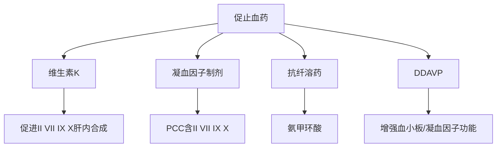
### 9.2 维生素 K
- K1、K2 脂溶性；K3、K4 水溶性。
- 机制：作为羧化酶辅酶，参与 II、VII、IX、X 的肝内合成。
- 应用：维生素 K 缺乏出血；对抗药物引起的出血；预防长期广谱抗菌药所致出血。
- 不良反应：K1 注射过快可潮红、呼吸困难、胸痛、虚脱；K3 可使新生儿、早产儿发生溶血和高铁血红蛋白症。
### 9.3 信息边界
- 课件只把氨甲环酸归为赖氨酸类似物/纤维蛋白溶解抑制药，未展开作用机制、具体适应证、剂量与不良反应；不得补写。
- PCC 在达比加群过量处理页也被列为措施之一，但课件未给剂量。
> [!SUMMARY] 📝 核心要点
> - 维生素 K 与华法林围绕同一组因子 II、VII、IX、X：一个参与合成，一个阻断活化。
> - PCC 是上述四因子的混合制剂；氨甲环酸在本课件只记“赖氨酸类似物、抗纤溶”。

维生素 K 为什么能对抗华法林相关出血？
> [!QUESTION]- 参考思路
> 课件显示华法林对抗维生素 K，阻碍 II、VII、IX、X 的羧化；维生素 K 作为羧化酶辅酶参与这些因子的肝内合成，作用方向相反。

## 18. 抗贫血药：铁、叶酸、B12、EPO ⭐⭐⭐
📎 课件原文：16_血液药理_血栓止血与造血药物.pptx第 48-59 页；15_输血医学_血型系统与临床输血.pptx第 43 页
### 10.1 病因—用药对位
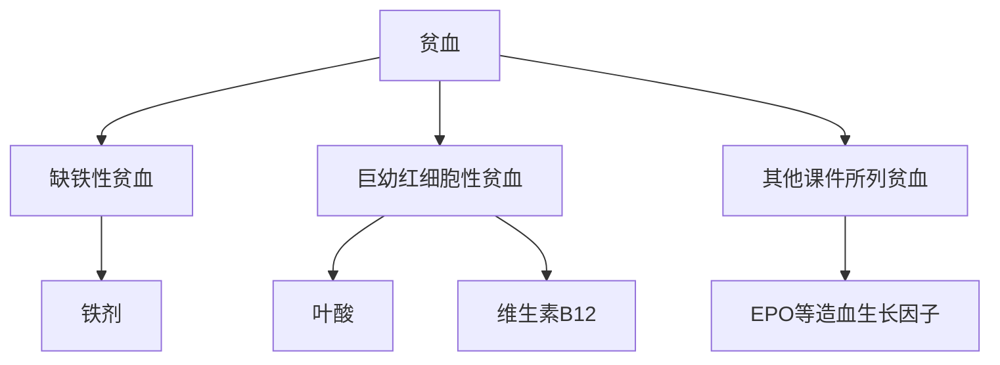
👆 课件另列再生障碍性贫血可用雄激素、免疫抑制剂、造血细胞因子、骨髓移植，但本模块按冲刺优先级不展开低频治疗。
### 10.2 铁剂
- 代表：硫酸亚铁、枸橼酸铁铵、右旋糖酐铁。
- 作用：构成血红蛋白、肌红蛋白及课件所述“某些重要成分”；成人约需 1 mg/d。
- 缺铁原因：吸收障碍、损失过量、需要增加。
- 吸收：二价铁在十二指肠、空肠上段吸收；胃酸、维生素 C、还原性物质促进；胃酸减少、高磷、高钙、鞣酸、四环素妨碍。
- 转运：转铁蛋白运至肝、脾、骨，供造血或储存。
- 应用：缺铁性贫血。
- 不良反应：胃肠刺激、便秘；急性中毒（课件写 1 g 以上）可致坏死性胃肠炎。处理为磷酸盐/碳酸盐溶液洗胃，去铁铵解毒（按课件原文保留该写法）。
### 10.3 叶酸
- 体内转为四氢叶酸类辅酶，传递一碳单位；参与嘌呤核苷酸合成、dUMP→dTMP、氨基酸互变。
- 缺乏可致巨幼红细胞性贫血；吸收在十二指肠和空肠上部。
- 应用：巨幼红细胞性贫血；叶酸对抗药（甲氨蝶呤、乙胺嘧啶）引起的贫血；可纠正恶性贫血血象。
### 10.4 维生素 B12
- 口服需与“内因子”结合后在回肠吸收；注射吸收迅速。
- 参与同型半胱氨酸甲基化并促进四氢叶酸循环利用；使甲基丙二酰 CoA 转为琥珀酰 CoA。
- 缺乏时甲基丙二酰 CoA 积聚，继而异常脂肪酸合成、神经髓鞘脂质合成异常。
- 应用：恶性贫血；注射给药辅助治疗其他类型贫血和某些神经系统疾病。
### 10.5 EPO
- EPO（erythropoietin，红细胞生成素）增加红细胞和血红蛋白；代表药重组人 EPO：epoetin-α。
- 15_输血医学_血型系统与临床输血.pptx补充：EPO 治疗贫血约使用半月后红细胞才会升高，提示其不是即刻提高携氧的措施。

| 药物 | 核心环节 | 课件内应用 | 最应记住的风险/特征 |
|---|---|---|---|
| 铁剂 | 造血原料、Hb 组成 | 缺铁性贫血 | 胃肠刺激、便秘；过量可坏死性胃肠炎 |
| 叶酸 | 一碳单位与核苷酸合成 | 巨幼红细胞性贫血等 | 可纠正恶性贫血血象；课件未说可纠正神经损害 |
| B12 | 叶酸循环及甲基丙二酰 CoA 代谢 | 恶性贫血等 | 缺乏与神经髓鞘脂质合成异常相关 |
| EPO | 促进红细胞生成 | 贫血治疗 | 约半月后红细胞才升高 |
> [!WARNING] ⚠️ 常见疑问
> Q：课件说叶酸可纠正恶性贫血血象，是否也说明能纠正 B12 缺乏相关神经异常？
> A：没有。课件只明确“纠正血象”；神经髓鞘异常被放在 B12 缺乏机制中，因此不能把“血象纠正”外推为“神经异常纠正”。
> [!TIP] 💡 记忆辅助
> “铁造血红蛋白，叶酸铺核苷酸，B12 兼顾髓鞘，EPO 催生但不快。”
> 对应关系：铁是血红蛋白原料；叶酸传递一碳单位参与核苷酸合成；B12 缺乏涉及髓鞘脂质异常；EPO 增加红细胞/Hb，但课件提示约半月起量。
> [!SUMMARY] 📝 核心要点
> - 缺铁用铁剂；巨幼细胞性贫血线索指向叶酸/B12；EPO 是造血生长因子。
> - 铁的吸收部位、促进/妨碍因素和胃肠不良反应是课件展开最多的部分。
> - 叶酸与 B12 都牵涉核酸/代谢，但课件把神经髓鞘异常明确连到 B12 缺乏。

为什么 EPO 不能替代急性缺氧时的红细胞输注作用？
> [!QUESTION]- 参考思路
> 红细胞输注直接增加携氧成分；EPO 通过促进红细胞生成起效，课件提示约半月后红细胞才会升高。

## 19. 考前 20 分钟收束：高频对照与折叠自检 ⭐⭐
📎 课件原文：15_输血医学_血型系统与临床输血.pptx第 20-21、50、69、71、72-77 页；16_血液药理_血栓止血与造血药物.pptx第 6、15-28、31、41、43-58 页
### 11.1 四组最后对照

| 题干抓手 | 第一联想 | 不要混淆 |
|---|---|---|
| 携氧不足/慢性贫血伴缺氧 | 红细胞 | FFP 不是补携氧 |
| PT/APTT 延长+弥漫渗血 | FFP | 红细胞不能补凝血因子 |
| 输血后腰背痛+血红蛋白尿 | 急性溶血 | 迟发溶血一般无血红蛋白尿 |
| 输血后肺水肿 | 分 TACO/TRALI | TACO 有容量负荷/心衰逻辑；TRALI 无心衰表现 |
| 需 INR 调剂量 | 华法林 | 达比加群不用 INR |
| dTT/ECT；依达赛珠单抗 | 达比加群 | 利伐沙班打 Xa |
| P2Y12 前体、CYP2C19 | 氯吡格雷 | 替格瑞洛是活性药、起效快 |
| 巨幼细胞性贫血+神经代谢链 | B12 | 叶酸只被课件明确写可纠正恶性贫血血象 |
### 11.2 折叠自检
1. 紧急输血时，为什么“同型优先、O 型后备”仍需强调风险？
> [!QUESTION]- 参考思路
> 因为课件明确 O 型洗涤红细胞仍可能存在同种抗体或其他血型不合；紧急选择只是风险较低，不等于无风险。

2. 发热寒战、血压基本不变与发热寒战、休克/皮肤充血分别指向什么？
> [!QUESTION]- 参考思路
> 前者更偏 FNHTR；后者更偏细菌性输血反应。两者均需结合严重程度和其他表现鉴别。

3. 普通肝素、华法林、达比加群、利伐沙班各抓哪个核心机制？
> [!QUESTION]- 参考思路
> 肝素借 ATIII 灭活多因子；华法林阻断维生素 K 相关 II、VII、IX、X 活化；达比加群直接抑制 IIa；利伐沙班直接抑制 Xa。

4. 哪些“监测—解救”配对是课件明确给出的？
> [!QUESTION]- 参考思路
> 华法林看 PT/INR、可用维生素 K，紧急时课件列 FFP；达比加群看 dTT/ECT，aPTT 紧急辅助，依达赛珠单抗等可解救；利伐沙班可测抗 Xa 水平但一般无需常规监测。

5. 阿司匹林、氯吡格雷、阿昔单抗各阻断哪条血小板通路？
> [!QUESTION]- 参考思路
> 阿司匹林抑制 COX；氯吡格雷阻断 P2Y12；阿昔单抗阻断 GPIIb/IIIa 最终共同通路。

6. 铁、叶酸、B12、EPO 如何按机制分工？
> [!QUESTION]- 参考思路
> 铁补造血原料；叶酸以四氢叶酸辅酶传递一碳单位；B12 参与叶酸循环和甲基丙二酰 CoA 代谢；EPO 促进红细胞生成。
> [!SUMMARY] 📝 Day 3B Take-Home
> - 输血先问“缺什么功能”，再选成分；任何新发严重反应先停血、保留静脉通道。
> - ABO/Rh 与交叉配血是安全底座；急诊例外不等于零风险。
> - 抗凝按靶点记：ATIII—肝素，维生素 K 通路—华法林，IIa—达比加群，Xa—利伐沙班/阿哌沙班。
> - 抗血小板按通路记：COX—阿司匹林，P2Y12—氯吡格雷/替格瑞洛，GPIIb/IIIa—阿昔单抗。
> - 促凝与抗贫血部分只记课件明确链条，不把课外剂量、禁忌、解救方案混入冲刺讲义。

## 压缩索引（低频/历史页）
📎 课件原文：15_输血医学_血型系统与临床输血.pptx第 15-16、52-54、78、83-88 页；16_血液药理_血栓止血与造血药物.pptx第 4、8、11-14、32、38-40、54、59-60 页
- 输血史：从古代输血、生理学输血、免疫学输血到成分输血、血液管理与无输血医学；仅作背景。
- 发生率统计、各血液成分反应率、肺微血管栓塞、含铁血黄素沉着、输血后紫癜、输血传播疾病：课件有列示，但不属于本讲义优先主线，保留页码供查阅。
- 药物发现史、LMWH 多个低频品种、利多格雷、双嘧达莫、G-CSF/GM-CSF、右旋糖酐：已在相关分类或此索引中保留，不展开背诵。
- 复习建议：药理部分优先横向默画“靶点—代表药—监测—解救”；输血部分反复演练“成分选择—反应识别—立即处置”三条路径。