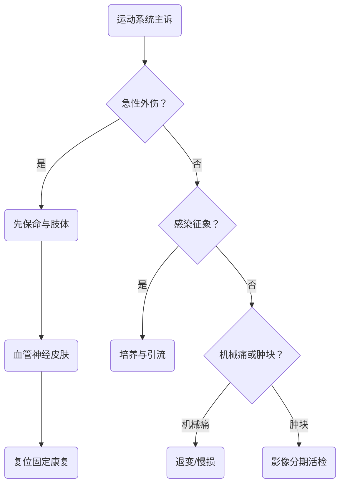

# 第九篇骨科疾病的临床决策地图
> [!NOTE] 来源与边界
> 主要来源为 IMA 个人知识库「Ring.H的知识库」中的 `22.《外科学（第十版）》.pdf`，已核验封面、目录及第59—73章起始页。原书为扫描版，以下内容是按教材目录和可视页复核后的复习性归纳，不是逐字 OCR；精确分型、手术指征和数值以教材原页与课堂要求为准。

# 解析摘要
- 经自动判定：基础分 0 vs 临床分 12，采用临床模式。
- 主导模板：完整疾病单元；创伤急症段落辅以急症处理流程。
- 覆盖范围：第九篇骨科疾病，第59—73章，印刷页599—769。
- 重点主线：骨折与脱位、脊柱脊髓和骨盆急救、退行性疾病、感染与肿瘤。
- 预计总阅读时间：约120—150分钟，建议分5次完成。
***
# 教材目录与笔记映射

| 教材章 | 主题 | 印刷页 | 对应笔记 |
|---|---|---:|---|
| 第59章 | 运动系统畸形 | 600 | [[01 运动系统畸形与骨折概述]] |
| 第60章 | 骨折概述 | 613 | [[01 运动系统畸形与骨折概述]] |
| 第61—63章 | 上肢、手及下肢损伤 | 629—675 | [[02 上肢手部与下肢损伤]] |
| 第64—66章 | 脊柱脊髓、骨盆髋臼与周围神经损伤 | 676—699 | [[03 脊柱脊髓骨盆与周围神经损伤]] |
| 第67—69章 | 慢性损伤、股骨头坏死、颈腰椎退变 | 700—729 | [[04 慢性损伤股骨头坏死与颈腰椎退变]] |
| 第70—73章 | 感染、结核、关节炎与骨肿瘤 | 730—769 | [[05 骨关节感染关节炎与骨肿瘤]] |
# 一张图抓住全篇

# 通用答题顺序
1. 创伤：生命优先→开放伤与出血→血管神经和皮肤→影像→稳定性→复位固定→功能锻炼。
2. 感染：全身与局部表现→炎症指标和培养→经验性抗菌后按药敏调整→脓肿/坏死组织处理→制动与康复。
3. 退变：疼痛性质→神经定位与红旗征→影像责任结构→规范保守→明确指征再手术。
4. 肿瘤：年龄→部位→影像生物学行为→分期→规划活检→多学科治疗。
> [!SUMMARY] 核心要点
> 骨科题先判断“会不会死人、会不会丢肢体、会不会留下不可逆神经功能障碍”，再讨论精细分型和术式。

为什么骨科创伤查体必须记录复位前后两次血管神经状态？
> [!QUESTION]- 参考思路
> 复位前记录用于确认原发损伤，复位后记录用于判断复位是否改善或新增血管神经问题，也是后续决策与交接的基线。