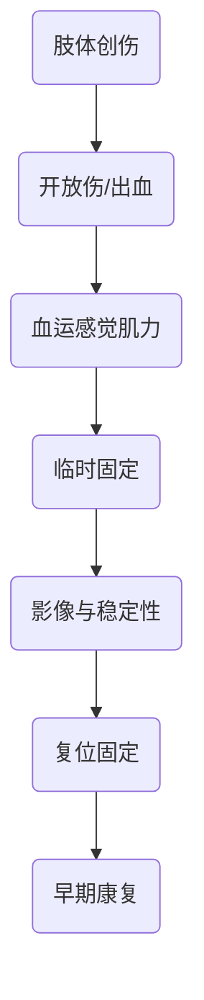

# 从受伤机制到神经血管并发症的定位法
> [!NOTE] 教材锚点
> 第61章629页、第62章643页、第63章650页。已核验章首页：锁骨骨折、手外伤、髋关节脱位的机制、表现与处理框架。

# 上肢常见损伤

| 损伤 | 典型线索 | 必查结构与处理重点 |
|---|---|---|
| 锁骨骨折 | 肩部着地，局部隆起、肩下垂 | 皮肤顶压、锁骨下血管神经；多数可保守，明显移位等评估手术 |
| 肩关节前脱位 | 外展外旋暴力，方肩、弹性固定 | 腋神经和血运；复位前后记录并影像确认 |
| 肱骨外科颈骨折 | 老年跌倒 | 腋神经、腋动脉；按移位与稳定性固定 |
| 肱骨干骨折 | 直接或间接暴力 | 桡神经：腕背伸和虎口背侧感觉 |
| 肱骨髁上骨折 | 儿童伸直型常见 | 肱动脉、正中神经、骨筋膜室综合征；警惕肘内翻 |
| 肘关节后脱位 | 跌倒手撑地 | 血管神经；早期复位、短期固定后活动 |
| 桡骨远端骨折 | 手掌或手背着地 | 移位方向、腕管症状、复位后再移位 |
> [!WARNING] 常见疑问
> Q：为什么复位前后都要查神经血管？
> A：只有两次记录才能区分原发损伤、复位改善和操作后新增损伤。

# 手外伤与断肢（指）再植
## 初诊评估
- 手的休息位和功能位本身就是诊断线索；小伤口也可能伴深部肌腱、神经或血管损伤。
- 按皮肤→骨关节→肌腱→血管→神经检查，记录污染、缺损、血运、感觉和主动屈伸。
## 处理主线
- 尽早清创，争取一期修复重要深部组织；稳定骨架、恢复肌腱滑动环境并保护血管神经。
- 肌腱修复后在保护下早期康复，平衡断裂与粘连；神经修复追求无张力、准确对合。
- 离断组织用清洁湿敷料包裹后密封，再置于冰水环境；不得直接接触冰块或浸泡液体。
# 下肢常见损伤

| 损伤 | 高频表现 | 易错点 |
|---|---|---|
| 髋关节后脱位 | 高能量屈髋屈膝轴向暴力，患肢屈曲内收内旋 | 坐骨神经；尽早复位，拖延增加股骨头坏死风险 |
| 股骨颈骨折 | 老年跌倒、髋痛、外旋短缩 | 缺血坏死和不愈合；嵌插骨折仍可能行走 |
| 转子间骨折 | 老年、肿胀瘀斑较明显 | 失血和卧床并发症突出，重视早期稳定与活动 |
| 股骨干骨折 | 高能量损伤 | 隐性失血与脂肪栓塞；先复苏和临时稳定 |
| 胫骨平台骨折 | 膝内外翻加轴向暴力 | 关节面、韧带/半月板、骨筋膜室综合征 |
| 胫腓骨干骨折 | 直接暴力常见 | 软组织覆盖差，开放伤、感染和不愈合风险高 |
| 踝关节骨折 | 旋转暴力 | 判断踝穴、下胫腓联合和内侧结构稳定性 |
| 跟骨骨折 | 高处坠落 | 同查腰椎和对侧跟骨，关注关节面与软组织 |
# 膝关节软组织损伤
- ACL：急停扭转、快速肿胀、前向不稳；Lachman试验常用于评估。
- PCL：屈膝位胫骨受后向暴力；后抽屉和胫骨后坠提示。
- 半月板：扭转后关节线痛、弹响、交锁或打软腿；MRI必须结合症状和查体。

> [!SUMMARY] 核心要点
> 每种骨折都用“机制—畸形—邻近神经血管—影像—稳定性—并发症”六格框架记忆。

髋关节后脱位为何既是关节急症也是神经急症？
> [!QUESTION]- 参考思路
> 脱位会损害股骨头血供并可牵拉坐骨神经；越晚复位，缺血坏死和持续神经功能障碍风险越高。