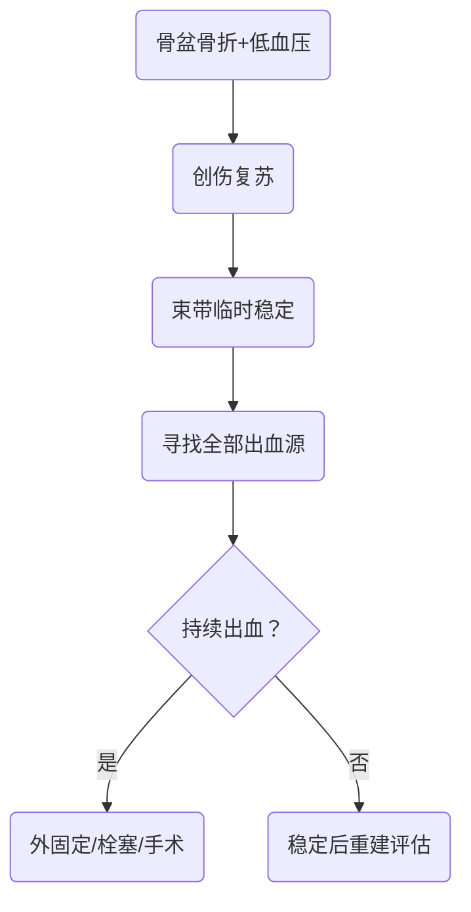

# 先保命再保神经的创伤决策链
> [!NOTE] 教材锚点
> 第64章676页、第65章685页、第66章691页。已核验章首页：脊柱骨折、骨盆骨折及Seddon周围神经损伤分类。

# 脊柱与脊髓损伤
- 高能量创伤先假定脊柱损伤，保持头颈躯干轴线；先处理气道、呼吸、循环，高位颈髓伤可直接威胁通气。
- 记录损伤平面、关键肌力、感觉、肛门感觉和括约肌功能，重复查体观察变化。
- CT显示骨折和椎管骨块；MRI评估脊髓、椎间盘、韧带和硬膜外血肿。
## 完全与不完全损伤
- 完全性损伤：骶段感觉和运动均无保留。
- 不完全性损伤：存在骶段保留；应根据运动、痛温觉和深感觉分布定位，不只背综合征名称。
## 两种休克

| 概念 | 本质 | 线索 |
|---|---|---|
| 脊髓休克 | 损伤平面以下反射暂时消失 | 弛缓、反射消失，随后逐渐恢复 |
| 神经源性休克 | 交感中断导致循环障碍 | 低血压伴相对心动过缓、皮肤温暖；仍先排除失血 |
## 治疗原则
- 维持氧合与灌注、避免继发损伤，预防压疮、肺部和尿路感染及血栓。
- 手术用于解除明确压迫、恢复或维持稳定、便于护理和康复；影像异常本身不自动等于手术。
# 骨盆与髋臼骨折
- 骨盆环破坏可造成大量隐性出血，并合并泌尿生殖道、直肠和神经损伤。
- 避免反复骨盆挤压；骨盆束带放在大转子水平，不放在髂嵴。

> [!WARNING] 常见疑问
> Q：尿道口滴血、会阴血肿时能否反复尝试导尿？
> A：不能盲目反复操作，应先按规范评估尿道完整性。

# 周围神经损伤

| Seddon分类 | 结构状态 | 恢复特点 |
|---|---|---|
| 神经失用 | 轴突连续，传导阻滞 | 多可较快恢复 |
| 轴突断裂 | 轴突断而部分支架保留 | 远端Waller变性，可沿通道再生 |
| 神经断裂 | 神经干连续性破坏 | 自发恢复差，常需修复 |
| 神经 | 运动障碍 | 代表性感觉区 |
|---|---|---|
| 桡神经 | 垂腕、伸指受限 | 虎口背侧 |
| 正中神经 | 拇对掌受限、严重时猿手 | 桡侧三指半掌侧 |
| 尺神经 | 骨间肌麻痹、夹纸无力、爪形手 | 尺侧一指半 |
| 腓总神经 | 足下垂、背伸和外翻受限 | 小腿外侧及足背 |
| 胫神经 | 跖屈、屈趾受限 | 足底 |
> [!SUMMARY] 核心要点
> 脊柱创伤先保通气与灌注，骨盆创伤先控出血，周围神经损伤先定位并判断连续性。

脊柱骨折患者低血压伴心动过缓时，为何仍不能直接诊断神经源性休克？
> [!QUESTION]- 参考思路
> 创伤患者首先必须排除失血；神经源性休克是结合损伤平面、循环特征并排除其他出血源后作出的判断。