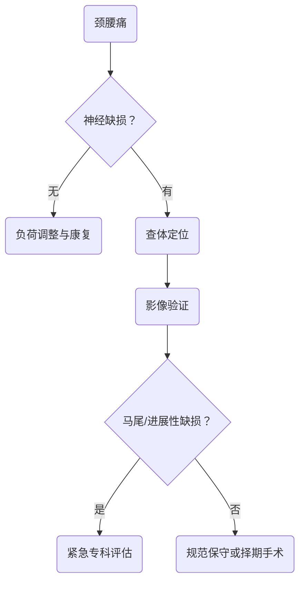

# 从机械性疼痛到神经受压的定位主线
> [!NOTE] 教材锚点
> 第67章700页、第68章715页、第69章718页。已核验章首页：慢性损伤定义与治疗原则、股骨头坏死机制、颈椎病分型与神经根定位。

# 运动系统慢性损伤
- 反复机械负荷超过组织修复能力，造成肌腱、腱鞘、滑囊、筋膜、骨、软骨或周围神经慢性损害。
- 特征是局部慢性痛、固定压痛点或肿块、特定动作诱发，通常无明显急性炎症表现。
- 治疗以预防为主：限制致伤动作、纠正姿势和应力分布、康复训练，必要时短期镇痛或局部治疗；反复激素注射可能加重组织退变。

| 疾病 | 线索 | 处理重点 |
|---|---|---|
| 肩袖损伤/撞击 | 外展痛弧、夜间痛、力量下降 | 调整负荷、肩胛与肩袖训练，结合功能评估修复 |
| 肱骨外上髁炎 | 抗阻伸腕痛、外上髁压痛 | 减少重复伸腕、康复和支具 |
| 桡骨茎突狭窄性腱鞘炎 | 拇指活动相关桡侧腕痛 | 活动调整、支具和局部治疗 |
| 疲劳骨折 | 重复负荷后渐进疼痛，早期X线可阴性 | 停止负荷，必要时MRI |
# 股骨头坏死
- 核心是股骨头血供中断或受损，导致骨细胞和骨髓坏死，继而结构改变、塌陷和髋功能障碍。
- 相关因素包括股骨颈骨折、髋脱位、糖皮质激素和长期大量饮酒等；早期可仅腹股沟或髋痛并向膝部放射。
- X线早期可正常，MRI更敏感；分期关注坏死范围、软骨下骨折、塌陷和继发骨关节炎。
- 未塌陷以保存股骨头为目标；明显塌陷、关节面破坏且症状影响生活时评估关节置换。
> [!WARNING] 常见疑问
> Q：MRI发现坏死是否立即置换？
> A：不是。是否塌陷、坏死范围、症状、年龄和功能需求共同决定方案。

# 颈椎退行性疾病

| 类型 | 主要表现 | 关键点 |
|---|---|---|
| 神经根型 | 颈肩痛向上肢放射，皮节感觉和肌力改变 | 症状、体征与责任节段一致 |
| 脊髓型 | 手笨、步态不稳、上运动神经元体征 | 进行性脊髓功能损害是重要手术信号 |
| 其他表现 | 眩晕等非特异症状 | 先排除心脑血管和耳源性病因 |
- 无进行性脊髓损害或严重无力者多先规范保守；明确压迫伴进展功能障碍或顽固根性症状再评估减压与稳定。
# 腰椎间盘突出症
- 腰痛伴坐骨神经放射痛，咳嗽、喷嚏或增加腹压时可加重；查感觉、肌力、腱反射和直腿抬高试验定位。

| 神经根 | 常见感觉区 | 代表肌力/反射 |
|---|---|---|
| L4 | 小腿内侧 | 伸膝、膝反射 |
| L5 | 小腿外侧、足背及拇趾 | 拇背伸 |
| S1 | 足外侧 | 跖屈、跟腱反射 |
- MRI异常必须与症状、查体和责任节段一致；多数先短期镇痛、逐步恢复活动和核心训练。
- 马尾综合征、进行性肌力下降，或规范保守后仍严重根性痛和功能障碍，是重要手术评估信号。

> [!SUMMARY] 核心要点
> 慢性损伤先纠正负荷，股骨头坏死先看塌陷，颈腰椎退变先做神经定位并检查红旗征。

为什么腰椎MRI显示突出不能单独决定手术？
> [!QUESTION]- 参考思路
> 影像退变在人群中常见，必须与症状、神经查体和责任节段一致；手术针对的是明确的结构—功能问题，而不是影像名词。