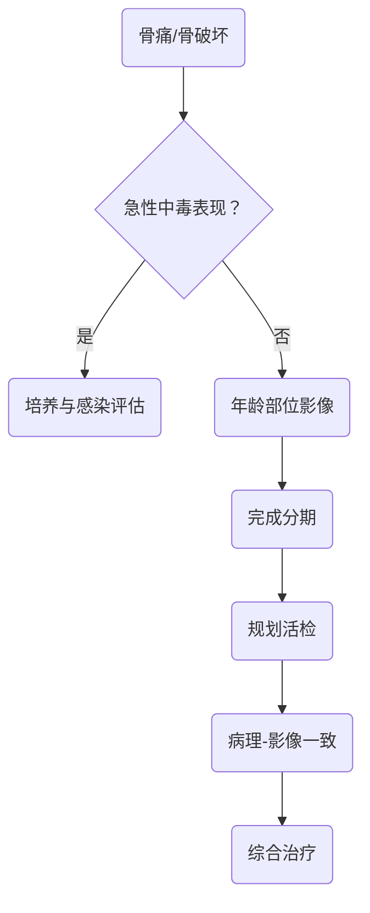

# 用起病速度和影像行为区分感染炎症与肿瘤
> [!NOTE] 教材锚点
> 第70章730页、第71章739页、第72章750页、第73章758页。已核验章首页：化脓性骨髓炎、骨关节结核、骨关节炎和骨肿瘤的定义、病理及诊断框架。

# 化脓性骨髓炎与关节炎
## 急性血源性骨髓炎
- 儿童青少年常见，长骨干骺端多发；可有高热、寒战、局部剧痛和拒动。
- 血培养和病灶培养应尽早获取；重症不能因等待培养延误抗菌治疗。早期X线可无明显改变，MRI更敏感。
- 早期足量抗菌药并按培养调整；形成脓肿、坏死骨或药物治疗无效时引流清创。
## 慢性骨髓炎
- 死骨、包壳、窦道和反复流脓构成慢性过程；窦道闭合不等于治愈。
- 根治主线：清除死骨与感染组织→处理死腔→稳定骨结构→可靠软组织覆盖→针对性抗菌药。
## 化脓性关节炎
- 单关节急性红肿热痛和活动严重受限；关节穿刺液细胞学、涂片和培养是关键。
- 早期抗菌药与充分引流并重；感染控制后逐步活动，防止关节僵硬。
> [!WARNING] 常见疑问
> Q：尿酸升高能否排除感染性关节炎？
> A：不能。感染会快速破坏软骨，疑似病例仍需完成关节液和培养评估。

# 骨与关节结核
- 多继发于原发结核灶，经血行传播；起病缓慢，可有低热、盗汗、消瘦，也可仅慢性疼痛和功能障碍。
- 冷脓肿缺乏典型红热；晚期可形成窦道、病理骨折和畸形。
- 规范联合抗结核治疗是基础；明显脓肿、死骨、进行性神经损害、严重不稳或畸形时评估手术。
# 非化脓性关节炎

| 疾病 | 临床主线 | 治疗主线 |
|---|---|---|
| 骨关节炎 | 软骨退变与继发骨质增生，机械性痛，负重关节多见 | 教育、减重、肌力训练、镇痛；终末期可置换 |
| 类风湿关节炎 | 对称性小关节炎、晨僵、系统性自身免疫表现 | 早期改善病情治疗；外科用于疼痛、畸形和功能重建 |
| 强直性脊柱炎 | 青年、炎性腰背痛、骶髂关节受累 | 运动康复与规范抗炎/免疫治疗 |
- 机械性痛常活动加重、休息缓解；炎性痛常静息和夜间明显、活动后改善且晨僵突出。
# 骨肿瘤
## 诊断四步
1. 年龄：不同肿瘤有明显年龄偏好。
2. 部位：哪块骨、骨的哪一段、髓腔还是骨表面。
3. 影像行为：边界、过渡带、骨质破坏、骨膜反应、基质和软组织肿块。
4. 分期与病理：完成局部及远处评估后规划活检。
## 良恶性影像倾向

| 特征 | 偏良性 | 偏恶性 |
|---|---|---|
| 边界/过渡带 | 清楚、窄 | 模糊、宽 |
| 骨皮质 | 膨胀变薄但较完整 | 穿破、侵袭 |
| 骨膜反应 | 实性、连续 | 分层、针状、Codman三角等 |
| 软组织肿块 | 少见 | 较常见 |
## 高频代表
- 骨软骨瘤：皮质和髓腔与母骨连续；疼痛、快速增大或软骨帽异常需警惕恶变。
- 骨巨细胞瘤：骨骺闭合后长骨端多见，偏心、膨胀性溶骨，局部侵袭性强。
- 骨肉瘤：青少年长骨干骺端多见，成骨性基质和侵袭性骨膜反应；多采用化疗联合广泛切除。
- 软骨肉瘤：成人多见，足够边界的切除是治疗核心。
- 尤文肉瘤：儿童青少年，可发热、炎症指标升高而类似感染；需系统治疗结合局部控制。
- 骨转移瘤：成人恶性骨病变首先考虑转移可能，目标包括止痛、预防病理骨折和维持功能。
## 活检铁律
- 活检通道必须纳入最终整块切除范围，避免污染重要血管神经间隙和多个肌室。
- 最好由负责最终肿瘤手术的团队规划，病理与临床、影像互相验证。

> [!SUMMARY] 核心要点
> 感染取材要早但不能延误重症治疗；肿瘤活检必须晚于必要影像分期且服从最终切除计划。

为什么疑似骨肿瘤不能先随意切开取一块组织再说？
> [!QUESTION]- 参考思路
> 未规划活检可能污染多个间隙和重要结构，改变切除边界，甚至使保肢方案失效；应先分期，再由最终治疗团队规划通道。