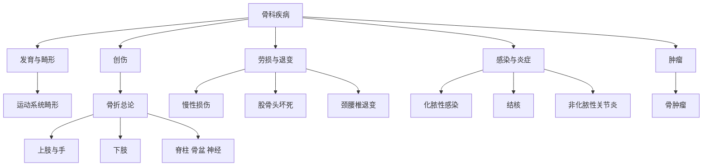
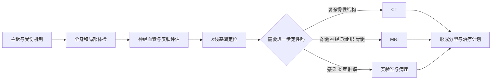

# 骨科疾病复习导航
> **一句话总览：**先用骨折总论建立“诊断—急救—复位—固定—康复”的主干，再按创伤、退变、感染、炎症和肿瘤五条病因链学习具体疾病。

**主要来源：**IMA“Ring.H的知识库”中的《22.〈外科学（第十版）〉.pdf》，第九篇“骨科疾病”（教材第599～770页）；2026-07-15 检索并核对目录、正文文本层与扫描页。
**使用方法：**第一次按编号顺读；第二次从[[02-骨折总论]]向各部位损伤扩展；考前按下方“症状入口”反向定位。
***
# 知识地图

***
# 顺序导航与教材锚点

|顺序|笔记|教材章节与页码|核心任务|
|---|---|---|---|
|01|[[01-运动系统畸形]]|第59章，600～612页|先天与姿势性畸形的识别和处理原则|
|02|[[02-骨折总论]]|第60章，613～628页|分类、并发症、愈合、急救和治疗三原则|
|03|[[03-上肢骨关节损伤]]|第61章，629～642页|肩、肘、前臂及桡骨远端常见损伤|
|04|[[04-手外伤与断肢再植]]|第62章，643～649页|手外伤急救、修复顺序与再植原则|
|05|[[05-下肢骨关节损伤]]|第63章，650～675页|髋、股骨、膝、小腿、踝足损伤|
|06|[[06-脊柱脊髓损伤]]|第64章，676～684页|稳定性、神经损伤和急救固定|
|07|[[07-骨盆与髋臼骨折]]|第65章，685～690页|大出血、合并伤与力学稳定|
|08|[[08-周围神经损伤]]|第66章，691～699页|分级、定位、修复与功能评价|
|09|[[09-运动系统慢性损伤]]|第67章，700～714页|劳损机制、局部压痛点和分层治疗|
|10|[[10-股骨头坏死]]|第68章，715～717页|危险因素、分期和保髋决策|
|11|[[11-颈腰椎退行性疾病]]|第69章，718～729页|颈椎病分型与腰椎退变鉴别|
|12|[[12-骨与关节化脓性感染]]|第70章，730～738页|早诊断、足量抗菌、引流与稳定|
|13|[[13-骨与关节结核]]|第71章，739～749页|全身与局部治疗、脓肿和畸形|
|14|[[14-非化脓性关节炎]]|第72章，750～757页|骨关节炎、强直性脊柱炎、类风湿关节炎|
|15|[[15-骨肿瘤]]|第73章，758～770页|年龄—部位—影像—病理四轴诊断|

***
# 症状入口

|临床入口|优先复习|必须排除的危险情况|
|---|---|---|
|创伤后畸形、异常活动|[[02-骨折总论]]及相应部位损伤|开放伤、休克、神经血管损伤、骨筋膜室综合征|
|颈痛伴上肢放射痛或踩棉感|[[11-颈腰椎退行性疾病]]|脊髓型颈椎病、肿瘤、感染|
|腰腿痛、间歇性跛行|[[11-颈腰椎退行性疾病]]|马尾综合征、转移瘤、脊柱结核|
|急性高热和骨关节剧痛|[[12-骨与关节化脓性感染]]|脓毒症、急性血源性骨髓炎、化脓性关节炎|
|低热、盗汗、冷脓肿|[[13-骨与关节结核]]|脊髓受压、窦道混合感染|
|持续骨痛、肿块、病理性骨折|[[15-骨肿瘤]]|恶性原发骨肿瘤和骨转移瘤|

***
# 总体诊断框架
> [!example] 把骨科诊断想成四个坐标轴
> **时间轴**看急性还是慢性，**年龄轴**缩小疾病谱，**解剖轴**定位骨、关节、软组织或神经，**机制轴**判断创伤、退变、感染、炎症或肿瘤。四轴交叉后再选择影像和实验室检查。

> [!warning] 贯穿全篇的失分点
> 影像学诊断不能替代皮肤、神经和血管检查；骨肿瘤不能在缺少完整影像分期和活检通道设计时贸然切开；脊柱与骨盆创伤首先处理生命威胁，而不是先追求局部复位。
> [!question]- 为什么骨科急诊总强调“先全身、后局部”？
> 因为骨盆、股骨和多发骨折可造成隐匿性大出血，脊柱损伤可合并呼吸循环问题；若只盯着局部畸形，可能错过先决定生死的休克、胸腹伤和神经损伤。

***
# 相关
- [[02-骨折总论]]——创伤类笔记的共同处理框架。
- [[12-骨与关节化脓性感染]]——与结核及非化脓性炎症进行病因鉴别。
- [[15-骨肿瘤]]——病理性骨折和持续骨痛的关键鉴别入口。
*最后更新：2026-07-15*
