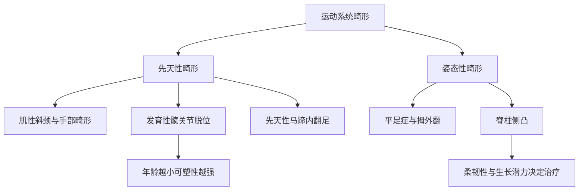
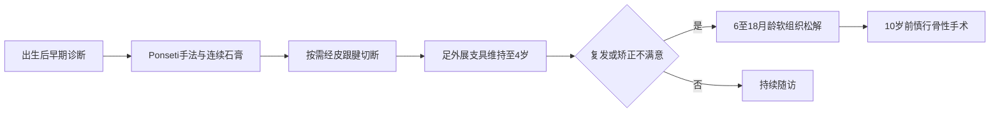

# 从生长偏差到功能重建
> **一句话总览：**运动系统畸形的复习主线是“尽早识别可塑期—区分柔软与僵硬、结构性与非结构性—在生长结束前用最小代价重建稳定和功能”。

**前置：**[[02-骨折总论]]——理解复位、固定、功能锻炼的共同原则。
**后续：**[[05-下肢骨关节损伤]]——髋、足和脊柱创伤的对照。
**教材锚点：**第59章，教材第600～612页（OCR文件 page-639～651）。

图中要抓住两条轴：**是否存在固定结构改变**，以及**是否仍处生长可塑期**。
***
# 先天性肌性斜颈
没有早期治疗时，单侧胸锁乳突肌纤维性挛缩不仅让头颈倾斜，还会逐步造成面部不对称和颈椎侧凸；所以治疗目标不是“把头摆正一次”，而是解除持续牵拉源。【教材第600～601页】
> [!example] 像一侧缩短的帐篷拉绳
> 胸锁乳突肌相当于帐篷两侧拉绳之一；患侧拉绳缩短，头向患侧倾、下颌转向健侧。只调整头位而不松解拉绳，畸形仍会回弹。

## 临床逻辑
- 出生后患侧胸锁乳突肌可见质硬、无痛、不活动的椭圆形或圆形肿块；约半年后肿块可缩小，但遗留条索样挛缩。
- 典型姿势：**头偏患侧，下颌转向健侧**；下颌向患侧旋转或头向健侧倾斜受限。
- 鉴别：骨性斜颈有颈椎发育异常、X线可确诊；感染性斜颈和视力性斜颈均无胸锁乳突肌挛缩。
## 治疗窗口

|人群|首选|关键点|
|---|---|---|
|1岁以内|热敷、按摩、手法矫正、矫形帽或睡姿固定|每日数次轻柔牵拉，防止继发畸形|
|1岁以上|手术松解|最佳手术年龄约1～4岁|
|4岁以上且严重|胸锁乳突肌上下端松解|术后头颈胸支具固定约4～6周并维持过矫正|
|年龄超过12岁|仍可改善颈部倾斜|面部和颈椎继发畸形往往难完全纠正|

> [!warning] 易错点
> “头偏患侧”与“下颌转健侧”必须成对记；晚期手术可改善姿势，但不能保证逆转已形成的面颈畸形。

***
# 先天性手部畸形
## 并指与多指

|项目|先天性并指|多指|
|---|---|---|
|本质|两个或以上手指及相关组织先天相连|额外手指，可仅为软组织，也可具有完整骨关节|
|常见部位|中、环指，拇指少见|拇指或小指侧|
|治疗目标|先功能、后外观|辨明正指与副指，保留功能更好的手指|
|手术时机|分指应在学龄前完成|一般1岁以后较合适|
|手术警戒|可能存在骨和关节相连|彻底切除副指但避免损伤骺，防止发育障碍|

【教材第601页】
***
# 发育性髋关节脱位
发育性髋关节脱位（DDH）不是单纯“股骨头掉出来”，而是髋臼、股骨近端和关节囊共同发育异常造成不稳定，继而从半脱位发展为脱位。【教材第601～604页】
> [!example] 像浅碗托球
> 髋臼是碗、股骨头是球。碗越浅、囊越松，球越容易滑出；球长期不在真臼内，碗缘更难受到正常刺激而加深，形成“越脱位、越发育差”的循环。

## 危险线索与体征
- 女性明显多于男性，左侧多于右侧；家族史、臀位产和强制伸直捆绑下肢与发病相关。
- 站立前期：大腿内侧皮纹不对称、会阴增宽、患髋活动少且外展受限、患肢短缩。
- 屈髋屈膝90°时患侧膝面低于健侧为Allis征阳性。
- Ortolani试验是将脱位股骨头“弹入”髋臼；Barlow试验是把不稳定股骨头“弹出”髋臼。
- 行走期：单侧跛行；双侧可见骨盆前倾、腰椎前凸和鸭步。Trendelenburg征阳性表示站立侧臀中、小肌不能维持对侧骨盆。
## 影像定位

|检查/测量|核心用途|
|---|---|
|超声|新生儿早期筛查与动态评价|
|骨盆正位X线|出生3个月以上评价髋臼发育、半脱位或脱位|
|髋臼指数|新生儿约30°～40°；随年龄下降，偏大提示发育不全|
|Perkin象限|正常股骨头骨化核在内下象限；外下为半脱位，外上为全脱位|
|Shenton线|正常为平滑弧线；脱位时中断|
|CT/MRI|CT看骨性方向和前倾角；MRI看头臼间软组织关系|

## 治疗随年龄升级

|年龄|主要策略|关键风险/目的|
|---|---|---|
|新生儿期至6个月|首选Pavlik吊带，使髋屈曲约100°～110°、外展30°～50°|稳定髋关节，避免过度外展造成缺血坏死|
|6个月～1.5岁|麻醉下闭合复位，石膏或支具固定于“人类位”|屈髋约95°、外展40°～45°；必要时松解长收肌/髂腰肌减压|
|1.5～3岁|多倾向切开复位，并按需行骨盆或股骨截骨|重建真臼内头臼关系|
|3岁以上|切开复位联合骨盆、股骨近端截骨等|纠正前倾角、颈干角并增加髋臼包容|
|大龄儿童/青少年|个体化姑息或补救手术|年龄越大，解剖恢复和功能预后越差|

> [!warning] 易错点
> DDH治疗的核心不是“外展越大越好”。稳定位置同时要降低股骨头缺血坏死风险；强行外展和高压复位都可能伤害股骨头血供。

***
# 先天性马蹄内翻足
核心四联畸形：**前足内收、踝跖屈、跟骨内翻、继发胫骨远端内旋**。【教材第604～606页】
## 柔软与僵硬

|表现|松软型|僵硬型|
|---|---|---|
|畸形|较轻|严重马蹄、内翻、内收|
|软组织|皮肤和肌腱不紧|跖面深横纹、跟腱细紧|
|手法矫正|较容易|困难|
|后果|早治多可恢复|行走后常以足外缘着地，继发胼胝、滑囊和小腿萎缩|

## 治疗路径

- Ponseti法一般出生后5～7天开始，9月龄以前启动效果最好。
- 1岁以内也可由医生指导家长轻柔扳正，使足外翻、外展及背伸；不可粗暴矫正。
- 非手术失败或复发可在6～18月龄行软组织松解；10岁前通常避免骨性手术，以免损伤骨骺。【教材第605～606页】
***
# 平足症与拇外翻
## 平足症
平足症是足弓低平或消失并伴足外翻，在负重时出现疲乏或疼痛；**足印平不等于一定需要治疗**。【教材第606～607页】
> [!example] 足弓像桥拱
> 骨构成桥面，韧带和跖腱膜是静态拉索，胫后肌等是动态拉索。柔韧性平足是“负重时桥拱下沉、卸载后回弹”；僵硬性平足则是桥体结构已经固定变形。

|项目|柔韧性平足|僵硬性平足|
|---|---|---|
|非负重足弓|可恢复|仍低平或消失|
|手法矫正|可以|困难|
|治疗|有症状时鞋垫、足弓垫、肌力训练|保守失败且疼痛/功能受限时考虑截骨、融合等|
|原则|预防和症状控制|纠正固定畸形并恢复负重关系|

## 拇外翻
- 定义：拇趾向外侧偏斜并伴第1跖骨内收；常与遗传、尖头鞋或高跟鞋相关，中老年女性常见。
- 负重X线：拇外翻角>15°异常；第1、2跖骨间角>10°异常。
- 轻症：宽鞋、分趾垫或矫形器，减轻挤压摩擦；严重疼痛、畸形且保守无效才考虑手术。
> [!warning] 易错点
> 拇外翻手术指征以疼痛和功能影响为主，不能仅凭外观或角度机械决定。

***
# 脊柱侧凸
脊柱侧凸以站立位脊柱全长正位X线Cobb角**大于10°**定义；结构性侧凸伴椎体旋转且不能自行矫正，非结构性侧凸在去除病因或侧弯位可矫正。【教材第609～612页】
## 分类与评价

|维度|非结构性侧凸|结构性侧凸|
|---|---|---|
|椎体旋转|无固定旋转|有旋转和固定结构改变|
|柔韧性|侧方弯曲或牵引可矫正|不能完全矫正或不能维持|
|常见原因|姿势、双下肢不等长、肌痉挛等|特发性、先天性、神经肌肉性等|
|处理|纠正病因|按角度、进展和生长潜力分层|

- 前屈试验出现单侧肋隆起提示椎体和肋骨旋转；严重时形成“剃刀背”。
- 必须摄**站立位**脊柱全长正、侧位片；卧位会因肌肉放松而低估真实角度。
- Cobb法用于测角；弯曲位、牵引位评价柔韧性；Nash-Moe法评价椎体旋转。
- Risser征用于估计骨成熟度：0～V级，级别越高，剩余生长潜力越小。
## 青少年特发性侧凸治疗

|情况|策略|
|---|---|
|Cobb角<20°|观察，每4～6个月复诊并摄站立位全长片|
|生长期、柔韧性侧凸20°～40°|支具，每日约16～23小时，持续至骨成熟|
|支具无效、持续进展、失平衡或外观畸形明显|手术矫形并融合稳定|

> [!warning] 易错点
> 支具的目标主要是**控制进展**，不是保证把结构性侧凸永久“掰直”；是否进展必须结合Cobb角变化与剩余生长潜力判断。

***
# 高频比较与易错点

|易混概念|正确辨析|
|---|---|
|Ortolani vs Barlow|前者“弹入”复位，后者“弹出”证实不稳定|
|先天性髋脱位 vs DDH|现强调发育异常谱系，不只是出生时是否脱位|
|松软型马蹄足 vs 僵硬型|看手法可矫正性和软组织紧张程度|
|柔韧性平足 vs 僵硬性平足|看非负重时足弓能否恢复|
|非结构性 vs 结构性侧凸|关键是固定旋转和可矫正性，不只看外观弯曲|
|Cobb角测量体位|必须站立位全长片，卧位可低估|

***
# 折叠自测
> [!question]- 婴儿头偏右、下颌转左，右胸锁乳突肌条索样挛缩，诊断和首选治疗是什么？
> 诊断右侧先天性肌性斜颈。1岁以内首选热敷、按摩与轻柔手法牵伸，并用睡姿或矫形装置维持矫正位；关键是早治，防止面部和颈椎继发畸形。
> [!question]- Ortolani与Barlow试验分别回答什么问题？
> Ortolani判断脱位股骨头能否被弹入髋臼；Barlow判断看似在位的股骨头能否被推出髋臼，即关节是否不稳定。
> [!question]- 为什么Ponseti矫正后仍需长期足外展支具？
> 连续手法和石膏只是把畸形矫正到位，婴幼儿软组织仍有回缩倾向；支具维持到约4岁用于预防复发。
> [!question]- 站立位Cobb角25°、仍在生长期且侧凸柔软，通常选什么方案？
> 属20°～40°生长期柔韧性侧凸，通常采用量身支具控制进展，并定期站立位全长X线随访。

***
# 相关笔记
- [[02-骨折总论]]——理解复位、固定与康复的通用框架。
- [[03-上肢骨关节损伤]]——对照先天性手畸形与创伤性上肢功能障碍。
- [[05-下肢骨关节损伤]]——对照髋、膝、踝足创伤后畸形及负重重建。
