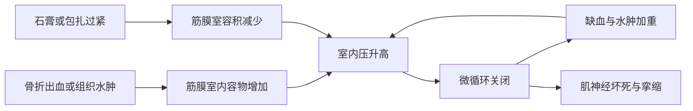

# 把骨折当成“骨与软组织共同损伤”
> **一句话总览：**骨折处理不是只对齐断骨，而是依次完成生命威胁排查、神经血管与软组织保护、复位固定、促进愈合和分期康复。

**前置：**[[01-运动系统畸形]]——对照先天畸形与创伤后畸形。
**后续：**[[03-上肢骨关节损伤]]、[[05-下肢骨关节损伤]]——将总论用于具体部位。
**教材锚点：**第60章，教材第613～628页（OCR文件 page-652～667）。

***
# 定义、成因与分类
骨折是**骨的完整性和连续性中断**。创伤性骨折最常见；骨髓炎、骨肿瘤等破坏骨质后，轻微外力即可导致病理性骨折。【教材第613页】
> [!example] 骨像承重梁，软组织像梁周围的管线
> 梁断裂只是显眼部分；旁边的血管、神经、肌肉和皮肤可能同时被拉断、压迫或污染。真正决定急症严重度的，常是“管线”是否受损。

## 成因

|成因|机制|典型例子|
|---|---|---|
|直接暴力|力直接作用于骨折处，软组织损伤常较重|重物打击致胫腓骨骨折|
|间接暴力|传导、杠杆、旋转或肌强烈收缩|手掌撑地致桡骨远端骨折；股四头肌猛烈收缩致髌骨骨折|
|疲劳/应力性骨折|长期反复轻微损伤累积|远距离行军后第2、3跖骨骨折|
|病理性骨折|骨质先被疾病削弱|骨肿瘤部位轻微外力后骨折|

## 核心分类

|维度|分类|临床意义|
|---|---|---|
|是否与外界相通|闭合性、开放性|开放性骨折感染风险高；骨折端经膀胱、尿道或直肠与外界相通也属开放性|
|形态|横形、斜形、螺旋形、粉碎性、青枝、嵌插、压缩、骺损伤等|提示受力方式、稳定性和复位固定难度|
|稳定性|稳定性、不稳定性|斜形、螺旋形、粉碎性骨折较易再移位|

## 五种移位
以近折端为参照描述远折端：**成角、侧方、短缩、分离、旋转**。旋转和分离移位必须完全纠正；搬运不当本身也可加重移位。【教材第615页】
***
# 临床表现与影像
## 先看全身，再看局部
- 全身：骨盆、股骨和多发骨折可大量失血并休克；血肿吸收可有低热，一般不超过38℃，开放性骨折高热应警惕感染。
- 一般局部表现：疼痛、肿胀、功能障碍。
- 特有体征：畸形、异常活动、骨擦音或骨擦感，出现其一即可临床诊断骨折。
> [!warning] 检查禁忌
> 不应为了“凑齐”特有体征反复活动患肢或刻意诱发骨擦感，这会增加软组织、神经血管损伤。

## 影像选择

|检查|用途与要点|
|---|---|
|X线|至少包括邻近一个关节的正、侧位片；特殊部位需特殊体位|
|伤后复查X线|初片阴性但高度怀疑裂缝骨折者，约2周后复查，断端吸收可使骨折线显现|
|CT|骨盆、髋、骶髂关节、脊柱等复杂骨性结构及关节内骨折|
|MRI|韧带、脊髓和软组织损伤；隐匿性骨折及骨挫伤|

【教材第616～617页】
***
# 并发症：按时间与机制记忆
## 早期并发症

|并发症|高危情景|识别要点|
|---|---|---|
|休克|骨盆、股骨或多发骨折，大出血或内脏伤|低血压、心动过速、灌注不足|
|脂肪栓塞综合征|青壮年股骨干等长骨骨折|低氧血症、神经系统异常、点状皮疹|
|内脏损伤|肋骨、骨盆、骶尾骨骨折|血气胸；肝脾破裂；膀胱尿道或直肠损伤|
|血管损伤|骨折端邻近大血管|远端脉搏、颜色、温度、毛细血管回流异常|
|周围神经损伤|肱骨中下1/3等神经贴骨处|相应感觉、运动缺失|
|脊髓损伤|颈椎、胸腰段骨折脱位|损伤平面以下神经功能障碍|
|骨筋膜室综合征|前臂掌侧、小腿；骨折出血水肿或包扎过紧|进行性疼痛、被动牵拉痛、感觉异常和筋膜室紧张|

## 骨筋膜室综合征
筋膜室压力升高使小动脉关闭，形成“缺血→水肿→更缺血”的恶性循环，可依次发展为濒临缺血性肌挛缩、Volkmann缺血性肌挛缩和坏疽。【教材第618页】

- 早期四征：感觉异常；被动牵拉受累肌肉痛；主动屈曲痛；肌腹/筋膜室压痛。
- 筋膜室压力>30mmHg，或梯度压（舒张压－筋膜室压力）<30mmHg，应及时切开减压。
- 同时警惕肌红蛋白尿和高钾血症，并给予足量补液促进排尿。
> [!danger] 5P不是早期筛查目标
> 无痛、无脉、苍白、感觉异常、肌麻痹提示缺血已很晚；不能等脉搏消失才减压。

## 晚期并发症
- 长期卧床：坠积性肺炎、压疮、下肢深静脉血栓。
- 局部：感染、创伤性骨化性肌炎、创伤性关节炎、关节僵硬。
- 血供/神经营养：复杂区域疼痛综合征样急性骨萎缩、缺血性骨坏死、缺血性肌挛缩。
- 预防逻辑：可靠固定的同时尽早活动未固定关节、进行肌肉等长收缩并减少卧床时间。【教材第618～619页】
***
# 骨折愈合
> [!example] 像修桥的三个班组
> 第一组先清场并搭临时纤维桥；第二组用骨痂把两端牢固接通；第三组按负重方向拆除多余材料、加固主梁。三个阶段相互交织，并非严格交班。

## 三阶段

|阶段|主要事件|大致时间|
|---|---|---|
|血肿炎症机化与纤维连接|血肿凝结、清除坏死组织，肉芽和胶原形成纤维连接|伤后6～8小时启动，纤维连接约2周完成|
|原始骨痂形成|骨内、外膜膜内成骨形成内、外骨痂，达到临床稳定|成人通常约3～6个月，具体依部位而异|
|骨痂改造塑形|板层骨替代原始骨痂，按Wolff定律沿应力轴重塑并重通髓腔|约1～2年|

- 膜内成骨快于软骨内成骨，且以骨外膜成骨为主，所以保护骨外膜很重要。
- 临床愈合标准：局部无压痛和纵向叩击痛；无异常活动；X线见连续骨痂且骨折线模糊。【教材第619～621页】
## 影响愈合的因素

|类别|有利/不利因素|
|---|---|
|全身|儿童快；高龄、营养不良、糖尿病、恶性肿瘤、钙磷代谢异常慢|
|骨折形态|斜形、螺旋形接触面大相对快；横形、多段骨折相对慢|
|血供|股骨颈、腕舟骨等血供薄弱部位更易坏死或不愈合|
|软组织|严重损伤、骨膜剥离、感染和软组织嵌入均不利|
|治疗|反复粗暴复位、过度牵引、固定不牢或过度剥离血供不利|
|功能刺激|可靠固定下的适度应力和功能锻炼促进重塑；过早负重可再移位|

***
# 急救与治疗三原则
## 现场急救
1. 抢救生命，保持呼吸道通畅并处理休克。
2. 创口止血、无菌或清洁敷料包扎；突出且污染的骨折端不应在现场盲目推回。
3. 妥善固定：减少疼痛和断端活动，防止二次损伤；疑似骨折即按骨折处理。
4. 迅速转运；脊柱损伤采用平移式或滚动式搬运。【教材第621～622页】
## 三原则
**复位—固定—康复治疗**，三者缺一不可。

|概念|含义|
|---|---|
|解剖复位|对位、对线恢复正常解剖关系|
|功能复位|未完全解剖复位，但愈合后不明显影响功能|
|功能复位底线|旋转、分离移位必须完全纠正；成角原则上应纠正；长骨干横形对位至少1/3，干骺端至少3/4|

## 切开复位常见指征
- 骨折端间有肌肉、肌腱等软组织嵌入。
- 关节内骨折。
- 合并主要血管、神经损伤。
- 多处骨折或需早期离床活动的老年病人。
- 不稳定骨折、脊柱骨折合并脊髓损伤等，闭合复位难以维持或不能满足功能要求。【教材第622页】
## 固定方式比较

|方式|主要特点|风险/注意|
|---|---|---|
|小夹板/支具|适合部分稳定闭合骨折|过紧可压疮、缺血甚至坏疽|
|石膏|应用广，可维持复位|观察远端颜色、温度、毛细血管回流、感觉和运动；持续剧痛、麻木、发紫、皮温低应立即全长纵行剖开减压|
|持续牵引|兼有复位和固定作用|重量与方向需持续监测，避免过牵|
|骨外固定器|开放骨折、严重软组织伤、感染或不愈合等|利于处理伤口和早期活动|
|内固定|钢板、螺钉、髓内钉等，稳定可靠|手术需保护血供并控制感染|

## 分期康复
- 早期1～2周：肌肉主动舒缩，促进循环、消肿、防萎缩。
- 中期2周后：纤维连接逐渐稳定，缓慢增加活动强度和范围。
- 晚期达到临床愈合、拆除外固定后：恢复关节活动度和肌力，是纠正僵硬的关键期。【教材第625页】
***
# 开放性骨折
目标是**早期清创、稳定骨折、修复软组织并闭合伤口，尽可能转化为闭合性骨折**。【教材第625～627页】
## 分度

|分度|软组织损伤|
|---|---|
|I度|骨端自内向外刺破，损伤轻|
|II度|皮肤破裂/压碎，皮下和肌肉中度损伤|
|IIIA|软组织严重缺损但仍可覆盖骨质|
|IIIB|软组织严重缺损伴骨外露|
|IIIC|软组织严重缺损并合并重要血管损伤及骨外露|

## 清创时间与要点
- 原则上越早越好；教材强调伤后6～8小时为黄金时间。超过8小时感染风险增加，但24小时内在有效抗生素覆盖下仍可清创；超过24小时污染伤口一般先清除明显坏死组织和异物、充分引流，二期处理。
- 从浅到深切除污染和失活组织；肌腱、神经、血管尽量保留并修复。
- 尽量保留骨膜和仍有软组织连接的较大骨片，避免人为造成骨缺损。
- III度或II度且清创延迟超过6～8小时者，教材倾向选外固定而非内固定。
- 24～48小时拔除负压引流管；按伤情一期闭合、植皮或皮瓣覆盖，并预防破伤风和感染。
> [!warning] 时间不是唯一变量
> 清创决策同时取决于污染程度、组织活力、血供和全身情况，不能只看“是否过了8小时”。

***
# 延迟愈合、不愈合与畸形愈合

|问题|教材定义/影像|处理逻辑|
|---|---|---|
|延迟愈合|超过通常时间约4～8个月仍无骨性连接；骨痂少、轻度脱钙、骨折线明显但无硬化|寻找并纠正稳定性、血供、感染等因素，仍有继续愈合可能|
|不愈合|治疗超过9个月，且连续3个月无进展；肥大型呈象足样，萎缩型断端分离萎缩、髓腔封闭|不能靠单纯延长时间；恢复稳定与血供，切除硬化骨、打通髓腔、植骨并固定|
|畸形愈合|已愈合但成角、旋转或重叠，未达功能复位|轻且不影响功能可观察；明显功能障碍需矫形|

> [!example] 肥大型与萎缩型不愈合
> 肥大型像“工地材料很多但桥墩晃动”，关键缺稳定；萎缩型像“工地断供且道路封死”，需恢复血供、打通髓腔并植骨。

***
# 高频易错点

|错误说法|正确理解|
|---|---|
|有骨折必须出现三个特有体征|任一特有体征可诊断；裂缝、嵌插、脊柱或骨盆骨折可一个都没有|
|开放性骨折一定有大伤口|骨端经小创口、膀胱/尿道或直肠与外界相通也属开放性|
|远端有脉就排除筋膜室综合征|脉搏消失是晚期；早期看进行性疼痛、被动牵拉痛和筋膜室紧张|
|复位越多次越容易成功|反复粗暴复位会加重软组织和血供损伤|
|固定就是完全不动|应固定骨折，同时早期活动未固定关节并做等长收缩|
|骨痂越大越好|骨痂需在稳定与力学环境中重塑；肥大型不愈合可“骨痂很多却不连接”|

***
# 折叠自测
> [!question]- 骨折病人局部疼痛、肿胀，但无畸形、异常活动和骨擦感，能否排除骨折？
> 不能。裂缝、嵌插、脊柱和骨盆骨折可缺乏特有体征，应按部位行X线，必要时CT/MRI或约2周后复查X线。
> [!question]- 前臂骨折石膏固定后疼痛持续加剧，被动牵伸手指剧痛，最应警惕什么？
> 骨筋膜室综合征。立即评估远端神经血管与筋膜室压力；达到手术标准应急诊切开减压，不能等待5P征出现。
> [!question]- 开放性骨折端已突出且污染，现场是否应推回伤口？
> 不应盲目推回，以免把污染物带入深部；应止血、清洁敷料覆盖、妥善固定并尽快转运清创。
> [!question]- 肥大型骨不连与萎缩型骨不连的首要病理差别是什么？
> 肥大型仍有成骨反应但断端不稳定；萎缩型血供与成骨差、断端萎缩且髓腔硬化封闭。前者重建稳定，后者还需恢复生物学环境和植骨。

***
# 相关笔记
- [[03-上肢骨关节损伤]]——骨折总论在锁骨、肱骨和前臂的具体应用。
- [[04-手外伤与断肢再植]]——开放伤口、血管神经与组织修复的精细化处理。
- [[05-下肢骨关节损伤]]——高能量损伤、负重重建和深静脉血栓预防。
- [[01-运动系统畸形]]——对照先天畸形与骨折畸形愈合。
