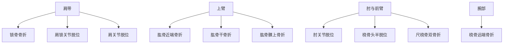
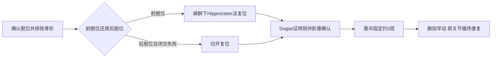

# 从肩带到腕部的损伤定位
> **一句话总览：**上肢损伤要沿“受伤机制—特征畸形—邻近神经血管—影像方向—复位固定—早期功能锻炼”逐段定位，尤其警惕肱动脉、桡神经和前臂筋膜室。

**前置：**[[02-骨折总论]]——复位、固定和并发症处理。
**后续：**[[04-手外伤与断肢再植]]——远端精细结构损伤。
**教材锚点：**第61章，教材第629～642页（OCR文件 page-668～681）。

***
# 锁骨骨折与肩锁关节脱位
## 锁骨骨折
锁骨中1/3骨折约占80%；近折端受胸锁乳突肌牵拉向上、后移位，远折端受上肢重力和胸大肌牵拉向前、下移位并重叠。【教材第629～630页】
> [!example] 像断裂的肩带撑杆
> 锁骨把肩胛带撑离胸壁。中段断裂后，内侧被颈部肌肉上提，外侧连着整条上肢而下坠，所以出现典型错位。

- 体征：局部肿胀、瘀斑、压痛；病人常健手托肘、头偏患侧以减轻牵拉痛。
- 必查：锁骨后方的臂丛和锁骨下血管，以及肋骨、肺损伤。
- 儿童青枝及成人无移位：三角巾悬吊3～6周。
- 多数中段骨折：手法复位后“8”字绷带固定；复位后2周内反复检查松紧和再移位。
- 手术考虑：不能耐受固定、复位后再移位影响外观、神经血管伤、开放性骨折、陈旧不愈合、外侧端骨折伴喙锁韧带断裂。
## 肩锁关节脱位

|分型|损伤|影像/体征|治疗|
|---|---|---|---|
|I型|关节囊和韧带挫伤未断|X线无明显移位|三角巾2～3周|
|II型|关节囊破裂，韧带部分断裂，半脱位|锁骨外端上翘，按压有弹跳|可手法复位外固定，但不稳定、易压疮|
|III型|肩锁和喙锁结构完全断裂，完全脱位|明显突起、弹跳、关节面完全错位|有症状陈旧半脱位或移位>2cm者可手术固定并修复韧带|

【教材第630～631页】
***
# 肩关节脱位
肩关节脱位以前脱位最常见；常见机制是上肢着地，暴力经上肢传导使肱骨头突破关节囊。【教材第631～632页】
## 诊断抓手
- 特殊姿势：健手托患侧前臂、头向患侧倾斜。
- 方肩畸形、肩胛盂空虚、上肢弹性固定。
- Dugas征阳性：肘贴胸壁时手不能搭对侧肩，或手搭对侧肩时肘不能贴胸壁。
- X线正、侧位和穿胸位确定方向及合并撕脱骨折；CT用于进一步评价。
- 严重前脱位需检查腋神经等神经血管功能。
## 治疗

- Hippocrates法：足跟置腋下作反牵引，患肢外展位持续均匀牵引，肌肉放松后内收、内旋使肱骨头复位。
- 单纯脱位复位后屈肘90°悬吊3周；合并大结节骨折延长1～2周。
> [!warning] 易错点
> 复位前必须判断有无骨折；粗暴复位可能使骨折移位或造成神经血管损伤。复位成功不只凭“弹响”，还要复查体征、神经血管和影像。

***
# 肱骨近端与肱骨干骨折
## 肱骨近端骨折：Neer分型
Neer按肱骨头、大结节、小结节和肱骨干四部分中发生移位的部分数分类；四部分骨折时肱骨头游离、血供破坏严重，缺血坏死风险高。【教材第632～633页】

|类型|定义|常见处理|
|---|---|---|
|一部分|无论骨折线多少，均未达到明显移位标准|三角巾3～4周，出现愈合迹象后锻炼|
|两部分|一个部位骨折并移位|轻移位且功能要求不高可保守，多数移位者固定|
|三部分|两个部位骨折并移位|多行切开复位钢板内固定|
|四部分|四部分均分离移位，肱骨头可游离|切开复位内固定；复杂老年病例可肱骨头置换|

## 肱骨干骨折
- 中下1/3后外侧有桡神经沟，骨折易伤桡神经。
- 桡神经损伤：垂腕、掌指关节不能背伸、拇指不能伸、前臂旋后障碍，手背桡侧感觉减退。
- 闭合横形或短斜形可手法复位石膏固定；复位后拍片确认，并严密观察对位对线。
- 手术指征：闭合复位失败或功能对线不良、分离/软组织嵌入、神经血管伤、开放伤、骨不连/畸形愈合、同肢多发骨折等。
- 手术需保护桡神经和骨折端血供；术后早期康复。【教材第634～635页】
> [!example] 桡神经像贴着梁背面走的电缆
> 肱骨中下段骨折既可直接割伤“电缆”，也可让它卡在外侧肌间隔；所以看到垂腕必须把神经定位与骨折平面联系起来。

***
# 肱骨髁上骨折：儿童急症重点
肱骨髁上骨折多见于10岁以下儿童，伸直型约占97%。伸直型常为手掌着地，近折端向前下、远折端向上移位；屈曲型为屈肘时肘后着地，方向相反。【教材第635～637页】
## 伸直型与屈曲型

|项目|伸直型|屈曲型|
|---|---|---|
|机制|半屈或伸肘、手掌着地|屈肘、肘后着地|
|典型移位|近折端前下，远折端向上|近折端后下，远折端向前|
|神经血管风险|肱动脉、正中神经等风险高|较少，但锐利断端易刺破后方皮肤|
|外固定|复位后屈肘石膏约4～5周|约屈肘40°固定4～6周|

## 治疗与并发症
- 复位前后必须记录桡动脉搏动、手指颜色温度、毛细血管回流及感觉运动。
- 闭合复位2～3次仍不满意，或严重肿胀不能安全闭合复位，应及时切开复位内固定。
- 术后出现高张力肿胀、主动活动障碍、被动牵伸剧痛、皮温降低和感觉异常，应立即考虑前臂骨筋膜室综合征，紧急切开减压。
- 尺侧/桡侧移位未纠正可导致肘内翻或外翻；应尽量解剖复位。
> [!danger] 不能等5P征
> 无痛、无脉、苍白、感觉异常、肌麻痹是严重缺血晚期表现；等到此时减压也可能无法避免Volkmann挛缩。

***
# 肘关节脱位与桡骨头半脱位
## 肘关节脱位
- 后脱位最常见：跌倒时半伸肘、手掌着地，尺骨鹰嘴杠杆作用使尺桡骨向后脱出。
- 体征：肘后突畸形、半屈位弹性固定、肘后空虚；**肘后三角关系改变**。
- 麻醉下手法复位后，长臂石膏或支具屈肘90°固定2～3周，随后尽早屈伸锻炼，避免肘僵硬。
- 屈曲超过30°仍明显不稳或有脱位趋势时，考虑韧带重建。【教材第637页】
## 桡骨头半脱位
> [!example] 幼儿“牵拉肘”
> 5岁以下幼儿被突然提拉手腕后，前臂固定在半屈、旋前位且不肯活动，X线常正常；薄弱环状韧带/关节囊嵌入肱骨小头与桡骨头之间。

- 不需麻醉：屈肘90°，拇指压桡骨头，轻柔旋后、旋前并推压复位。
- 弹响后旋转和屈伸恢复表示成功；无需固定，但告知家长避免再次牵拉。【教材第638页】

|鉴别|肘关节后脱位|桡骨头半脱位|
|---|---|---|
|人群|任何年龄，高能量或跌倒|多见5岁以下|
|畸形|肘后突、三角关系改变|通常无明显畸形|
|前臂位置|弹性固定|半屈、旋前|
|X线|可见脱位/骨折|常无异常|
|固定|复位后2～3周|通常不固定|

***
# 前臂双骨折
尺桡骨共同决定前臂长度、骨间隙和旋转；治疗目标不只是“两根骨接上”，还要恢复桡骨弓和骨间膜张力，防止交叉愈合与旋转障碍。【教材第638～640页】
## 损伤模式
- 直接暴力：同一平面横形或粉碎性双骨折，软组织损伤重。
- 间接暴力：桡骨先骨折，余力经骨间膜导致更低位尺骨斜形骨折。
- 扭转暴力：不同平面螺旋/斜形骨折，常高位尺骨、低位桡骨。
- Monteggia骨折：尺骨上1/3骨折合并桡骨头脱位。
- Galeazzi骨折：桡骨下1/3骨折合并尺骨头/下尺桡关节脱位。
## 复位与固定
- X线必须包括肘或腕关节，以免漏诊桡骨头或尺骨头脱位。
- 闭合复位时先纠正旋转、短缩和成角；稳定的一根先复位，可借骨间膜帮助另一根复位。
- 上1/3双不稳定骨折常先复位尺骨，下1/3常先复位桡骨，中段一般先尺骨。
- 成功后长臂石膏固定，一般8～12周骨性愈合；术后2周动手指腕，4周动肘肩，8～10周影像证实愈合后才开始前臂旋转。
- 手法失败、开放伤、神经血管肌腱损伤、同侧多发伤或陈旧畸形愈合者行切开复位内固定。
> [!warning] 易错点
> 前臂双骨折复位满意不能只看对位对线；若桡骨弓、两骨间距或旋转关系未恢复，即使骨性愈合也可能失去旋前旋后功能。

***
# 桡骨远端骨折
桡骨远端关节面正常有掌倾角10°～15°和尺倾角20°～25°；复位需尽量恢复这些负重与旋转参数。【教材第640～642页】

|类型|机制|远折端移位|典型表现|
|---|---|---|---|
|Colles伸直型|腕背伸、手掌着地、前臂旋前|向桡侧、背侧|侧面“银叉”，正面“刺刀样”|
|Smith屈曲型|腕屈曲、手背着地或腕背受击|向掌侧、尺侧|反Colles，腕部下垂|
|Barton|桡骨远端关节面骨折伴腕关节脱位|腕骨连同关节面骨块向掌侧或背侧|易误诊为单纯腕关节脱位|

## 治疗
- Colles闭合复位需纠正背侧、桡侧移位，复位后屈腕尺偏位固定；2周肿胀消退后改中立位固定。
- Smith复位方向与Colles相反，原则相同。
- Barton先试手法复位外固定，但关节内骨折常不稳定；无法维持应切开复位内固定。
- 严重粉碎、关节面破坏、闭合复位失败或不能维持者手术。
- 远端背侧骨面不平可磨损拇长伸肌腱并自发断裂；桡骨短缩造成尺骨相对过长可致腕痛和旋转障碍。
***
# 高频易错点

|错误/混淆|正确辨析|
|---|---|
|肩关节脱位只看方肩|还要Dugas征、弹性固定、神经血管检查与影像排除骨折|
|肱骨干骨折只查骨折|中下段必须查桡神经，记录是否垂腕|
|儿童髁上骨折有桡动脉就安全|筋膜室综合征早期可仍有脉搏，应看进行性痛和被动牵拉痛|
|肘后畸形都是髁上骨折|肘脱位肘后三角改变；髁上骨折通常三角关系仍保持|
|桡骨头半脱位需石膏|复位成功后一般无需固定|
|Monteggia与Galeazzi|前者尺骨上1/3+桡骨头脱位；后者桡骨下1/3+尺骨头/下尺桡关节脱位|
|Colles与Smith|远折端分别向背桡侧与掌尺侧，方向相反|

***
# 折叠自测
> [!question]- 中年人跌倒后方肩、Dugas征阳性，首先做什么？
> 先查患肢神经血管并用X线确认脱位方向及有无骨折；单纯前脱位在麻醉下手法复位，复位后再次查Dugas征、神经血管并影像确认。
> [!question]- 儿童肱骨髁上骨折复位固定后手指被动伸展剧痛，意味着什么？
> 高度提示前臂骨筋膜室综合征，应立即解除外部压迫、评估筋膜室压力和灌注，达到指征时急诊切开减压。
> [!question]- 尺骨上1/3骨折为什么必须拍到肘关节？
> 为排除合并桡骨头脱位，即Monteggia骨折；漏诊脱位会导致持续疼痛、畸形和前臂功能障碍。
> [!question]- “银叉”畸形对应哪种骨折和移位？
> Colles伸直型桡骨远端骨折，远折端向背侧和桡侧移位。

***
# 相关笔记
- [[02-骨折总论]]——复位标准、固定选择和筋膜室综合征。
- [[04-手外伤与断肢再植]]——上肢远端肌腱、神经、血管的精细检查与修复。
- [[05-下肢骨关节损伤]]——对照肩、肘、腕与髋、膝、踝的脱位和关节内骨折。
- [[01-运动系统畸形]]——对照儿童发育畸形与创伤后畸形。
