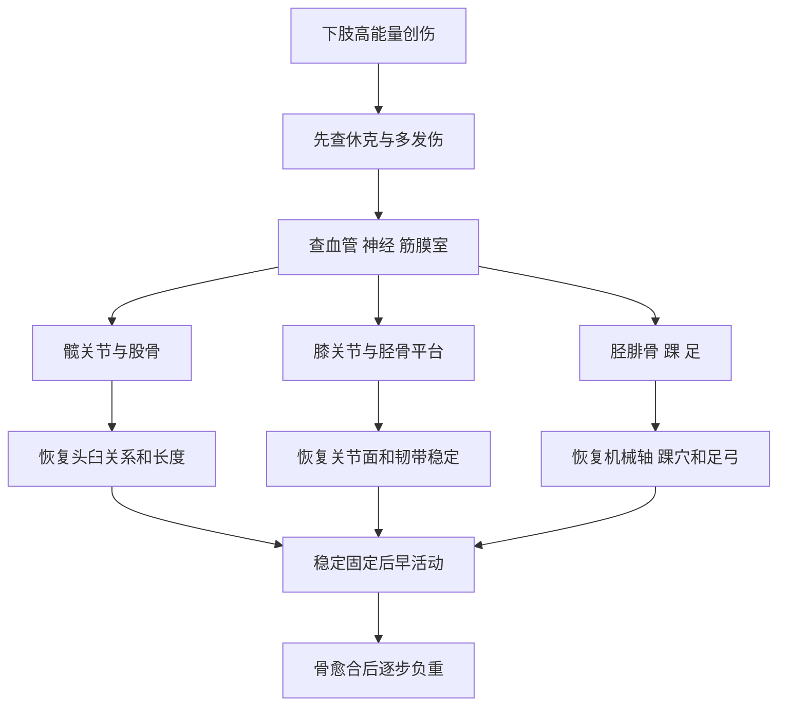

# 以负重力线和关节面为主线
> **一句话总览：**下肢创伤治疗要在保命和保护神经血管的基础上，恢复髋—膝—踝的关节面、机械轴和肢体长度，稳定固定后尽早活动、延后负重。

**前置：**[[02-骨折总论]]——骨折并发症与复位固定康复。
**对照：**[[03-上肢骨关节损伤]]——上肢重功能灵活，下肢更强调负重与力线。
**教材锚点：**第63章，教材第650～675页（OCR文件 page-689～714）。

***
# 髋关节脱位
髋关节由深髋臼、强韧带和强肌群稳定，脱位通常提示高能量创伤，常合并多发伤。【教材第650～652页】
## 三种脱位比较

|项目|后脱位|前脱位|中心脱位|
|---|---|---|---|
|常见程度|约85%～90%，最常见|少见|股骨头穿过髋臼内壁入盆|
|机制|屈髋屈膝、内收内旋时膝前撞击，如“仪表盘伤”|髋外展外旋时受轴向暴力|侧方暴力直击大转子|
|畸形|屈曲、内收、内旋、短缩|屈曲、外展、外旋|短缩依内陷程度，髋部严重肿痛|
|重要合并伤|坐骨神经，尤其腓总神经成分|前方软组织、股骨头骨折风险|髋臼粉碎、后腹膜大出血和腹内脏器伤|
|主要处理|麻醉下早期Allis法复位|牵引下内收内旋复位，失败切开|复苏并按髋臼骨折类型牵引或切开复位固定|

> [!example] 仪表盘伤
> 乘员屈髋屈膝坐着，膝撞仪表盘，股骨像活塞把股骨头向后顶出髋臼；因此看到膝部撞击史也要检查髋和坐骨神经。

- 后脱位Epstein I型为单纯脱位或伴小后壁片；II～V型逐步合并大后壁片、粉碎、顶部或股骨头骨折，复杂型多主张早期切开复位固定。
- 最初24～48小时是复位黄金时间，尽量24小时内完成；延至48～72小时后复位困难、并发症增加。
- 后脱位复位后牵引或防旋2～3周，期间练股四头肌；约4周扶双拐，3个月后完全负重。
> [!warning] 易错点
> 髋脱位必须在充分麻醉肌松下复位，并在复位前后查坐骨神经和影像；不能用暴力“硬掰”合并髋臼或股骨头骨折的脱位。

***
# 股骨近端骨折
## 股骨颈骨折
股骨头最重要血供来自旋股内侧动脉分支；头下和经颈骨折更易破坏血供，发生不愈合或股骨头缺血坏死。【教材第652～655页】
> [!example] 股骨头血供像从颈部绕行的水管
> 骨折线越靠近股骨头，越可能切断沿股骨颈上行的供血“水管”；因此同样叫股骨颈骨折，头下型的生物学风险高于基底型。

### 分类

|分类轴|类型|意义|
|---|---|---|
|骨折部位|头下、经颈、基底|越近股骨头，缺血坏死风险越大；基底部血供相对好|
|Pauwels角|内收型>50°；外展型<30°|角越大，剪切力越大、越不稳定|
|Garden|I嵌插/不完全、II完全无移位、III完全部分移位、IV完全移位|移位越重，血供与愈合风险越高；教材指出CT研究质疑成人真正的Garden I不完全骨折|

### 诊断
- 中老年跌倒后髋痛、不能站行；稳定骨折可一度仍能行走，数日后转为不稳定并加重。
- 外旋通常45°～60°；若达90°更应考虑转子间骨折。
- 轴向叩击痛、短缩；Bryant三角底边缩短，Nelaton线上大转子上移。
- X线正、侧位判断移位，必要时CT确认隐匿或“嵌插”骨折。
### 治疗
- 24小时内手术可防旋鞋；不能完成时皮牵引或胫骨结节牵引，并立即做股四头肌等长收缩和踝趾活动防血栓。
- 闭合复位后可用3枚空心拉力螺钉、动力髋螺钉等固定；青壮年闭合失败或陈旧不愈合可切开复位、内固定并血管蒂骨块植骨。
- 老年Garden III、IV：全身较好、预期寿命长倾向全髋置换；全身差、合并症多、预期寿命短可半髋置换。
- 内固定后一般6周扶双拐逐步部分负重；关节置换后可更早下床。【教材第655页】
## 股骨转子间骨折
- 股骨矩连续性决定稳定性；外旋畸形可达90°，局部肿胀瘀斑较股骨颈骨折明显。
- Tronzo-Evans I、II型相对稳定；III、IV型因小转子/大转子粉碎而不稳定；V型为逆转子间骨折，不稳定。
- 老年非手术牵引卧床并发症和病死率高，现多主张早期手术，恢复股骨矩、纠正髋内翻并坚强固定；可选DHS、Gamma钉、PFNA、PFBN等。【教材第656～657页】

|鉴别|股骨颈骨折|转子间骨折|
|---|---|---|
|外旋|多45°～60°|常可达90°|
|肿胀瘀斑|较少|转子区明显|
|主要生物学风险|不愈合、股骨头缺血坏死|高龄卧床并发症、髋内翻和固定失败|
|治疗重点|保护/替代股骨头血供与功能|恢复股骨矩和早期负重能力|

***
# 股骨干与股骨远端骨折
## 股骨干骨折
- 人体最粗长承重骨，骨折多由强暴力造成；单侧也可大量失血，多发或双侧时休克风险更高。
- 上1/3：近折端向前、外、外旋；中1/3：内收肌牵拉致向外成角；下1/3：远折端受腓肠肌牵拉向后，可伤腘血管、胫神经和腓总神经。
- 3岁以下可垂直悬吊皮牵引；牵引过大造成断端间隙可延迟愈合/不愈合。
- 成人多用带锁髓内钉，儿童多用弹性钉；严重开放骨折可外固定。【教材第657～659页】
## 股骨远端骨折
- 包括髁上、髁间和累及关节面的髁部骨折；远折端可被腓肠肌牵向后，损伤腘血管神经。
- 检查膝部畸形、远端血运；怀疑血管损伤时多普勒，必要时血管造影；高能量伤别漏拍骨盆。
- 深静脉血栓多见，应常规考虑多普勒筛查。
- 多数需解剖复位、坚强内固定和早期康复，可用松质骨螺钉+支持钢板、解剖钢板或逆行带锁髓内钉。【教材第659～660页】
***
# 髌骨骨折
髌骨与股四头肌腱、髌韧带共同构成伸膝装置；髌骨缺失会缩短伸膝力臂，股四头肌需增加约30%力量完成伸膝，所以应尽量保留和恢复髌骨完整。【教材第660页】

|机制|骨折形态|
|---|---|
|直接跪地撞击|粉碎性常见|
|股四头肌猛烈收缩|横形常见|

- 无移位或移位<5mm：伸膝位支具/石膏4～6周；注意过早强烈股四头肌收缩可加重分离。
- 移位>5mm或关节面不平：切开复位，克氏针钢丝张力带或钢丝捆扎。
- 无法固定的小极骨折可切除小骨片并重建肌腱/韧带止点；严重粉碎无法恢复软骨面时才考虑髌骨切除并修补伸膝装置。
***
# 膝关节韧带损伤
## 机制与功能

|结构|正常功能|常见机制|检查|
|---|---|---|---|
|内侧副韧带|抗外翻|膝外侧受击或半屈膝时小腿外展外旋|外翻应力试验|
|外侧副韧带|抗内翻|膝内翻力，常合并腓骨头/腓总神经伤|内翻应力试验|
|前交叉韧带|防胫骨前移和旋转不稳|屈膝外翻外旋、过伸或胫骨近端后方受向前力|前抽屉、Lachman、轴移|
|后交叉韧带|防胫骨后移|屈膝时胫骨近端前方受向后力，典型“仪表盘伤”|后抽屉|

- O'Donoghue三联征：前交叉韧带+内侧副韧带+内侧半月板损伤。
- Lachman在屈膝20°～30°检查胫骨前移，阳性率高于前抽屉。
- 轴移试验提示前外侧旋转不稳；急性期检查要轻柔。
- MRI可同时看韧带、半月板、软骨和隐匿骨折；关节镜兼具诊断与治疗价值。
- 侧副韧带扭伤/部分断裂且稳定：支具或石膏4～6周；完全断裂并明显不稳需修复/重建。交叉韧带断裂影响稳定者多关节镜下重建。【教材第661～663页】
***
# 半月板损伤
半月板填充股胫间隙、稳定膝、承重减震、润滑并协同运动；屈膝旋转时最易受剪切。【教材第662～665页】
> [!example] 半月板像关节里的楔形减震垫
> 外周接近滑膜像“有维修通道”，中央白区像“无供血荒区”；同样长度的裂口，靠外周更可能缝合愈合，中央裂口则难自行修复。

## 血供与处理

|区域|血供|愈合能力|处理倾向|
|---|---|---|---|
|红-红区|滑膜缘有血运|强|尽量修复|
|红-白区|血运交界|一定能力|结合形态和稳定性修复|
|白-白区|无血运|低|症状性不稳定裂常部分切除|

- 撕裂形态：纵行、水平、斜行、放射状、瓣状/复合/退变；长段全层纵裂中央瓣移入髁间窝为“桶柄状撕裂”，可交锁。
- 典型：关节间隙痛和压痛、反复肿胀、弹响、交锁；慢性可股四头肌萎缩。
- McMurray：内旋内翻伸膝痛提示外侧半月板，外旋外翻提示内侧；Apley研磨、过伸过屈和蹲走试验辅助。
- 单一试验阳性不能独立确诊；MRI首选，关节镜准确性更高且可同时处理。
- 急性期支具/石膏4周、避免负重并练股四头肌；持续症状者关节镜修复或部分切除。
***
# 胫骨平台骨折
胫骨平台是膝负重面，骨折治疗要恢复**关节面平整、平台宽度、韧带完整和活动范围**；常合并半月板、交叉韧带伤。【教材第665～667页】
## Schatzker分型

|型|形态|提示|
|---|---|---|
|I|外侧平台劈裂，无塌陷|年轻人较多，注意外侧半月板|
|II|外侧劈裂+塌陷|40岁以上较多|
|III|外侧单纯压缩|可稳定或不稳定|
|IV|内侧平台骨折|中高能量，警惕膝脱位和血管伤|
|V|双平台骨折|高能量，神经血管风险高|
|VI|双平台+干骺端与骨干分离|严重软组织伤、筋膜室和神经血管风险最高|

- 高能量伤必须查静息痛、被动牵拉痛、小腿筋膜室紧张和足感觉。
- X线诊断；CT看骨块和塌陷；MRI看半月板韧带软骨；IV～VI型或怀疑血管伤时血管造影。
- 无移位：石膏4～6周后锻炼；移位关节内骨折应解剖复位、坚强固定，骨缺损植骨，遵循**早锻炼、晚负重**，骨愈合后才完全负重。
***
# 胫腓骨干骨折
- 胫骨皮下表浅，易开放；中下1/3交界易折，下1/3血供较差，易延迟/不愈合。
- 胫骨上1/3可伤固定于比目鱼肌腱弓附近的血管；腓骨颈骨折可伤腓总神经；小腿四筋膜室均可能发生综合征。
- 直接暴力常横形、短斜或粉碎；扭转常螺旋或斜形。胫骨下1/3螺旋骨折约89%合并后踝骨折，容易漏诊，应检查踝部并补充影像。【教材第667～669页】
> [!warning] 高频漏诊
> 看到胫骨下1/3螺旋形骨折，不能只拍小腿正侧位后结束；应主动寻找后踝骨折。

## 治疗
- 目标：纠正成角和旋转，恢复胫骨上下关节面平行、肢体长度。
- 无移位或复位后稳定：石膏，定期X线；约10～12周扶拐部分负重。
- 不稳定双骨折：微创或切开复位，钢板或髓内针；术后4～6周可扶拐部分负重。
- 开放骨折：彻底清创，髓内针或外固定架，并用皮瓣/肌皮瓣覆盖外露骨和内固定物。
- 单纯腓骨干且无上下胫腓联合分离：可石膏3～4周止痛。
***
# 踝部骨折与扭伤
## 踝部骨折
踝穴由内踝、外踝、后踝和胫骨下端关节面包容距骨；距骨前宽后窄，所以跖屈时相对不稳。治疗目标是恢复踝穴结构、下胫腓联合和稳定性。【教材第669～671页】
### 两种分型框架

|分型|依据|核心记忆|
|---|---|---|
|Lauge-Hansen|受伤足位+暴力方向|旋后内翻、旋后外旋、旋前外展、旋前外旋；旋后外旋最常见|
|Danis-Weber|外踝骨折相对踝关节水平|A低于、B位于、C高于踝关节；越高越提示下胫腓联合损伤|

- 无移位且无下胫腓联合分离的单踝骨折：石膏6～8周。
- 移位单踝、双踝/三踝和不稳定损伤：多需微创或切开复位内固定。
- 影响1/4～1/3关节面的后踝骨折需固定。
- 下胫腓联合先随踝骨折复位，再以螺钉、高强线或弹性装置固定；刚性螺钉通常在术后10～12周、部分负重前取出。
## 踝部扭伤
- 内侧三角韧带最强，防外翻；外侧副韧带最薄弱，防内翻并维持多方向稳定；下胫腓韧带稳定踝穴。
- 急性：疼痛、肿胀、瘀斑、局限压痛；应力位X线可显示关节间隙增宽或距骨前半脱位，MRI可评估韧带。
- 立即冷敷，48小时后理疗；部分损伤固定2～3周，完全断裂但可稳定者石膏4～6周；反复损伤致慢性不稳可肌腱重建。【教材第671～672页】

|暴力|主要受伤结构|固定纠正位|
|---|---|---|
|内翻|外侧副韧带|外翻位|
|外翻|内侧三角韧带|内翻位|

***
# 跟腱断裂与足部骨折
## 跟腱断裂
- 常见间接机制是起跳/落地时小腿三头肌突然强烈收缩；也可直接打击或锐器切割。
- 受伤时可闻断裂声，跟部痛肿、不能提踵；断裂处可摸到凹陷和空虚，超声定位。
- 少见闭合部分断裂：踝跖屈松弛位石膏4～6周；完全断裂早期手术缝合，屈膝、踝跖屈位固定4～6周；开放伤早期清创修复，皮肤张力大时用皮瓣覆盖。【教材第672页】
## 跟骨骨折
- 高处坠落足跟着地，必须同时检查脊柱、骨盆和髋部，防止沿轴向传导的合并骨折。
- Bohler角正常约25°～40°；治疗要恢复距下关节、Bohler角、跟骨宽度、足弓高度和三点负重。
- Sanders I型无移位；II、III、IV型按后关节面骨块数增加，粉碎和重建难度递增。
- 无移位/高龄高风险者支具或石膏4～6周，10周部分负重、12周完全负重；后关节面明显移位、鸟嘴样撕脱或跟骨体明显变宽移位者手术。严重粉碎无法重建可考虑距下关节融合，但一期还是二期存在争议。【教材第673～674页】
## 跖骨与趾骨

|损伤|要点|
|---|---|
|第2、3跖骨疲劳骨折|长跑、行军的反复应力|
|第5跖骨基底骨折|腓骨短肌猛烈收缩所致，足外翻位固定4～6周|
|跖骨基底移位|可压迫足底动脉弓，威胁前足血供，需急诊复位|
|跖骨颈骨折|远端向下后移位使跖骨头下垂，影响负重，应复位|
|趾骨骨折|无移位多保守；有移位与邻趾胶布固定或石膏托|

- 跖趾骨折都要特别纠正**旋转畸形和跖侧成角**，否则足趾轴线和负重功能异常。【教材第674～675页】
***
# 高频易错点

|错误/混淆|正确理解|
|---|---|
|髋后脱位是外展外旋|后脱位为屈曲、内收、内旋；前脱位才是外展外旋|
|股骨颈外旋90°很典型|45°～60°常见；90°更提示转子间骨折|
|Garden I一定是不完全骨折|教材提示CT研究质疑成人真正的不完全Garden I，应警惕完全骨折|
|髌骨骨折优先切除髌骨|应尽量保留和恢复伸膝装置，只有严重不可重建粉碎才考虑切除|
|前抽屉阴性即可排除ACL伤|急性期肌痉挛可影响，Lachman更敏感，需结合MRI/关节镜|
|McMurray一次阳性即可确诊|单一试验不能独立诊断，需结合症状、关节隙压痛和影像|
|胫骨平台术后早负重|原则是早锻炼、晚负重，完全负重要等骨愈合|
|踝扭伤X线无骨折即可放任活动|可能有韧带完全断裂和慢性不稳，应评估应力稳定性|
|坠落后只查跟骨|轴向力可同时伤脊柱、骨盆和髋|

***
# 折叠自测
> [!question]- 车祸后患肢短缩、屈髋内收内旋并足下垂，最可能诊断及合并伤是什么？
> 髋关节后脱位，合并坐骨神经损伤，常以腓总神经成分受累突出。需紧急影像、麻醉下早期复位，并在复位前后记录神经功能。
> [!question]- 老年跌倒后髋痛，患肢外旋90°、转子区肿胀瘀斑，股骨颈还是转子间骨折更可能？
> 更支持股骨转子间骨折；股骨颈骨折通常外旋45°～60°且局部肿胀瘀斑较轻，但最终需X线/CT确认。
> [!question]- McMurray试验外旋外翻时关节间隙痛提示哪侧半月板？
> 内侧半月板；内旋内翻时痛提示外侧半月板。
> [!question]- 胫骨平台VI型为什么是急诊评估重点？
> 它是双平台骨折伴干骺端与骨干分离的高能量损伤，常有严重软组织伤、骨筋膜室综合征及神经血管损伤。
> [!question]- 胫骨下1/3螺旋形骨折要主动寻找什么合并伤？
> 后踝骨折；教材报道约89%合并，容易漏诊，应补充踝部影像。
> [!question]- 高处坠落跟骨骨折为什么还要查脊柱？
> 轴向暴力可从足跟沿下肢向骨盆和脊柱传导，形成同步压缩或爆裂损伤。

***
# 相关笔记
- [[02-骨折总论]]——休克、筋膜室综合征、复位固定与开放伤处理。
- [[03-上肢骨关节损伤]]——比较上下肢关节脱位、长骨骨折和康复节奏。
- [[04-手外伤与断肢再植]]——神经血管检查、缺血和组织修复。
- [[01-运动系统畸形]]——对照发育性髋脱位、足畸形与创伤后负重异常。
