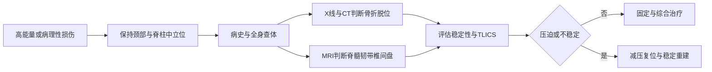

# 第六十四章：先保住神经，再恢复稳定
> **一句话总览：** 脊柱、脊髓损伤的主线是“识别不稳定与神经损害→保持脊柱中立位搬运→用影像和神经查体分层→解除压迫、恢复稳定并防治长期并发症”。

**前置：** [[02-骨折总论|骨折总论]]——理解骨折稳定性、急救与固定。
**后续：** [[07-骨盆与髋臼骨折|骨盆与髋臼骨折]]——同属高能量创伤与多发伤处理。
> [!example] 三柱像一座有电缆隧道的桥
> 前柱承压、中柱紧邻“电缆隧道”椎管、后柱提供后方张力与稳定；一旦中柱碎片向后突入，损伤的不只是桥体，还可能切断脊髓这束主干电缆。（教材第676页）

# 总体路径

# 脊柱骨折
## 三柱与高危部位
- 前柱：椎体前2/3、纤维环前半和前纵韧带。
- 中柱：椎体后1/3、纤维环后半和后纵韧带；碎骨片或髓核可从前方突入椎管。
- 后柱：椎弓、后关节囊、黄韧带、棘上与棘间韧带。
- 胸腰段位于生理弯曲交会和应力集中处，是最常见骨折部位。（教材第676页）
## 颈椎损伤分类

| 机制 | 典型损伤 | 识别重点 |
|---|---|---|
| 屈曲 | 压缩骨折、骨折-脱位 | 双侧关节突交锁时脱位常超过椎体前后径1/2，且多伴脊髓损伤 |
| 垂直压缩 | Jefferson骨折、下颈椎爆裂骨折 | Jefferson为寰椎前后弓骨折；爆裂骨片可突入椎管 |
| 过伸 | 挥鞭样损伤、枢椎椎弓根骨折 | 椎管狭窄者可发生中央管周围损伤；枢椎损伤又称Hangman骨折 |
| 齿突骨折 | Ⅰ、Ⅱ、Ⅲ型 | Ⅱ型位于齿突基部，血供差、不愈合率高；Ⅲ型稳定性及血供较好 |

## 胸腰椎骨折

| 类型 | 形态与稳定性 | 神经风险 |
|---|---|---|
| 压缩骨折 | 椎体前方楔形压缩，多为稳定性 | 通常较低 |
| 爆裂骨折 | 椎体粉碎、前后径与横径增大、椎弓根间距增宽 | 后移骨片可压迫脊髓或神经 |
| Chance骨折 | 横向贯穿椎体、椎弓、棘突，或韧带-椎间盘复合体损伤 | 提示牵张性损伤 |
| 骨折-脱位 | 三柱损伤，可前后或横向移位 | 常伴神经损伤 |

## 检查、诊断与搬运
- 病史问受伤时间、机制、姿势及伤后肢体活动；同时筛查颅脑、胸、腹和盆腔损伤。
- 查体包括中线肿胀压痛、后凸畸形、躯干与四肢感觉、会阴感觉、0～5级肌力以及膝踝、病理、肛门和球海绵体反射。（教材第678页）
- X线看骨折与排列，CT及三维重建看骨性结构，疑脊髓、神经、椎间盘或韧带损伤时行MRI。（教材第678-679页）
> [!danger] 二次损伤常发生在“救人”时
> 一人抬头、一人抬脚或搂抱会增加脊柱弯曲，使碎骨片向后挤入椎管。应以担架、木板或门板，用平托法或整体滚动法转运，并始终稳定颈部。（教材第679页）

## TLICS决策
TLICS把损伤形态、后方韧带复合体完整性和神经损害合并判断：≤3分建议非手术，4分可手术也可非手术，≥5分建议手术。（教材第680页）

| 维度 | 项目与分值 | 复习抓手 |
|---|---|---|
| 损伤形态 | 压缩1分（爆裂另加1分）；平移/旋转3分；分离4分 | 从承压到平移、分离，机械不稳定性递增 |
| 后方韧带复合体 | 无损伤0分；可疑/不确定2分；损伤3分 | 决定后方张力带是否仍有效 |
| 神经状态 | 无损伤0分；神经根2分；脊髓/圆锥完全2分、不完全3分；马尾3分 | 不完全损伤与马尾损伤更强调可挽救功能 |

# 脊髓损伤
## 病理与临床分型

| 类型 | 关键表现 | 结局/定位 |
|---|---|---|
| 脊髓震荡 | 损伤平面以下感觉、运动、反射消失或大部消失 | 数小时至数天恢复，不留神经后遗症 |
| 前脊髓综合征 | 下肢瘫重于上肢，位置觉与深感觉可保留 | 不完全损伤中预后最差 |
| 后脊髓综合征 | 运动、痛温觉、触觉存在，深感觉全部或部分消失 | 后索受累特征 |
| 中央管周围综合征 | 颈椎过伸多见，上肢瘫重于下肢，无感觉分离 | 中央传导束受损 |
| Brown-Séquard综合征 | 同侧运动与深感觉消失，对侧痛温觉消失 | 脊髓半切 |
| 完全性损伤 | 骶段感觉、运动与反射均丧失；休克后仍无功能 | 2～4周后多转为痉挛性瘫痪 |
| 脊髓圆锥损伤 | 鞍区感觉缺失、括约肌与性功能障碍 | 双下肢感觉和运动可正常 |
| 马尾损伤 | 弛缓性瘫痪、腱反射消失、无锥体束征 | 很少完全性 |

> [!example] 半切脊髓像两条交叉时间不同的线路
> 运动与深感觉通路在脊髓内表现为损伤同侧缺失，而痛温觉表现为对侧缺失；记忆重点不是“左右背答案”，而是两类线路交叉层级不同。（教材第682页）

## ASIA分级

| 级别 | 功能 |
|---|---|
| A | 完全损伤：损伤平面以下无任何感觉、运动保留 |
| B | 骶段感觉存在，但无运动功能 |
| C | 有运动功能，一半以上关键肌肌力＜3级 |
| D | 有运动功能，一半以上关键肌肌力≥3级 |
| E | 感觉和运动正常 |

> [!warning] 易错识别
> 教材第683页OCR将ASIA首级识别为“V”，结合该行“完全损伤”的内容可判定为明显OCR字母误识，本笔记校正为A。

## 检查与并发症
- SCIWORA指X线和CT未见明显异常的脊髓损伤，多见于颈椎外伤；MRI可显示受压程度、信号改变范围与萎缩。（教材第683页）
- SEP代表感觉通路，MEP代表锥体束运动通路；两者均不能引出提示完全性截瘫。

| 并发症 | 形成原因 | 防治重点 |
|---|---|---|
| 呼吸衰竭/感染 | 颈髓损伤使肋间肌麻痹、排痰差 | 辅助呼吸、排痰、必要时气管切开 |
| 泌尿系感染/结石 | 尿潴留及长期导尿 | 膀胱训练、多饮水、感染时抗生素 |
| 压疮 | 感觉丧失与骨隆突长期受压 | 气垫床、清洁干燥、每2～3小时翻身 |
| 体温失调 | 受伤平面以下不能出汗 | 空调环境、物理降温与药物支持 |

## 治疗原则
- 伤后6小时内为关键时期、24小时内为急性期；综合治疗包括康复、物理、心理和营养支持。（教材第684页）
- 教材将受伤8小时内甲泼尼龙冲击列为一种可选方案，并给出具体用法；复习时应把“可选”与“常规必用”区分开。
- 手术目的只能解除压迫与恢复脊柱稳定，不能使已损伤脊髓恢复功能。
- 手术指征：关节突交锁；复位不满意或仍不稳定；骨片突入椎管压迫脊髓；截瘫平面上升提示椎管内活动性出血。（教材第684页）
# 易错点

| 易错说法 | 正确认识 |
|---|---|
| 无骨折就没有脊髓损伤 | SCIWORA可在X线、CT无明显异常时存在，需结合MRI与神经查体 |
| 中央管周围综合征下肢更重 | 上肢重于下肢 |
| 圆锥与马尾损伤都出现锥体束征 | 马尾属周围神经型损害，无病理性锥体束征 |
| 手术能恢复已坏死脊髓 | 手术主要减压并恢复稳定性 |
| 脊柱伤员可以两头抬 | 必须保持轴线稳定，采用平托或整体滚动 |

# 折叠自测
> [!question]- 颈椎过伸后上肢瘫痪重于下肢，最符合哪种综合征？
> 脊髓中央管周围综合征；常见于颈椎过伸性损伤，且没有感觉分离。（教材第682页）
> [!question]- TLICS为4分时如何处理？
> 手术或非手术均可；≤3分倾向非手术，≥5分倾向手术。（教材第680页）
> [!question]- 为什么骨盆或脊柱多发伤查体必须检查会阴感觉？
> 会阴/骶段感觉关系到脊髓完全性判断，也可提示脊髓圆锥或马尾损害。（教材第678、682-683页）

# 相关笔记
- [[02-骨折总论|骨折总论]]——骨折急救、固定和并发症的基础框架。
- [[07-骨盆与髋臼骨折|骨盆与髋臼骨折]]——高能量多发伤、休克与搬运的延伸。
- [[08-周围神经损伤|周围神经损伤]]——与马尾及神经根损伤的定位鉴别。
