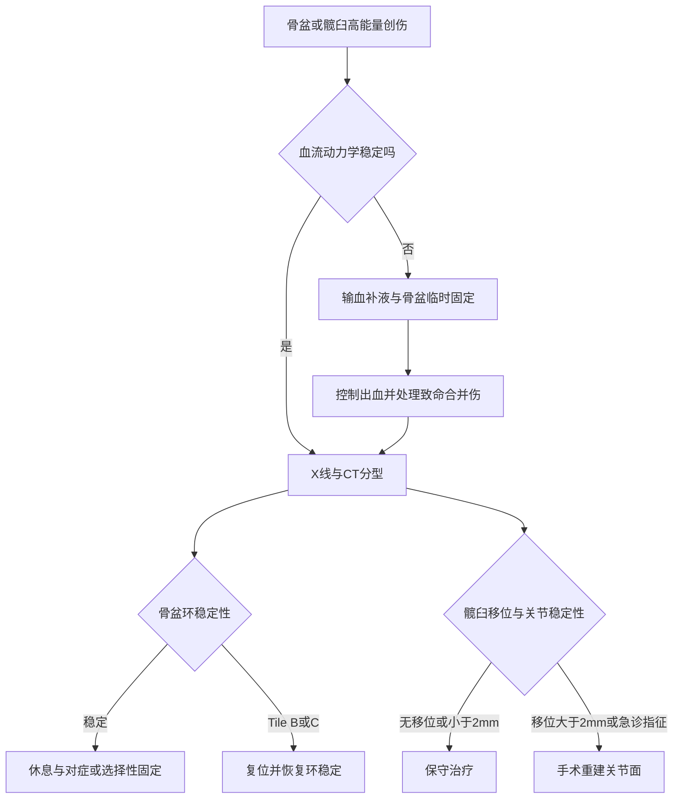

# 第六十五章：骨盆伤先救命，髋臼伤重建关节面
> **一句话总览：** 骨盆骨折首先处理失血性休克和盆腔脏器损伤，再恢复骨盆环稳定；髋臼骨折则以关节内骨折原则追求解剖复位、牢固固定与早期功能锻炼。

**前置：** [[02-骨折总论|骨折总论]]——掌握骨折急救与关节内骨折原则。
**关联：** [[06-脊柱脊髓损伤|脊柱、脊髓损伤]]——同属高能量多发伤。
> [!example] 骨盆环像刚性圆环
> 单点裂开往往仍有支撑，真正明显变形常意味着另一处也断开；因此骨盆环骨折单处少见，多为双处损伤，稳定性判断比只数骨折线更重要。（教材第685页）

# 决策总览

# 骨盆骨折
## 结构、病因与部位分类
- 骨盆由两侧髂、耻、坐骨及骶尾骨组成，前方耻骨联合与后方骶髂关节构成骨盆环；骨折严重时可损伤盆腔脏器、血管和神经。（教材第685页）
- 高能量原因包括车祸、挤压和高坠；低能量损伤包括老年人站立位跌倒、青少年运动撕脱骨折和骑跨伤。

| 部位 | 特点 | 关键联想 |
|---|---|---|
| 骨盆边缘撕脱 | 青少年运动多见，骨盆环稳定 | 髂前上棘-缝匠肌；髂前下棘-股直肌；坐骨结节-腘绳肌 |
| 髂骨翼 | 侧方挤压，移位常不明显 | 单纯损伤不影响骨盆环 |
| 骶骨 | Denis分Ⅰ区骶孔外、Ⅱ区骶孔、Ⅲ区骶管 | Ⅱ、Ⅲ区注意神经损伤 |
| 尾骨 | 跌倒坐地，移位多不明显 | 前突可刺激直肠、影响排便 |
| 骨盆环 | 单处少见，多为双处 | 高能量、畸形与并发症多 |

## 稳定性与暴力方向

| Tile型 | 后环与稳定性 | 处理倾向 |
|---|---|---|
| A型 | 后环完整，稳定 | 多可保守 |
| B型 | 后环不完全损伤；旋转不稳定、垂直稳定 | 多需恢复骨盆环完整性 |
| C型 | 后环完全损伤；旋转、垂直均不稳定 | 手术复位固定 |
| Young-Burgess机制 | 典型改变 | 风险 |
|---|---|---|
| LC侧方挤压 | 骨盆内旋、耻骨支斜行骨折 | 可有同侧或对侧后环损伤 |
| APC前后挤压 | 骨盆外旋、耻骨联合分离或耻骨支纵形骨折 | Ⅲ型严重 |
| VS垂直剪切 | 半骨盆向后上移位、后环完全破坏 | 神经血管损伤率高 |

## 临床、影像与合并症
- 疼痛和活动受限，常合并多发伤与休克；开放性损伤病死率高。
- 骨盆分离及挤压试验阳性；肢体长度不对称；Morel-Lavallée损伤；会阴部瘀斑是耻骨和坐骨骨折的特有体征。（教材第687-688页）
- 骨盆正位、出口位、入口位X线显示骨折与移位；CT更清晰，并可评估骶髂关节和腹盆腔损伤。

| 合并症 | 教材要点 | 临床优先级 |
|---|---|---|
| 腹膜后血肿 | 可广泛蔓延，累及大血管可迅速死亡 | 首先抗休克与止血 |
| 盆腔脏器损伤 | 尿道多于膀胱，也可伤直肠、阴道 | 及早联合相关专科 |
| 神经损伤 | 腰骶丛、坐骨神经；骶Ⅱ、Ⅲ区伤腰骶根 | 预后与括约肌功能相关 |
| 脂肪/静脉栓塞 | 盆腔静脉丛破裂相关 | 持续监测呼吸循环 |

## 急救与骨折处理
> [!danger] 先救命，不要先“把片子看漂亮”
> 血流动力学不稳定时先建立上肢或颈部输血补液通道并抗休克；危及生命的合并伤先处理。腹腔手术时切勿打开腹膜后血肿。（教材第688页）

- 开书样损伤以骨盆兜、床单或外固定架缩小骨盆容量，提高血肿内压力止血。
- 快速输血补液仍不能维持血压时，可行髂内动脉栓塞；无法造影且不能转运时可行骨盆填塞。
- 稳定性骨折多保守，卧床3～4周；明显移位并影响功能者复位固定。
- Tile B、C型需恢复骨盆环完整和稳定，多采用手术复位、钢板螺钉内固定，必要时辅以外固定。
# 髋臼骨折
髋臼骨折是最大负重关节的关节内骨折，占骨盆损伤约10%，高能量伤多见于青壮年，低能量伤在老年人中逐渐增加。（教材第689页）
## Letournel-Judet分型

| 类别 | 五种类型 |
|---|---|
| 简单骨折 | 后壁、后柱、前壁、前柱、横断 |
| 复杂骨折 | T形、后柱伴后壁、横断伴后壁、前柱伴后半横形、双柱 |

## 治疗比较

| 路径 | 适应证/指征 | 要点 |
|---|---|---|
| 保守 | 无移位或移位＜2mm；严重骨质疏松；感染；不能耐受手术；闭合复位满意稳定 | 卧床与牵引 |
| 手术 | 伤后3周内移位＞2mm且无禁忌 | 解剖复位、牢固固定、早期锻炼 |
| 急诊手术 | 难复性脱位；复位后不稳；脱位伴股骨头骨折；神经进行性加重；血管伤；开放伤 | 及时解除关节、神经或血管危机 |

- 教材建议最佳手术时机为伤后4～7天；术前行肠道和患肢准备、患肢牵引。（教材第690页）
- Kocher-Langenbeck入路适用于后壁、后柱、横断伴后壁及多数T形骨折；前方骨折选择相应前方入路。
> [!example] 骨盆环与髋臼是“房架”和“轴承座”
> 骨盆环像承重房架，急性目标是止血并恢复整体稳定；髋臼像轴承座，重点是把承重关节面尽量复到解剖位置。两者都叫骨折，但治疗优先级不同。

# 易错点

| 易错说法 | 正确认识 |
|---|---|
| 骨盆骨折最严重的是骨折线本身 | 常见合并症往往比骨折本身更严重，尤其失血和脏器损伤 |
| 骨盆环单处骨折最常见 | 单处少见，多为双处损伤 |
| Tile B型旋转、垂直均不稳定 | B型旋转不稳定但垂直稳定；C型两者均不稳定 |
| 腹腔手术时应清除腹膜后血肿 | 教材明确提示切勿打开腹膜后血肿 |
| 所有髋臼骨折都立即手术 | 无移位或＜2mm等情况可保守；择期手术通常待全身情况评估与准备 |

# 折叠自测
> [!question]- 一名骨盆开书样损伤且低血压的病人，最初的机械止血思路是什么？
> 用骨盆兜、床单或外固定架固定，缩小骨盆容量并提高腹膜后血肿内压力，同时输血补液抗休克。（教材第688页）
> [!question]- Tile B型与C型最核心的稳定性区别是什么？
> B型旋转不稳定、垂直稳定；C型旋转和垂直均不稳定。（教材第686页）
> [!question]- 髋臼骨折哪条移位阈值最值得记？
> 保守治疗条件包括移位＜2mm；伤后3周内移位＞2mm且无禁忌者可手术治疗。（教材第690页）

# 相关笔记
- [[02-骨折总论|骨折总论]]——关节内骨折处理原则与固定基础。
- [[06-脊柱脊髓损伤|脊柱、脊髓损伤]]——多发伤中的神经评估与轴向稳定。
- [[08-周围神经损伤|周围神经损伤]]——腰骶丛、坐骨神经损伤的功能判断基础。
