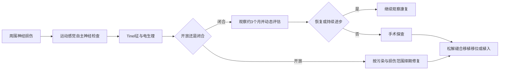

# 第六十六章：判断连续性，等待再生或及时重建
> **一句话总览：** 周围神经损伤复习的核心是用运动、感觉、自主神经、Tinel征和电生理判断损伤层级与连续性，再依据闭合/开放、损伤程度和观察期选择松解、缝合、移植或功能重建。

**前置：** [[02-骨折总论|骨折总论]]——理解骨折伴发神经损伤。
**关联：** [[06-脊柱脊髓损伤|脊柱、脊髓损伤]]——鉴别中枢性与周围性瘫痪。
> [!example] 神经像“电缆芯线＋绝缘层＋维修管道”
> 轴索是传导芯线，髓鞘像绝缘层，施万鞘像预留维修管道；轴索断而管道仍在时，再生芽仍可沿管道长向靶器官，管道也断裂时则通常需要手术重建连续性。（教材第691页）

# 诊疗总览

# 结构、分级与再生
## Seddon分类

| 类型 | 结构改变 | 恢复与处理 |
|---|---|---|
| 神经麻痹 neuropraxia | 神经纤维结构无改变，暂时传导障碍 | 数日或数周自行恢复；常由轻牵拉或短时压迫引起 |
| 轴索中断 axonotmesis | 轴索断裂，远端变性/脱髓鞘；神经内膜管完整 | 轴索可沿施万鞘长入末梢，多可自行恢复 |
| 神经断裂 neurotmesis | 神经连续性破坏、功能丧失 | 需手术修复才可能恢复 |

## Waller变性与再生
- 远端轴索及髓鞘伤后数小时即改变，2～3天逐渐碎裂，5～6天吞噬细胞增生清除碎片。
- 施万细胞约伤后3天增生达高峰并持续2～3周，形成中空通道；近端变化仅限1～2个郎飞结。
- 伤后约1周，近端轴索长出再生支芽；断端连接后沿施万鞘以每日1～2mm向末梢生长。（教材第691页）
- 断端不连接：近端可形成假性神经瘤，远端形成神经胶质瘤；靶器官亦会变性、萎缩甚至消失。
> [!example] 为什么“能长”不等于“能恢复”
> 再生轴索像沿旧管道缓慢铺设的新线：不仅要跨过修复处，还要走到正确终末器官并成熟。距离越长、靶器官等待越久，功能恢复越困难。

# 临床诊断

| 维度 | 阳性表现 | 复习重点 |
|---|---|---|
| 运动 | 弛缓性瘫痪，主动运动、肌张力、腱反射消失；继发肌萎缩和特征畸形 | 防止其他肌肉代偿造成误判，应逐肌检查 |
| 感觉 | 触、痛、温度觉异常 | 以绝对支配区判断：正中神经示/中指远节，尺神经小指 |
| 两点辨别觉 | 分辨距离增大提示精细感觉差 | 正常手指近节4～7mm、末节3～5mm |
| 自主神经 | 早期潮红、温高、干燥无汗；晚期苍白、温低、皮纹和甲改变 | 无汗提示损伤，从无汗转有汗提示恢复 |
| Tinel征 | 叩击损伤处出现放射性针刺麻痛 | 定位损伤；修复后阳性点向远端推进提示再生 |
| 电生理 | 肌电与体感诱发电位异常 | 判断部位、程度及动态恢复 |

# 治疗时机与手术方法
## 时机

| 情境 | 教材策略 |
|---|---|
| 闭合性钝挫/牵拉 | 多为传导障碍或轴索中断，观察3个月；无恢复或恢复停滞则探查 |
| 污染轻的开放切割伤 | 具备条件时伤后6～8小时一期修复 |
| 未一期修复且伤口无感染 | 伤后2～4周延期修复 |
| 曾感染、火器伤、高速震荡伤 | 伤后2～4个月二期修复 |
| 碾压/撕脱且范围难定 | 初次手术固定断端防回缩，为二期修复创造条件 |

## 方法
- 神经松解术：切开或切除神经周围/神经内瘢痕，解除压迫并改善血供。
- 神经缝合术：外膜缝合适用于运动与感觉混合神经；束膜缝合用于单一功能束，要求断端准确、无扭转重叠、尽量无张力。（教材第692页）
- 神经移植术：缺损无法无张力对合时采用，常取自体腓肠神经；粗大神经可电缆式多股移植，缺损≥10cm可用吻合血管的神经移植。（教材第693页）
- 神经移位术：用功能较不重要神经近端连接重要损伤神经远端。
- 神经植入术：远端在入肌处损伤、无法缝接时，将近端神经束植入肌肉；感觉神经近端也可植入皮下。
# 典型上肢神经损伤

| 神经/部位 | 运动畸形 | 感觉关键区 | 处理抓手 |
|---|---|---|---|
| 臂丛上干 C5～6 | 肩外展、屈肘障碍 | 上臂外侧、前臂外侧至拇示指 | 闭合牵拉观察3个月；根性撕脱可有Horner征 |
| 正中神经腕部 | 拇对掌障碍、鱼际肌麻痹 | 桡侧3个半指，示中指远节最关键 | 开放伤争取一期或延期修复 |
| 正中神经肘上 | 加上拇、示、中指屈曲障碍 | 同上 | 神经未恢复可肌腱移位重建对掌 |
| 尺神经腕部 | 环小指爪形、指收展障碍、Froment征 | 小指及尺侧1个半指 | 高位伤手内肌恢复差，宜尽早修复 |
| 桡神经肱骨中下1/3 | 垂腕，伸腕伸拇伸指和旋后障碍 | 虎口区 | 骨折复位固定后观察2～3个月，肱三头肌恢复可继续观察 |
| 桡神经深支 | 伸指、伸拇障碍，伸腕保留但桡偏 | 无手部感觉障碍 | 与高位桡神经伤区分 |

# 典型下肢神经损伤

| 神经 | 典型运动障碍 | 感觉障碍 | 线索 |
|---|---|---|---|
| 股神经 | 股四头肌麻痹、伸膝障碍 | 股前与小腿内侧 | 腰2～4来源，开放锐器伤一期修复 |
| 坐骨神经高位 | 屈膝、踝和足趾运动均可丧失，足下垂 | 小腿后外侧和足部 | 髋后脱位、臀部伤/注射可致；预后差 |
| 胫神经 | 跖屈、内收、内翻及足趾跖屈障碍 | 小腿后侧、足跟及足底等 | 多为挫伤，观察2～3个月后评估探查 |
| 腓总神经 | 背伸、外翻障碍，足内翻下垂 | 小腿前外侧和足背 | 腓骨头颈骨折易伤，教材主张尽早探查 |

# 周围神经卡压综合征
## 四种典型综合征比较

| 综合征 | 受压神经与部位 | 核心表现 | 特异检查/治疗 |
|---|---|---|---|
| 腕管 | 正中神经-腕管 | 桡侧三指麻痛，中指最重；夜间/清晨重，鱼际萎缩、对掌无力 | Phalen、腕部Tinel；中立位制动，必要时切开腕横韧带 |
| 肘管 | 尺神经-尺神经沟 | 小指及环指尺侧麻痛，骨间肌萎缩、爪形手、Froment征 | 尺神经沟Tinel；松解并前置尺神经 |
| 旋后肌 | 桡神经深支-旋后肌腱弓 | 伸拇伸指障碍，伸腕保留但桡偏，无虎口感觉异常 | 诊断成立后探查、切开腱弓减压 |
| 梨状肌 | 坐骨神经-臀部 | 臀至足放射痛、痛性跛行，“4”字抗阻加重 | 早期保守；瘢痕、骨痂或变异致压则手术 |

> [!warning] 腕管综合征注射陷阱
> 腕管内注射醋酸泼尼松龙可用于早期治疗，但肿瘤和化脓性炎症禁用；更不能注入神经内，以免产生化学性炎症并加重症状。（教材第697页）

# 易错点

| 易错说法 | 正确认识 |
|---|---|
| Tinel征阳性只代表损伤 | 修复后阳性点沿神经向远端移动也提示再生 |
| 神经断裂可以等它自行恢复 | 神经断裂需手术恢复连续性 |
| 桡神经深支损伤一定垂腕并有虎口麻木 | 伸腕可保留但桡偏，且无感觉障碍 |
| 尺神经高位伤比低位更容易恢复手内肌 | 高位伤距离远，手内肌恢复更差 |
| 腕管与颈椎病神经根型查体相同 | 腕管体征集中在腕以远，颈椎病可累及前臂屈肌，Phalen及腕Tinel常阴性 |

# 折叠自测
> [!question]- 轴索中断为什么可能自行恢复，而神经断裂通常不能？
> 轴索中断时神经内膜管和施万鞘通道仍完整，再生轴索可沿其长入末梢；神经断裂破坏连续性，需手术修复。（教材第691页）
> [!question]- 伸指、伸拇障碍，但能桡偏伸腕且虎口感觉正常，定位在哪里？
> 桡神经深支/骨间背侧神经，典型可见于旋后肌综合征。（教材第695、698页）
> [!question]- 闭合性牵拉伤观察多久无恢复应考虑探查？
> 一般观察3个月；若无恢复或恢复后停滞，应手术探查。（教材第692页）

# 相关笔记
- [[02-骨折总论|骨折总论]]——骨折合并周围神经伤的处理背景。
- [[06-脊柱脊髓损伤|脊柱、脊髓损伤]]——上运动神经元与下运动神经元体征鉴别。
- [[09-运动系统慢性损伤|运动系统慢性损伤]]——卡压综合征与慢性劳损的共同机制。
