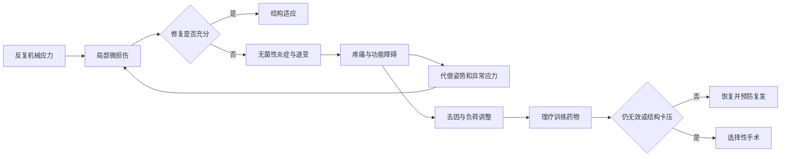
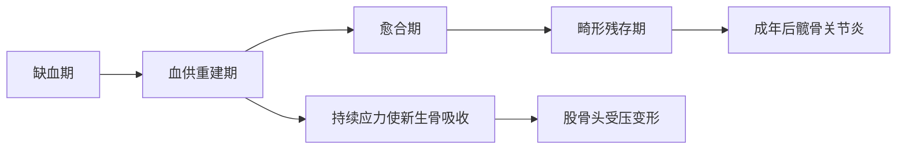

# 第六十七章：反复超载超过修复能力
> **一句话总览：** 运动系统慢性损伤的共同机制是反复应力与修复失衡，治疗关键不是单纯止痛，而是识别致伤动作、纠正异常受力、恢复保护能力并按组织类型处理。

**前置：** [[02-骨折总论|骨折总论]]——理解骨修复与功能锻炼。
**关联：** [[08-周围神经损伤|周围神经损伤]]——慢性卡压属于本章四类损伤之一。
> [!example] “水滴石穿”不是力量大，而是恢复期被反复打断
> 单次轻微应力可能只产生可修复的微损伤；若在修复未完成前继续重复同一负荷，损伤不断叠加，最终从软组织炎症发展到骨吸收超过骨修复、甚至完全骨折。（教材第700、705页）

# 总体框架

# 概述
## 病因、分类与共性
- 病因：全身疾病致局部病理性紧张；寒冷致血管痉挛与代谢物积聚；长期重复姿势超过代偿；技术或姿势不良；解剖/姿态异常致应力不均；急性伤康复不当转慢性。（教材第700页）

| 分类 | 代表病变 |
|---|---|
| 软组织慢性损伤 | 肌、肌腱、腱鞘、韧带、滑囊 |
| 骨慢性损伤 | 疲劳骨折、缺血性坏死 |
| 软骨慢性损伤 | 关节软骨、骺软骨慢性损伤 |
| 周围神经卡压 | 重复活动或周围结构增生/狭窄致神经损伤 |

临床共性是长期局部痛、无明确外伤；特定压痛点/肿块和特殊体征；局部炎症但缺少急性炎症表现；近期相关过度活动史；可有姿势、工作习惯或职业史。
## 治疗原则
- 限制致伤动作、纠正姿势、增强肌力、保持关节非负重活动并适时改变姿势，是治疗和防复发的关键。
- 理疗、按摩可改善循环、减少粘连、软化瘢痕；NSAIDs宜短期间断使用，长期使用注意胃肠及肝肾损害。
- 糖皮质激素局部注射需明确适应证，多用于表浅部位且不应多次使用；过量可加重肌腱、韧带退变，糖尿病控制差或免疫力低者感染风险高。
- 非手术无效的狭窄性腱鞘炎、神经卡压和腱鞘囊肿等可适时手术。（教材第700页）
# 慢性软组织损伤
## 腰腿痛：先辨疼痛类型

| 类型 | 特点 | 定位价值 |
|---|---|---|
| 局部痛 | 病灶或继发肌痉挛所致，部位局限、固定压痛点 | 局部麻醉封闭可短期迅速缓解 |
| 牵涉痛 | 腰骶或内脏刺激在同节段皮区表现 | 部位模糊，少有神经损害客观体征 |
| 放射痛 | 神经根受损，沿神经向末梢放射 | 有感觉、运动、反射的定位体征 |

- 姿势影响椎间盘负荷：以站立为100%，坐位150%，站立前屈210%，坐位前屈270%；腰围可减少约30%负荷。（教材第701页）
- 多数可通过休息、减少弯腰、腰围、腰背肌训练、适当牵引理疗推拿及NSAIDs缓解；禁止暴力按摩。病因明确且严格非手术无效才考虑手术。（教材第703页）
> [!example] 坐着前屈不是“休息姿势”
> 教材给出的相对负荷显示，坐位前屈可达站立位的270%；久坐伏案者即使没有搬重物，也可能持续处于高负荷姿势。

## 颈项部纤维组织炎
- 多因素导致颈部筋膜、肌肉微循环障碍，出现渗出、水肿、纤维化的非特异性无菌性炎症。
- 颈肩背慢性痛在晨起、天气变化、受凉、劳累或精神紧张时加重，活动后可减轻；可触及痛点、痛性结节或索条，但无神经损伤表现。（教材第703-704页）
- 结合病史体征通常可诊断，无须常规CT/MRI；治疗以去因、保暖、纠正姿势、理疗按摩、NSAIDs和选择性封闭为主。
## 棘上、棘间韧带损伤
- 棘上韧带中胸段较薄，故损伤多见；L5～S1无棘上韧带且位于活动腰椎与固定骶椎交界，棘间韧带受力最大。（教材第704页）
- 长期弯腰或脊柱不稳造成微撕裂、出血、渗出和瘢痕；压痛位于棘突或棘间，无红肿，疼痛可向骶臀放射但不过膝。
- 避免弯腰、腰围制动、局部糖皮质激素和理疗为主；推拿按摩主要缓解继发痉挛，筋膜条带修补疗效尚不肯定。
# 骨与骺软骨慢性损伤
## 疲劳骨折
- 好发第2跖骨干与肋骨，也见第3、4跖骨、腓骨远端、胫骨近端、股骨远端；约80%发生于足部。
- 机制：反复轻微损伤导致骨小梁断裂，在持续受力中修复受阻、骨吸收增加，最终骨吸收超过骨修复而完全骨折。（教材第705页）
- X线症状出现后2～3周内常无异常；MRI早期可显示水肿，灵敏度与骨扫描相当且特异度较高。
- 多无移位，确诊后石膏固定6～8周并康复；恢复训练前须纠正动作姿势和危险因素。
## 月骨缺血性坏死（Kienböck病）
- 20～30岁多见，频繁腕部活动反复振荡撞击，损伤关节囊及韧带小血管；缺血后骨髓内压升高又加重循环障碍。
- 腕背月骨区压痛、腕活动受限且背伸最明显；早期X线可正常，数月后月骨密度增加、形态不规则并有囊状吸收。（教材第705-706页）
- 早期腕背伸20°～30°固定至形态和血供恢复；完全坏死变形可切除月骨并填充/植入假体，严重桡腕骨关节炎可融合。
## 胫骨结节骨软骨病（Osgood-Schlatter病）
- 9～14岁好动儿童，股四头肌牵拉尚未骨化的胫骨结节骨骺，引起撕裂、骨骺炎或缺血坏死；伸膝抗阻、牵拉股四头肌或深蹲时痛加重。（教材第707页）
- 多为良性自限，18岁后骨化通常症状消失但隆起保留；冰敷、短期镇痛/NSAIDs、保护垫及康复为主，不需完全停止体育活动。
> [!danger] 不推荐局部皮质类固醇注射
> 皮下注射无效，曾发生皮肤坏死与骨外露；手术只用于生长板闭合后、保守失败者。（教材第707页）

## 儿童股骨头骨软骨病（Legg-Calvé-Perthes病）
- 3～10岁多见，男∶女约6∶1；4～9岁股骨头骨骺血供最差。可出现髋痛、跛行，少数以膝内上方牵涉痛首诊。（教材第707-708页）

- 治疗要使股骨头包容于髋臼、避免外上缘局限压应力、减负并维持活动；非手术以外展40°、轻度内旋支架1～2年，定期X线至重建完成。（教材第709页）
# 其他常见慢性损伤
## 高频鉴别表

| 疾病 | 典型部位/体征 | 首选思路 | 手术条件 |
|---|---|---|---|
| 滑囊炎 | 骨突处缓慢肿物、波动、压痛；深部可似肿瘤 | 避免摩擦压迫、制动、NSAIDs，可穿刺注药加压 | 非手术无效可切除，仍可复发 |
| 弹响指/拇 | 远侧掌横纹痛性结节，屈伸弹响或交锁 | 调整活动、夹板、短期NSAIDs，必要时腱鞘旁注射 | 严重或保守失败行狭窄腱鞘切开 |
| 桡骨茎突腱鞘炎 | 桡侧腕痛，Finkelstein试验阳性 | 同上 | 保守无效切开减压 |
| 腱鞘囊肿 | 0.5～2.5cm、表面光滑、硬橡皮感，穿刺为透明胶冻 | 穿刺排液、注药、加压 | 多次复发或手指囊肿可完整切除 |
| 肱骨外上髁炎 | 握拳伸腕加重，外上髁压痛，Mills征阳性 | 限制握拳伸腕、选择性封闭 | 顽固痛可松解或关节镜处理 |
| 粘连性肩关节囊炎 | 主动和被动活动均受限，外旋外展、内旋后伸最重 | 每日主动活动、理疗、短期药物 | 持续重症可麻醉下/关节镜松解 |

> [!warning] 腱鞘注射的解剖风险
> 药物应准确注射到腱鞘邻近骨膜处；皮下注射无效，误入桡动脉浅支可能导致桡侧三指血管痉挛、栓塞甚至指端坏死。（教材第711页）

## 粘连性肩关节囊炎鉴别

| 疾病 | 主动活动 | 被动活动 | 关键线索 |
|---|---|---|---|
| 粘连性肩关节囊炎 | 受限 | 同样受限 | 自限性6～24个月；夜痛，关节囊纤维化 |
| 肩袖损伤 | 无力/受限 | 基本正常 | 疼痛弧、落臂征、超声/MRI撕裂 |
| 颈椎病 | 可因神经痛受限 | 大致正常且无痛 | 神经根刺激、椎间孔狭窄、肌电异常 |

# 易错点

| 易错说法 | 正确认识 |
|---|---|
| 慢性损伤只要止痛即可 | 去除致病动作与纠正异常负荷才是防复发关键 |
| 疲劳骨折早期X线阴性即可排除 | 症状后2～3周内X线常无异常，MRI/骨显像更早 |
| 儿童髋痛一定以髋部主诉 | Perthes病可先诉膝内上方牵涉痛，应查同侧髋 |
| 弹响指疼痛点在近侧指间关节 | 主诉可在指间关节，但病变结节常在远侧掌横纹处 |
| 冻结肩只有主动活动受限 | 主动、被动活动均受限；肩袖伤被动活动多正常 |
| 粘连性肩关节囊炎可完全制动等待自愈 | 教材强调每日主动活动，以不引起剧痛为限 |

# 折叠自测
> [!question]- 腰腿痛中最有神经定位价值的是哪类疼痛？
> 放射痛；沿受损神经向末梢放射，并伴感觉、运动和反射的定位体征。（教材第702页）
> [!question]- Finkelstein、Mills和“主动＋被动均受限”分别提示什么？
> Finkelstein提示桡骨茎突狭窄性腱鞘炎；Mills提示肱骨外上髁炎；主动和被动均受限提示粘连性肩关节囊炎。（教材第711-713页）
> [!question]- 为什么Perthes病血供重建期仍可能变形？
> 新生骨尚脆弱，若外力持续，新生骨会再吸收并被纤维肉芽组织替代，股骨头易受压变形。（教材第708页）

# 相关笔记
- [[02-骨折总论|骨折总论]]——疲劳骨折与骨修复的基础。
- [[08-周围神经损伤|周围神经损伤]]——腕管、肘管等卡压综合征详述。
- [[10-股骨头坏死|股骨头坏死]]——成人股骨头坏死与儿童Perthes病的鉴别。
