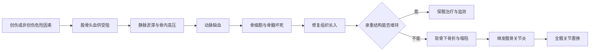

# 第六十八章：缺血启动，塌陷决定关节命运
> **一句话总览：** 股骨头坏死由血供受损引起骨细胞及骨髓成分死亡，修复与力学负荷共同造成结构改变和塌陷，治疗需围绕分期、塌陷程度和关节功能选择保髋或关节置换。

**前置：** [[02-骨折总论|骨折总论]]——理解股骨颈骨折与骨愈合。
**鉴别：** [[09-运动系统慢性损伤#儿童股骨头骨软骨病（Legg-Calvé-Perthes病）|儿童股骨头骨软骨病]]——后者发生于儿童骨骺，不属于成人ONFH。
> [!example] 股骨头像“表面完好的穹顶”
> 早期缺血时外形仍可完整，普通X线甚至长期无异常；一旦软骨下骨折，穹顶承重结构失效，便进入塌陷阶段，治疗目标也从阻止进展逐步转向重建关节。（教材第715-717页）

# 机制总览

# 病因与血供
股骨头、颈血供来自旋股内、外侧动脉、闭孔动脉和股骨滋养动脉；除小部分经圆韧带进入外，多数从关节囊进入，其中旋股内侧动脉最重要。（教材第715页）

| 类别 | 因素 |
|---|---|
| 创伤性 | 股骨头/颈骨折、髋臼骨折、髋关节脱位、髋部严重扭伤或挫伤伴关节内血肿 |
| 非创伤性主要因素 | 皮质类固醇应用、长期过量饮酒、减压病、血红蛋白病、自身免疫病、特发性疾病 |
| 相关风险 | 吸烟、肥胖、放射治疗、妊娠等 |

> [!warning] 病史不是附属信息
> 非创伤性坏死早期可无症状，诊断时必须系统询问外伤、饮酒、职业、既往病史和激素等用药史。（教材第716页）

# 病理演变

| 阶段 | 血运变化 | 组织与结构变化 |
|---|---|---|
| 早期：静脉淤滞期 | 小静脉血栓、扩张，静脉窦充血，回流受阻、骨内高压 | 骨细胞空陷窝＞50%且累及邻近骨小梁，骨髓部分坏死、脂肪细胞肥大 |
| 中期：动脉缺血期 | 动静脉受压狭窄或动脉血栓，供血不足 | 软骨下骨折、坏死扩大、囊变、部分塌陷；新生血管及纤维组织长入形成肉芽 |
| 晚期：动脉闭塞期 | 内皮增生增厚、管腔狭窄乃至闭塞 | 塌陷范围和程度加大，形成髋骨关节炎 |

- 创伤性坏死在创伤初期即有动静脉血运受阻或中断，可较快进入缺血状态。
- 冠状面显微镜下典型五层：关节软骨层、坏死骨组织层、肉芽组织层、新生骨层、正常组织层。（教材第715-716页）
# 临床表现与诊断
## 临床
- 非创伤性坏死多见中年男性，双侧受累占50%～80%。
- 早期为腹股沟、臀部和髋部痛，可伴膝痛；间断发作并逐渐加重，双侧可交替疼痛，也可早期无症状。
- 腹股沟深压痛可放射至臀或膝，“4”字试验阳性；髋活动以内旋、屈曲、外旋受限最明显。（教材第716页）
## 影像比较

| 检查 | 早期/典型表现 | 局限与价值 |
|---|---|---|
| X线正位＋蛙式侧位 | 硬化、囊变、“新月征”；晚期塌陷、球面丧失、骨关节炎 | 骨细胞坏死后至少约2个月或更久才出现密度改变 |
| CT | 细微骨质改变、塌陷与病变范围 | 比X线敏感，但不如核素扫描和MRI敏感 |
| MRI | 前上部异常；T1条带状低信号，T2“双线征” | 有效的早期无创方法，可见骨髓水肿和积液 |
| 核素扫描 | 急性期冷区；修复期“热中有冷”的面包圈样改变 | SPECT可提高灵敏度，PET可能更早发现并预测进展 |
| 组织学 | 骨细胞空陷窝＞50%，累及相邻多根骨小梁并见骨髓坏死 | 可靠但有创，多已被MRI取代 |

> [!example] 双线征像“修复带包着坏死区”
> T2外侧低信号带是增生硬化骨，内侧高信号带是肉芽纤维组织修复；一低一高并行，反映坏死边缘的不同组织反应。（教材第716页）

# ARCO 2019分期

| 分期 | 影像学关键点 | 塌陷状态 |
|---|---|---|
| 1期 | X线正常，MRI异常；骨扫描冷区 | 无X线结构异常 |
| 2期 | X线/MRI异常，可见硬化、骨质疏松或囊变 | 无软骨下骨折、坏死区骨折或关节面变平 |
| 3期 | X线或CT见软骨下骨折、坏死区骨折和/或关节面变平 | 3A塌陷≤2mm；3B塌陷＞2mm |
| 4期 | 髋骨关节炎、关节间隙狭窄、髋臼改变和关节破坏 | 晚期关节毁损 |

> [!tip] 分期抓手
> 1期“X线阴性、MRI阳性”；2期“有骨改变但未骨折塌陷”；3期“软骨下骨折/塌陷并以2mm分A、B”；4期“骨关节炎累及整个关节”。

# 治疗
治疗选择综合MRI、血运变化、坏死分期、关节功能以及年龄、职业和活动水平。（教材第717页）
## 非手术
- 保护性负重：患侧严格避免负重，可扶拐或用助行器，但教材不提倡使用轮椅。
- 药物：抑制破骨、促进成骨药物，以及抗凝、降脂、扩血管和促纤溶药物。
- 中医药：教材建议高危及早期病人可采用活血化瘀、补肾健骨等，亦可配合保髋手术。
- 物理治疗：体外冲击波、电磁场、高压氧等。
## 手术比较

| 手术 | 目的 | 适用线索 |
|---|---|---|
| 髓芯减压 | 降低骨内压、减痛、改善静脉回流并促进血管长入 | 以早期保髋为逻辑 |
| 带血管蒂骨移植 | 提供支撑与血供 | 无塌陷或轻度塌陷 |
| 截骨术 | 将坏死区移出负重区 | 保留自身关节的力学重分配 |
| 全髋关节置换 | 重建已破坏关节 | 髋臼和股骨头均受累、骨关节炎且明显影响生活质量 |

# 易错点

| 易错说法 | 正确认识 |
|---|---|
| 早期X线正常即可排除股骨头坏死 | ARCO 1期X线可正常，MRI已异常 |
| 双线征是X线表现 | 双线征是MRI T2表现；X线可见新月征 |
| ARCO 2期已经出现软骨下骨折 | 2期无软骨下骨折或塌陷；出现后进入3期 |
| 3A与3B以是否疼痛区分 | 以塌陷深度2mm为界 |
| 所有坏死都应全髋置换 | 未塌陷或轻度塌陷可考虑保髋；关节整体毁损才偏向置换 |
| 成人ONFH与儿童Perthes病是一回事 | 前者是本章成人/一般股骨头坏死，后者为儿童股骨头骨骺骨软骨病 |

# 折叠自测
> [!question]- 激素使用史、腹股沟痛、X线正常时下一步最有价值的早期影像是什么？
> MRI；ARCO 1期可表现为X线正常而MRI异常。（教材第716-717页）
> [!question]- “新月征”和“双线征”分别属于哪种检查？
> 新月征见于X线的软骨下骨折表现；双线征见于MRI T2加权像。（教材第716页）
> [!question]- ARCO 3A与3B如何区分？
> 股骨头塌陷≤2mm为3A，＞2mm为3B。（教材第717页）
> [!question]- 何时考虑全髋关节置换？
> 髋臼与股骨头均受累、出现骨关节炎并明显影响生活质量时。（教材第717页）

# 相关笔记
- [[02-骨折总论|骨折总论]]——创伤性坏死与骨修复背景。
- [[07-骨盆与髋臼骨折|骨盆与髋臼骨折]]——髋臼骨折及髋部高能量创伤是创伤性病因。
- [[09-运动系统慢性损伤|运动系统慢性损伤]]——儿童Perthes病、月骨坏死等慢性骨损伤的比较。
