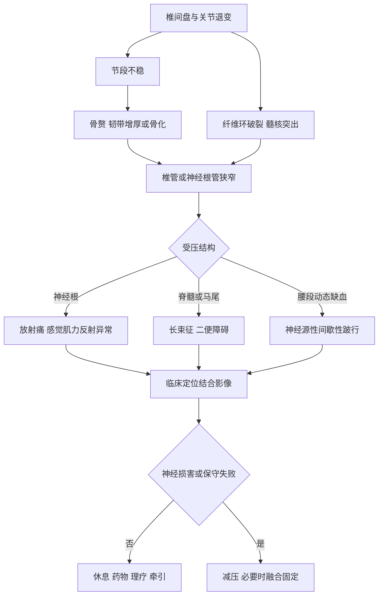

# 第69章核心框架
> **一句话总览：** 颈、腰椎退变的主线是“结构老化与不稳→神经组织机械压迫和/或炎症→定位性症状”，诊断必须让临床定位与影像相互吻合，治疗则以神经损害程度和保守治疗反应决定是否减压手术。（教材第718—729页）

**前置知识：** [[06-脊柱脊髓损伤]]——理解脊髓、神经根和马尾的定位查体
**相关内容：** [[13-骨与关节结核]]——脊柱结核是腰椎间盘突出症的重要鉴别；[[15-骨肿瘤]]——脊柱肿瘤亦可表现为进行性腰痛
# 总览图

# 颈椎退行性疾病
## 颈椎病
颈椎病是颈椎间盘退变及继发改变刺激或压迫邻近脊髓、神经、血管等组织所致的症状和体征综合征。颈椎间盘退变是最基本原因；损伤可诱发或加速病程，发育性椎管狭窄则使较轻退变也能出现压迫症状。C5～6最常见，C4～5及C6～7次之。（教材第718页）
> [!example] “老化铰链挤压电缆”类比
> 椎间盘像缓冲垫，关节与韧带像铰链和拉索。缓冲垫失水变薄后，铰链松动；机体以骨赘、韧带增厚来“加固”，却可能把旁边的神经根或脊髓这束“电缆”越挤越紧。类比只用于理解退变—不稳—增生—压迫链条，不能代替影像与神经定位。

### 四型颈椎病比较

| 类型 | 受累机制 | 关键表现 | 重要提示 |
|---|---|---|---|
| 神经根型 | 椎间盘或钩椎关节压迫神经根 | 颈肩痛向上肢按皮节放射，麻木、肌力下降；臂丛牵拉试验及压头试验可阳性 | 发病率最高 |
| 脊髓型 | 退变结构压迫脊髓或其供血血管 | 四肢麻木无力、僵硬、踩棉花感、束带感、手精细动作差；腱反射亢进，Hoffmann、Babinski征可阳性；晚期二便障碍 | 最严重类型，多累及下颈段 |
| 椎动脉型 | 退变或节段不稳使椎动脉受压、刺激、狭窄、迂曲或痉挛 | 头晕、恶心、耳鸣、偏头痛，转颈时眩晕或猝倒 | 类型本身存在争议，需排除前庭和脑血管等疾病 |
| 交感型 | 退变尤其颈椎不稳刺激或压迫交感神经纤维 | 症状多、体征少；颈项痛、头痛头晕、心悸、心律不齐、失眠等 | 亦存在争议，应排除心脑血管及其他眩晕病因 |

**共同点：** 都以颈椎退变为基础。
**关键差异：** 神经根型按皮节/肌节定位；脊髓型出现锥体束征和多肢体功能障碍；另两型症状非特异且存在争议。（教材第718—720页）
### 常考神经根定位

| 椎间盘 | 神经根 | 感觉或疼痛 | 肌力与反射 |
|---|---|---|---|
| C4～5 | C5 | 颈肩放射，三角肌区麻木 | 三角肌无力、萎缩；无反射改变 |
| C5～6 | C6 | 上臂、前臂外侧至拇示指 | 肱二头肌肌力及反射减弱 |
| C6～7 | C7 | 上臂、前臂背侧中央至中指 | 肱三头肌肌力及反射减弱 |
| C7～T1 | C8 | 环、小指及手掌尺侧感觉丧失 | 指屈肌、骨间肌无力；无反射改变 |

### 影像、诊断与治疗
- X线：曲度、骨赘、椎间隙、椎间孔；动力位可见节段不稳。
- CT：椎间盘突出、椎管矢状径、黄韧带骨化及骨性细节。
- MRI：显示脊髓受压及髓内信号改变。
- 诊断必须结合症状、神经查体、影像和必要时肌电，不能只凭影像。
- 非手术：牵引、制动、理疗、纠正工作体位与睡姿、调整枕高，配合非甾体抗炎镇痛药、肌松药及神经营养药。
- 手术：根性疼痛剧烈且保守无效；脊髓或神经根明显受压伴神经功能障碍；或症状影响生活工作且保守半年无效。前路减压融合常直接减压；后路椎管扩大成形等通过脊髓后移实现间接减压。（教材第719—720页）
> [!warning] 影像阳性不等于疾病诊断
> 教材明确要求颈椎病诊断结合临床症状、影像和肌电相关检查。无相应临床定位时，不能把退变影像直接等同于有症状的颈椎病。

## 颈椎间盘突出症
在退变基础上，后侧纤维环损伤或断裂，轻微外力或无明确诱因使髓核突入椎管，压迫神经根或脊髓。多见40～50岁，C5～6、C4～5最多；神经根受压较常见，表现为颈肩痛、按神经根分布的上肢放射痛、感觉和肌力改变；脊髓受压可出现四肢感觉运动障碍、括约肌障碍乃至截瘫、四肢瘫或Brown-Séquard综合征。MRI是重要诊断依据。（教材第720—722页）
治疗按症状、体征和影像决定：以神经根症状为主者先休息、卧床、牵引或理疗及药物；无效、疼痛加重或出现肌肉瘫痪时及时手术减压，经典术式为颈椎前路椎间盘切除植骨融合术（ACDF）。（教材第721—722页）
## 颈椎后纵韧带骨化症
OPLL是后纵韧带异常增殖并骨化，使椎管容积减小，继而损害脊髓。多见50～60岁，男性多；典型症状为行走不稳，晚期可有大小便障碍，查体呈上运动神经元体征。CT侧重显示骨化灶，MRI评估脊髓受压。（教材第722页）

| 类型 | 影像定义 |
|---|---|
| 连续型 | 连续跨越2个节段以上 |
| 局灶型 | 局限单个椎节 |
| 间断型 | 多个椎节不连续骨化 |
| 混合型 | 上述两型或两型以上并存 |

轻度疼痛或麻木且不影响生活可休息、镇痛、理疗；明显脊髓压迫需据病变类型选择前路、后路或联合手术。（教材第722—723页）
# 腰椎退行性疾病
## 腰椎间盘突出症
腰椎间盘退变后，纤维环部分或全部破裂，髓核、纤维环和/或软骨终板向外突出，刺激或压迫窦椎神经和神经根，以腰腿痛为主。退变是根本原因；积累性损伤重要，妊娠、遗传和腰骶发育异常增加风险。疼痛机制包括机械压迫与髓核诱发的炎症反应。（教材第723页）
> [!example] “果冻垫裂口”病例
> 35岁驾驶员半弯腰搬重物后腰痛并向小腿外侧、足背放射：长期坐位与颠簸促进“缓冲垫”退变，突然负荷使纤维环裂口扩大；突出物既机械牵压神经根，也可能引发炎症。若再出现鞍区麻木和排尿障碍，重点已从止痛转为马尾神经急诊减压。

### 形态分型与治疗倾向

| 分型 | 结构状态 | 教材提示 |
|---|---|---|
| 膨出型 | 纤维环部分破裂但表层完整，局限隆起、表面光滑 | 保守治疗大多缓解或治愈 |
| 突出型 | 纤维环完全破裂，后纵韧带完整 | 部分需手术 |
| 脱出型 | 髓核穿破后纵韧带，根部仍在椎间隙 | 需手术 |
| 游离型 | 大块髓核完全进入椎管并与原椎间盘脱离 | 需手术 |
| Schmorl结节/经骨突出型 | 髓核经终板入椎体，或沿终板血管通道向前突出 | 无神经症状，无需手术 |

### 症状、体征与定位
- 腰痛可早于、同时或晚于腿痛，源于外层纤维环和后纵韧带内窦椎神经受刺激。
- 约95%发生于L4～5、L5～S1，坐骨神经痛由臀部向大腿后外侧、小腿外侧及足部放射，咳嗽或喷嚏可加重。
- 中央型突出压迫马尾可出现二便障碍和鞍区感觉异常，急性发病是急诊手术指征。
- 直腿抬高在60°以内诱发坐骨神经痛为阳性；稍降低至痛消失后背伸踝关节再次诱发放射痛，为加强试验阳性。（教材第724—725页）

| 神经根 | 关键感觉区 | 关键运动肌 | 反射 |
|---|---|---|---|
| L2 | 大腿前中部 | 髂腰肌屈髋 | — |
| L3 | 股骨内髁 | 股四头肌伸膝 | 膝反射 |
| L4 | 内踝 | 胫骨前肌足背伸 | — |
| L5 | 第三跖趾关节背侧 | 足趾长伸肌 | — |
| S1 | 足跟外侧 | 小腿三头肌足跖屈 | 踝反射 |

### 诊断与治疗决策
病史、症状与定位体征先形成临床诊断，再由X线、CT、MRI明确间隙、方向、突出物和神经受压。只有CT/MRI异常而无临床表现者，不应诊断腰椎间盘突出症。（教材第725—726页）
非手术适用于初发病程短、休息可缓解、不能手术或不同意手术者，方法包括卧床、非甾体抗炎药、骨盆牵引和理疗。手术适应证为严重反复腰腿痛经半年以上保守无效并加重、中央型突出伴马尾或括约肌障碍需急诊手术、或明确神经受累。术式包括开放、显微和内镜椎间盘摘除；人工椎间盘置换适应证尚有争议。（教材第727页）
## 腰椎管狭窄症
退行性椎间盘膨出、黄韧带皱褶、骨赘及关节突增生内聚共同缩小椎管，并可造成静脉回流障碍和神经缺血。中老年人常先腰痛多年，后出现站立或行走加重的单/双侧下肢痛、麻木和乏力，休息或下蹲缓解，再行走复现，即神经源性间歇性跛行；特点是主诉重、体征轻，前屈常正常而后伸受限。（教材第727—728页）

| 鉴别点 | 腰椎间盘突出症 | 腰椎管狭窄症 |
|---|---|---|
| 年龄与起病 | 20～50岁常见，可在弯腰持重或扭腰时发作 | 多见中老年，常有多年腰痛 |
| 主导症状 | 定位性坐骨神经痛 | 神经源性间歇性跛行 |
| 体征 | 神经定位体征较明确，直腿抬高可阳性 | 症状重、体征轻，直腿抬高常阴性 |
| 缓解方式 | 卧床、屈髋屈膝可减轻 | 休息或下蹲、前屈可减轻 |
| CT特点 | 局灶突出压迫 | 常见膨出、关节突增生内聚及多部位狭窄 |

症状轻时休息、物理治疗和非甾体抗炎药；保守无效、疼痛重、间歇性跛行明显且影像显示严重狭窄者，行单纯减压或减压融合内固定。（教材第728页）
## 腰椎滑脱症
相邻椎体发生前后相对位移，常见椎弓峡部裂性和退行性两类。峡部裂性重者可有腰椎前凸、棘突台阶感；退行性多见L4～5，前屈常正常、后伸受限，并可表现为坐骨神经痛或间歇性跛行。（教材第728页）

| Meyerding分度 | 上位椎体向前滑移比例 |
|---|---|
| Ⅰ度 | ≤1/4 |
| Ⅱ度 | >1/4且≤2/4 |
| Ⅲ度 | >2/4且≤3/4 |
| Ⅳ度 | >3/4 |

X线45°斜位的“狗颈部裂隙”提示峡部崩裂；CT明确峡部完整性，MRI评估硬膜囊及马尾受压。症状轻者休息、非甾体抗炎药、牵引和支具；腰腿痛明显者行减压、复位、内固定和植骨融合，关键是充分松解滑脱间隙上位神经根。（教材第728—729页）
# 易错点

| 易错说法 | 正确认识 |
|---|---|
| 影像见突出或狭窄即可诊断 | 必须有相符的症状和定位体征；无临床表现不能诊断有症状的腰椎间盘突出症 |
| 脊髓型颈椎病反射减弱 | 常见腱反射活跃或亢进及病理征阳性；神经根受压才常见相应腱反射减弱 |
| 所有腰椎间盘突出都先长期保守 | 急性马尾综合征属于急诊手术指征 |
| 腰椎管狭窄体征一定很重 | 典型为主诉症状多、阳性体征少，直腿抬高常阴性 |
| 椎动脉型和交感型表现即可确诊 | 两型均有争议，需先排除前庭、脑血管、心血管及其他病因 |
| 退行性滑脱一定有棘突台阶感 | 台阶感更见于重度峡部裂性滑脱，退行性滑脱常不明显 |

# 折叠自测
> [!question]- 颈椎病最常见与最严重的类型分别是什么？
> 最常见为神经根型；最严重为脊髓型。前者按皮节/肌节定位，后者可有踩棉花感、手精细动作障碍、腱反射亢进和病理征阳性。（教材第718—719页）
> [!question]- L5与S1神经根受累如何快速区分？
> L5：小腿外侧/足背感觉异常，足趾背伸无力；S1：外踝或足外侧/足跟外侧感觉异常，足跖屈无力，踝反射减弱或消失。（教材第725页）
> [!question]- 为什么腰椎管狭窄病人下蹲后可继续行走？
> 教材描述其神经源性间歇性跛行可因休息、下蹲缓解，并在再行走时复现；结合其后伸诱发、前屈相对正常，可将下蹲理解为暂时减轻动态狭窄和神经受压。（教材第727页；后半句为基于教材体征的理解性归纳）
> [!question]- 腰椎间盘突出症的三类重要手术指征是什么？
> 严重反复腰腿痛经半年以上保守无效且加重；中央型突出伴马尾综合征或括约肌障碍需急诊手术；明确神经受累表现。（教材第727页）

# 相关笔记
- [[06-脊柱脊髓损伤]]——复习脊髓、神经根和马尾的神经系统评估逻辑
- [[13-骨与关节结核]]——鉴别脊柱结核所致腰痛、骨破坏和寒性脓肿
- [[15-骨肿瘤]]——鉴别肿瘤导致的进行性、休息不缓解的腰痛
# 来源范围
- 人民卫生出版社《外科学》第10版，第六十九章“颈、腰椎退行性疾病”，教材第718—729页。
- 内容依据：已下载教材PDF中文文本层；仅修正断行、异常空格及显然的字符识别错误，未补造教材未述数据。
