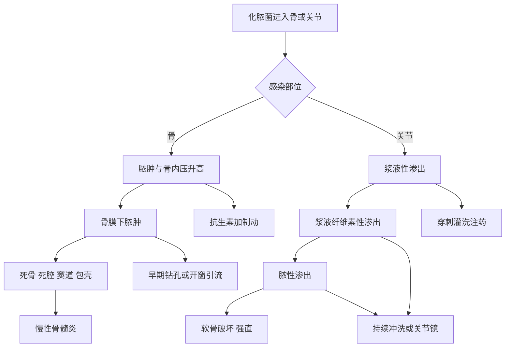

# 第70章核心框架
> **一句话总览：** 骨与关节化脓性感染的救治关键是早期识别、尽快取得培养标本并足量抗菌，同时对形成的脓肿、死骨、死腔或关节脓液及时减压引流，以阻断“急性感染→组织坏死→慢性复发或关节毁损”。（教材第730—738页）

**前置知识：** [[02-骨折总论]]——开放伤与术后感染是骨髓炎途径之一
**相关内容：** [[13-骨与关节结核]]——重要慢性感染鉴别；[[15-骨肿瘤]]——骨肉瘤和尤因肉瘤可模拟急性骨髓炎
# 总览图

# 化脓性骨髓炎
## 感染途径与急性血源性特点
感染途径有血源播散、创伤后感染、邻近软组织直接蔓延三种。急性血源性骨髓炎多见儿童和青少年，最常累及胫骨近端和股骨远端；最常见致病菌为金黄色葡萄球菌，约占75%。儿童干骺端终末血管袢血流丰富而缓慢，细菌易沉积。（教材第730页）
> [!example] “河湾沉沙”类比
> 干骺端血管袢像流速慢、弯曲多的河湾，血中菌栓更容易在此“沉沙”。沉积后形成脓肿、升高骨内压，再沿骨髓腔或哈弗斯管扩散。这个类比解释好发部位，不意味着仅凭年龄和部位即可诊断。

## 急性骨髓炎病理链
脓肿由菌栓、坏死骨、渗出物和白细胞反应形成。其可向骨髓腔蔓延，或穿过干骺端皮质到骨膜下，继而突破骨膜和皮肤形成窦道；失血供骨成为死骨，受刺激骨膜形成包壳。出现==死骨、死腔、窦道和包壳==意味着进入慢性阶段。儿童骨骺板通常形成屏障，但股骨干骺端位于髋关节囊内，脓液可直接进入髋关节。（教材第730—731页）
## 临床与早期诊断
- 全身：急起寒战、高热常>39℃，恶心、精神差；儿童可惊厥，重者休克。
- 局部：早期深部剧痛、肌痉挛、拒绝活动、皮温高和深压痛，而表面肿胀可不明显；数日后肿胀加重提示骨膜下脓肿。
- 脓肿突破骨膜后疼痛可能反而减轻，但红肿热更明显；自然病程可转为窦道和慢性期。（教材第731页）

| 检查 | 关键点 | 局限/时机 |
|---|---|---|
| 血常规、ESR、CRP | 白细胞和中性粒细胞升高，ESR增快，CRP更灵敏 | 非特异 |
| 血培养+药敏 | 寒战高热期或初诊连续3次、每2小时1次可提高成功率 | 既往抗生素降低阳性率 |
| X线 | 软组织肿胀、虫蚀样破坏、骨膜反应 | 起病14天内常无异常，不能排除早期病变 |
| CT | 骨膜下/软组织脓肿和骨破坏范围 | 更偏结构细节 |
| MRI | 早期骨内炎症、范围、水肿及脓肿 | 早期最有价值的影像之一 |
| 分层穿刺 | 混浊或血性液作涂片、培养、药敏 | 涂片见脓细胞或细菌可明确诊断 |

> [!warning] 别等待X线“长出来”
> 急性骨髓炎X线改变常在起病2周后出现。高热、持续深痛、干骺端深压痛和炎症指标升高时，应依靠MRI、血培养和分层穿刺推进早期诊断。（教材第731—732页）

## 急性骨髓炎治疗
抗生素原则为==早期、联合、足量、全程==。培养结果前，一种针对革兰阳性球菌，另一种为广谱抗生素；后按药敏调整。局部以石膏托或皮牵引制动，减痛并预防病理性骨折、关节挛缩。手术宜早，目的为引流脓液、减轻脓毒症并防止慢性化；采用钻孔或开窗减压引流。（教材第732页）
## 慢性化脓性骨髓炎
慢性期以死骨和死腔、瘢痕化血运差、包壳与瘘孔、反复窦道流脓为核心。窦道周围皮肤可色素沉着，极少发生鳞状上皮癌。X线典型为不规则高密度死骨，周围透光死腔及硬化包壳。（教材第733页）
治疗以手术为主：清除死骨和炎性肉芽、消灭死腔、切除窦道、根除感染源。急性发作期不作病灶清除，以抗生素为主，有积脓则切开引流；大块死骨而包壳未充分形成时，过早取骨易造成长段缺损与病理性骨折。消灭死腔可用碟形手术、肌瓣填塞、抗生素骨水泥珠链或可降解材料，并辅以冲洗引流和软组织覆盖。（教材第733—734页）
## 特殊类型比较

| 类型 | 关键病理/影像 | 临床 | 治疗要点 |
|---|---|---|---|
| Brodie脓肿 | 长骨干骺端骨内囊性病变，硬化骨包绕 | 常无急性史，劳累或轻伤后发作 | 急性期抗生素；反复者控制后清创并植骨 |
| Garré硬化性骨髓炎 | 低毒菌感染；皮质增厚、密度增高、髓腔窄或消失，边界不清 | 间歇痛，劳累加重，少红肿 | 控制急性发作后开窗清创减压引流 |
| 椎体化脓性骨髓炎 | 成人、腰椎最多，可有椎旁/腰大肌脓肿 | 急骤高热、剧烈腰背痛、椎旁痉挛 | 足量抗生素、绝对卧床；脓肿或明显破坏则手术 |
| 椎间隙感染 | 手术直接带入或血源播散，泌尿道来源常见 | 高毒菌急、低毒菌慢；腰背痛及根刺激 | 抗感染支持；进行性神经症状、不稳、大脓肿、复发或保守失败才手术 |

# 化脓性关节炎
多见儿童，好发髋、膝；金黄色葡萄球菌约占85%。细菌可经血源、邻近病灶、开放伤或医源性进入关节。（教材第735页）
> [!example] “关节软骨的时间窗”病例
> 儿童突发39℃高热和单侧膝剧痛，膝处半屈曲位。早期浆液性期像“污水刚进入池塘”，软骨尚可保全；若拖到脓性期，酶和炎症细胞会像腐蚀剂一样破坏软骨，即使灭菌也可能遗留强直。因此穿刺既是诊断，也是抢救关节功能的时间节点。

## 三阶段

| 阶段 | 关节液/病理 | 可逆性 | 局部治疗方向 |
|---|---|---|---|
| 浆液性渗出期 | 清亮；滑膜充血水肿，软骨未破坏 | 可逆 | 穿刺抽液、灌洗并注入抗生素 |
| 浆液纤维素性渗出期 | 混浊黏稠，纤维蛋白和炎症细胞增多；开始破坏软骨 | 部分不可逆 | 穿刺注药、持续冲洗或关节镜清理 |
| 脓性渗出期 | 黄白脓液，软骨广泛破坏并侵及软骨下骨 | 不可逆 | 关节镜或切开清创、持续冲洗引流 |

## 临床与鉴别
急起寒战高热，关节迅速剧痛、功能障碍。浅表膝肘红肿热痛明显并呈半屈曲位；髋关节局部表现可不明显，常呈屈曲、外旋、外展位，有时仅诉膝痛。关节穿刺与关节液检查对早期诊断很有价值；X线早期不敏感。（教材第736页）

| 疾病 | 起病/发热 | 关节模式 | 关节液线索 |
|---|---|---|---|
| 化脓性关节炎 | 急骤、高热 | 多单发，髋膝 | 清→混→脓，可见大量脓细胞和革兰阳性球菌 |
| 关节结核 | 缓慢、低热 | 多单发，髋膝 | 清→混，可发现抗酸杆菌 |
| 风湿性关节炎 | 急、高热 | 多发对称游走性大关节 | 清，少量白细胞 |
| 类风湿关节炎 | 一般不急 | >3个、多发对称，大小关节 | 草绿色混浊，中等白细胞，RF可阳性 |
| 痛风 | 夜间急发 | 常2个，第一跖趾典型 | 尿酸盐结晶 |

## 治疗
全身早期、足量、全程静脉敏感抗生素并支持治疗。局部按阶段选择穿刺灌洗注药、持续冲洗、关节镜或少用的切开引流；患肢以牵引或石膏固定于功能位。抽出液越来越混浊乃至脓性说明穿刺注药无效，应立即升级治疗。晚期病理脱位可矫形，髋强直可考虑全髋置换。（教材第737—738页）
# 易错点

| 易错说法 | 正确认识 |
|---|---|
| 急性骨髓炎早期X线正常即可排除 | 起病14天内常无异常；MRI和穿刺更利于早诊 |
| 脓肿突破骨膜后疼痛减轻说明好转 | 可能只是减压，感染已进入软组织并可能转慢性 |
| 慢性骨髓炎急性发作时立刻彻底清创 | 急性期先抗生素，积脓引流；控制后再病灶清除 |
| 任何关节感染都先反复穿刺注药 | 已呈脓性或抽出液加重时需立即改关节镜/引流 |
| 髋关节化脓感染一定局部红肿明显 | 髋深在且肌肉丰富，局部红肿热可不明显，儿童还可诉膝痛 |

# 折叠自测
> [!question]- 急性骨髓炎转入慢性期的四个病理标志是什么？
> 死骨、死腔、窦道、包壳。（教材第730页）
> [!question]- 为什么儿童血源性骨髓炎好发干骺端？
> 骨骺板附近终末动脉和毛细血管弯曲形成血管袢，血流丰富而缓慢，菌栓容易沉积。（教材第730页）
> [!question]- 化脓性关节炎哪一期仍可完全恢复？
> 浆液性渗出期。此时关节软骨未破坏，及时治疗渗出物可完全吸收而不遗留功能障碍。（教材第736页）
> [!question]- 慢性骨髓炎为什么要同时“清源”和“填腔”？
> 死骨、坏死肉芽是持续感染源；残余死腔血供差、引流差，容易再次积脓。故需清除病灶并用碟形术、肌瓣或抗生素材料等消灭死腔。（教材第733—734页）

# 相关笔记
- [[13-骨与关节结核]]——比较化脓性高热急起与结核性缓慢低热、寒性脓肿
- [[15-骨肿瘤]]——鉴别伴发热、骨膜反应的骨肉瘤与尤因肉瘤
- [[02-骨折总论]]——开放性骨折和骨折术后感染属于创伤后感染途径
# 来源范围
- 人民卫生出版社《外科学》第10版，第七十章“骨与关节化脓性感染”，教材第730—738页。
- 内容依据：已下载教材PDF中文文本层；仅修正断行、异常空格和明显字符错误，未补造教材未述数据。
