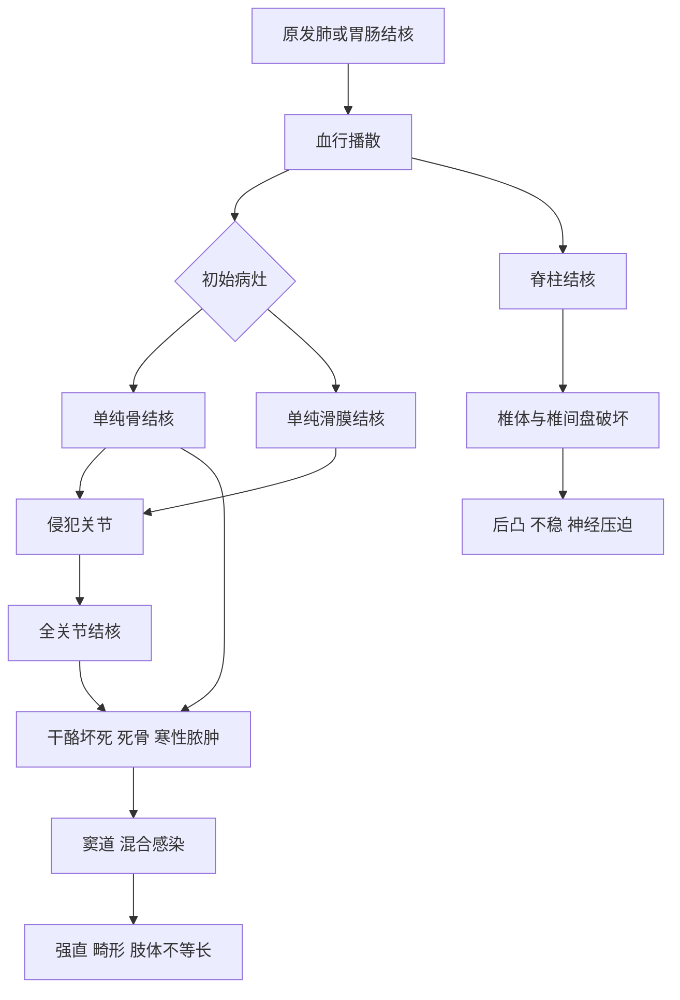

# 第71章核心框架
> **一句话总览：** 骨与关节结核是多由肺部原发灶血行播散的继发性感染，病程隐匿、易形成寒性脓肿并逐步破坏骨关节；规范、联合、全程抗结核化疗贯穿始终，手术用于清除难控病灶、解除神经压迫和重建稳定或功能。（教材第739—749页）

**前置知识：** [[12-骨与关节化脓性感染]]——鉴别急性化脓感染与慢性结核感染
**相关内容：** [[11-颈腰椎退行性疾病]]——腰椎间盘突出、退变与脊柱结核鉴别；[[15-骨肿瘤]]——脊柱肿瘤可模拟脊柱结核
# 总览图

# 概述
## 发病与病理
骨与关节结核约占结核病人总数5%～10%，脊柱最多、占50%以上，髋与膝各约15%。好发于负重大、活动多、易损伤部位；原发灶绝大多数为肺结核。初期为单纯滑膜结核或单纯骨结核，后者较多；若侵入关节、破坏软骨，即成为全关节结核，进一步可形成窦道、混合感染及永久功能障碍。（教材第739页）
> [!example] “暗火沿承重梁蔓延”类比
> 结核像低温暗火：全身高热和局部红热不突出，却可在承重、活动大的骨关节内缓慢侵蚀。寒性脓肿像烟沿墙缝流到远处，体表肿块未必就是原发病灶所在；一旦破溃混入普通细菌，才会突然出现明显红热。

## 寒性脓肿与全身表现
起病多缓慢隐匿，可有午后低热、乏力、盗汗、消瘦、食欲缺乏和贫血。寒性脓肿内含脓液、结核肉芽、死骨和干酪样坏死，因缺乏红热等急性炎症反应而得名；可沿组织间隙流动，向体表形成外瘘或与内脏形成内瘘。混合感染后可转为明显急性炎症并造成严重消耗。（教材第739—740页）
## 检查策略

| 方法 | 价值 | 局限/注意 |
|---|---|---|
| ESR、CRP | 判断活动性、疗效及复发 | 白细胞常正常，不能因其正常排除 |
| 抗酸涂片 | 简单快速经典 | 灵敏度低、特异度差 |
| 分枝杆菌培养 | 阳性为重要依据，可药敏 | 需4～8周，阳性率约30%～50% |
| PPD | 强阳性支持成人感染；1岁以下儿童有诊断价值 | 不能简单确诊或排除 |
| T-SPOT.TB | 较高灵敏度和特异度 | 有假阳性 |
| Xpert MTB/RIF等核酸 | 快速检出结核及耐药信息 | 需与临床、病理整合 |
| 病理+微生物 | 典型肉芽肿并证实结核菌为确诊依据 | 两者应同时送检、互补 |
| X线 | 骨质疏松、破坏、钙化、死骨等 | 常起病6～8周才改变，不能早期排除 |
| CT | 病灶、死骨、软组织及寒性脓肿；可引导活检 | 对软组织与早期浸润不及MRI |
| MRI | 炎性浸润期即异常，显示软组织、椎间盘和神经受压 | 仍需病原/病理证据确诊 |

## 综合治疗原则
抗结核治疗遵循==早期、联合、适量、规律、全程==。常用INH、RFP、PZA、EMB等，INH与RFP为首选；链霉素因第Ⅷ脑神经毒性不再作为首选。教材列出四联强化和三联持续方案；肺外结核一般12个月，骨关节结核专家共识为儿童不少于12个月、成人12～18个月，必要时18～24个月。用药期间监测肝肾功能等不良反应。（教材第741页）
局部制动可减痛并帮助修复；早期单纯滑膜结核可局部注射异烟肼。寒性脓肿不主张反复抽脓注药，以免混合感染和窦道。病灶清除适用于规范化疗仍进展、明显死骨/大脓肿、久治窦道，以及脊柱不稳、神经压迫或严重后凸；术前规范化疗2～4周，术后完成全疗程。（教材第741—742页）
> [!warning] 抗结核药不是“手术前的过渡药”
> 药物治疗占主导并贯穿全过程；手术不能替代规范化疗。病灶清除术前后均需按教材要求完成抗结核治疗。

# 脊柱结核
脊柱结核占骨关节结核50%以上，绝大多数累及椎体，腰椎最多，其次胸椎、颈椎。（教材第742页）
## 中心型与边缘型

| 类型 | 人群/部位 | 病理影像 |
|---|---|---|
| 中心型 | 多见10岁以下儿童，好发胸椎 | 椎体中央破坏，进展快，椎体压成楔形；多单椎体 |
| 边缘型 | 多见成人，好发腰椎 | 上下缘破坏，迅速累及椎间盘和邻椎体；椎间盘破坏、间隙变窄为特征 |

寒性脓肿可为椎旁脓肿，或穿破骨膜后沿筋膜远距离流注。下胸椎、腰椎病变常进入腰大肌鞘，可形成髂窝、腰三角、腹股沟或更远处脓肿。（教材第743页）
## 临床定位
- 疼痛最早，随后肌痉挛、脊柱活动受限，可出现后凸和神经损害。
- 颈椎：颈痛、上肢根刺激；咽后壁脓肿可妨碍吞咽呼吸。
- 胸椎：背痛、后凸常见，发生截瘫最多。
- 腰椎：站走时双手扶腰、躯干后倾；可出现腰大肌流注脓肿。
- 拾物试验阳性：不能弯腰，需挺腰屈髋屈膝下蹲拾物。（教材第743页）
## 影像鉴别

| 疾病 | 椎体/椎间隙 | 全身与其他线索 |
|---|---|---|
| 脊柱结核 | 骨破坏、椎间隙狭窄，可有死骨和椎旁脓肿 | 缓慢、低热盗汗 |
| 化脓性脊柱炎 | 进展迅速的感染性破坏 | 急起高热、剧痛，早期血培养可阳性 |
| 腰椎间盘突出 | 无骨破坏，突出物压迫硬膜囊/神经根 | 无结核全身症状，根性定位明显 |
| 脊柱肿瘤 | 常累及椎弓根，椎间隙高度多正常 | 多老年、疼痛逐日加重，一般无椎旁软组织块影 |
| 强直性脊柱炎 | 无死骨，竹节样改变及骶髂关节炎 | HLA-B27多阳性，胸廓扩张受限 |
| 退行性骨关节病 | 间隙窄、关节突增生硬化，无骨破坏 | 老年、无结核全身症状 |

治疗目标为清除病灶、解除神经压迫、重建稳定、矫正畸形。多数可由支持和规范化疗治愈；手术用于持续进展、较大死骨/脓肿、久治窦道、严重骨破坏不稳、脊髓马尾压迫或截瘫、严重后凸。（教材第744—745页）
# 髋关节结核
儿童多见，多单侧；早期以单纯滑膜结核多见，后期可寒性脓肿、病理性脱位。儿童常诉膝痛，是延误诊断陷阱；病程由屈曲外展外旋逐渐转为屈曲内收内旋，晚期强直和肢体不等长。（教材第745—746页）
> [!example] “膝痛不一定病在膝”病例
> 儿童慢性跛行、夜啼、膝痛，但膝查体不典型时，应回头查髋：比较双侧活动，做“4”字试验、髋过伸试验和Thomas征，并摄双髋对照片。转移痛不能成为忽略原发髋病变的理由。

| 试验 | 检查目的 | 阳性表现 |
|---|---|---|
| “4”字试验 | 屈曲、外展、外旋综合活动 | 下压膝时患髋痛，膝不能接触床面；需双侧比较 |
| 髋过伸试验 | 儿童早期髋结核 | 患侧后伸抗拒、范围小于健侧 |
| Thomas征 | 髋屈曲畸形 | 消除腰椎前凸后患肢不能平放，夹角即畸形角度 |

早期X线可仅局限性骨质疏松和轻度间隙窄，需双侧比较；CT显示微小骨破坏和积液，MRI早显炎性浸润、积液和软骨破坏。治疗以支持、规范化疗和必要时牵引为基础；单纯滑膜结核注药无效可滑膜切除，单纯骨结核宜早清灶以免入关节，早期全关节结核及时清灶以挽救关节；静止后按强直或畸形考虑融合、截骨或谨慎置换。（教材第747—748页）
# 膝关节结核
居骨关节结核第二位，儿童青少年多见，单纯滑膜结核较单纯骨结核常见。早期肿胀积液，继而边缘骨侵蚀、软骨剥落形成全关节结核；晚期寒性脓肿、窦道、半脱位/脱位、纤维强直和屈曲挛缩。（教材第748页）
膝表浅，膝眼饱满、髌上囊肿大、浮髌阳性；持续积液加肌萎缩形成梭形肿胀。无混合感染时骨质疏松明显，有窦道混合感染则可骨硬化。关节镜既能取液培养和活检，也可镜下滑膜切除。（教材第748—749页）
全身化疗下，约80%单纯滑膜结核可治愈并保留正常或近正常功能。早期可穿刺抽液后关节内注入异烟肼并制动；药物不佳、滑膜肥厚才考虑滑膜切除。全关节结核进展或积脓需病灶清除；15岁以下通常仅清灶，15岁以上严重破坏畸形可清灶并融合。有窦道或屈曲挛缩宜融合；完全控制并静止10年以上才可慎重考虑全膝置换。（教材第749页）
# 易错点

| 易错说法 | 正确认识 |
|---|---|
| 寒性脓肿没有脓 | “寒性”指缺少红热等急性炎症表现，内容物仍可有脓液、干酪坏死和死骨 |
| PPD阴性即可排除骨关节结核 | 灵敏度、特异度低，不能简单用于确诊或排除 |
| X线正常即可排除早期结核 | 普通X线常在起病6～8周后才改变，MRI更早 |
| 反复穿刺寒性脓肿最安全 | 教材不主张反复抽脓注药，可能造成混合感染和窦道 |
| 脊柱结核一定先手术 | 绝大多数以支持和规范化疗治愈，仅特定指征手术 |
| 儿童膝痛只查膝 | 髋结核常以膝痛表现，必须检查髋关节 |

# 折叠自测
> [!question]- 骨与关节结核从早期到关节毁损的病理顺序是什么？
> 单纯骨结核或单纯滑膜结核→侵入关节、破坏软骨成为全关节结核→寒性脓肿/窦道与混合感染→强直、畸形及功能障碍。（教材第739—740页）
> [!question]- 边缘型脊柱结核的影像特征是什么？
> 成人和腰椎较常见；椎体上下缘破坏，迅速侵及椎间盘和相邻椎体，椎间盘破坏导致椎间隙变窄。（教材第742—744页）
> [!question]- 脊柱结核何时考虑手术？
> 规范化疗仍进展、较大死骨/寒性脓肿、窦道久不愈、骨破坏严重伴不稳、脊髓马尾受压或截瘫、严重后凸畸形。（教材第745页）
> [!question]- 判断骨关节结核治愈为何不能只看症状？
> 教材要求综合全身及局部症状、连续3次ESR、影像脓肿/死骨和边缘变化，并在起床活动1年后仍维持这些指标。（教材第741页）

# 相关笔记
- [[12-骨与关节化脓性感染]]——比较急骤高热的化脓性感染与缓慢低热的结核
- [[11-颈腰椎退行性疾病]]——鉴别腰椎间盘突出、退行性病变与脊柱结核
- [[15-骨肿瘤]]——鉴别椎弓根受累、椎间隙多保留的脊柱肿瘤
# 来源范围
- 人民卫生出版社《外科学》第10版，第七十一章“骨与关节结核”，教材第739—749页。
- 内容依据：已下载教材PDF中文文本层；仅修正断行、异常空格和明显字符错误，未补造教材未述数据。
