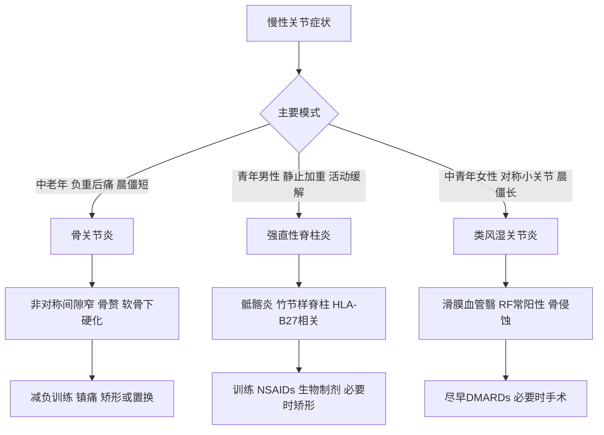

# 第72章核心框架
> **一句话总览：** 骨关节炎是软骨退变和负荷相关的慢性结构病，强直性脊柱炎是骶髂关节起始的中轴炎症病，类风湿关节炎则是以对称性多发小关节滑膜炎为主的自身免疫病，三者依靠年龄、关节分布、晨僵时长、实验室和影像模式区分。（教材第750—757页）

**前置知识：** [[12-骨与关节化脓性感染]]——先排除急性化脓性单关节炎
**相关内容：** [[13-骨与关节结核]]——脊柱和髋膝慢性感染鉴别；[[11-颈腰椎退行性疾病]]——退变性脊柱症状鉴别
# 总览图

# 三病快速比较

| 维度 | 骨关节炎（OA） | 强直性脊柱炎（AS） | 类风湿关节炎（RA） |
|---|---|---|---|
| 本质 | 软骨退变及继发骨质增生 | 慢性血管翳破坏性炎症，继发韧带骨化 | 自身免疫性慢性滑膜炎、血管翳 |
| 好发人群 | 中老年；继发性可见青壮年 | 16～30岁，男性约90% | 中青年女性 |
| 分布 | 膝髋等负重关节，常非对称 | 骶髂→脊柱向上，可累及下肢大关节 | 对称多发，近侧指间、掌指、腕等小关节 |
| 疼痛规律 | 活动后加重、休息缓解 | 静止/休息加重、活动后缓解 | 炎性关节痛，持续肿胀压痛 |
| 晨僵 | 通常≤30分钟 | 晨起或久坐明显，活动后减轻 | >1小时，95%以上病人有 |
| 实验室 | 多正常；炎症时CRP/ESR轻升 | HLA-B27多阳性，RF阴性 | RF约70%～80%阳性，ESR/CRP升高 |
| X线核心 | 非对称间隙窄、软骨下硬化/囊变、骨赘 | 骶髂炎、骨桥、竹节样脊柱 | 关节周围骨质疏松、侵蚀、间隙渐窄至强直 |

**共同点：** 都可造成疼痛、僵硬、活动受限与晚期畸形。
**关键差异：** OA以机械性负荷与结构退变为核心；AS以中轴和骶髂炎为核心；RA以对称性小关节滑膜炎为核心。（教材第750—756页）
# 骨关节炎
OA累及软骨、软骨下骨、滑膜和关节囊等。原发性由年龄、机械和生物因素共同作用；继发性可由创伤、感染、不稳或先天病变引起。（教材第750页）
> [!example] “轮胎—路面—悬挂”类比
> 软骨像轮胎表面：磨损后中央负重区下方骨变硬如“象牙质”，外周低应力区可囊变；边缘骨赘像车身为分散压力长出的“支撑边”，却会进一步限制活动。关节囊韧带挛缩和肌萎缩则像悬挂系统变僵，使负荷分配更差。

## 病理与表现
软骨先失去光泽和弹性，再粗糙、碎裂、剥脱并形成游离体；软骨下骨中央硬化、外周囊变；边缘骨赘形成；早期增殖性滑膜炎，后期纤维化；关节囊韧带增厚挛缩，肌肉由痉挛走向萎缩。（教材第750页）
疼痛最主要，早期活动后加重、休息减轻，后期可持续或夜痛；晨僵短于30分钟。可有交锁、打软腿、伸屈受限、骨擦感及畸形。手部可见Heberden和Bouchard结节，膝可内翻或外翻。（教材第750—751页）
## 治疗阶梯
- 基础：减重减负，避免长时间跑跳蹲和爬楼爬坡；选择游泳、骑车，非负重屈伸和肌力训练；物理治疗、手杖/助行器和支具改善力线。
- 药物：先可外用NSAIDs；全身NSAIDs注意消化道、心血管和肾脏副作用；透明质酸钠关节注射可润滑和缓解疼痛。
- 糖皮质激素关节注射虽止痛快，却可加速软骨退变，不主张随意或反复使用。
- 手术：关节镜清理游离体和碎屑；截骨矫正力线；重度OA行单髁/髌股/全膝或全髋置换。（教材第752页）
> [!warning] “越痛越不动”并非长期策略
> OA应减少有害负荷，但教材同时强调非负重关节活动和肌力训练；完全不动会加重肌萎缩和功能下降。

# 强直性脊柱炎
AS病变多从骶髂关节开始向上蔓延，慢性炎症破坏后以韧带骨化修复，最终纤维性或骨性强直并可累及下肢关节。早期下腰和骶髂痛、发僵，静止加重而活动缓解；晚期可严重驼背、不能平视，颈腰旋转受限需转动全身。（教材第753页）
> [!example] “从地基向上浇筑的骨桥”病例
> 22岁男性晨起腰僵、久坐加重，活动后反而减轻。把骶髂关节视为地基，炎症从这里起步，修复性骨化像沿脊柱逐层“浇筑骨桥”；若不维持姿势和活动度，最后可能在屈曲位固定成驼背。

## 检查与诊断标准
X线从骶髂骨质疏松、虫蚀和间隙不规则增宽，进展为模糊、变窄、融合；脊柱韧带骨化形成骨桥和竹节样改变。CT清晰显示结构变化，MRI更早显示急性炎症和结构改变。（教材第753—754页）
诊断标准包括：①腰背痛≥3个月且活动后缓解；②脊柱各方向活动受限；③胸廓扩展小于同龄同性正常值；④双侧骶髂炎Ⅱ～Ⅳ级或单侧Ⅲ～Ⅳ级。具备④及①～③任一条即可诊断。（教材第754页）
## 治疗
训练脊柱与关节活动度、牵拉、维持恰当姿势并戒烟。NSAIDs是一线；连续两种NSAIDs效果不佳时考虑生物制剂DMARDs。关节强直可置换，严重驼背影响生活可脊柱截骨矫形。（教材第754页）
# 类风湿关节炎
RA是以对称、多关节病变为主的自身免疫性慢性炎症。基本病理为滑膜慢性炎症，增生形成血管翳并覆盖、侵蚀软骨；后期纤维化和骨性强直，肌腱腱鞘亦可被侵袭、挛缩。（教材第755页）
## 表现与影像
反复发作的对称性多发小关节炎，近侧指间、掌指、腕最典型；持续肿胀、疼痛、压痛，近侧指间梭形肿胀。晨僵通常>1小时。晚期常见掌指关节尺偏和鹅颈畸形；鹅颈畸形为掌指屈曲、近侧指间过伸、远侧指间屈曲。（教材第755页）
X线早期软组织肿胀、间隙增宽和周围骨质疏松，继而边缘模糊、间隙变窄，晚期消失并骨性强直。关节液混浊、黏度低、糖降低但培养阴性。（教材第755页）
## 教材诊断标准
7条为：晨僵≥1小时≥6周；≥3关节肿≥6周；腕/掌指/近侧指间肿≥6周；对称肿≥6周；皮下类风湿结节；手腕X线明确骨质疏松或侵蚀；RF阳性滴度>1∶32。符合≥4条可诊断。（教材第756页）
## 治疗
目标是控炎、减症、延缓进展、保功能和防畸形。确诊后尽早用传统合成DMARDs，首选甲氨蝶呤；禁忌时用来氟米特或柳氮磺吡啶，疗效不足可联合其他传统、生物或靶向合成DMARDs。中高活动度可在传统DMARDs基础上联合小剂量糖皮质激素快速控症。早期关节镜清理/滑膜切除，晚期严重功能损害可置换。（教材第756—757页）
# 易错点

| 易错说法 | 正确认识 |
|---|---|
| OA也晨僵，所以等同RA | OA晨僵一般≤30分钟；RA多>1小时且为对称多发小关节炎 |
| HLA-B27阳性即可确诊AS | 它是重要相关指标，诊断还需临床和骶髂影像标准 |
| AS休息可改善疼痛 | 典型是静止/休息加重、活动后缓解 |
| RA主要侵犯远侧指间关节 | 教材强调近侧指间、掌指和腕关节 |
| OA反复关节腔注射激素安全 | 可加速软骨退变，不主张随意及多次反复使用 |
| RA类风湿因子必为阳性 | 教材给出约70%～80%阳性，阴性不能单独排除 |

# 折叠自测
> [!question]- 仅凭晨僵时长如何初步区分OA和RA？
> OA通常不超过30分钟；RA多超过1小时。但必须结合关节分布、实验室和影像，不可单凭一项确诊。（教材第751、755页）
> [!question]- AS的影像学诊断门槛是什么？
> 双侧骶髂关节炎Ⅱ～Ⅳ级，或单侧Ⅲ～Ⅳ级；再合并腰背痛≥3个月且活动缓解、脊柱活动受限、胸廓扩展减少三项中的任一项。（教材第754页）
> [!question]- 为什么RA应早用DMARDs而非仅止痛？
> RA的血管翳会持续破坏软骨并导致强直畸形；DMARDs目标是改变病程、延缓结构破坏，止痛药只能缓解症状。（教材第755—757页）
> [!question]- OA基础治疗中“减负”和“锻炼”是否矛盾？
> 不矛盾。应减少跑跳蹲、爬楼等高负荷，同时选择游泳、骑车及非负重屈伸和肌力训练以维持功能。（教材第752页）

# 相关笔记
- [[12-骨与关节化脓性感染]]——鉴别急性高热、单关节脓性炎症
- [[13-骨与关节结核]]——鉴别慢性低热、寒性脓肿与脊柱/髋膝结核
- [[11-颈腰椎退行性疾病]]——鉴别机械性退变、根性症状与炎性腰背痛
# 来源范围
- 人民卫生出版社《外科学》第10版，第七十二章“非化脓性关节炎”，教材第750—757页。
- 内容依据：已下载教材PDF中文文本层；仅修正断行、异常空格和明显字符错误，未补造教材未述数据。
